# Reported Addresses

This is my second time to submit report. Compared to the first series, in this report, I optimized my screening process, modified the data source, and added more fields to prove the witch address. You can get report address here [batches1](address1.csv), [batches2](address2.csv) and [batches3](address3.csv) or the following.

```
0x697e20307552031db4827402cb7a0fac972e3fce
0xd0a68fde37cbc8fd805cbbf5c12290076e9ccbbc
0xc986406082ada4eafea5e5f2781cafdd5e8dfffa
0x6dbeaba6692d45e33269acc6f94c3ea6aeade023
0x48dd6d2c9ecb618778dbb2013e529965f83dea60
0x3175b223164b4666fb99f4a129ab1709b2f19f59
0x55f9d731a185ca0c213a0c0e58c7cc779ea3565a
0x19e174d575747816598f5c2f86ab135c345bc735
0x17e88a26be6f4b5ff2fcd35600b3e2eba942a6ae
0x5e7a8511037807f961586cd60c107ce44cc8d9e0
0x33730c77cb29f447937a6b09831a825368fdddb3
0xfea139000369723c9ffa27ebadeb64b8ff51eb77
0xc86d42fee323b6ab4e67c87a62a3783e3ad953c7
0x1f988445460a9381b1d325440df9fa9b6e5b76f2
0xea763edf5b28340af97256e750911d13fe66aef0
0x417c66c754c0181d8b02772a26136d79da385f9a
0xd5b8db1f98970728f261979d05ed2643931fd31d
0xa9d78ac4b26efedab7889d00636ad35b03233a17
0x525c476e038e40ce6fd49271928b29fded5ace49
0x2396e0564b896507cbcb3bb1bfd0e9479b28a59b
0x2b89f2a47687124524dc9be2494201e236ee2d26
0xd73fbe5344631b6445cd8ba626a0a850dcea916a
0x90b615b4552b7a2088f80083f9646e9336e6dadf
0x318862d27453e37265970e2c67b6a889e51f7226
0x040e5f5ed8e4c53d1a9a5d3a9cce435b4fe79157
0x240ad957f212f015210d30d06eadfca99484a056
0x1ba56e4736aaf9ffab7cdf34b1cc6fe5eb9a73ca
0xb40837877fd04d5caee851466841e098e6505559
0xfa2adc9f6039e02ee1fa72598d485d04db0bff5f
0xaddf280f3e47eca9ac1818d9adeb40f10784e4c6
0xabb4d536beef7996e1faf2f4baaa080f857e5d7f
0xa927f50cca9b5ac6d636bc4c87f8c747f45c9b6d
0xa1d7144a6a0840f7a52c41b6bee2b7b940c5d98c
0xc2228c21baeb31c935aeb914b6e9c3825a8354f1
0xcf2b85b2e9d95899991c22ed2bcdaade3e858116
0x88392bdcf6ac9d7c750e78c07c1298235650b815
0xe498ec4bec63d8b704b3ac977beb45f41de49b02
0x8e155249b87576a3e01eec7d12cdc845f3d940d8
0x07f955ed42b71e3879abdfabd156e900dd966972
0xa849acd86fd689631e435cfa988cb1a7cabd5fd1
0xa4756dbc1ef33b701c081691b8f44c67086d760c
0x9001bb9f6754cf841f238da6ed55d0853a54dbd2
0x3bbb3e7c8676670937a9cbf5fd1dd2032f1a6e57
0xd5aad23c82a41139b47c8cb2bbfc4181af827153
0x995a933eec89da9d8b2994c4b121f68c7bf7fdcd
0xb142c8ebd71aa5ebc1f200ba96697a16e3c5aaef
0x9368eaef329353dd60b710f84bb8005b9ef89cfa
0xd51342bb4f723bdae875cd5317aea0a894573220
0xdaf5798aeeb63aaf21ff016737af99f047d375f2
0x50510878fc0ffacf551ba3d5c729c844739b136f
0x1d1c8dafbd08ceb506a851576efc6b8ba649b7c0
0x1b928998e427266b12b82b61ac0aade15e5f4f9f
0x4f70f4c24d92d8b882e10bb0b6be4ba708744239
0x6c67301dad85c6a5d7608ade8626703a2c815435
0x87f6df4649348b2a2d5080a37854a0fcfb4d0007
0x2e71bd78ba1fa9662a90f0f4239aea66594d1635
0x92d3ee57db1bda20ebe99b4094e7023e1382915a
0x04852e95f5a3315cae52d0e9da715a77cb116d38
0x4c56e5d899936be5ba9617d9f925096f6699cf52
0x9d1c0bd77ae04229a10396741b9c324d8fef70eb
0x35b9119c61d03529a6213795f0ffd4d8abc9de45
0xab5f6eca18ba34ab0a2a1e15a68cc0a80ac34069
0xee9376c78d810527110fbcbd90acbdbb1c7a22b4
0x6cfc91b34373e02610c2c13e603cab49e3677d5a
0x8c8779c2917938d82eb630595567d709e03af661
0xa38d3067a3956a570509ba558b7ae46a6e1cb0fd
0x653209264c5605836bb47592c3058c50d64f93c3
0x5c9ee0283d53e6315a3f84f933a22c3b45eaccaa
0xf2e43191167516506db05b893efed857f864a27f
0xa7290f443357cc756b0dd0cbfbf86b02c667ed14
0x5a173e082cde1ed3a821fe9d62736d2a3144ecdf
0x0aa0fa8ea778aace3df6c8c7e24c263954db3b6f
0x3684502102771086ed028b3bc3337684c16aed86
0x4d093ff3182299d60413033a4774fa7a9b531555
0x4fa86d05f17f2c5050e146765024d776a44c8293
0x9ef17beccd7eb6496e01bec122d17fdbd60cbfd0
0x48758aa58fc0c1a21cc56447a1cdd11bdc7f3340
0xe604c40ef8def14f3cd5f5dbcaa75aee2e56f1a3
0x50165d630c39bd0c2040ce31e6171bf2b8b6ebd8
0xcee1bc7e395d52af6933b146cc9cf04bf2f7541c
0x4c6483f8b909ab884b381335440e10fd3775ea39
0xa4d008f5cbb65feae7575f0009a51d7e47f5be51
0x65ec3dab8a7d9b39d5e79cb575745746b29eb207
0xfe7fa9dbc57ae1152650ad56039466ea2cf1a65a
0x93c352ba6575a4649ba7afe889ab08b4abf81117
0xb45ac0a61b26e68df522534fe152e1d3c808422b
0x8d67aae0121127db40c07f2b982bfde5041ccb82
0x99799a66890ee03e14f112c998cb1e4576f9c2a8
0xd6f69350a6441f5e37e6b7b300f4e271829db308
0x5eff36d267e9adec97e1e284a28b27d2e377588c
0xb03af5a62d96d6418c66c4c02d24bfb45b96751c
0x4e87bb6912cb0125df2b56118485993ef3a3c076
0x80f8f4848654ef293b0385624f1e28132b06bc60
0x7cdbda7d3e5c6ae93f6109437b3ee8b1b0e09104
0xa58658eb0716752fa7b532bf1efce3bcf62a68e7
0x99a45bbc4f9549bcf9436970e2dddc5c6b37353a
0xa482078651c48eb8803ebfe1ad1663fd91234047
0x1422759a335a6c0a75fd7c79c08e62b9f771d69d
0x85f3109905be123f0dde77b894c3e4e26408ad4e
0x16ad2a54d03ecf4aece4882d14ce6d03408cec85
0xec7f1d851394b195736ea75b8ce35e274d237050
0x2aa633eeb8d870d2af2ffa0ca314d312973214b6
0xf81889941ac2ff919caf4d2f25e8ac7edf1283ec
0x9ff5a978b220123881f1b69097085af7af6f4c6d
0xa52d0dfeb2eb97646a0b26913e86d53885047c74
0xae3d5f32b24a65f7381bf4d98f76d3cc4781b44f
0x9461aed5ecd028eee7557efeba7b65b3e0815afa
0xaf13e7fdf99dcb54b848d25b72dcbf951ebd9642
0x9702ad207e95287c801d9a4f8890883f5312f73c
0x29a47e0c85d8fcc4a051a87293b62d0037c3f4a6
0x7dacb08e5f7c5d84a6f087b2cbc5db8bc5cf9cc4
0xe752e22bafce245e860e78d560a3d0b068a691df
0xdbd4dc639503368db0df435d7f8bf04cbba9f789
0x28549ac56e79638b8ad6a82206664a700066b023
0x8da86626306d85eb9de811682ec0a9b63c287671
0xc02e65369356a78be16a8df814b1b1ecba0cb4db
0x0d1a587c8632c1faba38394bae8318247a64d281
0x9894b2f3c7764696a3588b3422804961a38b5054
0x58a6576677907b00b1d91ca723b6924794786ec1
0x06dff4d200c0b5537fad91a1de5f9264be5702d6
0x9599cc6c27663862272394db8d848d3b58d04f57
0x940274c08172073f82ddbe6e42989d3e2a85c558
0xaece09c9955c4d766ab04391ae1de5ddf54cb450
0x638e3f582bdd161bea895c7f55afe09608930ea2
0xa2f93f344f91549e738bfa9ee955cd3f6edecf7e
0x84a8ae5d9fedf527310f85ce771516b722ce9bc0
0xc58d430b1acb20330186c009ea3c7b17eb9ba846
0xfb7db49ae2762e7f927bb1dbb39dc3ea6d694d48
0x207f8013843d17ea6a27a7b994a61dacd503142d
0x2ddc66c815750ab631745c7faa37e7d2bbfd38bf
0x282a0d3ebed78857d92537e8e6754ec17064a788
0x2f5bfbd9ff27f9d4d42df2076b959006084b3b6a
0x81712e5131c78ba6a79ba7706343ad3dbd7edf67
0x716e7b2088385f86813f8829808faf098d93c0b5
0xc93ebef581a67b0b572637900354662e36bb7941
0x746e310cf7f59c8b08b60c6df1ebd667760a3f44
0x76cd6679d02d12a03c85502395a220a58e47d95f
0x70e7f1c58ba42dd1d50584185032afd0d4f0e555
0x4658a5e518ec9b54bedf335c84e2ce38e162fd2d
0xfe418d7a7b9f60902a0591af16fdd4bf717c30a0
0x4af3bc9e5c92b0b7a13225e2b9161f5da5ab0676
0x73bdf0bec2f84ecf3c65de3f64753a1dd9f4d41d
0xc8aa6f8bf59c3d907372a2f9263f13f207c86e75
0xca92862550eaab06315b966aa87c55a7a22cfe89
0x1748c9e0b35314083cf2302a4ef9e67bd99857c2
0xe911fcb49c76fe6a88d786551f31d16811be2845
0xfc482b72f9aba3637e9fea60ce494648139156a5
0x3e6a70461b1b8f2264b40f039707e8fe22d48afe
0x8b8fcd84d0fef83bd54e0922e8f2d2e0d51f1701
0x4745bbf5388f0b529e45bf0427ba604bb52bdd86
0x0858812bd055d69495b5de5992db8b7808b9c11f
0x842a258f0e4f339e672ecbc40a98312729273ac4
0xb3d04a2bad62cd5425dfd9a78fb3f0110f9f64e8
0x7f04f2dbb652f22624325dc006977052477aafce
0x2ab6bb776cc28c2f9da0c3cc505f5412e0e56ed8
0xe0be082615836f81a1b941e86de778d731d80ef7
0x1ecca8f872b78b5d74d930b437930050ef2e95a7
0xd5c56cb9371f4ab1b8d35560d1dfbb0c4ef9b188
0x6e5f366e6d5bea032824ffa0a771f8751a156fc2
0xd7ee3892149c256630869e245d188577bdbd676a
0x99383ac8e8cbb822f6b53d04329d6c8a023f5240
0x3dec0f3e55f2077077f8dcd1139bff89f1523c91
0xb9ae1bd2ee01a20c7b7364961e4866f2353b7560
0x5a22d258ac795dc8953a2cfbd1d66d7a672525ca
0x6a376cf0a55b128e2160f70b9c3b5c9ee775625a
0xca3b9d975426e6b8ac28159b8673d2ff27d04a71
0xb74d12a4b1e025686f072b4302f43a2c046ef86e
0x8ccfbcb87e8f5b1cb51ed49abba66c0c607da453
0xaaca7eb4bb63af64afdfa8371b24ba091b914536
0x7a976a9a33faa05523b37c0a83d6630b75049c32
0xfef2648635f375d36f24589823866d89e49c01ac
0xf03b4caee7d2f936539c93fb0a75875fda5074e7
0xae0b83e38077ec561375237b5895fff84bebde15
0x6e49967005f8ce70fb3bb76596e863657b4ca8d5
0xb859d5c9de0d2962282eec8c6cfdb155e297d326
0x2c5fd2e12a3f959baf4e25a701111ea3c0b795ba
0x208a9bb512029239acb4cc7834824c8badbad316
0xead35a2e4d6a6c7f15517ca409c2f29734d50356
0x1b3731479bb9db0576e3b0c75eab8a3f581821b5
0x97ac9bdc6b169bf71dcf4968e778c56a54d4c6af
0xbf54a6f732cb062a2ddc177dc385685812b53ec2
0x796597a2f7d43515811e40c7aee15bb5fe0fa2d8
0x77b09c9cf12221c9b97153ddebaacb68fd689546
0xf60d27b9c2098962200d707f491470bcccc49006
0xfc79f318b66ed5529880c0de3d6491601458a170
0xe61458094a0be9fa2394427ad688d10b73b5d466
0x9d816e145e925f52d7fea2be8d56bc07a7002d04
0xddf8d27deb1094b726881995b1249b04f4e3b013
0xa8710633087dad42767474cd87c538ecbaba3055
0xcda5da14611dc814936629d97299a9404247995d
0xb4a1bfde99858a0c9dd86d8a0029e894353ac699
0x331c34c797d21ea2eb9b6552060301b4dfd891f1
0x69302fbe8cdde288225c59075db929e6ab80f3f3
0x32fb8d16d0871450ffec17afb85b88c0c51055dc
0xbb2762332280e88cf11b9ef86fab08312e1221e7
0x66648d2115b96a3fc714a85ef5906ee2d9f00f5e
0x5d2dd2a50526e623f5ef1597d76c29c81b385fb5
0xbe938afadac759ad37d40ab4c1bf01ffc20b9431
0x91132ff31acf32183cbf61967a487ac8b011c03a
0x160f86af28133feb6b7b39d8f2b1cb70517fc77f
0x14e41b26c4d46bcb6989ca9e9acb169f85a072cc
0xed35b6d4335c863007b8c4aafe6a356a498c8842
0x11ea5b5a8c81b000e01821861453dabda2614fce
0xd1821e2bb4c34544111f3fb77457177a23836695
0xdb5319a63d5117ef98e2875351d988754c1746b5
0x59b36032c2609c70a7731fbe1bb4093a16608c50
0x6cd0365900e70cc4d15d40fcbd617aad7281bd5e
0x1001576ea66f1da4e320594f53cb37a4307f4ef7
0x8c2934429c2c0438858e95b9f458a09ab0b6e485
0x492af0226b3405d98629ab420f8f3f9f8a80b01d
0x0e56d12bb358e6685d7ea3fb428e518bd4e4850a
0xf670c59a70db7bbf3470f8c0d4a8c38ada922ac2
0xaad086c2945335fac4ff5fc3699675e268b46226
0x43e736b115e629df4950ba07baaefffe0bbbe486
0xa1a7426376630b4657d2478c365f3334ee6cbcfb
0x07a81a8dd5b07245d60b4e45ded429e833d5a9dd
0x870e21af8ddc5699d62c99fcc4ec9ed6a57d4822
0x1b7b420b9d9d4f099233bc4e37a998e9263cfa17
0x5333a50bd54dc37651577164eb7bed158f688bd0
0x31fbeb22baca608b308a21879a45aae14a892422
0x5915433468d9180211fb05cffc38849131ad794a
0xa2ee504754fac645dd1e912ee6e04e5ec37d6228
0x9b1a43821df89a16938d4ed1daa4b879c0860950
0x334f8a3a285e001c9a825361ea04bc5cf0c3073c
0xc17c51d5a3038be27c133b9036d35f92b4ae58e1
0xa54e9853ecffb4dd09cc7941a76f6cd01c1cac73
0x7532ffa099d9cd3cd09671bbb16739aaeb81aad0
0x40a4210a72198e107ef45437991d3c58e0f53716
0xc242de8eecc6e45a7035e0da8039710cdd092c98
0x478b80656021d32cb887e0925b7db5406c4dc7ae
0x38be60b962dbffb8db77d878d11f4f30f3d0a142
0x87ae29b6ebc0e593d08ab8dee40de69c40e0c29a
0x6dd5204c6972c658cea49cd237fb17bdd182bc8e
0x696f1da2fe2077bea334e4238cd72d2af8330d6a
0xd3ad1969557cbad2c217433e21f534c29f61df7e
0x60107a547fff3da733f5a77bfa9d1eb683d8b57a
0xd31264fa111951919813bee331e5d1a695f3eb76
0xfad5391e5cf0cb192ca47cd0931e96743039d934
0x3151a4679a6463662ca075e2a8c96019e462f4a0
0x5db353a4dfa6f750cc41d5a1ded593fd6d50a921
0x1be15e7eebd3879b1747dd42b938547a1525ff3e
0x73413a9882fed4e667e885fa6a763bf14019e680
0xb1b061036dd260f6d5464c046d21ffc4337bff39
0x528fce6c6c688f3899a5dc07bd5cba341c7b1f4e
0x26dd5649931e761b1e87d026545ab5daee6c176d
0xeb1436f9fc851c85e2c791a82e8630288fa1dadb
0xfd81ac579d3eb45eee7154515e723c6205c5ece4
0x5746fb0d34c3dd5cb952cff84bd683f215058b5e
0xda3832e8a04667fbef7c005a3457f68d1a303219
0x51b7e85948cfdc83d50fb8d1ec1654dbf92e01c4
0xe1a73d513c1a880dd87c6dbb170d6b8c76735912
0x673394b61d435f8d9cd410123c18fcfff96ccef9
0x49d0dc1cecbc7f73309d7e4aad14786ba55ff4c4
0x62aece72cc4fb6da4472d84b9b87716b4043c012
0xcfbe1ed16a235f7dea2553ee703938dbeb75dce8
0x7087f76040ced95eae15ba34c177585d8a2116e2
0x54b642fd72ef808298cd995d7390d79bb818c293
0x984fd45dc339555a35a67fe26049cc3624f67d6f
0xf6a1072c11969d590749bf53d0e6deaddf8cc3e0
0x8d8b9630a18bb1f25d9614e178bb17ab1a4bf394
0x246fa4419ad4bcd8328f7586b131d5908d345f20
0xfad3982f6198e596f4f2495f8345862de81542ce
0xdda3a6611640f3c2aad929c336dd347735a1a75e
0xb45c7c578f7321bc068d4a372b74a104fa844edc
0xfaebb30e88b9a820d48290be5413dacf08821720
0xb720da9d4f32bdcffe8df43e2009853bd88e9cf6
0xf7f2a734c9d542bf546d6b767e88836d6f009ed8
0xf6ea1f5cb8712e65968f10c48d2d65559cfcacc4
0xe1bd8872c3be39ea90330c75550ce4d9b4c874e7
0xfae40c019394111b4b5888b70ed64285f09ce2f0
0x21fbfbbb5ddd2768bc4cd449a67dd2e37dd0c5ca
0x17e79481b8c398a7ec3a0872f1e8d84d159edc35
0xe4c6385bf269b0358d3aab0a924324959667f02f
0x5a63718f0531bb8f7d2c3cd580b1180804c40e53
0xeeb92aab70e301e77c290f1a0265cc8ca968f6e1
0x6fc7225182b1f25b6dff2086d7f06fc05e4a6924
0x371c9d7f056bb75970cb7b46b15d6c923bd66f6b
0x6b146f6041c9e567816aa54f8b464a3598392d19
0x4f7cc63dfbd51246caaf4cbe83d538a817aec33e
0xe22bc83414de4d99a44aa6b33aa92c2ae0c256d4
0xec9205d9eb4a552a3d611339674aa99361adf72b
0x4423c8a816b94edecd208c96e824f8834d163283
0xf81750bf3773a6866a8079969965863f5889cbe0
0x95f680bc39a2577aad8fe5a1bb55b57dd600456a
0x67a6da86503ac04c602fda35bb5ba493a39317eb
0x66613a16501e4c81c113687d0e9a84ee6297ae29
0x85b54237263e37c0f6ebe0a7c426c06701cf318c
0x89f8b41a5e4a52f27585b588dd6b0b8f73a1f04e
0x783f67dc651b4059e4e1948d1cfd98b406aa93da
0xb113fa45991bdfbeb22385222fe5b013dcac1c5e
0x061098df8334f271fd472607a4ac88513d4f771a
0x4c457bf5099c55cd942a8adbe662ab374703cb67
0x4457df6cb93bbb30fc9da33cc8fcbc747f551f99
0x482ac5e2b92eb6c5dd0215b37ca4eb1bbc15f8dc
0x61bf6972993fff4b932871b69c32cc26cc192365
0x873bde8fbcea496e5a568abef6a313cf99479f6f
0x2e01fb72a065e4c071a23d60986ea13f1f2c7428
0xf60be13d7b10c4d69375bd78db8e0c144f041008
0x6b0a7a4c2adeeeba7bb9320605c6067d937be2f2
0x672d2eedd9f0b24d06889f1c8d3630d2d2fc920d
0xd0c13f96cc283ea1bc01f8d117c0b6a89f51ed82
0x4338926d38ef451d403fc40e1b6f0b7454acf45b
0xe7dd1a9a070693113b82cf790ce71240519d0044
0xc1a62bce3195b58688745065d51919e65a91ccf9
0xc90e9c217b6aa364b33bcf3c03321309e4e3a541
0x88501fc42b28f08417b1e6631c2d6934f0127f5d
0x242abed49ed1cf7992b1dfbf462520535eb9c4a1
0xd24dd7a1de0a6e2a111392790145a74df9188869
0x579c4503cec9aa2b2a0b5f8391bf162496f8d8db
0x53afd473daf8cebd94b5a6147b3c3079511f6ecc
0x0d1b9b0fdfe960d79657eafd8f3aa3cbb7a3dda6
0x1ddccb33043a705c1b7bc1a30bd6c8b1e8c4547e
0x8f62180980aad40b8aa65a1483eda08510ed3043
0x99de45472a9c7aee502055de22e57dbf5ab109f9
0xab942f81b907120ca23b69c34c6d0ec998e96968
0x64d40e1f3037cc96d2b657f0a8475237acb4a2bd
0x4a71e4be7e2275a9d6618b7fe78166c2f0ff0eeb
0x326116b73b01c14b0d48fdc7a47574fc9c040d37
0x1ecb0752d2ad79fff7a25ad6f5aeaf448a47026c
0xd572af0611ae6385ba688ae5c0e4edded7c0b745
0x11d4d081fb22a3ccfb528fd254246c6b04ccc9e7
0x44570f8e335f7d033a1d2de848e738972618036d
0xc6b8d3e0af597e0007a36da7edc7484b53cc5abc
0x9bcb449344903dc7c3d95952aea9e4c9b3bb77a6
0xa2229bfc558b5655ba3255b6d15442e38d5052a8
0x28c7ada134fa604b394b723e5e54090f1c3e18c8
0xa56a56b1f4adae22e61dfcf64b2b11796bfb910f
0x8eb921c5d38dec6971cd53875a4632773413a9c4
0x0143ae1931f592b49beb011f813c310f8d5534c4
0xb1d2b985d6fcb9288bd0ceca8fa5c34d534a58b5
0xd5cda11049cadb3c8325d513f73dabec80993e36
0x6cc5d1519f926672f50f4d82ab242a9e950e10a2
0x8370261bf3197cbc200c6da4422fae873b777165
0xd0954b015d8cdf4aa6dc2175d5cfabe62e11158f
0x1d8c2f0a872096c7000cb5d0646a035a17c60d91
0xc128635c0794034e84515e2bf66e3a6c714d6507
0x0f77a68807926e8fd5a42b758213f9bf414c5df1
0xaaa8103f3c4475f404bdb491069e85e47b30b619
0x84fa55923819c08d6271951d4344d19a2da814a7
0xa2921ef0d8b995c76addf407ee03a3470fb2b63a
0xf2962e14a09b4869307918f9aca23e20a53d0204
0x25a750ebe5432d0d0defdd024c291959614c3244
0x783f13206db107198fb154f78ae5f8b2e1460785
0x53aac885f04be5f402bd204c9dcffa486ed099a3
0x9d6884c0db24049b9a011c5d52ce1ee6e4bb253f
0x1a2d1d943e8198cae1c1c1ed8971443df0d10b85
0x9ccefb2e53a5971d9d413deb62ea0f012a5b30d7
0xd699fac8d0db48ab25d4ab2507cb9e6ac43b807a
0xe989ca5e60e5b3b5d141f4912f3751a66511f3b2
0xaf8108a72a0d3c6c61ce31bfb31d32bc9efcddda
0x32ecee9f553fcdcda2f85f4692b135a11ce4b4b4
0xafe81debf284f9ac0d194066f65c6bf12bdb275c
0x3eaa71124c06a46c70bfe6cb497a0cba6249b080
0x4d7eca5f9c09fe81cd421f63bbd8bcbf1a03a2fe
0x07a75a98b7afb77bfb191fcfa2db89d56b92a534
0x886123903d12db653a72167615981c071a8993da
0x402c7b576b11e12923b0ebe3e86398163db74d86
0xb8e468c1182afdfec5816f752909095516103aca
0xf1922d13991f18fc778894b8af0c8f7abb1fb00d
0x537c7c5b6cae5865a55d4a96a1b5f89dac54a424
0x89c998fbd6ce30d4d5c6e361178cae7c87f7299c
0xf3aeb1705a77ca8f0d9acd54f1f8653d250367d9
0xdeb702a6519c52efaa3394a27f9aadf6c3c0f84f
0xaf470fb8cbc2a58b478674b24e6fb33268ce7e9a
0x8f733f9aa9c245fb8bbea64c21df2d7b6d3dca98
0x52375b659252f6afbbd17ee0babee37ee5bd6189
0x8061f0f68b55d4eab045af1d7b0eb125fd4fa48b
0x42a64a3a7eb64f336a91077f6e246bb7cc6ae0f2
0xc97f6c62b4ad79c7f7220c3d55a8834c99778d82
0xf6791029c6ea7cd2c1b49cd91571166466f06cfa
0x046b53dc075cfd5bd5e3af0247f9e153b81b057d
0x5bfefa37c209a5ac823b2011aae48e3539ed0732
0x807c576780cb2f0614dd0bceaa4a7fe933772a47
0xa875f2b108785481806ed11af977fc09f90eeddf
0x1c8fb9af76006819c3f89ec3e8762bd96c80a276
0x1c9359bae4d367198e86177003387c7ae649f574
0x6ec56b665c265acb0cbf9bf5baf11ce42dc4e3a9
0x22ce84a33f292c8328c053c7eea9ab065347f61b
0xe11454ec447dff199d9bce2f89edd11dc8e01952
0x0771610b17228c263e303852b2ef0e1be8cbc405
0x1b0de82be5864af13d8897fd35cce115fdfa52b5
0x8c69946c9ba1a0d066d80f710b4deb422421e0ee
0x9f9f05c4b653de7e08b14e855183be09c5d4c95b
0x3650534542e4bef668f52651784b1dd251159c40
0x32caac467333dc9657dd6060055805780784b82b
0x3fc095e87ab23efe781516f09dfa2f303ff15643
0xf3d1fe135da99a75d182e48d168c9716fd217443
0x145f6b101768a36c609be995c46920c031b417c1
0x402c5322f21f9e98a3e2036b9ed3f1eb537babc5
0x207e3b1794c5bba2f930fb3e14122bfecbd8bd35
0xf797f0f0085628c01259b1bd554ad8c497f8ac6a
0xaf6511093c14c387d9c4529c56b2fec70617b039
0x296032b5b3f0d625468130d09ea55cbdae0c08d2
0xd3f04d15f69e5493e0af914bf5def1d4b387e03e
0x535891d47bef8c121331cbd71c6722c6c4725e3b
0x7c314ed299cfb77b9829503ec1ce81331ca9385d
0x7d089a65d7f25635164065d43ae83149ecae781f
0x9d654b9ac854dd62cbef80905eef5589addf9c94
0x2c1c65f45e3003633d433f8495765f1b2857b814
0x9552b0e4c746664d667d588e57e434eee57e048f
0xac95c680477a1808ffd14f61c6a590936e051e19
0x8ca5764d10c2fb70e89b0aca1fba3c3729afba93
0xc6db6f6065fe9d6ba31b0b5f76bd7fc51511d35b
0x98554966afee26f53fe71d590a5e657fbd4f8420
0x83a2aaf9cec4d0bdd13bad478f3043ffeb8ac118
0xd53c494d486ea7bd1bc7c3e323a5006a1bac4e36
0xd3626a02904e843ac88e8afb462fc3b7bef1e036
0xd1179b6db46d3c1c2a09ce1851ca0ffd30ae21c0
0xa63f6c60220eb5a99ae5739c1370aff5624d3b8f
0xb69dbf3938948dd361fa83d6c8297243c96c2c6a
0x1d4e652e4b983b40039bc684e274a3c2f7d052d2
0xbb745c0b55ee5ee7457de0fbd06bed1badb4af7d
0x17049c68a5fa6b5b9a06df21b1e4d8b7fdad193d
0xe1126fc7dacf8a20f4c7baff9ce0678a7e4dee4c
0xe75cb5d9cc0d663cd131fae3255b74065f2cd5c4
0x6140e6339c5c745d47f9e75ec9ca4a9dbdf35f43
0x35a8a6128a407a3229902d4e70d883d5ec81c6a9
0x4067b487fd9fb20895e85d86555473a8384b6ce1
0x54ae784a5ab5cf81b45203c23292ec1946266308
0x41637b7ed6fa6e09a6ce142f11d66c4248869d53
0x368469a6f40e6e13c91686dfe87bdb5f70943921
0xa1279ff72072dff4848ce63dec2a4ea645262165
0xe3dc2de7a8846c095bdc73f10f83797f20072ef5
0x27110e212f3abca6bbaad3d2f48b3ea1e430b68c
0x0e57fd857acf8d2a94d11bdbd52d2f6b5cc05b8f
0xabfef55cb069a37c43dc00bb69cfadb65fcdcd06
0x279ffcd7d3e136d03c387633c289f2fda6f7441b
0xde3c799f017e6392344d108d48c014ef03104a39
0xfe18d4080993b22a44b79260091346642805b305
0x4a5a6c592d72e4a7166c0db52db1d52e9cfc6bce
0x1f2453715673ca6cd77c8a281806becbdaa7168c
0xa6bec0d5b090823a31418ad64d2df8b8d2beec26
0x626186afdc0d8db93f9b64a95400cd53b48d0bc2
0x4196b156224cd0aa3bbac0e25282d6d84207e2ab
0x8093561245e5b69b5f36084c8cb6c07cf3851031
0xaec6e7a8e2c706d6b92ed091e472aee366e77ca1
0x82029dcf365a5d8a878749a46635c0920b727888
0xa3c9bd62137c77ce103865744739911f124782f2
0xcaa0207564311f3767f8544d846d871c05e0a549
0x4f4b9b48e290f6fa390302bc0c26decf9a4b4309
0x7f4eba4382572bb111ef5593e7ff720971276a2e
0xcb8307cb12e869cbb220921f2f7bef7f49e619bd
0xd77d847e7a089397d911861cfb76cf552dccf8f1
0x39b6cc2b953288be70798be3dcecf97e4335c9da
0xd9ec12061d050df673e80adb197723d17f0af168
0x177a8de5e0e448ee8b93e7aca9825f83aff0c852
0x5d9118a775c7e9ed7699f893fb1d2873790ef703
0x5e42ab37ef1e0d06f6c96ebb5953f266369f94f5
0x15f989a3771ab7ad42fe93d647ae8fffed044db7
0x9c1b9151fe8313e42121d0662b7c67c6ae3256a8
0x7b9b2ec137e6b596b1f5db9c644386be66795cf5
0x52b2cb3ba1f894b524b4c76df4b4757f7805cd44
0x5fadc35d867615e59024bf3357682ec177d4c44c
0xd412dee7c26e1b71fcfeef55fee81b4240bfd4a0
0xe63914f27744d9f41fcb879ab9f2bae728ba9856
0xc8f622bf737fd987cb3bdc3e2a642f62d8aac0f8
0x691f37ec1e14932f41fa09cdfec4efdcb9abc0a1
0xab0bf1b800d7ed2467c14bf35d5eea279fa311a7
0x9fdca0bfa20fa2403de5f009102292d160bb84e6
0x3256581bb340448e69d42e70505156a0ac8ae3a8
0xeef6a4b8819d629dc0aa78a6fce8a18b1eacf5c1
0x2bb6bbb36e9df274293a9112fc65d2502cf98a47
0xad4464beee188300516dee2d0efa3d717b5cfd33
0xc93e45d3606dd92e50bd0dc846bd5357f45acdf6
0xd7e34484f5a537babe0816ae73b3dbaca68f8f28
0x4574da6cf7cab719ba343a323ed000d0b5d98d82
0x3047b6420c81971d3a913a183e2d63b29b03c71c
0x3de00ea04b5850505aa3a869526467ee4e909c7b
0x66be15bab090845c1de0e2f6fcaff2db75579932
0x90b3b4e02ac68a1e6c2bc95243e5ccbfdf3671f3
0x38cf408f8ae1869a2a16054e3bfbc518972f65b4
0xba9bff4728725703df0357031413410a39da0159
0x5d3277aa0d4094a4674da05b02eac750bb534655
0xc815e583341027dedada7ec6041708cb0e956b2f
0x442171a9d3171d69149bd1c02a13c1861d6cb1b3
0xbfa542a3cc99c9b78c14f25592a0fe2045c24190
0x546c684b67e3b13ed57b1fd9c275f22a2e280dd9
0x662df7fcaf6805e05ece32e427ecf937e840ec10
0x01a62a30ba9080e2f2ce50a0e08ea2fdc87a87ad
0x62c8f55c7beb1e249eb7d64d2ef76d54a7ecdfab
0x4a2da98db28feede4c015a52aad6af9f301a16c4
0xeab7d12f5d16817a5dcb1cbed601d352c8e831ec
0x8f8fe495d745d335a8727cb3547020eeea571c8b
0xf6254ed2e4dcf4f0958239b3199b5bf059c9896a
0xfd37042bbb2bfbf3ca0b3c4607dc97885cad137f
0x0985c2d3373adc17efdc9f25d89301c17f0cb47e
0x8b1221ef92e442c1bfa5b8a09fa9225be9b61f30
0x20a7755e3fa6a59493f51a774ba619be5eb62dcc
0xd4fa96f848e749f8f6825699212f5aa3462bf406
0x5b570136b64066e48f234ce909904f47fb0b9c6e
0x55824f6f30ad990c59974a306c4b2a5da6ac55e7
0x5ac6c2fb262c3d914f153a70d2ba29a39ccdf5dd
0x63ecd8e13c54db6023f8f0e2cca5303d0bb7f57a
0xf7a8a7002ab2ab52483df1ac43dcb74e2ad1ca6d
0xd57dd3bb2238e732fbf281d712da77128b6f6d2b
0x34f8f2d111512d908d7ff0e5a9b210e985fb790d
0xe6e1312cd7aba9b2d06c1b82931c51f48cc62c48
0x9d777fc93f74e65a155f3d3aa84c7f680b7e72e6
0x87cce33b3c5de9193f519f0f78fb2d3970fde648
0x287df16ae6c0d6fd076a397f98d5b3f6ceaa39c5
0xec7984a8563d49f15d92abb3affcb8cdd5c60f1b
0x46a4917e0d3252983c6e8a87a2b7f2de534f2760
0x57e46aae856b5b47cde00b187a21b53ef79830da
0xf5dc0982fa22cf2e9a76dcf7be97185180d7c61d
0x83b2ace5070a25159432ed3c077c9cfec07e0e13
0x7900a0ff497d4de674eed0e8c3408f8086414963
0xc6696c24712edf2adb6add14341f6045f21e3b03
0xd4fb43474ee435c32989b82f13941a98ce7183d0
0xd49009046bd2a14ddcddfb20a423e6cde0689b69
0xf09e0e67e8e12fb3cdb88ea6a34e082418e9925e
0x15335b66e9d4afbf4c8512d21ecb196c9102d89a
0x51f720a059907a412beae4f8d45b759665cd63f3
0xc86dddc68e2aeea4f69c985273fcb868e7f76f28
0x7f99c090e92f6482a538ddbbb42d3664685bc4f4
0x86f090f6ecfa32651e6fcfe44a27524a54498bce
0x49600945d5ffbcafad432fefafdf68040862a11d
0x30a33c7c3a0b99311b0c2c4a5246551ddf00deb3
0xe670701d63747358215ca860ba3e31666c1feba6
0x2958c4c9a7e522741f75e764d5fcabf0c45591ae
0x5364765299f210eea871f2e9a2b92a2a779c0b96
0xf2322aabeefd6af15e08194f4a3e36e5938e9886
0xb4b5e98b928d2fb9f61a8820deff322b1683a726
0xa09231271fb796d51ed50e0731ad9b57699cc836
0x6b4f3fedb5ece289f8ab928e451442fca5b9cac6
0x9dc3b17691c62b366d1edc9685061fcf88806e27
0x463dc74437188260063131e3def3a250bddc7245
0xb1869865821a131087aa8f331eb420787cff27ec
0xb10fb3d769e926c20af8cbf74e5af3da3745e7b2
0x13a259d81d3367a04795b15fd429d484833a5d7e
0xea37125168ecae766a6c7dfd0a2ac7f39201272c
0x7e5df15ec90d2b4cc75d8159e5b4e31da74b6c83
0x63cc6ee6e130761815fb6812f66b67ca2a06cab6
0x5e8bff066291b82594380029c110f310dc3246f3
0x4e055ddc2d8b7c42f1c5739a07b2b5f4dc0817e2
0x1de8fe1e26c27b3436bdb0651fadd6993ca9b938
0xad095101c7594f84b4ccdab94801843294733b33
0x46f938e08a20fc80b7166b7a256c03ed0c23f3f2
0x1a4c0754bfeb299c646114121ce1109aa6114248
0x2f1417417cf5bcab9a2fc4fb5f30ffdcda5fce72
0x9054b13b40ba62114ee457b3364cfcc6532fc776
0xb2668721c5511339ef134f6438e74e3a575a56fb
0x88135a0687e22599bc01164103529e1f00faa5ab
0x434c8b0cb46fcdf17408da6a04e41a55ddb28c1a
0xd914ee908df7d1e0f283a26e321268caaa14c46f
0x94647b53cafe78ecd212f722c8ce8bb4a5b8e5be
0x1b9425c9a502b03811c2bfc05ea06a64762764ea
0x2bbf50745cc12607254698542435bfad99b6190d
0x363c04e61e202f845d733cafb55d1fcddcdc72f2
0x2788eee8410a7f0732c0b7ef0e7b1178e2ac8288
0x27776280f42dfc758bd2dd93022ca2cde8c760fb
0x710f728d92fb3207c7a96f84c4d52158aecd58df
0xb8f7c16f9d9152d4e0fac7bdebe6cb0a475ba0c6
0xb0c8d52fba72ccbe6eacf984218c25a78c674172
0x6766c5454b185c9c2e1be0cf1d7d2cdf671262c6
0x2da13b20639b7ea22a87f977eb69b0ea5d2de615
0xa874db8dc490948747de35bca59765b6542bf44c
0xe68a1f999732cc5ac668513b88f71be092d56e19
0x56e2259f9fac077feb9465130ea8c444b280745f
0xe2cc1624f33c88d3daf68829d0dc3359d89cc4e6
0x4fd2053d5737cc5b9c8c10cc681cda4b1a2c8dc1
0x99400dd441599c49c251364cae417f1838d23813
0x7afb82bc8bfcdf8077c6420218da80e2748ead69
0x0ddb978faaa640a882582d37ff99b915db9dcfe0
0x1ea2df45d9a66b7803d2de6e790ba7b4ed2e3fd5
0xf3f97a1445f94e0c1deb83c3a9bade42db5fdb91
0x658a04b7b2364e64d65adec068d799bf0951251e
0x04bfb5895cf99ebbb06f14d03e2c021bf1fd72f9
0x1467c516f73f4f090592ebd0e740db8e2bbfa9ec
0x7637499689ddb5b3f90649c2c86aea2d65dbb583
0x82380b58b02b2722bef966afb22d185f0d871945
0xd4552aa79205ca381f3025a392ea5f8b859356dd
0xfe2389a24282f05a57475a147d3a8175c7dcfb0c
0xf251a0f560033fbe55a4f8d016389c155e692dfe
0xa2a7a35a832e3492df93799741bdacbc31441fe3
0xbb7f3f399e8ea6072a0670253984e4d7bdf15217
0xd318a6b76ec462351752631263b18e2cc63ef183
0x1f4400bbcb07ac0ceb20bd1d11cc7617254af51b
0x49ca974d9c0bd4ddd7678d81a30fcb6cf42985f6
0x0938a1e9563898cc92c8838df4b066b9e0821389
0x1dd03b9cd2e6f7a018a01cf91149259c9adb698f
0x7f6feffbf630aa6624d22e64ede9a0d3cfe860fe
0xe92ebd0769c7eadf9a06bf8a4677a20e8c98048e
0x4e8a4882cad55c8dbc8cae764a704d008b72ec58
0x9e2b2407691d7f1c32491e9c23586d90ba950cc2
0xa1d9901653297a077f6ce6118d3f3575ac7229d9
0x5e03fdf4da96101ed04a34547b87db358d8b8770
0x534cfbf1d7f9924ffa53c9e54888df890ebffced
0x5b123a1954410c0401ac4c18b7635559b1b5bd3f
0xbc8e743dc72829ffc486369bbec1d87b9e0c6bde
0xc1d428513c047bd44569debf03b97d662e2c8cf8
0x9543566a9ab85d6df7151737e0fc57abc1525108
0xe1188b8fde9bfb951dd51b9b31ac632feaca9d3e
0x978536226a3d83fed31a5830b2c85cdeb71021f1
0xab275b5ab26487cf15431929101c2f617cf55939
0x040782e24a3d654389f24e12b32f0681233e98d6
0x15763316f896be475634ad980c7a3a233253afb5
0xc57fce93a1c527c5c976e5d5ed20255e79f840dd
0x739da40c49554a010eb30beef28f8c32424131dc
0xc70cf1b42bed4a41056c553f64d7dd5affec3f2e
0x24bad99f7e443b08b14be03b6a56c4fb514db869
0xf470038d8829ffd0521689fdfbce4316b0984765
0x12e52a99b40705b027655b87c8167f4b14bd9caf
0x9bebe5b7e73ec223ae4ed3fd011203db9c0ae7d0
0xd189e5a80072669529e148ecabf45dd32b836a60
0x2565a6d862f781e60834c99681243c9ae666bd9b
0x99cb52121a58b9b77c383b41a0921610ba950a67
0xe182b9c3ef46e162c9e00fc10a4712b7978a1d54
0xe2891d8fc80367d6c918648a234f985375bd7643
0x5ecd49e17e0e20d7877c340a194066c19524d2d7
0xca3d730dc3a09ca22480c383ccb3cadb3a4f2ce9
0xf0a732aa1027d42593b0b0b86430d1ec30aa843f
0x1d720e2137577a7dc96dd9915169e3bef54906dc
0x0aa5517e08c1b31e0ce12c7be7fcedffbaf4b81f
0xe57ff75d1d9530178448248abe23f5b9ce5f581b
0xdb78f12ebb0c4457e90387d9c2809c100c4a56cf
0xae988efb2665092a43c4d620979aa84c175e2ad2
0x78007348def795b6b05b0d266081e439bfff0870
0x91ceed6bda1cbac32ec1fe877a1a3aaa17525555
0xa1639c9756fb3644cc29a8fd292cf239966101d2
0x556a2037cd66bd8f0f33497fb2847baec87ed7f3
0x0133f82b058e1cc82c5e57cccaaf3c8bc3fbce5b
0x45c602ef14479c01e39b4dc55a54c29dec5b860d
0xe0c405178fa0198d7b3c0222f9562ed4752fcde1
0xf29c21b1a733233b97bcda59a0cd8384bd66cb7d
0x38d4dc4872c6d0ef9f893b11d68be5963f93945a
0xd00d7058313393d06dc228fa7a0c8855aa1ca65e
0x7bd028d950bf7c3be41f73d4a867248078faa6e1
0x09e9b596eb1bb856d6e77a3086d9498481d02015
0x917d5867826326dd47fc3d2f390f80fdc7c644c1
0xf27cdda6dff79f9c380f864c7b9b4c19f4d958c5
0x48b5138e78bb968638323b895aa5d4d2d5002421
0x98fed1a2aebb2a72a433633cf4fed0304f7dd344
0x4cc25e483937e684f1e64606aed15651da2db995
0x8a179c8e1eee76d7e62a14634d60e6e4ddc3ee03
0x9deeb8f0440d03032f1088d8330bcefbd7226cbf
0xc855ad87318d811e7be5fdb19e78795041df7dc8
0xc41e82b33b3d1793daa26f46edf85a57d98d429e
0xbab25fe41437a048dd3d3defa8f8a4cc5f4f50a9
0x958283b995dcfdd6b07c3426a87fbe6e5b982052
0xa831e77099e467b63c48a3b17bfd27356d181181
0x7a45a289bd6f50ce7056f92e55276872284a3189
0x1d513349d2b62e9caa6fd2a58f2f893f2a5d6bb3
0x22eae36973a241d0707ca3bfb60213c048442bc1
0xf23ee65b8ae98ebc4342d1ebb5ab42d0a15f4831
0x4e405382c03f9e28a5ddcc2c61a200640026713d
0x3a4895487d72e1c779aaf82ca9040829f52a1a4d
0x5a8f2d5036e9a7c756bcd1dfce2412a6f89b3c44
0x07a0e9a8bc6a0226cc8fbb0717226ed34c180ad2
0x1d83ce439fd16d5051ff773a4975b4e728ff2300
0x600928b1d824f61d266e22b25c24ba8185acf597
0x33d6a790e38575ad75509c465694e63b206cdaf5
0x834141cbc1a3c00852a9eb60519c283ac2dca892
0x6deb32f1dd6573afaf5bad754f3a971b4eec73b4
0xc794e095e473c7cbf3f4e50726534347dcd90ebc
0xe9c1ec1a1f0b4f3839aef9e58f066acc329ef3fa
0xea800bd930be9ace5357f750189dfcaf71801815
0x854ac13afc4ac0066864de1a52ea97121fd87415
0xb8ba45a9f315fa56d0d02b1375fdea1a774ad267
0x0e7c1d7b6df2d09942665c2695b06ee332e96e68
0x8d96b52b4119e5667e3c69550ec83fda98271e6a
0x3c1c6f31cbe0d3096bf31920d932b0eabab44caf
0x84f28891079566a49f06e8b28422ae92d5620ce4
0x3068f981358d0e0e0e2e4b34f4e91cf36fd24504
0x9b1506d66d97e3a7f8a274d426117b474c241932
0xf124a402ecf9e825507cfcdb4b6e10ee7e7e8c89
0x97a46faf9fa8a96008369e821b811f98ebe20e22
0x96b97ae324362afb03f1c4cf367e65d8d99fe6df
0x592f3fe50010308b3aa8ba29647554f79b851cf4
0xd7402d2ebd633f12e6b1e34a0bf24cf921532786
0x6f99298f269f9462f5e9b92c51c2716037cb9715
0x6046fc87f2c26888bde1a180cfa0f989b4a7eef5
0x951eb44995bcc6c0add2294289fbc65e7faace7e
0x96749cb2b5b538d6029742ac1fd3871d4f00d44e
0x62ea37a71061e277c16267ae405bc28c33bca14d
0x149f3c2382e384ed8618506859ead0ba7cdeab2b
0x5032c9bdf15f6e4b7b7fd315a78c2c6873ef7040
0x331e07edcfecf0a8e8dfea90e2bd5a9489195805
0x0c0b2d2d0dfd1d724b0be17e5739e8054297be46
0x566537bfe953b3adbe696c9fc7adec527e07928c
0x950dca7630099e5810665fb524a7aeb7bf7a28d5
0xa8308873d6c188e0541e405076f14cd248003fa9
0xb4c769e2f8f35e8767549168c0d810b5bfc23253
0x436f2faf2d7fe9388e2c783e444d9828d9ffa3c5
0xe9a13a6f720b9d667a89a81f826dcb2ba6a5ac12
0x2785a1fe06899c4625ceab64fcc18dcbc23b7824
0x1a5806a634e20f8d46c7e8860079f2a750421fa7
0x951c9272e46d33fde61575e761b24e71a9498b3b
0x38e927c48c6a3723ccfff7ff6ee10a3d99bdfbf2
0x4aaf4c9bad5ebeb8860e53d931f62cf8c5ef744d
0xd13a0c6dbaf7f8dbf14a7761edc13c9fa85de27d
0x413bbf020cb5cf25568a75072c551964f69db05c
0x013fc3939c116042d03cb289ad0a5fd235da65bc
0x86624e0aedf81e5d59e23c5ee20f0317488336a2
0x572d539b29985a7638ee10454d700d699047c0a5
0x257748ed545531dcbe515a00773bd0a84ae08984
0x90831e4474f22a0ef3a2ddc657fb674e3e6f10cb
0x85989bc80636dc0687d9e12e2f64a4c9bd0f928f
0x0df75d79f2808a19574c84b45af25f7e3419be2d
0x3ce7ea6138ee7cf4a6512710b9abd9a84e860c4a
0xb2d668e71a7bf18f688a32cdf88ca2069d2e0304
0x4a557dd1c219522aeede5ab010db0f2d65c6782c
0x4b907e50289161daa06555744f36f4d4b5aa9878
0x45de9554936a3db8cdc8f96bc3fc1df7010b97ec
0x956ec5d1ae6275080a7ca9b89de3e1a7e47bf0de
0x5c54f17b5a0f13e2eec052f1da0c6d414757c37c
0x0236966fd3df53af9e16c66a36132954bdbc72a4
0x80923b1dd7fd5c8dea7fba2049f1fd48bcfff998
0x3c7a7727b29c5d2bf3f03143617506ee07641d21
0xdda165e064f693a8779c2c08270e14bd32310ee4
0xa0514b3225865ff6d0c7e3edda02fed77d7aeaaf
0x33b19b19b0f5ca71fef7a9a8999009d440ed2390
0xcbd86b3c3a4475d3bac7574dcc8af5b66c93a391
0x49bc3c82b5ab5e9ae1b17de16eebd4df9235ea00
0xed6b9d4dca9e23eb6ef7d2b4e2edf83485010827
0x371cb07e65d60628429f997aa2ca36791a615d90
0x7cfe084964c11053619d1b02f563d2689b596103
0x2aecc26cdb59def35cd4f281bf7467ba0b7a2c1f
0x4895b060d9ca77e73a440066c30a12c18ec0d704
0x84a6b518d592d6e4b8f1c00bc69f97439564f90b
0x9c9844e0a4a96cb1035ce48e21061d3678c83ef2
0xa6864ac92846dfbb3346e94864f5670ca577c17d
0xdeb7f7aac7cc2e00c7b0f6729f8175e785d3a8f4
0x4c9aa393fa816dce9af534caf720118f5e429cbb
0x088393c040837ad12f6e1b05e476ec94ad423a0e
0x6b490b420395d07b896fc2dcd6240d61abfeddb2
0xcdc7d5ae54b84cf397d35b4af9e34d8c28253d05
0x68f79ebf40e09d48743e98dcb5b6ba7c078fcfe0
0xae5d00a707f304575c05788309376eeb4567b0d2
0x83a54ee696b9c1d4ac70c8e198b5b4c5b89684b5
0x22a28e0996a18f13019af5a2301f455e0c357a1b
0x8476b5909c29f34dd86075e6a4306ed8b3ca8301
0xd8e3cec467b85d8e421ec66858abc72ec6e38b89
0xc47139f91d59217f786c1a5fadd549b194e5aff1
0x52b2eeff6d6d28eb81e80931db6b4c2db27f4e36
0xdd909472ea5434440f42e84a54925cdc6ec8019b
0x12066040efb48d3a6ebbf3910f585c0f2671f7e1
0x51215139868267b5dec9ff1961fdd31062d40bb3
0xf708cc0edbc31add030d5d05c7a9b0c8f7346860
0x2f1be13cffda215bc46952c45a024db00b4bc987
0x3a3c847734ac3370b04250e85c1a536cec235630
0x182dd748d0eb30b728577e5c49aba284906ad8e6
0x9f6064b8e1359ce5b8d07639428635f9392d7958
0x28b7b8ce5d8dc93c14cb0d8d59a7329c4bb30811
0xac1b7965e3dd5d94b70ad6d74eea77a8fddfe6fa
0xfa14f93fe47907b64ecbf8f315cfca930de2e055
0x52c8019a605fe6725f25629d0f2740c09b44da2f
0xdb882cde2db0ff0c0765a15fc8b199be6eb1bbea
0x38d6fc72d4d342c59cbc4bfee0c1e56148a18395
0xc2eb212c9864f0b4d6ae848f838bb78c7f38c213
0x697c33bc7cfe48d649a8c924d00c9cb5c046c938
0x66922403eab0e87421f52e462698f5f98f624653
0xa78b4b7910c581f3af343d3f71de50ad3ce5a749
0x5ec68a487a70a05194c5166bc42c96f685ef7509
0x5a00f2748df9603a3495de8b5fc5060a44c60ad1
0x8a3fd19d8cfa9eadc0f4527fe8db346c2a71c2a3
0x10ac36d84945154aca11435175de77730869f538
0xa8cf8b144365ba5381de2f7fe6a08b377e3dcedb
0x44272e7abe1ff753e195b7389476928c97c37e49
0xfd89de49c561b945eeba814609b71baf25a72f19
0x1807c79c01cb6667c7fd2e1d29026738171e8190
0x21bfa362f85b37fc3d608306292ee672d98984b4
0x07fba68058b6726c7c65c8fd471029c8593778b1
0xa52ea21a610016b10595e02f94ace6911cce307d
0xbb233a3f8cfcc8b0d3d90d895d1bba4075849e5c
0x09b2a3440ff1f50a555787a6577da42acffd0a96
0x3527a5f101cee79b6b5d23ac52a1619ad9b1bd7e
0xadd1c4687f1a1f49398c31701abff55614e9dbc3
0xef98e003a108a0897c81f85a80870eccc9db7094
0x1540b3aadd608067221633caa7139ad13f5c5a57
0x4c38d145bb66d3ce5efb14e39a514e510d88eea2
0xabffa576b4745f432909b27aa7b26e9f9487d433
0xaec269acee3ad0a3382fe050f3e64159a2a042dd
0x57c811a6ab32ba20a91a8c27815f64b0bc325c31
0x7b0a74ebe9dcb9297f73fb52c2a067c5cf647178
0x18ed41b523958053f41f00461a1858f34fd8f186
0x9b63f61f2b5e95884c2310055e6cbfdff6cbbe33
0x559b540eedbd4d4098273a986d8271608e44b888
0xe71ea0d562c4746cb18862ae8df54bdf4e248349
0x37662a0d74e6806e56b48bc0058ef5e09c56adcb
0xde311e267ed0384f62faba080bc247a5e842a77e
0xb6a54b3b3b3cc9854691171736b4fad518c0039d
0x5798ddc438dae08a4427bce86b5af19723be80a8
0x10f400ee9cd389e71688304489eedb8622dbd35f
0x719f02fed3a5e0035feb0ebce25e81b625b125a1
0xbccbbf7ca32791233e79ff7083879cdfeb4ad796
0x081459e43b8b3eebee34c5ad8be604311e1ef2f2
0xc7d8277b8ebfb4b4dacd405f0c1aa482868a3449
0x20baeddf61988d5aa9b1afac8746de51b6ac9b37
0x87b2aaa908813eaf12250ae3da237b10e108cc0d
0xf24f9947559eda7a1f5b3359885b0c4c408ce443
0x6c2d11951da994350215052ca617904989853a11
0x029d79898f7fa3b1e2b75fd9ab537ef6cac1a746
0xbe614acaf76b933bcd2837b3ed56c55316c6f683
0xb45727384a21609191ac652ac460f5ad30f8c403
0xc47f746c0087e13e22d56b131440692b77ff2362
0xe537d57074de12e12dd4e3e82b6b9efcd88a5787
0x4f1bced03f28c381693d356205615f8ad08d14bb
0xab7cacdf95007281f95ccfd134fa43b8fc4511bb
0x6c3d544357a48dbf5197e31c79e671676c6ffb27
0xee59796edda2e615df899977ec108c2432d75c7c
0xf1d111901f05a0b882cdf0d36dcaad7d39293cb3
0xd9da979a5a8791307508100b52ea46496c0f7bc4
0xe2eb867ca451ea741cd50240c35b3345aca2865b
0xb0f0c3bbfeb4a5b4efe4fb4662cfb89a40d3dc23
0x05378961de968612ab0cc9a13bab26fb58219edf
0x09462caeb8c3f4e0d36339ef382509b9a231b412
0xf6c5a1388a543d133f046fe7d981da3e8141f316
0xb675faffaf6af7c0e8f22e73094f52485f8fc329
0xb6e8e8d1d7acf0b5c0af56797d9d53048bf4aedf
0xb28a77d57188593ff5806a77651d611f8a22cf6f
0x25aff5647fb473c689a43183d6dd3edeccbe3d61
0xa80b77b9e6bc93f486d80d52e21265b9706ff13b
0x36d129e5b8fadbee6cdd1b8005aa10074bf968f8
0x3e53e927bc9e3e211ef1c97d4f3d1c349d1044b6
0x8941009e865c9460d9cd86ab618cb9bd0c1853bf
0x5a98c3572c024cb62b55903ba3c50d3d31a32053
0x4b0fcfb89f1bb3cb0f33b5ed020ed0a105991ada
0x21e9481e9dd79b2cf829d65fa5eac2ee60b641f2
0x7d488d03fdbf0e4e4f395add3eca068f13c3675b
0x034de2fe2b9d9f2104b6912738b458bd1f9c8921
0xda65f25ee49be73e2f783855bcb135f926bf8af5
0xd98ff2e67c4e7286a4b6fe32080fcd1e2fe38d72
0x1855320ef38ddb44a3c7b4a9f05856110e311459
0xa26ac9437b73cac4e984138c6cbc6b8855fcf45d
0x1a58ddd99483eaeeb1a31e183e03e6156e2941f0
0xc4962d2f776e174e3ab6491982c7ee12c95667bc
0xd9243a34fbc63c1988252cc6106d9ea9acd2cffc
0xe95e0cd108412de1f0833540774f8c4a66374e9d
0xafe8ef6dd453fe64908a3b66fcc532470f21e0a2
0x75f214db5260f6f5abd2180a87bb51725661aafc
0xcee4ebc3d12e5b3a81acfbbfdc8302892af3fc48
0x44863327dcbc6b5d4949a292b4bf65b3b8570b57
0x613411ea6019c210539fec2cfa9d644e3713b817
0xd2207cac9850ad8e722332888473f7ff65548208
0xf1eacefda2db1417889a2cddf2b12ed986f78bd3
0xac061bdc32656535c099b24e39834901213eb859
0x44107da69cffc2a5b8e33b53ea8e1ed749a515c7
0x61388fc04a0fa518d8da525a4c4b7912828d7e46
0xb0fe0ddac199234a4f341db8547590cdb77a3f3d
0x0853cbd7f44d30183c1c359699c56340d8ccde62
0xe3820f77c62b7ba58d16c1d6027519d166f24720
0xf4e675d273594c2f6ebbb55300cb6d9481dd02b3
0x711bb39a7f061ea66d56aca6b989bd1b0c722e6b
0x0d8b9a2e2105cdd5f3b040b9b89d78b53ba4efc5
0x3c2cee4fb60403aa1353d45295f9be4877bb38c9
0xf2af9fc1a9714ca302e336beba3836515c841f39
0x6d5eccd3dbfade3713d622733b8a2eb83abe1d2e
0x8ed624d0a7a479680d3b2e435944227d607b7d15
0xb9d4553095585f17a044e531b1e84be43a54cf0f
0x606cd5b9a5d1d71b706474aec50ed7d948b00795
0x9f142f5c64da32f0b1939cacbb7020d41a3a1e16
0x409e69bd9661897a71115b703394c666e3a4010e
0xeef80135dafd2f3e7c8477bbc47269ccf1c1dd0c
0x85ebb620a93ee0676dbac8626a7771e36f4c45f7
0xa5e257feac1c4504d2261c5ab32cd997f83e830c
0x13523d6c76ff5c9c9dc5be987f33ce34c2afd238
0xcceecbc10ceb2f6fe4e9ae07b790e2009eb2f5ea
0x08e050102dc1ccfb3c74879f53089dbfff9a0c89
0xd5fb6eb638f40fd24ea01280028dc5166405727d
0x478f669c2ddc84d77555fc6859b5ebfccd7c10d7
0xc782d4a4183b3e57398cf9eb3ce1921d720f5102
0xe9bdf8f6c87a0adda41269908a9a583763c55531
0xc3a3614801ecfb25ee2f89c0a08e17d06a2f1c4f
0x94fee0a6b4c6c36ca2af6106935c4498b0ef17c4
0xba53737391295b543bd6be17069df34513c93c21
0x66ccd64bf7279db9e6da617abf72a92e41d23c64
0x2307c7af87365b38bfbcf1fe7c1418ce50932256
0xfc95420b7131281e8a028d0d56934fe52fd171f4
0x3d2be4f8922bdfefbcab67cc51ced9a5de82c0a6
0xe206efacb611817909ea0c1a91be134b0ed2747c
0x758d87699fa2957534be2089656e840f97f2734b
0x450e5abcbdfbd58ba6989cac25a51d028222df77
0xe297fe3888803d07ddc26481f9c86c346635ce87
0x411065ea3715c1a8b0d203a73553a9133a253d09
0x415871e7a2353e6cc0c85147d32b25956543b7cd
0xa8666fa2c8d8fc15bef3ff7d9d11ed7c571c563e
0xb23493e6573ed5e6f8c2d0b7cdf1d6c9eb58ca03
0xb99e3ae07747f60172fe8e4693da432b6c6b399b
0xe1453cb22d90e87f1ef7de5e00085032e30821c7
0x9d5e22b0dcff59c3c3b6747280434dab81515f64
0x62e387618987f6e269d1d2a53481ae0b9da06e37
0x4b00a65208e3c9015b5e9b29554218aea78e41f6
0xf2afc409a2543a954f1a4dd82f337c829613c07c
0x090f131b44796ee1e9fc9fa7056e918e39a20b06
0xd4367a28720206ff9bc14fdc77be57832a487305
0x996dd2ed6638c018ab9eabb1384e5d823ca9e391
0x116234ede492a0886d031c32f94b17674c230619
0x99b2117ca8cf2853aef1a2846131e0c0439fc7eb
0xadaec2eb389e851514db6c0f01f7a4b814b860eb
0x4a0d767238e31af7f6853e3999f960b2cd7bbc8c
0xf22d258f03ceb05453208ac5b386b7af16fafc7f
0xc42ebce493be025d71cbe0e722b8ee2e4a484e39
0xe0ce169cd96070bb190b73fb71663faa2e328483
0xf160dd3d3815483b0b002bbdf7d38d9f6720b2a6
0x9aac9b217ff5c92bac63d1819834b0cc6b68cb0a
0x6829411b19bfd49f234fedcd55a5b9b32363d35b
0xd4a682c531053d4a23478894a85034e89faf9b3d
0x25f7d810c3df1332e3b3f14f00bb722013a0c79f
0xb79747d323a9efbe9cde08a1b21c9d3e46f34028
0x810753e4455dab91d84a3cf953284b1d10bee86d
0x1e29da9472833b7e6089ae94c68c6c69f0fbfd60
0x114e5311d451dacb60513aac44265a18c05270a1
0x9843b11e182fc57fd21f2ed60f7b192eb65d1b31
0x07bad8f7a7c1749d1446afb5b6380d9a1b7b950b
0x92c2dfc634edd96818dbc9f1f32b5706e02907d3
0x8e35bf9f1e03ff048f08e5856ee0bc1f8e5a3355
0x0ff5c3e43e39cd79c3e8e0ce70178b134d434905
0x4fb4a6e1d4de3fd957f624ab569769fdd0f1b3d4
0x18002f0e11378ca8b4e5cc9519de2c2493de0004
0x9bb751f651acf0ca8228790ed759c3b477fbc8b5
0x74f47db1d4d6a5dfff941f7b4ff57839e4b75012
0xd4e0e9416069fc80637fdf59b2f56959a195e457
0x7d0e1442cdb7b959f6ffc5620e3342c745fd0cfa
0x4593f12d1059a01b6144aa83999bd2a40be6956b
0xef789fbb41b5180265f955fbd0740e48c45296d7
0xb3ff41166bf59d381e1bc02a21615102026e391e
0x72e825852dd7da538b17a7a847fc0467d83cda9f
0xc7c2b9d1aa5b6bc82303b4a82b13f7c7cfcaa7a9
0x3c88dfe26eea5b450a87e959daf734028d3ea2a6
0xfe84e848f43f20ef352c9bc119b8446b0a64bb89
0xd865e3a5393da4f456c1082f3c782c237087c33f
0x2be78a3566a3ca9262eceaff70e8d64b69c87349
0x9f2f9dc60baa76d6fac7b38fd6d0386f2c4218f9
0x3f19f402f5b74063b53393ba49b20334a15830ba
0xa2f1001cd823be9137029dabec400b105a037704
0x0c9aa0276afbdfacd23524521409c6bdbd47e0db
0x1c99a65fbae46c4ae21427b776b803969e1bef09
0xc44853b9543fabdf06e5a936f52d87e944692132
0x4154a1ca7000bf05f4506ef06645a8ee55f42e78
0x186c8d376e5cfa8f6fcd5eb33c3b80dff1f46cee
0x9e41c8cd0320f97e396b7a41be50a21014055cdc
0x893305a45419068173aabdde14388a1c9625ed9d
0xca7df6cce313ea78421a327bf8b58bdf45813e30
0xdeaff23c2792882280d6aa3389fe328c8e70656f
0xd3e1d6d995b404478874fdc904cf5dac119d5524
0xb41dd6ccc5e50bfc1566d0dae31605926af665c0
0x3f29972b8e3db8a55a7ead4d32fc377a40820d0b
0x8342732d8e60680d125426f8cc79d9380d4b0a8b
0x29784336d965065331e98289d5a05f7a0f659884
0x83ae378181a40be2f707799ea81bace63a7dbda7
0x54ca80f927ee56ff786e3be3f29951b3ade5a1a4
0x426eb53e9bd2b7b6791ed6845ceb2d4b3c17f1f6
0x02a62f97163e4e637edf7fab93b07f5e96e2a949
0x48798799321c470110b80bead689e2b819937a0a
0x6a7290e1c61f97f01f91aa832fbf7ea8f25f08a0
0x81e5178ca9654c6a7ea9b05947994a32536446bc
0xff6bfad62a4029766fd74c58d382d80370ebd144
0x5f17e171892588d6315f001c245657f6e7381b2f
0x66b256fea4843c3583d96f2d9ba46a2934620c75
0x7cb00a06e8aaba0708f195a4e0ced8cee88512bf
0xffcc3b843d9442b8b5a865eedee98aa3841d5b30
0x92f3228ab608ae653f730810148d03cfb4be78ff
0x05bc71937d4210dec31f588a5f7807aac66c99f7
0xa72ba79e03424a2b1060ddbe1482c6db810f7872
0xa5b82d4b509e0afbe81cb76387e34231f7a49b0e
0xf9e994ce2db742f52af5e5bcf18f5802173bd7f5
0x64b5d1fd145f271d41c5d35ec883bd0a4429f0d8
0x7ffd23035fe4c7eafbaa8c9e23d3078d0b7acec5
0x9a9921cbd40481a3d6b19c35f1adbab12339b00e
0x44bf5ff89319f525ddf82270d9e0029e7c41b5f4
0x9ef0a1ee31d119874e70eec30c01f4780f0622a9
0xd934923d7b146c24589f32ae45f376595ad56d5e
0x33eef2f3abd20b945db5fbf1fc39784336358f6f
0xf61c68c06b892f3402d9fd5f2fff8fa0cb9440f8
0x1e862adf4eff7d78d2d442c859c6b2b851fb2f75
0xf9039011d683adc95df9e89b57b2abc680efac93
0xa4164b413c8ed2cb13803043de75c02b6eed75e7
0x513c91b940f06fa107c5d8a49275594e3f623363
0xc4db28ccef814a5652ede996e89efb2ac57b3035
0x84b29fe61135adb8e8d3b3d5b3c7b42235c48fdb
0x1017382e4b224cb64cbcfae0656b04037743f6e5
0xfef0f8d45e5f14f51507313044addc690e0d9139
0xc522b2ce2aa9c5bd4d644a878010555ea57a5e7a
0xf576f7136c45ca0bb5af8c96659b12aa44710d03
0x94523a06cbc15d826a5e1462da24a3f053004462
0x7e345edbb8082de7eaf383ad3ec88a7ae923bd9f
0xf0db525a754bfba82f9500f26e0cdf64af69dfe2
0x08b6ae51b417766c9ce8cce8c0dbef331c0c019a
0x2488508f2c87c5ac228c66771905fd862e20fb2d
0xf3c9e217299b231e62821fd2853e8a3e2212d447
0x2a21d6f0db99de15aa56cc56c86e56843575cc85
0x65099abeaf0a307c19e2e380fc184ee140b7cc6d
0xcd4f8fffdc9e2323bdee47dc18fadd3f27d2c39e
0xc41eb51776d1ff55a37e5a2c01267ade858c72e6
0x22df8160d8267ebf2a932e126d70c06804cff335
0x27d65c260802b019b03592b4b3392874f4200230
0x52d3a52681abdc5b5e21b0788584bb4da5526e37
0xeb7ce53c7fd103f50e6778b87c333633553d3a7b
0xe419508c2c3436915c1c96295d2ee5f3ac5e31c2
0xe09d2f28ad40572ff2a157a800c5e03624b86f6a
0xf4a205ffe76c783d17c85351a546c297e6ce8ec1
0x38a712a20da306025d2aaadc037a1033264a0d5e
0x1dce9cbbbaa8c6582c2c59500f2443cdc057a84d
0x526f884e479f4d99fd2fc2fb660266e73dc39811
0x7e77bf92c857de812eada3e262091b4247bdd2d7
0x1b46c8cbb3b3d28542431364f64af182432ab6d3
0xc8decb3b0d732ed1e6454954b7ee11f0b84f3fe8
0x485bb64d6966baead2121b9aedbffa0b36b83b50
0xae5ff6e839dc8e4f390912973fed877301231eed
0x31ace1320968a7a23f1b0c414d9cdfa42947d54d
0x53a888085c936cc243a8f052ae369d0da206b8af
0xfcb8b49982be359ad0469dd0397337740a04577b
0x51e15e283bff22394baad6db4be7cb9a9e142527
0xbf91339990b52765d0953802fc2154b5c417b0e3
0x0f3bded90b0ab9c84751463c1695613ba0207386
0x1a6d1448f5fd84b8568e3c1eacdfb9f38b27e0be
0xa5fb7e18397dc8308c6a7c1642d0d5d5c3fecaa1
0x9603d1b8826167fc1889855a465b84904ec5f3b2
0xdfb014f23ab4fd47667bcf81e56cd1f4d3a608f1
0x5c7acfe5cacf7eff8dd4cfd70800269568fc923f
0x51d98557e578a145dc2ac4efeaf0f965b7e43f65
0xd2eb23ef180a3ee435b29318516567f4f8a8d78f
0x86fe9e7d0117386afe7dba1d43b789a40c68c8c3
0x26867c7c857fd76b2de296d40e4655d2fb0019ef
0x4c54429d3cfa7bb7dd57e581789513f09ff08cc4
0x2ba8f0742c7752d987c35e85414280c2a82ccfa4
0x29aee664cec93abfe8a66b37f9b1ad01bf5683a6
0x8b7f81430fe4fe4c9135e491c032cce46410a2fd
0x837ce8da6bb7fe4c261ca2e1781196bb8f3b9b69
0xec0190931fe64f0bbb750237bf0b3c588e096236
0xb48a4d1fef8695bbd11e08e6a3a90f24b1c1a897
0x149ea0c5ff9b975923c06cc0893661fc9478111a
0x5ffab19ffb0dbbf30389f88bc29268828b796918
0xa403fbcca9d3481860ded9c212a5150834dd7bc7
0x2161be8a96297bc62dd5015396f708b881c7027b
0x4a9a5f59f88f201b53d7a2d0508f856f2632de5e
0x90f53325827f1f393b4eda5bb5683911516411b2
0x51adc61ae78c35be4bc998807e18fa2fd0c55220
0x7792b6116cae3909ecac9f14c3d1509f8b30950a
0xfef9a72b610c63935b9aecfd88215cdae19dad84
0xa66db674f6c66b231e77201695b4382234e1c155
0x139814be5c96781eac71c3b29549e87fe1dcf153
0x3afc3c03c14a19ab2a8a27d60a27d4a8f9cf7715
0xec34c12cc1c789c8780dfc93bdd264e4c5e0401c
0x958d326f2373f5c0ebe92d03309bbbb4a88c5a1a
0x3f132d31c3b2af1de5d0dfd357eea5bb224b9e96
0xb1b58491dfcf78e0f613697f6cabe5fbebf70c13
0x113029eaf63218acc0db0916ca198744960a349a
0x2ba5bcdd9eadb8f61226690161a775c14dcf4cf6
0xe8e3b35fc11b8e0277e68cc9b649749bca3cf771
0xc41ab6343a178aea928a2fc8eb4bc93e9937c154
0xa36d84f9c622a7ad96e001be1c14155291132a34
0x3aff57527dbe24da95b3edd3d44d45b509abf57c
0x4a92b781d51f0f9701e71bde1bcfc426357cf8dc
0xbdcbf14729d98bcdac9e30aa71a41894f2e658c0
0x1bfa31b4627fcf752d1d4dbd86c4ebf1b130eec4
0xb516c10e6488bda25f8cc2008d4f0cc487d54431
0x9239da535d8fe4891dd4b3ce51b7adb9252439c9
0xb56207641d40855c9b5e6a0610d565d502590390
0x4ea826da9409ba932ce6be9501c552e05381bd51
0x535bb3973640ac168e2850bf9a86ff734842736b
0xad91e8c0a49dab18532b13d2244107d45c8a9a45
0x5ea192d91e9248e66b942184d883926de5a43a9d
0xe69d9220cfeb7372cb04749c47ca5088eea170ef
0x404765cc9bf1cd47fc6c317d9856ae5e903d684e
0x6487b5f202a2b4417d488ec3aba959e9010bf487
0xe1eab82d14fa0fb9ec9224a3da494a5a710abb9b
0xcbe063a2b7f3197bd4b75125588af193441cfe2e
0x96efd21b6f32b8d40014320a0eb9e9b9da31b32c
0xe60a88996f678d29123098dd2c4ad975e47f0256
0x850caea9a14f36cda2e8cecefefaf5a97e7e7b09
0x781b1e104fb26377e1efd8a81da11d144461f008
0x87ed1b679b1514e1721038edf1846d5d5f3c4895
0x4501526e478e40f782474962a281d6c81814cf1f
0xada98d0a36f3d8d37ac7e4976c1cc200984d5dc8
0x8a7af060ccd8a68fb8486ca2c8e308accf76ecee
0x02fa80982a53cc9435691993ad9c3c41a0ee7f1a
0x5af4cccce0453755d3a85128cce26d11868d58d1
0xab9ff64e18a7c4ccffbdbb2bb002acb05b7cdd90
0x9d1d685c7adc61d2592d7e74bce66d3a9deb12a4
0x0dc32612a705bed3f1e63e89e1100a6af7a7042d
0xaead2879ef02496b7c4659d5d4c8a8618da200b3
0x98187c38fe1d37a9bd995f52c6d3dcdad0c017c9
0xf31451a88f2d567b83293818e646583eef3951d2
0xe552b362b2af6406356a5fcf8104ea81ad2d1c97
0xd27fc6f271427839cb842796cdcd8d6eb7a2a76c
0xb9fdc0b342366d1d43182f313fe2707613c0769f
0x3b956b531f78b027fb7cd304bdad8e803466be6a
0x145d06600e7832b94065b3742063b9701eb69260
0x6499cd9a4865411636f80a9d128bfd614f5cb4a0
0xb2e04d07d9aa9b227aae71e699a1eafb44a3dd81
0xf7b06aaa125c29cf46dfd868310214eded26411a
0x37a1c9b5737680328ba7a1fd9a235ea5610806de
0x3181bd455cb61ece0879852a0cfdc8abcda3e870
0xae4442c3decb6f52e9fd9edc9121a6d3be46542d
0xd3729e530234af5399ce4283a8faf352ad764b5a
0x1d1c853d05a0fda5524c86ff52343c8653e986c8
0xe06370c3dbda9679271202393d90d7a8c8888c4b
0x462b9d8b098b8562843ee1ff62c2e6cdfc5a9a5e
0x9786520b33d5916c2b91d3a45f191033b8b48220
0xd1a63e20708d6e853ab1777f7f7b321608f1a139
0x8e96bdd08209c0ef3c5af9692d29aa24a6878ac2
0x3007a2f57932580e79d5fbe603ac71b050d5676b
0xe3339f256e48efcad9fc07e6668cbc2c2127ca4e
0xd15328737391baf50d0dd5af4aa27d72ed2dbaa2
0x97a633fc08053c7540d09686a52b68ac69d8eda6
0xe50ed5fc280d3cf1718123b82418f49e493a01d0
0xf89cf7634e51334323c66154c791151b283f7e4f
0xde5d2b46240065cacbd67e955984e09756a5b495
0x9f525b3dd1710c1f2985595d68e62a35c8383ed5
0xbc7d62c30b136d10636f6f3f5826b22cfbc8e140
0xa929af76b2b66669a8e32d90c5433b1ab13c1a8b
0x8229da5106c74783f60d8389983c9d43b6385791
0x4078150660efe40041b73d2eaa20d8b8dcd0dc52
0x3cba8f2cf698eea8775f343d54f894f4e432026b
0x7ef10c9df31978f29821bd9787cec35a0586b1d1
0xbeb7e9d7445d2f6568294e0fbb0679b90f362542
0x4a5bf4a7bd7666d87e27e13568e29593e534a109
0xd63ccfc032ff1af19fbad0d4830da21d83d97d85
0xc85288dd1609cdf910182988cf64aabb1a2846c9
0x98305ebcbaa55310631ced99237aec44c9e616bb
0x2dfaf5d569efda1b8c3004fad9e2579c548f41f2
0x8421016e8f72b8704742badbae0cf812d4c60a4d
0x3ffe1ec4d019a893d881b146a5d4163f62904105
0xc4796bf4e9f278286bae7a3f531450cdf4ad28f0
0xcdcb6916e1402b93f555458844feb58f95a7af4a
0x4dc5d5e53d8e10d4204106d1519fdca47b512c06
0x63d4ef0addf25929bbaa0d753924b01cc7f549b4
0xdc1b5d6b5b050e7bf2484f45a516712135344a5a
0xfffbcc36c105a9a8814e53380a4db1882432e13e
0x5c673c9f89c1a896f19c277494f3691856f8ee2e
0x75b6cad0378af7e251de7198aa7a15065b54af0f
0xa50295b0be73806f9cb8140a70fa238499dd4eec
0x836798356e3f6e6d3d58dd2bb0b2adac4b558cc0
0x2757cf351d87f26fbe238161bb2f2a3935a2eaf2
0x45027b154f7548ec3fa5b400f713e8a95c84ef67
0x3b8aebdb587c81fa55947ad42fce8c11c2fe806f
0xd5cd27b1477656edba394199f1f9cf86f85787f9
0x8f2532b2873ce021b08b9d14b79e2f39dbb02b03
0xd5bade8220d2d3d0ead8e57d5d4bd658b3a37004
0x61648f756ecb1a63e6d3fcb748d0184f132015b7
0xa78cd3c29bb017aebd9ae87d112205103c5b4a1f
0x507e56957ea5bd1c0eca76182aaed2f533a18cff
0xf6803a841dd299143f6e99acba307f78b54a9b7b
0xe67f28fab0ce9e83c481b1169b40914f3534194e
0x918e4c1df523f9cc5ea52bbdfb0aa4a70442e413
0x9bfe986a5b4644ce785406a416a6ca999048d42b
0x5fd08729d5d7e93683d93adfa24ada2d3c901f7d
0x1bcbf2f443076346971c0fcdd03ac148a6689f7b
0xd582d3d861f3895bc6aafc3421771e699f170723
0x05f015c85fb4ff2cc7d85a2ccd9f7245b1643331
0xa6f2efbaa4f1843a5959be058649d57b78dd527f
0x02d381e585060399ca3269468c93068a94b36944
0x8d5b75cb8a7612eadd1c1d2cdf0d5c00486ee05c
0x58b3dbba622c02660862ebf9af785a474ff6cdf6
0xfae9a78bddc62ac526be05030f9ccf5ca5bbe124
0x9f7d21ca002906555e4e9b934db161ff19dd4dd5
0xcdb9ec6c1db0b66b23ccce9538974d32804ddccb
0xae23b6cc4ccee89f340f57de42b2ebeb8f367b07
0xd1278fd85988f67c910587a85c529c22b7a78a3e
0x8e7934e0b979cf40039c9ffd0cced194cf2bb311
0xe240bf10bd5791502cbf2008ca52cf5a96f41323
0x165821d910914cc266ef39da7bd74e9e3acd1ecd
0xbbbb8c00a3376e4793b6cebfaf785acb3757c240
0x25e308dfe27acd424f79bcac6ee87a7f32f8be5c
0xd6d6c4927768b5ed8f49ab9cb466589ce9ad128a
0x01d0091d1b0aec4a7bf24f83e8fa378ba599bb83
0xc93c66c09efe0bfa216fe89df42552344e199862
0x466b3e70b7642a5a8a0c66bf0cf96c9f11bdc562
0xf96793f0caab56a60998836c5ddb16ed0aa0f38e
0x6c41cb09148c44edef237c7b3af3a8a36d1c8bb3
0x924e6b8374f9f5d4ff90ff441c13f08bb21b27fc
0x7f21988cbd339d62a69ca3162c973964886d98fd
0x52477f752d7d7f542cadf57dd72a7eae9e553db3
0x2718fa6e611a8a432e26fe270ff29f45fb0e5a6a
0xbafb348603bd3cc1f04825054ce37cabbd30974d
0x00ef7628c3be0f8dd5897dca0086004fc9907964
0x21c539d4c35b1d514d455d8f2f07cc4e5080308f
0x07d0631ea692d2f9df906e8cb52759a4a51d361b
0x48369d767a799461880449e8ad23cceb96e9e351
0x3cf417fa6debc362af314b35425eebe9b6ca9612
0xf7d52d0a27a7038bebb1f6c062135034197da853
0x346b4bbc012af5afa425fcde9a12007ba3729c90
0x3210a8bff2fa81216a92e3aad80a54d6711717fe
0xa97b3254f2bce342d7095a357c9f7af485dc9b1a
0xf93e750a87febcaa226b0879f597463b89f3ccd5
0x9661c97bcbfa63b4584b0a60c810e530e89364e2
0x6564cc168a0fc961f16e2c3d1bfa142c734dd024
0xecea961288a5488efc84c213a6c388bcbb9bd46a
0xb09f72cfac14c2bed151b4fd1a3e3b336dacb17d
0x5aefa314024c561ee1a71aec250945efa1b5d343
0x3b5ce1d8a0ffc010cb0d53488cd52f4e27777e89
0xb9b6499c2bcede1d751c64916526bc7e1015b229
0x0c0a012be99f9fb4bf02d2041c727e6381203e3e
0x259a134515ca7e0d357e3fcdd68e2b32a735e7dc
0xdced9bb13511f91e816d66b40006d8107ddb65f5
0xa55480af612e3192295f51e09e8f82d2e7a3c51d
0xf85da59ff89d4eb85e7c8195a027e362b9b88577
0x3245d82a1ffe4b8f3015161499cf4d4308032dc3
0x648b33d8bb1aa5f03029b3b15cd379696f1ae71e
0xe0482810a331c12d27120e002cf21b8f3ef26958
0x3821516a913faf3b5ea62d646fa7826a20d48689
0x4fadecae3cde7d0ba38f8c4ce69b01f927f9ef31
0x36c5f128f47121e9b72a18d01ff868e1a27fd831
0xf3825707b596fd211a2b152a48f6ad7bc2af6f6c
0x42207baccf14911aaaeccb0d7d4d370f4ef62c23
0xe50ad5a0a44ad719583a5aa41145b143ab60de93
0x18a0b6c9d523b50815cbbf6a6f96cb388d479b52
0xa7d77b57c99d57fc6c60e76efe63144379dd3817
0x7b5cd497756f20e8a2b6ca5c1c797ed04c5827f1
0xe4a1fb36f7ace90fa5dc17beb939334b7ccf3cd3
0xcc2df34234bae3ec329cd1bc1e748e7a14f9b95d
0xbb9b3ee10cf39b1f0b33c3fe2ef2ab014a2bb3c1
0x252092e45a4aa145e61187464e270ee409b37d3b
0xedf59bf2556d67a6f99e26d71a3c0f4dcb58718d
0xccc8e507cfc6a6ddd723688c08d52a6d182ff656
0xa41304c0ea8bece61205dc5442e3d3d36cb1a4b2
0x4b9e7c9880fb298b6df47b09cc23b2c0e144c563
0xca9d92c7f877b516958ada4b1dc10e770d2ffb0c
0x611bbfb269e16ac8d2404ed553a652cf21155495
0xc59fdba78ead66d9415b99bc9192ad93e0e252b2
0x498f111eb8afae7b2669195571e4a4f5a9a0ec44
0x3a0b0c18e247ace41f15893c81a7690045fbfe11
0x7582b7f9d4760cd2cbe09bbab4ddb13658f8e43f
0x47841ca054f96f4482664d9e91595d1507dac8e0
0x09286973dcde73d51805af9ada7b05831b2495dd
0x57abbe6f79d0f6c148bddc7eea06ccb29203df5a
0xbde00543bcbaeb9f47c7a33809da4fd74daa1e22
0x63d77753a2e575ed2112932cfc1db962116cc7d4
0xcaf269923b99ec68226d35f44bd444c0ea32c26c
0x5f54737c55bafb3386e764895caa7dd0be5cec67
0x3b7fb59a6163353a4cca5567a1c80551a6ee847f
0x42e613214a1effea372d5fa605bdae239e66996b
0x9fffd4bf20924271c65d392e848ae8eeaf49e295
0xa1ca7093bbd06cf340ff7a2c13f315f4544c5da6
0x56671aaef76021179a85fcb5ad8ec3f1f9a547a1
0x1a39a2a3523ab0a31d7b9a643dfcfcac7afd047c
0x17eb199699e2035db69a03dfdd0be96955effee2
0x54ea867bbe3cc895e6d2685a33b2fc470921d9d2
0x24d5ad3ac38f7d33613b2cabbebc0c5d38ff767d
0xf2e3d55e64e573b9da18f34e990b7ba0a59bb406
0x431d91e1891cb7e472cc6c15fc23857c124c113b
0x6e8397a20e56192972125d37a37b009c164f0610
0x666ef2e35678440266b7e528d88bac015dfb005d
0xd64cd5d3e8dfc15756d64e7a5bb2de1c4cf9fa18
0xd9d199a354c556e2d12192531d8e32da8cbb7047
0x0c9697e42705f5996e7159e4a4d5ef7e4043c6fd
0x8ca8c0b1eec1456755724337fd7d2725dcf29d0c
0xb25d2d852e2b4c073cc8be5dcb4fc605e64986c4
0xe275578d2da7887fb0ff4b31400220725a655f2c
0x4f0def0773aa0b39e096feb1f17e94002fcc1fa2
0x648c73be3655fb34d6486ef15ce20968f37b196d
0x53787877d6f23ae12cb865bf391a8e4cbdf13ea8
0x2d1b0445a852e3a851c7379f2e5549d38f58bc8d
0x0c1a3c409380197feb738bbada84fc9beeea937a
0x7ff803d3bb7cf1ac103d0704deb05434eb3cf920
0x3c9effe2cf5436649a069bfa1d416b7e289895ad
0xd8fad4adf3f00d003353cbe8d8022ccf221b8ca6
0x3d4ea6c55823d7da4b3303adc1d79938de1e013a
0x76ffba8493c0e7968a9f2e3eb52fb238ab48614f
0x7073d7e1bab1541f74697d43a6cef128a299725c
0xc689d597415a4adb1cc2191fd05fc62d158e7093
0x32654a14c8f078a2190690b82017ff6cfac129eb
0xbab9d069502bb57d4f8fe1baffada026cffe7d88
0xaf33e197f34802be593c78aa4ba4b96ae4bf67cd
0x809b7f58fb2d1b4410fca24a8c6974c93b1a1106
0x45b57529cbd490685781f112edf990291b6f2152
0x561a0683bf56235e851b60a123253f9609696edc
0x061f8e7f58f21690e9a4f46b1779a42552df10f8
0x6e7b8eb267beaca74e65a04b7e9ef165e85f1542
0x3d08a9bf3a421008387f6d9ce621dbc0c637bfa5
0x7d02a7796976ac27d407353198755fb54dc80685
0xd3033eec0da1eeea8d60dd4a1fd96808d6261aa3
0x66e9cee2531c87f18bc830eba47ca2c7a9f7b311
0xe2cb20c5b33856704e092a8a955b93e34f726a60
0xe68411757f9ecf99b7ee63e667bed7ad040a79f1
0xa9ff20faa4db3141f695a93215ab75ff1f26243f
0x6e97479ae11198c8d1b81be4cb242aa19e5be125
0xd3bd0616f2f71f494c616c6c911697d7b046492b
0x374e995f5357b5cdad07ac8537bd5e308aed50d9
0x524997d5fa95428c942cae816e11a2951b062397
0x366437cc0e56c77f16d8f862bcb62f7390c58b7e
0x7a087ce60358453b87446f57bc04b32a9aecc2e0
0xc6cb698614b6331d7b24f598646b13a05a5d6ffd
0x8a81d905e014e35589c6cbadd529e27ef68b1630
0xa3d070387b30382a2ed86e0a84627f9d1039308e
0x49a16aa4bf17da10deca481d826cdb6ece7ddcbf
0x222f6c55ce1e0b458a92dc935cceab4b66dc8eed
0x1d022ba0762d8b10783677e7f7d0c45aae142648
0x965ee2deec51b15f6f9a7217da1ff3f8c7a01199
0x36ed9d161cb4387a2620e458646ba72c048ea027
0x500c34be8de499b756146296d5cd7c6cd87de70b
0x1e8bd82b7f399e4ad576f4cb39003b093125be45
0x751a8a5b62a98f8945e637d319845378253ac9d0
0x6ab4d16c3a078b6aabdbdee16197e7afb9f779c9
0x4e2540662231f0bcca4f039c1babff6f4a1b4773
0x22011b33c028f59ba4663c488781472d4ca84e35
0xf38ce662f474ca0c1691e109f0ad3e62b6699dfa
0x6ca827ac778d9ca39ba610e027bbc651b89587f9
0x4ff517ed833fb38b1b5648d0960e247149fc0f96
0x3cf7a2f385e6ab282ad64badf2fd9f8e25d15e1c
0x8b8aaf246cbf9cc02afaa5a02f7858cbec95e959
0x9211d9b1ed3674353fe527be2019312bb1e923af
0x0ec35641cab5e0f69725687e019f4b77ec19d02a
0x151b89b8024528b20e8795dab025fed968e15f71
0x53a47963419bc23afb8d1b64d51e3c1feaa53b46
0x8992b0ea69d0e4fc5c8a736fb7ddf696c5b3f7e8
0xfbb19a02c9192f250d8bd95ca0f817e03aebd004
0xf05359b35fa789fe7d4b4c570748d1acef75c005
0x237429ed7bdc6d417506e7c57220dd65852abff9
0xf344c8314524d6adc69bf99a64d466eb8244ec03
0x9195e86ffa5191097297eac68042917a2fd6529e
0x3b1a41ad109eec7b7c842eb91ab380c2e42b5522
0x864c3ef1f4e42ce6f9a60500482a59509c9a86b6
0x9e701e2a56c534f7c3b576f54eae0813c72dae21
0xdb230ea606bcef961303165521d14b716301cc1b
0x6d60e8ca453a60f6526a03f63d029ea4eee6cab1
0xfffad323ef1f2100202cd889dd7b435717447054
0x20932dd8afc98f81508648f87f4cbc4ec4fea732
0x29caff473deb933b641e7f03f80f9ca44c29b7e9
0x54b5682e830e6511b088f193ee0343526591b045
0xd800c7eddee2a640f0c01a6e945069beeeff4e35
0x3ea42b80f17884560640c467706ee240ed786598
0x7495aef94b50ddbb96cc4a3759c7170bb8b92ad5
0xd9e8d2a8adea15677867c954bcf4dace8e7f3bdb
0xb9006875db254b06ec8c492afeed9798a6147ca2
0x2fe255adcade5ff65aa459da210fa80ac6fea373
0x4f172e9a12343d8289e6c7fec3536885bed7fd7d
0x0c5fb992b1015427f2464bf8da54ba53aff5ee47
0xaad2431ca203ce591978a4ff7282c29712ff481c
0x1669ff5e6c78ebdac92b84b957adeb5277fe2f27
0xbc2a779ba766a0e3f121617520a83172021f0802
0x352736de54045a5f2a935145f6882c05056b5375
0x88d4a8ff428cb31655abb54cdb8ec2d24e0d7588
0x0ee086d7a888cf70ce7206e2ba6a9e486f45e865
0x76c49d37c1730e2d60aad6b3071bc7f446f66e0a
0x5b8713476c98657e9fdc8416285f20f81ecd0344
0xa5c3cc16b8f3e147b63615bb753a749af99356c4
0xbbd49a10e1ac22e57a00104071f68ff7dc03e2fc
0x68dc31a79093a8a90955bff822f996addb9ca899
0xe5ef90fb621ee3a57d2a84dae429721d24bbcb1c
0xfbaaa4cc1d394353c5c15c40a395457f00e2e248
0xfb250561792df1c3df908b077697af4f426a61e5
0x54c91068e3ff251777c4a6d7fe04a07ba0c5944a
0xc8780441eb308b327e07d9c0f41aecd3d9cae784
0x93025d88c3a99c11cc28d249eb1b097e06356ca9
0x28d8c5e3802339cc3ba114e8f617cbd0bc59666d
0x770b39820585ff372704235e924b5bd912dd5b1c
0xece9c1275bb1eeccbd4c1328b4e24c262ff64fe5
0x1047a341aee866d792b6c14fc337b93a4e61167c
0x389bd6575d14816715800dbac8935fa536826c38
0x34d15dccfc67e0099d73471ea3e867e882477860
0x2d30db1d72cb969c08f233bc96d224ced0974f6c
0xb5caf0092c1f97a37feb69703f5cce02edf408da
0x2acc010bafe24a10c40ddee05f1164e71012fdc9
0x7894a48a74c11335b89f904473ba861a16e5c557
0x4185e1d9801d2cb076f8f275b5626484de759b55
0xd71820694742331cc0371b9080cce54694958bba
0xa52cd408a5f63c5ff1e1b2306629a32b28f49d68
0x45a528759333163ac5c95958bc2d1ead2dcbf4e7
0x744646c89f8a4c7b6ce4baa767184891422d4003
0xa24d3a01cb62a908e481693f5350592f4af99266
0xd0f8fac021a7cbde3de4812129ed39232e8dd208
0x25d6d6fb086ebca04de9f9ababc530d5f1995419
0xd2e9369517a45a7f4e1b8af9df5eb52c645c9330
0x668ff19020b1ab8482f0d79504f7af19f6132ed6
0xbf60e95949cf36027e98831d428e00dbfda37c8b
0x4b968a406223f99b9e2405f1b021ff8a3fe4434d
0x90a80f4f0797ee1179e36322d8b1eae617059492
0x249df7278c542d7f415d2683d8c06dcd7da046e5
0x6c3964c3c3f441bd1095476e3b20a484382ab1fa
0x7a19516a4181f1032cc200fb8afcb62b715f26e8
0x740deeb16bf357945aba7e539737c3ec6fd27f9d
0xa6698fd39971696168e4b00942159975d77cd59d
0xa62f3a341ce91d8af09bfbd2c3d64552deb44813
0x7a4a58df892ea2c4120226a566fff9c3a8877421
0x2bccdfcd5dd3acb0c95fc5ebb88d1ff68452479f
0xe2acb0fa9eb82892876149b62e236423147081db
0x79e07c04ae8566ee2e6ac445115b50e4c4c1cf1c
0x97002959dfb4f38e9bd2b85398b0f55eef3ae303
0xc1a60937a4986ecc3e98732c6b254b3800e564c9
0xb98b76dee4a77fc0e75e16e96a837c61552e2695
0x288628c99c9688b3851c2e39f4d94ff90122c1e1
0x951a5a72c0b4d80587536b543b93f977335ad8fa
0x2226c9ba25d86a84b9145e4d235118a8134983a2
0xf7097bb963ff862b9e5187229efdaf6163b4079a
0xff7dcd85cb8dbdd39eb45e8c35ed203dfe3eec7b
0x5a206aa5048f90c51b9bda0d11f3ce0258f30b69
0x89a9f5705adfdcfc121cb699634de928cd99cc72
0x133f36441968a5030f40d513764042b832a69250
0x1ff6e8f1cfecbcf15964c606017d565396aae65e
0xafcc2a8e3b2e20454d2b908866afb793ea061dc6
0x4525f0f4cc577353b1e0b8f904eb02e8fc084498
0xc0b6591639bc78ab845b23bd0fcf65bd6252a816
0x41f2a36665eec990b71c9f9584914e51c6e6180b
0x40d16cf81aa7374dd727b6f2450c11b000b571b6
0xfd96052f020a07506ebb0d40d3b233ba317f8c36
0x222179503b1b6a9ea66b201a6b34387c1e29f6c1
0xd9c22d257453ae09337e07b0ef8d9cca9ab289e3
0x1557d75e35aad6aa2a03371889126651b25690bd
0xca6f47f4cdabb07ef60732747e85b555d2e7f95b
0x053b2424c463b548d2af736d0039f1900dc42806
0x8ef55366df300effbb5b2c19e1bf6b46e6b4f6b2
0x900f1127fea1a3eef4cd43b29c3362781b5076c3
0x5749e90aa67814d362dd09d9a54e8bdf6cd4c0a8
0x38285f5bafedfc2a62797ac14b1a90c214327e7a
0xbce7fd1ef59867d995317dfde7745a1a09398f3d
0x9168371a3471d7a5d3aea6c6a9c26a5e79246a7f
0xbd6904d6b3abfe95538a5272ec55685fd6f73fdb
0xdd1a005a422951e59d699c14c50add41a1e25e57
0x61db3db21dc4b34ad7798824aa1998326881ce0c
0x7e97f49e47c1c02a793fc8b91fe5a21bb4daf9af
0x22add68d9ab849feff91b29f94fedc313dc0c445
0x63f09b06a5be643923764e537a70169d683e9138
0xfa5d7511d93231dcb422cad4cc42b1f95839f391
0x69ebaca5bf6dd26fc008cec458de50f271b7f313
0x4835de0775d100f9ff82a49292ebd1426a5b894c
0x17d18b8463d1f011e7ca35944785e863b222203b
0x51def7b66948b82744d5f3fa4e016e260d843237
0xfa42441e1792b94d21ba2dc40752b72737634294
0x06f3197f102efa1d7d0c7f2a7b7f52b3ee63489d
0x5ceeec5d44689f13d5f24e36f967af81535324c5
0x675cd6811edc0134a8c963aa086bc56042964862
0x64af9350ed7645bda6135c8be163cfca0d189345
0x4c3458d9bd5806d1016c078fb2a8e6ca23dcacc3
0x035f79c78ec9059db0253746a609a434fdd073d2
0x2171f7d06d31c70f7bf787024615cb2702b012b0
0x5535a0a02830ffcc7632a8a5e8efdda40cb71ced
0x190556eadc6894078c0a6a872ab7a802dd6f4c76
0x0206c79f10a15ff8eac6cc353e9163a1ff6b3a08
0xe6b4469fa7f42cc914b6f62e661fa5db516638de
0x13630973ad02238825361462aa6c8ab94c351eb9
0xcadf8d770eaf42c8f59fb82b3f69130779516783
0x5fa8b77c57fa4f0e1e690fef4b8fc24c5dfc65b5
0x62653566513979e2e8357df0cc34f0aad781c917
0x6e24887a0a650f2447e85cfc50e1dfb19cb408d2
0x1332d7626704aac40c65edac942e0816c59ab0c2
0xacd1ad9c9665741b35c367927befee383d9f1782
0xb2e320bc70f7aab3a0895fab0f2bf347eef33f8e
0xbefed7a79470214ead85b1945ec31a07d650fa18
0xe4379e7e8780175ed57184a7c94174bf2534115b
0x15fe5c59ddf872228e60c2d6cab7ca62d10c7a09
0xb59468188030c6890bef34da7cf2b865553e2f1d
0xcfe52592143be9ad690b1cc8933d950902121409
0x08264d36b7b836082c098a3a6681a8e09b0e6372
0xe904bc47d7b0871daa6dd2d6e996dd5f04f7838a
0xa542acaf28950d2910fefb1e0ef86dc3d17f1397
0x5d29e30a05ec386d801d3cc8b02f77e977403cc5
0x083a5940d631042db45eea3e34c5350c9c5291ee
0x8d0a61f94eb3ee8269aadc88f05989c4e48df323
0x98a582d26eb1dfd62ebac411f2fcc7b737035d99
0x72ede0c45da694cd94e5859a273935b8423a9e02
0x9bc52258084547a980655cd47e154d1756fa4878
0x2a054d369df3283f5012ede8899f7903e3c6aa73
0x14a16d64650fc53ccd312b010487624a83d0841f
0xd2f9a7f8debdc38a87c6ed0787c671a588fbbb7d
0xa1c84b5ab122bfae7e5f6810a3d64d8cc9151c62
0x2d3e679942cb1033afcddab91ff1753cb5992ded
0x6e85a7d5dfa3fe90fa345721f1ef4b2baf874d9c
0xc429b6c835a03dea8277cea56d19b7b5822b642f
0x02e715470b4c4f3547f6d07708724162d6192b97
0x0a5c4d6c837362cba10e65fbaf83e6f09aad0acc
0xf4a6464d66a9041652e8b3b96eeee7d89c904f13
0xaf195988ccf6e1cec9c621a50e949b0014af0d7b
0x5e853746c340988be866ded2b3b1dd43c96fa164
0xb9198fe9ea91771e15a21f98b1b672e8d876e745
0xafb5564734c62e74a3f906f9193e2af87e7468d7
0x76505c09f85a2a6158cdea53ae71b6d9b9411923
0xbd0b1fe46283ae85198a658b988531a2d930397d
0x2520fbd0b029d9b4a81af3cc50940ecc82ef93e8
0x30c503a4f7417503535d9157627c934f789a824a
0x0a4a795eb7954440fed609d88795fa67ef942621
0xa9adbe9a8ee4241c2b08e6210ecf48049a717ea4
0x804440f8860deac20799839da9e4012c4cc02c63
0x513fe8f46feec9fc74a1ae91071731e10d23583b
0x6fffce6a95a700e3bdda302e225e25a5f6a65d11
0x8d3a8a2a0b2b4a22e1352e054631aef7c5ca486a
0x570322a3cf7e97f2c1adf21c1a0ad73c9a093a79
0x615af2bbbcaef05e7fc84efdff18c117097b7a34
0x0a8cb1085e5936800ef93247d9747e707bb85dc4
0xf28a7d26d9047a9542e7f0586e1496213b50a724
0xc597500a395d8be5889bb7ae895acba3155daf95
0x0a11e8cef3a51f1c2ac1b597196f3929672ac270
0xa5fcf337f81518a1c47202a47881c0955d91026c
0x89b88409013daef930ea14ee84060ff5c5422255
0x032aba1027c46170aacf2a926c5ac1aae6d3d071
0x251aff5509513bb83aff34e7d8f82da6134721e0
0x2ceef0c80ad276148399e95610abb295f89f234a
0x89168286c8072878c42f7f79d626f0b5b61193ea
0xa6627497ee9df12648058ec8d3584ddbfdcea896
0xd6ed3d391cfaac022e54d9d5a840648bc38c964a
0x0638d22b1492f97f343a080efe388146e53f99c4
0xc1bca703bfb897d015c608c28f8fc5604ddb76c7
0x4cb0f3374723096f862178406cf0e96c461d3348
0x10239eab2504936cc9aa6793803532e3f3804dab
0x48a99c9441e4b7cc7966b3f7c84ddbf4ffa56f11
0x6d23dbe6fb133f55211964c5208208a0ea37c4f4
0xde0c750183481f949246a584be72cbe18bdaaab1
0xce19d42112653c543921a1121ad81476f9fe65df
0xb41d37d5d9c2bf66c16cf43ee3bb3b1b010c8cb8
0x602d146e3ace77ce95af6c84473f9eb881195255
0x8a9d9f8ccd967a1c1694d2594520dadc282a1dac
0x821d68176338c0bdb2e9541ed5063b958335be53
0xfc2b3d890f86cf431f7f8b1d03c3d03748dbe7f3
0x4831a62fd0d939a0ff828f503cafb4e310f67a35
0x61100479a3794c12db9d2e1d4043432e7a4eebe8
0xddf0d356e643d505fa5a60363ecbec92f4bcd828
0x3e4ea8e367bd1e5b7bbb3003f23d80380e6fa63c
0x419453642dfa1988defb9f10a07e80bacf595e21
0xb1aa2de81e7b6ff84563e02a2eeb86787b55e41c
0x79e45d0a4647b5197666d9ea573191f4c80b67da
0xc121b27ddaa0344ab8f681acbf0bd63c1cdc3cbb
0x9b322c3627eb2dc61b81676216d0ba0c4935006d
0x3c7b6bd4c2f51fda2d04c0399e30b86904fceda6
0x9e8d39c4b6df990f2447494092496e53bdc9092e
0xbf7d77855275a65081497d9c7e6a694e8ff8d955
0x561706a7a0ee224d1b81a49a35ef41e488e9391f
0x59476265a7e3773f219ea7da359b341f105a1fdd
0xd7c2519e0eef0dfc3809cefd3b2340d00d029197
0x4927d2ac4964f39d6e3d8289edca4ca3eac0214f
0x7fe0344fde93d27b31dab4ab97d943a032b90bec
0xacd8fb3b983c4fb6e0a56a811edd84a756b0144b
0x11d1cbaa9f4e095d2b428520ce4ce360c669961f
0x232fe119ee3e6e0027ad81b69923620063137842
0xe4de51dc48caf21009ee1ae211742ee06c48c9cb
0x1d3e706cd022d7a9db4619ca334c778cb8eea815
0xa3f5b64429579742eb5b152959037346fee76962
0x86b940c8c6dd6c9dc78d78d1d9b27528cf0fa2a2
0x35e4428b2458709e501827db64e185bda3a1e085
0xc3314ebc2e0b28a282f06573b73b25d91bec0d16
0x35208ae592ea2eecb1b6f67769a61d2c8df2e48a
0x18ed38b289d6feff412576ada186b9c338df0c14
0x394a3c352b547bda4a2b1e9ecc951021c4f23406
0xda4d6607687effa7c58838b3cb462210fe7f8e34
0x5b6f47efa314adb69c4434cd997e45736d3efbdb
0x076696d4702a5cef5ef75a428ea941f3377cb572
0xa62c3a18e1aa78dda645087d68ec7da99e282108
0x656b5db4b15b448a7ce6d5d789b4f2641d3e789f
0x6a320112ff2dcb74f77af5826cdab6d732047cf1
0x82017650a19adc268dca591459713f56ace6612c
0xf038fbb849181b0f1bf4121e625bccadfcb72396
0xee20bda927c710e483a923ad9fd728a01dcce8ed
0x53b200a7f152e1babd77c4434695a3a8ac290d54
0x333c095811b528416e644abba51a1ac0a24e648f
0xc5060c2690abfa76c0cf55ead9d135ff96f290df
0xfe56b9a83adfb807ef736ec4e87c6492e6430b7a
0x3a3bf1dd58e1ac01021b2fd1318ffde07fa3fa29
0x36a55769152ba23fcdea6a7d2ea23ae290137d6c
0xabaff7f1781cf315ee5db8491e7515df12da7dc4
0xecd928c0da7fc8cd2d007f3383c384ee68d2c05b
0xffd1627ebecd41d1599d879f37bac3fc5b1e6a45
0x487224372abd7616c576b88bd2dc34fe5d303340
0x31d7766eb77aaa9db7a61847d1468a9f1e1c71f7
0xa494b70074eaf5011c4f837216f43f0201db3240
0x6bc7526fbd4aca8e24a93a868b5c2d77ebee6ae7
0x89b242e7d83444ecd546802238ff14ae56d4c5d9
0x27eddaa38040e81484acbc7984eb1d5c23aa612c
0x360b49bc443e481661dfda83711e9968b7ae9231
0x2a49e72311feffb4fd1ddf70078d9ad2d7bd7fec
0x1525dae9ab8939caeee43398d12a81f7ada65e47
0x633eb513a972547149ce48642271c75be9adf835
0x17d15ca77d0ce89c63941d17535fd7035d975a27
0x7539d8562a709a69991f21592d12ace6060e9730
0xf429cddad6737ec58dc6313d03bb2c3154d64585
0x8cad0704899b543c61bf319ec20cf9897c770285
0x42577fc5eca3549191f9b92729911f3d548d80b5
0x96d48b75453358bde503c185e58346495eb60b43
0x1de62731929132584d285f612ec99c14ca6c9c5e
0x24e9c45aa10cb036a3d2ef0c2de3810c4fbb2944
0x3c6527c4c75a35f22a82db663add069452cd6ac0
0xb41fdee5def144589ff8f6d1882c820f961bc09a
0x8ca9deec50510849e8c1d364dd52b2c7e7d086c4
0xad45f6c112fe38806006cd9b47c3416d6a4d8f9f
0xf45286d9cfb974d181f0ecfd2f3d5e87054235a8
0xbb61f1e1451f7b03ad0625c0602eeb9237bbee97
0xee0496df598ccd8ff827b4776dc1af2507480912
0x2219594ee0e4513148b95bfdaae134964c2914d8
0xa1abfac650b9fac419f91f49643986851efd413d
0xda5872bd74612d6d072f601900731fc01cde0b54
0x0c31775da80f41ebb819fe23b1b78f80fcf86784
0x47c1ee693b69ea1f0b9136ee01e59ec8188f04fc
0x3c48b46c0df0ce0f6c0b4c232c1a6912b83cce05
0x91d871214035a49be132b48f6a07ada06e4898b7
0x87152911620b8b519d3077189e45ed493f59b254
0x5c4deca93129352ef580b4465bd60384ad4336dc
0x71a8416d7fee6ccfb83c61dc524bf7002ead0b2c
0x93c45b4f93b4a5419c9e82ecdbeda66ea8eba2d0
0x1b9f00b0d4fea2fc65707436feb16d1fa3637385
0x005ab46ac7786c0c57127f907c399f467ad0361b
0xaa23e740bb0e1d2a98c83d6150a15f93fd31881e
0xdb4a777f24d779af9e4a328e761758b5da44c76b
0x18a70a2d1f402f226adcc6c029b96d44d913ab88
0x19f0a9ef1d8c41b30190a2148326e26eae27196d
0xd36b32b16fe5525e24fcdf4a6ce0d09ba4f9336c
0xbb9a90851f0a620c6e4c1904f03942a48a140751
0x886acc7e8d90a3128bf311b95dc81c3cdbe24ffc
0xa01bb3d7f48a85ab2155b9ea20a1bce358b346ca
0x455152f136450f162f2e9edbca748778146fc619
0x4382b74883132a7c98ab8ca06c23201d71b04fdb
0xea20ce969fa1c9ab0a62f585198decc660a0d644
0x222070c53954ff15b66e637db7c268c3c6c28ef1
0x3b8588a05d93e78c3c760b3a1a7a29bb3499c188
0x5bd00cac6d3bf628b619bfa33ee8e1369dccf5cd
0x0ba79bdaf875c447779f10c3b13de1969feaea50
0x898cbb8e42a02580ac6cd90318f3c0d97d69d0a6
0xa68815af8fa81aca2b532ff09e921c374a97af7b
0xa9dcaede357b6b3c0d53be1bf804740817b876b8
0x8e983e289ca1a217a74b110e0a0bf473a0a17a7b
0xa9d6c91b3a3db34555c46e7797d0900de04ab608
0xdbfd13e238285a56dada4d07f9a07a1b7cfdfd6a
0x00f1b7ad9871c38d57ac35d629bc0f85062be2ec
0x393ccfd02407e8017e13ad5544caaa341f2d7cb2
0x228d42a9b62837d1d651823bee1b832283161833
0xccceb48ddfcfac9a57d2c1cb9f94a859f0f4c4d6
0x112b473b27f6a3b3ca473800adab676b18909b6a
0x72d4762d7effd04db607cafb03950d37e57c67ef
0xbde11a75b4452e5e252bd462ead5d716d8cfed77
0x4b7f87a0a344c68d7f60a74571735561c0109fbf
0x82f98cd8d67cba2208efcd0cd5d5e6e376073c29
0xdb8dc3e353a4372f17f4f21a274af43127791829
0xc519bac0585b08cf80d83d9601ae926bfdad265b
0x3c4d38801607fc0bef9a3b1f839f8232991fa85d
0xd4cfa0ad7d49bc3dbd0d0c6bd16b56cdb264e02f
0x691bbcfed8ed064a66ce1445635ecb577ea7822e
0xdfe64a3f2b6e194e765d5152e6f8840203500cd7
0xae94e5053520ae6057f74084d7d5cd2570637128
0x190d6f0dd199a7038ab404a3be73def90d166c2b
0xf8b7f1d7c9262edf1a0b90ef0c0fbd034c846bd7
0xe927e17db6413f27f7abc48178359131a5a2782a
0x40fdf535c918d5234684e0abdc6eeff353bb445d
0x6fe62681b3e16e2396ac68fdef2893c29739f6c0
0xd6dced04a617bacfb7a520f9b04b20b3585b6111
0x0958918a442360aaa3d9ffeafe04f3728989b445
0xa1155422908bfe5fd4d91a75119d7ab60a9be6ff
0x5c69352189fb0b9a9c6fe3672dd8d3b0eb2dd580
0xc08da47467ae95e7e6bf9a084e4b7db6b9e877e5
0x7681009dd08543eae7418e0d73afb45b86d5507b
0xff9a817067d4966a7273b293fa99d46545cf9ad0
0xd498735185b1b54c453c4d739bd6f9be0ba77f26
0x20565c97cd072bd082e72e540f1cc47d884e9485
0xb836e7c411a6e6b634344406cc1c4b09eada7f88
0xc384556b1110dbb2f77d8c51d64aaf9afc17d2b6
0xa35c66e83c47a2b4bd18c3bfa8ea4c6bd47eba0b
0xfc20c00de4f0e4dd3dcbb269b05707537f399905
0xdc4cc321ac28d7f39107dbf641eb395d2bda9be6
0xea06d0cddd0dfc36ba67bdf8674c5e77095ebe24
0x86d286148a6c3f84d5b62d82078a2ae76aefc724
0xf110e34d8de8322c0b7103339294fb46aa13e495
0x5cce099f029430164899770d9448660043b9ace8
0x94be1c9cf422b1acffb6c1678fa49636163638ee
0x4d0a6628333c3fa75fedd6d5552834b9a036cbc3
0x105fdb8ec6edf053f0afcd347d6031e2b2422790
0x8da50290f2007d6566edbf3ee7c6c523d067ae67
0x819dba321899e72976e945d2e7905dc9dd5116c6
0xfe37dec0ca3034f8eae27d90462c307dbf713f6b
0x8a86c542c3d1871642034d85a86c8b76ce808d33
0xb646c54cf8ec39b305e3e41e1cba404ae2411339
0x23d4b85e51ae02053f3b7cedfbbb12756dd58082
0x55d4f30d52e9539a9a822e797b7dc5e576acb2c9
0xb5153e5eec172a3c551428df440f288d0023f387
0x5a8213298cef609d0b9ff3469ef9c2242a5eef15
0xc22d131616c34d14eda1eef9d4702b082626d906
0xb8ab545d4d02c7fa8fadc67e66829327ffdeab2b
0x57c51b0cdefdd0678749074316203625bf579a37
0xe0eb7fde7b1b010f5dca0d555a83a2885e34aa4d
0xb7ff6535d069fc5ec2667fd83303e1d1a078ad58
0x8411e6a8c5d90c0f9dbf0daeaad7e4086ef5ba63
0x2fdaac3f63c966d499be39bdb904fd12fefe8b60
0x4c725589ce476e5ec1991ea7fa923ece1fb4c89c
0x1df3ba4a60eca95c404135808e53d055536c0062
0xd8aec71cc502435408cae75dc9fe499625d16129
0x5ed19e346b39b4f84e987eb21d1eff5c7a3b0fe8
0xdf5b8d9aa2d054365c2a85784220983f4d08a9a8
0x2ab48bf057c01cf35a0b5e14ccc651e3b085f13d
0xdba00bbacb5d0821b47a9c512a6f020b7f656bcb
0x182b8f31eee6458927846b3c1555f842a3412bd1
0xafb542438d9c7cceaae910478ae35ba61cb758e4
0xc9a5219add0b945eac14edb93f830dbb4f84a2de
0x08710394b0f9a4634dea6fdc319aa90e3a90cb4d
0x900c2e4630e28623e65d0467011573520fdacd6d
0x6e98ddec77c405dfdc0df78058f009688267b9df
0x98fc940f3662850fd5a79da766fea7509586e90c
0x8bbf382fa73fead46b28998910ef8e58d1c7aab6
0xa461c4d24729ff3cdc8f937eb42870ec4a254a39
0xa46768a2e79050d89f72861be478ddc0b9db4f7b
0x49d02c1da85601dc670bdbe534a84653af29d9d7
0x63ff8deab055e3bb312f054615f999a3d40dae17
0x61f5a57f05aaeb88f7887cdcd04a907a73885b6d
0x063ce9103cfbe8e3e083cb8610897331cf5d1105
0x130bb5cf8b335c1ad7a1e55ce2cf918189254907
0x9541d30438399c8d749da3cb9afda0cbabfe46f3
0xa076a5253fcf2671b036b2545a71c81f2edf5c39
0x63a69ab5c2502ca89bc7b01b940ac70640182648
0x7ada86d020bb79deb3cbeaf809ff823a4ca816a0
0x5be3ea2aadc2fa94c462005ab96ae783bac122a8
0xf483180d507465adbb1325408e96c888b6e05638
0x7db335909498f93b18341388603b2cdbe8b8ced7
0xcd97e39663493d3b642fbb474bbcac9286280a2f
0x4df57fbbc731568e149ea6fd7205cbe86e963a9a
0xe551883d134554e6e2e3e5e0ce7fe9b112013f11
0xfcd1ffa2b81b772429155a2ea4246cfc4ba76f62
0x80fd616a5dde63e7e852e708940a72a80c621e91
0x7f4206cdfda40e241f9dfe1fb6a1049ac0540a9f
0xfa567bed0cd073be17bdf20e4f0ad2514c07a933
0xa3a1204806e11f9fb58ed9d1250286949cc4ff2c
0x9001d9185cf250c6ea19f30619404afd226c021c
0x9515b41f555a2e02ed170616857fefe5804299bd
0x07d202c1052153715046a79a2f89c4ee685312b6
0xcadc90ca94303698867242f4a5a3ba17c4ca0376
0x1815ff0885bdccc0ff9784291046049d8ca38094
0xa0a9fe2ac4fc04cfff5bb74a6bf8fa80f328955a
0x50195ae29d780e8c8132af0295225da9cec0943b
0x2b0ee8b66f41bcf2dfbc10aacbcacd5cb0f9692d
0x9b0c426723f3b1dede69462b6bb2b601535e796c
0x52260c096e25ca9c2e2f16c3c42333091bcb48d8
0x6a23c56acdf42d387450e253e748e4a05a629b3e
0x7081fb3af7408f68524ef56590f05809b88b5df3
0x082e853de63f15f69ea0a4406eabac33af7f2ef9
0x009c498ff5ea9fef4629f275b99d43ce0d83a4b7
0x1e163ac58882af607c50ffc0a8d64c74f52c1b07
0x56a02aa1bd6e65a01d75c00ff3f1112453d2c525
0x6ef8492c58687f683f19663cc276ea92a5c84da5
0xa654717d5a4b938a9ca251674c5bbc31010bd80b
0xca95199b7685cb05e5edbf9fe4b632763d3ea6a3
0x64948a335c553ba058a492b602cc985ffc6d49da
0xa395046b56ea4633c6b0575cb93187e22cfab73e
0xaa29179278a077fe194436ba89550a0c9e6bf5c0
0x9c1f655701bb71aeab60f82b38c3ca9a6b69add2
0x6972995a4fcf3193c976e4db373c198f7bbae136
0x5c23a8a75a44d134f9557b44324609ad33a78e9d
0x96a825e00ba706e1fa1f22d82a804cc231943773
0xe75fa42dda2e0c0dff8e63edebd3a8ba2800cd54
0xbf2efc8a4b80d90f5d43955deb7ec1dd8052e376
0xdca12609d2dcee0d32ddd8bf6f4864281c672610
0xd3652b095d43830ef998f259632a46999e699ffb
0x258a754ffbc5768dca6fd4c8d10338d8e6c57462
0x800f4c501d32aad712bce5ade993163b95ffdc33
0x97e9b557132914cb736e8ee5caa5d1334a4693c9
0xc8a38595397496051a874ddc3f4d53780792369c
0xc0aaaaf60ee5b6f599b02c4fcdab1274c499508b
0x7b022c05fd5a279e1c2f72aafe917091d315f75f
0x7bdb1db1c949aa79a2208df45466c05937e010cc
0x981793df164674ad14c9a2b5d3bf9d3213595cd7
0xce9f03d30402c4ad44f54b00efe3b47469285c86
0x72170d242f387b2abdc23dfc96ac30eb7b4598a5
0xbf804e24ed2325eb7cd0bb61e1e90089b45423dd
0x335f0841e1a18c8f886d890723cc0b7133064a00
0xd9455c572a0522139e817c52a5676da79fd9657f
0x120c0b1e79d5fcd9d20bf9e4a4351d866f302788
0xa8a25542e251cd01b61a63498fd698a4ed5cfe3b
0x87c96045e61c191ae7a67efbfbd4ebb876e447b9
0x031579135e7bcd4ecab47ff8d7fe28174c04546e
0xd3fd575147ba56269e514d89acbc5fd0cbda4800
0xc0c09be6a1b806efab3fade636e6c3a8af2434ef
0xa580ef66ea37eed589f007f58211419aa37f1c52
0x2228286529151de655af9a25842c6b09733d59db
0x932e28365971a4a201cb1d536db53ef7da218f20
0xcc9449898437cf4dea477a5f48de680dcdf4d3f5
0xcd4e98a42aed813d9f8c3223e383f320490d6931
0xc8e5ca2821747eaca9001218abeab6c033d9b113
0x75eb2e295e53c7b371b03138fbad43191c3f5709
0x117fcd162054635953541a9aed1276e5a472018c
0x15551f74bcd5e7ab0cd4e80fe4fe82784d6e5933
0x883d81710fe8510a09e6114ec24726890e7ffd22
0x8e8f542c1bfe23c3611c806c7f1a3d47c070e5c5
0xe38147d1f52b56640797ace808bc0e1a9ef2d356
0x8a660be0eddeb5d1e2a8339543b6e37983503e0e
0x78c69ee8b0ed2fdfb54d393d2a5d16aebaff4eb0
0x7122b10bc5fe23bb4e2778f96f777cb1889a7dac
0x267e06393b6f81367646b542d71ae7b4193e1298
0x39ecfa63f43399fd34f1e68768cd8bd4ad24c118
0x519802f0a8b7cb9f4517f3739d2f85b16a7b2741
0x7c83830ce7361d798b3d2fb033bbc26eb9e27af4
0xa91e0049c6494a9669bccdabd8f3e30d0dc91341
0x4a47752f2ab903ff2b287ac0fcdf6bc82317e054
0x83ebfde5f401c32d756d609664314ed0cb1b798f
0xe1a8a1773abb887ddadb8c40f550be406b53377b
0x6f152c5a2991fe3a503d0ef061d7d6f2cfb009f2
0x8612b7d621d8838ed2108d130cdef12282d2662b
0x73cb63c16b5671cf6013be62c8dd58b6b9029118
0x5218f52d20d8b745e1a62468fc5996557f7ffdef
0x34ed1b514232fda6066317d1cdc9874255fbd08d
0xbe7c9f5aafe3d76c16480ab7a866b0565e067c00
0xe8337df52cf9dbbdd3fe8bb18e4def4a02f319c5
0xca861bcca24d7ae338e581e10011daf7c601ed60
0x4877a65a5de0b889fa823925248fae224bd22ca0
0xefe6c961f2eb29d6306d0472fdc240bc5a7facc9
0xcbebc520f4ba3dff825fd1f28a13702166f5ff32
0x8963b25937956be52ff66b43e3b76d49eec72de7
0x67cc86c03961066a2b67a07d61ad855512aa7b96
0x8bc6161cdca1c5f9610f14c7c7a06f12401c190c
0x1c6b43ac10b862bb2925d2920b0298f083c06002
0x8f71344bd1106ba26340ee115bbc6cb0fd9dd66c
0x4c09ae9507b36d1717a2f5b73f19d3c27bcd18ea
0xee0038c51c275f0b7d822ff555d2c32159131c42
0xbeaa86326c7d44f8e4fec90494c50747f9a042f7
0xa2b38364991245310dcd538d8cdd13e186794d84
0x6bd8ddb0ac9cd18410dd86bee89275b81441271d
0x0ad664b4557ca6b583a1f5a2b7a592168f4526e6
0x4b5807298b6edb19227c7d4b55b664bb51cd848f
0xe160204af5a2406abc5042f457bb2700cec2d427
0x1077d20b3c6e331bb6b52e1a1f3fa0104b5f265d
0x87b09fc63eb61337d8d4be9be3951e9343ee11af
0x595f01fcaf273591af8b3422fd3c4715c5651aa8
0x068522b10c646b40747c26ccc3153a77a34c0a62
0x7fa300c61badb3999d185ba14c25731db4736c65
0xa102683bab5fc391b887767bf1b987e4f14226c6
0x3480271ed93c4bbd2fce3af189f7985bfe406726
0x206bb239d3d26cc6b7eeee0aa6b814c43a217530
0xb5b8931b9bafd2316eb3cb6ef0907268328be1c7
0x5acf9d05b511bbc1c8ec699580a02d75729c3ab6
0x206a8392915768a3eac81c39c48f4266bc5ffee0
0xeb69ed4eaa7bd22aef21f328374c2341e5f9b1c3
0x2052f30ace49999b4c6a0cb91343fe37e9cca1d9
0x3eed077e3f154dad2ab08d18a0778f201c74de74
0xc9ee9109d2a105cdaf2dcb8abf7c6995334ba0f7
0x44fe8b6fa8434334af49e571ab67880d17ca0775
0x10fefd63bea932e99d51a17a4f1445eaea09798d
0x4b7677c14eb995e18f0828681fe4ab8eb34b7697
0x7df17e00a4b9b41d0b3688ee6913bc92fbba881a
0x7d665c231578acba5a66f75a343cec64582008ea
0xf3a990c9cb7eb8406da66c28d133728de1889b3e
0x967e052b1b22f275a08d39e2c5aa9dd093e40199
0xb15d7c6822a2ebbaee4128e684d52a494aac3745
0x18bcdfae65b0a25fdf15949ad8393a005064d6a6
0xfdd66f31ab8df84afebe910dff56eadb31e59606
0x643259cc3e0b140a52b8cdf54d99e38f678190c6
0xf142dfa6682625d79e9773f17270cbf3ffaaed19
0xcf1928c7853cf364cfb9e56a2ceb2eb0bcfc740b
0xde356414767ece07fe7934cfb1a146880f4417df
0x657b9a95322d47deb30fe8a577e28f4a0b20562e
0x7d871aeba160ef5da8b4a96c38d596fdec770b54
0x89ff5388f4a1915efddd1b1d3ca7862cbafd7ce7
0xc137cae1f61395d6d02a0a8ec9a051790a0af83a
0x390c1817bcf2705ea8763e998a1a8b6af95f758a
0x6776ae7609d8da349261bb38e5c3cb83bb57036d
0xbfea6bfc39bcf4f5f56e024cc6da49b1ff6de1db
0x6e9ea3b077e19868cbeb1181f08884067abeff2d
0x86cd494dfa40821ca5ae6848ee9ee780797b81f5
0x8e3f0eccd1948c051664f6c6cade77f41986af12
0xf76dd519eec956d1f9f939595450be86f95e6f97
0x01bc22b51ba5fcee64720bed7dc290d29e4bdc87
0xd4bd2d246935be503b3523a939b3fb416a025db0
0x52a6c9e801f811012196dead44a0094a63bab65a
0x7054cfd55c6d05d0b5034101854748ae1c972e8d
0x3e7c494183304bd95f26a4a12343d69a02c833b8
0xae9b961ca252f154af4e780da807bfe2799bd945
0x95b39ce6bb28de672380aa9904eaa6e5208a0f0e
0xeef5ee114ba9650cf958d32e13e4b20b658f71e2
0x2a7863388b23d4b92b27e0787e5d89b282964c2c
0xc8cb9a7fdd68fb19a7a86fc1a99a085f7e5a83ca
0x41c9c7e946106d13f16c61599430e9e1fe32f67f
0x8432ecaa100a9e2593943c4b2cc6e8622c63dc63
0x9b1db3128ef99194317fa3cdc9b1dc7fb84f4104
0xd9ac2debbca36c27b8ca881ced2a4b3cd83ee3ba
0x00b4a9c5052451659fecfc4a5516189d3574f6d3
0xe1546fd2452aba41ffc5e0605dcb0df3dcbde594
0x96911ef94e51bfb07ef86a2828a3f837dff70b87
0xa95b7a8eb0a6f089f686424b7ece1ff824f394c8
0x3709705ceb9cfd828356c3dcce1fbb77f171959a
0xae113111e75a0564bb5c17c3c787d2e5cbcc450e
0xa4422c7ca7d65b4e15655b1a4b7a1dbe80c11cc2
0x387a2d7c189aedd3f1d36361951f7ee261956f21
0x0da7e3fe6ea05a4a9c54fe1db36e5555e9490f9b
0x83f0716fbda64554d871fcd9215200714c6b8483
0x57e5ccc1d5f368262f4c804627f8bf48ff04c674
0x8ea8a7d42f437837eb129e821aebf52278e19501
0x8f795100e547f408ebf73b6923c2983d3071d60b
0x03dd4babe63a720d22b6d95760b548bad8108eb4
0xfcfbc10f033d553563ba987498757bc2365c3c3e
0x905eaebe81f4467a17995769872aac0a797c7630
0x41e074775505a57ddde2f6434037c16e3e12d1e7
0x9783ff76570f04aab560220b1bdd71292d505992
0x5459ed7892d2d997075ed40ed14c1628d9619bcd
0xf21aab648d00aec4785ce631c9394a80d0d07e3f
0x61718036d64776f108f2d0d2f16b9b4d31c6b5dc
0xf98b758e6f2a4ea8d050a9c056f7cbce4ba236b0
0xc27aafa0d9677edf61a19a2fb375a55d470c8bfc
0x694e71f21e15b6622d58fe39887d3f83da60242a
0xfbf1ad00ebb5b1cb6e9b6324280d0a581c18bafa
0x6eaeeaff802e838fafa3682cc3748125dea086a8
0x656a230317458ff80bd24ab02dae39351c67eaa3
0x0ba00b4bdc0741bc41512733c535c9db8f20050b
0xd731daa3f633066e59a3c682cecd537ca55cddb3
0x62ec1f916e512ddd1c19e8bd9e489882f45e64e7
0xbab56bd75d89feb25034221f928d9f402d861516
0x38962e01ed013411937b94305ec18b95b930eb38
0x4585bdd3f33693ae6ba43f8cf89583f8ebcaab05
0x42acaf98e45168011335677cc16cce3e4167e92b
0x17acb3152ce221082c70cfdceb9ac6e843b2172b
0xefee4564f775952fd0a538ca280115fd23adc544
0x25057570c68dff5e7e57ace6ea35063566d62d34
0x0e8545cb9430cda5a6ce3fffcf37a947dac2e63f
0x95d15246b270a0b75bf34d4063fe938dd970e0d7
0x5f5f3d40bcf8c9e41bd3fc26e8ead3348d36fdaf
0xe641f9c7c7c2dece0d1995dedd2f633d6fd3f249
0xc57f6e353e1172f2cab30eb200b9391c268dbff6
0x642d2e301441d66adcd94e7e097122182cc39c93
0x3c0566d76cce107627a7a5eed42de83a959dbc28
0x16979d559948653a49001695ef1206cd002e0766
0xe7b3cdd2e50f5344ff641e03b318296f26dab30b
0x86b0fec1828159faaea43ea19ef62f868d451f22
0x756b7ff925cd26b717f1087b6fd36a86bc3004f7
0x6a94eddc38d4eca43475e259e300f60b3917245b
0xe3292d40da136de124b37cc217b7268eefc4a7ca
0x94897b5c189cf64eb97ad90a72bf8a02ba2640ea
0xb0a668dfffd3a1d3177c1d1f98c30de0d2378937
0xbc7089d94b6450f40ede00c8270b68d27d2e2ec7
0xe4da64597ef1428d09813aecefd54b2da987d667
0x21d917302cb6acee1aa9d493aa46ecf22c4cecbf
0x95a0d955025f9fef0736ec640f47ef3bd28d8546
0xf483b6c2d3208fe732f2f35000e893a77fa0c8a4
0x75dfe696f2c53b6413f961bceef200eaf5f59224
0x5edd3437eb1974ec851641cfc08bfbd67b0a1be1
0x7f890227d61a57b30f23677be9e08a474c0e6acc
0xcede913fc28fd8b80ce98622b1a36c8a2b41d01a
0x899a22d60046be7543362e305b3d005270b4436c
0x497d52aea7b7180eb50928e6efcf0673e8e1bf25
0x6a4a587d952625af9ea6e03e11c5c8e312b86aa7
0x51946a1bbfb2e58ccdf03487deec91da5b68f307
0x89fb64ebec343b543d960b7ea18af156093e104f
0xa9c88211228c6053835230da5b41aea50645f649
0x03b58e150d7b946db83fe668b38a7d514bbe7714
0x7689f3d999a6b11c1f00286d9d19521564fc23c2
0xa82cb1a524bb6557cf43d80227359de62e684a68
0x22436cc92adb130debf26e917d4339d4cf3e0724
0x5a76497005ef4534b5224adcaafbfd7b2a709c51
0xf683daa6918779ea8917187fb54d8ca0729c60b0
0x80ae723b1890c568bf2894589f561767c66f0edf
0x42eeb557c50d2520a941369da9afed07521498b2
0xd811e724457539e3e9712792f8bbe92460aba894
0x57448e189298c5b64daa66c1ca69be436665df25
0xdb7534a6ae9d1b4edae2980d80a6b99c888f0bf1
0xea71ff73a3b059df212e240e50cef40e9eadb41a
0x24cd990515b961c046895efe787e59cb63500e1a
0x000e3763113320a016a13029708a75888992667c
0xc4f7d54000d4d98b5dfdedfd9e64691ec32f2831
0x634107069a47a1855975f21ceeec1e876a8adfa2
0x9f1d636c94834c683c2587ddd11d927c95737ac0
0x62d9db0d289faff7fcae6259a7ea9c3758c8d61b
0xd261a60734d51a79627e9a19c8eb756fb03a3374
0x1e261dca1e08966a362be920db0424ac3566d7b6
0x2a4c99fa6518e32974f8abf7966546c1d8fd7593
0x717511caf78a86817dc5312e460b3d09d5c04b51
0xf731abe09054a34608ea3e42dacbe14a3d88573e
0x823b44efc738ef180124c241c98ec4334544f62b
0x8c2a968d6571f1b67fb3dfed1e85e79c25136239
0x4caefdc4e2d5a630c852e719584d1ea9e190ad31
0x5eff8dedaa1c8d1840bf614536b71f0eceecc730
0x103bc8631439971ae5d51b289656b24514f3c0bb
0x986c15d0e3a4e8b6a09e4878e62534072a5084e7
0xb115df3f728f9f77ca6e940b16790b47a856b53d
0x1ba30edcd527ebb9c374241c2f6248b7d0852b48
0x42c49f6905c8e42f3d6e1ec7444e6e49f43f3b59
0x4a0316c9a70e84a173e28729e64f3d04c9979b4e
0x15705547e2ecd177ed823a649d0f6c90356726b8
0xa394b3f05bfd43952861df45bc3830ed67b17d8d
0xc9ce950c8e29f3984b7f6660b6c1da57398d873f
0x784163ec5535347644f49a9998018d9fbf8b5ce7
0x24be986cbe851ab4e732a3fcd6781f5e873f69a4
0x5f375cf47e5c09787867bd31a67240c95be4e66f
0xce7b6b0268d0c04a9f9179c48b73e107cc0fdfe3
0xd7838ffb3340bd77f916ad51069e396f36694dcd
0x7d498c7b96e2fbc8a84f1f8bf881e84f06f61e64
0x5b7e2f925b401a7d29d30665dcaa56b4d558ef89
0xedf22b5bc7a3b7f9dc435fd37b86f9e34e009210
0x1e871fdfa00c8264d2d617647d8bdadc9bd30f39
0xe6f4945625c5a2f503cc1087b6d67a89e8e85c6e
0x746b7ca776f368dd5fd7597667ac170b3c0b5b38
0x4fab64c703a6daead6526b8728a1532522655835
0xe22d13cb38323f12c03986763fb31598664d99df
0x8330b69bbf6ef6fc4a94e7e3feca020fea8058da
0x0de36c821a791ed739466d9a2989444c8c22fa4b
0xfe1056f6c143ab652172fe5c0109a61e56043815
0xa16c425c1951243fe06743e1d629dc78a3d1858e
0xcbc029ecda5e3d5cbebf258fdc1f2d01475b0a67
0xcf46338573cdad72bcf7737060ed5d106ff05a86
0x22bc8f197b086c36e74cd72fbf9d5c32a0543b47
0x8491d346ef36c452480c94c70d3c8971f5bd498b
0x04ec40256983878f53e69180d1208db9da3a93c1
0xe44b61cccc37ecaa782c0b1fd502807455e3720f
0xc34a05b68b6ed9c99e121eec5f6bc53e12cb61b9
0xaf63e57974672650e1dbf44f96eb9a5f75c11f66
0x36221d533f42570793674cbeafb0f7d98324537c
0xde8e0132ce13a0666ae7d57bff1b219f1664eb29
0x5cbd3083bfd91c5aca32b780cd537ba52b4de85f
0x80da3677aea44e8c37fea03fab68efef20af6312
0x7c8e376dec53c60961fa35e93eb4019d3d92b817
0x450af03de5a3c03c2a1ee2084428710ec910d216
0xb35568d74fd4fb8a7192af52387cf7856f58720c
0x101b75fe6ec55c2905227083a8669223762c6a6c
0x5905fc178ec0ac546ade0c5b8b2d41522cdca5e8
0x45a7cd1145d6779f119f19696890cc7453095128
0x64c3ac2ccda0070211aa7fa8dde651589586cec6
0x49d57be1cac987f96f1949520ceac4f1ce67059d
0x0eb3053161fdab5422e5ef02d3bb77533076c0b4
0x4a1315a9656264724464326a870510cee2f81b1a
0xbe09173ba47dc495e2b9f39d756d112f09c4f261
0x48eb28c78a9eed6f3fc8f84ea5e45ef97e97fd04
0xd6cbd2b69ff6b1ff8e9eed39ee8a72c0dbca6064
0xb4de174887d90df3f0087cd029c25dc375e8bef9
0x55cf5576da9fba242864f690a9c18eb39b66f882
0xed542ef874f4e097e8c01626903aff4c1102afe9
0x6589201fe631f377e84954aad7e5a44caf43f9cb
0xcecdf5035cf7d36a2e505baac3d0e12d53ab4060
0xa8da1b90bdc56686c1abda15c1df6065d7e0dbdd
0x7dbadba92b6bc4b3c24d2df5f18911a1b4c524ae
0x013bc584a9c5da78062b9dcccca9934d8ca89faf
0x671afaee65771d6f05a66b90f70d36e5c5897498
0x6b02f7cab992e3176bc9e272f4cd32212fde4b3f
0xc7e39ffadc00f8838a7c85dd1aec87aae3ba43af
0xe60249c639ceb990c894cd68c9173c1c1b593d92
0xa66c110758aef2c526a3b2e8b4a1947f91928b9a
0x6499c955cd31781d7b8920b4f67a7b75f887e0ed
0xdc118592cc4d9b4d57d188bc91eecd5952ee585e
0x26bc34b9689fc440efc93f35533d6b828a2c7c1f
0x106fa62704d4b0db832797895046c7750f204827
0x1422d2c1c3a0dc2fe935925693fac01c719710f4
0x98271959d3aef954d7a08652ba699fc4cf873d9e
0x8e080fdd56916e6bdd0ad760da3dbc4bc7fd2ee5
0xa3b1defed76d2322860b073e4e664ed8b183df53
0xd24c2e76b301cccb17f8ff8dcfdc84d236ce3dc0
0x6f18d16323a80ae63e6938792581c1f7e2fac46d
0x38a87e0f4e1495b4fbb1536a731186489cc79e5f
0xeb0a60548e64ce99fbff4c5f40ad2c57169e42e3
0xb50886e0ae67f447abe817f8d0d990ecb50df2df
0xf9c274b39765ab88152033c74b942bda79bbb568
0xd2d60815889733863cb84d060642af6384d7bf63
0x358b0160b6993d36b3f52fd5368ed54742bbd893
0xb21dafc4797e9eba217e18d47bf68f6a255f0105
0x3f4eef3272937ab842d62d0554728b5489588a73
0x568a41f3e37c462f15b9a854987f517ef55c9d41
0x0c540a6b3f4f3650917434f4d8a3c3d2cf333f77
0x9e9698ab04fe3bee8afb6a588359d73482034a62
0xdf62f6b266fe38f7b3905bafea5fcc5759a6756d
0x9d249cc8d22db70e8a23a41adf11e8a7c6452d5c
0x69f73f2ddf68dae30a2a8973c60a7f8013e35414
0xd8d7a7c57bf3e821303364b8acd17909b115a408
0xea408b9a001dc4dc2e611205e032c41744ca2cda
0xaa2e954d61e3e53640b110e054aa8565cc1d566a
0x7215504f9348967330e93f3ab03e97dc8f530f7c
0x2b7319cc8d2800c511fcfc3df5c4790a2304ceb7
0xf63eeea99eda993e6893f6a0ba424b627299cecb
0x12edb1abef0ea9f68941b6cc90c38331f4bcfdd4
0xe9793c97163aaf60da64d545b568b903d1bd33df
0x11b2868694d3ce05eba2befc995448b452e5611d
0xdd31effc140834061b9b99c58bfcae5fc4fca6e7
0x7750fbadeedc1b5ae48fa5f7b620ca4ef12b7a5d
0x8f91036db44ba38d67fd4a78cfb1bb444d11dc5a
0x1d6bc91f16ed9cbd046ff19bd620b455d637a88a
0x2323232abdb54b7bbe1cc34fbbe68a8007976d49
0x6c53176a470b1aa54ab385ee755a29b2842a3694
0x1ae731507432e2bea2e60949c0eb485abe607847
0xee13cd680e8e93c7730a86b509895bf8e2edb609
0x6d42e37d0544ff8bb72b39b00e534b062189b464
0xc0ca718298da20af20f8a08d3b35e81808da72e1
0x8b69fa26b555a386abcc91765f9ab92f9761c195
0x236b33cc3243061659da8bc4adfced343721bb2d
0x56a83ad1647c10010b15ccb111107e2942a16670
0xd004876f28449e8f484dad595a56eab08799a85c
0x00b66f8e6232d0e52b681937bf39ea8a71545b15
0x15ddf3f8aa9f44016bd2d57ca01a3f44a61c4279
0x81bf903a8152875d3c9c1bfdbf6f0ddc25ee7c34
0x1196a0f97e816e3e15eaa93a78523f22b4356469
0xb2d00ea096cb23edd1f8aeb9272b2aadfcf5406f
0xaf6b7fee63b1b67c5b60bd9c2c5a11e912c7fc72
0x9c842b1ce7aad6835404f031f780f8bafff8e0aa
0x9d936665784907d9fed9f8bbb050dd4c112d9d78
0x8baeb0c2bdf78fd1dcf2e2fa9a2e209198dcdf31
0xac9f6a040750b56e69d1a13feb71b396e0bdff4d
0xd233b0beb35e39833a0173c8bb3ce87fcc0db001
0xa3ef6bf716ec74bf82ea5c9c54efb9d7e5048575
0x2478b3bdb14feeeb7ba924e80c6d7da7f496f640
0x592cfeee616281a50a7834f795843134d760db65
0xc392c857c3cfe965634d167151e631ce9cb6c531
0xc8105f0511b5d4419b9469ea91d9b2d0d7c870d3
0xb12594aa937f0db354d797247ac8ec2ebba70e6f
0x50fbb42b07f5885a2625d025b57a941a40f0795e
0x24036e1b5f43a84d648eda2fbc0b4d9982b05cb0
0x8da0bac8efafc663ce4d772aaa8c84a5bdef36b8
0x7e0e5bcdda2f21d27df2651c3a15b9b74322ce89
0xd4843e610309216aea1c66f20beb734db881dc53
0xefeccd7b1f84bafc3c4ab8fd3e2608bc4ba8439b
0x9a43403cc904d83d36a9e296d44dbdb684ce20f3
0x0c903a52d50dadf8ce4e6a4634b1b5cfb28fed37
0xac14da75c152b2c2ba4ffd7f98d997a74b4f7734
0x413c6c1ca3b7223610a63bd2b135b4c3cdf43082
0xacb9bb500a812832f7f202caedb5ee2bbe501ee9
0x2080a078e106a3e3643e165cb5fbf00cf45ae1e3
0x1297822618a07ae69cc0a0b346859e177742ebac
0x46a87d75f870cd82473a11a07b0d3117bb098f39
0xc2cceb3ae320bf80cf4b54951515378530aff20c
0x78cd82f850fafc259e80d16a02fa5ea0033e2abe
0x880d8bb8ef3834f276289939dfdcb5bd8060c674
0xf6d1447d9188d49781643221427e72e9b7539249
0x924114667caabbafd7317546d68b536c5a4fba67
0x88eb510582786011305f75e32078ed5f2e86824d
0x3bacc624c1501c454abb6266a364bcf290343790
0x05fb20ba5937a443791f60d1570ed9a8d02db96b
0xcdc594beff7ec9b05e21e45167dd83f37c266105
0x82d4e66b691eb7e64bbc886ce79b414abcc965b5
0xe4d8b77fa4f319a2a4cee26b1b0d9e50ba292c3f
0x77c0a7807a8cad8019091a4027e0133acbfbb18e
0xf2c1cee052dfe548dd98ac67fd0670a5ba171159
0x726cc1792f3978e1fb4fa1696d04ebca55818f95
0xc07265c9e1c35b076d02d405fa843b8849a56af4
0xbcd965c753231732df0b3f254ee8d35f72b6bfe7
0x21b8d9e852e5362c5938cf1a34414abba60665f2
0xf90b362d89f1ef0691c43d29cb9b439da8d7feb5
0x8cdf5fd9718b41d53610ed7816f330efcb4d9e1b
0xfc7f2e366ab0c27b0f3a7e69186c8e23ccca707c
0x5d3f8793464c2ef8bcd340ef1ccfa6a93a3807b2
0x82f557a1761eebcef6cd654ded5bb48d73087afc
0x99d145dee62311c8894faefced6ce1ec7c626f50
0x415041ba6aee1338b2b486d882fc672634507d0d
0x906920941127d6fd9640ce4fae63cb19dfea2c7a
0x6317d23bfd6af28abd9509e3eaeb9454e86667d4
0xe592714c5f1dd2cc08b575784b702d0d5878f076
0x72bd897cb89bf846832be5a165221bdcda19a81e
0x1328797d43168d4cbbebe05704c729df2c6746c5
0x2bdfeb55c38429ece6dd3058969fe6075338b506
0x8ac34f1e2bc3a8d09b470d2bdd4b12797678ff01
0x2b36246adaf4a18debad82060b4a107c8a8b1cae
0xfcdb2f14f05d1adcfa1687784c3bedd05b3770cd
0xec13caa483a7fdd9f9765ee92520bf0a0d7109e3
0x668ad68102e889fe6e5e0c5c00c72f42ceadfe3b
0xee225f0b1ac121875e7455ee3b2442f780a75838
0xf27907739e4639b2f6d8a252fd40df40b4b0f2a4
0xd891f9e947688dd6fc9e4e4857d7bf1f70b993f4
0xfc4d925e8b920ae1c69ca13f222f42e3ddfd97cd
0x5d33a6e592835f9a4840466f62000aee34ae564e
0x857589fe4b51a66ad41227b2731fdd576be83f24
0xb51976bf19e0199682742bc4b0011f0b3ad8599b
0xee5125ebbc25bed3a465282524df3b0f1271106d
0xfd7fb7c705c73e13b40c25401f623b31610617b8
0x2ed9da23adf5df59191d104ca8a505999b529c25
0xe42632a9a35c2507786053dec3ba77273fe2e008
0x88db71b8487af6b5fcd728fcbb3ca831696151ca
0xb3515219ab44d84d296f1a873ba50f36147e96bd
0x000220b6232c8c897ab79586012099a73245727a
0xbbba7c02bc1f9030d89a5ec878f859e2caf8fca3
0x4f6001073158055e7c479eae163fb7c0095031e7
0x776cea00764853f5acf9c893767fccc2f9f4a6b4
0x9965068f8c281e827773f7acb5012c7d168c442b
0x8b3633b8d344c57d2ed7673d047dcd18db32feca
0x31292e5c79f833f6c2e6d16cea79414568ce2485
0x1b64fe1dd470b5abd0db9c66f6f2045c73393472
0xb35242338ce3648e800c5437603d662c5bea08d9
0x568da5c54ebbd0d6b27b3e47ca537f22bd931bdf
0x96dd5970b2356144618d4c4c9a83eb1d37d8891c
0xbd73578bb5ea916faceb14789068e2ab049e1e90
0xb17b5fb15d552d2c866e988cb4a05293f089ddca
0xf2fe98ef946c1ca20de8db02d466f2abed86e5a2
0x2571f50570f25ea66a583245f6eceab6e7039cde
0xd6b844a1bb80f8ff15f517bce0c8d62a6de586d5
0xeaec588412e6954348775c128f49b645a00129c1
0xec1c77fee171ee36a2fd298c829839646050ffa8
0xfe885cc76ac495462827585daca56b3f3266b4c9
0x8e4dcd8f1bd6832cb30726f8d56092ffe957faab
0xff5cc0394b1abec466d2f1c7ee52445d01042ee4
0x125ffb7aad7bc677d4106466ec0b5171fbccc268
0xf640aa085818441c3b90581155b0de028010cc18
0xd8e65e8f8c37b30cac6325113a62aa4d5466626a
0x37a45d47df2bbc3b19ef6c417871f46235420d7b
0x2a655e71e8c46e70cb298f8a96b3698adc963fb0
0x62ff0217670399104dcda3054e0d11d21cc4a643
0xffc0b812d2d6a48b2817864a140c811a062b8b81
0xb657e9611642953998a3d09c96587241638610d4
0xf40e6fde62c0c1ab9d0138911c157043c2dab8d5
0x2938c997dccbe25a11d137dd945132d1109cc555
0xb071909ac1ed46876a193d17da50e886f9064c44
0x09a94a4d6d10cffed5d02fe25c083d1478fcc089
0x54420481edc167e6e0c8c6a1f4ca091bc8f8e9e7
0x4037bde531d80416c0213f0f83343304b80651b9
0xf92df9aff6bbb3296b48044bec27aa7a6e332434
0x259e5545036db61d18e8bb0df3081776799d6ce1
0x7601812f8021e08bf147913683888c20a00a9198
0xda420a2485278b44bde134eb30a2ebb4b654279a
0xd6f0e9f0b7fb21737d0db47488e2cf81fc4ca095
0x1bba78d110b3d1ae951d5d7fe0bbd005e1e5b003
0x3fa84de659eaceae0d2d6c0b93dbf97b4c330d41
0x16b14e12b9a47c8c7152d0f4727328741e2ef034
0x2beefae2ba1a2e151094a6e6ba74c89ec1c4638d
0xa3f77fa90900197b721d2161668abf385a5542b9
0x3677432fdd28afe3c86ef6a77e94e8e935d55982
0x45f037b3be4da43c8823d748e7a9c3278bd8598f
0x2e2aec3f4e9615cd27b02521ac03d3151f6e5161
0xe4f57b794823fed5b768a1dfa831144149797863
0x8acfe3bd7311ac8a4effed53385535e0cb0e2cee
0x90f8c489c1989d824fb8ef6549cc14741f102d23
0x68c77008f167c48bee1f1c1ed5b4ea306570c111
0xea8a324964de9b16f28103fc7b53ecb37f7f4b1c
0xb92f34829768e271d7f786acc549f0891832e6af
0xc09e31cc1c88a8d465ab1142051b56263821a1b3
0x6e1b5125012b6df0b7a2a33782a7705ba58e148c
0xa3c671cb4fb12cd32f1f2589583409e854c2f38c
0xe7369b4f94165087df225ab284c30290a6cfd699
0x72d795eeea295aede647270d7c4a3841554c6527
0xdc86047995bdc1669cd1e2d4b31a9e540667ade6
0xd7742d3e991ff9e7a29a0b78a89fb2b342ef0529
0x708b4e11e72abb8061d5191094b0a579438ea044
0xeb02e96175cb09bd3ced4162c2988fd190c7f6eb
0x4241ea2f21af14c8318168068749a89b2823dc4b
0xfa3bce3becdae64e81b8b9873c99e3b120f44476
0xe8a8ef8b6fedebfff7754b176e35eb98664471e8
0x39c3483a9dfae93e4a40210073770ce70c81f9b8
0xca53d87ffa84028783b5e80de96a9c5cf22e49c6
0xde9c84ef52bd097237e66d01726f21a85aaf4aea
0x9b82900aa9e6c4af59829fb0d16cf451a48c38c1
0x20a1e5991d06ef343585e23bd2a8a5d2700898f5
0x3dbb1a39470be2a74df08706867bdfdf729e11ff
0x267cf8c34b9df12793b2e9227473050ee5b1794f
0x7fb76ff3d6d4f9236d0335c91ccbb6c7afd002f6
0xbb191f2f93ede3bf28b3c4ca72ab06c32d12fe99
0xb49b2eb3fd985dad361e74bf8dc1fd9bc47ec9fb
0x4d5cfbc61b1acb821d58484bcd3dbe389f15fa8f
0xcce6bcda6b74f84ed2e0fe4708cab91bbfe2a50f
0x8422c89852d46858b78849a0af2c2ae71a8e67bf
0xfa0a7e4e0b3583c210edc5698c730d33f0d28854
0xe138cfa45dcfaed5c2a55c0537170d1872ac29e1
0x73f08ad14f5f377b068aa8910c1f53005fbd549a
0xeddcd8e5a5a7aba3b8af0323f5966ff800ce37f5
0xef1d068a7c3dbdfce35d7e7af56b0ae3a7b324f8
0x1e5a81ca94525e6167dc85f4637cd9cc8e459351
0xbc3025a3222d360d2e6b2ce7eceb59397212431a
0xb5193bee0513c307239e9b80ab6c544a8b066a8b
0x2a8a513a363e5a808d151a0f0758db55fae532ec
0x029a18b032bb1c36af2e25ac3a60436509713708
0x135e9d91d954d108802ee69b63f30e9e233e5e2f
0x6063b555b35467bf83f3345f736d6b2b1bf0ff85
0xd777778440959289af5e7e013c3a381157ff009b
0xcc36ab3c8a1103a5e0ff53acdd73e1c7765cde1a
0x06c1ca4823617415f5dfde6233f3fcb69f4966e7
0x130abca179082811ed39c26561ac8031a8ba30af
0x7bae475e2d6e162371db7ffb564ba8b8ba826343
0x120f9ff1ac8f940ab565c662166cfe783e4940c8
0x64ac01a871c0ec9b1a22d6ecc084ec2284f27cbc
0x91531f4f285cfb91939bc34debd5f8c8dc8ea312
0xc3b29f91ec74be1c1cc2c03181b4c1407b94fdad
0x88ccc2b833ea79bce29a76328cf841baafb9706b
0x26c1a196328b497ccdd46b1882ddf03695e6cd61
0xa49964bfc4d663a293e36d361be4379758d6ab20
0x51eb2422b7cb50d3fc6ab21f520b5033db3c9a6e
0xd6909e38a138cff14f8af099ab63918f685cd1b5
0x7463b247f63344249df38c1110b94c3d164e34f2
0x9b5f4c763da610e80fe0ef27c97dfb76750e8a1f
0xf0713d385d0b12bb5a58a2d43644c31f5ce163a1
0x90816debdb15b0139ec0a67316255cc6dacfde45
0x0965dc643aff3ba32c400a8dc8bc53c3d5c34824
0x6730c95b0d2e44675117b78af0316f3daa5b2f72
0xdddd8f8f059aa9209ff06d9dc310f576c6b05ff2
0x8d4036e29d5edfada53e765723f24fd61d133a0e
0x44c7235be8ae85979fd73846389c1618bf35d6cd
0x06957f4d638ee1192c71b345488c1377cb2b6903
0xa4bca4bada7583dcdc8521f7f4546811ac60d644
0xcce972ae78a5ce4b4486f3907b7ad484c1a1a20b
0x89774053841ca62307ef400b03dfbb8e36243865
0x5edb250e0cfdf2440667d3fb391ee40c981e957a
0x69252527b63605f7e980a937018b4cb5418c314e
0xdcb5e086b6b4ff886861ed0f546c815525f489e5
0x2cdc056c8ca1d210bbb2fc3a5a8579c069e83050
0xdd229fe5a8134fe7903b5d3dbfa9e07dcb19600f
0xfb58a815d021d72efabc1261eba2d49eb69a809e
0x4a983bdd0ced2a573df25a0fe3ed80688ca6288a
0x5407538a12ba87e3a65de4a23bc50d2d84e3d8c8
0xb68cebfd93bcd7d8c9624d95aac1b09c9c555579
0x8986e3945a95e497ba9764a48d53b230357ade29
0xee4e064ebf60f417ef72ebe95d9afd8de16f1010
0x283070ccdf6950e60acca8af6c3fa805ba86de0c
0x1018a9349df126ad7ab51f294bc4ea10463b06c4
0x467fac357138b0ad8c934e7a9602d6d8c02d07ed
0xc26ef08b1c3cffbc3d6f6239ee5dcf2ac7600116
0x40be5b9692e9e8a74058524aeb1b5a373dd5b366
0x2170844b703a15a405a86dd54c4b66d826cad5c8
0x6f19ba1b5bb3aadad6c2201cd33ff7f7ba7986dc
0x99f065d170c3cc6f408dcd9aceafec833da3d585
0xb2ac72ac4952e8abfc8b321e516170ea23174e63
0x370d55a9d200be3d6551a5f542c881d0b1fad640
0x4079ada87609a34e3c2fcb208aaae90d88c84054
0xeac40864adf299aca03c0f7aafa26de83be6ba3d
0x52ec78cff659bc2c4b959f7b709769dbf38b0902
0xa10197765d655ca040b80136093fcd35a6661324
0x8c85237c8320ed3f5bd7737908a9e38fd56ecaba
0x97ad5353c2df123abfaa0614a00f07f874d39294
0x0df63564cc40b4c8ddafa93f91aefbfeeb3c5347
0x0ef63959a5230c4e384d2b640e2dd4e4829b5166
0x3ac1c5af01e7ab8982917302f5d972922f3e3c55
0xc58e241b4436bda71887f40b56bf6aaf271e306b
0x85f5666cc91c39a472e7b1bf6a7776fb7f710933
0x98b9dc351bda03982492ad50ba59b6682a92b7ce
0xc1964213c0d575c210acf23eb722e0559e84be54
0xa5c97317d7e4b2f2ac846f2ff88ade6c162add03
0xb5d11c831e22a2cb1b4e0d9cc77c4d8d43546a5c
0xa5dd19e33508409b98b0ec912e55b65290c2502c
0xe784326fd99b8f523edcb3f40a93efac7c636753
0x9ff17e388c1e4c886eee404dbd9898c2d26d4dc7
0x374de25510b1fe00ed5574a7b59e2b2eeb1c6605
0x9dfadcf01fc3d2ccddb8a78935ad48a8baaa274a
0x7700598ad52bc534fc51a425e2f63c1f2e2108b0
0x8586658895d1d412e17d26432bf8ca15769290f5
0x7996a1c50462c0d742862c41886883efd517421e
0x93556655e0ddaf7e2e1aff256ee839a55b3f9651
0x4bd7734bd017aa552525f008dc6f858325811d29
0x11e31f07317cf65c5209af30f6c37530e87fef18
0x164bc8f48721f00dc70a601d2599fe7e410e179a
0x327317680ac528eec4de4cce5c2c8877e15e8b04
0x68f0cee2e71e950f85501bb6f584f8a6da8765b6
0xe5f827f38a42dbf9011e6c791959eefe331af665
0x683ff45d48e09bf3ab1c19d4277d1cd8b5967370
0x47692c6eb4c931a90a977a8706ab3006f392056c
0x89a4e8b1b3a0e2be51bc29be1b51de23045987cc
0x08b55a39ca4fe78286729800f65ed5bb218da994
0x869f27fed0319a63eba7b9847f31a2c3f6ecb056
0x8433ce1e60c61b076ba422195042b8c6d82bdbda
0xd848be5ef9919632daee550feceb2e386cf580ff
0xc0968289240808bc40acd6393a9208b019727123
0xc68074762b0e6f1e3305e8b2f71f64c689e0a72c
0x2d7ba2ba46167984851c95fe8e22f98af2c29888
0x235c6571dc37c69006fdde212bb4195c4cf7e1fa
0x760b321f253690f07cc700b5a6b40e5d31f492d2
0x7029e6653cd2c01738ca0a5c57164c43320907d3
0x0011763259a4962bd0f3c481a1925202746e79ce
0x1d81063cb5b0c729de667d5add9c4443cb9cb587
0xa5e9a80ce569a69d984ab3c2cd3afcde57a52deb
0xce77c6e9e27faae8e5a411bed1345f4a76819c0a
0xfac892eb676868cabeb29617ced0639ae8d0a018
0x5bb1e62f4c174fa29d4e174b1f2ec65a71c88c91
0xcaa993f3ac6f1d387c41acbff23d90c11f5b38a2
0x1419da1c6f859c084e4dca20e573d63abad159dd
0x59a1b14866489361698c831acb1d5317c1ca1fd5
0x98324ac648915096cf2f4bbeb52c322cbe16d93e
0xbcae2dac8d4725e580ec7a1b25e46e6d90dac6d4
0xe6c6c5cf5ce9fa72b27d0a4b9026c3012d3d95fb
0xed1b3d009c21daa5435ef0d25dc9c5e20920dd3a
0x0a1cd26b8c1f39c305a6d160f68fc28c62d559f4
0x84ad379652e39298234381ea420243b7e2e35fcc
0x968052a87bb7b2064a51f32246169890a8c88952
0xa8493320352b2ecde31a9fbe392389340b26184e
0xba38505f0bb897798dce55c502ccf6b4e6e19a5e
0x4474d4733fdb24e3e804d2186c893800cd186fec
0x07dc7c89ccc803c0d47779e9489de432aa8ac8e9
0x58deb36ea121a66808df3a2db8410c4db849595c
0xf80b1911b2d6c7d2283b1c249d90495eb56e1bff
0x68dd62b39acb5d7b8dba0ea80f92edfe36d8cf9c
0x3074a0fec1b40df1d9ca0b84f231a7b1ebb7cddf
0x259c45a02264d203066889d4281f66f42695df18
0xaac02c51aa34e8ae9f9f2c238633dbfbd1e851be
0xf8441e01ae7bd78aadbb783976eca5ed14a2ea53
0x4fab4f8392ca95e0d57e58dee99a4709f1e6e23a
0x8a5a583ed367eda3b517c552ee28ce5d6f600f23
0x8937074d868a16fa020cbdf4cc08bab4c538d487
0xdbc1b1695ce8c3930c40945f48de3870129cfd97
0xb14c5ea5d253ab336755952bfd52bb03307d09cf
0x3c9f044d3e4b48bfb1b5c86918ce56cf57a4279a
0x110fae0fecd03b8e220fbc703897be1b5ae1c542
0xb195f1afd32117d480e5b5dd9e90c8afe76b971a
0x64a7f30ee51832b7c6feecc0673de630886460d0
0xb76f940a732715a87d00c4b8dee3f1f4f7d0e355
0x1e4404605f25af718bb87b0d48f2493b1a6b8768
0xbfc8fc2e70ec8751f42623dfcecc46472442c143
0x2beec4effd57381d40d3e465c7dd15228fa9402f
0x9cd600ed0a5757f0e1a5e0e4d40166d5493292ee
0xb8ccd178b932b63f07ba7c4b74a75efb49a31f9c
0xd6f4d1e38ff6ca003ae4d09d55a361101714fca2
0xd5c93f04fd56be5560d9da02b2f848a9f5d3b708
0x3c0624eef1d548f931a6404e98740908bc46d6c5
0x51c03666f3f900d452d13a8b1a4357f6052a004f
0xe988ad0fb693fbd3e5719ea963260897cd1c8555
0x7848532af40efddac7b1283f5f39f9e874fc97d2
0x9806dab44b8a2c79c2f42d909b320bcebab06b28
0x4ad9ed29e2225b3ef5291a32bcd48f903ed77fd3
0x9b783002ddcb4f3cbc31f1883ce7f51fc18ffb7a
0xa422fcae9032428ce11e2d1928b4d244703059d0
0xd23b65f67af73b04aa7e710221529f8f4daf9dc1
0xc14152cf12969fbd24ba1ef39003c5514be6df47
0x6937dffbb7a203bc8310c32dc11e1ff8790e6de3
0xa75a9af22a77d6d0f2f50449f16e1724548d79d7
0xb06671e3d156cdd2f22d75b77c9cfdf908abb987
0x26b20bd7ed68e025656b493acdde773cf0c2d7d7
0xcea5ca478b4d550d6ee1e375662b766c7e7d0dff
0x05d3e919ccd432ed7bfe4dea8ea8ee9eaa8543d4
0x4982b2e9c90e4976c89a3f676c04a2ac3653aa8f
0xe30d956bc4912f78a4848b986cf2ff06a47052d4
0x0baa381ddd8f99c5346e5193900f92f6995a8773
0xcfbb87b30e975a4136e052f500efb84f7eb757f5
0x21640c83700ba09c53860ffa8aebc2b83822f0b7
0x3395dfd17cda8aa7263bcca64a0f041e6570de25
0x53ff0ae845a5dffa567a0d7b3062f42502a010d4
0x7dfb6c3a9e4a13c2d509e9cdb2931dcb81e71e06
0xedd7387f4e57825b68f29d75239654188d30dcae
0xad26996c785e5d5ecc403c52c6e2c22a29d2679b
0x3d8440921c0398f875e42e84818df54f9e706591
0x1e0ef57b055eac1ba896535731da5dd1f99fdc7d
0x1a383bb0ca523c02605d5caa0a32ee6073a5fa0f
0xbf13408219a7d5ab559333fe2d321cdee6aab07f
0x9152167747a308edd814bb4c50600e9e5b637089
0x59dbd05df15a60e3f770f3a115d950eeeae096b8
0x1eaa943c3c0dfb186977f9f3794bc3358e3fd57f
0xd310b37c7036454556ad179ee65d1373787d4e80
0x7bacc2847bacee4a92bfcf64ab60d16bc5b7cfc5
0x08fc913fe3b6d8a6e34f09436bfbfd344a079e41
0x409e57f244bd275bc6e48a66a5be6339cf8657f8
0xcefa6d497324170c3673400f67b834e4ade91eb0
0x3536d1d231ad80f5e275c75b955037599edf70cb
0x7d1d62504f53bb9327c7961cda26bbffb0622b1f
0x3e80c88ee4e1ccf0a7459681e1681f477b47bed9
0x856b0a69c17cc198756ca2c106acef6d68061d6e
0x22c4413ebeda8dc5d6cb9f1b99a40af831ab229b
0x02f3bd745120600872b6215cf6cc04533b2b36e0
0xed85138976c2fc879b4885938013c94a46c5b111
0xd12662b427710b89a4cff1de06427d88ea2d354a
0x5b08baf49d925b31dad3385959e0c0e22c70f1e3
0xba1454a0b55166cf8d013f73889b6b4562267b8e
0xc23c7b505f630df33a09318299814bcbaa24c284
0xc1ce6e577bcda6c0c603cd620ba751beaa3b28dd
0xe117f1bef4495b5c04c54a0e22dc797496635f46
0xcc9330b538972a6c9936f662f1a5c54cfe57ce76
0x238dc45bdc953dfee328b0bee6f8fc5df04dd8fd
0xa7401be5f58ae35f03484a973a7ae28157659f83
0x5f46c06ede9308ba8540044b92039d8d6a2c2bb7
0x9e8265bf214a9b7605879b02e95a081c4d11da99
0xbd3657f9d6f27a0f99538107e039125fbd5bf666
0x6743c49b51138db5df7839b4c76fe4e99625f92e
0xfd07c2cfc55c392b4053b526fe81992ce7b5f796
0x00881e72672b8d0d3a99827933816532209a29b7
0x46636e24406d8bc1a6621196e65b2cfe9e833f7a
0xcfd8d84939206e0090d5e199aa408887703eea67
0x602215e6bbfcfced650d2674f167029312a58577
0xe6eececdc7abd8380fe881a6a6cf05c2773dd562
0x03537d34c151bc5acb8d270b89afbca3e3bda12f
0x0e73422f478bfe07a16fb73b73e1f6ab1d0e1400
0xa25751359e7763d4732a459b75565a6cfac10de5
0x1932af497edca6723ee42db7f3a11fce454fd2cf
0x05fb1bc9ead304ee06b67870f9c407d7b41b1c52
0xeb8b2f119fb610c08a5df96bfdd3017e4364feb2
0xc51a511db702bf30d1faeead5aa6477e379a5a5c
0x58f736024a98970ef40e482e122b3f1e9ecb074c
0x3ba1f925f55dd090da75c960731f1ce63dbd857e
0x62161510e516fbc2bebea8f3e059fcf3fc9dcdb3
0xf9029f7842b079830e51b75a400377227e1edda7
0xa6d781646127c7327d26f216e2325d321d68c68a
0x02b43db8552c8925e31c23ca15ce28d4237b76f9
0xf473c93905c1809068bd0f57a9fac1a18d98c59e
0xc8d9955c88f7bce7bcc32c671056cdfa741e2dc4
0x86cc014862fb8b7925eccc14172bba7306dcd397
0x9f1557e5035230e4adf2a4f3040b530f80175dd0
0x24983b96435b7d502e48e34d5303d921e6757a3e
0xcdfe908c9f324c1fec38a6319a3ee73d1130d234
0xd337e9807f61e14232d58ce9349289139eb782ed
0xe16e975b06c2c0da554c4124e0273d2ffb2f436e
0xb78a96a8f6de93f76f607c4dce92912a8aa06140
0xdb2d9a31ccb4a30236bcc995b29e3973195468ab
0x18550aac3eaed1485abb8fe595826ddc7de13cc2
0x0d9a2602801e96ee54f024c080d522683aa78c0c
0x276869a7a8f31640f8d61dbe6ca315efa15d7ce8
0x9517d277d30371f885cf231565fa52f58a2ba6f3
0x1d72de44e225f11abddd2dc077905116e2331b04
0xdde1c49aee1ba0fe8814b3a4ab2023088f52d4b7
0x7e9b1265833ec7e12e2bf8e61cbc4240a65b1c9c
0x08ac7ec3cc3626b2e38c23fe9c897923019cfe2e
0x9a2f93eeded32cc3673a4a50c04da52b57d2399c
0xfce3b68321e0df21ca3f143ac4ce9883444bfd8a
0x999eb6bd1f5e2c8b9c97deeb7c9e6283848e8249
0x1ce1aa3b60e1d6561d20190bc1304efc7bb78297
0x88899540cbdd61f661587da7e410b515c9ae1d88
0x5e300a38864e2728c340d6b1bfa56a0488a9591c
0x6fb4942b48259d6f27b8c7091faf11eb08484ca0
0xd9f39386b845f6a267f7cb92da3ffc1a8098e85f
0xffcca02aa73f66078b8fddcf3a6f969610a8b857
0x49309f387c0fcf28f01a3aa39b8847114e5d89aa
0x1ae99e86998ccf81e5117affe1e80a5248d0397c
0x5c954462ef59f383f8167171b392a7b430365ebe
0x3506a986b6b087f542a642b247c7f0b7b966bc7a
0x2344eda7b04b72f4ec6b88c8d60ccfe9407c8d84
0xe2721c657781cf7e4220b40ccebff3e4209deed0
0xd941b82f22f4064cf977f912d0d406755cdf6461
0x4987578f0fba82f055e8531ac29a4783b2e1e2e4
0x64bf3726591e8f218168581f88b3830fa177b7cf
0x54f68582b4064f6f6d297f57e3a84e0bcd1aa415
0xcdafe27305edae1252b737fd3d2a0a90b33774ac
0x1b222f1f043be178b3e2190085acd34dbca80ef6
0xe30d646f3464afe429d5291e6f5af3b44a6e886e
0x13bda35930d5f01f8bf08ec685a597d89080e366
0x535164a75af04027b3c25a132d034205fdcd0430
0x550127f7dc5205867ab3c12cbee386dfd22fccc9
0x1478bd113ea485c4c34b03a850835877f50d0ad6
0xd76aa912bb24358c5cdda90928975ca0ac53ece1
0x61f83d21aa558353a6ef1e731ab6513305d043e1
0xbf81894baa93b325873c0dc14ff547f0156adaf0
0x4ab8ae4932a9c8476741d5b0d6a8eeb87e0c9be4
0xfd35d8a2d2a75c208086b5450a9ef5b80953d859
0x32316a9c5bd88f6639bad8152e4f94453ffc69ec
0x2fb1a8af4e6a0d66411b0f36e7910d2ae2c0f4e1
0x1058e6f9e1d0eaf34a9a927dc95745350ba6b46e
0xd5226578d8b9494a5415a41dc7faed151b16b040
0x83fd6d988bf8f543f50bb1b656586529bf84c0d3
0x77eb778b051a53921132a00be8452fb91d035345
0xa8665ed6796355eb9630710a1a5f85b466bc32a2
0xeda7004b7f13b11a7fbd179a169971196ed52719
0xeedc14dd1070a01643693a972e03f88d720eb34c
0x7cd54240690e788d320846d474fba9ae5870366b
0x0a8101745a083df53d388c7f0d59a324504dba55
0x43f0c001a74797aeeb45823540273246b2ace2e9
0x7098ff08b2eca0b308a5f9c57bf55882f8f4e7d3
0x441051e3679941a6fb36205ea0fff5033ee02fd4
0x365b30132512f84bf55d935b0470cfe43cab17d6
0x3b8514a37884e6c967c26fd0d075f275907697f8
0x3da0cd6df00594014bce77a9afce939edaee1d07
0xc048ab5744ecec53fc6a233187da0a478f7244e9
0xcaaeb789839ddd51860607838fecfc2a33b0903b
0xfb417b68aa04277b0ed83549667324d49cee5563
0x95598d91da912c191b7c0c250ffde7a3d6286ee9
0xaf9f7150cf19619c03c74f82562214b574f600a6
0x3a2424aceb5fee81925eeca0f9d9f074d3fbf1f3
0x76cba9daa2e0e060d49968be2d9fda0f4fe47996
0xd6f9a1ff97060d31ac3c165ba7fd8dee7515fa9b
0xe3749d7c6d028c423e5068bcb0b2020c1b4de752
0xf1f8dfcace7a5ca608f567d36e8c749c72a31ddc
0xdf659fbf6f57869e77607dfb273376d172bd884c
0x8856162d494e12f9ea0ec0a33cebe57c8968c891
0xb62ad9cb31c14eed6a06e7bf3c60cb9b87c4cd24
0x622c1ee9e429bcae2850679d41539fcd89b122c5
0xd7a1efa310013dd7ed1a9659b566dbfafc0f95cd
0x36b6e08f422d3004c55be21591a369527194ce64
0x585cc2b4f8d4726f7fc2614e06b973ef8fddee4e
0x5fecdf30649dfac2299871fe5796739622dc9f0f
0x0890fe4f696fe6d3e7bd7ab31d321e652bb3801e
0xa9d656f3902da57335ea85cc9feea3734fea07d1
0x36239cbed88870be6a1e1243933b42ef534fb484
0x56b5bfe4ce42c81132773ee83187e4da142ed102
0x85254b49832a4379443724ee05aa822f922211e5
0x81b0ce647822d9956e2f43ca7bc86962f7e1b0b4
0x663ae943db142bf33b7bf4d3a10c3eb65518bf96
0x358a80378efac498d2e3db0e9cdc03cc349b6a7d
0xdc4c8840b0522a8c54bf25605cca300e4d5e31e8
0xc729341447c2369fce24eafcb7c1e50112c174b6
0xffb4b3a07a95178f8fd7aca5ae4c3e9e074c6056
0xc5e6bb794a2a60eaa5e88de85e70372514ad86d4
0xe22dfb59fe073dc6671b71c37c2a15d8336ae708
0x38c22fd7c6d8e403b7d020de342af47d296556f5
0x1d8459e6e24e750e045622bde3fc6f4bd3d1575c
0x804c8101801924bb9e124e48b68f9c70098b2c2e
0x88cc903ade27b1856befc8dc71d10575cea20f61
0x9fa8a5a3c8cb69cb5d09c3fe4a47062a7ea73322
0x255e9e8bfdfaaa0353dac6484a0977704cbf873e
0x86cb06add232c5d8f4a63566838d17b1e51bd086
0x685b5ec4f164a5fe16c0eeb1e22430e8d327cc0c
0x54174a8a61352e31cabe74e5045cbbd9521b4421
0x440cce3f354d5b39c0df566366272bb2d8cba082
0x974c22fb82334fa7e254c5867cfeca8c70522b92
0xf0a673526b4a90aa6f5a9e86b699afdce22eae6b
0x981445712065fc9f2666c7d6e0169fbb96bc0248
0x18c5b758e77dade27d062583a08879e99a403679
0x63d3d824248349e57feae45ae2be49c7ca822df4
0xb2bf743fe00126674c78aca934ae8b9f2426f4b9
0xd6998ec457ffbeef34f6c8dd48051adbd955bf8a
0x3fc41f4367e8fff5bc6217b5e4eed5361e4a3db2
0xca3eff70b83882c37a70a0f595db4fb8bb6d5987
0x99e989d0020621f1db145ea8badcb432433af04a
0x6768ce6f174598e0f039b1e7b5f09617dba37aa0
0xf52387400d4aa93eed86185dc2d2075e4910148d
0x549c264148824cd93098b1200a062ea5b59a960e
0xfb293f25a2ea84c7fcb8d138b164b175435f0b1d
0xadbb7979020753cc5c1c451b12c21ec9a9497898
0x8bf02868e2861cb6236ccb949457333ff07aac98
0xe5840c9a56ccb1788d7ac183121ee7e4fdc9441f
0xb5dcb06d5c72aeb2dc80aaf167b4717bf1aa2b0a
0x5350cfb62a36e9cf9d9b19889a528cb7cf390e62
0xfd1acfe275a5c0c7c292e5543398d8c1b996b615
0xcc0c642ec31c201d63a89d70be5c2566d08653d5
0xbbcf1b8b13407271d1b1b10139bb07fa0710b46b
0x180564196b017945c349cf9f8ea54f028b4375a3
0x2e4c30c314d1b58875bcf4b68964e94b1cd30016
0x3e5cfe94dfc7074c76f07fe6ede04f7b3f392888
0x43273094320aae326c2568a3127849b838cf0f90
0xd2e56ddf9a9977187ec4b4ad8c8f628fcf54ea5a
0x521e4415b6260fa881a178fab2865a5cad2bba93
0xfd1d5149821103abe22a069469d0d34459c66768
0x1357d7f2f0bf10d641ff94e2aba39d8eafccdab9
0x2105a2b5586b7767393eed4490f7e24648402926
0x2c0d472a8f8c5dd3bf03a04f04475dd2241c8f7b
0x3c4268effada36ba373f5d596617cfe447ba4471
0x3419021123df64b8a55bfb237e151de3e0b21c3e
0x2a424549e158a072aa1d3184ec98d82141a697f6
0xfa27870ef84ec1f9aa14f6d0dcc5d319999bd71a
0xa3bd8b16dbde821daacb7d718e524beccb798589
0x844b6c28a140b65ff50295592e0efeac0562f213
0x5b6bbd572db6f138789bbb2fdf583fefb3f21736
0x98a3b789b28b1172ae2a2b3a2b9111818867122d
0x26fc0f02fe47a4d547bdd875b969d04c4f72f25e
0xf3ddef597cc3fcb9a7c512a54bc34dbe736d2931
0x0fe78c4dfe219059f15e8f364ad2c996e7f399a8
0x2515853b732d5fbebe29e34884f82766fb759258
0x927b476e27527d6db5f1b445637d73e7c5c16273
0xfa998a9e29665798b8a8fdd9d421012f5f4fb838
0xe9af7cbe0c463b88eea4509cb32bcac4b21ba3e0
0xf39ca545bf1f2465fab96d48af263aac2ea1231c
0x3ee39a44f8762121374b68507139e0f008d79270
0x071b505f613797aff3c2ea5b722463e7b3aae66d
0xe92165ea68fffab371354f01b09f999f27e582f1
0xe9c3b1bcf5d311f3be72f95508763169b0854544
0x03c16dd35de2adb0eb280f3932728ffb534593ee
0xbcbb7d946e37b3742a76b00bb6d10d71be3db787
0xb6bd7a0583dfdfb8f42018b26f1b84cb71414266
0x1a233785805aa3b87775be3d915c84a91b99c232
0x000500568ed1364c824421eae656a85f2a6b61cf
0x7b92a94e41450eeefd4abbe9d2f4d5bf1e7eeb0f
0x0f7fe634b1473af5d6992c305d7e89d58e0a02d5
0x1625b95eb93ad49ac1af1d89ef6b5cdd3f1d32c3
0x671c4cbe4f8997d6f890b88802e8f58088c5c016
0xc2bcaff5633fd73ce5e5ab1fbaaa4d3beb7c67fe
0x19dc6e63d641be596a7c6a4f3c3938fc4b6fe14d
0x764df98ac4c2c8c69002acc80070d6453792e00e
0x9ff9fdec2f2cfc1ab2b9730f1ffecc40de82618a
0xaf1e468a4c26a0ea7ca276e9c33ab2ff72512a4f
0xd0e78ae8589583eaf9f6988e9e7f41cf181250ff
0xea0fcd3ff4240653186d23d388154b9b0ef86022
0xd82a8687632f4dc649d0563065b47e15c8c9e384
0x099d75b4b7e7dbcd87338e3b4b562c6083c8355c
0x2e3f6337764f648567b019cbab57fb839710b2f0
0x89c554e6899cf96079aa98da8a2415f5edf2322f
0x5c006cf0c8993e5937d7a1dc930db6ddacf512c1
0xd4bc8b9e03a0770fd24395575d0fca3c467d39aa
0xb74320453933544354552d8b7ab69e95e41877a6
0x37cfb2d8aab5fa44a4ab0972229d1f5c34165d3a
0x059ae6d3436373d22197aec3db9dbb75995ca0b8
0x8647bbe933ab9a201b4dc683c6af370b67e0d724
0xd2cdb3aa0fa7d691e991f34e66d4db90539a8398
0x22ff5751004d8d966d69ceeb6c39b16a1d1e68e1
0xc24a9952f2998deb242c950f5ba799abc2bb7d5f
0x80389cf1e09afe0e10b9d5890f5a995556638938
0x7c5cb894de41f40612ba03934887404dbc1cdd8a
0x691ddaacb73967a829197978b96977f53aac9d00
0x77bbf720c290dc42d99cdc3147de3433ec11784a
0xfe605d675bdcb74c4c2671b730d860bac3a9a415
0x9dbf9c5caea3b458593567621081b93736e4cb62
0xd45f7257bd271b6b336229ca0699d203c92d0570
0x829a41e1b8eeb06a1a4ee196d1c28498d903c7d5
0xcf5933e9a81a55c8d03d71a0cd72461d497f2b38
0xc69e39f88cb362c0e1283558641d01ede89415c6
0x10aff419b3a0daf0c8edece8e6d92d76039a18ac
0x673994a5fc885dc4dec4adaa37da3e31d9f81fc9
0x46d39a1946523ec032567b9ebfcc4891a477cc1b
0x34fa78952c391783ed5df8343d73aea52b83af81
0xdb118971938928da2007c53015cc76c2102b2e25
0x79560ce40afafc4b98295f97d5ea3b6ea2de7012
0x5b317d53c24cf859c208f5441e244cd6b5403359
0xda55372459ba4853842494123d53935a2a623737
0xa1b246e185515c6c09a8b482ffbf1028450b15ba
0x946bd75f5411a17e01c01b29d3c26a70e87e5521
0xa7037aecd133fd3e49e5731094f2112eb24bbe99
0x6a424f7a79e559340c055c3e3667ad63da23e383
0x847193ff9b89e4937d86d833139d6f6c1017a33a
0xba0d7bfea1dc34abcca063210da605bb29be01a9
0xf0206dbdf71264a82dbce60cd48f3ac4709d508a
0x17a236b4980c5ff785919eab824b399eaefa4546
0x8168c63d199c64180432b843bdf6518210b7fd09
0x3053b275d67e289560ceca5ebf9a7684451fbc0c
0x43059764fd88ecbe4384c9bec2cf6e5715cc6b26
0x71efcb7253decde679c1642d99f1c6dc27a1f034
0xaa852b05d36ea1ce1cbac777d8f71bce2ad719bf
0x3543dbecae79f2cb22ad41c3f848993914cdd18e
0x29492d3579cf6bc9281db2b0ddb3f4787aaa318e
0xdb8727315e6518bb0b79cea3f30d2213315d69ad
0x70451f1f10230742d39c7e005f04e348778cb980
0xb73732dcf791769cfa3e45fc6fae367de46d554f
0x25de64f251317df05f39401feafda554adb197b6
0xe8945eed338e073a49031f05fb8021a740a88338
0x85da7c319d469eca084fe7391e108b718930a299
0xac53e511150d966e625e3153e64bd3f5286b79f1
0xb325406f65d37845ebbd1a01fa3ebe8469a2682a
0x1f0b1d387e59de4ed7dee35fc8c540a889158a01
0x4d16783e59bf18795c8917a6adb7da62e83ebdfe
0xa01e1db7890cbf4ddfe191dfb898c8a13ef31079
0x468344ee9a11edb83989a90b5ac665ada1da9eb6
0x28d71028c2d307314017a5d070bc60bbd6d48a4f
0xba289aae70d6a961aef7a9802c840e80e0256a1a
0xbb7470e60e02f4212edd37455b26267ad47d99c1
0xc4c149253229bff8bb95279de2173ff022334541
0x44ad30a1375b4ff323355cdf7a54441769957fdc
0xd926783043346397e15c333c1dfce3cac5fea7c5
0xca12726aff2c1277f80e5df85a1f96b968835c83
0x5efe0f912520fabdbe8801c53402209bc6b4b3e7
0xa1554f3ba5aa6a121f4d7d590f0a5ee5b2287729
0x65acae3844261b299998b9b340c15ebf325d9eb3
0xa7df20a5703789ceb816cbc7d2152cadc6bb0fd5
0x80791a7ce2d81dc194b958d3a32e49ad6f392717
0xd8191e86377f4f3a2528b9d99f47282756a076fc
0x1884c405fca81ab7a41e43516b385214835beda6
0x519d570653e6a2c6dd534cd52962807b8252e864
0x9061d9a52a71044702b31c47a9b7d228551d5aaa
0x9e7dd91a60c2d024a41a5eb007e7c575be170f12
0x948af1669b86e5c2e72c9f60ee36dea9e62dbda9
0x4d07db58a7a7a5c5b0011020c78a1083933fcea9
0x6c4d2ed3c28c668aed3d418d161648185294bef9
0x1364ef9a73f072bea31dc1f91e390c3a61e18c70
0xae76de52589ee9be2a48e50a1fcb81fedb588b65
0xf9a9ae59257126242b9cd414d4f92a91fe482fd8
0xe3d8ca72ea823f5785095f5bb221072cfa240e49
0x5b722cf8ed871cc7ca1663932360c195db022ecb
0xf21db0a9959e7bbbcad6d5664a9a8094fdc6efbb
0xa9a0e1800c6e33d96827bdb59a6ff8d2f88fa520
0xf031eb566ffdce5e37b962ac14f5a8a22341d565
0xc54aa2cbb130dca5204a40d8bdd166ba07813d10
0x79f79b369567b555919430ad200e36359a7de2cb
0xfff29e98f588cd7f82720b975428c0c30077b8fa
0x3b296b2413c30a8b7b5c013ae09804afeeaed6db
0xad4e1a9c2cc62bba64cd3c718018a29b39a658d9
0xf13bfb61d412f80347495c7500897e9a0bb8bf82
0x333903c6110e5cf859791c0787ce3ea2d981f1ca
0x6d955076f55f83bb666817ba9bc355496f380ab3
0xa2c1d50fe992a1f21fd849ab5198aa0a5d2d3d63
0xbcfa1fbc96b38caaf1a880289092b028f98abe19
0x12f5a9af629e554aedef71c53501964a5fd84d4d
0xaaa94859b76f0bafb22a66d9c53731301cc57220
0x81f04f9f34e220812097fcb9f77edfb7ae26d313
0x1afe970074344f8e9a056bc596fddba7d491600f
0xfcba927d463daeb00b7b14d4537940f6bfe4ba30
0xbc890948164c674d12938b6489c8bc714ebb197a
0xcdb7bc274c13eaee172df4b53cd9451f0a938836
0x3b8acde07fb4c23a1a04bf0f958d446da30546a3
0x89f4f03faf91994569aa93df9b6427c33a968aad
0xa4f8587c71ae9e4accc2d4a930049046322a22bc
0x41c1207e924330ba28a021247f396532b2c4ca3f
0x9b76f7848d525a5d2771d09ee09e67df6a2f2346
0xf9a9fbf8d3d2c5a8edc4a3aa57ce56ce4507b157
0xfe8a79944992a4c99e77bfc85ac4a990e7081a39
0x334bc565f41ff87684a15c7f8386ad0ddcc2cbfb
0x32c237fad074a94e091189fbec4fa6c3d099225b
0xe11796e97695c389ec7b9942f2a7f202abf7c6ea
0x3e19e5247e1242bbe5ac671eb0f28f895b139d70
0xa6f9868f6631edc7c436e2c90f410db2d827a79f
0xb6d3f7aa3153f9a22e41f973ac67e235a5406349
0xba12361c95aedb66c9af8ad99a97811f5463b3a6
0xfa32dbf93fcff65973e4d8f6bab9da201ed84f85
0x46bbe5bc68847c97c52c181ec79b640f4712e5aa
0x8f3f009e0b674aa483692d14eaf2570d2c565838
0xe559483aa885aedc4f8b2f1d7d6af3c4d8b211df
0x728ed2352880c35166686108046aa76a4e0eb8d1
0x158563245128499ecdab568088c782019e06a1a9
0x24eb557a705de9a8768a8deb1ae511eaf44c77e4
0xbf06de04895bd0aa15e2381706a6512d032fcc34
0x849065c9061302fb518067ec04ae052bb39cfd7e
0x567ef1546fdf5fbcf67d17808729f195b50e4ef9
0x1ad35232c404ff4049392176eba38a396103762c
0x8ba6ffec0c861377e71b7f3864faa21b85ad77f4
0x749b8be973e7949dd7e4d9ce53bb77e5d91c5e36
0xe5715be7ed98ec1a22db80f475a7f5cd848705dd
0x850ba9e5e2865464bb7311d3c5fa2384bc21818e
0xf0a46a5801ccf0065e084d2d1bfec430667f5d3f
0x08017f83485bf8fec4ef76b6db2942a658b12c1f
0xd6e0f0eedaec93f3045cb8893efb6e66532c2a8e
0x397ff312ce0bce1c7d5ba3961e399b2d6f197486
0x37457c6a1ea80c187ec07a50d77fb69ace942357
0x005faea52c0b44ea5aa045ae2a56dcd2df0875f7
0x145adcd4e29ad6bbaca7b7f5b708a098ee13df2d
0xb8116d49e433d920b889f9611335b1e693ddfc36
0xd881d368b76717b366c6933acc5fd994fcddfabe
0x00351ee695452ceabd3fab9f3e05cb3b30c1099f
0x9966d4a7d2576b80c99e85747fb6e6511e72bb16
0xa0c1eb16544f131e673ab9e3fda692351b608990
0x10d06910c8d905f931935390314f1d76d4771d95
0x8a02a1c9bbe919804a7546d9373d69db0e4d8606
0xb756688ef45d52f4c4c9887b3e8c07e804427112
0x655b0bdf9abd41ad725e09f994d23f0e539e53b3
0x677cc3e23da05ce108e5d0eaa9209d337bbf5e04
0x003b1dabd8bce4ffb1c2e38642bf90e5173ed2d0
0x399ab56e6f7e0ebbc225b9a2b6b7aa0ab35f753f
0x06fbc5117357102adae10bf116f03511b29088e3
0x69bcffd7ceb635041c5d711805cf29288a602267
0xf2fe443caa7ef67a56dd373f6d227f3f1fc2a6ca
0xc50aee973c10d5d890e4bd0f3f0c044cbbb8f3a3
0x85fb42ca362d912e0e3f8a3fab1b2c84b521547f
0x5f3287681f142d7cb2073a33ba00a3d48c468aef
0xba6044f2b5c586845e90f2df2fa28d524308e4cc
0x7736f3638f6e4eb9926c4b257064f9811790c01f
0xf10fb743f1c7adbdbab865f0a01f43e9d82f98ac
0x93ecd0594e08f4893cfa7f43fe31b5159b49f863
0xae274c6842de435767754ba859493fc58a5ee44c
0xfe887067c9173faab6dd120be21afd5431fbe5d9
0x08d7968816a3bb697e19c7f46343a48106c5a9dc
0x4ca329489916eb659e898bcc8b3d15756812a395
0xed3b1ce5cefa29a5cb7da93173d50ecc9bec792f
0x5eb5457c5ab7ab64f80d6a1b25c392bea2e1d18b
0xed7f21b39c27042ed986add8c023b270b901c47f
0x9ae5f722b47949da8d72776970e55d369536cd5a
0x6a21da07a914542964e6e96206a7517d13a227b2
0x0e6a1e70bf7ef68a474e40dc75af8ed84f286df9
0x3b01cf1c66441810bf56dd32f2f4458bc065f7a0
0x6bf85e986c86fab13302512949885a0515a244ee
0x7a87953ee96dc64ddab7c231b28e7f844a4c4cf8
0xf1a50bc25742ff8737c605a5ed21643af1546e77
0x065603a7d9d9e2b3137562c99f18cec8dfec7ad5
0xeff5ed24af684cd044f5ce890db156796ec44cc3
0xf185e91640ddb67cab6d988903417818aa80b079
0x51f15441a9ebf76a24d34b967d94fd72bd588ff7
0x7618f0b234647f187fcb0385e15a6f5ce7c905a8
0x104302908679177bbb36a2d0bc6e01c9919f9185
0x49f27c4175674853a1189142bbc744d01fd3256c
0x3fbec52a05dcfbc25741f03cc55356a0163806e7
0x5a39d3a9e487041ef412467ec6558e3bcc548d49
0x4821d18be99114a38176fdb9d95b9a627406f2ea
0x14fd97dea6ba7b9b6e6e597f9b7293c7dc1ba1a7
0x0dbd724743883e5a13842cc029f9c99efbf99f0b
0xfc0f170c780f82e8ce4f7eb1bda5402b259eca0a
0x80ad7fdaf75867fbb875e2a2536f1c341d1fc50e
0x552ce74b5ac31f1a30a139b11be1ef25ce87c845
0x9d3eae704d770d8140369299aaa72e5cd7283249
0xae78da96c8e98fd1de269462c1dd373ff6a652f6
0xf55b61eee2a1d46dec1e15b81691238c02a7ae4f
0x7c9a046d37ccd70d3aa70c01dba11acfca9ecad4
0xcb3918b0293f29264a6f9d618f0d7ad768823ebe
0x4807cd838247677a779060702235d7d1fc65b092
0xd9ef32107f157eebcedad310e8f8c27bc7a4b217
0x1ad24141bbb5e310e48fd1359dc9bc4f2266d3c5
0x70fa138493fbaa6af7aabc6dd356e3e1fb84c39e
0xcc1507b171d83b6ddb1b3abf8019923145cc2939
0xd140021f61e615f9b7b15d2cbeac9e33752dbc67
0xb08c4f57c1051861b8f289b4dc3e9e6e9b76a649
0x42d591a42f702b40cb0fa9d1534b192b8fef490c
0xf68eb3aae1fae70f60655a3ae154114961b285a2
0x10e74f6529bdfbbe0a64fd658bf26158ddba56c2
0x350e8a996a2863fd167e445c1a85b6b05367437a
0xcfa16dfb5aad8cd9e161300e2908fbfd77e0686d
0xb0cb300441b0c37cd2b9165ab42d81aeabfa7295
0x636120d380e1bfd14236ff4d353d32ba2af3b5b4
0x7e0e60728da6483a05d4936a8118ee68141784a8
0x692190b8e39c4a0f2169b256fd973c641ca7f90e
0x50b533430531d760c03c439b2eda869d0875e046
0x5605e592b1e54d4d786ead0ce7e4fc61ac07175a
0xd283777679052d3b52263dd76599622681b18d95
0x484c1052f4352852f231ae9ebc6448ff9a5f48e5
0x7e68703fdb948d6a06394dd74022e57ab7d4b5d3
0x22221d51f61abee5e159cfef157650cab5de3870
0x2250b26b80c2ae4f18a750108fce93793ab9302b
0xe0b5c8e5ddd84626760ec725e1dbff198f32bdaa
0x2ef315bd59a0d0848109c3ad9ca49462e22c74fc
0x27937a34eca0a1d8e4c182baa6d312f21f22b74f
0x5865f29693ca8127a022c7b4d9cb1cc2a9c89f85
0xd05fb4f5b9698c0d71e675553bee2885bf52f6e4
0xb705ebae3462e67323a3b9e98f9c32df0f2d81fb
0x0f6bb3dca144dc6793ff1f9fb90765950f1475d5
0x5293f1c868598321669a37cdae6b36068071153a
0x51742f1eae7439a37b8a01214397f62d67171153
0xa3d3c8acf2a8fb6426bf5045cb58316f19858f8e
0xdd410edd3ca811e2cda65b4c8869247e2d9c175c
0x97ab82bd34f5a5546f0efe25c7260f3e598ccc76
0xbfeed3a293258b5fc8ec6b306e6980dcd76aed1f
0x7cbab863677d061c3e4a9589a5a6c4161b8ff9a4
0x095db94936fa8f0d26d07dedf88e07ae55d43da5
0x2e802ce840a1294ac065b8f1b9818463cf76fd70
0xcd7687b707562a8adac33c056ade0deecd49d3ac
0xbee22a8da4edda5301f58e1a6fdd04c3cbc6c2b9
0x3145e77e2d75592cfba11a1f0e7bdf7d8d56bef9
0x0ca9eb37961de8408ed75536593db17c25f603d3
0x785bffb9eb788583bfe1627d5fbbbc2bdb79a14b
0x426505253d8454226e2fca2ff17e0eba23e526a4
0xc947e5cb25fa64fceba80253b6dccd476ace5b8d
0x9c0657873b4b022bae8729faa6d63ea4165fb77a
0xb7a49be23492cc560b2b0d2607112cfecd4fc6eb
0x5a285104005d6cb6a1d891bd185484c0fe095aae
0xeb1b9aa7961efb65c886e62b396f92cccf00a350
0xb3b6605707ece9b7d7ef5fe501f14733295e8045
0xfd52fdf8180bfccecb4abc200bcf0e4e685004d8
0xd530961a04023d8087af5f62fccd01c9c3382cbd
0x8ccd78a76159669f8a338b67839dc946f644be34
0xdac8e6e32d4b59bbc6246b53e55c5fdf8e3e1b96
0xb749d22107c6e72dbc8e15f852c84de39b4ba0c2
0x7ef03f91e8da36cd70b2957b17812fc03f8ae803
0x7ad16c5c86f4eb61d2b39016278ad10bc6c17a49
0x7d2b61b6bbe396db19e4e2d287e69d7864969f63
0xeb9d11895f6eae31d69a9e96747714a23301530e
0xba274a276522e8d599f5abf5ed7d596cdb2362ad
0x984abcc1d91e51982c78cad1343e2bc868ae3d98
0x94c8f0f1972b7ebfa8757389b0c12346621495bd
0x06f176776c9b1929a4aff7cffc73862d8df68bc1
0xdf26208abbbb6b085c6916f988cc514ff8ffa77a
0xda741c04cb031b1a5ec8be84ffc7def3a5f57aad
0x360b2aef1c4b285bcad7c8cc3c1bfaa4aac19547
0x470737d525dac7288a85b09ddd8e1a687a625406
0xb7b9086910f62d85948543ad06b979f11538ecbf
0xb0f4325fae8ff30be158e50b234ad994c07baec1
0xbfaac79f89c8fcaf4c453e8fddf90d9c14723016
0xb18f3d727411fad0de4d2a24b991576f3b63e183
0x77ccb1b638cce7875b0ffef983612369ec32d24b
0x84f540f9a261d9f31f983e067f9c1f7b79dfe248
0xdac909d95f821fb810c560cb729a0e747fb33f99
0x26ae7a7a5fa86025d134007f8db83f890183e03b
0xcb963761c2a2a7cb4f7d97812b538a4f0b51172e
0x11ad9a63d84c3134fcf8e1d38865ec39984cb6bc
0x0b0ef53289fed3bfd35152b8459087c1ae229454
0xe1ca7f19b502b43f200bd047f80b4dc163b4d701
0x8bbf6a4e007e997e8d10087793a7048b819952da
0x79dc4be91509297af697804698447b67d1794eba
0x09f6a99e3d97da08ad665fc99e60b72d837a3580
0xece569222dd244d021c885cef1c27e89bd6396df
0x9e11c692a246c0b741e038d28269eac629a78c90
0x6921f943815009dc3d30b903a8a68897c81bfa54
0x9327eaa73aaa3ce3ee7f7153d925c21d900a5a7d
0x2acc06f5bfec7b65d2c0e0094fa21180f807fa8a
0x74e267d37b35a3e2c1c21eebd0e8a1b693f5b121
0x2619d31b9dbfdf73133bec9369ca6a8e5cc0a09c
0x2764a0c7c6ef556f33d7cca0b8336acc7f946460
0x06a3d98fdb2409bf207aa315af97e1ef582fcebd
0x464bd095b8195413892880b37a848929b032b057
0xccb0a84b18534885985df90e12471c1f521c2122
0x9c53163a31646224d6569bbf3fcd9769c42ade1e
0xe69872ab730812acfca8f04b86818eacf6741564
0xc7f9d433027b3f8100179aae7517db13730fd198
0x7feb623fb9a470b0ee99fdd37e0e099d209ce7dd
0x2420fccfe81620cc090d8ed5c4870241cb3078d1
0x6c2e31ba5c828f61546d9ccc503bd080330ded26
0x642dbeb110da3b2c735843060cb41d6b9c3e5ad2
0x37360d10a87b322fda1c2a6ffe93c85dd92af227
0x90504f82264bcca45b396e15bbe9b903578b0681
0xdc370430c08ac3b0218a14708f1468d3ad63ebb3
0x61f0abec0f352e50c59ce65e4fb810d0367ad77d
0x5fb23d0bc6bb7ca3b9495f2a2dab3ff4313cbbbc
0xc326696833ba89d76e4c74f298fea5199c50cfd2
0x11ba3d9eef821b8febace3193382fa9d799ffd2d
0x98514fbacfa2095ea12ccacdd13d3b4386e0889f
0x07fc7a7adcb35539a8fc4b873d9fb9cd1f70c645
0x362b34555bd5baade2b9c74cd62448278daa649b
0x728f2d67caba403dcbb3ab098c1380e80971f9c4
0xbe0a5de77b0492e5a97220ffb8503e31ee6a0215
0xa9675415aac6ef60157d41ac3fba068e6b8a4b69
0xc9ffb968435dda584d51959f4ef76a92b1e26a58
0x57c8d0037d59dfda61efe631e18b86491b9f261e
0xc06368289c64ea55b62fc93d5af64b73e39322db
0x498675ebdb47922c7c48da9f85fd3b17823cdb0c
0x2b8be3bb1b82e1e0bdf60b5850f52713a3974b35
0xb4fddeb130011cd774df6c122d09637212598b27
0x1e5225e640241a6240f6a6da48f655a9c0968415
0x1c752a187e47af026cff360cc52e1ee7998365f6
0xb239cb05a4e6b81678ac0cae5d1f92bc6c89a099
0x22252f4a12b18bf6080876b4a7697b2428a1ab2d
0xf2c2d04c4e9fc3e4565cd8ad283f13997e087aab
0xaf91ba4be6ca8c0b91a0ca4840e4fd2ae2c70e3e
0xd9488e4e78c24f2faeca8c7d1c5fe747115df8ed
0x68689b6f6058cd58f96ee3b7fc9694af8c0bdfc8
0x39fa833097f9e2daa35e81f87fdcd4574a186672
0x9dd94fd2ec0a60fd6201d6cb3e041d847efd6e52
0xad3a1b7882115b18bc82408ebab85d5e5445ecd7
0x82f29f204ae03f26e52bb1a83520ecb5d6044f6d
0x8f91aecefbcd4726b97bc6c384baae8ec5c99f95
0xd5678febb56cd71d32ab003208444b0538145305
0x340a64fe381c64367cfa9950faae99debf01ca04
0xf2d9993c132c0bb62218d72cd080a7289f0d209c
0xa4145c1a9aa941a0ab152b6aee93b9c889835e2a
0xbb8b0c41b8e89bb17b93f6815d97ab181df022a0
0xfb31925315c7737f6de946ce4c05b5ecfacbf6c8
0x4600cfb7d66f57cffbea65cc63979abba7ce5eb7
0x487a3811f0c40c2cb422f6706f6568702f196853
0xea1675a88f78e71f702a859f14a571ed7fdbb625
0x2026c5249bdf3201449cea20c488c7e95363f634
0xac63fa5c135abc10dfe58246c40a577e5ee916fb
0xec79bca73154f4a0c171f499d267a212e27f1eb7
0xf857bbf0b0bc14448b97826c570f0a7363494623
0x93c9b06da17f989cf090c37f41004b0bab084831
0x58c4643e89f6a0deaa09330eb764507a49256a32
0xed543a6fe8f76973cfd22deee5c6a6943cc60504
0x2da3a2825d301fecdfacd99d5890dddd52ec1d28
0x29f38b164e77bc630206e948c600da1a04b37fe1
0x79c80145129683e035c40549058c5ada6cd8f933
0x4da64e9326a7fa5a00fe0ea6cc259ad4c79d7cd1
0xd4e1662e7ef4e6d381b15e22dd5249dac020d765
0x3f974683598e36b4d9c271195efc4755c2a37bdc
0xf278ff325a270ae64ed24e150f2f46fbc734dcab
0xedbc4efaaff70adb5946cd4bdd42c546eebed7fe
0x3d8d3d777eb8bc5fc13b163b530b015e1e0860cf
0xe0b5f308fe9fc3781a8d029a7c54fbff81b58b90
0x6b5ec5536ba7381c7b667c56bf4b34091c1bd4ad
0x79ff9245a8a1988db08c40549b52ac612bbff019
0x5e9818b2c67ebcba459feede88c31738d1029be2
0x6444b540dca2d357b7810f84198ff26904c42b66
0x876177ea3ac3186ad31716472333b4034554a48f
0xfd4acd13ed22bb880a19fb0cbace6cfb82bbf469
0xb674abe97e022acbd47e6d807ba1e6f22e595890
0xc6e3be1e17231726c8e1b6da4ce14192c3d45b01
0x9902502f4dfa474e093df4526239d293b72578bb
0xd2af3f05e91c55d5de827d83addc305b87a2af9b
0xd8d2348f17dce782364ce7274619e5727185393d
0x6cbce38f7cea070f71ed238af65f93fa49fab32c
0x94b09e330a11949ca36cc38438c20f6cbab405cb
0xfe42a9b07275370b94842d1dfca2f8c366896ff4
0xdcf11025bdbb1efb027211759eef66d69adceb23
0xd0e35d919a41f790e57b3de232fa3f694f25db0d
0x08c381d4f6b47409a82cf50d57551b06a53e69b4
0xf4adc0db3275c6db5d089b1f2330be3fa0d947c8
0x1b6941d9fa15171a6ef12fbe32c9aa0168ee8020
0xf3171402140e5956c29e0bb47ae59edd718ea426
0xe80d533ced783c40df05a68b10f2530443c761bc
0xf4eb2414d90908cf2110f336a24f11a2bcf9f0f1
0x33091e938834afd99153a52db38b6e4985adceb8
0xc2ee9cbebe0f9ad68a66df1a7af654e8d0504e2a
0xbc2f4e3fa52277b118b6c984933fbfb39de39583
0x29f1c6353ccfc7197e409977ae3d463f0286cc8e
0xeb8ef38724b3edbaebdc7dc89b5acb8878169a0c
0xca1dda5ce643a4f00741e0d411006f318a12bbef
0xbaefc62d2226889ce430a028240e519169a1e9b3
0x30125d7bc54b82dc291d00c47dd94ca7e7c60b26
0xcfb2d1d74b4b82d4707ef31df92a22b56897ec0c
0xc324706e4cbd2cc8516e10633ced0e2eb61b0ca8
0x5730eafcc0b285f23e6f97a977c580079b10cb45
0xc92560fb3a189b54d64bb332682f3c743fe24a3f
0x976d61e85181a06561617e15aadc25d24f6f6d8b
0x88bc5b48a848399428dbeaf987796683b51c5cf9
0x0fd6fa8542f2ec220046c4600ad51c3a204f9473
0x64614469c8cdd6573fc875655b20584ee2669238
0x0b2a4e5918febb64df835f18fb394f2b80f26f28
0x6b69860bb52607035fddfa7b669d5af1913dd0ed
0xffd923a6fe5b8212e8d5568a642fb24c2fc29161
0x5f74842cc40056d8d57f1170e2bb76a7524bd0f6
0x6b00885079b29c885c57bf816681e51eb081ad98
0x9d25b20c992b7f4276c572bed87931ca0592f1a4
0x5eea41ef0ca74de8732349c59cbc505934d21d7a
0x484fa48b7fe56982c645ba41c69b01d39a6d3933
0x8fb2ff473db372131fb65aaaeb7cd5bca965401b
0x971bca44bbfe34ffb01de079a66cc21c4978177e
0x199ff32135c0eb7115343156074ef6c6bfc4062d
0x863c02cf846b5db54c305a47d2a7963b74eaa36f
0xec01f40d53f327d5baab2b74798412f29f7ac21a
0x3fd4e499f2e60d46cc1e2dbb5e569c7e76e778a4
0xb82bef5eaf1ef17626d25ad49ced2cea885d3df5
0x4d9cbbf3ec58d310f56c14ecdd1b01377fa0afad
0x0da0b89cc8a1b353154907dc1632caf66f05793d
0x711a9d0df17ad8006d76c40c1f22a0b3580e92aa
0x06878f0057db7994a9b231ff8223fd5115ec2b44
0x80055e31dda2b849336377d017ff3c687b02c5c8
0x98220a65d6d29deeaabf1d7f682ca0583d0e5e46
0x57de4b3f778216744686b08c1d2115c6e4be673c
0xa2e86796fdfd10efcaa5157a8168f9aa93e3645c
0xae905866b0fe89deeb4fc800fb5d75c387d48f6b
0xd3448ecbe622c108ffa468d935e6c52169276b44
0xc46dff9a394c7b70ad801bd33d7fde75d2a287b3
0x5ee41359e63aa52dc371113530a8fb3e10803d62
0x3754f198bf0edf91e7752201172a38d33d57ff7e
0xf3e0c366acd3014c30eaed534f037a4cc3b12a14
0x6cabb3206b47fafdd16fe28966714717e12b0b58
0x939eb4006d3ad31baa950f62325953cee6cb6813
0x362af51c78a5d384bd01abedee2cfacc8c6487c8
0x458c23eff11b49ee065a020fb53820275a2f65e2
0x2e22008eb337021333381a52723f1dc6b27ba1b1
0x73591dacebcac754da402bf8c7b35d6d9ed05578
0xf3b57462b1df6ed3d56c40c701ff31e96e845345
0xaa6e7c9d8b166baa336baa43f258ac1772e378b1
0x0c55d6cae2e9beb5ba6f0039bee8c5a2440837b2
0x36a3a1b4f94267c2cdb4072706e66955ce8d3c73
0x61b024ee5018ac84bc85a666d974eaae3e4c5090
0xf05e1a9042f0abe7ea9b8362f2f7e9a01c4cccf9
0xe18e0e0aa4ee08e72b5dbd1a31cc73c6ee0a03b5
0x98f6252c937dc7ff8f2e360d22301eb2a63dce96
0x120a7f8b803d07cefea0ee04c09d83d569e9e10b
0x709308062cf52a80ba96ef478f25909405d6db28
0x02cd5ba7e1cfa8b22b43b3fb0f282887ee1abc5b
0xc2aa7e139121380689a5238ea396dddcd4320359
0x4620a7859fb49a4ab91eed599b9cb1f164a2d1b6
0x6f7f646829f95cf18c415fdb549512d1ec149d89
0xe08d990731910be453370e3f6bd3b79544ef2d28
0x60312ddc2210c7417e6af2e3dba9f511dcb46cc8
0xc6e65e7c4fbdd17da45dca94babcace93184ee5e
0x3d8b568f28bb309167ce653fd26cd3f0c50afdad
0x715c9c7912469ffd0989d23d1a1591a67c5a6ef3
0xe9ed733faf1642f768937360c0024cfc5993657a
0xe0d655aad5742b50e6c301310fdb339d660c8ed7
0xdfc816e458dfa29c93173181bcc449374ea3b3b7
0xd13a5d9b27e24d28f08e56749da7f855ee6c271c
0xb46091700189f35df7511bff478fce669967655a
0xeee72015bec7e7ba247244b0a594c65817ad3e11
0x52156e0c4f2b0d8d87cc3f2ed13c125b82f744bf
0xca94dc0ecaa5519541d530c77a1b8a06cbce8f7a
0x111fad71debe56fd054934ae6270e71856e869c7
0x24e25113b98df780490f458e24a7f52f58caede8
0x17612447be556d6c5141c41e5d1a716f792ec6f9
0xa43c8b68891ec0deb850928270389d1981fa4931
0x653aa15dd8fe7a4eeeefa3650a0a6735d5d57b8a
0x0c06b5247ce15f1c6fa543d78ccf9eac8f41e770
0xaf808f92a61dc3f281a5188f392dfc531aa1f6b0
0x9ec62812508a9eb791aed58df01bd38a93551314
0xb3c9c49b06b549eb169a0c20bad26a91bea04d38
0x0f1ec85e525bb04bfbe94bbd33c16c14deca39b4
0xd8c991a8ee4a14c56b81415bdfcf4fa58cad4a84
0x4afa5e7b89db7d10855dd435c63324156ea25601
0x5a1e7b880b2e87bfb6c57c25c9bd23a0ad55d928
0xf8fd3c478f4b52de127410906960a4db81b0954a
0xa0035adebd2326a599070d9fe3f163efeaabdcfb
0x4dae5dae68afc569c818a0701d93004e3cf87e92
0xb8c8e834d6f0a12407009d893e82c860d52635a6
0xcce4f0b80cbe3f619b33d923ba8bc32065d0163c
0x5806a941d5ff0c7ced969ce3a4784bdc194fed8e
0x64ccfce9aca17117acc27299d77f84b307779da4
0xf420fc1706c0de0c2946a09d27b442fb0e71ca2d
0x206fa7cd8af003f1dbe037ebbfcc4dfbfb09b539
0xaf80d3ab084fdaed679e8907aff938b530129e81
0xb9f6fedebfe96c9f274bf97b873d087f6d1dabf9
0xc46d2d70796faa321694fd591e76d385d3658499
0x8c2d1c95589ec437c7732a5565612fefba0b1f00
0x26f221ded83d715785c21f66dd49593b6b0fcbb6
0xb08984d7e995f248c7a2bf2701bb8217c0072a0d
0xa1ba0a4671cd6a55c7ef875ce0eb9465e718a1e0
0xf1484682d68dc1d81ed5a95aaa28f349e509f069
0x75e10f75991d1a26e1b7658b7131afb2f4dcb8f3
0x7633776ecfa98a4d440357a9c4263332863e491e
0x4561f1a693a542a7395ae6870fc5e1fcba1939b1
0xe8a65f27ef62c0869a9a58cdd1f3970f4d7c43b9
0x4720080fcff8ff32a5d5a5a6c00ea8fe83aabc39
0x3ca090aaeaffa6955d6ba7c34243b3621e9352c2
0xbd8402453670b99c224651a044682db19f5a3e9b
0xb43b1a953a15acba999cfe5edaf2117599b9b32a
0x8241d351e70b5e936cf8185f2d612a77a6129701
0x6981a2a342ed86a77566247d289d7c5e6ff93283
0xdb57cc8622d8dfb678c94208fcb5d40438620613
0xdf63f97fb61154ea7334708ed622bd51007bc56e
0xf0efd08800e800c319e10d619313228019e02cf3
0xceb2013acc35fb7c3ff96f626bf086b74b7229fb
0xcdbcae70d90a31d0f3a573d0a97069c8e057b226
0xcd4a7433aba69f362dc5ed7987f570eb16e8178c
0xbbc65ac1213532fc1d0e497aa693a3c63aa2ca33
0x9939428040f2897a8ded45f75c5bf65646311ac1
0xf7f67a09149e24548c50357f929707c029d396c4
0x78ad9680d256c476e33c434efcf79a33b74d1004
0x495cb558952144887927796b80550b10efcefbe9
0x0da110e2af3f9ae23857eb623cfceb6dba15b30e
0xe9494878fd8d280ae2dd543b9494c892f829873b
0xa1501625c45c52327d29b0f491a0e81ab3344050
0x515bfb465dd3f90a0a39639ac21283b7c8c4d51e
0x2133d3401b334577c45c7a637725afe3b68d9142
0xe6d604f461ac410d1a2938403ec6cad82217c739
0x584b550c887a790591d411528c38fd9f48c21664
0x6bdb31175e80f49e258086555003000888aadfca
0xc9f82a7577c74275961075f70be5b5bf4745f2fd
0xebd581b6c8e77b662949694391adcd66a2368384
0x0979f8b97da829aa0a2fa083c0ee4fbdd92cbf31
0x79101305a06f6ba5002389bcf4f6e2184258c39d
0x1aa574928da219aea79a5829e29b738a6d7ae79d
0x2ce0ed9c4ce1f3c2c205db6330ff2ee5a5ea63a9
0x2121fac9338062df401c3886348bc44194ba4628
0x18aa89ce3155e32dc0169655a0e05c36ddeef596
0x1f1e72e58d032b8e9c3d596e95a8a5abd4ccb7b6
0xa70844e25cbbed54ce9d365497e4575bf4c3b71e
0xd903b9c22ccda654f15113f1b2c4def4c12da0b0
0xfce560da38d4ae7a70d6b53eb0a172406006b6ec
0xe611b25216fe19284342828f9ff749dc752517f6
0xa28f2eb1dc39626acb4e55f7e5a41d7c87a21ebb
0x7e7c7ed7c618af7ec35ecf4bed94b542e2231619
0xc668b2d406a7ed90d7f647fbd7a15c8e518c52b6
0x134d68e24299390e49b3427c3deaa1f4a9348bdd
0xbbd227d44b59bb11eebe8cb48e5950b082d57f0d
0xa5e20384fa45f5f1632fca39e80355d08feb92ce
0x373d398f2a050368abd9ce6a46db2aeb767a1c86
0x9d78c2f155136e80619b52b8ee92013a2fff7770
0xcbc45eaf6aa15c18eb476a44d405f894c6af50c2
0x7bd5795319e635ff8a2dc55319e42df56fe7f311
0x092b565424eccd8f21ee62c2333a3b95c9ba4826
0x484c9c55ad24b9720eae4ed0e9cc79c7d56344ed
0x39d20c0186342ac087d3ee72091745936ad75d8c
0xf8bab96b434257e9eae225d5ed75657240e5edd1
0xea6e98c1db075432e0561d77b413ec09fbad98b4
0xed3dc03e181ba44e91e4301bddbc4de50b351b95
0xe34e563336a17936949d3e588eb80787dd8fbbd6
0xbe81d8f503708bfcc1a666d92e252131f7015ebb
0x92a552ef15d57bc11cf192820ab733aff4b34337
0xa73a0616d1268c77adb7ee7737a363f5ff16cb8a
0x232d0bf8e9492428203533fe1d3f5566e943f74e
0x05ccee8d41e30c8c4a258f68ad820c7772665552
0x8d8972feb9ff60ecde08b7f6d60ef553553fb500
0x0608f88e3cea765810e32cee72b7d0e84465a00c
0x4fc1349bd2d46eddfd1a72b661f501a6799d8fd8
0x41a077fe6a893a4979b2b4270970a59a5cd6f5d6
0x55824abe33a2aceb8a38295828399e8aab648dd1
0xcea91e43829a61da09555d2440e8a78c90e57308
0x34974218ed46b9d9f12ff60cf3fb71b50ef6ae85
0xb845d72c173d43386ca758fbc82dae391ad805ab
0x72196598932906b6750840885abe7dbf7b75e958
0x969ddf4fa29109aac6238e06248226baa64a1fdf
0x4a3cf84db99b25f629c37e7da9f270d20958a8f2
0x37c9a2f8352a5325a990f7b9778ee9837b3fbf6e
0x8bd3f1124a9a45979a267590d93c254f1a7288df
0x5ee83798cdd890634bd34538dc4979b0b463cd13
0xbc759b82203e0238a5e1933948f6120dd26c675a
0x1c8e1284bf56c51c9ee93e9f92876bb0e7c34f28
0x15313b6c9486e14bf53279d8c22daa208db1b5ef
0xef7d6885fbb22cc3b72783d70f64ab2a9885bdc4
0x26276a0b87b7deccf3774ec3c54168b95ea779b7
0x9a4977a9c61e6c5e57856293991670ba1da2bb51
0xb853eb87f2c32b185421b09ff9df563d74bf1c52
0xdb2b7b6cccb0ff6a634d69dd742345615624979d
0xe52222f1d575e646ca0c28738d4a4af9c44a22d7
0xd7fa88f456fe9d09af1b7562bab4aedb7797dd02
0x3c4a0a7367fd0957fa97fc239ebb7093001b02cc
0x18a3a8cb5ffd5ed41298c4cba5cf29d4a3b32c5d
0xc61b67c83859b19ac29e7bf3928488b4485ae89c
0x8e4e9d23504a919186f9ec05fe9be4bd16b28352
0x27fe8288b355c0646734f6ba888982a50b923ff1
0xdbf839b5e65cd744f25d81fa07b156fd81cac554
0x3d32d8c6ea87d23bfcbfcb923abc363c29f8dc6d
0xc147c209757520c0655cdd2cc6c9d24afb4106ad
0xb9d0c6ff2ab551e2d76ba551645128dad7429d19
0x5dab556ed8d30e0b277f6b2407b108428ec70882
0x7a518cfcabf7a230b79f96ba700728ef8bf22bc9
0xd78970b7c46c07e66e86cbaadf0cb2d55da30f2a
0x5f27d91522e15f4832692cf312e9546a8be95c50
0x5f3d53bd9a6794470a69f1380bab1bd896ebd8cf
0x6dd7abb247fe6c63a5bb9475a8cfb0611750d783
0xeaee613fe0f356620a8a9761ffa072a1acc6ff5e
0x74d364a694faff4d112cbe0f5c3c0613e47b4759
0xea9a2ea2a80968598bbb7352f43a5c9e0dbbbc84
0x22b612476772a317ef1567920b459f1e1b6bdd39
0xe4ad109706617a968e93c2fe879e3b0ef5e3a8b5
0x10a94ab9985c8c03cc48bc09ea2f558ebb892a58
0x27984b312cea3005a1f234e2a8ec88587608a8bb
0x9d3c359d68d78cf8a25232d885d13fca471d671b
0x57f370462fdfc1dac2b1f476bccd9ef7ca68ac31
0x2faa3f6c2e86b3af89d0b288737bfdf50dc33b28
0x8afaf80a6bc538534c55d14f1a461aa1969b7af4
0x7f7f24092a124364003e1b21789ebc9b26db874c
0xddd2e597dac9ba61a48b95261d8a4ca8a3fda1d5
0xde9c5484a8b704824ad98c309cf4794bebf2c9a1
0x1995b86f0208dff76e16070dad247f0c2c5d8214
0xd966f413d03ff981c170fd4eb641bb63fb52cb04
0xacc204e775f174d5a5e216e108fd240f167843ad
0x21ff0cdd92df7d2d76d8d0d8e79be3fb76c9821e
0x84fe08917ad0a7ea45f5db9cf697c390f769b4bc
0x63ff34bb32dfe994a31056ae9d6c50a564eadc82
0x4683c5e2da57ea8e3a5b504ed12e60b1ae1c3587
0xce3dcf77663d22f94d22b8c1428bcbd9a9c8c658
0xd89a603f5d59ed320edaf3f976fdb79d3b50f010
0xf2053c6cfd2908d93d49219a7c77c6ba2cf30ebb
0xfb1df999a63ee0c172929ac2e4c7008c2ca5d53b
0x4f21fb204e1d0530dd7659b6da0be6600a16c037
0x00f13b32f7ef0e96614c7e2e3d3c1b419ddc07e1
0x2a283e2c5f3b3d852c4193a7ab3572f13505ecd2
0xeec91877309f704bbc05b1ac7b9bd54838bacdcf
0x52c103c1f09d5460bada6c84d123bf5835e15c5f
0x1d81e2a78a4e1745226c34f9a55deacf6a763513
0x86494c0817ae4dbddc098af7c0ca38fc4069f2e0
0x7c49f8ba26dd1ec7de197a13aaf502d6b27bacd6
0x62955d7ca74722b96bb9ad65fd2f479f1b0587ef
0x32d3491a07dbc7b0b94dae85ea688cede4caf5dd
0x82a8e6a21dc48e65f96a67d9717f87a63acd0abb
0xd45ea13e8bf5d366bf0dbc1ba92e9b7a079942aa
0x5d538dc3ee9a43b24b8121f6de064971dee92f0c
0x1d80f8e357e1ba36a5480dc0b80e08f524128d2d
0xea8e51f7ce4c8ba291cc51fa8f2a439f3a54adde
0x9a99513d379b544c4a533e1693fadbab9cdd8b5c
0x30fa6955e6655e8d20362f36371a0fd49069be2f
0x45310e681cdb6fcc4f3e24820a6922a9dbb4acf1
0xcd0ebd0feb5ac3c3391940b90b505e2ec93686ed
0x681b96c99cbeb3d11ceeae633e86c0f811552ad6
0xcb71e76bb22e94488c230fee01c7001543c72648
0xa9d7dd3a90b0e7c1e99c6e70b9da1b9d3122621a
0xafaad0061cb8e65c30761d70e10e6bbdc7a567b5
0xb4f57d058cd31b10b57854e628f3705b856027c6
0xf5ad1b4c6227b45db79683e52f03d1cffffa2df1
0xdf51fe66a7131e090e9509641007f4459a333895
0xbdc343114569c46ec19bb40de2fd65590697f3d1
0x02cfe8adca29054670c7a3a458a08ffa4b909be1
0x6f9ee6ccd2899baa34acb81530f92404d250ab1b
0xf84584017da9683b04be2348c98babdec7e43159
0x9e81c1bc9fe61fc6299110dc57abb5e3447290b1
0x7950fd23d706db8e87492c574566a50e5f827a70
0xbf9ddd3545a72c486e4beb0d40b6fff63d443358
0xb45eea0c40471795b565dad56906a88e12355fbb
0xfd7437a23503b91a30b0585fe65dda58fd5752c2
0x2835d917e2c5b4ab805926766f15b11e20606cf9
0x75cb9f7afff72802d227cf736950c60be45b1342
0x17b887892d9d7ef54c00eac6ae4a9bc5a17090c4
0xda33c14555f90394fcd1208f890fe879306a36a5
0xbd6b07c901647b1fda1fabb9c442ed8776a7be3a
0x32d6b1cad3041b9e5a8458a1e288201f66645d54
0xc635d4e2e8256047392b18b083648e1d0c5623ac
0x60906e5ed4fb41de83514a1bf166a58a96a358a7
0xa216004567d727765e6214a096086bcb7d6e0941
0x894c9364e0d6b096fecb34b8cb9fc582ca2f6684
0x6c5b09e6b5af0c8b42fc9a3cf5fd99ed6b8b4fd2
0xc0a2e437f0a74254e6356eb263eddf207d8b0e9f
0xff9a8bcd6d8c3aa6e68f7b2609b3a261eafeaae7
0xea749b3aa8cbea4dfb6a4b40ebd6469d13cb4d72
0x93ccef4b692067966687cd01d96f1803fd9bb289
0x9da4c9d24174b4be9703d46dd578f569fd0fd637
0xdb53b18b6382845f7b9fc43ebe47304d74c1ecf6
0x2f5f4cf0cacf268aa772c583de3d2e2eba5fb6dc
0x93ca9301135816c1adee5b9f8d4bebf532f98965
0x421499ca82fbdad98751ceeadeee89c722474eaa
0x00f45cfcd05b92ddfc50d5df3242fc6abfbe77b1
0xa0adffc67080bdc77be6549f3af41dce5bf32f6f
0x443547778bcae4e6572adf81cee28e19939e87ef
0xd679a526764729af16d4d532b72a0b890a248667
0xb12bae499fce74f03a6492bc6f26da3d4cb97c6f
0xe7727a959442fee1b8ca502015e685237900d991
0x74978724b829cc9d6ef6879b72f8d4fa828e941b
0x3ee258065c4d199974b4c172a03529811245a75a
0xae66974ba59a396ccd999df44ad7f5b0842b8eae
0x7e623786bb3081afde7e78c0cefe866197e769d4
0xf33e032a10134790ec508a9002c12b58685fcb32
0x8364215349f3d03c0032ca691295771d5dcff4b9
0xd8966ba964f5de6a2e3a199e670322f9cc5b1640
0xfc897d2c198edb08ec942fa814f342e62431e8ad
0xf110bb00130e90d39130dd8d12199f80b9188463
0xa60e31b6ff4cd84f9ef11dc118797dd99edcf192
0x230929d4c643ae838f934a50993f17188c2798bb
0x5be4ca28c1612be7886805dbe1cc6ce254ea332c
0x416814d24719b0b2994d8081de572e5e900656bb
0x779e130aba1c626388f30eb525cb9db210cb1830
0x3d15acfb4aff05e623a0aa1d59e3d690367fbb51
0xc1c41a0396eb0b14e23109787a88e67a90694d78
0xddb8049a0a76b1c195b3d263e19755bccc437a8a
0x98e039bc50a30daebfa3b30d4ef91a5e4aa836c2
```

# Description
The Affinity Propagation algorithm is used to filter suspicious data **five** times, strictly reducing false positive samples, and the filtered cluster address data is highly similar. To reduce the possibility of false positive samples, I also manually checked most addresses in submitted cluster. In order to be sufficiently convincing, evidence of the homogenization operation of each cluster address on the entire chain is also provided.

In the address screening, **special attention is paid to the number of decimal places in funding. Since the handling fee for withdrawing CELO from the Binance is 0.001, and normal users will not be bored enough to enter too many decimal places, So funding transactions with more than 3 decimal places are suspicious.**

# Detailed Methodology & Walkthrough
Affinity Propagation is a clustering algorithm that identifies exemplars by passing "responsibility" and "availability" messages between data points. It automatically determines the number of clusters based on a preference parameter and similarity matrix, without requiring the number of clusters to be specified beforehand. I have tried many cluster analysis methods and found this method to be the most useful and effective.

## Dataset

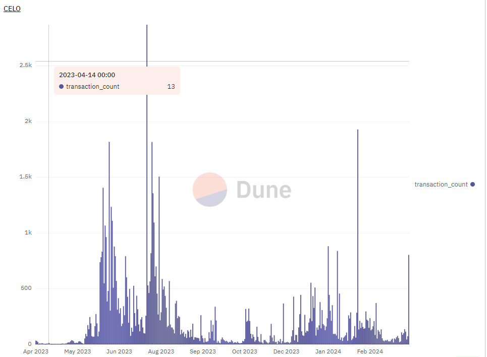

(This figure shows CELOchain transactions sent by Binance and number between 0.9 ~ 1.1)


(This figure shows CELOchain transactions sent by Binance and number between 1.9 ~ 2.1)


(This figure shows CELOchain transactions sent by Binance and number between 0.4 ~ 0.6)


By monitoring the withdrawal operations from the Binance exchange on the CELO chain(shows above), I found that a large number of abnormal behaviors occurred on the chain from July 24th to July 26th, July 18th to Aug 10th and june 10th to june 17th on 2023.(withdrawing ~1CELO or ~2CELO or ~0.5CELO from the exchange, and then conducting layerzero transactions). I set the Origin dataset Filter condition to this time period, the sender's tag is Tether-Binance, the transaction amount is 0.9-1.1CELO or 1.9-2.1 or 0.4-0.6, and I got about 25,000 pieces of data.

Origin dataset filter condition: 
- Celochain transaction sent by Tether: Binance(0xf64368...)
- The amount of CELO traded is:
  - dataset1: between 0.9-1.1
  - dataset2: between 1.9-2.1
  - dataset3: between 0.4-0.6
- Transaction time:
  - dataset1: between July-24-2023 and July-26-2023
  - dataset2: between July-18-2023 and Aug-10-2023
  - dataset3: between Jun-10-2023 and Jun-16-2023

Next, I used the transaction data provided by Layerzero to obtain the _'Number of LZ tx' 'Projects' 'Total LZ Volume $' 'Average LZ Volume $' 'Number of OAPPS' 'Number of Sendchian' 'Number of Chian'_ and EarliestLZdata. The initial dataset is here [initial_dataset1](add_lzdata1.csv), [initial_dataset2](add_lzdata2.csv) and [initial_dataset3](dataset3.csv).

Note：the multichain wallet balance$(from debank api) snapshot time: 
- dataset1: around May-24-2024 11:30PM UTC+8
- dataset2: around May-26-2024 1:30PM UTC+8
- dataset3: around May-27-2024 11:00AM UTC+8

## Data processing
In the data processing, I used the affinity propation algorithm **five** times to identify the data. After each identification, clusters with less than 20 samples were eliminated, and each identification and filtering process had different goals.

### Genesis filter
This action is to filter addresses that have been marked as witches.

### First filter(initial filter)
The set Affinity Propagation feature parameters are
```python
features = ['Number of LZ tx', 'Average LZ Volume $', 'Number of OAPPS', 'Number of Chian']
```
After obtaining the clustering results, if the number of a certain cluster is less than 20, the cluster will be deleted. This step resulted in the deletion of addresses that had not traded layerzero and real-person accounts that had no problems at all.

### Second filter
The set Affinity Propagation feature parameters are
```python
features = ['Number of LZ tx', 'Total LZ Volume $', 'Average LZ Volume $', 'Number of OAPPS', 'Number of Sendchian','Number of Chian']
```
This is the first comprehensive cluster analysis. After the analysis, clusters with less than 20 counts are again eliminated.

### Third filter
The set Affinity Propagation feature parameters are
```python
features = ['Number of Sendchian','Number of Chian']
```
This clustering analysis reduces the dimensionality of the input parameters.

### Fourth filter(final filter)
The set Affinity Propagation feature parameters are
```python
features = ['Funding block','Funding Amount[CELO]','Number of LZ tx','Total LZ Volume $','Average LZ Volume $','Number of OAPPS','Number of Sendchian','Number of Chian']
```
The input of the last clustering algorithm is intial all available parameters of the initial dataset, and it attempts to divide the dataset into as many clusters as possible. Similarly, clusters with less than 20 internal members will be deleted. This way we get the final output data.
After 4 times of cluster filtering, we now have preliminary processing results, which are [initial_output1](initial_output1.csv), [initial_output2](initial_output2.csv) and [initial_output3](initial_output3.csv). 

### Fifth filter(universal filter)
Here we will show a big killer: multichain wallet balance. In the results obtained after the above 4 times of filtering, I obtained the multichain wallet balances of all addresses in the results through Debank, and then performed a full-data clustering filter, which will greatly reduce the probability of false positive samples. You can get final dataset here: [final_dataset1](dataset1.csv), [final_dataset2](dataset2.csv) and [final_dataset3](dataset3.csv).

The set Affinity Propagation feature parameters are
```python
features = ['Funding block','Funding Amount[CELO]','Number of LZ tx','Total LZ Volume $','Average LZ Volume $','Number of OAPPS','Number of Sendchian','Number of Chian', 'Onmichain Balance$','Onmichain Balance$']
```

After five times identify and filter, we have the final data, see [processed_data1](final_output1.csv), [processed_data2](final_output2.csv) and [processed_data3](final_output3.csv). 

### More ways to remove false positive samples
To provide further evidence, I will provide each cluster address with a large-scale homogenization operation different from  filter source in table (such as a large-scale homogenization withdrawal from the exchange again)
When verifying the evidence I provided, I used random sampling to verify, and paid special attention to the data at the edge of the cluster. Moreover, among the submitted clusters, I mannully excluded clusters whose features did not appear to be particularly obvious. The final cluster had almost no possibility of false positives.

---
## Sybil address batches and extra evidence

**batch1-1**
```
0x697e20307552031db4827402cb7a0fac972e3fce
0xd0a68fde37cbc8fd805cbbf5c12290076e9ccbbc
0xc986406082ada4eafea5e5f2781cafdd5e8dfffa
0x6dbeaba6692d45e33269acc6f94c3ea6aeade023
0x48dd6d2c9ecb618778dbb2013e529965f83dea60
0x3175b223164b4666fb99f4a129ab1709b2f19f59
0x55f9d731a185ca0c213a0c0e58c7cc779ea3565a
0x19e174d575747816598f5c2f86ab135c345bc735
0x17e88a26be6f4b5ff2fcd35600b3e2eba942a6ae
0x5e7a8511037807f961586cd60c107ce44cc8d9e0
0x33730c77cb29f447937a6b09831a825368fdddb3
0xfea139000369723c9ffa27ebadeb64b8ff51eb77
0xc86d42fee323b6ab4e67c87a62a3783e3ad953c7
0x1f988445460a9381b1d325440df9fa9b6e5b76f2
0xea763edf5b28340af97256e750911d13fe66aef0
0x417c66c754c0181d8b02772a26136d79da385f9a
0xd5b8db1f98970728f261979d05ed2643931fd31d
0xa9d78ac4b26efedab7889d00636ad35b03233a17
```

**Extra evidence**

In addition to accepting CELO in batches on the CELO chain on July 25th. **This batch of addresses also accepted exactly 0.1089ETH or 0.1189ETH form Bitget(transaction on genesis day)** at around May-16-2023 09:35:35 AM +UTC. Same fund allocation for Omnichain wallets. 

**Data at a glance**
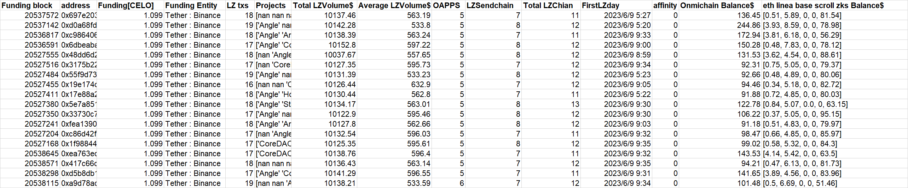

---
**batch1-2**
```
0x525c476e038e40ce6fd49271928b29fded5ace49
0x2396e0564b896507cbcb3bb1bfd0e9479b28a59b
0x2b89f2a47687124524dc9be2494201e236ee2d26
0xd73fbe5344631b6445cd8ba626a0a850dcea916a
0x90b615b4552b7a2088f80083f9646e9336e6dadf
0x318862d27453e37265970e2c67b6a889e51f7226
0x040e5f5ed8e4c53d1a9a5d3a9cce435b4fe79157
0x240ad957f212f015210d30d06eadfca99484a056
0x1ba56e4736aaf9ffab7cdf34b1cc6fe5eb9a73ca
0xb40837877fd04d5caee851466841e098e6505559
0xfa2adc9f6039e02ee1fa72598d485d04db0bff5f
0xaddf280f3e47eca9ac1818d9adeb40f10784e4c6
0xabb4d536beef7996e1faf2f4baaa080f857e5d7f
0xa927f50cca9b5ac6d636bc4c87f8c747f45c9b6d
0xa1d7144a6a0840f7a52c41b6bee2b7b940c5d98c
0xc2228c21baeb31c935aeb914b6e9c3825a8354f1
0xcf2b85b2e9d95899991c22ed2bcdaade3e858116
0x88392bdcf6ac9d7c750e78c07c1298235650b815
0xe498ec4bec63d8b704b3ac977beb45f41de49b02
0x8e155249b87576a3e01eec7d12cdc845f3d940d8
0x07f955ed42b71e3879abdfabd156e900dd966972
0xa849acd86fd689631e435cfa988cb1a7cabd5fd1
0xa4756dbc1ef33b701c081691b8f44c67086d760c
0x9001bb9f6754cf841f238da6ed55d0853a54dbd2
0x3bbb3e7c8676670937a9cbf5fd1dd2032f1a6e57
0xd5aad23c82a41139b47c8cb2bbfc4181af827153
0x995a933eec89da9d8b2994c4b121f68c7bf7fdcd
0xb142c8ebd71aa5ebc1f200ba96697a16e3c5aaef
0x9368eaef329353dd60b710f84bb8005b9ef89cfa
0xd51342bb4f723bdae875cd5317aea0a894573220
0xdaf5798aeeb63aaf21ff016737af99f047d375f2
0x50510878fc0ffacf551ba3d5c729c844739b136f
0x1d1c8dafbd08ceb506a851576efc6b8ba649b7c0
0x1b928998e427266b12b82b61ac0aade15e5f4f9f
0x4f70f4c24d92d8b882e10bb0b6be4ba708744239
0x6c67301dad85c6a5d7608ade8626703a2c815435
0x87f6df4649348b2a2d5080a37854a0fcfb4d0007
0x2e71bd78ba1fa9662a90f0f4239aea66594d1635
0x92d3ee57db1bda20ebe99b4094e7023e1382915a
0x04852e95f5a3315cae52d0e9da715a77cb116d38
0x4c56e5d899936be5ba9617d9f925096f6699cf52
0x9d1c0bd77ae04229a10396741b9c324d8fef70eb
0x35b9119c61d03529a6213795f0ffd4d8abc9de45
0xab5f6eca18ba34ab0a2a1e15a68cc0a80ac34069
0xee9376c78d810527110fbcbd90acbdbb1c7a22b4
0x6cfc91b34373e02610c2c13e603cab49e3677d5a
0x8c8779c2917938d82eb630595567d709e03af661
0xa38d3067a3956a570509ba558b7ae46a6e1cb0fd
0x653209264c5605836bb47592c3058c50d64f93c3
0x5c9ee0283d53e6315a3f84f933a22c3b45eaccaa
0xf2e43191167516506db05b893efed857f864a27f
0xa7290f443357cc756b0dd0cbfbf86b02c667ed14
0x5a173e082cde1ed3a821fe9d62736d2a3144ecdf
0x0aa0fa8ea778aace3df6c8c7e24c263954db3b6f
0x3684502102771086ed028b3bc3337684c16aed86
0x4d093ff3182299d60413033a4774fa7a9b531555
0x4fa86d05f17f2c5050e146765024d776a44c8293
0x9ef17beccd7eb6496e01bec122d17fdbd60cbfd0
0x48758aa58fc0c1a21cc56447a1cdd11bdc7f3340
0xe604c40ef8def14f3cd5f5dbcaa75aee2e56f1a3
0x50165d630c39bd0c2040ce31e6171bf2b8b6ebd8
0xcee1bc7e395d52af6933b146cc9cf04bf2f7541c
0x4c6483f8b909ab884b381335440e10fd3775ea39
0xa4d008f5cbb65feae7575f0009a51d7e47f5be51
0x65ec3dab8a7d9b39d5e79cb575745746b29eb207
0xfe7fa9dbc57ae1152650ad56039466ea2cf1a65a
0x93c352ba6575a4649ba7afe889ab08b4abf81117
0xb45ac0a61b26e68df522534fe152e1d3c808422b
0x8d67aae0121127db40c07f2b982bfde5041ccb82
0x99799a66890ee03e14f112c998cb1e4576f9c2a8
0xd6f69350a6441f5e37e6b7b300f4e271829db308
0x5eff36d267e9adec97e1e284a28b27d2e377588c
0xb03af5a62d96d6418c66c4c02d24bfb45b96751c
0x4e87bb6912cb0125df2b56118485993ef3a3c076
0x80f8f4848654ef293b0385624f1e28132b06bc60
0x7cdbda7d3e5c6ae93f6109437b3ee8b1b0e09104
0xa58658eb0716752fa7b532bf1efce3bcf62a68e7
0x99a45bbc4f9549bcf9436970e2dddc5c6b37353a
0xa482078651c48eb8803ebfe1ad1663fd91234047
0x1422759a335a6c0a75fd7c79c08e62b9f771d69d
0x85f3109905be123f0dde77b894c3e4e26408ad4e

```

**Extra evidence**

In addition to accepting CELO in batches on the CELO chain on July 25th. **This batch of addresses also accepted approximately 0.001zksyncETH(genesis transaction) sent by 
0x888270...(looks like CEX address)** at around Jul-11-2023 11:28:49 PM +UTC. Same fund allocation for Omnichain wallets. 

**Data at a glance**
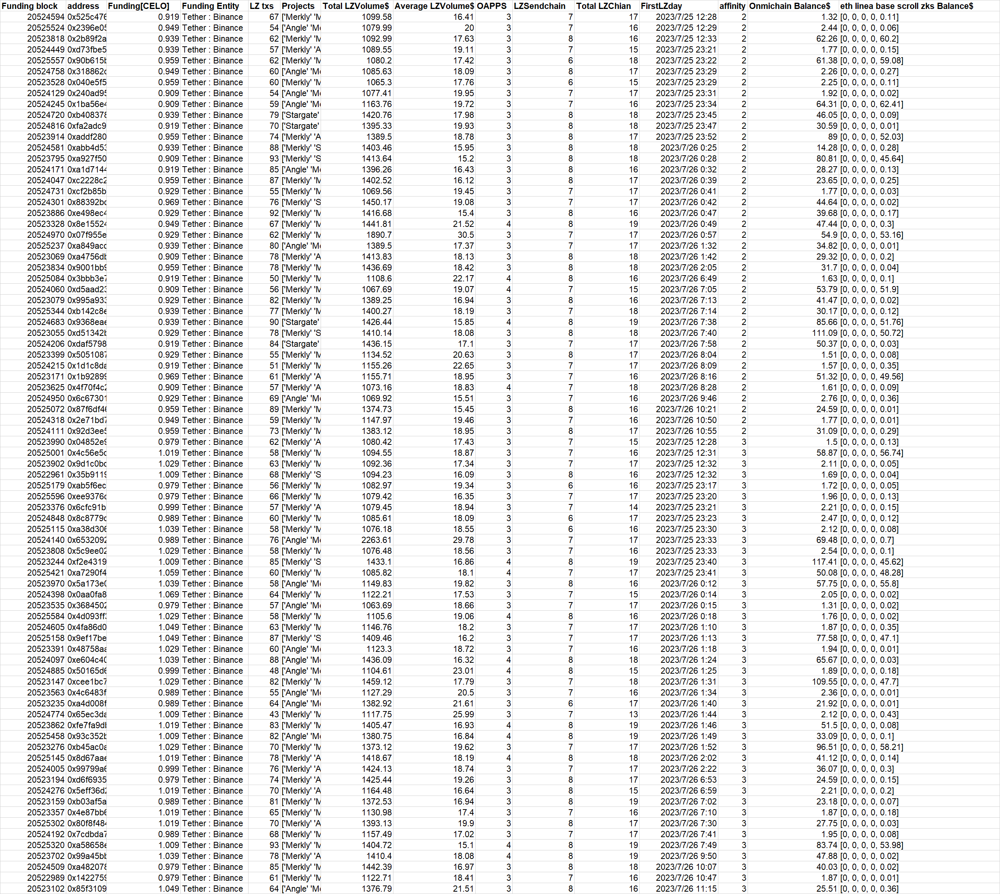


---
**batch1-3**
```
0x16ad2a54d03ecf4aece4882d14ce6d03408cec85
0xec7f1d851394b195736ea75b8ce35e274d237050
0x2aa633eeb8d870d2af2ffa0ca314d312973214b6
0xf81889941ac2ff919caf4d2f25e8ac7edf1283ec
0x9ff5a978b220123881f1b69097085af7af6f4c6d
0xa52d0dfeb2eb97646a0b26913e86d53885047c74
0xae3d5f32b24a65f7381bf4d98f76d3cc4781b44f
0x9461aed5ecd028eee7557efeba7b65b3e0815afa
0xaf13e7fdf99dcb54b848d25b72dcbf951ebd9642
0x9702ad207e95287c801d9a4f8890883f5312f73c
0x29a47e0c85d8fcc4a051a87293b62d0037c3f4a6
0x7dacb08e5f7c5d84a6f087b2cbc5db8bc5cf9cc4
0xe752e22bafce245e860e78d560a3d0b068a691df
0xdbd4dc639503368db0df435d7f8bf04cbba9f789
0x28549ac56e79638b8ad6a82206664a700066b023
0x8da86626306d85eb9de811682ec0a9b63c287671
0xc02e65369356a78be16a8df814b1b1ecba0cb4db
0x0d1a587c8632c1faba38394bae8318247a64d281
0x9894b2f3c7764696a3588b3422804961a38b5054
0x58a6576677907b00b1d91ca723b6924794786ec1
0x06dff4d200c0b5537fad91a1de5f9264be5702d6
0x9599cc6c27663862272394db8d848d3b58d04f57
0x940274c08172073f82ddbe6e42989d3e2a85c558
0xaece09c9955c4d766ab04391ae1de5ddf54cb450
0x638e3f582bdd161bea895c7f55afe09608930ea2
0xa2f93f344f91549e738bfa9ee955cd3f6edecf7e
0x84a8ae5d9fedf527310f85ce771516b722ce9bc0
0xc58d430b1acb20330186c009ea3c7b17eb9ba846
0xfb7db49ae2762e7f927bb1dbb39dc3ea6d694d48
0x207f8013843d17ea6a27a7b994a61dacd503142d
0x2ddc66c815750ab631745c7faa37e7d2bbfd38bf
0x282a0d3ebed78857d92537e8e6754ec17064a788
0x2f5bfbd9ff27f9d4d42df2076b959006084b3b6a
0x81712e5131c78ba6a79ba7706343ad3dbd7edf67
0x716e7b2088385f86813f8829808faf098d93c0b5
0xc93ebef581a67b0b572637900354662e36bb7941
0x746e310cf7f59c8b08b60c6df1ebd667760a3f44
0x76cd6679d02d12a03c85502395a220a58e47d95f
0x70e7f1c58ba42dd1d50584185032afd0d4f0e555
0x4658a5e518ec9b54bedf335c84e2ce38e162fd2d
0xfe418d7a7b9f60902a0591af16fdd4bf717c30a0
0x4af3bc9e5c92b0b7a13225e2b9161f5da5ab0676
0x73bdf0bec2f84ecf3c65de3f64753a1dd9f4d41d
0xc8aa6f8bf59c3d907372a2f9263f13f207c86e75
0xca92862550eaab06315b966aa87c55a7a22cfe89
0x1748c9e0b35314083cf2302a4ef9e67bd99857c2
0xe911fcb49c76fe6a88d786551f31d16811be2845
0xfc482b72f9aba3637e9fea60ce494648139156a5
0x3e6a70461b1b8f2264b40f039707e8fe22d48afe
0x8b8fcd84d0fef83bd54e0922e8f2d2e0d51f1701
0x4745bbf5388f0b529e45bf0427ba604bb52bdd86
0x0858812bd055d69495b5de5992db8b7808b9c11f
0x842a258f0e4f339e672ecbc40a98312729273ac4
0xb3d04a2bad62cd5425dfd9a78fb3f0110f9f64e8
0x7f04f2dbb652f22624325dc006977052477aafce
0x2ab6bb776cc28c2f9da0c3cc505f5412e0e56ed8
0xe0be082615836f81a1b941e86de778d731d80ef7
0x1ecca8f872b78b5d74d930b437930050ef2e95a7
0xd5c56cb9371f4ab1b8d35560d1dfbb0c4ef9b188
0x6e5f366e6d5bea032824ffa0a771f8751a156fc2
0xd7ee3892149c256630869e245d188577bdbd676a
0x99383ac8e8cbb822f6b53d04329d6c8a023f5240
0x3dec0f3e55f2077077f8dcd1139bff89f1523c91
0xb9ae1bd2ee01a20c7b7364961e4866f2353b7560
0x5a22d258ac795dc8953a2cfbd1d66d7a672525ca
0x6a376cf0a55b128e2160f70b9c3b5c9ee775625a
0xca3b9d975426e6b8ac28159b8673d2ff27d04a71
0xb74d12a4b1e025686f072b4302f43a2c046ef86e
0x8ccfbcb87e8f5b1cb51ed49abba66c0c607da453
0xaaca7eb4bb63af64afdfa8371b24ba091b914536
0x7a976a9a33faa05523b37c0a83d6630b75049c32
0xfef2648635f375d36f24589823866d89e49c01ac
0xf03b4caee7d2f936539c93fb0a75875fda5074e7
0xae0b83e38077ec561375237b5895fff84bebde15
0x6e49967005f8ce70fb3bb76596e863657b4ca8d5
0xb859d5c9de0d2962282eec8c6cfdb155e297d326
0x2c5fd2e12a3f959baf4e25a701111ea3c0b795ba

```

**Extra evidence**

In addition to accepting CELO in batches on the CELO chain on July 25th. **This batch of addresses also accepted approximately 0.0018zksyncETH(genesis transaction) sent by 
Bitget** at around Jun-30-2023 02:43:00 AM +UTC. Same fund allocation for Omnichain wallets. 

**Data at a glance**
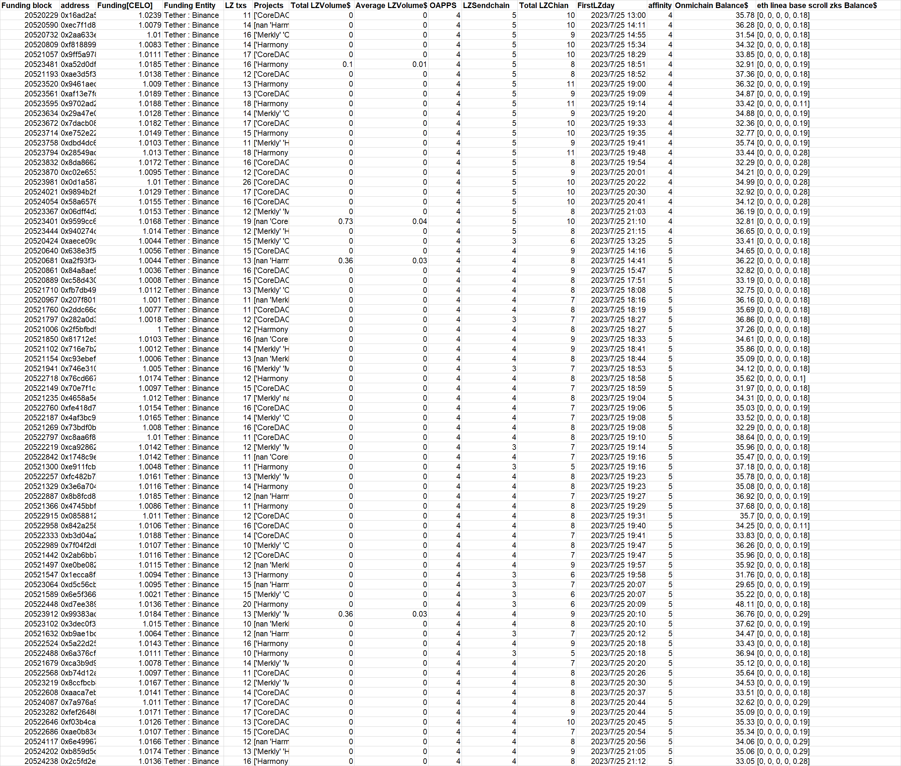

---
**batch1-4**
```
0x208a9bb512029239acb4cc7834824c8badbad316
0xead35a2e4d6a6c7f15517ca409c2f29734d50356
0x1b3731479bb9db0576e3b0c75eab8a3f581821b5
0x97ac9bdc6b169bf71dcf4968e778c56a54d4c6af
0xbf54a6f732cb062a2ddc177dc385685812b53ec2
0x796597a2f7d43515811e40c7aee15bb5fe0fa2d8
0x77b09c9cf12221c9b97153ddebaacb68fd689546
0xf60d27b9c2098962200d707f491470bcccc49006
0xfc79f318b66ed5529880c0de3d6491601458a170
0xe61458094a0be9fa2394427ad688d10b73b5d466
0x9d816e145e925f52d7fea2be8d56bc07a7002d04
0xddf8d27deb1094b726881995b1249b04f4e3b013
0xa8710633087dad42767474cd87c538ecbaba3055
0xcda5da14611dc814936629d97299a9404247995d
0xb4a1bfde99858a0c9dd86d8a0029e894353ac699
0x331c34c797d21ea2eb9b6552060301b4dfd891f1
0x69302fbe8cdde288225c59075db929e6ab80f3f3
0x32fb8d16d0871450ffec17afb85b88c0c51055dc
0xbb2762332280e88cf11b9ef86fab08312e1221e7
0x66648d2115b96a3fc714a85ef5906ee2d9f00f5e
0x5d2dd2a50526e623f5ef1597d76c29c81b385fb5
0xbe938afadac759ad37d40ab4c1bf01ffc20b9431
0x91132ff31acf32183cbf61967a487ac8b011c03a
0x160f86af28133feb6b7b39d8f2b1cb70517fc77f
0x14e41b26c4d46bcb6989ca9e9acb169f85a072cc
0xed35b6d4335c863007b8c4aafe6a356a498c8842
0x11ea5b5a8c81b000e01821861453dabda2614fce
0xd1821e2bb4c34544111f3fb77457177a23836695
0xdb5319a63d5117ef98e2875351d988754c1746b5
0x59b36032c2609c70a7731fbe1bb4093a16608c50
0x6cd0365900e70cc4d15d40fcbd617aad7281bd5e
0x1001576ea66f1da4e320594f53cb37a4307f4ef7
0x8c2934429c2c0438858e95b9f458a09ab0b6e485
0x492af0226b3405d98629ab420f8f3f9f8a80b01d
0x0e56d12bb358e6685d7ea3fb428e518bd4e4850a
0xf670c59a70db7bbf3470f8c0d4a8c38ada922ac2
0xaad086c2945335fac4ff5fc3699675e268b46226
0x43e736b115e629df4950ba07baaefffe0bbbe486
0xa1a7426376630b4657d2478c365f3334ee6cbcfb
0x07a81a8dd5b07245d60b4e45ded429e833d5a9dd
0x870e21af8ddc5699d62c99fcc4ec9ed6a57d4822
0x1b7b420b9d9d4f099233bc4e37a998e9263cfa17
0x5333a50bd54dc37651577164eb7bed158f688bd0
0x31fbeb22baca608b308a21879a45aae14a892422
0x5915433468d9180211fb05cffc38849131ad794a
0xa2ee504754fac645dd1e912ee6e04e5ec37d6228
0x9b1a43821df89a16938d4ed1daa4b879c0860950
0x334f8a3a285e001c9a825361ea04bc5cf0c3073c
0xc17c51d5a3038be27c133b9036d35f92b4ae58e1

```

**Extra evidence**

In addition to accepting CELO in batches on the CELO chain on July 25th. **This batch of addresses also accepted approximately 0.03BNB form Binance(genesis transaction)** at around Apr-28-2023 09:47:26 PM +UTC. Same fund allocation for Omnichain wallets. 

**Data at a glance**
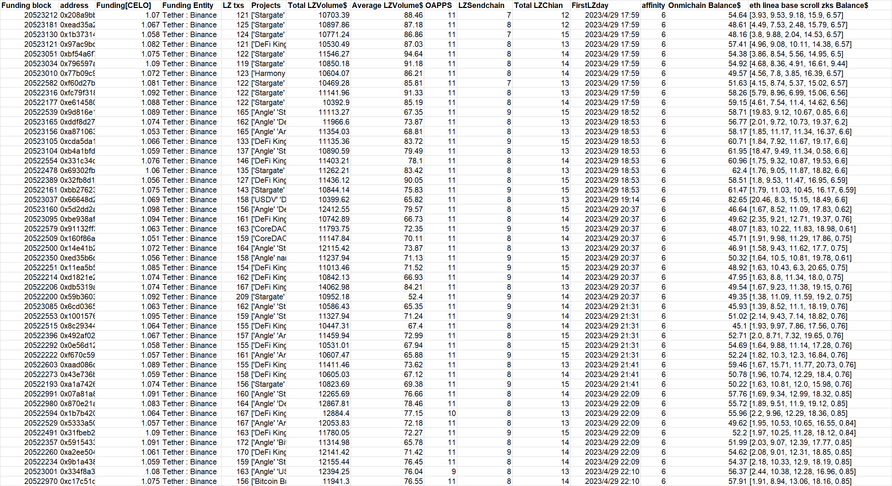


---
**batch1-5**
```
0xa54e9853ecffb4dd09cc7941a76f6cd01c1cac73
0x7532ffa099d9cd3cd09671bbb16739aaeb81aad0
0x40a4210a72198e107ef45437991d3c58e0f53716
0xc242de8eecc6e45a7035e0da8039710cdd092c98
0x478b80656021d32cb887e0925b7db5406c4dc7ae
0x38be60b962dbffb8db77d878d11f4f30f3d0a142
0x87ae29b6ebc0e593d08ab8dee40de69c40e0c29a
0x6dd5204c6972c658cea49cd237fb17bdd182bc8e
0x696f1da2fe2077bea334e4238cd72d2af8330d6a
0xd3ad1969557cbad2c217433e21f534c29f61df7e
0x60107a547fff3da733f5a77bfa9d1eb683d8b57a
0xd31264fa111951919813bee331e5d1a695f3eb76
0xfad5391e5cf0cb192ca47cd0931e96743039d934
0x3151a4679a6463662ca075e2a8c96019e462f4a0
0x5db353a4dfa6f750cc41d5a1ded593fd6d50a921
0x1be15e7eebd3879b1747dd42b938547a1525ff3e
0x73413a9882fed4e667e885fa6a763bf14019e680
0xb1b061036dd260f6d5464c046d21ffc4337bff39
0x528fce6c6c688f3899a5dc07bd5cba341c7b1f4e
0x26dd5649931e761b1e87d026545ab5daee6c176d
0xeb1436f9fc851c85e2c791a82e8630288fa1dadb
0xfd81ac579d3eb45eee7154515e723c6205c5ece4
0x5746fb0d34c3dd5cb952cff84bd683f215058b5e
0xda3832e8a04667fbef7c005a3457f68d1a303219
0x51b7e85948cfdc83d50fb8d1ec1654dbf92e01c4
0xe1a73d513c1a880dd87c6dbb170d6b8c76735912
0x673394b61d435f8d9cd410123c18fcfff96ccef9
0x49d0dc1cecbc7f73309d7e4aad14786ba55ff4c4
0x62aece72cc4fb6da4472d84b9b87716b4043c012
0xcfbe1ed16a235f7dea2553ee703938dbeb75dce8
0x7087f76040ced95eae15ba34c177585d8a2116e2
0x54b642fd72ef808298cd995d7390d79bb818c293
0x984fd45dc339555a35a67fe26049cc3624f67d6f
0xf6a1072c11969d590749bf53d0e6deaddf8cc3e0
0x8d8b9630a18bb1f25d9614e178bb17ab1a4bf394
0x246fa4419ad4bcd8328f7586b131d5908d345f20
0xfad3982f6198e596f4f2495f8345862de81542ce
0xdda3a6611640f3c2aad929c336dd347735a1a75e
0xb45c7c578f7321bc068d4a372b74a104fa844edc
0xfaebb30e88b9a820d48290be5413dacf08821720
0xb720da9d4f32bdcffe8df43e2009853bd88e9cf6
0xf7f2a734c9d542bf546d6b767e88836d6f009ed8
0xf6ea1f5cb8712e65968f10c48d2d65559cfcacc4
0xe1bd8872c3be39ea90330c75550ce4d9b4c874e7
0xfae40c019394111b4b5888b70ed64285f09ce2f0
0x21fbfbbb5ddd2768bc4cd449a67dd2e37dd0c5ca
0x17e79481b8c398a7ec3a0872f1e8d84d159edc35
0xe4c6385bf269b0358d3aab0a924324959667f02f
0x5a63718f0531bb8f7d2c3cd580b1180804c40e53
0xeeb92aab70e301e77c290f1a0265cc8ca968f6e1
0x6fc7225182b1f25b6dff2086d7f06fc05e4a6924
0x371c9d7f056bb75970cb7b46b15d6c923bd66f6b
0x6b146f6041c9e567816aa54f8b464a3598392d19
0x4f7cc63dfbd51246caaf4cbe83d538a817aec33e
0xe22bc83414de4d99a44aa6b33aa92c2ae0c256d4
0xec9205d9eb4a552a3d611339674aa99361adf72b
0x4423c8a816b94edecd208c96e824f8834d163283
0xf81750bf3773a6866a8079969965863f5889cbe0
0x95f680bc39a2577aad8fe5a1bb55b57dd600456a
0x67a6da86503ac04c602fda35bb5ba493a39317eb
0x66613a16501e4c81c113687d0e9a84ee6297ae29
0x85b54237263e37c0f6ebe0a7c426c06701cf318c
0x89f8b41a5e4a52f27585b588dd6b0b8f73a1f04e
0x783f67dc651b4059e4e1948d1cfd98b406aa93da
0xb113fa45991bdfbeb22385222fe5b013dcac1c5e
0x061098df8334f271fd472607a4ac88513d4f771a
0x4c457bf5099c55cd942a8adbe662ab374703cb67
0x4457df6cb93bbb30fc9da33cc8fcbc747f551f99
0x482ac5e2b92eb6c5dd0215b37ca4eb1bbc15f8dc
0x61bf6972993fff4b932871b69c32cc26cc192365
0x873bde8fbcea496e5a568abef6a313cf99479f6f
0x2e01fb72a065e4c071a23d60986ea13f1f2c7428
0xf60be13d7b10c4d69375bd78db8e0c144f041008

```

**Extra evidence**

In addition to accepting CELO in batches on the CELO chain on July 25th. **This batch of addresses also accepted exactly 1Core(Core chain's genesis transaction) form 
0xE07F73d(unknown CEX)** at around 2023-06-20T18:33:03. Same fund allocation for Omnichain wallets. 

**Data at a glance**
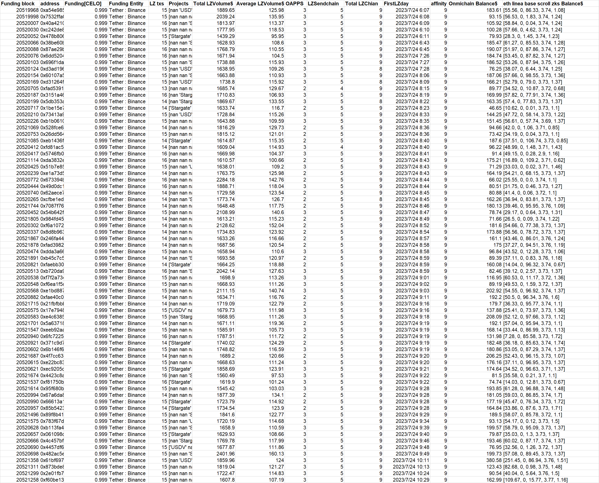


---
**batch1-6**
```
0x6b0a7a4c2adeeeba7bb9320605c6067d937be2f2
0x672d2eedd9f0b24d06889f1c8d3630d2d2fc920d
0xd0c13f96cc283ea1bc01f8d117c0b6a89f51ed82
0x4338926d38ef451d403fc40e1b6f0b7454acf45b
0xe7dd1a9a070693113b82cf790ce71240519d0044
0xc1a62bce3195b58688745065d51919e65a91ccf9
0xc90e9c217b6aa364b33bcf3c03321309e4e3a541
0x88501fc42b28f08417b1e6631c2d6934f0127f5d
0x242abed49ed1cf7992b1dfbf462520535eb9c4a1
0xd24dd7a1de0a6e2a111392790145a74df9188869
0x579c4503cec9aa2b2a0b5f8391bf162496f8d8db
0x53afd473daf8cebd94b5a6147b3c3079511f6ecc
0x0d1b9b0fdfe960d79657eafd8f3aa3cbb7a3dda6
0x1ddccb33043a705c1b7bc1a30bd6c8b1e8c4547e
0x8f62180980aad40b8aa65a1483eda08510ed3043
0x99de45472a9c7aee502055de22e57dbf5ab109f9
0xab942f81b907120ca23b69c34c6d0ec998e96968
0x64d40e1f3037cc96d2b657f0a8475237acb4a2bd
0x4a71e4be7e2275a9d6618b7fe78166c2f0ff0eeb
0x326116b73b01c14b0d48fdc7a47574fc9c040d37
0x1ecb0752d2ad79fff7a25ad6f5aeaf448a47026c
0xd572af0611ae6385ba688ae5c0e4edded7c0b745
0x11d4d081fb22a3ccfb528fd254246c6b04ccc9e7
0x44570f8e335f7d033a1d2de848e738972618036d
0xc6b8d3e0af597e0007a36da7edc7484b53cc5abc
0x9bcb449344903dc7c3d95952aea9e4c9b3bb77a6
0xa2229bfc558b5655ba3255b6d15442e38d5052a8
0x28c7ada134fa604b394b723e5e54090f1c3e18c8
0xa56a56b1f4adae22e61dfcf64b2b11796bfb910f
0x8eb921c5d38dec6971cd53875a4632773413a9c4
0x0143ae1931f592b49beb011f813c310f8d5534c4
0xb1d2b985d6fcb9288bd0ceca8fa5c34d534a58b5
0xd5cda11049cadb3c8325d513f73dabec80993e36
0x6cc5d1519f926672f50f4d82ab242a9e950e10a2
0x8370261bf3197cbc200c6da4422fae873b777165
0xd0954b015d8cdf4aa6dc2175d5cfabe62e11158f
0x1d8c2f0a872096c7000cb5d0646a035a17c60d91
0xc128635c0794034e84515e2bf66e3a6c714d6507
0x0f77a68807926e8fd5a42b758213f9bf414c5df1
0xaaa8103f3c4475f404bdb491069e85e47b30b619
0x84fa55923819c08d6271951d4344d19a2da814a7
0xa2921ef0d8b995c76addf407ee03a3470fb2b63a
0xf2962e14a09b4869307918f9aca23e20a53d0204
0x25a750ebe5432d0d0defdd024c291959614c3244
0x783f13206db107198fb154f78ae5f8b2e1460785
0x53aac885f04be5f402bd204c9dcffa486ed099a3
0x9d6884c0db24049b9a011c5d52ce1ee6e4bb253f
0x1a2d1d943e8198cae1c1c1ed8971443df0d10b85
0x9ccefb2e53a5971d9d413deb62ea0f012a5b30d7
0xd699fac8d0db48ab25d4ab2507cb9e6ac43b807a
0xe989ca5e60e5b3b5d141f4912f3751a66511f3b2
0xaf8108a72a0d3c6c61ce31bfb31d32bc9efcddda
0x32ecee9f553fcdcda2f85f4692b135a11ce4b4b4
0xafe81debf284f9ac0d194066f65c6bf12bdb275c
0x3eaa71124c06a46c70bfe6cb497a0cba6249b080
0x4d7eca5f9c09fe81cd421f63bbd8bcbf1a03a2fe
0x07a75a98b7afb77bfb191fcfa2db89d56b92a534
0x886123903d12db653a72167615981c071a8993da
0x402c7b576b11e12923b0ebe3e86398163db74d86
0xb8e468c1182afdfec5816f752909095516103aca
0xf1922d13991f18fc778894b8af0c8f7abb1fb00d
0x537c7c5b6cae5865a55d4a96a1b5f89dac54a424
0x89c998fbd6ce30d4d5c6e361178cae7c87f7299c
0xf3aeb1705a77ca8f0d9acd54f1f8653d250367d9
0xdeb702a6519c52efaa3394a27f9aadf6c3c0f84f
0xaf470fb8cbc2a58b478674b24e6fb33268ce7e9a
0x8f733f9aa9c245fb8bbea64c21df2d7b6d3dca98
0x52375b659252f6afbbd17ee0babee37ee5bd6189
0x8061f0f68b55d4eab045af1d7b0eb125fd4fa48b
0x42a64a3a7eb64f336a91077f6e246bb7cc6ae0f2
0xc97f6c62b4ad79c7f7220c3d55a8834c99778d82
0xf6791029c6ea7cd2c1b49cd91571166466f06cfa
0x046b53dc075cfd5bd5e3af0247f9e153b81b057d
0x5bfefa37c209a5ac823b2011aae48e3539ed0732
0x807c576780cb2f0614dd0bceaa4a7fe933772a47
0xa875f2b108785481806ed11af977fc09f90eeddf
0x1c8fb9af76006819c3f89ec3e8762bd96c80a276
0x1c9359bae4d367198e86177003387c7ae649f574
0x6ec56b665c265acb0cbf9bf5baf11ce42dc4e3a9
0x22ce84a33f292c8328c053c7eea9ab065347f61b
0xe11454ec447dff199d9bce2f89edd11dc8e01952
0x0771610b17228c263e303852b2ef0e1be8cbc405
0x1b0de82be5864af13d8897fd35cce115fdfa52b5
0x8c69946c9ba1a0d066d80f710b4deb422421e0ee
0x9f9f05c4b653de7e08b14e855183be09c5d4c95b
0x3650534542e4bef668f52651784b1dd251159c40
0x32caac467333dc9657dd6060055805780784b82b
0x3fc095e87ab23efe781516f09dfa2f303ff15643

```

**Extra evidence**

The owners of addresses in this cluster have a high awareness of censorship prevention, and activities are usually carried out in batches. However, this address: 1: The number of CELO withdrawals is too obvious (he intentionally increased the number of decimal places to disguise randomness); 2: **While withdrawing CELO on July 25, the cluster address withdrew approximately 1.25CORE**；3:Same fund allocation for Omnichain wallets.

**Data at a glance**
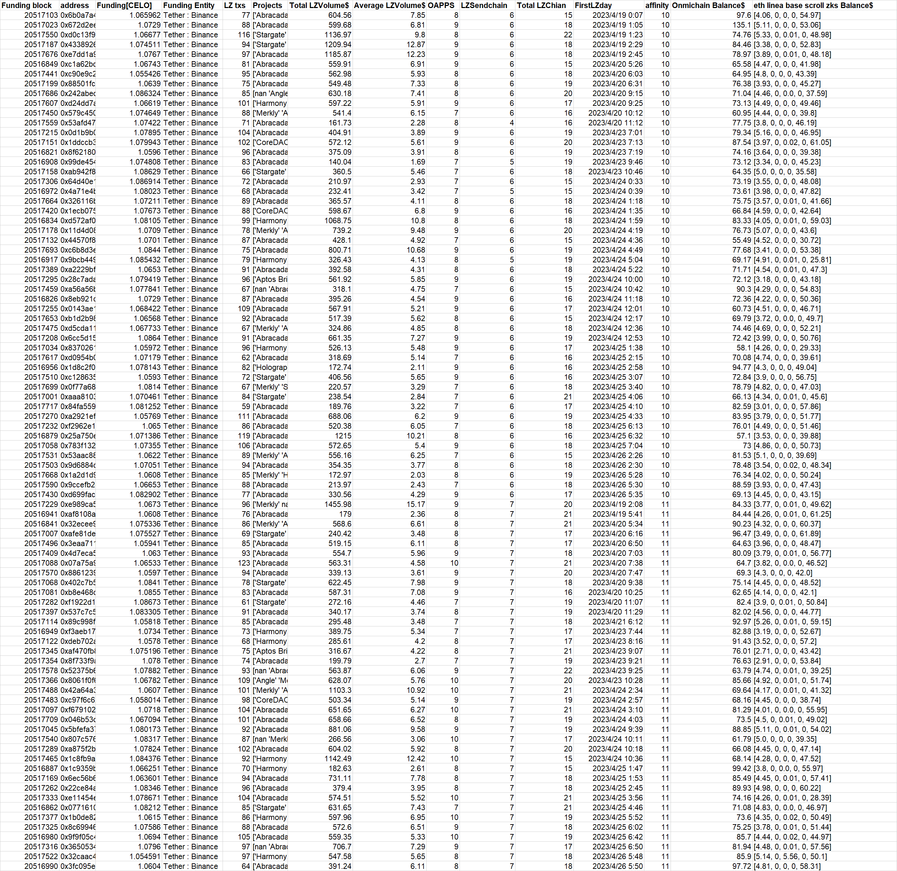


---
**batch1-7**
```
0xf3d1fe135da99a75d182e48d168c9716fd217443
0x145f6b101768a36c609be995c46920c031b417c1
0x402c5322f21f9e98a3e2036b9ed3f1eb537babc5
0x207e3b1794c5bba2f930fb3e14122bfecbd8bd35
0xf797f0f0085628c01259b1bd554ad8c497f8ac6a
0xaf6511093c14c387d9c4529c56b2fec70617b039
0x296032b5b3f0d625468130d09ea55cbdae0c08d2
0xd3f04d15f69e5493e0af914bf5def1d4b387e03e
0x535891d47bef8c121331cbd71c6722c6c4725e3b
0x7c314ed299cfb77b9829503ec1ce81331ca9385d
0x7d089a65d7f25635164065d43ae83149ecae781f
0x9d654b9ac854dd62cbef80905eef5589addf9c94
0x2c1c65f45e3003633d433f8495765f1b2857b814
0x9552b0e4c746664d667d588e57e434eee57e048f
0xac95c680477a1808ffd14f61c6a590936e051e19
0x8ca5764d10c2fb70e89b0aca1fba3c3729afba93
0xc6db6f6065fe9d6ba31b0b5f76bd7fc51511d35b
0x98554966afee26f53fe71d590a5e657fbd4f8420
0x83a2aaf9cec4d0bdd13bad478f3043ffeb8ac118
0xd53c494d486ea7bd1bc7c3e323a5006a1bac4e36
0xd3626a02904e843ac88e8afb462fc3b7bef1e036
0xd1179b6db46d3c1c2a09ce1851ca0ffd30ae21c0
0xa63f6c60220eb5a99ae5739c1370aff5624d3b8f
0xb69dbf3938948dd361fa83d6c8297243c96c2c6a
0x1d4e652e4b983b40039bc684e274a3c2f7d052d2
0xbb745c0b55ee5ee7457de0fbd06bed1badb4af7d
0x17049c68a5fa6b5b9a06df21b1e4d8b7fdad193d
0xe1126fc7dacf8a20f4c7baff9ce0678a7e4dee4c
0xe75cb5d9cc0d663cd131fae3255b74065f2cd5c4
0x6140e6339c5c745d47f9e75ec9ca4a9dbdf35f43
0x35a8a6128a407a3229902d4e70d883d5ec81c6a9
0x4067b487fd9fb20895e85d86555473a8384b6ce1
0x54ae784a5ab5cf81b45203c23292ec1946266308
0x41637b7ed6fa6e09a6ce142f11d66c4248869d53
0x368469a6f40e6e13c91686dfe87bdb5f70943921
0xa1279ff72072dff4848ce63dec2a4ea645262165
0xe3dc2de7a8846c095bdc73f10f83797f20072ef5
0x27110e212f3abca6bbaad3d2f48b3ea1e430b68c
0x0e57fd857acf8d2a94d11bdbd52d2f6b5cc05b8f
0xabfef55cb069a37c43dc00bb69cfadb65fcdcd06
0x279ffcd7d3e136d03c387633c289f2fda6f7441b
0xde3c799f017e6392344d108d48c014ef03104a39
0xfe18d4080993b22a44b79260091346642805b305
0x4a5a6c592d72e4a7166c0db52db1d52e9cfc6bce
0x1f2453715673ca6cd77c8a281806becbdaa7168c
0xa6bec0d5b090823a31418ad64d2df8b8d2beec26
0x626186afdc0d8db93f9b64a95400cd53b48d0bc2
0x4196b156224cd0aa3bbac0e25282d6d84207e2ab
0x8093561245e5b69b5f36084c8cb6c07cf3851031
0xaec6e7a8e2c706d6b92ed091e472aee366e77ca1
0x82029dcf365a5d8a878749a46635c0920b727888
0xa3c9bd62137c77ce103865744739911f124782f2
0xcaa0207564311f3767f8544d846d871c05e0a549
0x4f4b9b48e290f6fa390302bc0c26decf9a4b4309
0x7f4eba4382572bb111ef5593e7ff720971276a2e
0xcb8307cb12e869cbb220921f2f7bef7f49e619bd
0xd77d847e7a089397d911861cfb76cf552dccf8f1
0x39b6cc2b953288be70798be3dcecf97e4335c9da
0xd9ec12061d050df673e80adb197723d17f0af168
0x177a8de5e0e448ee8b93e7aca9825f83aff0c852
0x5d9118a775c7e9ed7699f893fb1d2873790ef703
0x5e42ab37ef1e0d06f6c96ebb5953f266369f94f5
0x15f989a3771ab7ad42fe93d647ae8fffed044db7
0x9c1b9151fe8313e42121d0662b7c67c6ae3256a8
0x7b9b2ec137e6b596b1f5db9c644386be66795cf5
0x52b2cb3ba1f894b524b4c76df4b4757f7805cd44
0x5fadc35d867615e59024bf3357682ec177d4c44c
0xd412dee7c26e1b71fcfeef55fee81b4240bfd4a0
0xe63914f27744d9f41fcb879ab9f2bae728ba9856
0xc8f622bf737fd987cb3bdc3e2a642f62d8aac0f8
0x691f37ec1e14932f41fa09cdfec4efdcb9abc0a1
0xab0bf1b800d7ed2467c14bf35d5eea279fa311a7
0x9fdca0bfa20fa2403de5f009102292d160bb84e6
0x3256581bb340448e69d42e70505156a0ac8ae3a8
0xeef6a4b8819d629dc0aa78a6fce8a18b1eacf5c1
0x2bb6bbb36e9df274293a9112fc65d2502cf98a47
0xad4464beee188300516dee2d0efa3d717b5cfd33
0xc93e45d3606dd92e50bd0dc846bd5357f45acdf6
0xd7e34484f5a537babe0816ae73b3dbaca68f8f28
0x4574da6cf7cab719ba343a323ed000d0b5d98d82
0x3047b6420c81971d3a913a183e2d63b29b03c71c
0x3de00ea04b5850505aa3a869526467ee4e909c7b
0x66be15bab090845c1de0e2f6fcaff2db75579932
0x90b3b4e02ac68a1e6c2bc95243e5ccbfdf3671f3
0xab7cacdf95007281f95ccfd134fa43b8fc4511bb
0x6c3d544357a48dbf5197e31c79e671676c6ffb27
0xee59796edda2e615df899977ec108c2432d75c7c
0xf1d111901f05a0b882cdf0d36dcaad7d39293cb3
0xd9da979a5a8791307508100b52ea46496c0f7bc4
0xe2eb867ca451ea741cd50240c35b3345aca2865b
0xb0f0c3bbfeb4a5b4efe4fb4662cfb89a40d3dc23
0x05378961de968612ab0cc9a13bab26fb58219edf
0x09462caeb8c3f4e0d36339ef382509b9a231b412
0xf6c5a1388a543d133f046fe7d981da3e8141f316
0xb675faffaf6af7c0e8f22e73094f52485f8fc329
0xb6e8e8d1d7acf0b5c0af56797d9d53048bf4aedf
0xb28a77d57188593ff5806a77651d611f8a22cf6f
0x25aff5647fb473c689a43183d6dd3edeccbe3d61
0xa80b77b9e6bc93f486d80d52e21265b9706ff13b
0x36d129e5b8fadbee6cdd1b8005aa10074bf968f8
0x3e53e927bc9e3e211ef1c97d4f3d1c349d1044b6
0x8941009e865c9460d9cd86ab618cb9bd0c1853bf
0x5a98c3572c024cb62b55903ba3c50d3d31a32053
0x4b0fcfb89f1bb3cb0f33b5ed020ed0a105991ada
0x21e9481e9dd79b2cf829d65fa5eac2ee60b641f2
0x7d488d03fdbf0e4e4f395add3eca068f13c3675b
0x034de2fe2b9d9f2104b6912738b458bd1f9c8921
0xda65f25ee49be73e2f783855bcb135f926bf8af5
0xd98ff2e67c4e7286a4b6fe32080fcd1e2fe38d72
0x1855320ef38ddb44a3c7b4a9f05856110e311459
0xa26ac9437b73cac4e984138c6cbc6b8855fcf45d
0x1a58ddd99483eaeeb1a31e183e03e6156e2941f0
0xc4962d2f776e174e3ab6491982c7ee12c95667bc
0xd9243a34fbc63c1988252cc6106d9ea9acd2cffc
0xe95e0cd108412de1f0833540774f8c4a66374e9d
0xafe8ef6dd453fe64908a3b66fcc532470f21e0a2
0x75f214db5260f6f5abd2180a87bb51725661aafc
0xcee4ebc3d12e5b3a81acfbbfdc8302892af3fc48
0x44863327dcbc6b5d4949a292b4bf65b3b8570b57
0x613411ea6019c210539fec2cfa9d644e3713b817
0xd2207cac9850ad8e722332888473f7ff65548208
0xf1eacefda2db1417889a2cddf2b12ed986f78bd3
0xac061bdc32656535c099b24e39834901213eb859
0x44107da69cffc2a5b8e33b53ea8e1ed749a515c7
0x61388fc04a0fa518d8da525a4c4b7912828d7e46
0xb0fe0ddac199234a4f341db8547590cdb77a3f3d
0x0853cbd7f44d30183c1c359699c56340d8ccde62
0xe3820f77c62b7ba58d16c1d6027519d166f24720
0xf4e675d273594c2f6ebbb55300cb6d9481dd02b3
0x711bb39a7f061ea66d56aca6b989bd1b0c722e6b
0x0d8b9a2e2105cdd5f3b040b9b89d78b53ba4efc5
0x3c2cee4fb60403aa1353d45295f9be4877bb38c9
0xf2af9fc1a9714ca302e336beba3836515c841f39
0x6d5eccd3dbfade3713d622733b8a2eb83abe1d2e
0x8ed624d0a7a479680d3b2e435944227d607b7d15
0xb9d4553095585f17a044e531b1e84be43a54cf0f
0x606cd5b9a5d1d71b706474aec50ed7d948b00795
0x9f142f5c64da32f0b1939cacbb7020d41a3a1e16
0x409e69bd9661897a71115b703394c666e3a4010e
0xeef80135dafd2f3e7c8477bbc47269ccf1c1dd0c
0x85ebb620a93ee0676dbac8626a7771e36f4c45f7
0xa5e257feac1c4504d2261c5ab32cd997f83e830c
0x13523d6c76ff5c9c9dc5be987f33ce34c2afd238
0xcceecbc10ceb2f6fe4e9ae07b790e2009eb2f5ea
0x08e050102dc1ccfb3c74879f53089dbfff9a0c89
0xd5fb6eb638f40fd24ea01280028dc5166405727d
0x478f669c2ddc84d77555fc6859b5ebfccd7c10d7
0xc782d4a4183b3e57398cf9eb3ce1921d720f5102
0xe9bdf8f6c87a0adda41269908a9a583763c55531
0xc3a3614801ecfb25ee2f89c0a08e17d06a2f1c4f
0x94fee0a6b4c6c36ca2af6106935c4498b0ef17c4
0xba53737391295b543bd6be17069df34513c93c21
0x66ccd64bf7279db9e6da617abf72a92e41d23c64
0x2307c7af87365b38bfbcf1fe7c1418ce50932256
0xfc95420b7131281e8a028d0d56934fe52fd171f4
0x3d2be4f8922bdfefbcab67cc51ced9a5de82c0a6
0xe206efacb611817909ea0c1a91be134b0ed2747c
0x758d87699fa2957534be2089656e840f97f2734b
0x450e5abcbdfbd58ba6989cac25a51d028222df77
0xe297fe3888803d07ddc26481f9c86c346635ce87
0x411065ea3715c1a8b0d203a73553a9133a253d09
0x415871e7a2353e6cc0c85147d32b25956543b7cd
0xa8666fa2c8d8fc15bef3ff7d9d11ed7c571c563e
0xb23493e6573ed5e6f8c2d0b7cdf1d6c9eb58ca03
0xb99e3ae07747f60172fe8e4693da432b6c6b399b
0xe1453cb22d90e87f1ef7de5e00085032e30821c7
0x9d5e22b0dcff59c3c3b6747280434dab81515f64
0x62e387618987f6e269d1d2a53481ae0b9da06e37
0x4b00a65208e3c9015b5e9b29554218aea78e41f6
0xf2afc409a2543a954f1a4dd82f337c829613c07c
0x090f131b44796ee1e9fc9fa7056e918e39a20b06
0xd4367a28720206ff9bc14fdc77be57832a487305
0x996dd2ed6638c018ab9eabb1384e5d823ca9e391
0x116234ede492a0886d031c32f94b17674c230619
0x99b2117ca8cf2853aef1a2846131e0c0439fc7eb
0xadaec2eb389e851514db6c0f01f7a4b814b860eb
0x4a0d767238e31af7f6853e3999f960b2cd7bbc8c
0xf22d258f03ceb05453208ac5b386b7af16fafc7f
0xc42ebce493be025d71cbe0e722b8ee2e4a484e39
0xe0ce169cd96070bb190b73fb71663faa2e328483
0xf160dd3d3815483b0b002bbdf7d38d9f6720b2a6
0x9aac9b217ff5c92bac63d1819834b0cc6b68cb0a
0x6829411b19bfd49f234fedcd55a5b9b32363d35b
0xd4a682c531053d4a23478894a85034e89faf9b3d
0x25f7d810c3df1332e3b3f14f00bb722013a0c79f
0xb79747d323a9efbe9cde08a1b21c9d3e46f34028
0x810753e4455dab91d84a3cf953284b1d10bee86d

```

**Extra evidence**

In addition to accepting CELO in batches on the CELO chain on July 25th. **This batch of addresses also accepted approximately 0.176CELO(0.15$) form Binance and the used merkly to bridge gas(0.05$)** at around Apr-02-2024 06:08:01 AM +UTC. Same fund allocation for Omnichain wallets. 

**Data at a glance**
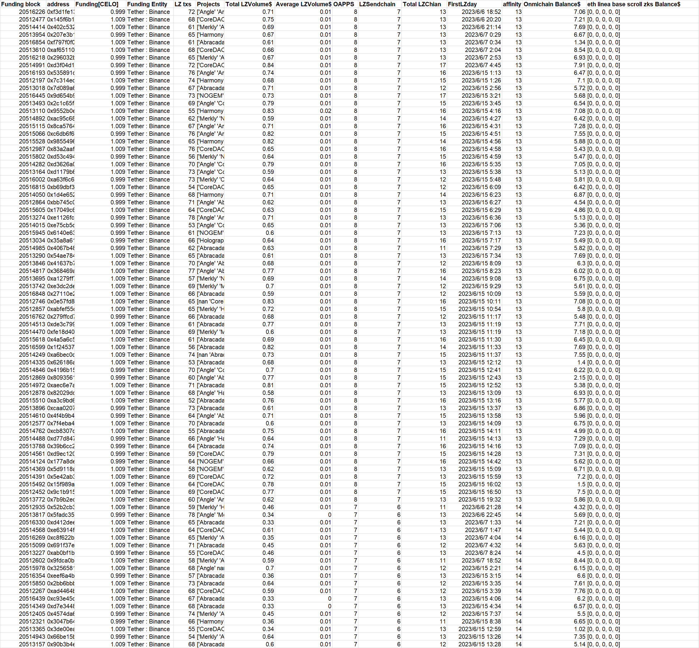
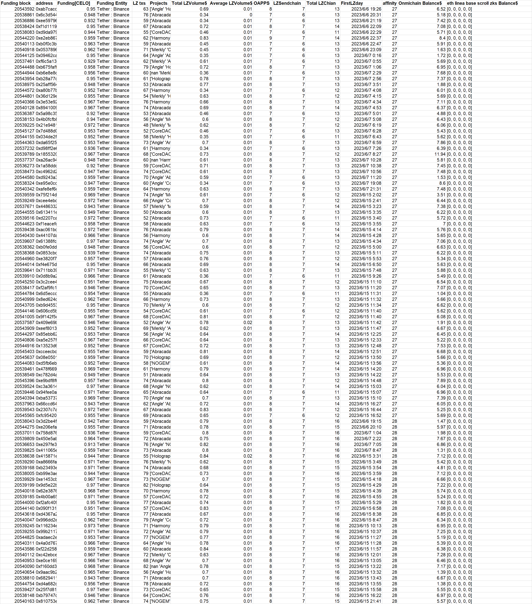


---
**batch1-8**
```
0x38cf408f8ae1869a2a16054e3bfbc518972f65b4
0xba9bff4728725703df0357031413410a39da0159
0x5d3277aa0d4094a4674da05b02eac750bb534655
0xc815e583341027dedada7ec6041708cb0e956b2f
0x442171a9d3171d69149bd1c02a13c1861d6cb1b3
0xbfa542a3cc99c9b78c14f25592a0fe2045c24190
0x546c684b67e3b13ed57b1fd9c275f22a2e280dd9
0x662df7fcaf6805e05ece32e427ecf937e840ec10
0x01a62a30ba9080e2f2ce50a0e08ea2fdc87a87ad
0x62c8f55c7beb1e249eb7d64d2ef76d54a7ecdfab
0x4a2da98db28feede4c015a52aad6af9f301a16c4
0xeab7d12f5d16817a5dcb1cbed601d352c8e831ec
0x8f8fe495d745d335a8727cb3547020eeea571c8b
0xf6254ed2e4dcf4f0958239b3199b5bf059c9896a
0xfd37042bbb2bfbf3ca0b3c4607dc97885cad137f
0x0985c2d3373adc17efdc9f25d89301c17f0cb47e
0x8b1221ef92e442c1bfa5b8a09fa9225be9b61f30
0x20a7755e3fa6a59493f51a774ba619be5eb62dcc
0xd4fa96f848e749f8f6825699212f5aa3462bf406
0x5b570136b64066e48f234ce909904f47fb0b9c6e
0x55824f6f30ad990c59974a306c4b2a5da6ac55e7
0x5ac6c2fb262c3d914f153a70d2ba29a39ccdf5dd
0x63ecd8e13c54db6023f8f0e2cca5303d0bb7f57a
0xf7a8a7002ab2ab52483df1ac43dcb74e2ad1ca6d
0xd57dd3bb2238e732fbf281d712da77128b6f6d2b
0x34f8f2d111512d908d7ff0e5a9b210e985fb790d
0xe6e1312cd7aba9b2d06c1b82931c51f48cc62c48
0x9d777fc93f74e65a155f3d3aa84c7f680b7e72e6
0x87cce33b3c5de9193f519f0f78fb2d3970fde648
0x287df16ae6c0d6fd076a397f98d5b3f6ceaa39c5
0xec7984a8563d49f15d92abb3affcb8cdd5c60f1b
0x46a4917e0d3252983c6e8a87a2b7f2de534f2760
0x57e46aae856b5b47cde00b187a21b53ef79830da
0xf5dc0982fa22cf2e9a76dcf7be97185180d7c61d
0x83b2ace5070a25159432ed3c077c9cfec07e0e13
0x7900a0ff497d4de674eed0e8c3408f8086414963
0xc6696c24712edf2adb6add14341f6045f21e3b03
0xd4fb43474ee435c32989b82f13941a98ce7183d0
0xd49009046bd2a14ddcddfb20a423e6cde0689b69
0xf09e0e67e8e12fb3cdb88ea6a34e082418e9925e
0x15335b66e9d4afbf4c8512d21ecb196c9102d89a
0x51f720a059907a412beae4f8d45b759665cd63f3
0xc86dddc68e2aeea4f69c985273fcb868e7f76f28
0x7f99c090e92f6482a538ddbbb42d3664685bc4f4
0x86f090f6ecfa32651e6fcfe44a27524a54498bce
0x49600945d5ffbcafad432fefafdf68040862a11d
0x30a33c7c3a0b99311b0c2c4a5246551ddf00deb3
0xe670701d63747358215ca860ba3e31666c1feba6
0x2958c4c9a7e522741f75e764d5fcabf0c45591ae
0x5364765299f210eea871f2e9a2b92a2a779c0b96
0xf2322aabeefd6af15e08194f4a3e36e5938e9886
0xb4b5e98b928d2fb9f61a8820deff322b1683a726
0xa09231271fb796d51ed50e0731ad9b57699cc836
0x6b4f3fedb5ece289f8ab928e451442fca5b9cac6
0x9dc3b17691c62b366d1edc9685061fcf88806e27
0x463dc74437188260063131e3def3a250bddc7245
0xb1869865821a131087aa8f331eb420787cff27ec
0xb10fb3d769e926c20af8cbf74e5af3da3745e7b2
0x13a259d81d3367a04795b15fd429d484833a5d7e
0xea37125168ecae766a6c7dfd0a2ac7f39201272c
0x7e5df15ec90d2b4cc75d8159e5b4e31da74b6c83
0x63cc6ee6e130761815fb6812f66b67ca2a06cab6
0x5e8bff066291b82594380029c110f310dc3246f3
0x4e055ddc2d8b7c42f1c5739a07b2b5f4dc0817e2
0x1de8fe1e26c27b3436bdb0651fadd6993ca9b938
0xad095101c7594f84b4ccdab94801843294733b33
0x46f938e08a20fc80b7166b7a256c03ed0c23f3f2
0x1a4c0754bfeb299c646114121ce1109aa6114248
0x2f1417417cf5bcab9a2fc4fb5f30ffdcda5fce72
0x9054b13b40ba62114ee457b3364cfcc6532fc776
0xb2668721c5511339ef134f6438e74e3a575a56fb
0x88135a0687e22599bc01164103529e1f00faa5ab
0x434c8b0cb46fcdf17408da6a04e41a55ddb28c1a
0xd914ee908df7d1e0f283a26e321268caaa14c46f

```

**Extra evidence**

Batch1-8 and Batch1-7 belong to same entity. In addition to accepting CELO in batches on the CELO chain on July 25th. **This batch of addresses also accepted approximately 0.163CELO(0.15$) form Binance and the used merkly to bridge gas(0.05$)** at around Apr-02-2024 06:08:01 AM +UTC. Same fund allocation for Omnichain wallets. 

**Data at a glance**
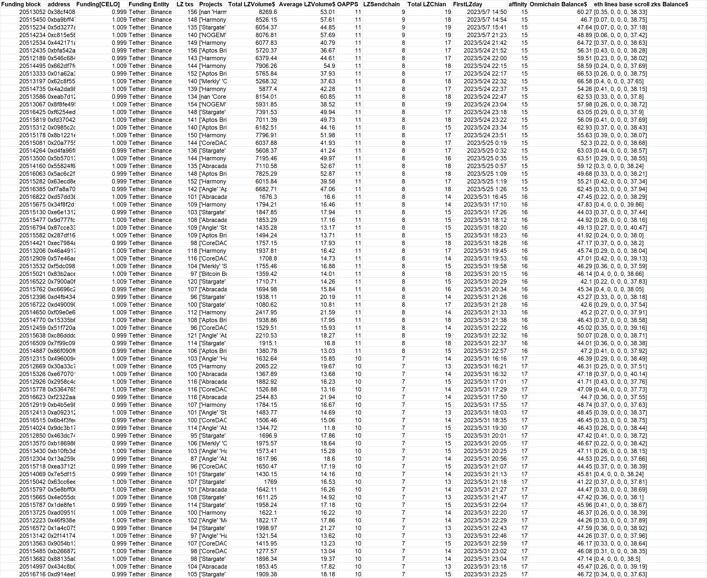


---
**batch1-9**
```
0x94647b53cafe78ecd212f722c8ce8bb4a5b8e5be
0x1b9425c9a502b03811c2bfc05ea06a64762764ea
0x2bbf50745cc12607254698542435bfad99b6190d
0x363c04e61e202f845d733cafb55d1fcddcdc72f2
0x2788eee8410a7f0732c0b7ef0e7b1178e2ac8288
0x27776280f42dfc758bd2dd93022ca2cde8c760fb
0x710f728d92fb3207c7a96f84c4d52158aecd58df
0xb8f7c16f9d9152d4e0fac7bdebe6cb0a475ba0c6
0xb0c8d52fba72ccbe6eacf984218c25a78c674172
0x6766c5454b185c9c2e1be0cf1d7d2cdf671262c6
0x2da13b20639b7ea22a87f977eb69b0ea5d2de615
0xa874db8dc490948747de35bca59765b6542bf44c
0xe68a1f999732cc5ac668513b88f71be092d56e19
0x56e2259f9fac077feb9465130ea8c444b280745f
0xe2cc1624f33c88d3daf68829d0dc3359d89cc4e6
0x4fd2053d5737cc5b9c8c10cc681cda4b1a2c8dc1
0x99400dd441599c49c251364cae417f1838d23813
0x7afb82bc8bfcdf8077c6420218da80e2748ead69
0x0ddb978faaa640a882582d37ff99b915db9dcfe0
0x1ea2df45d9a66b7803d2de6e790ba7b4ed2e3fd5
0xf3f97a1445f94e0c1deb83c3a9bade42db5fdb91
0x658a04b7b2364e64d65adec068d799bf0951251e
0x04bfb5895cf99ebbb06f14d03e2c021bf1fd72f9
0x1467c516f73f4f090592ebd0e740db8e2bbfa9ec
0x7637499689ddb5b3f90649c2c86aea2d65dbb583
0x82380b58b02b2722bef966afb22d185f0d871945
0xd4552aa79205ca381f3025a392ea5f8b859356dd
0xfe2389a24282f05a57475a147d3a8175c7dcfb0c
0xf251a0f560033fbe55a4f8d016389c155e692dfe
0xa2a7a35a832e3492df93799741bdacbc31441fe3
0xbb7f3f399e8ea6072a0670253984e4d7bdf15217
0xd318a6b76ec462351752631263b18e2cc63ef183
0x1f4400bbcb07ac0ceb20bd1d11cc7617254af51b
0x49ca974d9c0bd4ddd7678d81a30fcb6cf42985f6
0x0938a1e9563898cc92c8838df4b066b9e0821389
0x1dd03b9cd2e6f7a018a01cf91149259c9adb698f
0x7f6feffbf630aa6624d22e64ede9a0d3cfe860fe
0xe92ebd0769c7eadf9a06bf8a4677a20e8c98048e
0x4e8a4882cad55c8dbc8cae764a704d008b72ec58
0x9e2b2407691d7f1c32491e9c23586d90ba950cc2
0xa1d9901653297a077f6ce6118d3f3575ac7229d9
0x5e03fdf4da96101ed04a34547b87db358d8b8770
0x534cfbf1d7f9924ffa53c9e54888df890ebffced
0x5b123a1954410c0401ac4c18b7635559b1b5bd3f
0xbc8e743dc72829ffc486369bbec1d87b9e0c6bde
0xc1d428513c047bd44569debf03b97d662e2c8cf8
0x9543566a9ab85d6df7151737e0fc57abc1525108
0xe1188b8fde9bfb951dd51b9b31ac632feaca9d3e
0x978536226a3d83fed31a5830b2c85cdeb71021f1
0xab275b5ab26487cf15431929101c2f617cf55939
0x040782e24a3d654389f24e12b32f0681233e98d6
0x15763316f896be475634ad980c7a3a233253afb5
0xc57fce93a1c527c5c976e5d5ed20255e79f840dd
0x739da40c49554a010eb30beef28f8c32424131dc
0xc70cf1b42bed4a41056c553f64d7dd5affec3f2e
0x24bad99f7e443b08b14be03b6a56c4fb514db869
0xf470038d8829ffd0521689fdfbce4316b0984765
0x12e52a99b40705b027655b87c8167f4b14bd9caf
0x9bebe5b7e73ec223ae4ed3fd011203db9c0ae7d0
0xd189e5a80072669529e148ecabf45dd32b836a60
0x2565a6d862f781e60834c99681243c9ae666bd9b
0x99cb52121a58b9b77c383b41a0921610ba950a67
0xe182b9c3ef46e162c9e00fc10a4712b7978a1d54
0xe2891d8fc80367d6c918648a234f985375bd7643
0x5ecd49e17e0e20d7877c340a194066c19524d2d7
0xca3d730dc3a09ca22480c383ccb3cadb3a4f2ce9
0xf0a732aa1027d42593b0b0b86430d1ec30aa843f
0x1d720e2137577a7dc96dd9915169e3bef54906dc
0x0aa5517e08c1b31e0ce12c7be7fcedffbaf4b81f
0xe57ff75d1d9530178448248abe23f5b9ce5f581b
0xdb78f12ebb0c4457e90387d9c2809c100c4a56cf
0xae988efb2665092a43c4d620979aa84c175e2ad2
0x78007348def795b6b05b0d266081e439bfff0870
0x91ceed6bda1cbac32ec1fe877a1a3aaa17525555
0xa1639c9756fb3644cc29a8fd292cf239966101d2

```

**Extra evidence**

In addition to accepting CELO in batches on the CELO chain on July 25th. **This batch of addresses also accepted approximately 10FTM(3.6$) and 0.37AVAX(5.8$) form Binance(genesis transaction)** at around May-14-2023 10:04:42 AM +UTC. Same fund allocation for Omnichain wallets. 

**Data at a glance**
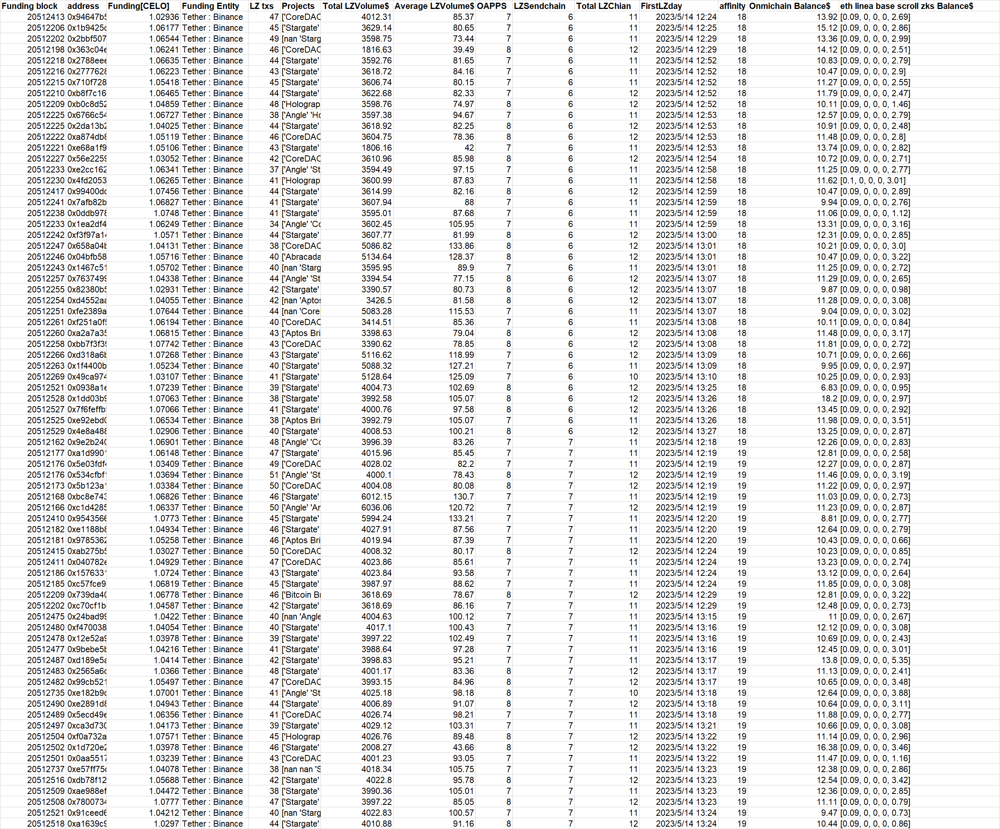


---
**batch1-10**
```
0x556a2037cd66bd8f0f33497fb2847baec87ed7f3
0x0133f82b058e1cc82c5e57cccaaf3c8bc3fbce5b
0x45c602ef14479c01e39b4dc55a54c29dec5b860d
0xe0c405178fa0198d7b3c0222f9562ed4752fcde1
0xf29c21b1a733233b97bcda59a0cd8384bd66cb7d
0x38d4dc4872c6d0ef9f893b11d68be5963f93945a
0xd00d7058313393d06dc228fa7a0c8855aa1ca65e
0x7bd028d950bf7c3be41f73d4a867248078faa6e1
0x09e9b596eb1bb856d6e77a3086d9498481d02015
0x917d5867826326dd47fc3d2f390f80fdc7c644c1
0xf27cdda6dff79f9c380f864c7b9b4c19f4d958c5
0x48b5138e78bb968638323b895aa5d4d2d5002421
0x98fed1a2aebb2a72a433633cf4fed0304f7dd344
0x4cc25e483937e684f1e64606aed15651da2db995
0x8a179c8e1eee76d7e62a14634d60e6e4ddc3ee03
0x9deeb8f0440d03032f1088d8330bcefbd7226cbf
0xc855ad87318d811e7be5fdb19e78795041df7dc8
0xc41e82b33b3d1793daa26f46edf85a57d98d429e
0xbab25fe41437a048dd3d3defa8f8a4cc5f4f50a9
0x958283b995dcfdd6b07c3426a87fbe6e5b982052
0xa831e77099e467b63c48a3b17bfd27356d181181
0x7a45a289bd6f50ce7056f92e55276872284a3189
0x1d513349d2b62e9caa6fd2a58f2f893f2a5d6bb3
0x22eae36973a241d0707ca3bfb60213c048442bc1
0xf23ee65b8ae98ebc4342d1ebb5ab42d0a15f4831

```

**Extra evidence**

In addition to accepting CELO in batches on the CELO chain on July 25th. **This batch of addresses also accepted approximately 10FTM(3.6$) and 0.37AVAX(5.8$) form Binance** at around Apr-27-2023 10:16:37 AM +UTC. Same fund allocation for Omnichain wallets. 

**Data at a glance**
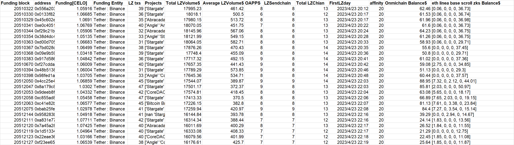


---
**batch1-11**
```
0x4e405382c03f9e28a5ddcc2c61a200640026713d
0x3a4895487d72e1c779aaf82ca9040829f52a1a4d
0x5a8f2d5036e9a7c756bcd1dfce2412a6f89b3c44
0x07a0e9a8bc6a0226cc8fbb0717226ed34c180ad2
0x1d83ce439fd16d5051ff773a4975b4e728ff2300
0x600928b1d824f61d266e22b25c24ba8185acf597
0x33d6a790e38575ad75509c465694e63b206cdaf5
0x834141cbc1a3c00852a9eb60519c283ac2dca892
0x6deb32f1dd6573afaf5bad754f3a971b4eec73b4
0xc794e095e473c7cbf3f4e50726534347dcd90ebc
0xe9c1ec1a1f0b4f3839aef9e58f066acc329ef3fa
0xea800bd930be9ace5357f750189dfcaf71801815
0x854ac13afc4ac0066864de1a52ea97121fd87415
0xb8ba45a9f315fa56d0d02b1375fdea1a774ad267
0x0e7c1d7b6df2d09942665c2695b06ee332e96e68
0x8d96b52b4119e5667e3c69550ec83fda98271e6a
0x3c1c6f31cbe0d3096bf31920d932b0eabab44caf
0x84f28891079566a49f06e8b28422ae92d5620ce4
0x3068f981358d0e0e0e2e4b34f4e91cf36fd24504
0x9b1506d66d97e3a7f8a274d426117b474c241932
0xf124a402ecf9e825507cfcdb4b6e10ee7e7e8c89
0x97a46faf9fa8a96008369e821b811f98ebe20e22
0x96b97ae324362afb03f1c4cf367e65d8d99fe6df
0x592f3fe50010308b3aa8ba29647554f79b851cf4
0xd7402d2ebd633f12e6b1e34a0bf24cf921532786

```

**Extra evidence**

In addition to accepting CELO in batches on the CELO chain on July 24th. **This batch of addresses also accepted approximately 0.45AVAX sent by Binance(genesis transaction)** at around Jun-2-2023 7:54:28 PM +UTC. Same fund allocation for Omnichain wallets. 

**Data at a glance**
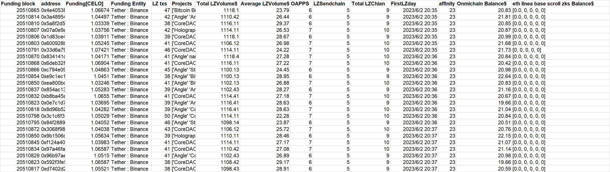

---
**batch1-12**
```
0x6f99298f269f9462f5e9b92c51c2716037cb9715
0x6046fc87f2c26888bde1a180cfa0f989b4a7eef5
0x951eb44995bcc6c0add2294289fbc65e7faace7e
0x96749cb2b5b538d6029742ac1fd3871d4f00d44e
0x62ea37a71061e277c16267ae405bc28c33bca14d
0x149f3c2382e384ed8618506859ead0ba7cdeab2b
0x5032c9bdf15f6e4b7b7fd315a78c2c6873ef7040
0x331e07edcfecf0a8e8dfea90e2bd5a9489195805
0x0c0b2d2d0dfd1d724b0be17e5739e8054297be46
0x566537bfe953b3adbe696c9fc7adec527e07928c
0x950dca7630099e5810665fb524a7aeb7bf7a28d5
0xa8308873d6c188e0541e405076f14cd248003fa9
0xb4c769e2f8f35e8767549168c0d810b5bfc23253
0x436f2faf2d7fe9388e2c783e444d9828d9ffa3c5
0xe9a13a6f720b9d667a89a81f826dcb2ba6a5ac12
0x2785a1fe06899c4625ceab64fcc18dcbc23b7824
0x1a5806a634e20f8d46c7e8860079f2a750421fa7
0x951c9272e46d33fde61575e761b24e71a9498b3b
0x38e927c48c6a3723ccfff7ff6ee10a3d99bdfbf2
0x4aaf4c9bad5ebeb8860e53d931f62cf8c5ef744d
0xd13a0c6dbaf7f8dbf14a7761edc13c9fa85de27d
0x413bbf020cb5cf25568a75072c551964f69db05c
0x013fc3939c116042d03cb289ad0a5fd235da65bc
0x86624e0aedf81e5d59e23c5ee20f0317488336a2
0x572d539b29985a7638ee10454d700d699047c0a5
0x257748ed545531dcbe515a00773bd0a84ae08984
0x90831e4474f22a0ef3a2ddc657fb674e3e6f10cb
0x85989bc80636dc0687d9e12e2f64a4c9bd0f928f
0x0df75d79f2808a19574c84b45af25f7e3419be2d
0x3ce7ea6138ee7cf4a6512710b9abd9a84e860c4a
0xb2d668e71a7bf18f688a32cdf88ca2069d2e0304
0x4a557dd1c219522aeede5ab010db0f2d65c6782c
0x4b907e50289161daa06555744f36f4d4b5aa9878
0x45de9554936a3db8cdc8f96bc3fc1df7010b97ec
0x956ec5d1ae6275080a7ca9b89de3e1a7e47bf0de
0x5c54f17b5a0f13e2eec052f1da0c6d414757c37c
0x0236966fd3df53af9e16c66a36132954bdbc72a4
0x80923b1dd7fd5c8dea7fba2049f1fd48bcfff998
0x3c7a7727b29c5d2bf3f03143617506ee07641d21
0xdda165e064f693a8779c2c08270e14bd32310ee4
0xa0514b3225865ff6d0c7e3edda02fed77d7aeaaf
0x33b19b19b0f5ca71fef7a9a8999009d440ed2390
0xcbd86b3c3a4475d3bac7574dcc8af5b66c93a391
0x49bc3c82b5ab5e9ae1b17de16eebd4df9235ea00

```

**Extra evidence**

In addition to accepting CELO in batches on the CELO chain on July 24th. **This batch of addresses also accepted approximately 10FTM(3.6$) form Binance** at around Apr-25-2023 09:02:44 PM +UTC. Same fund allocation for Omnichain wallets. 

**Data at a glance**
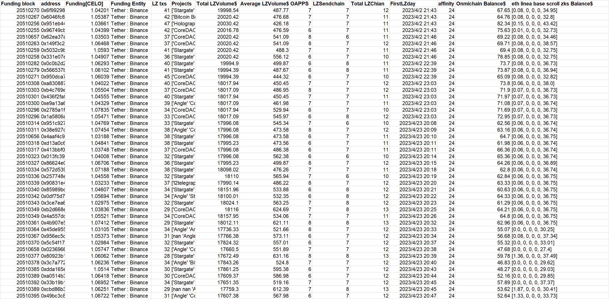

---
**batch1-13**
```
0xed6b9d4dca9e23eb6ef7d2b4e2edf83485010827
0x371cb07e65d60628429f997aa2ca36791a615d90
0x7cfe084964c11053619d1b02f563d2689b596103
0x2aecc26cdb59def35cd4f281bf7467ba0b7a2c1f
0x4895b060d9ca77e73a440066c30a12c18ec0d704
0x84a6b518d592d6e4b8f1c00bc69f97439564f90b
0x9c9844e0a4a96cb1035ce48e21061d3678c83ef2
0xa6864ac92846dfbb3346e94864f5670ca577c17d
0xdeb7f7aac7cc2e00c7b0f6729f8175e785d3a8f4
0x4c9aa393fa816dce9af534caf720118f5e429cbb
0x088393c040837ad12f6e1b05e476ec94ad423a0e
0x6b490b420395d07b896fc2dcd6240d61abfeddb2
0xcdc7d5ae54b84cf397d35b4af9e34d8c28253d05
0x68f79ebf40e09d48743e98dcb5b6ba7c078fcfe0
0xae5d00a707f304575c05788309376eeb4567b0d2
0x83a54ee696b9c1d4ac70c8e198b5b4c5b89684b5
0x22a28e0996a18f13019af5a2301f455e0c357a1b
0x8476b5909c29f34dd86075e6a4306ed8b3ca8301
0xd8e3cec467b85d8e421ec66858abc72ec6e38b89
0xc47139f91d59217f786c1a5fadd549b194e5aff1
0x52b2eeff6d6d28eb81e80931db6b4c2db27f4e36
0xdd909472ea5434440f42e84a54925cdc6ec8019b
0x12066040efb48d3a6ebbf3910f585c0f2671f7e1
0x51215139868267b5dec9ff1961fdd31062d40bb3
0xf708cc0edbc31add030d5d05c7a9b0c8f7346860
0x2f1be13cffda215bc46952c45a024db00b4bc987
0x3a3c847734ac3370b04250e85c1a536cec235630
0x182dd748d0eb30b728577e5c49aba284906ad8e6
0x9f6064b8e1359ce5b8d07639428635f9392d7958
0x28b7b8ce5d8dc93c14cb0d8d59a7329c4bb30811
0xac1b7965e3dd5d94b70ad6d74eea77a8fddfe6fa
0xfa14f93fe47907b64ecbf8f315cfca930de2e055
0x52c8019a605fe6725f25629d0f2740c09b44da2f
0xdb882cde2db0ff0c0765a15fc8b199be6eb1bbea
0x38d6fc72d4d342c59cbc4bfee0c1e56148a18395
0xc2eb212c9864f0b4d6ae848f838bb78c7f38c213
0x697c33bc7cfe48d649a8c924d00c9cb5c046c938
0x66922403eab0e87421f52e462698f5f98f624653
0xa78b4b7910c581f3af343d3f71de50ad3ce5a749
0x5ec68a487a70a05194c5166bc42c96f685ef7509
0x5a00f2748df9603a3495de8b5fc5060a44c60ad1
0x8a3fd19d8cfa9eadc0f4527fe8db346c2a71c2a3
0x10ac36d84945154aca11435175de77730869f538
0xa8cf8b144365ba5381de2f7fe6a08b377e3dcedb
0x44272e7abe1ff753e195b7389476928c97c37e49
0xfd89de49c561b945eeba814609b71baf25a72f19
0x1807c79c01cb6667c7fd2e1d29026738171e8190
0x21bfa362f85b37fc3d608306292ee672d98984b4
0x07fba68058b6726c7c65c8fd471029c8593778b1
0xa52ea21a610016b10595e02f94ace6911cce307d
0xbb233a3f8cfcc8b0d3d90d895d1bba4075849e5c
0x09b2a3440ff1f50a555787a6577da42acffd0a96
0x3527a5f101cee79b6b5d23ac52a1619ad9b1bd7e
0xadd1c4687f1a1f49398c31701abff55614e9dbc3
0xef98e003a108a0897c81f85a80870eccc9db7094
0x1540b3aadd608067221633caa7139ad13f5c5a57
0x4c38d145bb66d3ce5efb14e39a514e510d88eea2
0xabffa576b4745f432909b27aa7b26e9f9487d433
0xaec269acee3ad0a3382fe050f3e64159a2a042dd
0x57c811a6ab32ba20a91a8c27815f64b0bc325c31
0x7b0a74ebe9dcb9297f73fb52c2a067c5cf647178
0x18ed41b523958053f41f00461a1858f34fd8f186
0x9b63f61f2b5e95884c2310055e6cbfdff6cbbe33
0x559b540eedbd4d4098273a986d8271608e44b888
0xe71ea0d562c4746cb18862ae8df54bdf4e248349
0x37662a0d74e6806e56b48bc0058ef5e09c56adcb
0xde311e267ed0384f62faba080bc247a5e842a77e
0xb6a54b3b3b3cc9854691171736b4fad518c0039d
0x5798ddc438dae08a4427bce86b5af19723be80a8
0x10f400ee9cd389e71688304489eedb8622dbd35f
0x719f02fed3a5e0035feb0ebce25e81b625b125a1
0xbccbbf7ca32791233e79ff7083879cdfeb4ad796
0x081459e43b8b3eebee34c5ad8be604311e1ef2f2
0xc7d8277b8ebfb4b4dacd405f0c1aa482868a3449
0x20baeddf61988d5aa9b1afac8746de51b6ac9b37
0x87b2aaa908813eaf12250ae3da237b10e108cc0d
0xf24f9947559eda7a1f5b3359885b0c4c408ce443
0x6c2d11951da994350215052ca617904989853a11
0x029d79898f7fa3b1e2b75fd9ab537ef6cac1a746
0xbe614acaf76b933bcd2837b3ed56c55316c6f683
0xb45727384a21609191ac652ac460f5ad30f8c403
0xc47f746c0087e13e22d56b131440692b77ff2362
0xe537d57074de12e12dd4e3e82b6b9efcd88a5787
0x4f1bced03f28c381693d356205615f8ad08d14bb

```

**Extra evidence**

In addition to accepting CELO in batches on the CELO chain on July 24th. **This batch of addresses also accepted exactly 0.96CORE form 0xd1955b(unknown address) and then used zkBridge to bridge ONFT** at around 2023-07-25T06:27:23. Same fund allocation for Omnichain wallets. 

**Data at a glance**
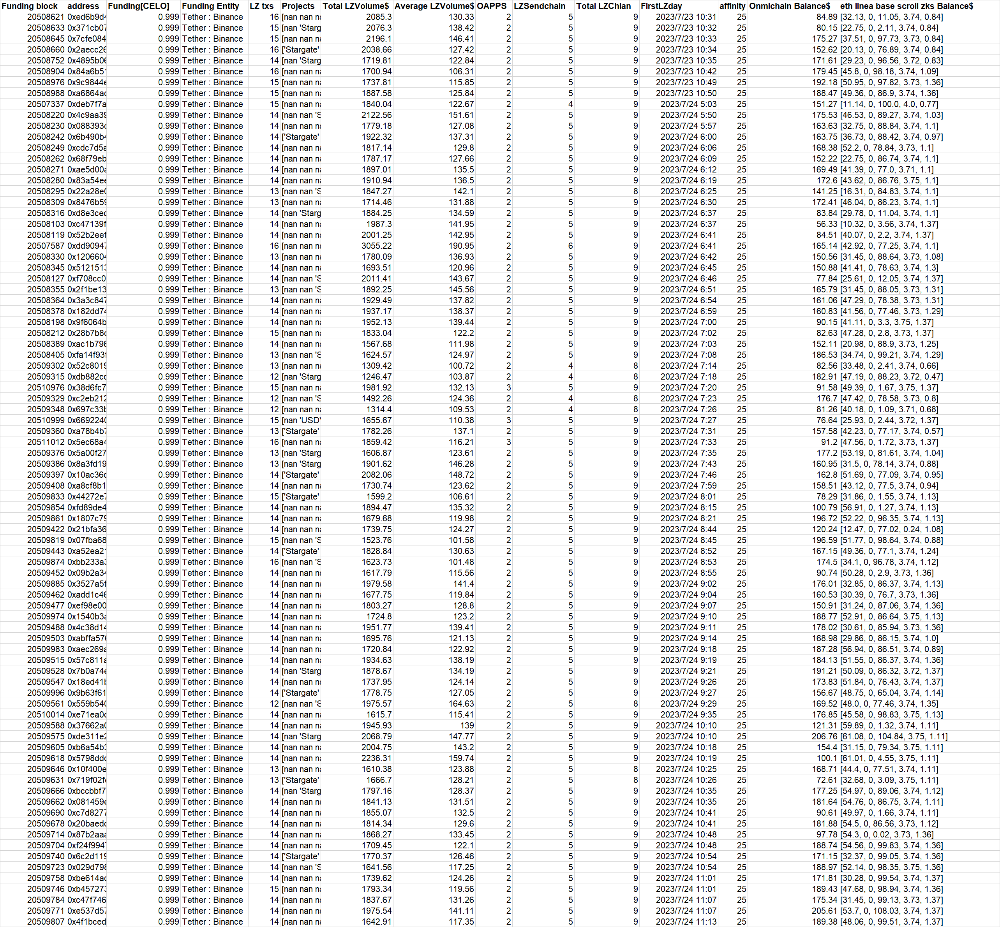

---
**batch1-14**
```
0x1e29da9472833b7e6089ae94c68c6c69f0fbfd60
0x114e5311d451dacb60513aac44265a18c05270a1
0x9843b11e182fc57fd21f2ed60f7b192eb65d1b31
0x07bad8f7a7c1749d1446afb5b6380d9a1b7b950b
0x92c2dfc634edd96818dbc9f1f32b5706e02907d3
0x8e35bf9f1e03ff048f08e5856ee0bc1f8e5a3355
0x0ff5c3e43e39cd79c3e8e0ce70178b134d434905
0x4fb4a6e1d4de3fd957f624ab569769fdd0f1b3d4
0x18002f0e11378ca8b4e5cc9519de2c2493de0004
0x9bb751f651acf0ca8228790ed759c3b477fbc8b5
0x74f47db1d4d6a5dfff941f7b4ff57839e4b75012
0xd4e0e9416069fc80637fdf59b2f56959a195e457
0x7d0e1442cdb7b959f6ffc5620e3342c745fd0cfa
0x4593f12d1059a01b6144aa83999bd2a40be6956b
0xef789fbb41b5180265f955fbd0740e48c45296d7
0xb3ff41166bf59d381e1bc02a21615102026e391e
0x72e825852dd7da538b17a7a847fc0467d83cda9f
0xc7c2b9d1aa5b6bc82303b4a82b13f7c7cfcaa7a9
0x3c88dfe26eea5b450a87e959daf734028d3ea2a6
0xfe84e848f43f20ef352c9bc119b8446b0a64bb89
0xd865e3a5393da4f456c1082f3c782c237087c33f
0x2be78a3566a3ca9262eceaff70e8d64b69c87349
0x9f2f9dc60baa76d6fac7b38fd6d0386f2c4218f9
0x3f19f402f5b74063b53393ba49b20334a15830ba
0xa2f1001cd823be9137029dabec400b105a037704
0x0c9aa0276afbdfacd23524521409c6bdbd47e0db
0x1c99a65fbae46c4ae21427b776b803969e1bef09
0xc44853b9543fabdf06e5a936f52d87e944692132
0x4154a1ca7000bf05f4506ef06645a8ee55f42e78
0x186c8d376e5cfa8f6fcd5eb33c3b80dff1f46cee
0x9e41c8cd0320f97e396b7a41be50a21014055cdc
0x893305a45419068173aabdde14388a1c9625ed9d
0xca7df6cce313ea78421a327bf8b58bdf45813e30
0xdeaff23c2792882280d6aa3389fe328c8e70656f
0xd3e1d6d995b404478874fdc904cf5dac119d5524
0xb41dd6ccc5e50bfc1566d0dae31605926af665c0
0x3f29972b8e3db8a55a7ead4d32fc377a40820d0b
0x8342732d8e60680d125426f8cc79d9380d4b0a8b
0x29784336d965065331e98289d5a05f7a0f659884
0x83ae378181a40be2f707799ea81bace63a7dbda7
0x54ca80f927ee56ff786e3be3f29951b3ade5a1a4
0x426eb53e9bd2b7b6791ed6845ceb2d4b3c17f1f6
0x02a62f97163e4e637edf7fab93b07f5e96e2a949
0x48798799321c470110b80bead689e2b819937a0a
0x6a7290e1c61f97f01f91aa832fbf7ea8f25f08a0
0x81e5178ca9654c6a7ea9b05947994a32536446bc
0xff6bfad62a4029766fd74c58d382d80370ebd144
0x5f17e171892588d6315f001c245657f6e7381b2f
0x66b256fea4843c3583d96f2d9ba46a2934620c75
0x7cb00a06e8aaba0708f195a4e0ced8cee88512bf
0xffcc3b843d9442b8b5a865eedee98aa3841d5b30
0x92f3228ab608ae653f730810148d03cfb4be78ff
0x05bc71937d4210dec31f588a5f7807aac66c99f7
0xa72ba79e03424a2b1060ddbe1482c6db810f7872
0xa5b82d4b509e0afbe81cb76387e34231f7a49b0e
0xf9e994ce2db742f52af5e5bcf18f5802173bd7f5
0x64b5d1fd145f271d41c5d35ec883bd0a4429f0d8
0x7ffd23035fe4c7eafbaa8c9e23d3078d0b7acec5
0x9a9921cbd40481a3d6b19c35f1adbab12339b00e
0x44bf5ff89319f525ddf82270d9e0029e7c41b5f4
0x9ef0a1ee31d119874e70eec30c01f4780f0622a9
0xd934923d7b146c24589f32ae45f376595ad56d5e
0x33eef2f3abd20b945db5fbf1fc39784336358f6f
0xf61c68c06b892f3402d9fd5f2fff8fa0cb9440f8
0x1e862adf4eff7d78d2d442c859c6b2b851fb2f75
0xf9039011d683adc95df9e89b57b2abc680efac93
0xa4164b413c8ed2cb13803043de75c02b6eed75e7
0x513c91b940f06fa107c5d8a49275594e3f623363
0xc4db28ccef814a5652ede996e89efb2ac57b3035
0x84b29fe61135adb8e8d3b3d5b3c7b42235c48fdb
0x1017382e4b224cb64cbcfae0656b04037743f6e5
0xfef0f8d45e5f14f51507313044addc690e0d9139
0xc522b2ce2aa9c5bd4d644a878010555ea57a5e7a
0xf576f7136c45ca0bb5af8c96659b12aa44710d03
0x94523a06cbc15d826a5e1462da24a3f053004462
0x7e345edbb8082de7eaf383ad3ec88a7ae923bd9f
0xf0db525a754bfba82f9500f26e0cdf64af69dfe2
0x08b6ae51b417766c9ce8cce8c0dbef331c0c019a
0x2488508f2c87c5ac228c66771905fd862e20fb2d
0xf3c9e217299b231e62821fd2853e8a3e2212d447
0x2a21d6f0db99de15aa56cc56c86e56843575cc85
0x65099abeaf0a307c19e2e380fc184ee140b7cc6d
0xcd4f8fffdc9e2323bdee47dc18fadd3f27d2c39e
0xc41eb51776d1ff55a37e5a2c01267ade858c72e6
0x22df8160d8267ebf2a932e126d70c06804cff335
0x27d65c260802b019b03592b4b3392874f4200230
0x52d3a52681abdc5b5e21b0788584bb4da5526e37
0xeb7ce53c7fd103f50e6778b87c333633553d3a7b
0xe419508c2c3436915c1c96295d2ee5f3ac5e31c2
0xe09d2f28ad40572ff2a157a800c5e03624b86f6a
0xf4a205ffe76c783d17c85351a546c297e6ce8ec1
0x38a712a20da306025d2aaadc037a1033264a0d5e
0x1dce9cbbbaa8c6582c2c59500f2443cdc057a84d
0x526f884e479f4d99fd2fc2fb660266e73dc39811
0x7e77bf92c857de812eada3e262091b4247bdd2d7
0x1b46c8cbb3b3d28542431364f64af182432ab6d3
0xc8decb3b0d732ed1e6454954b7ee11f0b84f3fe8
0x485bb64d6966baead2121b9aedbffa0b36b83b50
0xae5ff6e839dc8e4f390912973fed877301231eed
0x31ace1320968a7a23f1b0c414d9cdfa42947d54d
0x53a888085c936cc243a8f052ae369d0da206b8af
0xfcb8b49982be359ad0469dd0397337740a04577b
0x51e15e283bff22394baad6db4be7cb9a9e142527
0xbf91339990b52765d0953802fc2154b5c417b0e3
0x0f3bded90b0ab9c84751463c1695613ba0207386
0x1a6d1448f5fd84b8568e3c1eacdfb9f38b27e0be
0xa5fb7e18397dc8308c6a7c1642d0d5d5c3fecaa1
0x9603d1b8826167fc1889855a465b84904ec5f3b2
0xdfb014f23ab4fd47667bcf81e56cd1f4d3a608f1
0x5c7acfe5cacf7eff8dd4cfd70800269568fc923f
0x51d98557e578a145dc2ac4efeaf0f965b7e43f65
0xd2eb23ef180a3ee435b29318516567f4f8a8d78f
0x86fe9e7d0117386afe7dba1d43b789a40c68c8c3
0x26867c7c857fd76b2de296d40e4655d2fb0019ef
0x4c54429d3cfa7bb7dd57e581789513f09ff08cc4
0x2ba8f0742c7752d987c35e85414280c2a82ccfa4
0x29aee664cec93abfe8a66b37f9b1ad01bf5683a6
0x8b7f81430fe4fe4c9135e491c032cce46410a2fd
0x837ce8da6bb7fe4c261ca2e1781196bb8f3b9b69
0xec0190931fe64f0bbb750237bf0b3c588e096236
0xb48a4d1fef8695bbd11e08e6a3a90f24b1c1a897
0x149ea0c5ff9b975923c06cc0893661fc9478111a
0x5ffab19ffb0dbbf30389f88bc29268828b796918
0xa403fbcca9d3481860ded9c212a5150834dd7bc7
0x2161be8a96297bc62dd5015396f708b881c7027b
0x4a9a5f59f88f201b53d7a2d0508f856f2632de5e
0x90f53325827f1f393b4eda5bb5683911516411b2
0x51adc61ae78c35be4bc998807e18fa2fd0c55220
0x7792b6116cae3909ecac9f14c3d1509f8b30950a
0xfef9a72b610c63935b9aecfd88215cdae19dad84
0xa66db674f6c66b231e77201695b4382234e1c155
0x139814be5c96781eac71c3b29549e87fe1dcf153
0x3afc3c03c14a19ab2a8a27d60a27d4a8f9cf7715
0xec34c12cc1c789c8780dfc93bdd264e4c5e0401c
0x958d326f2373f5c0ebe92d03309bbbb4a88c5a1a
0x3f132d31c3b2af1de5d0dfd357eea5bb224b9e96
0xb1b58491dfcf78e0f613697f6cabe5fbebf70c13
0x113029eaf63218acc0db0916ca198744960a349a
0x2ba5bcdd9eadb8f61226690161a775c14dcf4cf6
0xe8e3b35fc11b8e0277e68cc9b649749bca3cf771
0xc41ab6343a178aea928a2fc8eb4bc93e9937c154
0xa36d84f9c622a7ad96e001be1c14155291132a34
0x3aff57527dbe24da95b3edd3d44d45b509abf57c
0x4a92b781d51f0f9701e71bde1bcfc426357cf8dc
0xbdcbf14729d98bcdac9e30aa71a41894f2e658c0
0x1bfa31b4627fcf752d1d4dbd86c4ebf1b130eec4
0xb516c10e6488bda25f8cc2008d4f0cc487d54431
0x9239da535d8fe4891dd4b3ce51b7adb9252439c9

```

**Extra evidence**

In addition to accepting CELO in batches on the CELO chain on July 24th. **This batch of addresses also accepted approximately 0.51COEE form 0xcFE2B8(unknown CEX) and then used zkBridge to bridge NFT** at around 2023-07-05T11:29:21. Same fund allocation for Omnichain wallets. 

**Data at a glance**
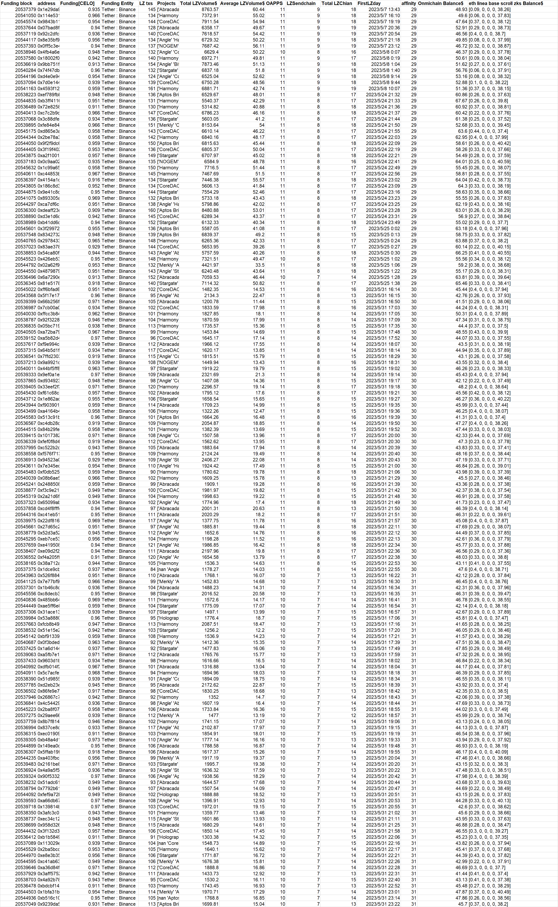

---
**batch1-15**
```
0xb56207641d40855c9b5e6a0610d565d502590390
0x4ea826da9409ba932ce6be9501c552e05381bd51
0x535bb3973640ac168e2850bf9a86ff734842736b
0xad91e8c0a49dab18532b13d2244107d45c8a9a45
0x5ea192d91e9248e66b942184d883926de5a43a9d
0xe69d9220cfeb7372cb04749c47ca5088eea170ef
0x404765cc9bf1cd47fc6c317d9856ae5e903d684e
0x6487b5f202a2b4417d488ec3aba959e9010bf487
0xe1eab82d14fa0fb9ec9224a3da494a5a710abb9b
0xcbe063a2b7f3197bd4b75125588af193441cfe2e
0x96efd21b6f32b8d40014320a0eb9e9b9da31b32c
0xe60a88996f678d29123098dd2c4ad975e47f0256
0x850caea9a14f36cda2e8cecefefaf5a97e7e7b09
0x781b1e104fb26377e1efd8a81da11d144461f008
0x87ed1b679b1514e1721038edf1846d5d5f3c4895
0x4501526e478e40f782474962a281d6c81814cf1f
0xada98d0a36f3d8d37ac7e4976c1cc200984d5dc8
0x8a7af060ccd8a68fb8486ca2c8e308accf76ecee
0x02fa80982a53cc9435691993ad9c3c41a0ee7f1a
0x5af4cccce0453755d3a85128cce26d11868d58d1

```

**Extra evidence**

batch1-15 is liking batch1-14. In addition to accepting CELO in batches on the CELO chain on July 24th. **This batch of addresses also accepted approximately 0.51COEE form 0xcFE2B8(unknown CEX) and then used zkBridge to bridge NFT** at around 2023-07-05T11:29:21. Same fund allocation for Omnichain wallets.

**Data at a glance**
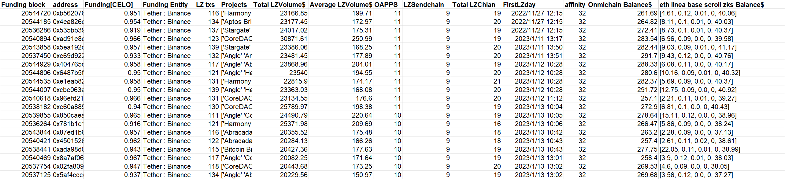

---


# Reward Address (If Eligible)
0xfa8d0fc1c3fc17396ace8758079b42ec2dc7bd79

# Appendix
**Affinity propation code and filter**
```python

import numpy as np
import matplotlib.pyplot as plt
from sklearn.cluster import AffinityPropagation
from sklearn.metrics import pairwise_distances_argmin
import pandas as pd
from sklearn.preprocessing import StandardScaler

def affinity(features, df1):
    X = df1[features].values
    scaler = StandardScaler()
    X = scaler.fit_transform(X)

    af = AffinityPropagation(damping=0.8).fit(X)
    cluster_centers_indices = af.cluster_centers_indices_
    labels = af.labels_

    n_clusters_ = len(cluster_centers_indices)
    print(f"Estimated number of clusters: {n_clusters_}")

    df1['affinity'] = labels
    return df1

def filter(df2):
    affinity_counts = df2['affinity'].value_counts()
    valid_affinity_values = affinity_counts[affinity_counts >= 20].index
    filtered_df = df2[df2['affinity'].isin(valid_affinity_values)]
    return filtered_df

csv_file = 'dataset.csv'
output_file = 'final_aff_result.csv'
df = pd.read_csv(csv_file)
df = df.fillna(0)

features1 = ['Number of LZ tx', 'Average LZ Volume $', 'Number of OAPPS', 'Number of Chian', 'Onmichain Balance$']
df = affinity(features1, df)
df = filter(df)

features2 = ['Number of LZ tx', 'Total LZ Volume $', 'Average LZ Volume $', 'Number of OAPPS', 'Number of Sendchian','Number of Chian', 'Onmichain Balance$']
df = affinity(features2, df)
df = filter(df)

features3 = ['Number of Sendchian','Number of Chian', 'Onmichain Balance$']
df = affinity(features3, df)
df = filter(df)

features4 = ['Funding block','Funding Amount[CELO]','Number of LZ tx','Total LZ Volume $','Average LZ Volume $','Number of OAPPS','Number of Sendchian','Number of Chian', 'Onmichain Balance$','Onmichain Balance$']
df = affinity(features4, df)
df = filter(df)

df.to_csv('final_output',index=False)
```

**A schematic diagram of one result of affinity propagation algorithm**

The z-axis is the multichainwallet balance, and all axis data have been standardized.


**Dune SQL**
```SQL
SELECT
  date_trunc('day', block_time) AS time,
  COUNT(*) AS transaction_count,
  COUNT(DISTINCT "to") AS receiving_addresses
FROM celo.transactions
WHERE
  block_time BETWEEN TRY_CAST('2023-4-1 00:00:00.000 UTC' AS TIMESTAMP) AND TRY_CAST('2024-4-1 23:59:59.999 UTC' AS TIMESTAMP)
  AND "from" = FROM_HEX('f6436829Cf96EA0f8BC49d300c536FCC4f84C4ED')
  AND value BETWEEN TRY_CAST(0.9 * 1e18 AS DECIMAL(38, 0)) AND TRY_CAST(1.1 * 1e18 AS DECIMAL(38, 0))
GROUP BY 1
ORDER BY
  1 ASC
```


