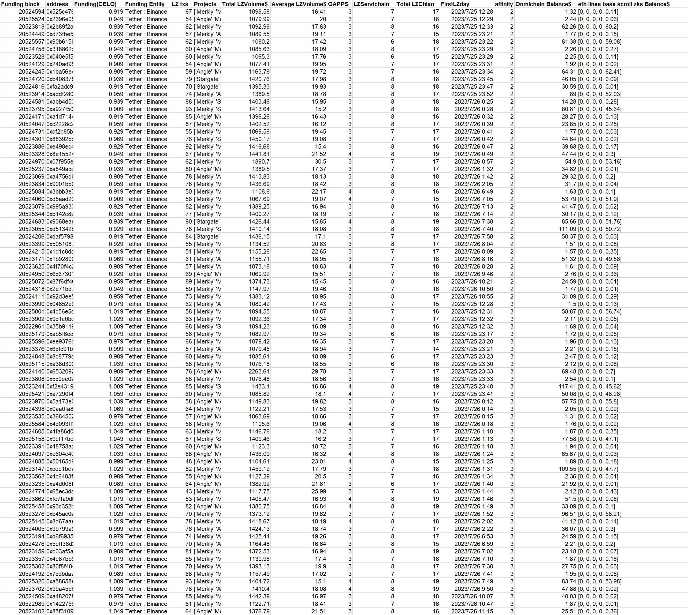

**batch1-1**
```
0x697e20307552031db4827402cb7a0fac972e3fce
0xd0a68fde37cbc8fd805cbbf5c12290076e9ccbbc
0xc986406082ada4eafea5e5f2781cafdd5e8dfffa
0x6dbeaba6692d45e33269acc6f94c3ea6aeade023
0x48dd6d2c9ecb618778dbb2013e529965f83dea60
0x3175b223164b4666fb99f4a129ab1709b2f19f59
0x55f9d731a185ca0c213a0c0e58c7cc779ea3565a
0x19e174d575747816598f5c2f86ab135c345bc735
0x17e88a26be6f4b5ff2fcd35600b3e2eba942a6ae
0x5e7a8511037807f961586cd60c107ce44cc8d9e0
0x33730c77cb29f447937a6b09831a825368fdddb3
0xfea139000369723c9ffa27ebadeb64b8ff51eb77
0xc86d42fee323b6ab4e67c87a62a3783e3ad953c7
0x1f988445460a9381b1d325440df9fa9b6e5b76f2
0xea763edf5b28340af97256e750911d13fe66aef0
0x417c66c754c0181d8b02772a26136d79da385f9a
0xd5b8db1f98970728f261979d05ed2643931fd31d
0xa9d78ac4b26efedab7889d00636ad35b03233a17
```

**Extra evidence**

In addition to accepting CELO in batches on the CELO chain on July 25th. **This batch of addresses also accepted exactly 0.1089ETH or 0.1189ETH form Bitget(transaction on genesis day)** at around May-16-2023 09:35:35 AM +UTC. Same fund allocation for Omnichain wallets. 

**Data at a glance**


---
**batch1-2**
```
0x525c476e038e40ce6fd49271928b29fded5ace49
0x2396e0564b896507cbcb3bb1bfd0e9479b28a59b
0x2b89f2a47687124524dc9be2494201e236ee2d26
0xd73fbe5344631b6445cd8ba626a0a850dcea916a
0x90b615b4552b7a2088f80083f9646e9336e6dadf
0x318862d27453e37265970e2c67b6a889e51f7226
0x040e5f5ed8e4c53d1a9a5d3a9cce435b4fe79157
0x240ad957f212f015210d30d06eadfca99484a056
0x1ba56e4736aaf9ffab7cdf34b1cc6fe5eb9a73ca
0xb40837877fd04d5caee851466841e098e6505559
0xfa2adc9f6039e02ee1fa72598d485d04db0bff5f
0xaddf280f3e47eca9ac1818d9adeb40f10784e4c6
0xabb4d536beef7996e1faf2f4baaa080f857e5d7f
0xa927f50cca9b5ac6d636bc4c87f8c747f45c9b6d
0xa1d7144a6a0840f7a52c41b6bee2b7b940c5d98c
0xc2228c21baeb31c935aeb914b6e9c3825a8354f1
0xcf2b85b2e9d95899991c22ed2bcdaade3e858116
0x88392bdcf6ac9d7c750e78c07c1298235650b815
0xe498ec4bec63d8b704b3ac977beb45f41de49b02
0x8e155249b87576a3e01eec7d12cdc845f3d940d8
0x07f955ed42b71e3879abdfabd156e900dd966972
0xa849acd86fd689631e435cfa988cb1a7cabd5fd1
0xa4756dbc1ef33b701c081691b8f44c67086d760c
0x9001bb9f6754cf841f238da6ed55d0853a54dbd2
0x3bbb3e7c8676670937a9cbf5fd1dd2032f1a6e57
0xd5aad23c82a41139b47c8cb2bbfc4181af827153
0x995a933eec89da9d8b2994c4b121f68c7bf7fdcd
0xb142c8ebd71aa5ebc1f200ba96697a16e3c5aaef
0x9368eaef329353dd60b710f84bb8005b9ef89cfa
0xd51342bb4f723bdae875cd5317aea0a894573220
0xdaf5798aeeb63aaf21ff016737af99f047d375f2
0x50510878fc0ffacf551ba3d5c729c844739b136f
0x1d1c8dafbd08ceb506a851576efc6b8ba649b7c0
0x1b928998e427266b12b82b61ac0aade15e5f4f9f
0x4f70f4c24d92d8b882e10bb0b6be4ba708744239
0x6c67301dad85c6a5d7608ade8626703a2c815435
0x87f6df4649348b2a2d5080a37854a0fcfb4d0007
0x2e71bd78ba1fa9662a90f0f4239aea66594d1635
0x92d3ee57db1bda20ebe99b4094e7023e1382915a
0x04852e95f5a3315cae52d0e9da715a77cb116d38
0x4c56e5d899936be5ba9617d9f925096f6699cf52
0x9d1c0bd77ae04229a10396741b9c324d8fef70eb
0x35b9119c61d03529a6213795f0ffd4d8abc9de45
0xab5f6eca18ba34ab0a2a1e15a68cc0a80ac34069
0xee9376c78d810527110fbcbd90acbdbb1c7a22b4
0x6cfc91b34373e02610c2c13e603cab49e3677d5a
0x8c8779c2917938d82eb630595567d709e03af661
0xa38d3067a3956a570509ba558b7ae46a6e1cb0fd
0x653209264c5605836bb47592c3058c50d64f93c3
0x5c9ee0283d53e6315a3f84f933a22c3b45eaccaa
0xf2e43191167516506db05b893efed857f864a27f
0xa7290f443357cc756b0dd0cbfbf86b02c667ed14
0x5a173e082cde1ed3a821fe9d62736d2a3144ecdf
0x0aa0fa8ea778aace3df6c8c7e24c263954db3b6f
0x3684502102771086ed028b3bc3337684c16aed86
0x4d093ff3182299d60413033a4774fa7a9b531555
0x4fa86d05f17f2c5050e146765024d776a44c8293
0x9ef17beccd7eb6496e01bec122d17fdbd60cbfd0
0x48758aa58fc0c1a21cc56447a1cdd11bdc7f3340
0xe604c40ef8def14f3cd5f5dbcaa75aee2e56f1a3
0x50165d630c39bd0c2040ce31e6171bf2b8b6ebd8
0xcee1bc7e395d52af6933b146cc9cf04bf2f7541c
0x4c6483f8b909ab884b381335440e10fd3775ea39
0xa4d008f5cbb65feae7575f0009a51d7e47f5be51
0x65ec3dab8a7d9b39d5e79cb575745746b29eb207
0xfe7fa9dbc57ae1152650ad56039466ea2cf1a65a
0x93c352ba6575a4649ba7afe889ab08b4abf81117
0xb45ac0a61b26e68df522534fe152e1d3c808422b
0x8d67aae0121127db40c07f2b982bfde5041ccb82
0x99799a66890ee03e14f112c998cb1e4576f9c2a8
0xd6f69350a6441f5e37e6b7b300f4e271829db308
0x5eff36d267e9adec97e1e284a28b27d2e377588c
0xb03af5a62d96d6418c66c4c02d24bfb45b96751c
0x4e87bb6912cb0125df2b56118485993ef3a3c076
0x80f8f4848654ef293b0385624f1e28132b06bc60
0x7cdbda7d3e5c6ae93f6109437b3ee8b1b0e09104
0xa58658eb0716752fa7b532bf1efce3bcf62a68e7
0x99a45bbc4f9549bcf9436970e2dddc5c6b37353a
0xa482078651c48eb8803ebfe1ad1663fd91234047
0x1422759a335a6c0a75fd7c79c08e62b9f771d69d
0x85f3109905be123f0dde77b894c3e4e26408ad4e

```

**Extra evidence**

In addition to accepting CELO in batches on the CELO chain on July 25th. **This batch of addresses also accepted approximately 0.001zksyncETH(genesis transaction) sent by 
0x888270...(looks like CEX address)** at around Jul-11-2023 11:28:49 PM +UTC. Same fund allocation for Omnichain wallets. 

**Data at a glance**



---
**batch1-3**
```
0x16ad2a54d03ecf4aece4882d14ce6d03408cec85
0xec7f1d851394b195736ea75b8ce35e274d237050
0x2aa633eeb8d870d2af2ffa0ca314d312973214b6
0xf81889941ac2ff919caf4d2f25e8ac7edf1283ec
0x9ff5a978b220123881f1b69097085af7af6f4c6d
0xa52d0dfeb2eb97646a0b26913e86d53885047c74
0xae3d5f32b24a65f7381bf4d98f76d3cc4781b44f
0x9461aed5ecd028eee7557efeba7b65b3e0815afa
0xaf13e7fdf99dcb54b848d25b72dcbf951ebd9642
0x9702ad207e95287c801d9a4f8890883f5312f73c
0x29a47e0c85d8fcc4a051a87293b62d0037c3f4a6
0x7dacb08e5f7c5d84a6f087b2cbc5db8bc5cf9cc4
0xe752e22bafce245e860e78d560a3d0b068a691df
0xdbd4dc639503368db0df435d7f8bf04cbba9f789
0x28549ac56e79638b8ad6a82206664a700066b023
0x8da86626306d85eb9de811682ec0a9b63c287671
0xc02e65369356a78be16a8df814b1b1ecba0cb4db
0x0d1a587c8632c1faba38394bae8318247a64d281
0x9894b2f3c7764696a3588b3422804961a38b5054
0x58a6576677907b00b1d91ca723b6924794786ec1
0x06dff4d200c0b5537fad91a1de5f9264be5702d6
0x9599cc6c27663862272394db8d848d3b58d04f57
0x940274c08172073f82ddbe6e42989d3e2a85c558
0xaece09c9955c4d766ab04391ae1de5ddf54cb450
0x638e3f582bdd161bea895c7f55afe09608930ea2
0xa2f93f344f91549e738bfa9ee955cd3f6edecf7e
0x84a8ae5d9fedf527310f85ce771516b722ce9bc0
0xc58d430b1acb20330186c009ea3c7b17eb9ba846
0xfb7db49ae2762e7f927bb1dbb39dc3ea6d694d48
0x207f8013843d17ea6a27a7b994a61dacd503142d
0x2ddc66c815750ab631745c7faa37e7d2bbfd38bf
0x282a0d3ebed78857d92537e8e6754ec17064a788
0x2f5bfbd9ff27f9d4d42df2076b959006084b3b6a
0x81712e5131c78ba6a79ba7706343ad3dbd7edf67
0x716e7b2088385f86813f8829808faf098d93c0b5
0xc93ebef581a67b0b572637900354662e36bb7941
0x746e310cf7f59c8b08b60c6df1ebd667760a3f44
0x76cd6679d02d12a03c85502395a220a58e47d95f
0x70e7f1c58ba42dd1d50584185032afd0d4f0e555
0x4658a5e518ec9b54bedf335c84e2ce38e162fd2d
0xfe418d7a7b9f60902a0591af16fdd4bf717c30a0
0x4af3bc9e5c92b0b7a13225e2b9161f5da5ab0676
0x73bdf0bec2f84ecf3c65de3f64753a1dd9f4d41d
0xc8aa6f8bf59c3d907372a2f9263f13f207c86e75
0xca92862550eaab06315b966aa87c55a7a22cfe89
0x1748c9e0b35314083cf2302a4ef9e67bd99857c2
0xe911fcb49c76fe6a88d786551f31d16811be2845
0xfc482b72f9aba3637e9fea60ce494648139156a5
0x3e6a70461b1b8f2264b40f039707e8fe22d48afe
0x8b8fcd84d0fef83bd54e0922e8f2d2e0d51f1701
0x4745bbf5388f0b529e45bf0427ba604bb52bdd86
0x0858812bd055d69495b5de5992db8b7808b9c11f
0x842a258f0e4f339e672ecbc40a98312729273ac4
0xb3d04a2bad62cd5425dfd9a78fb3f0110f9f64e8
0x7f04f2dbb652f22624325dc006977052477aafce
0x2ab6bb776cc28c2f9da0c3cc505f5412e0e56ed8
0xe0be082615836f81a1b941e86de778d731d80ef7
0x1ecca8f872b78b5d74d930b437930050ef2e95a7
0xd5c56cb9371f4ab1b8d35560d1dfbb0c4ef9b188
0x6e5f366e6d5bea032824ffa0a771f8751a156fc2
0xd7ee3892149c256630869e245d188577bdbd676a
0x99383ac8e8cbb822f6b53d04329d6c8a023f5240
0x3dec0f3e55f2077077f8dcd1139bff89f1523c91
0xb9ae1bd2ee01a20c7b7364961e4866f2353b7560
0x5a22d258ac795dc8953a2cfbd1d66d7a672525ca
0x6a376cf0a55b128e2160f70b9c3b5c9ee775625a
0xca3b9d975426e6b8ac28159b8673d2ff27d04a71
0xb74d12a4b1e025686f072b4302f43a2c046ef86e
0x8ccfbcb87e8f5b1cb51ed49abba66c0c607da453
0xaaca7eb4bb63af64afdfa8371b24ba091b914536
0x7a976a9a33faa05523b37c0a83d6630b75049c32
0xfef2648635f375d36f24589823866d89e49c01ac
0xf03b4caee7d2f936539c93fb0a75875fda5074e7
0xae0b83e38077ec561375237b5895fff84bebde15
0x6e49967005f8ce70fb3bb76596e863657b4ca8d5
0xb859d5c9de0d2962282eec8c6cfdb155e297d326
0x2c5fd2e12a3f959baf4e25a701111ea3c0b795ba

```

**Extra evidence**

In addition to accepting CELO in batches on the CELO chain on July 25th. **This batch of addresses also accepted approximately 0.0018zksyncETH(genesis transaction) sent by 
Bitget** at around Jun-30-2023 02:43:00 AM +UTC. Same fund allocation for Omnichain wallets. 

**Data at a glance**


---
**batch1-4**
```
0x208a9bb512029239acb4cc7834824c8badbad316
0xead35a2e4d6a6c7f15517ca409c2f29734d50356
0x1b3731479bb9db0576e3b0c75eab8a3f581821b5
0x97ac9bdc6b169bf71dcf4968e778c56a54d4c6af
0xbf54a6f732cb062a2ddc177dc385685812b53ec2
0x796597a2f7d43515811e40c7aee15bb5fe0fa2d8
0x77b09c9cf12221c9b97153ddebaacb68fd689546
0xf60d27b9c2098962200d707f491470bcccc49006
0xfc79f318b66ed5529880c0de3d6491601458a170
0xe61458094a0be9fa2394427ad688d10b73b5d466
0x9d816e145e925f52d7fea2be8d56bc07a7002d04
0xddf8d27deb1094b726881995b1249b04f4e3b013
0xa8710633087dad42767474cd87c538ecbaba3055
0xcda5da14611dc814936629d97299a9404247995d
0xb4a1bfde99858a0c9dd86d8a0029e894353ac699
0x331c34c797d21ea2eb9b6552060301b4dfd891f1
0x69302fbe8cdde288225c59075db929e6ab80f3f3
0x32fb8d16d0871450ffec17afb85b88c0c51055dc
0xbb2762332280e88cf11b9ef86fab08312e1221e7
0x66648d2115b96a3fc714a85ef5906ee2d9f00f5e
0x5d2dd2a50526e623f5ef1597d76c29c81b385fb5
0xbe938afadac759ad37d40ab4c1bf01ffc20b9431
0x91132ff31acf32183cbf61967a487ac8b011c03a
0x160f86af28133feb6b7b39d8f2b1cb70517fc77f
0x14e41b26c4d46bcb6989ca9e9acb169f85a072cc
0xed35b6d4335c863007b8c4aafe6a356a498c8842
0x11ea5b5a8c81b000e01821861453dabda2614fce
0xd1821e2bb4c34544111f3fb77457177a23836695
0xdb5319a63d5117ef98e2875351d988754c1746b5
0x59b36032c2609c70a7731fbe1bb4093a16608c50
0x6cd0365900e70cc4d15d40fcbd617aad7281bd5e
0x1001576ea66f1da4e320594f53cb37a4307f4ef7
0x8c2934429c2c0438858e95b9f458a09ab0b6e485
0x492af0226b3405d98629ab420f8f3f9f8a80b01d
0x0e56d12bb358e6685d7ea3fb428e518bd4e4850a
0xf670c59a70db7bbf3470f8c0d4a8c38ada922ac2
0xaad086c2945335fac4ff5fc3699675e268b46226
0x43e736b115e629df4950ba07baaefffe0bbbe486
0xa1a7426376630b4657d2478c365f3334ee6cbcfb
0x07a81a8dd5b07245d60b4e45ded429e833d5a9dd
0x870e21af8ddc5699d62c99fcc4ec9ed6a57d4822
0x1b7b420b9d9d4f099233bc4e37a998e9263cfa17
0x5333a50bd54dc37651577164eb7bed158f688bd0
0x31fbeb22baca608b308a21879a45aae14a892422
0x5915433468d9180211fb05cffc38849131ad794a
0xa2ee504754fac645dd1e912ee6e04e5ec37d6228
0x9b1a43821df89a16938d4ed1daa4b879c0860950
0x334f8a3a285e001c9a825361ea04bc5cf0c3073c
0xc17c51d5a3038be27c133b9036d35f92b4ae58e1

```

**Extra evidence**

In addition to accepting CELO in batches on the CELO chain on July 25th. **This batch of addresses also accepted approximately 0.03BNB form Binance(genesis transaction)** at around Apr-28-2023 09:47:26 PM +UTC. Same fund allocation for Omnichain wallets. 

**Data at a glance**


---
**batch1-5**
```
0xa54e9853ecffb4dd09cc7941a76f6cd01c1cac73
0x7532ffa099d9cd3cd09671bbb16739aaeb81aad0
0x40a4210a72198e107ef45437991d3c58e0f53716
0xc242de8eecc6e45a7035e0da8039710cdd092c98
0x478b80656021d32cb887e0925b7db5406c4dc7ae
0x38be60b962dbffb8db77d878d11f4f30f3d0a142
0x87ae29b6ebc0e593d08ab8dee40de69c40e0c29a
0x6dd5204c6972c658cea49cd237fb17bdd182bc8e
0x696f1da2fe2077bea334e4238cd72d2af8330d6a
0xd3ad1969557cbad2c217433e21f534c29f61df7e
0x60107a547fff3da733f5a77bfa9d1eb683d8b57a
0xd31264fa111951919813bee331e5d1a695f3eb76
0xfad5391e5cf0cb192ca47cd0931e96743039d934
0x3151a4679a6463662ca075e2a8c96019e462f4a0
0x5db353a4dfa6f750cc41d5a1ded593fd6d50a921
0x1be15e7eebd3879b1747dd42b938547a1525ff3e
0x73413a9882fed4e667e885fa6a763bf14019e680
0xb1b061036dd260f6d5464c046d21ffc4337bff39
0x528fce6c6c688f3899a5dc07bd5cba341c7b1f4e
0x26dd5649931e761b1e87d026545ab5daee6c176d
0xeb1436f9fc851c85e2c791a82e8630288fa1dadb
0xfd81ac579d3eb45eee7154515e723c6205c5ece4
0x5746fb0d34c3dd5cb952cff84bd683f215058b5e
0xda3832e8a04667fbef7c005a3457f68d1a303219
0x51b7e85948cfdc83d50fb8d1ec1654dbf92e01c4
0xe1a73d513c1a880dd87c6dbb170d6b8c76735912
0x673394b61d435f8d9cd410123c18fcfff96ccef9
0x49d0dc1cecbc7f73309d7e4aad14786ba55ff4c4
0x62aece72cc4fb6da4472d84b9b87716b4043c012
0xcfbe1ed16a235f7dea2553ee703938dbeb75dce8
0x7087f76040ced95eae15ba34c177585d8a2116e2
0x54b642fd72ef808298cd995d7390d79bb818c293
0x984fd45dc339555a35a67fe26049cc3624f67d6f
0xf6a1072c11969d590749bf53d0e6deaddf8cc3e0
0x8d8b9630a18bb1f25d9614e178bb17ab1a4bf394
0x246fa4419ad4bcd8328f7586b131d5908d345f20
0xfad3982f6198e596f4f2495f8345862de81542ce
0xdda3a6611640f3c2aad929c336dd347735a1a75e
0xb45c7c578f7321bc068d4a372b74a104fa844edc
0xfaebb30e88b9a820d48290be5413dacf08821720
0xb720da9d4f32bdcffe8df43e2009853bd88e9cf6
0xf7f2a734c9d542bf546d6b767e88836d6f009ed8
0xf6ea1f5cb8712e65968f10c48d2d65559cfcacc4
0xe1bd8872c3be39ea90330c75550ce4d9b4c874e7
0xfae40c019394111b4b5888b70ed64285f09ce2f0
0x21fbfbbb5ddd2768bc4cd449a67dd2e37dd0c5ca
0x17e79481b8c398a7ec3a0872f1e8d84d159edc35
0xe4c6385bf269b0358d3aab0a924324959667f02f
0x5a63718f0531bb8f7d2c3cd580b1180804c40e53
0xeeb92aab70e301e77c290f1a0265cc8ca968f6e1
0x6fc7225182b1f25b6dff2086d7f06fc05e4a6924
0x371c9d7f056bb75970cb7b46b15d6c923bd66f6b
0x6b146f6041c9e567816aa54f8b464a3598392d19
0x4f7cc63dfbd51246caaf4cbe83d538a817aec33e
0xe22bc83414de4d99a44aa6b33aa92c2ae0c256d4
0xec9205d9eb4a552a3d611339674aa99361adf72b
0x4423c8a816b94edecd208c96e824f8834d163283
0xf81750bf3773a6866a8079969965863f5889cbe0
0x95f680bc39a2577aad8fe5a1bb55b57dd600456a
0x67a6da86503ac04c602fda35bb5ba493a39317eb
0x66613a16501e4c81c113687d0e9a84ee6297ae29
0x85b54237263e37c0f6ebe0a7c426c06701cf318c
0x89f8b41a5e4a52f27585b588dd6b0b8f73a1f04e
0x783f67dc651b4059e4e1948d1cfd98b406aa93da
0xb113fa45991bdfbeb22385222fe5b013dcac1c5e
0x061098df8334f271fd472607a4ac88513d4f771a
0x4c457bf5099c55cd942a8adbe662ab374703cb67
0x4457df6cb93bbb30fc9da33cc8fcbc747f551f99
0x482ac5e2b92eb6c5dd0215b37ca4eb1bbc15f8dc
0x61bf6972993fff4b932871b69c32cc26cc192365
0x873bde8fbcea496e5a568abef6a313cf99479f6f
0x2e01fb72a065e4c071a23d60986ea13f1f2c7428
0xf60be13d7b10c4d69375bd78db8e0c144f041008

```

**Extra evidence**

In addition to accepting CELO in batches on the CELO chain on July 25th. **This batch of addresses also accepted exactly 1Core(Core chain's genesis transaction) form 
0xE07F73d(unknown CEX)** at around 2023-06-20T18:33:03. Same fund allocation for Omnichain wallets. 

**Data at a glance**


---
**batch1**
```
```

**Extra evidence**

In addition to accepting CELO in batches on the CELO chain on July 25th. **This batch of addresses also accepted exactly 0.1089ETH or 0.1189ETH form Bitget(transaction on genesis day)** at around May-16-2023 09:35:35 AM +UTC. Same fund allocation for Omnichain wallets. 

**Data at a glance**


---
**batch1**
```
```

**Extra evidence**

In addition to accepting CELO in batches on the CELO chain on July 25th. **This batch of addresses also accepted exactly 0.1089ETH or 0.1189ETH form Bitget(transaction on genesis day)** at around May-16-2023 09:35:35 AM +UTC. Same fund allocation for Omnichain wallets. 

**Data at a glance**


---
**batch1**
```
```

**Extra evidence**

In addition to accepting CELO in batches on the CELO chain on July 25th. **This batch of addresses also accepted exactly 0.1089ETH or 0.1189ETH form Bitget(transaction on genesis day)** at around May-16-2023 09:35:35 AM +UTC. Same fund allocation for Omnichain wallets. 

**Data at a glance**


---
**batch1**
```
```

**Extra evidence**

In addition to accepting CELO in batches on the CELO chain on July 25th. **This batch of addresses also accepted exactly 0.1089ETH or 0.1189ETH form Bitget(transaction on genesis day)** at around May-16-2023 09:35:35 AM +UTC. Same fund allocation for Omnichain wallets. 

**Data at a glance**


---
**batch1**
```
```

**Extra evidence**

In addition to accepting CELO in batches on the CELO chain on July 25th. **This batch of addresses also accepted exactly 0.1089ETH or 0.1189ETH form Bitget(transaction on genesis day)** at around May-16-2023 09:35:35 AM +UTC. Same fund allocation for Omnichain wallets. 

**Data at a glance**


---
**batch1**
```
```

**Extra evidence**

In addition to accepting CELO in batches on the CELO chain on July 25th. **This batch of addresses also accepted exactly 0.1089ETH or 0.1189ETH form Bitget(transaction on genesis day)** at around May-16-2023 09:35:35 AM +UTC. Same fund allocation for Omnichain wallets. 

**Data at a glance**


---
**batch1**
```
```

**Extra evidence**

In addition to accepting CELO in batches on the CELO chain on July 25th. **This batch of addresses also accepted exactly 0.1089ETH or 0.1189ETH form Bitget(transaction on genesis day)** at around May-16-2023 09:35:35 AM +UTC. Same fund allocation for Omnichain wallets. 

**Data at a glance**

