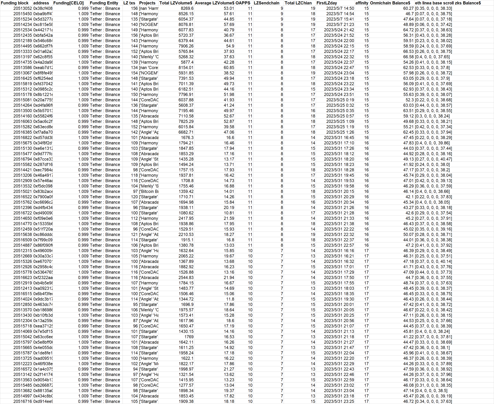
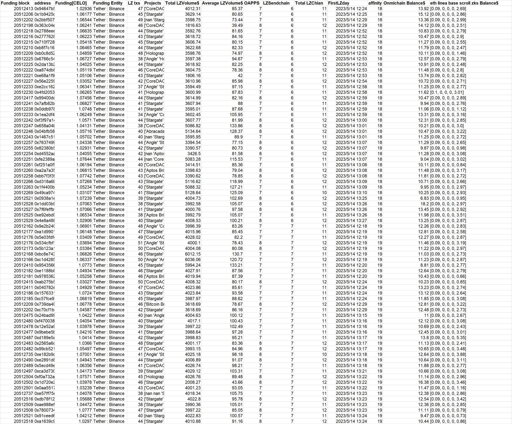
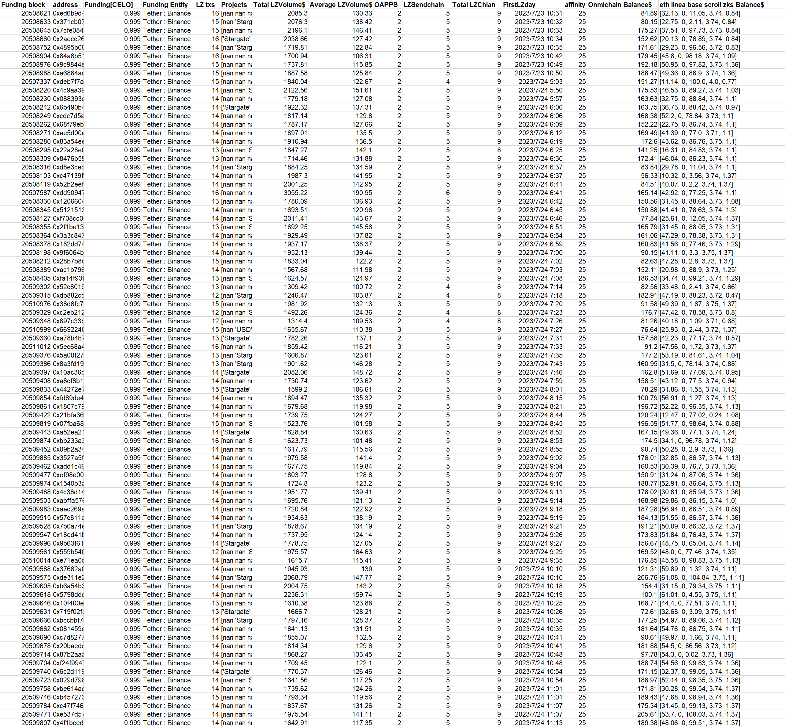
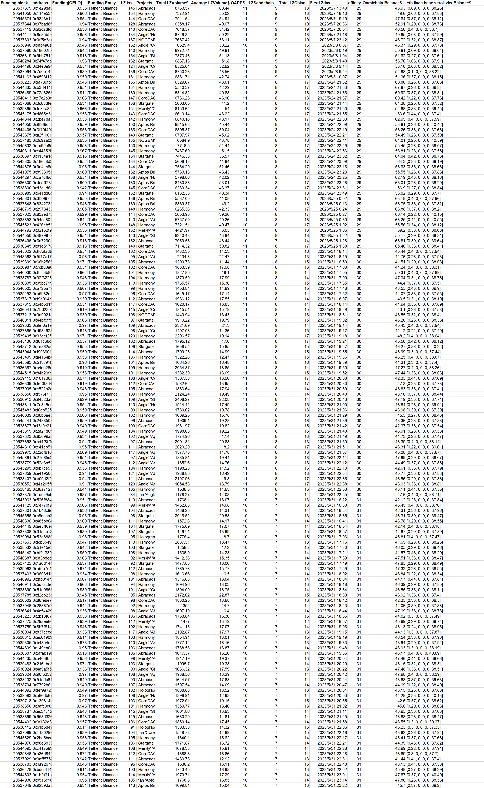

**batch1-1**
```
0x697e20307552031db4827402cb7a0fac972e3fce
0xd0a68fde37cbc8fd805cbbf5c12290076e9ccbbc
0xc986406082ada4eafea5e5f2781cafdd5e8dfffa
0x6dbeaba6692d45e33269acc6f94c3ea6aeade023
0x48dd6d2c9ecb618778dbb2013e529965f83dea60
0x3175b223164b4666fb99f4a129ab1709b2f19f59
0x55f9d731a185ca0c213a0c0e58c7cc779ea3565a
0x19e174d575747816598f5c2f86ab135c345bc735
0x17e88a26be6f4b5ff2fcd35600b3e2eba942a6ae
0x5e7a8511037807f961586cd60c107ce44cc8d9e0
0x33730c77cb29f447937a6b09831a825368fdddb3
0xfea139000369723c9ffa27ebadeb64b8ff51eb77
0xc86d42fee323b6ab4e67c87a62a3783e3ad953c7
0x1f988445460a9381b1d325440df9fa9b6e5b76f2
0xea763edf5b28340af97256e750911d13fe66aef0
0x417c66c754c0181d8b02772a26136d79da385f9a
0xd5b8db1f98970728f261979d05ed2643931fd31d
0xa9d78ac4b26efedab7889d00636ad35b03233a17
```

**Extra evidence**

In addition to accepting CELO in batches on the CELO chain on July 25th. **This batch of addresses also accepted exactly 0.1089ETH or 0.1189ETH form Bitget(transaction on genesis day)** at around May-16-2023 09:35:35 AM +UTC. Same fund allocation for Omnichain wallets. 

**Data at a glance**


---
**batch1-2**
```
0x525c476e038e40ce6fd49271928b29fded5ace49
0x2396e0564b896507cbcb3bb1bfd0e9479b28a59b
0x2b89f2a47687124524dc9be2494201e236ee2d26
0xd73fbe5344631b6445cd8ba626a0a850dcea916a
0x90b615b4552b7a2088f80083f9646e9336e6dadf
0x318862d27453e37265970e2c67b6a889e51f7226
0x040e5f5ed8e4c53d1a9a5d3a9cce435b4fe79157
0x240ad957f212f015210d30d06eadfca99484a056
0x1ba56e4736aaf9ffab7cdf34b1cc6fe5eb9a73ca
0xb40837877fd04d5caee851466841e098e6505559
0xfa2adc9f6039e02ee1fa72598d485d04db0bff5f
0xaddf280f3e47eca9ac1818d9adeb40f10784e4c6
0xabb4d536beef7996e1faf2f4baaa080f857e5d7f
0xa927f50cca9b5ac6d636bc4c87f8c747f45c9b6d
0xa1d7144a6a0840f7a52c41b6bee2b7b940c5d98c
0xc2228c21baeb31c935aeb914b6e9c3825a8354f1
0xcf2b85b2e9d95899991c22ed2bcdaade3e858116
0x88392bdcf6ac9d7c750e78c07c1298235650b815
0xe498ec4bec63d8b704b3ac977beb45f41de49b02
0x8e155249b87576a3e01eec7d12cdc845f3d940d8
0x07f955ed42b71e3879abdfabd156e900dd966972
0xa849acd86fd689631e435cfa988cb1a7cabd5fd1
0xa4756dbc1ef33b701c081691b8f44c67086d760c
0x9001bb9f6754cf841f238da6ed55d0853a54dbd2
0x3bbb3e7c8676670937a9cbf5fd1dd2032f1a6e57
0xd5aad23c82a41139b47c8cb2bbfc4181af827153
0x995a933eec89da9d8b2994c4b121f68c7bf7fdcd
0xb142c8ebd71aa5ebc1f200ba96697a16e3c5aaef
0x9368eaef329353dd60b710f84bb8005b9ef89cfa
0xd51342bb4f723bdae875cd5317aea0a894573220
0xdaf5798aeeb63aaf21ff016737af99f047d375f2
0x50510878fc0ffacf551ba3d5c729c844739b136f
0x1d1c8dafbd08ceb506a851576efc6b8ba649b7c0
0x1b928998e427266b12b82b61ac0aade15e5f4f9f
0x4f70f4c24d92d8b882e10bb0b6be4ba708744239
0x6c67301dad85c6a5d7608ade8626703a2c815435
0x87f6df4649348b2a2d5080a37854a0fcfb4d0007
0x2e71bd78ba1fa9662a90f0f4239aea66594d1635
0x92d3ee57db1bda20ebe99b4094e7023e1382915a
0x04852e95f5a3315cae52d0e9da715a77cb116d38
0x4c56e5d899936be5ba9617d9f925096f6699cf52
0x9d1c0bd77ae04229a10396741b9c324d8fef70eb
0x35b9119c61d03529a6213795f0ffd4d8abc9de45
0xab5f6eca18ba34ab0a2a1e15a68cc0a80ac34069
0xee9376c78d810527110fbcbd90acbdbb1c7a22b4
0x6cfc91b34373e02610c2c13e603cab49e3677d5a
0x8c8779c2917938d82eb630595567d709e03af661
0xa38d3067a3956a570509ba558b7ae46a6e1cb0fd
0x653209264c5605836bb47592c3058c50d64f93c3
0x5c9ee0283d53e6315a3f84f933a22c3b45eaccaa
0xf2e43191167516506db05b893efed857f864a27f
0xa7290f443357cc756b0dd0cbfbf86b02c667ed14
0x5a173e082cde1ed3a821fe9d62736d2a3144ecdf
0x0aa0fa8ea778aace3df6c8c7e24c263954db3b6f
0x3684502102771086ed028b3bc3337684c16aed86
0x4d093ff3182299d60413033a4774fa7a9b531555
0x4fa86d05f17f2c5050e146765024d776a44c8293
0x9ef17beccd7eb6496e01bec122d17fdbd60cbfd0
0x48758aa58fc0c1a21cc56447a1cdd11bdc7f3340
0xe604c40ef8def14f3cd5f5dbcaa75aee2e56f1a3
0x50165d630c39bd0c2040ce31e6171bf2b8b6ebd8
0xcee1bc7e395d52af6933b146cc9cf04bf2f7541c
0x4c6483f8b909ab884b381335440e10fd3775ea39
0xa4d008f5cbb65feae7575f0009a51d7e47f5be51
0x65ec3dab8a7d9b39d5e79cb575745746b29eb207
0xfe7fa9dbc57ae1152650ad56039466ea2cf1a65a
0x93c352ba6575a4649ba7afe889ab08b4abf81117
0xb45ac0a61b26e68df522534fe152e1d3c808422b
0x8d67aae0121127db40c07f2b982bfde5041ccb82
0x99799a66890ee03e14f112c998cb1e4576f9c2a8
0xd6f69350a6441f5e37e6b7b300f4e271829db308
0x5eff36d267e9adec97e1e284a28b27d2e377588c
0xb03af5a62d96d6418c66c4c02d24bfb45b96751c
0x4e87bb6912cb0125df2b56118485993ef3a3c076
0x80f8f4848654ef293b0385624f1e28132b06bc60
0x7cdbda7d3e5c6ae93f6109437b3ee8b1b0e09104
0xa58658eb0716752fa7b532bf1efce3bcf62a68e7
0x99a45bbc4f9549bcf9436970e2dddc5c6b37353a
0xa482078651c48eb8803ebfe1ad1663fd91234047
0x1422759a335a6c0a75fd7c79c08e62b9f771d69d
0x85f3109905be123f0dde77b894c3e4e26408ad4e

```

**Extra evidence**

In addition to accepting CELO in batches on the CELO chain on July 25th. **This batch of addresses also accepted approximately 0.001zksyncETH(genesis transaction) sent by 
0x888270...(looks like CEX address)** at around Jul-11-2023 11:28:49 PM +UTC. Same fund allocation for Omnichain wallets. 

**Data at a glance**


---
**batch1-3**
```
0x16ad2a54d03ecf4aece4882d14ce6d03408cec85
0xec7f1d851394b195736ea75b8ce35e274d237050
0x2aa633eeb8d870d2af2ffa0ca314d312973214b6
0xf81889941ac2ff919caf4d2f25e8ac7edf1283ec
0x9ff5a978b220123881f1b69097085af7af6f4c6d
0xa52d0dfeb2eb97646a0b26913e86d53885047c74
0xae3d5f32b24a65f7381bf4d98f76d3cc4781b44f
0x9461aed5ecd028eee7557efeba7b65b3e0815afa
0xaf13e7fdf99dcb54b848d25b72dcbf951ebd9642
0x9702ad207e95287c801d9a4f8890883f5312f73c
0x29a47e0c85d8fcc4a051a87293b62d0037c3f4a6
0x7dacb08e5f7c5d84a6f087b2cbc5db8bc5cf9cc4
0xe752e22bafce245e860e78d560a3d0b068a691df
0xdbd4dc639503368db0df435d7f8bf04cbba9f789
0x28549ac56e79638b8ad6a82206664a700066b023
0x8da86626306d85eb9de811682ec0a9b63c287671
0xc02e65369356a78be16a8df814b1b1ecba0cb4db
0x0d1a587c8632c1faba38394bae8318247a64d281
0x9894b2f3c7764696a3588b3422804961a38b5054
0x58a6576677907b00b1d91ca723b6924794786ec1
0x06dff4d200c0b5537fad91a1de5f9264be5702d6
0x9599cc6c27663862272394db8d848d3b58d04f57
0x940274c08172073f82ddbe6e42989d3e2a85c558
0xaece09c9955c4d766ab04391ae1de5ddf54cb450
0x638e3f582bdd161bea895c7f55afe09608930ea2
0xa2f93f344f91549e738bfa9ee955cd3f6edecf7e
0x84a8ae5d9fedf527310f85ce771516b722ce9bc0
0xc58d430b1acb20330186c009ea3c7b17eb9ba846
0xfb7db49ae2762e7f927bb1dbb39dc3ea6d694d48
0x207f8013843d17ea6a27a7b994a61dacd503142d
0x2ddc66c815750ab631745c7faa37e7d2bbfd38bf
0x282a0d3ebed78857d92537e8e6754ec17064a788
0x2f5bfbd9ff27f9d4d42df2076b959006084b3b6a
0x81712e5131c78ba6a79ba7706343ad3dbd7edf67
0x716e7b2088385f86813f8829808faf098d93c0b5
0xc93ebef581a67b0b572637900354662e36bb7941
0x746e310cf7f59c8b08b60c6df1ebd667760a3f44
0x76cd6679d02d12a03c85502395a220a58e47d95f
0x70e7f1c58ba42dd1d50584185032afd0d4f0e555
0x4658a5e518ec9b54bedf335c84e2ce38e162fd2d
0xfe418d7a7b9f60902a0591af16fdd4bf717c30a0
0x4af3bc9e5c92b0b7a13225e2b9161f5da5ab0676
0x73bdf0bec2f84ecf3c65de3f64753a1dd9f4d41d
0xc8aa6f8bf59c3d907372a2f9263f13f207c86e75
0xca92862550eaab06315b966aa87c55a7a22cfe89
0x1748c9e0b35314083cf2302a4ef9e67bd99857c2
0xe911fcb49c76fe6a88d786551f31d16811be2845
0xfc482b72f9aba3637e9fea60ce494648139156a5
0x3e6a70461b1b8f2264b40f039707e8fe22d48afe
0x8b8fcd84d0fef83bd54e0922e8f2d2e0d51f1701
0x4745bbf5388f0b529e45bf0427ba604bb52bdd86
0x0858812bd055d69495b5de5992db8b7808b9c11f
0x842a258f0e4f339e672ecbc40a98312729273ac4
0xb3d04a2bad62cd5425dfd9a78fb3f0110f9f64e8
0x7f04f2dbb652f22624325dc006977052477aafce
0x2ab6bb776cc28c2f9da0c3cc505f5412e0e56ed8
0xe0be082615836f81a1b941e86de778d731d80ef7
0x1ecca8f872b78b5d74d930b437930050ef2e95a7
0xd5c56cb9371f4ab1b8d35560d1dfbb0c4ef9b188
0x6e5f366e6d5bea032824ffa0a771f8751a156fc2
0xd7ee3892149c256630869e245d188577bdbd676a
0x99383ac8e8cbb822f6b53d04329d6c8a023f5240
0x3dec0f3e55f2077077f8dcd1139bff89f1523c91
0xb9ae1bd2ee01a20c7b7364961e4866f2353b7560
0x5a22d258ac795dc8953a2cfbd1d66d7a672525ca
0x6a376cf0a55b128e2160f70b9c3b5c9ee775625a
0xca3b9d975426e6b8ac28159b8673d2ff27d04a71
0xb74d12a4b1e025686f072b4302f43a2c046ef86e
0x8ccfbcb87e8f5b1cb51ed49abba66c0c607da453
0xaaca7eb4bb63af64afdfa8371b24ba091b914536
0x7a976a9a33faa05523b37c0a83d6630b75049c32
0xfef2648635f375d36f24589823866d89e49c01ac
0xf03b4caee7d2f936539c93fb0a75875fda5074e7
0xae0b83e38077ec561375237b5895fff84bebde15
0x6e49967005f8ce70fb3bb76596e863657b4ca8d5
0xb859d5c9de0d2962282eec8c6cfdb155e297d326
0x2c5fd2e12a3f959baf4e25a701111ea3c0b795ba

```

**Extra evidence**

In addition to accepting CELO in batches on the CELO chain on July 25th. **This batch of addresses also accepted approximately 0.0018zksyncETH(genesis transaction) sent by 
Bitget** at around Jun-30-2023 02:43:00 AM +UTC. Same fund allocation for Omnichain wallets. 

**Data at a glance**


---
**batch1-4**
```
0x208a9bb512029239acb4cc7834824c8badbad316
0xead35a2e4d6a6c7f15517ca409c2f29734d50356
0x1b3731479bb9db0576e3b0c75eab8a3f581821b5
0x97ac9bdc6b169bf71dcf4968e778c56a54d4c6af
0xbf54a6f732cb062a2ddc177dc385685812b53ec2
0x796597a2f7d43515811e40c7aee15bb5fe0fa2d8
0x77b09c9cf12221c9b97153ddebaacb68fd689546
0xf60d27b9c2098962200d707f491470bcccc49006
0xfc79f318b66ed5529880c0de3d6491601458a170
0xe61458094a0be9fa2394427ad688d10b73b5d466
0x9d816e145e925f52d7fea2be8d56bc07a7002d04
0xddf8d27deb1094b726881995b1249b04f4e3b013
0xa8710633087dad42767474cd87c538ecbaba3055
0xcda5da14611dc814936629d97299a9404247995d
0xb4a1bfde99858a0c9dd86d8a0029e894353ac699
0x331c34c797d21ea2eb9b6552060301b4dfd891f1
0x69302fbe8cdde288225c59075db929e6ab80f3f3
0x32fb8d16d0871450ffec17afb85b88c0c51055dc
0xbb2762332280e88cf11b9ef86fab08312e1221e7
0x66648d2115b96a3fc714a85ef5906ee2d9f00f5e
0x5d2dd2a50526e623f5ef1597d76c29c81b385fb5
0xbe938afadac759ad37d40ab4c1bf01ffc20b9431
0x91132ff31acf32183cbf61967a487ac8b011c03a
0x160f86af28133feb6b7b39d8f2b1cb70517fc77f
0x14e41b26c4d46bcb6989ca9e9acb169f85a072cc
0xed35b6d4335c863007b8c4aafe6a356a498c8842
0x11ea5b5a8c81b000e01821861453dabda2614fce
0xd1821e2bb4c34544111f3fb77457177a23836695
0xdb5319a63d5117ef98e2875351d988754c1746b5
0x59b36032c2609c70a7731fbe1bb4093a16608c50
0x6cd0365900e70cc4d15d40fcbd617aad7281bd5e
0x1001576ea66f1da4e320594f53cb37a4307f4ef7
0x8c2934429c2c0438858e95b9f458a09ab0b6e485
0x492af0226b3405d98629ab420f8f3f9f8a80b01d
0x0e56d12bb358e6685d7ea3fb428e518bd4e4850a
0xf670c59a70db7bbf3470f8c0d4a8c38ada922ac2
0xaad086c2945335fac4ff5fc3699675e268b46226
0x43e736b115e629df4950ba07baaefffe0bbbe486
0xa1a7426376630b4657d2478c365f3334ee6cbcfb
0x07a81a8dd5b07245d60b4e45ded429e833d5a9dd
0x870e21af8ddc5699d62c99fcc4ec9ed6a57d4822
0x1b7b420b9d9d4f099233bc4e37a998e9263cfa17
0x5333a50bd54dc37651577164eb7bed158f688bd0
0x31fbeb22baca608b308a21879a45aae14a892422
0x5915433468d9180211fb05cffc38849131ad794a
0xa2ee504754fac645dd1e912ee6e04e5ec37d6228
0x9b1a43821df89a16938d4ed1daa4b879c0860950
0x334f8a3a285e001c9a825361ea04bc5cf0c3073c
0xc17c51d5a3038be27c133b9036d35f92b4ae58e1

```

**Extra evidence**

In addition to accepting CELO in batches on the CELO chain on July 25th. **This batch of addresses also accepted approximately 0.03BNB form Binance(genesis transaction)** at around Apr-28-2023 09:47:26 PM +UTC. Same fund allocation for Omnichain wallets. 

**Data at a glance**


---
**batch1-5**
```
0xa54e9853ecffb4dd09cc7941a76f6cd01c1cac73
0x7532ffa099d9cd3cd09671bbb16739aaeb81aad0
0x40a4210a72198e107ef45437991d3c58e0f53716
0xc242de8eecc6e45a7035e0da8039710cdd092c98
0x478b80656021d32cb887e0925b7db5406c4dc7ae
0x38be60b962dbffb8db77d878d11f4f30f3d0a142
0x87ae29b6ebc0e593d08ab8dee40de69c40e0c29a
0x6dd5204c6972c658cea49cd237fb17bdd182bc8e
0x696f1da2fe2077bea334e4238cd72d2af8330d6a
0xd3ad1969557cbad2c217433e21f534c29f61df7e
0x60107a547fff3da733f5a77bfa9d1eb683d8b57a
0xd31264fa111951919813bee331e5d1a695f3eb76
0xfad5391e5cf0cb192ca47cd0931e96743039d934
0x3151a4679a6463662ca075e2a8c96019e462f4a0
0x5db353a4dfa6f750cc41d5a1ded593fd6d50a921
0x1be15e7eebd3879b1747dd42b938547a1525ff3e
0x73413a9882fed4e667e885fa6a763bf14019e680
0xb1b061036dd260f6d5464c046d21ffc4337bff39
0x528fce6c6c688f3899a5dc07bd5cba341c7b1f4e
0x26dd5649931e761b1e87d026545ab5daee6c176d
0xeb1436f9fc851c85e2c791a82e8630288fa1dadb
0xfd81ac579d3eb45eee7154515e723c6205c5ece4
0x5746fb0d34c3dd5cb952cff84bd683f215058b5e
0xda3832e8a04667fbef7c005a3457f68d1a303219
0x51b7e85948cfdc83d50fb8d1ec1654dbf92e01c4
0xe1a73d513c1a880dd87c6dbb170d6b8c76735912
0x673394b61d435f8d9cd410123c18fcfff96ccef9
0x49d0dc1cecbc7f73309d7e4aad14786ba55ff4c4
0x62aece72cc4fb6da4472d84b9b87716b4043c012
0xcfbe1ed16a235f7dea2553ee703938dbeb75dce8
0x7087f76040ced95eae15ba34c177585d8a2116e2
0x54b642fd72ef808298cd995d7390d79bb818c293
0x984fd45dc339555a35a67fe26049cc3624f67d6f
0xf6a1072c11969d590749bf53d0e6deaddf8cc3e0
0x8d8b9630a18bb1f25d9614e178bb17ab1a4bf394
0x246fa4419ad4bcd8328f7586b131d5908d345f20
0xfad3982f6198e596f4f2495f8345862de81542ce
0xdda3a6611640f3c2aad929c336dd347735a1a75e
0xb45c7c578f7321bc068d4a372b74a104fa844edc
0xfaebb30e88b9a820d48290be5413dacf08821720
0xb720da9d4f32bdcffe8df43e2009853bd88e9cf6
0xf7f2a734c9d542bf546d6b767e88836d6f009ed8
0xf6ea1f5cb8712e65968f10c48d2d65559cfcacc4
0xe1bd8872c3be39ea90330c75550ce4d9b4c874e7
0xfae40c019394111b4b5888b70ed64285f09ce2f0
0x21fbfbbb5ddd2768bc4cd449a67dd2e37dd0c5ca
0x17e79481b8c398a7ec3a0872f1e8d84d159edc35
0xe4c6385bf269b0358d3aab0a924324959667f02f
0x5a63718f0531bb8f7d2c3cd580b1180804c40e53
0xeeb92aab70e301e77c290f1a0265cc8ca968f6e1
0x6fc7225182b1f25b6dff2086d7f06fc05e4a6924
0x371c9d7f056bb75970cb7b46b15d6c923bd66f6b
0x6b146f6041c9e567816aa54f8b464a3598392d19
0x4f7cc63dfbd51246caaf4cbe83d538a817aec33e
0xe22bc83414de4d99a44aa6b33aa92c2ae0c256d4
0xec9205d9eb4a552a3d611339674aa99361adf72b
0x4423c8a816b94edecd208c96e824f8834d163283
0xf81750bf3773a6866a8079969965863f5889cbe0
0x95f680bc39a2577aad8fe5a1bb55b57dd600456a
0x67a6da86503ac04c602fda35bb5ba493a39317eb
0x66613a16501e4c81c113687d0e9a84ee6297ae29
0x85b54237263e37c0f6ebe0a7c426c06701cf318c
0x89f8b41a5e4a52f27585b588dd6b0b8f73a1f04e
0x783f67dc651b4059e4e1948d1cfd98b406aa93da
0xb113fa45991bdfbeb22385222fe5b013dcac1c5e
0x061098df8334f271fd472607a4ac88513d4f771a
0x4c457bf5099c55cd942a8adbe662ab374703cb67
0x4457df6cb93bbb30fc9da33cc8fcbc747f551f99
0x482ac5e2b92eb6c5dd0215b37ca4eb1bbc15f8dc
0x61bf6972993fff4b932871b69c32cc26cc192365
0x873bde8fbcea496e5a568abef6a313cf99479f6f
0x2e01fb72a065e4c071a23d60986ea13f1f2c7428
0xf60be13d7b10c4d69375bd78db8e0c144f041008

```

**Extra evidence**

In addition to accepting CELO in batches on the CELO chain on July 25th. **This batch of addresses also accepted exactly 1Core(Core chain's genesis transaction) form 
0xE07F73d(unknown CEX)** at around 2023-06-20T18:33:03. Same fund allocation for Omnichain wallets. 

**Data at a glance**


---
**batch1-6**
```
0x6b0a7a4c2adeeeba7bb9320605c6067d937be2f2
0x672d2eedd9f0b24d06889f1c8d3630d2d2fc920d
0xd0c13f96cc283ea1bc01f8d117c0b6a89f51ed82
0x4338926d38ef451d403fc40e1b6f0b7454acf45b
0xe7dd1a9a070693113b82cf790ce71240519d0044
0xc1a62bce3195b58688745065d51919e65a91ccf9
0xc90e9c217b6aa364b33bcf3c03321309e4e3a541
0x88501fc42b28f08417b1e6631c2d6934f0127f5d
0x242abed49ed1cf7992b1dfbf462520535eb9c4a1
0xd24dd7a1de0a6e2a111392790145a74df9188869
0x579c4503cec9aa2b2a0b5f8391bf162496f8d8db
0x53afd473daf8cebd94b5a6147b3c3079511f6ecc
0x0d1b9b0fdfe960d79657eafd8f3aa3cbb7a3dda6
0x1ddccb33043a705c1b7bc1a30bd6c8b1e8c4547e
0x8f62180980aad40b8aa65a1483eda08510ed3043
0x99de45472a9c7aee502055de22e57dbf5ab109f9
0xab942f81b907120ca23b69c34c6d0ec998e96968
0x64d40e1f3037cc96d2b657f0a8475237acb4a2bd
0x4a71e4be7e2275a9d6618b7fe78166c2f0ff0eeb
0x326116b73b01c14b0d48fdc7a47574fc9c040d37
0x1ecb0752d2ad79fff7a25ad6f5aeaf448a47026c
0xd572af0611ae6385ba688ae5c0e4edded7c0b745
0x11d4d081fb22a3ccfb528fd254246c6b04ccc9e7
0x44570f8e335f7d033a1d2de848e738972618036d
0xc6b8d3e0af597e0007a36da7edc7484b53cc5abc
0x9bcb449344903dc7c3d95952aea9e4c9b3bb77a6
0xa2229bfc558b5655ba3255b6d15442e38d5052a8
0x28c7ada134fa604b394b723e5e54090f1c3e18c8
0xa56a56b1f4adae22e61dfcf64b2b11796bfb910f
0x8eb921c5d38dec6971cd53875a4632773413a9c4
0x0143ae1931f592b49beb011f813c310f8d5534c4
0xb1d2b985d6fcb9288bd0ceca8fa5c34d534a58b5
0xd5cda11049cadb3c8325d513f73dabec80993e36
0x6cc5d1519f926672f50f4d82ab242a9e950e10a2
0x8370261bf3197cbc200c6da4422fae873b777165
0xd0954b015d8cdf4aa6dc2175d5cfabe62e11158f
0x1d8c2f0a872096c7000cb5d0646a035a17c60d91
0xc128635c0794034e84515e2bf66e3a6c714d6507
0x0f77a68807926e8fd5a42b758213f9bf414c5df1
0xaaa8103f3c4475f404bdb491069e85e47b30b619
0x84fa55923819c08d6271951d4344d19a2da814a7
0xa2921ef0d8b995c76addf407ee03a3470fb2b63a
0xf2962e14a09b4869307918f9aca23e20a53d0204
0x25a750ebe5432d0d0defdd024c291959614c3244
0x783f13206db107198fb154f78ae5f8b2e1460785
0x53aac885f04be5f402bd204c9dcffa486ed099a3
0x9d6884c0db24049b9a011c5d52ce1ee6e4bb253f
0x1a2d1d943e8198cae1c1c1ed8971443df0d10b85
0x9ccefb2e53a5971d9d413deb62ea0f012a5b30d7
0xd699fac8d0db48ab25d4ab2507cb9e6ac43b807a
0xe989ca5e60e5b3b5d141f4912f3751a66511f3b2
0xaf8108a72a0d3c6c61ce31bfb31d32bc9efcddda
0x32ecee9f553fcdcda2f85f4692b135a11ce4b4b4
0xafe81debf284f9ac0d194066f65c6bf12bdb275c
0x3eaa71124c06a46c70bfe6cb497a0cba6249b080
0x4d7eca5f9c09fe81cd421f63bbd8bcbf1a03a2fe
0x07a75a98b7afb77bfb191fcfa2db89d56b92a534
0x886123903d12db653a72167615981c071a8993da
0x402c7b576b11e12923b0ebe3e86398163db74d86
0xb8e468c1182afdfec5816f752909095516103aca
0xf1922d13991f18fc778894b8af0c8f7abb1fb00d
0x537c7c5b6cae5865a55d4a96a1b5f89dac54a424
0x89c998fbd6ce30d4d5c6e361178cae7c87f7299c
0xf3aeb1705a77ca8f0d9acd54f1f8653d250367d9
0xdeb702a6519c52efaa3394a27f9aadf6c3c0f84f
0xaf470fb8cbc2a58b478674b24e6fb33268ce7e9a
0x8f733f9aa9c245fb8bbea64c21df2d7b6d3dca98
0x52375b659252f6afbbd17ee0babee37ee5bd6189
0x8061f0f68b55d4eab045af1d7b0eb125fd4fa48b
0x42a64a3a7eb64f336a91077f6e246bb7cc6ae0f2
0xc97f6c62b4ad79c7f7220c3d55a8834c99778d82
0xf6791029c6ea7cd2c1b49cd91571166466f06cfa
0x046b53dc075cfd5bd5e3af0247f9e153b81b057d
0x5bfefa37c209a5ac823b2011aae48e3539ed0732
0x807c576780cb2f0614dd0bceaa4a7fe933772a47
0xa875f2b108785481806ed11af977fc09f90eeddf
0x1c8fb9af76006819c3f89ec3e8762bd96c80a276
0x1c9359bae4d367198e86177003387c7ae649f574
0x6ec56b665c265acb0cbf9bf5baf11ce42dc4e3a9
0x22ce84a33f292c8328c053c7eea9ab065347f61b
0xe11454ec447dff199d9bce2f89edd11dc8e01952
0x0771610b17228c263e303852b2ef0e1be8cbc405
0x1b0de82be5864af13d8897fd35cce115fdfa52b5
0x8c69946c9ba1a0d066d80f710b4deb422421e0ee
0x9f9f05c4b653de7e08b14e855183be09c5d4c95b
0x3650534542e4bef668f52651784b1dd251159c40
0x32caac467333dc9657dd6060055805780784b82b
0x3fc095e87ab23efe781516f09dfa2f303ff15643

```

**Extra evidence**

The owners of addresses in this cluster have a high awareness of censorship prevention, and activities are usually carried out in batches. However, this address: 1: The number of CELO withdrawals is too obvious (he intentionally increased the number of decimal places to disguise randomness); 2: **While withdrawing CELO on July 25, the cluster address withdrew approximately 1.25CORE**；3:Same fund allocation for Omnichain wallets.

**Data at a glance**


---
**batch1-7**
```
0xf3d1fe135da99a75d182e48d168c9716fd217443
0x145f6b101768a36c609be995c46920c031b417c1
0x402c5322f21f9e98a3e2036b9ed3f1eb537babc5
0x207e3b1794c5bba2f930fb3e14122bfecbd8bd35
0xf797f0f0085628c01259b1bd554ad8c497f8ac6a
0xaf6511093c14c387d9c4529c56b2fec70617b039
0x296032b5b3f0d625468130d09ea55cbdae0c08d2
0xd3f04d15f69e5493e0af914bf5def1d4b387e03e
0x535891d47bef8c121331cbd71c6722c6c4725e3b
0x7c314ed299cfb77b9829503ec1ce81331ca9385d
0x7d089a65d7f25635164065d43ae83149ecae781f
0x9d654b9ac854dd62cbef80905eef5589addf9c94
0x2c1c65f45e3003633d433f8495765f1b2857b814
0x9552b0e4c746664d667d588e57e434eee57e048f
0xac95c680477a1808ffd14f61c6a590936e051e19
0x8ca5764d10c2fb70e89b0aca1fba3c3729afba93
0xc6db6f6065fe9d6ba31b0b5f76bd7fc51511d35b
0x98554966afee26f53fe71d590a5e657fbd4f8420
0x83a2aaf9cec4d0bdd13bad478f3043ffeb8ac118
0xd53c494d486ea7bd1bc7c3e323a5006a1bac4e36
0xd3626a02904e843ac88e8afb462fc3b7bef1e036
0xd1179b6db46d3c1c2a09ce1851ca0ffd30ae21c0
0xa63f6c60220eb5a99ae5739c1370aff5624d3b8f
0xb69dbf3938948dd361fa83d6c8297243c96c2c6a
0x1d4e652e4b983b40039bc684e274a3c2f7d052d2
0xbb745c0b55ee5ee7457de0fbd06bed1badb4af7d
0x17049c68a5fa6b5b9a06df21b1e4d8b7fdad193d
0xe1126fc7dacf8a20f4c7baff9ce0678a7e4dee4c
0xe75cb5d9cc0d663cd131fae3255b74065f2cd5c4
0x6140e6339c5c745d47f9e75ec9ca4a9dbdf35f43
0x35a8a6128a407a3229902d4e70d883d5ec81c6a9
0x4067b487fd9fb20895e85d86555473a8384b6ce1
0x54ae784a5ab5cf81b45203c23292ec1946266308
0x41637b7ed6fa6e09a6ce142f11d66c4248869d53
0x368469a6f40e6e13c91686dfe87bdb5f70943921
0xa1279ff72072dff4848ce63dec2a4ea645262165
0xe3dc2de7a8846c095bdc73f10f83797f20072ef5
0x27110e212f3abca6bbaad3d2f48b3ea1e430b68c
0x0e57fd857acf8d2a94d11bdbd52d2f6b5cc05b8f
0xabfef55cb069a37c43dc00bb69cfadb65fcdcd06
0x279ffcd7d3e136d03c387633c289f2fda6f7441b
0xde3c799f017e6392344d108d48c014ef03104a39
0xfe18d4080993b22a44b79260091346642805b305
0x4a5a6c592d72e4a7166c0db52db1d52e9cfc6bce
0x1f2453715673ca6cd77c8a281806becbdaa7168c
0xa6bec0d5b090823a31418ad64d2df8b8d2beec26
0x626186afdc0d8db93f9b64a95400cd53b48d0bc2
0x4196b156224cd0aa3bbac0e25282d6d84207e2ab
0x8093561245e5b69b5f36084c8cb6c07cf3851031
0xaec6e7a8e2c706d6b92ed091e472aee366e77ca1
0x82029dcf365a5d8a878749a46635c0920b727888
0xa3c9bd62137c77ce103865744739911f124782f2
0xcaa0207564311f3767f8544d846d871c05e0a549
0x4f4b9b48e290f6fa390302bc0c26decf9a4b4309
0x7f4eba4382572bb111ef5593e7ff720971276a2e
0xcb8307cb12e869cbb220921f2f7bef7f49e619bd
0xd77d847e7a089397d911861cfb76cf552dccf8f1
0x39b6cc2b953288be70798be3dcecf97e4335c9da
0xd9ec12061d050df673e80adb197723d17f0af168
0x177a8de5e0e448ee8b93e7aca9825f83aff0c852
0x5d9118a775c7e9ed7699f893fb1d2873790ef703
0x5e42ab37ef1e0d06f6c96ebb5953f266369f94f5
0x15f989a3771ab7ad42fe93d647ae8fffed044db7
0x9c1b9151fe8313e42121d0662b7c67c6ae3256a8
0x7b9b2ec137e6b596b1f5db9c644386be66795cf5
0x52b2cb3ba1f894b524b4c76df4b4757f7805cd44
0x5fadc35d867615e59024bf3357682ec177d4c44c
0xd412dee7c26e1b71fcfeef55fee81b4240bfd4a0
0xe63914f27744d9f41fcb879ab9f2bae728ba9856
0xc8f622bf737fd987cb3bdc3e2a642f62d8aac0f8
0x691f37ec1e14932f41fa09cdfec4efdcb9abc0a1
0xab0bf1b800d7ed2467c14bf35d5eea279fa311a7
0x9fdca0bfa20fa2403de5f009102292d160bb84e6
0x3256581bb340448e69d42e70505156a0ac8ae3a8
0xeef6a4b8819d629dc0aa78a6fce8a18b1eacf5c1
0x2bb6bbb36e9df274293a9112fc65d2502cf98a47
0xad4464beee188300516dee2d0efa3d717b5cfd33
0xc93e45d3606dd92e50bd0dc846bd5357f45acdf6
0xd7e34484f5a537babe0816ae73b3dbaca68f8f28
0x4574da6cf7cab719ba343a323ed000d0b5d98d82
0x3047b6420c81971d3a913a183e2d63b29b03c71c
0x3de00ea04b5850505aa3a869526467ee4e909c7b
0x66be15bab090845c1de0e2f6fcaff2db75579932
0x90b3b4e02ac68a1e6c2bc95243e5ccbfdf3671f3
0xab7cacdf95007281f95ccfd134fa43b8fc4511bb
0x6c3d544357a48dbf5197e31c79e671676c6ffb27
0xee59796edda2e615df899977ec108c2432d75c7c
0xf1d111901f05a0b882cdf0d36dcaad7d39293cb3
0xd9da979a5a8791307508100b52ea46496c0f7bc4
0xe2eb867ca451ea741cd50240c35b3345aca2865b
0xb0f0c3bbfeb4a5b4efe4fb4662cfb89a40d3dc23
0x05378961de968612ab0cc9a13bab26fb58219edf
0x09462caeb8c3f4e0d36339ef382509b9a231b412
0xf6c5a1388a543d133f046fe7d981da3e8141f316
0xb675faffaf6af7c0e8f22e73094f52485f8fc329
0xb6e8e8d1d7acf0b5c0af56797d9d53048bf4aedf
0xb28a77d57188593ff5806a77651d611f8a22cf6f
0x25aff5647fb473c689a43183d6dd3edeccbe3d61
0xa80b77b9e6bc93f486d80d52e21265b9706ff13b
0x36d129e5b8fadbee6cdd1b8005aa10074bf968f8
0x3e53e927bc9e3e211ef1c97d4f3d1c349d1044b6
0x8941009e865c9460d9cd86ab618cb9bd0c1853bf
0x5a98c3572c024cb62b55903ba3c50d3d31a32053
0x4b0fcfb89f1bb3cb0f33b5ed020ed0a105991ada
0x21e9481e9dd79b2cf829d65fa5eac2ee60b641f2
0x7d488d03fdbf0e4e4f395add3eca068f13c3675b
0x034de2fe2b9d9f2104b6912738b458bd1f9c8921
0xda65f25ee49be73e2f783855bcb135f926bf8af5
0xd98ff2e67c4e7286a4b6fe32080fcd1e2fe38d72
0x1855320ef38ddb44a3c7b4a9f05856110e311459
0xa26ac9437b73cac4e984138c6cbc6b8855fcf45d
0x1a58ddd99483eaeeb1a31e183e03e6156e2941f0
0xc4962d2f776e174e3ab6491982c7ee12c95667bc
0xd9243a34fbc63c1988252cc6106d9ea9acd2cffc
0xe95e0cd108412de1f0833540774f8c4a66374e9d
0xafe8ef6dd453fe64908a3b66fcc532470f21e0a2
0x75f214db5260f6f5abd2180a87bb51725661aafc
0xcee4ebc3d12e5b3a81acfbbfdc8302892af3fc48
0x44863327dcbc6b5d4949a292b4bf65b3b8570b57
0x613411ea6019c210539fec2cfa9d644e3713b817
0xd2207cac9850ad8e722332888473f7ff65548208
0xf1eacefda2db1417889a2cddf2b12ed986f78bd3
0xac061bdc32656535c099b24e39834901213eb859
0x44107da69cffc2a5b8e33b53ea8e1ed749a515c7
0x61388fc04a0fa518d8da525a4c4b7912828d7e46
0xb0fe0ddac199234a4f341db8547590cdb77a3f3d
0x0853cbd7f44d30183c1c359699c56340d8ccde62
0xe3820f77c62b7ba58d16c1d6027519d166f24720
0xf4e675d273594c2f6ebbb55300cb6d9481dd02b3
0x711bb39a7f061ea66d56aca6b989bd1b0c722e6b
0x0d8b9a2e2105cdd5f3b040b9b89d78b53ba4efc5
0x3c2cee4fb60403aa1353d45295f9be4877bb38c9
0xf2af9fc1a9714ca302e336beba3836515c841f39
0x6d5eccd3dbfade3713d622733b8a2eb83abe1d2e
0x8ed624d0a7a479680d3b2e435944227d607b7d15
0xb9d4553095585f17a044e531b1e84be43a54cf0f
0x606cd5b9a5d1d71b706474aec50ed7d948b00795
0x9f142f5c64da32f0b1939cacbb7020d41a3a1e16
0x409e69bd9661897a71115b703394c666e3a4010e
0xeef80135dafd2f3e7c8477bbc47269ccf1c1dd0c
0x85ebb620a93ee0676dbac8626a7771e36f4c45f7
0xa5e257feac1c4504d2261c5ab32cd997f83e830c
0x13523d6c76ff5c9c9dc5be987f33ce34c2afd238
0xcceecbc10ceb2f6fe4e9ae07b790e2009eb2f5ea
0x08e050102dc1ccfb3c74879f53089dbfff9a0c89
0xd5fb6eb638f40fd24ea01280028dc5166405727d
0x478f669c2ddc84d77555fc6859b5ebfccd7c10d7
0xc782d4a4183b3e57398cf9eb3ce1921d720f5102
0xe9bdf8f6c87a0adda41269908a9a583763c55531
0xc3a3614801ecfb25ee2f89c0a08e17d06a2f1c4f
0x94fee0a6b4c6c36ca2af6106935c4498b0ef17c4
0xba53737391295b543bd6be17069df34513c93c21
0x66ccd64bf7279db9e6da617abf72a92e41d23c64
0x2307c7af87365b38bfbcf1fe7c1418ce50932256
0xfc95420b7131281e8a028d0d56934fe52fd171f4
0x3d2be4f8922bdfefbcab67cc51ced9a5de82c0a6
0xe206efacb611817909ea0c1a91be134b0ed2747c
0x758d87699fa2957534be2089656e840f97f2734b
0x450e5abcbdfbd58ba6989cac25a51d028222df77
0xe297fe3888803d07ddc26481f9c86c346635ce87
0x411065ea3715c1a8b0d203a73553a9133a253d09
0x415871e7a2353e6cc0c85147d32b25956543b7cd
0xa8666fa2c8d8fc15bef3ff7d9d11ed7c571c563e
0xb23493e6573ed5e6f8c2d0b7cdf1d6c9eb58ca03
0xb99e3ae07747f60172fe8e4693da432b6c6b399b
0xe1453cb22d90e87f1ef7de5e00085032e30821c7
0x9d5e22b0dcff59c3c3b6747280434dab81515f64
0x62e387618987f6e269d1d2a53481ae0b9da06e37
0x4b00a65208e3c9015b5e9b29554218aea78e41f6
0xf2afc409a2543a954f1a4dd82f337c829613c07c
0x090f131b44796ee1e9fc9fa7056e918e39a20b06
0xd4367a28720206ff9bc14fdc77be57832a487305
0x996dd2ed6638c018ab9eabb1384e5d823ca9e391
0x116234ede492a0886d031c32f94b17674c230619
0x99b2117ca8cf2853aef1a2846131e0c0439fc7eb
0xadaec2eb389e851514db6c0f01f7a4b814b860eb
0x4a0d767238e31af7f6853e3999f960b2cd7bbc8c
0xf22d258f03ceb05453208ac5b386b7af16fafc7f
0xc42ebce493be025d71cbe0e722b8ee2e4a484e39
0xe0ce169cd96070bb190b73fb71663faa2e328483
0xf160dd3d3815483b0b002bbdf7d38d9f6720b2a6
0x9aac9b217ff5c92bac63d1819834b0cc6b68cb0a
0x6829411b19bfd49f234fedcd55a5b9b32363d35b
0xd4a682c531053d4a23478894a85034e89faf9b3d
0x25f7d810c3df1332e3b3f14f00bb722013a0c79f
0xb79747d323a9efbe9cde08a1b21c9d3e46f34028
0x810753e4455dab91d84a3cf953284b1d10bee86d

```

**Extra evidence**

In addition to accepting CELO in batches on the CELO chain on July 25th. **This batch of addresses also accepted approximately 0.176CELO(0.15$) form Binance and the used merkly to bridge gas(0.05$)** at around Apr-02-2024 06:08:01 AM +UTC. Same fund allocation for Omnichain wallets. 

**Data at a glance**


---
**batch1-8**
```
0x38cf408f8ae1869a2a16054e3bfbc518972f65b4
0xba9bff4728725703df0357031413410a39da0159
0x5d3277aa0d4094a4674da05b02eac750bb534655
0xc815e583341027dedada7ec6041708cb0e956b2f
0x442171a9d3171d69149bd1c02a13c1861d6cb1b3
0xbfa542a3cc99c9b78c14f25592a0fe2045c24190
0x546c684b67e3b13ed57b1fd9c275f22a2e280dd9
0x662df7fcaf6805e05ece32e427ecf937e840ec10
0x01a62a30ba9080e2f2ce50a0e08ea2fdc87a87ad
0x62c8f55c7beb1e249eb7d64d2ef76d54a7ecdfab
0x4a2da98db28feede4c015a52aad6af9f301a16c4
0xeab7d12f5d16817a5dcb1cbed601d352c8e831ec
0x8f8fe495d745d335a8727cb3547020eeea571c8b
0xf6254ed2e4dcf4f0958239b3199b5bf059c9896a
0xfd37042bbb2bfbf3ca0b3c4607dc97885cad137f
0x0985c2d3373adc17efdc9f25d89301c17f0cb47e
0x8b1221ef92e442c1bfa5b8a09fa9225be9b61f30
0x20a7755e3fa6a59493f51a774ba619be5eb62dcc
0xd4fa96f848e749f8f6825699212f5aa3462bf406
0x5b570136b64066e48f234ce909904f47fb0b9c6e
0x55824f6f30ad990c59974a306c4b2a5da6ac55e7
0x5ac6c2fb262c3d914f153a70d2ba29a39ccdf5dd
0x63ecd8e13c54db6023f8f0e2cca5303d0bb7f57a
0xf7a8a7002ab2ab52483df1ac43dcb74e2ad1ca6d
0xd57dd3bb2238e732fbf281d712da77128b6f6d2b
0x34f8f2d111512d908d7ff0e5a9b210e985fb790d
0xe6e1312cd7aba9b2d06c1b82931c51f48cc62c48
0x9d777fc93f74e65a155f3d3aa84c7f680b7e72e6
0x87cce33b3c5de9193f519f0f78fb2d3970fde648
0x287df16ae6c0d6fd076a397f98d5b3f6ceaa39c5
0xec7984a8563d49f15d92abb3affcb8cdd5c60f1b
0x46a4917e0d3252983c6e8a87a2b7f2de534f2760
0x57e46aae856b5b47cde00b187a21b53ef79830da
0xf5dc0982fa22cf2e9a76dcf7be97185180d7c61d
0x83b2ace5070a25159432ed3c077c9cfec07e0e13
0x7900a0ff497d4de674eed0e8c3408f8086414963
0xc6696c24712edf2adb6add14341f6045f21e3b03
0xd4fb43474ee435c32989b82f13941a98ce7183d0
0xd49009046bd2a14ddcddfb20a423e6cde0689b69
0xf09e0e67e8e12fb3cdb88ea6a34e082418e9925e
0x15335b66e9d4afbf4c8512d21ecb196c9102d89a
0x51f720a059907a412beae4f8d45b759665cd63f3
0xc86dddc68e2aeea4f69c985273fcb868e7f76f28
0x7f99c090e92f6482a538ddbbb42d3664685bc4f4
0x86f090f6ecfa32651e6fcfe44a27524a54498bce
0x49600945d5ffbcafad432fefafdf68040862a11d
0x30a33c7c3a0b99311b0c2c4a5246551ddf00deb3
0xe670701d63747358215ca860ba3e31666c1feba6
0x2958c4c9a7e522741f75e764d5fcabf0c45591ae
0x5364765299f210eea871f2e9a2b92a2a779c0b96
0xf2322aabeefd6af15e08194f4a3e36e5938e9886
0xb4b5e98b928d2fb9f61a8820deff322b1683a726
0xa09231271fb796d51ed50e0731ad9b57699cc836
0x6b4f3fedb5ece289f8ab928e451442fca5b9cac6
0x9dc3b17691c62b366d1edc9685061fcf88806e27
0x463dc74437188260063131e3def3a250bddc7245
0xb1869865821a131087aa8f331eb420787cff27ec
0xb10fb3d769e926c20af8cbf74e5af3da3745e7b2
0x13a259d81d3367a04795b15fd429d484833a5d7e
0xea37125168ecae766a6c7dfd0a2ac7f39201272c
0x7e5df15ec90d2b4cc75d8159e5b4e31da74b6c83
0x63cc6ee6e130761815fb6812f66b67ca2a06cab6
0x5e8bff066291b82594380029c110f310dc3246f3
0x4e055ddc2d8b7c42f1c5739a07b2b5f4dc0817e2
0x1de8fe1e26c27b3436bdb0651fadd6993ca9b938
0xad095101c7594f84b4ccdab94801843294733b33
0x46f938e08a20fc80b7166b7a256c03ed0c23f3f2
0x1a4c0754bfeb299c646114121ce1109aa6114248
0x2f1417417cf5bcab9a2fc4fb5f30ffdcda5fce72
0x9054b13b40ba62114ee457b3364cfcc6532fc776
0xb2668721c5511339ef134f6438e74e3a575a56fb
0x88135a0687e22599bc01164103529e1f00faa5ab
0x434c8b0cb46fcdf17408da6a04e41a55ddb28c1a
0xd914ee908df7d1e0f283a26e321268caaa14c46f

```

**Extra evidence**

Batch1-8 and Batch1-7 belong to same entity. In addition to accepting CELO in batches on the CELO chain on July 25th. **This batch of addresses also accepted approximately 0.163CELO(0.15$) form Binance and the used merkly to bridge gas(0.05$)** at around Apr-02-2024 06:08:01 AM +UTC. Same fund allocation for Omnichain wallets. 

**Data at a glance**



---
**batch1-9**
```
0x94647b53cafe78ecd212f722c8ce8bb4a5b8e5be
0x1b9425c9a502b03811c2bfc05ea06a64762764ea
0x2bbf50745cc12607254698542435bfad99b6190d
0x363c04e61e202f845d733cafb55d1fcddcdc72f2
0x2788eee8410a7f0732c0b7ef0e7b1178e2ac8288
0x27776280f42dfc758bd2dd93022ca2cde8c760fb
0x710f728d92fb3207c7a96f84c4d52158aecd58df
0xb8f7c16f9d9152d4e0fac7bdebe6cb0a475ba0c6
0xb0c8d52fba72ccbe6eacf984218c25a78c674172
0x6766c5454b185c9c2e1be0cf1d7d2cdf671262c6
0x2da13b20639b7ea22a87f977eb69b0ea5d2de615
0xa874db8dc490948747de35bca59765b6542bf44c
0xe68a1f999732cc5ac668513b88f71be092d56e19
0x56e2259f9fac077feb9465130ea8c444b280745f
0xe2cc1624f33c88d3daf68829d0dc3359d89cc4e6
0x4fd2053d5737cc5b9c8c10cc681cda4b1a2c8dc1
0x99400dd441599c49c251364cae417f1838d23813
0x7afb82bc8bfcdf8077c6420218da80e2748ead69
0x0ddb978faaa640a882582d37ff99b915db9dcfe0
0x1ea2df45d9a66b7803d2de6e790ba7b4ed2e3fd5
0xf3f97a1445f94e0c1deb83c3a9bade42db5fdb91
0x658a04b7b2364e64d65adec068d799bf0951251e
0x04bfb5895cf99ebbb06f14d03e2c021bf1fd72f9
0x1467c516f73f4f090592ebd0e740db8e2bbfa9ec
0x7637499689ddb5b3f90649c2c86aea2d65dbb583
0x82380b58b02b2722bef966afb22d185f0d871945
0xd4552aa79205ca381f3025a392ea5f8b859356dd
0xfe2389a24282f05a57475a147d3a8175c7dcfb0c
0xf251a0f560033fbe55a4f8d016389c155e692dfe
0xa2a7a35a832e3492df93799741bdacbc31441fe3
0xbb7f3f399e8ea6072a0670253984e4d7bdf15217
0xd318a6b76ec462351752631263b18e2cc63ef183
0x1f4400bbcb07ac0ceb20bd1d11cc7617254af51b
0x49ca974d9c0bd4ddd7678d81a30fcb6cf42985f6
0x0938a1e9563898cc92c8838df4b066b9e0821389
0x1dd03b9cd2e6f7a018a01cf91149259c9adb698f
0x7f6feffbf630aa6624d22e64ede9a0d3cfe860fe
0xe92ebd0769c7eadf9a06bf8a4677a20e8c98048e
0x4e8a4882cad55c8dbc8cae764a704d008b72ec58
0x9e2b2407691d7f1c32491e9c23586d90ba950cc2
0xa1d9901653297a077f6ce6118d3f3575ac7229d9
0x5e03fdf4da96101ed04a34547b87db358d8b8770
0x534cfbf1d7f9924ffa53c9e54888df890ebffced
0x5b123a1954410c0401ac4c18b7635559b1b5bd3f
0xbc8e743dc72829ffc486369bbec1d87b9e0c6bde
0xc1d428513c047bd44569debf03b97d662e2c8cf8
0x9543566a9ab85d6df7151737e0fc57abc1525108
0xe1188b8fde9bfb951dd51b9b31ac632feaca9d3e
0x978536226a3d83fed31a5830b2c85cdeb71021f1
0xab275b5ab26487cf15431929101c2f617cf55939
0x040782e24a3d654389f24e12b32f0681233e98d6
0x15763316f896be475634ad980c7a3a233253afb5
0xc57fce93a1c527c5c976e5d5ed20255e79f840dd
0x739da40c49554a010eb30beef28f8c32424131dc
0xc70cf1b42bed4a41056c553f64d7dd5affec3f2e
0x24bad99f7e443b08b14be03b6a56c4fb514db869
0xf470038d8829ffd0521689fdfbce4316b0984765
0x12e52a99b40705b027655b87c8167f4b14bd9caf
0x9bebe5b7e73ec223ae4ed3fd011203db9c0ae7d0
0xd189e5a80072669529e148ecabf45dd32b836a60
0x2565a6d862f781e60834c99681243c9ae666bd9b
0x99cb52121a58b9b77c383b41a0921610ba950a67
0xe182b9c3ef46e162c9e00fc10a4712b7978a1d54
0xe2891d8fc80367d6c918648a234f985375bd7643
0x5ecd49e17e0e20d7877c340a194066c19524d2d7
0xca3d730dc3a09ca22480c383ccb3cadb3a4f2ce9
0xf0a732aa1027d42593b0b0b86430d1ec30aa843f
0x1d720e2137577a7dc96dd9915169e3bef54906dc
0x0aa5517e08c1b31e0ce12c7be7fcedffbaf4b81f
0xe57ff75d1d9530178448248abe23f5b9ce5f581b
0xdb78f12ebb0c4457e90387d9c2809c100c4a56cf
0xae988efb2665092a43c4d620979aa84c175e2ad2
0x78007348def795b6b05b0d266081e439bfff0870
0x91ceed6bda1cbac32ec1fe877a1a3aaa17525555
0xa1639c9756fb3644cc29a8fd292cf239966101d2

```

**Extra evidence**

In addition to accepting CELO in batches on the CELO chain on July 25th. **This batch of addresses also accepted approximately 10FTM(3.6$) and 0.37AVAX(5.8$) form Binance(genesis transaction)** at around May-14-2023 10:04:42 AM +UTC. Same fund allocation for Omnichain wallets. 

**Data at a glance**



---
**batch1-10**
```
0x556a2037cd66bd8f0f33497fb2847baec87ed7f3
0x0133f82b058e1cc82c5e57cccaaf3c8bc3fbce5b
0x45c602ef14479c01e39b4dc55a54c29dec5b860d
0xe0c405178fa0198d7b3c0222f9562ed4752fcde1
0xf29c21b1a733233b97bcda59a0cd8384bd66cb7d
0x38d4dc4872c6d0ef9f893b11d68be5963f93945a
0xd00d7058313393d06dc228fa7a0c8855aa1ca65e
0x7bd028d950bf7c3be41f73d4a867248078faa6e1
0x09e9b596eb1bb856d6e77a3086d9498481d02015
0x917d5867826326dd47fc3d2f390f80fdc7c644c1
0xf27cdda6dff79f9c380f864c7b9b4c19f4d958c5
0x48b5138e78bb968638323b895aa5d4d2d5002421
0x98fed1a2aebb2a72a433633cf4fed0304f7dd344
0x4cc25e483937e684f1e64606aed15651da2db995
0x8a179c8e1eee76d7e62a14634d60e6e4ddc3ee03
0x9deeb8f0440d03032f1088d8330bcefbd7226cbf
0xc855ad87318d811e7be5fdb19e78795041df7dc8
0xc41e82b33b3d1793daa26f46edf85a57d98d429e
0xbab25fe41437a048dd3d3defa8f8a4cc5f4f50a9
0x958283b995dcfdd6b07c3426a87fbe6e5b982052
0xa831e77099e467b63c48a3b17bfd27356d181181
0x7a45a289bd6f50ce7056f92e55276872284a3189
0x1d513349d2b62e9caa6fd2a58f2f893f2a5d6bb3
0x22eae36973a241d0707ca3bfb60213c048442bc1
0xf23ee65b8ae98ebc4342d1ebb5ab42d0a15f4831

```

**Extra evidence**

In addition to accepting CELO in batches on the CELO chain on July 25th. **This batch of addresses also accepted approximately 10FTM(3.6$) and 0.37AVAX(5.8$) form Binance** at around Apr-27-2023 10:16:37 AM +UTC. Same fund allocation for Omnichain wallets. 

**Data at a glance**


---
**batch1-11**
```
0x4e405382c03f9e28a5ddcc2c61a200640026713d
0x3a4895487d72e1c779aaf82ca9040829f52a1a4d
0x5a8f2d5036e9a7c756bcd1dfce2412a6f89b3c44
0x07a0e9a8bc6a0226cc8fbb0717226ed34c180ad2
0x1d83ce439fd16d5051ff773a4975b4e728ff2300
0x600928b1d824f61d266e22b25c24ba8185acf597
0x33d6a790e38575ad75509c465694e63b206cdaf5
0x834141cbc1a3c00852a9eb60519c283ac2dca892
0x6deb32f1dd6573afaf5bad754f3a971b4eec73b4
0xc794e095e473c7cbf3f4e50726534347dcd90ebc
0xe9c1ec1a1f0b4f3839aef9e58f066acc329ef3fa
0xea800bd930be9ace5357f750189dfcaf71801815
0x854ac13afc4ac0066864de1a52ea97121fd87415
0xb8ba45a9f315fa56d0d02b1375fdea1a774ad267
0x0e7c1d7b6df2d09942665c2695b06ee332e96e68
0x8d96b52b4119e5667e3c69550ec83fda98271e6a
0x3c1c6f31cbe0d3096bf31920d932b0eabab44caf
0x84f28891079566a49f06e8b28422ae92d5620ce4
0x3068f981358d0e0e0e2e4b34f4e91cf36fd24504
0x9b1506d66d97e3a7f8a274d426117b474c241932
0xf124a402ecf9e825507cfcdb4b6e10ee7e7e8c89
0x97a46faf9fa8a96008369e821b811f98ebe20e22
0x96b97ae324362afb03f1c4cf367e65d8d99fe6df
0x592f3fe50010308b3aa8ba29647554f79b851cf4
0xd7402d2ebd633f12e6b1e34a0bf24cf921532786

```

**Extra evidence**

In addition to accepting CELO in batches on the CELO chain on July 24th. **This batch of addresses also accepted approximately 0.45AVAX sent by Binance(genesis transaction)** at around Jun-2-2023 7:54:28 PM +UTC. Same fund allocation for Omnichain wallets. 

**Data at a glance**


---
**batch1-12**
```
0x6f99298f269f9462f5e9b92c51c2716037cb9715
0x6046fc87f2c26888bde1a180cfa0f989b4a7eef5
0x951eb44995bcc6c0add2294289fbc65e7faace7e
0x96749cb2b5b538d6029742ac1fd3871d4f00d44e
0x62ea37a71061e277c16267ae405bc28c33bca14d
0x149f3c2382e384ed8618506859ead0ba7cdeab2b
0x5032c9bdf15f6e4b7b7fd315a78c2c6873ef7040
0x331e07edcfecf0a8e8dfea90e2bd5a9489195805
0x0c0b2d2d0dfd1d724b0be17e5739e8054297be46
0x566537bfe953b3adbe696c9fc7adec527e07928c
0x950dca7630099e5810665fb524a7aeb7bf7a28d5
0xa8308873d6c188e0541e405076f14cd248003fa9
0xb4c769e2f8f35e8767549168c0d810b5bfc23253
0x436f2faf2d7fe9388e2c783e444d9828d9ffa3c5
0xe9a13a6f720b9d667a89a81f826dcb2ba6a5ac12
0x2785a1fe06899c4625ceab64fcc18dcbc23b7824
0x1a5806a634e20f8d46c7e8860079f2a750421fa7
0x951c9272e46d33fde61575e761b24e71a9498b3b
0x38e927c48c6a3723ccfff7ff6ee10a3d99bdfbf2
0x4aaf4c9bad5ebeb8860e53d931f62cf8c5ef744d
0xd13a0c6dbaf7f8dbf14a7761edc13c9fa85de27d
0x413bbf020cb5cf25568a75072c551964f69db05c
0x013fc3939c116042d03cb289ad0a5fd235da65bc
0x86624e0aedf81e5d59e23c5ee20f0317488336a2
0x572d539b29985a7638ee10454d700d699047c0a5
0x257748ed545531dcbe515a00773bd0a84ae08984
0x90831e4474f22a0ef3a2ddc657fb674e3e6f10cb
0x85989bc80636dc0687d9e12e2f64a4c9bd0f928f
0x0df75d79f2808a19574c84b45af25f7e3419be2d
0x3ce7ea6138ee7cf4a6512710b9abd9a84e860c4a
0xb2d668e71a7bf18f688a32cdf88ca2069d2e0304
0x4a557dd1c219522aeede5ab010db0f2d65c6782c
0x4b907e50289161daa06555744f36f4d4b5aa9878
0x45de9554936a3db8cdc8f96bc3fc1df7010b97ec
0x956ec5d1ae6275080a7ca9b89de3e1a7e47bf0de
0x5c54f17b5a0f13e2eec052f1da0c6d414757c37c
0x0236966fd3df53af9e16c66a36132954bdbc72a4
0x80923b1dd7fd5c8dea7fba2049f1fd48bcfff998
0x3c7a7727b29c5d2bf3f03143617506ee07641d21
0xdda165e064f693a8779c2c08270e14bd32310ee4
0xa0514b3225865ff6d0c7e3edda02fed77d7aeaaf
0x33b19b19b0f5ca71fef7a9a8999009d440ed2390
0xcbd86b3c3a4475d3bac7574dcc8af5b66c93a391
0x49bc3c82b5ab5e9ae1b17de16eebd4df9235ea00

```

**Extra evidence**

In addition to accepting CELO in batches on the CELO chain on July 24th. **This batch of addresses also accepted approximately 10FTM(3.6$) form Binance** at around Apr-25-2023 09:02:44 PM +UTC. Same fund allocation for Omnichain wallets. 

**Data at a glance**


---
**batch1-13**
```
0xed6b9d4dca9e23eb6ef7d2b4e2edf83485010827
0x371cb07e65d60628429f997aa2ca36791a615d90
0x7cfe084964c11053619d1b02f563d2689b596103
0x2aecc26cdb59def35cd4f281bf7467ba0b7a2c1f
0x4895b060d9ca77e73a440066c30a12c18ec0d704
0x84a6b518d592d6e4b8f1c00bc69f97439564f90b
0x9c9844e0a4a96cb1035ce48e21061d3678c83ef2
0xa6864ac92846dfbb3346e94864f5670ca577c17d
0xdeb7f7aac7cc2e00c7b0f6729f8175e785d3a8f4
0x4c9aa393fa816dce9af534caf720118f5e429cbb
0x088393c040837ad12f6e1b05e476ec94ad423a0e
0x6b490b420395d07b896fc2dcd6240d61abfeddb2
0xcdc7d5ae54b84cf397d35b4af9e34d8c28253d05
0x68f79ebf40e09d48743e98dcb5b6ba7c078fcfe0
0xae5d00a707f304575c05788309376eeb4567b0d2
0x83a54ee696b9c1d4ac70c8e198b5b4c5b89684b5
0x22a28e0996a18f13019af5a2301f455e0c357a1b
0x8476b5909c29f34dd86075e6a4306ed8b3ca8301
0xd8e3cec467b85d8e421ec66858abc72ec6e38b89
0xc47139f91d59217f786c1a5fadd549b194e5aff1
0x52b2eeff6d6d28eb81e80931db6b4c2db27f4e36
0xdd909472ea5434440f42e84a54925cdc6ec8019b
0x12066040efb48d3a6ebbf3910f585c0f2671f7e1
0x51215139868267b5dec9ff1961fdd31062d40bb3
0xf708cc0edbc31add030d5d05c7a9b0c8f7346860
0x2f1be13cffda215bc46952c45a024db00b4bc987
0x3a3c847734ac3370b04250e85c1a536cec235630
0x182dd748d0eb30b728577e5c49aba284906ad8e6
0x9f6064b8e1359ce5b8d07639428635f9392d7958
0x28b7b8ce5d8dc93c14cb0d8d59a7329c4bb30811
0xac1b7965e3dd5d94b70ad6d74eea77a8fddfe6fa
0xfa14f93fe47907b64ecbf8f315cfca930de2e055
0x52c8019a605fe6725f25629d0f2740c09b44da2f
0xdb882cde2db0ff0c0765a15fc8b199be6eb1bbea
0x38d6fc72d4d342c59cbc4bfee0c1e56148a18395
0xc2eb212c9864f0b4d6ae848f838bb78c7f38c213
0x697c33bc7cfe48d649a8c924d00c9cb5c046c938
0x66922403eab0e87421f52e462698f5f98f624653
0xa78b4b7910c581f3af343d3f71de50ad3ce5a749
0x5ec68a487a70a05194c5166bc42c96f685ef7509
0x5a00f2748df9603a3495de8b5fc5060a44c60ad1
0x8a3fd19d8cfa9eadc0f4527fe8db346c2a71c2a3
0x10ac36d84945154aca11435175de77730869f538
0xa8cf8b144365ba5381de2f7fe6a08b377e3dcedb
0x44272e7abe1ff753e195b7389476928c97c37e49
0xfd89de49c561b945eeba814609b71baf25a72f19
0x1807c79c01cb6667c7fd2e1d29026738171e8190
0x21bfa362f85b37fc3d608306292ee672d98984b4
0x07fba68058b6726c7c65c8fd471029c8593778b1
0xa52ea21a610016b10595e02f94ace6911cce307d
0xbb233a3f8cfcc8b0d3d90d895d1bba4075849e5c
0x09b2a3440ff1f50a555787a6577da42acffd0a96
0x3527a5f101cee79b6b5d23ac52a1619ad9b1bd7e
0xadd1c4687f1a1f49398c31701abff55614e9dbc3
0xef98e003a108a0897c81f85a80870eccc9db7094
0x1540b3aadd608067221633caa7139ad13f5c5a57
0x4c38d145bb66d3ce5efb14e39a514e510d88eea2
0xabffa576b4745f432909b27aa7b26e9f9487d433
0xaec269acee3ad0a3382fe050f3e64159a2a042dd
0x57c811a6ab32ba20a91a8c27815f64b0bc325c31
0x7b0a74ebe9dcb9297f73fb52c2a067c5cf647178
0x18ed41b523958053f41f00461a1858f34fd8f186
0x9b63f61f2b5e95884c2310055e6cbfdff6cbbe33
0x559b540eedbd4d4098273a986d8271608e44b888
0xe71ea0d562c4746cb18862ae8df54bdf4e248349
0x37662a0d74e6806e56b48bc0058ef5e09c56adcb
0xde311e267ed0384f62faba080bc247a5e842a77e
0xb6a54b3b3b3cc9854691171736b4fad518c0039d
0x5798ddc438dae08a4427bce86b5af19723be80a8
0x10f400ee9cd389e71688304489eedb8622dbd35f
0x719f02fed3a5e0035feb0ebce25e81b625b125a1
0xbccbbf7ca32791233e79ff7083879cdfeb4ad796
0x081459e43b8b3eebee34c5ad8be604311e1ef2f2
0xc7d8277b8ebfb4b4dacd405f0c1aa482868a3449
0x20baeddf61988d5aa9b1afac8746de51b6ac9b37
0x87b2aaa908813eaf12250ae3da237b10e108cc0d
0xf24f9947559eda7a1f5b3359885b0c4c408ce443
0x6c2d11951da994350215052ca617904989853a11
0x029d79898f7fa3b1e2b75fd9ab537ef6cac1a746
0xbe614acaf76b933bcd2837b3ed56c55316c6f683
0xb45727384a21609191ac652ac460f5ad30f8c403
0xc47f746c0087e13e22d56b131440692b77ff2362
0xe537d57074de12e12dd4e3e82b6b9efcd88a5787
0x4f1bced03f28c381693d356205615f8ad08d14bb

```

**Extra evidence**

In addition to accepting CELO in batches on the CELO chain on July 24th. **This batch of addresses also accepted exactly 0.96CORE form 0xd1955b(unknown address) and then used zkBridge to bridge ONFT** at around 2023-07-25T06:27:23. Same fund allocation for Omnichain wallets. 

**Data at a glance**


---
**batch1-14**
```
0x1e29da9472833b7e6089ae94c68c6c69f0fbfd60
0x114e5311d451dacb60513aac44265a18c05270a1
0x9843b11e182fc57fd21f2ed60f7b192eb65d1b31
0x07bad8f7a7c1749d1446afb5b6380d9a1b7b950b
0x92c2dfc634edd96818dbc9f1f32b5706e02907d3
0x8e35bf9f1e03ff048f08e5856ee0bc1f8e5a3355
0x0ff5c3e43e39cd79c3e8e0ce70178b134d434905
0x4fb4a6e1d4de3fd957f624ab569769fdd0f1b3d4
0x18002f0e11378ca8b4e5cc9519de2c2493de0004
0x9bb751f651acf0ca8228790ed759c3b477fbc8b5
0x74f47db1d4d6a5dfff941f7b4ff57839e4b75012
0xd4e0e9416069fc80637fdf59b2f56959a195e457
0x7d0e1442cdb7b959f6ffc5620e3342c745fd0cfa
0x4593f12d1059a01b6144aa83999bd2a40be6956b
0xef789fbb41b5180265f955fbd0740e48c45296d7
0xb3ff41166bf59d381e1bc02a21615102026e391e
0x72e825852dd7da538b17a7a847fc0467d83cda9f
0xc7c2b9d1aa5b6bc82303b4a82b13f7c7cfcaa7a9
0x3c88dfe26eea5b450a87e959daf734028d3ea2a6
0xfe84e848f43f20ef352c9bc119b8446b0a64bb89
0xd865e3a5393da4f456c1082f3c782c237087c33f
0x2be78a3566a3ca9262eceaff70e8d64b69c87349
0x9f2f9dc60baa76d6fac7b38fd6d0386f2c4218f9
0x3f19f402f5b74063b53393ba49b20334a15830ba
0xa2f1001cd823be9137029dabec400b105a037704
0x0c9aa0276afbdfacd23524521409c6bdbd47e0db
0x1c99a65fbae46c4ae21427b776b803969e1bef09
0xc44853b9543fabdf06e5a936f52d87e944692132
0x4154a1ca7000bf05f4506ef06645a8ee55f42e78
0x186c8d376e5cfa8f6fcd5eb33c3b80dff1f46cee
0x9e41c8cd0320f97e396b7a41be50a21014055cdc
0x893305a45419068173aabdde14388a1c9625ed9d
0xca7df6cce313ea78421a327bf8b58bdf45813e30
0xdeaff23c2792882280d6aa3389fe328c8e70656f
0xd3e1d6d995b404478874fdc904cf5dac119d5524
0xb41dd6ccc5e50bfc1566d0dae31605926af665c0
0x3f29972b8e3db8a55a7ead4d32fc377a40820d0b
0x8342732d8e60680d125426f8cc79d9380d4b0a8b
0x29784336d965065331e98289d5a05f7a0f659884
0x83ae378181a40be2f707799ea81bace63a7dbda7
0x54ca80f927ee56ff786e3be3f29951b3ade5a1a4
0x426eb53e9bd2b7b6791ed6845ceb2d4b3c17f1f6
0x02a62f97163e4e637edf7fab93b07f5e96e2a949
0x48798799321c470110b80bead689e2b819937a0a
0x6a7290e1c61f97f01f91aa832fbf7ea8f25f08a0
0x81e5178ca9654c6a7ea9b05947994a32536446bc
0xff6bfad62a4029766fd74c58d382d80370ebd144
0x5f17e171892588d6315f001c245657f6e7381b2f
0x66b256fea4843c3583d96f2d9ba46a2934620c75
0x7cb00a06e8aaba0708f195a4e0ced8cee88512bf
0xffcc3b843d9442b8b5a865eedee98aa3841d5b30
0x92f3228ab608ae653f730810148d03cfb4be78ff
0x05bc71937d4210dec31f588a5f7807aac66c99f7
0xa72ba79e03424a2b1060ddbe1482c6db810f7872
0xa5b82d4b509e0afbe81cb76387e34231f7a49b0e
0xf9e994ce2db742f52af5e5bcf18f5802173bd7f5
0x64b5d1fd145f271d41c5d35ec883bd0a4429f0d8
0x7ffd23035fe4c7eafbaa8c9e23d3078d0b7acec5
0x9a9921cbd40481a3d6b19c35f1adbab12339b00e
0x44bf5ff89319f525ddf82270d9e0029e7c41b5f4
0x9ef0a1ee31d119874e70eec30c01f4780f0622a9
0xd934923d7b146c24589f32ae45f376595ad56d5e
0x33eef2f3abd20b945db5fbf1fc39784336358f6f
0xf61c68c06b892f3402d9fd5f2fff8fa0cb9440f8
0x1e862adf4eff7d78d2d442c859c6b2b851fb2f75
0xf9039011d683adc95df9e89b57b2abc680efac93
0xa4164b413c8ed2cb13803043de75c02b6eed75e7
0x513c91b940f06fa107c5d8a49275594e3f623363
0xc4db28ccef814a5652ede996e89efb2ac57b3035
0x84b29fe61135adb8e8d3b3d5b3c7b42235c48fdb
0x1017382e4b224cb64cbcfae0656b04037743f6e5
0xfef0f8d45e5f14f51507313044addc690e0d9139
0xc522b2ce2aa9c5bd4d644a878010555ea57a5e7a
0xf576f7136c45ca0bb5af8c96659b12aa44710d03
0x94523a06cbc15d826a5e1462da24a3f053004462
0x7e345edbb8082de7eaf383ad3ec88a7ae923bd9f
0xf0db525a754bfba82f9500f26e0cdf64af69dfe2
0x08b6ae51b417766c9ce8cce8c0dbef331c0c019a
0x2488508f2c87c5ac228c66771905fd862e20fb2d
0xf3c9e217299b231e62821fd2853e8a3e2212d447
0x2a21d6f0db99de15aa56cc56c86e56843575cc85
0x65099abeaf0a307c19e2e380fc184ee140b7cc6d
0xcd4f8fffdc9e2323bdee47dc18fadd3f27d2c39e
0xc41eb51776d1ff55a37e5a2c01267ade858c72e6
0x22df8160d8267ebf2a932e126d70c06804cff335
0x27d65c260802b019b03592b4b3392874f4200230
0x52d3a52681abdc5b5e21b0788584bb4da5526e37
0xeb7ce53c7fd103f50e6778b87c333633553d3a7b
0xe419508c2c3436915c1c96295d2ee5f3ac5e31c2
0xe09d2f28ad40572ff2a157a800c5e03624b86f6a
0xf4a205ffe76c783d17c85351a546c297e6ce8ec1
0x38a712a20da306025d2aaadc037a1033264a0d5e
0x1dce9cbbbaa8c6582c2c59500f2443cdc057a84d
0x526f884e479f4d99fd2fc2fb660266e73dc39811
0x7e77bf92c857de812eada3e262091b4247bdd2d7
0x1b46c8cbb3b3d28542431364f64af182432ab6d3
0xc8decb3b0d732ed1e6454954b7ee11f0b84f3fe8
0x485bb64d6966baead2121b9aedbffa0b36b83b50
0xae5ff6e839dc8e4f390912973fed877301231eed
0x31ace1320968a7a23f1b0c414d9cdfa42947d54d
0x53a888085c936cc243a8f052ae369d0da206b8af
0xfcb8b49982be359ad0469dd0397337740a04577b
0x51e15e283bff22394baad6db4be7cb9a9e142527
0xbf91339990b52765d0953802fc2154b5c417b0e3
0x0f3bded90b0ab9c84751463c1695613ba0207386
0x1a6d1448f5fd84b8568e3c1eacdfb9f38b27e0be
0xa5fb7e18397dc8308c6a7c1642d0d5d5c3fecaa1
0x9603d1b8826167fc1889855a465b84904ec5f3b2
0xdfb014f23ab4fd47667bcf81e56cd1f4d3a608f1
0x5c7acfe5cacf7eff8dd4cfd70800269568fc923f
0x51d98557e578a145dc2ac4efeaf0f965b7e43f65
0xd2eb23ef180a3ee435b29318516567f4f8a8d78f
0x86fe9e7d0117386afe7dba1d43b789a40c68c8c3
0x26867c7c857fd76b2de296d40e4655d2fb0019ef
0x4c54429d3cfa7bb7dd57e581789513f09ff08cc4
0x2ba8f0742c7752d987c35e85414280c2a82ccfa4
0x29aee664cec93abfe8a66b37f9b1ad01bf5683a6
0x8b7f81430fe4fe4c9135e491c032cce46410a2fd
0x837ce8da6bb7fe4c261ca2e1781196bb8f3b9b69
0xec0190931fe64f0bbb750237bf0b3c588e096236
0xb48a4d1fef8695bbd11e08e6a3a90f24b1c1a897
0x149ea0c5ff9b975923c06cc0893661fc9478111a
0x5ffab19ffb0dbbf30389f88bc29268828b796918
0xa403fbcca9d3481860ded9c212a5150834dd7bc7
0x2161be8a96297bc62dd5015396f708b881c7027b
0x4a9a5f59f88f201b53d7a2d0508f856f2632de5e
0x90f53325827f1f393b4eda5bb5683911516411b2
0x51adc61ae78c35be4bc998807e18fa2fd0c55220
0x7792b6116cae3909ecac9f14c3d1509f8b30950a
0xfef9a72b610c63935b9aecfd88215cdae19dad84
0xa66db674f6c66b231e77201695b4382234e1c155
0x139814be5c96781eac71c3b29549e87fe1dcf153
0x3afc3c03c14a19ab2a8a27d60a27d4a8f9cf7715
0xec34c12cc1c789c8780dfc93bdd264e4c5e0401c
0x958d326f2373f5c0ebe92d03309bbbb4a88c5a1a
0x3f132d31c3b2af1de5d0dfd357eea5bb224b9e96
0xb1b58491dfcf78e0f613697f6cabe5fbebf70c13
0x113029eaf63218acc0db0916ca198744960a349a
0x2ba5bcdd9eadb8f61226690161a775c14dcf4cf6
0xe8e3b35fc11b8e0277e68cc9b649749bca3cf771
0xc41ab6343a178aea928a2fc8eb4bc93e9937c154
0xa36d84f9c622a7ad96e001be1c14155291132a34
0x3aff57527dbe24da95b3edd3d44d45b509abf57c
0x4a92b781d51f0f9701e71bde1bcfc426357cf8dc
0xbdcbf14729d98bcdac9e30aa71a41894f2e658c0
0x1bfa31b4627fcf752d1d4dbd86c4ebf1b130eec4
0xb516c10e6488bda25f8cc2008d4f0cc487d54431
0x9239da535d8fe4891dd4b3ce51b7adb9252439c9

```

**Extra evidence**

In addition to accepting CELO in batches on the CELO chain on July 24th. **This batch of addresses also accepted approximately 0.51COEE form 0xcFE2B8(unknown CEX) and then used zkBridge to bridge NFT** at around 2023-07-05T11:29:21. Same fund allocation for Omnichain wallets. 

**Data at a glance**


---
**batch1-15**
```
0xb56207641d40855c9b5e6a0610d565d502590390
0x4ea826da9409ba932ce6be9501c552e05381bd51
0x535bb3973640ac168e2850bf9a86ff734842736b
0xad91e8c0a49dab18532b13d2244107d45c8a9a45
0x5ea192d91e9248e66b942184d883926de5a43a9d
0xe69d9220cfeb7372cb04749c47ca5088eea170ef
0x404765cc9bf1cd47fc6c317d9856ae5e903d684e
0x6487b5f202a2b4417d488ec3aba959e9010bf487
0xe1eab82d14fa0fb9ec9224a3da494a5a710abb9b
0xcbe063a2b7f3197bd4b75125588af193441cfe2e
0x96efd21b6f32b8d40014320a0eb9e9b9da31b32c
0xe60a88996f678d29123098dd2c4ad975e47f0256
0x850caea9a14f36cda2e8cecefefaf5a97e7e7b09
0x781b1e104fb26377e1efd8a81da11d144461f008
0x87ed1b679b1514e1721038edf1846d5d5f3c4895
0x4501526e478e40f782474962a281d6c81814cf1f
0xada98d0a36f3d8d37ac7e4976c1cc200984d5dc8
0x8a7af060ccd8a68fb8486ca2c8e308accf76ecee
0x02fa80982a53cc9435691993ad9c3c41a0ee7f1a
0x5af4cccce0453755d3a85128cce26d11868d58d1

```

**Extra evidence**

batch1-15 is liking batch1-14. In addition to accepting CELO in batches on the CELO chain on July 24th. **This batch of addresses also accepted approximately 0.51COEE form 0xcFE2B8(unknown CEX) and then used zkBridge to bridge NFT** at around 2023-07-05T11:29:21. Same fund allocation for Omnichain wallets.

**Data at a glance**

