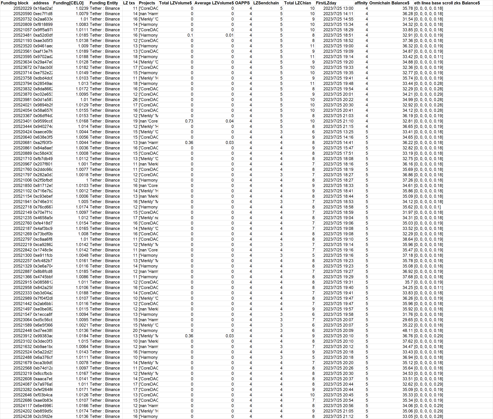
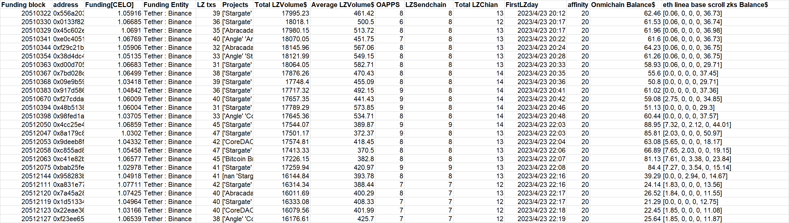

**batch1-1**
```
0x697e20307552031db4827402cb7a0fac972e3fce
0xd0a68fde37cbc8fd805cbbf5c12290076e9ccbbc
0xc986406082ada4eafea5e5f2781cafdd5e8dfffa
0x6dbeaba6692d45e33269acc6f94c3ea6aeade023
0x48dd6d2c9ecb618778dbb2013e529965f83dea60
0x3175b223164b4666fb99f4a129ab1709b2f19f59
0x55f9d731a185ca0c213a0c0e58c7cc779ea3565a
0x19e174d575747816598f5c2f86ab135c345bc735
0x17e88a26be6f4b5ff2fcd35600b3e2eba942a6ae
0x5e7a8511037807f961586cd60c107ce44cc8d9e0
0x33730c77cb29f447937a6b09831a825368fdddb3
0xfea139000369723c9ffa27ebadeb64b8ff51eb77
0xc86d42fee323b6ab4e67c87a62a3783e3ad953c7
0x1f988445460a9381b1d325440df9fa9b6e5b76f2
0xea763edf5b28340af97256e750911d13fe66aef0
0x417c66c754c0181d8b02772a26136d79da385f9a
0xd5b8db1f98970728f261979d05ed2643931fd31d
0xa9d78ac4b26efedab7889d00636ad35b03233a17
```

**Extra evidence**

In addition to accepting CELO in batches on the CELO chain on July 25th. **This batch of addresses also accepted exactly 0.1089ETH or 0.1189ETH form Bitget(transaction on genesis day)** at around May-16-2023 09:35:35 AM +UTC. Same fund allocation for Omnichain wallets. 

**Data at a glance**


---
**batch1-2**
```
0x525c476e038e40ce6fd49271928b29fded5ace49
0x2396e0564b896507cbcb3bb1bfd0e9479b28a59b
0x2b89f2a47687124524dc9be2494201e236ee2d26
0xd73fbe5344631b6445cd8ba626a0a850dcea916a
0x90b615b4552b7a2088f80083f9646e9336e6dadf
0x318862d27453e37265970e2c67b6a889e51f7226
0x040e5f5ed8e4c53d1a9a5d3a9cce435b4fe79157
0x240ad957f212f015210d30d06eadfca99484a056
0x1ba56e4736aaf9ffab7cdf34b1cc6fe5eb9a73ca
0xb40837877fd04d5caee851466841e098e6505559
0xfa2adc9f6039e02ee1fa72598d485d04db0bff5f
0xaddf280f3e47eca9ac1818d9adeb40f10784e4c6
0xabb4d536beef7996e1faf2f4baaa080f857e5d7f
0xa927f50cca9b5ac6d636bc4c87f8c747f45c9b6d
0xa1d7144a6a0840f7a52c41b6bee2b7b940c5d98c
0xc2228c21baeb31c935aeb914b6e9c3825a8354f1
0xcf2b85b2e9d95899991c22ed2bcdaade3e858116
0x88392bdcf6ac9d7c750e78c07c1298235650b815
0xe498ec4bec63d8b704b3ac977beb45f41de49b02
0x8e155249b87576a3e01eec7d12cdc845f3d940d8
0x07f955ed42b71e3879abdfabd156e900dd966972
0xa849acd86fd689631e435cfa988cb1a7cabd5fd1
0xa4756dbc1ef33b701c081691b8f44c67086d760c
0x9001bb9f6754cf841f238da6ed55d0853a54dbd2
0x3bbb3e7c8676670937a9cbf5fd1dd2032f1a6e57
0xd5aad23c82a41139b47c8cb2bbfc4181af827153
0x995a933eec89da9d8b2994c4b121f68c7bf7fdcd
0xb142c8ebd71aa5ebc1f200ba96697a16e3c5aaef
0x9368eaef329353dd60b710f84bb8005b9ef89cfa
0xd51342bb4f723bdae875cd5317aea0a894573220
0xdaf5798aeeb63aaf21ff016737af99f047d375f2
0x50510878fc0ffacf551ba3d5c729c844739b136f
0x1d1c8dafbd08ceb506a851576efc6b8ba649b7c0
0x1b928998e427266b12b82b61ac0aade15e5f4f9f
0x4f70f4c24d92d8b882e10bb0b6be4ba708744239
0x6c67301dad85c6a5d7608ade8626703a2c815435
0x87f6df4649348b2a2d5080a37854a0fcfb4d0007
0x2e71bd78ba1fa9662a90f0f4239aea66594d1635
0x92d3ee57db1bda20ebe99b4094e7023e1382915a
0x04852e95f5a3315cae52d0e9da715a77cb116d38
0x4c56e5d899936be5ba9617d9f925096f6699cf52
0x9d1c0bd77ae04229a10396741b9c324d8fef70eb
0x35b9119c61d03529a6213795f0ffd4d8abc9de45
0xab5f6eca18ba34ab0a2a1e15a68cc0a80ac34069
0xee9376c78d810527110fbcbd90acbdbb1c7a22b4
0x6cfc91b34373e02610c2c13e603cab49e3677d5a
0x8c8779c2917938d82eb630595567d709e03af661
0xa38d3067a3956a570509ba558b7ae46a6e1cb0fd
0x653209264c5605836bb47592c3058c50d64f93c3
0x5c9ee0283d53e6315a3f84f933a22c3b45eaccaa
0xf2e43191167516506db05b893efed857f864a27f
0xa7290f443357cc756b0dd0cbfbf86b02c667ed14
0x5a173e082cde1ed3a821fe9d62736d2a3144ecdf
0x0aa0fa8ea778aace3df6c8c7e24c263954db3b6f
0x3684502102771086ed028b3bc3337684c16aed86
0x4d093ff3182299d60413033a4774fa7a9b531555
0x4fa86d05f17f2c5050e146765024d776a44c8293
0x9ef17beccd7eb6496e01bec122d17fdbd60cbfd0
0x48758aa58fc0c1a21cc56447a1cdd11bdc7f3340
0xe604c40ef8def14f3cd5f5dbcaa75aee2e56f1a3
0x50165d630c39bd0c2040ce31e6171bf2b8b6ebd8
0xcee1bc7e395d52af6933b146cc9cf04bf2f7541c
0x4c6483f8b909ab884b381335440e10fd3775ea39
0xa4d008f5cbb65feae7575f0009a51d7e47f5be51
0x65ec3dab8a7d9b39d5e79cb575745746b29eb207
0xfe7fa9dbc57ae1152650ad56039466ea2cf1a65a
0x93c352ba6575a4649ba7afe889ab08b4abf81117
0xb45ac0a61b26e68df522534fe152e1d3c808422b
0x8d67aae0121127db40c07f2b982bfde5041ccb82
0x99799a66890ee03e14f112c998cb1e4576f9c2a8
0xd6f69350a6441f5e37e6b7b300f4e271829db308
0x5eff36d267e9adec97e1e284a28b27d2e377588c
0xb03af5a62d96d6418c66c4c02d24bfb45b96751c
0x4e87bb6912cb0125df2b56118485993ef3a3c076
0x80f8f4848654ef293b0385624f1e28132b06bc60
0x7cdbda7d3e5c6ae93f6109437b3ee8b1b0e09104
0xa58658eb0716752fa7b532bf1efce3bcf62a68e7
0x99a45bbc4f9549bcf9436970e2dddc5c6b37353a
0xa482078651c48eb8803ebfe1ad1663fd91234047
0x1422759a335a6c0a75fd7c79c08e62b9f771d69d
0x85f3109905be123f0dde77b894c3e4e26408ad4e

```

**Extra evidence**

In addition to accepting CELO in batches on the CELO chain on July 25th. **This batch of addresses also accepted approximately 0.001zksyncETH(genesis transaction) sent by 
0x888270...(looks like CEX address)** at around Jul-11-2023 11:28:49 PM +UTC. Same fund allocation for Omnichain wallets. 

**Data at a glance**


---
**batch1-3**
```
0x16ad2a54d03ecf4aece4882d14ce6d03408cec85
0xec7f1d851394b195736ea75b8ce35e274d237050
0x2aa633eeb8d870d2af2ffa0ca314d312973214b6
0xf81889941ac2ff919caf4d2f25e8ac7edf1283ec
0x9ff5a978b220123881f1b69097085af7af6f4c6d
0xa52d0dfeb2eb97646a0b26913e86d53885047c74
0xae3d5f32b24a65f7381bf4d98f76d3cc4781b44f
0x9461aed5ecd028eee7557efeba7b65b3e0815afa
0xaf13e7fdf99dcb54b848d25b72dcbf951ebd9642
0x9702ad207e95287c801d9a4f8890883f5312f73c
0x29a47e0c85d8fcc4a051a87293b62d0037c3f4a6
0x7dacb08e5f7c5d84a6f087b2cbc5db8bc5cf9cc4
0xe752e22bafce245e860e78d560a3d0b068a691df
0xdbd4dc639503368db0df435d7f8bf04cbba9f789
0x28549ac56e79638b8ad6a82206664a700066b023
0x8da86626306d85eb9de811682ec0a9b63c287671
0xc02e65369356a78be16a8df814b1b1ecba0cb4db
0x0d1a587c8632c1faba38394bae8318247a64d281
0x9894b2f3c7764696a3588b3422804961a38b5054
0x58a6576677907b00b1d91ca723b6924794786ec1
0x06dff4d200c0b5537fad91a1de5f9264be5702d6
0x9599cc6c27663862272394db8d848d3b58d04f57
0x940274c08172073f82ddbe6e42989d3e2a85c558
0xaece09c9955c4d766ab04391ae1de5ddf54cb450
0x638e3f582bdd161bea895c7f55afe09608930ea2
0xa2f93f344f91549e738bfa9ee955cd3f6edecf7e
0x84a8ae5d9fedf527310f85ce771516b722ce9bc0
0xc58d430b1acb20330186c009ea3c7b17eb9ba846
0xfb7db49ae2762e7f927bb1dbb39dc3ea6d694d48
0x207f8013843d17ea6a27a7b994a61dacd503142d
0x2ddc66c815750ab631745c7faa37e7d2bbfd38bf
0x282a0d3ebed78857d92537e8e6754ec17064a788
0x2f5bfbd9ff27f9d4d42df2076b959006084b3b6a
0x81712e5131c78ba6a79ba7706343ad3dbd7edf67
0x716e7b2088385f86813f8829808faf098d93c0b5
0xc93ebef581a67b0b572637900354662e36bb7941
0x746e310cf7f59c8b08b60c6df1ebd667760a3f44
0x76cd6679d02d12a03c85502395a220a58e47d95f
0x70e7f1c58ba42dd1d50584185032afd0d4f0e555
0x4658a5e518ec9b54bedf335c84e2ce38e162fd2d
0xfe418d7a7b9f60902a0591af16fdd4bf717c30a0
0x4af3bc9e5c92b0b7a13225e2b9161f5da5ab0676
0x73bdf0bec2f84ecf3c65de3f64753a1dd9f4d41d
0xc8aa6f8bf59c3d907372a2f9263f13f207c86e75
0xca92862550eaab06315b966aa87c55a7a22cfe89
0x1748c9e0b35314083cf2302a4ef9e67bd99857c2
0xe911fcb49c76fe6a88d786551f31d16811be2845
0xfc482b72f9aba3637e9fea60ce494648139156a5
0x3e6a70461b1b8f2264b40f039707e8fe22d48afe
0x8b8fcd84d0fef83bd54e0922e8f2d2e0d51f1701
0x4745bbf5388f0b529e45bf0427ba604bb52bdd86
0x0858812bd055d69495b5de5992db8b7808b9c11f
0x842a258f0e4f339e672ecbc40a98312729273ac4
0xb3d04a2bad62cd5425dfd9a78fb3f0110f9f64e8
0x7f04f2dbb652f22624325dc006977052477aafce
0x2ab6bb776cc28c2f9da0c3cc505f5412e0e56ed8
0xe0be082615836f81a1b941e86de778d731d80ef7
0x1ecca8f872b78b5d74d930b437930050ef2e95a7
0xd5c56cb9371f4ab1b8d35560d1dfbb0c4ef9b188
0x6e5f366e6d5bea032824ffa0a771f8751a156fc2
0xd7ee3892149c256630869e245d188577bdbd676a
0x99383ac8e8cbb822f6b53d04329d6c8a023f5240
0x3dec0f3e55f2077077f8dcd1139bff89f1523c91
0xb9ae1bd2ee01a20c7b7364961e4866f2353b7560
0x5a22d258ac795dc8953a2cfbd1d66d7a672525ca
0x6a376cf0a55b128e2160f70b9c3b5c9ee775625a
0xca3b9d975426e6b8ac28159b8673d2ff27d04a71
0xb74d12a4b1e025686f072b4302f43a2c046ef86e
0x8ccfbcb87e8f5b1cb51ed49abba66c0c607da453
0xaaca7eb4bb63af64afdfa8371b24ba091b914536
0x7a976a9a33faa05523b37c0a83d6630b75049c32
0xfef2648635f375d36f24589823866d89e49c01ac
0xf03b4caee7d2f936539c93fb0a75875fda5074e7
0xae0b83e38077ec561375237b5895fff84bebde15
0x6e49967005f8ce70fb3bb76596e863657b4ca8d5
0xb859d5c9de0d2962282eec8c6cfdb155e297d326
0x2c5fd2e12a3f959baf4e25a701111ea3c0b795ba

```

**Extra evidence**

In addition to accepting CELO in batches on the CELO chain on July 25th. **This batch of addresses also accepted approximately 0.0018zksyncETH(genesis transaction) sent by 
Bitget** at around Jun-30-2023 02:43:00 AM +UTC. Same fund allocation for Omnichain wallets. 

**Data at a glance**


---
**batch1-4**
```
0x208a9bb512029239acb4cc7834824c8badbad316
0xead35a2e4d6a6c7f15517ca409c2f29734d50356
0x1b3731479bb9db0576e3b0c75eab8a3f581821b5
0x97ac9bdc6b169bf71dcf4968e778c56a54d4c6af
0xbf54a6f732cb062a2ddc177dc385685812b53ec2
0x796597a2f7d43515811e40c7aee15bb5fe0fa2d8
0x77b09c9cf12221c9b97153ddebaacb68fd689546
0xf60d27b9c2098962200d707f491470bcccc49006
0xfc79f318b66ed5529880c0de3d6491601458a170
0xe61458094a0be9fa2394427ad688d10b73b5d466
0x9d816e145e925f52d7fea2be8d56bc07a7002d04
0xddf8d27deb1094b726881995b1249b04f4e3b013
0xa8710633087dad42767474cd87c538ecbaba3055
0xcda5da14611dc814936629d97299a9404247995d
0xb4a1bfde99858a0c9dd86d8a0029e894353ac699
0x331c34c797d21ea2eb9b6552060301b4dfd891f1
0x69302fbe8cdde288225c59075db929e6ab80f3f3
0x32fb8d16d0871450ffec17afb85b88c0c51055dc
0xbb2762332280e88cf11b9ef86fab08312e1221e7
0x66648d2115b96a3fc714a85ef5906ee2d9f00f5e
0x5d2dd2a50526e623f5ef1597d76c29c81b385fb5
0xbe938afadac759ad37d40ab4c1bf01ffc20b9431
0x91132ff31acf32183cbf61967a487ac8b011c03a
0x160f86af28133feb6b7b39d8f2b1cb70517fc77f
0x14e41b26c4d46bcb6989ca9e9acb169f85a072cc
0xed35b6d4335c863007b8c4aafe6a356a498c8842
0x11ea5b5a8c81b000e01821861453dabda2614fce
0xd1821e2bb4c34544111f3fb77457177a23836695
0xdb5319a63d5117ef98e2875351d988754c1746b5
0x59b36032c2609c70a7731fbe1bb4093a16608c50
0x6cd0365900e70cc4d15d40fcbd617aad7281bd5e
0x1001576ea66f1da4e320594f53cb37a4307f4ef7
0x8c2934429c2c0438858e95b9f458a09ab0b6e485
0x492af0226b3405d98629ab420f8f3f9f8a80b01d
0x0e56d12bb358e6685d7ea3fb428e518bd4e4850a
0xf670c59a70db7bbf3470f8c0d4a8c38ada922ac2
0xaad086c2945335fac4ff5fc3699675e268b46226
0x43e736b115e629df4950ba07baaefffe0bbbe486
0xa1a7426376630b4657d2478c365f3334ee6cbcfb
0x07a81a8dd5b07245d60b4e45ded429e833d5a9dd
0x870e21af8ddc5699d62c99fcc4ec9ed6a57d4822
0x1b7b420b9d9d4f099233bc4e37a998e9263cfa17
0x5333a50bd54dc37651577164eb7bed158f688bd0
0x31fbeb22baca608b308a21879a45aae14a892422
0x5915433468d9180211fb05cffc38849131ad794a
0xa2ee504754fac645dd1e912ee6e04e5ec37d6228
0x9b1a43821df89a16938d4ed1daa4b879c0860950
0x334f8a3a285e001c9a825361ea04bc5cf0c3073c
0xc17c51d5a3038be27c133b9036d35f92b4ae58e1

```

**Extra evidence**

In addition to accepting CELO in batches on the CELO chain on July 25th. **This batch of addresses also accepted approximately 0.03BNB form Binance(genesis transaction)** at around Apr-28-2023 09:47:26 PM +UTC. Same fund allocation for Omnichain wallets. 

**Data at a glance**


---
**batch1-5**
```
0xa54e9853ecffb4dd09cc7941a76f6cd01c1cac73
0x7532ffa099d9cd3cd09671bbb16739aaeb81aad0
0x40a4210a72198e107ef45437991d3c58e0f53716
0xc242de8eecc6e45a7035e0da8039710cdd092c98
0x478b80656021d32cb887e0925b7db5406c4dc7ae
0x38be60b962dbffb8db77d878d11f4f30f3d0a142
0x87ae29b6ebc0e593d08ab8dee40de69c40e0c29a
0x6dd5204c6972c658cea49cd237fb17bdd182bc8e
0x696f1da2fe2077bea334e4238cd72d2af8330d6a
0xd3ad1969557cbad2c217433e21f534c29f61df7e
0x60107a547fff3da733f5a77bfa9d1eb683d8b57a
0xd31264fa111951919813bee331e5d1a695f3eb76
0xfad5391e5cf0cb192ca47cd0931e96743039d934
0x3151a4679a6463662ca075e2a8c96019e462f4a0
0x5db353a4dfa6f750cc41d5a1ded593fd6d50a921
0x1be15e7eebd3879b1747dd42b938547a1525ff3e
0x73413a9882fed4e667e885fa6a763bf14019e680
0xb1b061036dd260f6d5464c046d21ffc4337bff39
0x528fce6c6c688f3899a5dc07bd5cba341c7b1f4e
0x26dd5649931e761b1e87d026545ab5daee6c176d
0xeb1436f9fc851c85e2c791a82e8630288fa1dadb
0xfd81ac579d3eb45eee7154515e723c6205c5ece4
0x5746fb0d34c3dd5cb952cff84bd683f215058b5e
0xda3832e8a04667fbef7c005a3457f68d1a303219
0x51b7e85948cfdc83d50fb8d1ec1654dbf92e01c4
0xe1a73d513c1a880dd87c6dbb170d6b8c76735912
0x673394b61d435f8d9cd410123c18fcfff96ccef9
0x49d0dc1cecbc7f73309d7e4aad14786ba55ff4c4
0x62aece72cc4fb6da4472d84b9b87716b4043c012
0xcfbe1ed16a235f7dea2553ee703938dbeb75dce8
0x7087f76040ced95eae15ba34c177585d8a2116e2
0x54b642fd72ef808298cd995d7390d79bb818c293
0x984fd45dc339555a35a67fe26049cc3624f67d6f
0xf6a1072c11969d590749bf53d0e6deaddf8cc3e0
0x8d8b9630a18bb1f25d9614e178bb17ab1a4bf394
0x246fa4419ad4bcd8328f7586b131d5908d345f20
0xfad3982f6198e596f4f2495f8345862de81542ce
0xdda3a6611640f3c2aad929c336dd347735a1a75e
0xb45c7c578f7321bc068d4a372b74a104fa844edc
0xfaebb30e88b9a820d48290be5413dacf08821720
0xb720da9d4f32bdcffe8df43e2009853bd88e9cf6
0xf7f2a734c9d542bf546d6b767e88836d6f009ed8
0xf6ea1f5cb8712e65968f10c48d2d65559cfcacc4
0xe1bd8872c3be39ea90330c75550ce4d9b4c874e7
0xfae40c019394111b4b5888b70ed64285f09ce2f0
0x21fbfbbb5ddd2768bc4cd449a67dd2e37dd0c5ca
0x17e79481b8c398a7ec3a0872f1e8d84d159edc35
0xe4c6385bf269b0358d3aab0a924324959667f02f
0x5a63718f0531bb8f7d2c3cd580b1180804c40e53
0xeeb92aab70e301e77c290f1a0265cc8ca968f6e1
0x6fc7225182b1f25b6dff2086d7f06fc05e4a6924
0x371c9d7f056bb75970cb7b46b15d6c923bd66f6b
0x6b146f6041c9e567816aa54f8b464a3598392d19
0x4f7cc63dfbd51246caaf4cbe83d538a817aec33e
0xe22bc83414de4d99a44aa6b33aa92c2ae0c256d4
0xec9205d9eb4a552a3d611339674aa99361adf72b
0x4423c8a816b94edecd208c96e824f8834d163283
0xf81750bf3773a6866a8079969965863f5889cbe0
0x95f680bc39a2577aad8fe5a1bb55b57dd600456a
0x67a6da86503ac04c602fda35bb5ba493a39317eb
0x66613a16501e4c81c113687d0e9a84ee6297ae29
0x85b54237263e37c0f6ebe0a7c426c06701cf318c
0x89f8b41a5e4a52f27585b588dd6b0b8f73a1f04e
0x783f67dc651b4059e4e1948d1cfd98b406aa93da
0xb113fa45991bdfbeb22385222fe5b013dcac1c5e
0x061098df8334f271fd472607a4ac88513d4f771a
0x4c457bf5099c55cd942a8adbe662ab374703cb67
0x4457df6cb93bbb30fc9da33cc8fcbc747f551f99
0x482ac5e2b92eb6c5dd0215b37ca4eb1bbc15f8dc
0x61bf6972993fff4b932871b69c32cc26cc192365
0x873bde8fbcea496e5a568abef6a313cf99479f6f
0x2e01fb72a065e4c071a23d60986ea13f1f2c7428
0xf60be13d7b10c4d69375bd78db8e0c144f041008

```

**Extra evidence**

In addition to accepting CELO in batches on the CELO chain on July 25th. **This batch of addresses also accepted exactly 1Core(Core chain's genesis transaction) form 
0xE07F73d(unknown CEX)** at around 2023-06-20T18:33:03. Same fund allocation for Omnichain wallets. 

**Data at a glance**


---
**batch1-6**
```
0x6b0a7a4c2adeeeba7bb9320605c6067d937be2f2
0x672d2eedd9f0b24d06889f1c8d3630d2d2fc920d
0xd0c13f96cc283ea1bc01f8d117c0b6a89f51ed82
0x4338926d38ef451d403fc40e1b6f0b7454acf45b
0xe7dd1a9a070693113b82cf790ce71240519d0044
0xc1a62bce3195b58688745065d51919e65a91ccf9
0xc90e9c217b6aa364b33bcf3c03321309e4e3a541
0x88501fc42b28f08417b1e6631c2d6934f0127f5d
0x242abed49ed1cf7992b1dfbf462520535eb9c4a1
0xd24dd7a1de0a6e2a111392790145a74df9188869
0x579c4503cec9aa2b2a0b5f8391bf162496f8d8db
0x53afd473daf8cebd94b5a6147b3c3079511f6ecc
0x0d1b9b0fdfe960d79657eafd8f3aa3cbb7a3dda6
0x1ddccb33043a705c1b7bc1a30bd6c8b1e8c4547e
0x8f62180980aad40b8aa65a1483eda08510ed3043
0x99de45472a9c7aee502055de22e57dbf5ab109f9
0xab942f81b907120ca23b69c34c6d0ec998e96968
0x64d40e1f3037cc96d2b657f0a8475237acb4a2bd
0x4a71e4be7e2275a9d6618b7fe78166c2f0ff0eeb
0x326116b73b01c14b0d48fdc7a47574fc9c040d37
0x1ecb0752d2ad79fff7a25ad6f5aeaf448a47026c
0xd572af0611ae6385ba688ae5c0e4edded7c0b745
0x11d4d081fb22a3ccfb528fd254246c6b04ccc9e7
0x44570f8e335f7d033a1d2de848e738972618036d
0xc6b8d3e0af597e0007a36da7edc7484b53cc5abc
0x9bcb449344903dc7c3d95952aea9e4c9b3bb77a6
0xa2229bfc558b5655ba3255b6d15442e38d5052a8
0x28c7ada134fa604b394b723e5e54090f1c3e18c8
0xa56a56b1f4adae22e61dfcf64b2b11796bfb910f
0x8eb921c5d38dec6971cd53875a4632773413a9c4
0x0143ae1931f592b49beb011f813c310f8d5534c4
0xb1d2b985d6fcb9288bd0ceca8fa5c34d534a58b5
0xd5cda11049cadb3c8325d513f73dabec80993e36
0x6cc5d1519f926672f50f4d82ab242a9e950e10a2
0x8370261bf3197cbc200c6da4422fae873b777165
0xd0954b015d8cdf4aa6dc2175d5cfabe62e11158f
0x1d8c2f0a872096c7000cb5d0646a035a17c60d91
0xc128635c0794034e84515e2bf66e3a6c714d6507
0x0f77a68807926e8fd5a42b758213f9bf414c5df1
0xaaa8103f3c4475f404bdb491069e85e47b30b619
0x84fa55923819c08d6271951d4344d19a2da814a7
0xa2921ef0d8b995c76addf407ee03a3470fb2b63a
0xf2962e14a09b4869307918f9aca23e20a53d0204
0x25a750ebe5432d0d0defdd024c291959614c3244
0x783f13206db107198fb154f78ae5f8b2e1460785
0x53aac885f04be5f402bd204c9dcffa486ed099a3
0x9d6884c0db24049b9a011c5d52ce1ee6e4bb253f
0x1a2d1d943e8198cae1c1c1ed8971443df0d10b85
0x9ccefb2e53a5971d9d413deb62ea0f012a5b30d7
0xd699fac8d0db48ab25d4ab2507cb9e6ac43b807a
0xe989ca5e60e5b3b5d141f4912f3751a66511f3b2
0xaf8108a72a0d3c6c61ce31bfb31d32bc9efcddda
0x32ecee9f553fcdcda2f85f4692b135a11ce4b4b4
0xafe81debf284f9ac0d194066f65c6bf12bdb275c
0x3eaa71124c06a46c70bfe6cb497a0cba6249b080
0x4d7eca5f9c09fe81cd421f63bbd8bcbf1a03a2fe
0x07a75a98b7afb77bfb191fcfa2db89d56b92a534
0x886123903d12db653a72167615981c071a8993da
0x402c7b576b11e12923b0ebe3e86398163db74d86
0xb8e468c1182afdfec5816f752909095516103aca
0xf1922d13991f18fc778894b8af0c8f7abb1fb00d
0x537c7c5b6cae5865a55d4a96a1b5f89dac54a424
0x89c998fbd6ce30d4d5c6e361178cae7c87f7299c
0xf3aeb1705a77ca8f0d9acd54f1f8653d250367d9
0xdeb702a6519c52efaa3394a27f9aadf6c3c0f84f
0xaf470fb8cbc2a58b478674b24e6fb33268ce7e9a
0x8f733f9aa9c245fb8bbea64c21df2d7b6d3dca98
0x52375b659252f6afbbd17ee0babee37ee5bd6189
0x8061f0f68b55d4eab045af1d7b0eb125fd4fa48b
0x42a64a3a7eb64f336a91077f6e246bb7cc6ae0f2
0xc97f6c62b4ad79c7f7220c3d55a8834c99778d82
0xf6791029c6ea7cd2c1b49cd91571166466f06cfa
0x046b53dc075cfd5bd5e3af0247f9e153b81b057d
0x5bfefa37c209a5ac823b2011aae48e3539ed0732
0x807c576780cb2f0614dd0bceaa4a7fe933772a47
0xa875f2b108785481806ed11af977fc09f90eeddf
0x1c8fb9af76006819c3f89ec3e8762bd96c80a276
0x1c9359bae4d367198e86177003387c7ae649f574
0x6ec56b665c265acb0cbf9bf5baf11ce42dc4e3a9
0x22ce84a33f292c8328c053c7eea9ab065347f61b
0xe11454ec447dff199d9bce2f89edd11dc8e01952
0x0771610b17228c263e303852b2ef0e1be8cbc405
0x1b0de82be5864af13d8897fd35cce115fdfa52b5
0x8c69946c9ba1a0d066d80f710b4deb422421e0ee
0x9f9f05c4b653de7e08b14e855183be09c5d4c95b
0x3650534542e4bef668f52651784b1dd251159c40
0x32caac467333dc9657dd6060055805780784b82b
0x3fc095e87ab23efe781516f09dfa2f303ff15643

```

**Extra evidence**

The owners of addresses in this cluster have a high awareness of censorship prevention, and activities are usually carried out in batches. However, this address: 1: The number of CELO withdrawals is too obvious (he intentionally increased the number of decimal places to disguise randomness); 2: **While withdrawing CELO on July 25, the cluster address withdrew approximately 1.25CORE**；3:Same fund allocation for Omnichain wallets.

**Data at a glance**


---
**batch1-7**
```
0xf3d1fe135da99a75d182e48d168c9716fd217443
0x145f6b101768a36c609be995c46920c031b417c1
0x402c5322f21f9e98a3e2036b9ed3f1eb537babc5
0x207e3b1794c5bba2f930fb3e14122bfecbd8bd35
0xf797f0f0085628c01259b1bd554ad8c497f8ac6a
0xaf6511093c14c387d9c4529c56b2fec70617b039
0x296032b5b3f0d625468130d09ea55cbdae0c08d2
0xd3f04d15f69e5493e0af914bf5def1d4b387e03e
0x535891d47bef8c121331cbd71c6722c6c4725e3b
0x7c314ed299cfb77b9829503ec1ce81331ca9385d
0x7d089a65d7f25635164065d43ae83149ecae781f
0x9d654b9ac854dd62cbef80905eef5589addf9c94
0x2c1c65f45e3003633d433f8495765f1b2857b814
0x9552b0e4c746664d667d588e57e434eee57e048f
0xac95c680477a1808ffd14f61c6a590936e051e19
0x8ca5764d10c2fb70e89b0aca1fba3c3729afba93
0xc6db6f6065fe9d6ba31b0b5f76bd7fc51511d35b
0x98554966afee26f53fe71d590a5e657fbd4f8420
0x83a2aaf9cec4d0bdd13bad478f3043ffeb8ac118
0xd53c494d486ea7bd1bc7c3e323a5006a1bac4e36
0xd3626a02904e843ac88e8afb462fc3b7bef1e036
0xd1179b6db46d3c1c2a09ce1851ca0ffd30ae21c0
0xa63f6c60220eb5a99ae5739c1370aff5624d3b8f
0xb69dbf3938948dd361fa83d6c8297243c96c2c6a
0x1d4e652e4b983b40039bc684e274a3c2f7d052d2
0xbb745c0b55ee5ee7457de0fbd06bed1badb4af7d
0x17049c68a5fa6b5b9a06df21b1e4d8b7fdad193d
0xe1126fc7dacf8a20f4c7baff9ce0678a7e4dee4c
0xe75cb5d9cc0d663cd131fae3255b74065f2cd5c4
0x6140e6339c5c745d47f9e75ec9ca4a9dbdf35f43
0x35a8a6128a407a3229902d4e70d883d5ec81c6a9
0x4067b487fd9fb20895e85d86555473a8384b6ce1
0x54ae784a5ab5cf81b45203c23292ec1946266308
0x41637b7ed6fa6e09a6ce142f11d66c4248869d53
0x368469a6f40e6e13c91686dfe87bdb5f70943921
0xa1279ff72072dff4848ce63dec2a4ea645262165
0xe3dc2de7a8846c095bdc73f10f83797f20072ef5
0x27110e212f3abca6bbaad3d2f48b3ea1e430b68c
0x0e57fd857acf8d2a94d11bdbd52d2f6b5cc05b8f
0xabfef55cb069a37c43dc00bb69cfadb65fcdcd06
0x279ffcd7d3e136d03c387633c289f2fda6f7441b
0xde3c799f017e6392344d108d48c014ef03104a39
0xfe18d4080993b22a44b79260091346642805b305
0x4a5a6c592d72e4a7166c0db52db1d52e9cfc6bce
0x1f2453715673ca6cd77c8a281806becbdaa7168c
0xa6bec0d5b090823a31418ad64d2df8b8d2beec26
0x626186afdc0d8db93f9b64a95400cd53b48d0bc2
0x4196b156224cd0aa3bbac0e25282d6d84207e2ab
0x8093561245e5b69b5f36084c8cb6c07cf3851031
0xaec6e7a8e2c706d6b92ed091e472aee366e77ca1
0x82029dcf365a5d8a878749a46635c0920b727888
0xa3c9bd62137c77ce103865744739911f124782f2
0xcaa0207564311f3767f8544d846d871c05e0a549
0x4f4b9b48e290f6fa390302bc0c26decf9a4b4309
0x7f4eba4382572bb111ef5593e7ff720971276a2e
0xcb8307cb12e869cbb220921f2f7bef7f49e619bd
0xd77d847e7a089397d911861cfb76cf552dccf8f1
0x39b6cc2b953288be70798be3dcecf97e4335c9da
0xd9ec12061d050df673e80adb197723d17f0af168
0x177a8de5e0e448ee8b93e7aca9825f83aff0c852
0x5d9118a775c7e9ed7699f893fb1d2873790ef703
0x5e42ab37ef1e0d06f6c96ebb5953f266369f94f5
0x15f989a3771ab7ad42fe93d647ae8fffed044db7
0x9c1b9151fe8313e42121d0662b7c67c6ae3256a8
0x7b9b2ec137e6b596b1f5db9c644386be66795cf5
0x52b2cb3ba1f894b524b4c76df4b4757f7805cd44
0x5fadc35d867615e59024bf3357682ec177d4c44c
0xd412dee7c26e1b71fcfeef55fee81b4240bfd4a0
0xe63914f27744d9f41fcb879ab9f2bae728ba9856
0xc8f622bf737fd987cb3bdc3e2a642f62d8aac0f8
0x691f37ec1e14932f41fa09cdfec4efdcb9abc0a1
0xab0bf1b800d7ed2467c14bf35d5eea279fa311a7
0x9fdca0bfa20fa2403de5f009102292d160bb84e6
0x3256581bb340448e69d42e70505156a0ac8ae3a8
0xeef6a4b8819d629dc0aa78a6fce8a18b1eacf5c1
0x2bb6bbb36e9df274293a9112fc65d2502cf98a47
0xad4464beee188300516dee2d0efa3d717b5cfd33
0xc93e45d3606dd92e50bd0dc846bd5357f45acdf6
0xd7e34484f5a537babe0816ae73b3dbaca68f8f28
0x4574da6cf7cab719ba343a323ed000d0b5d98d82
0x3047b6420c81971d3a913a183e2d63b29b03c71c
0x3de00ea04b5850505aa3a869526467ee4e909c7b
0x66be15bab090845c1de0e2f6fcaff2db75579932
0x90b3b4e02ac68a1e6c2bc95243e5ccbfdf3671f3

```

**Extra evidence**

In addition to accepting CELO in batches on the CELO chain on July 25th. **This batch of addresses also accepted approximately 0.176CELO(0.15$) form Binance and the used merkly to bridge gas(0.05$)** at around Apr-02-2024 06:08:01 AM +UTC. Same fund allocation for Omnichain wallets. 

**Data at a glance**


---
**batch1-8**
```
0x38cf408f8ae1869a2a16054e3bfbc518972f65b4
0xba9bff4728725703df0357031413410a39da0159
0x5d3277aa0d4094a4674da05b02eac750bb534655
0xc815e583341027dedada7ec6041708cb0e956b2f
0x442171a9d3171d69149bd1c02a13c1861d6cb1b3
0xbfa542a3cc99c9b78c14f25592a0fe2045c24190
0x546c684b67e3b13ed57b1fd9c275f22a2e280dd9
0x662df7fcaf6805e05ece32e427ecf937e840ec10
0x01a62a30ba9080e2f2ce50a0e08ea2fdc87a87ad
0x62c8f55c7beb1e249eb7d64d2ef76d54a7ecdfab
0x4a2da98db28feede4c015a52aad6af9f301a16c4
0xeab7d12f5d16817a5dcb1cbed601d352c8e831ec
0x8f8fe495d745d335a8727cb3547020eeea571c8b
0xf6254ed2e4dcf4f0958239b3199b5bf059c9896a
0xfd37042bbb2bfbf3ca0b3c4607dc97885cad137f
0x0985c2d3373adc17efdc9f25d89301c17f0cb47e
0x8b1221ef92e442c1bfa5b8a09fa9225be9b61f30
0x20a7755e3fa6a59493f51a774ba619be5eb62dcc
0xd4fa96f848e749f8f6825699212f5aa3462bf406
0x5b570136b64066e48f234ce909904f47fb0b9c6e
0x55824f6f30ad990c59974a306c4b2a5da6ac55e7
0x5ac6c2fb262c3d914f153a70d2ba29a39ccdf5dd
0x63ecd8e13c54db6023f8f0e2cca5303d0bb7f57a
0xf7a8a7002ab2ab52483df1ac43dcb74e2ad1ca6d
0xd57dd3bb2238e732fbf281d712da77128b6f6d2b
0x34f8f2d111512d908d7ff0e5a9b210e985fb790d
0xe6e1312cd7aba9b2d06c1b82931c51f48cc62c48
0x9d777fc93f74e65a155f3d3aa84c7f680b7e72e6
0x87cce33b3c5de9193f519f0f78fb2d3970fde648
0x287df16ae6c0d6fd076a397f98d5b3f6ceaa39c5
0xec7984a8563d49f15d92abb3affcb8cdd5c60f1b
0x46a4917e0d3252983c6e8a87a2b7f2de534f2760
0x57e46aae856b5b47cde00b187a21b53ef79830da
0xf5dc0982fa22cf2e9a76dcf7be97185180d7c61d
0x83b2ace5070a25159432ed3c077c9cfec07e0e13
0x7900a0ff497d4de674eed0e8c3408f8086414963
0xc6696c24712edf2adb6add14341f6045f21e3b03
0xd4fb43474ee435c32989b82f13941a98ce7183d0
0xd49009046bd2a14ddcddfb20a423e6cde0689b69
0xf09e0e67e8e12fb3cdb88ea6a34e082418e9925e
0x15335b66e9d4afbf4c8512d21ecb196c9102d89a
0x51f720a059907a412beae4f8d45b759665cd63f3
0xc86dddc68e2aeea4f69c985273fcb868e7f76f28
0x7f99c090e92f6482a538ddbbb42d3664685bc4f4
0x86f090f6ecfa32651e6fcfe44a27524a54498bce
0x49600945d5ffbcafad432fefafdf68040862a11d
0x30a33c7c3a0b99311b0c2c4a5246551ddf00deb3
0xe670701d63747358215ca860ba3e31666c1feba6
0x2958c4c9a7e522741f75e764d5fcabf0c45591ae
0x5364765299f210eea871f2e9a2b92a2a779c0b96
0xf2322aabeefd6af15e08194f4a3e36e5938e9886
0xb4b5e98b928d2fb9f61a8820deff322b1683a726
0xa09231271fb796d51ed50e0731ad9b57699cc836
0x6b4f3fedb5ece289f8ab928e451442fca5b9cac6
0x9dc3b17691c62b366d1edc9685061fcf88806e27
0x463dc74437188260063131e3def3a250bddc7245
0xb1869865821a131087aa8f331eb420787cff27ec
0xb10fb3d769e926c20af8cbf74e5af3da3745e7b2
0x13a259d81d3367a04795b15fd429d484833a5d7e
0xea37125168ecae766a6c7dfd0a2ac7f39201272c
0x7e5df15ec90d2b4cc75d8159e5b4e31da74b6c83
0x63cc6ee6e130761815fb6812f66b67ca2a06cab6
0x5e8bff066291b82594380029c110f310dc3246f3
0x4e055ddc2d8b7c42f1c5739a07b2b5f4dc0817e2
0x1de8fe1e26c27b3436bdb0651fadd6993ca9b938
0xad095101c7594f84b4ccdab94801843294733b33
0x46f938e08a20fc80b7166b7a256c03ed0c23f3f2
0x1a4c0754bfeb299c646114121ce1109aa6114248
0x2f1417417cf5bcab9a2fc4fb5f30ffdcda5fce72
0x9054b13b40ba62114ee457b3364cfcc6532fc776
0xb2668721c5511339ef134f6438e74e3a575a56fb
0x88135a0687e22599bc01164103529e1f00faa5ab
0x434c8b0cb46fcdf17408da6a04e41a55ddb28c1a
0xd914ee908df7d1e0f283a26e321268caaa14c46f

```

**Extra evidence**

Batch1-8 and Batch1-7 belong to same entity. In addition to accepting CELO in batches on the CELO chain on July 25th. **This batch of addresses also accepted approximately 0.163CELO(0.15$) form Binance and the used merkly to bridge gas(0.05$)** at around Apr-02-2024 06:08:01 AM +UTC. Same fund allocation for Omnichain wallets. 

**Data at a glance**


---
**batch1-9**
```
0x94647b53cafe78ecd212f722c8ce8bb4a5b8e5be
0x1b9425c9a502b03811c2bfc05ea06a64762764ea
0x2bbf50745cc12607254698542435bfad99b6190d
0x363c04e61e202f845d733cafb55d1fcddcdc72f2
0x2788eee8410a7f0732c0b7ef0e7b1178e2ac8288
0x27776280f42dfc758bd2dd93022ca2cde8c760fb
0x710f728d92fb3207c7a96f84c4d52158aecd58df
0xb8f7c16f9d9152d4e0fac7bdebe6cb0a475ba0c6
0xb0c8d52fba72ccbe6eacf984218c25a78c674172
0x6766c5454b185c9c2e1be0cf1d7d2cdf671262c6
0x2da13b20639b7ea22a87f977eb69b0ea5d2de615
0xa874db8dc490948747de35bca59765b6542bf44c
0xe68a1f999732cc5ac668513b88f71be092d56e19
0x56e2259f9fac077feb9465130ea8c444b280745f
0xe2cc1624f33c88d3daf68829d0dc3359d89cc4e6
0x4fd2053d5737cc5b9c8c10cc681cda4b1a2c8dc1
0x99400dd441599c49c251364cae417f1838d23813
0x7afb82bc8bfcdf8077c6420218da80e2748ead69
0x0ddb978faaa640a882582d37ff99b915db9dcfe0
0x1ea2df45d9a66b7803d2de6e790ba7b4ed2e3fd5
0xf3f97a1445f94e0c1deb83c3a9bade42db5fdb91
0x658a04b7b2364e64d65adec068d799bf0951251e
0x04bfb5895cf99ebbb06f14d03e2c021bf1fd72f9
0x1467c516f73f4f090592ebd0e740db8e2bbfa9ec
0x7637499689ddb5b3f90649c2c86aea2d65dbb583
0x82380b58b02b2722bef966afb22d185f0d871945
0xd4552aa79205ca381f3025a392ea5f8b859356dd
0xfe2389a24282f05a57475a147d3a8175c7dcfb0c
0xf251a0f560033fbe55a4f8d016389c155e692dfe
0xa2a7a35a832e3492df93799741bdacbc31441fe3
0xbb7f3f399e8ea6072a0670253984e4d7bdf15217
0xd318a6b76ec462351752631263b18e2cc63ef183
0x1f4400bbcb07ac0ceb20bd1d11cc7617254af51b
0x49ca974d9c0bd4ddd7678d81a30fcb6cf42985f6
0x0938a1e9563898cc92c8838df4b066b9e0821389
0x1dd03b9cd2e6f7a018a01cf91149259c9adb698f
0x7f6feffbf630aa6624d22e64ede9a0d3cfe860fe
0xe92ebd0769c7eadf9a06bf8a4677a20e8c98048e
0x4e8a4882cad55c8dbc8cae764a704d008b72ec58
0x9e2b2407691d7f1c32491e9c23586d90ba950cc2
0xa1d9901653297a077f6ce6118d3f3575ac7229d9
0x5e03fdf4da96101ed04a34547b87db358d8b8770
0x534cfbf1d7f9924ffa53c9e54888df890ebffced
0x5b123a1954410c0401ac4c18b7635559b1b5bd3f
0xbc8e743dc72829ffc486369bbec1d87b9e0c6bde
0xc1d428513c047bd44569debf03b97d662e2c8cf8
0x9543566a9ab85d6df7151737e0fc57abc1525108
0xe1188b8fde9bfb951dd51b9b31ac632feaca9d3e
0x978536226a3d83fed31a5830b2c85cdeb71021f1
0xab275b5ab26487cf15431929101c2f617cf55939
0x040782e24a3d654389f24e12b32f0681233e98d6
0x15763316f896be475634ad980c7a3a233253afb5
0xc57fce93a1c527c5c976e5d5ed20255e79f840dd
0x739da40c49554a010eb30beef28f8c32424131dc
0xc70cf1b42bed4a41056c553f64d7dd5affec3f2e
0x24bad99f7e443b08b14be03b6a56c4fb514db869
0xf470038d8829ffd0521689fdfbce4316b0984765
0x12e52a99b40705b027655b87c8167f4b14bd9caf
0x9bebe5b7e73ec223ae4ed3fd011203db9c0ae7d0
0xd189e5a80072669529e148ecabf45dd32b836a60
0x2565a6d862f781e60834c99681243c9ae666bd9b
0x99cb52121a58b9b77c383b41a0921610ba950a67
0xe182b9c3ef46e162c9e00fc10a4712b7978a1d54
0xe2891d8fc80367d6c918648a234f985375bd7643
0x5ecd49e17e0e20d7877c340a194066c19524d2d7
0xca3d730dc3a09ca22480c383ccb3cadb3a4f2ce9
0xf0a732aa1027d42593b0b0b86430d1ec30aa843f
0x1d720e2137577a7dc96dd9915169e3bef54906dc
0x0aa5517e08c1b31e0ce12c7be7fcedffbaf4b81f
0xe57ff75d1d9530178448248abe23f5b9ce5f581b
0xdb78f12ebb0c4457e90387d9c2809c100c4a56cf
0xae988efb2665092a43c4d620979aa84c175e2ad2
0x78007348def795b6b05b0d266081e439bfff0870
0x91ceed6bda1cbac32ec1fe877a1a3aaa17525555
0xa1639c9756fb3644cc29a8fd292cf239966101d2

```

**Extra evidence**

In addition to accepting CELO in batches on the CELO chain on July 25th. **This batch of addresses also accepted approximately 10FTM(3.6$) and 0.37AVAX(5.8$) form Binance(genesis transaction)** at around May-14-2023 10:04:42 AM +UTC. Same fund allocation for Omnichain wallets. 

**Data at a glance**


---
**batch1-10**
```
0x556a2037cd66bd8f0f33497fb2847baec87ed7f3
0x0133f82b058e1cc82c5e57cccaaf3c8bc3fbce5b
0x45c602ef14479c01e39b4dc55a54c29dec5b860d
0xe0c405178fa0198d7b3c0222f9562ed4752fcde1
0xf29c21b1a733233b97bcda59a0cd8384bd66cb7d
0x38d4dc4872c6d0ef9f893b11d68be5963f93945a
0xd00d7058313393d06dc228fa7a0c8855aa1ca65e
0x7bd028d950bf7c3be41f73d4a867248078faa6e1
0x09e9b596eb1bb856d6e77a3086d9498481d02015
0x917d5867826326dd47fc3d2f390f80fdc7c644c1
0xf27cdda6dff79f9c380f864c7b9b4c19f4d958c5
0x48b5138e78bb968638323b895aa5d4d2d5002421
0x98fed1a2aebb2a72a433633cf4fed0304f7dd344
0x4cc25e483937e684f1e64606aed15651da2db995
0x8a179c8e1eee76d7e62a14634d60e6e4ddc3ee03
0x9deeb8f0440d03032f1088d8330bcefbd7226cbf
0xc855ad87318d811e7be5fdb19e78795041df7dc8
0xc41e82b33b3d1793daa26f46edf85a57d98d429e
0xbab25fe41437a048dd3d3defa8f8a4cc5f4f50a9
0x958283b995dcfdd6b07c3426a87fbe6e5b982052
0xa831e77099e467b63c48a3b17bfd27356d181181
0x7a45a289bd6f50ce7056f92e55276872284a3189
0x1d513349d2b62e9caa6fd2a58f2f893f2a5d6bb3
0x22eae36973a241d0707ca3bfb60213c048442bc1
0xf23ee65b8ae98ebc4342d1ebb5ab42d0a15f4831

```

**Extra evidence**

In addition to accepting CELO in batches on the CELO chain on July 25th. **This batch of addresses also accepted approximately 10FTM(3.6$) and 0.37AVAX(5.8$) form Binance** at around Apr-27-2023 10:16:37 AM +UTC. Same fund allocation for Omnichain wallets. 

**Data at a glance**



---
**batch1**
```
```

**Extra evidence**

In addition to accepting CELO in batches on the CELO chain on July 25th. **This batch of addresses also accepted exactly 0.1089ETH or 0.1189ETH form Bitget(transaction on genesis day)** at around May-16-2023 09:35:35 AM +UTC. Same fund allocation for Omnichain wallets. 

**Data at a glance**


---
**batch1**
```
```

**Extra evidence**

In addition to accepting CELO in batches on the CELO chain on July 25th. **This batch of addresses also accepted exactly 0.1089ETH or 0.1189ETH form Bitget(transaction on genesis day)** at around May-16-2023 09:35:35 AM +UTC. Same fund allocation for Omnichain wallets. 

**Data at a glance**

