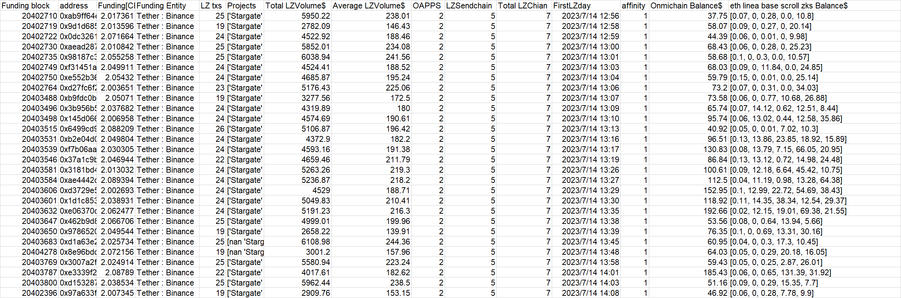
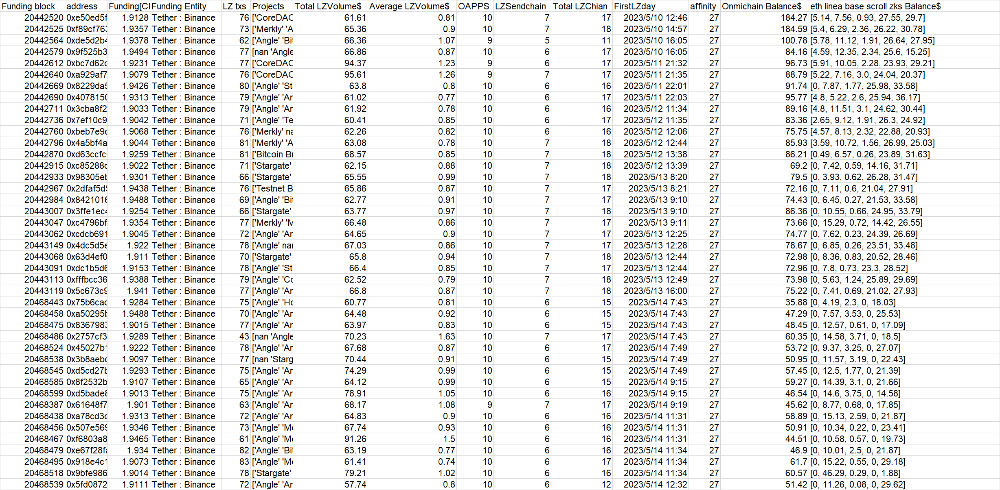
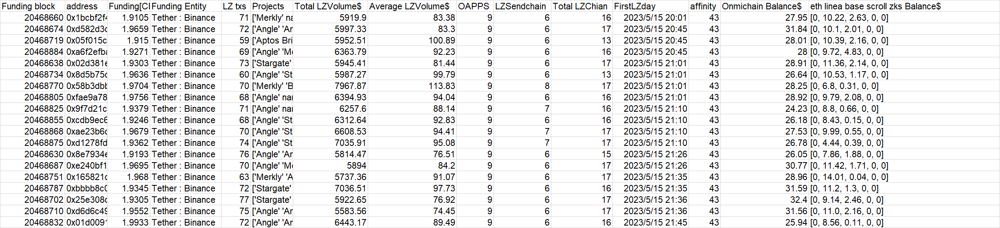
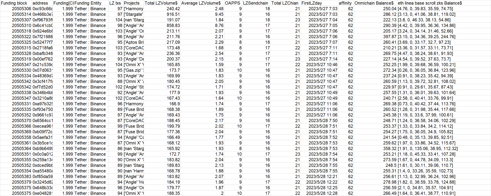
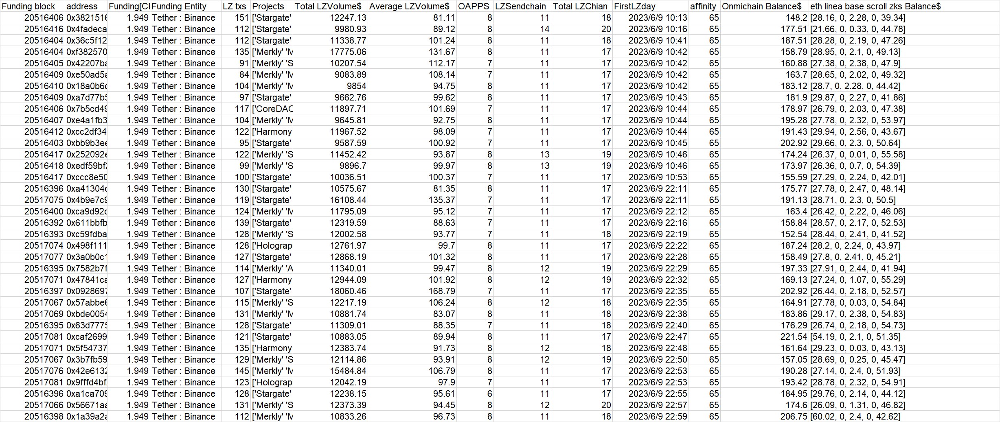
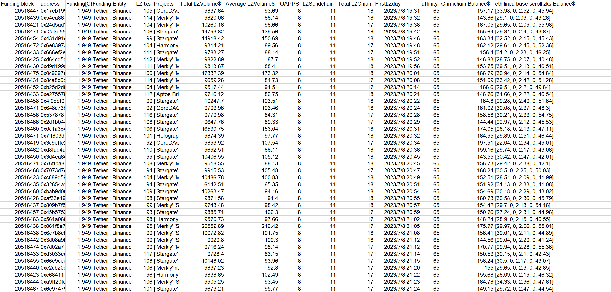

**batch2-1**
```
0xab9ff64e18a7c4ccffbdbb2bb002acb05b7cdd90
0x9d1d685c7adc61d2592d7e74bce66d3a9deb12a4
0x0dc32612a705bed3f1e63e89e1100a6af7a7042d
0xaead2879ef02496b7c4659d5d4c8a8618da200b3
0x98187c38fe1d37a9bd995f52c6d3dcdad0c017c9
0xf31451a88f2d567b83293818e646583eef3951d2
0xe552b362b2af6406356a5fcf8104ea81ad2d1c97
0xd27fc6f271427839cb842796cdcd8d6eb7a2a76c
0xb9fdc0b342366d1d43182f313fe2707613c0769f
0x3b956b531f78b027fb7cd304bdad8e803466be6a
0x145d06600e7832b94065b3742063b9701eb69260
0x6499cd9a4865411636f80a9d128bfd614f5cb4a0
0xb2e04d07d9aa9b227aae71e699a1eafb44a3dd81
0xf7b06aaa125c29cf46dfd868310214eded26411a
0x37a1c9b5737680328ba7a1fd9a235ea5610806de
0x3181bd455cb61ece0879852a0cfdc8abcda3e870
0xae4442c3decb6f52e9fd9edc9121a6d3be46542d
0xd3729e530234af5399ce4283a8faf352ad764b5a
0x1d1c853d05a0fda5524c86ff52343c8653e986c8
0xe06370c3dbda9679271202393d90d7a8c8888c4b
0x462b9d8b098b8562843ee1ff62c2e6cdfc5a9a5e
0x9786520b33d5916c2b91d3a45f191033b8b48220
0xd1a63e20708d6e853ab1777f7f7b321608f1a139
0x8e96bdd08209c0ef3c5af9692d29aa24a6878ac2
0x3007a2f57932580e79d5fbe603ac71b050d5676b
0xe3339f256e48efcad9fc07e6668cbc2c2127ca4e
0xd15328737391baf50d0dd5af4aa27d72ed2dbaa2
0x97a633fc08053c7540d09686a52b68ac69d8eda6
```

**Extra evidence**

In addition to accepting CELO in batches on the CELO chain on July 18th. **This batch of addresses also accepted approximately 1.55CORE form 
0xcFE2B(unknown CEX)** at around 2023-07-13T16:27:46. Same fund allocation for Omnichain wallets. 

**Data at a glance**


---

**batch2-2**
```
0xe50ed5fc280d3cf1718123b82418f49e493a01d0
0xf89cf7634e51334323c66154c791151b283f7e4f
0xde5d2b46240065cacbd67e955984e09756a5b495
0x9f525b3dd1710c1f2985595d68e62a35c8383ed5
0xbc7d62c30b136d10636f6f3f5826b22cfbc8e140
0xa929af76b2b66669a8e32d90c5433b1ab13c1a8b
0x8229da5106c74783f60d8389983c9d43b6385791
0x4078150660efe40041b73d2eaa20d8b8dcd0dc52
0x3cba8f2cf698eea8775f343d54f894f4e432026b
0x7ef10c9df31978f29821bd9787cec35a0586b1d1
0xbeb7e9d7445d2f6568294e0fbb0679b90f362542
0x4a5bf4a7bd7666d87e27e13568e29593e534a109
0xd63ccfc032ff1af19fbad0d4830da21d83d97d85
0xc85288dd1609cdf910182988cf64aabb1a2846c9
0x98305ebcbaa55310631ced99237aec44c9e616bb
0x2dfaf5d569efda1b8c3004fad9e2579c548f41f2
0x8421016e8f72b8704742badbae0cf812d4c60a4d
0x3ffe1ec4d019a893d881b146a5d4163f62904105
0xc4796bf4e9f278286bae7a3f531450cdf4ad28f0
0xcdcb6916e1402b93f555458844feb58f95a7af4a
0x4dc5d5e53d8e10d4204106d1519fdca47b512c06
0x63d4ef0addf25929bbaa0d753924b01cc7f549b4
0xdc1b5d6b5b050e7bf2484f45a516712135344a5a
0xfffbcc36c105a9a8814e53380a4db1882432e13e
0x5c673c9f89c1a896f19c277494f3691856f8ee2e
0x75b6cad0378af7e251de7198aa7a15065b54af0f
0xa50295b0be73806f9cb8140a70fa238499dd4eec
0x836798356e3f6e6d3d58dd2bb0b2adac4b558cc0
0x2757cf351d87f26fbe238161bb2f2a3935a2eaf2
0x45027b154f7548ec3fa5b400f713e8a95c84ef67
0x3b8aebdb587c81fa55947ad42fce8c11c2fe806f
0xd5cd27b1477656edba394199f1f9cf86f85787f9
0x8f2532b2873ce021b08b9d14b79e2f39dbb02b03
0xd5bade8220d2d3d0ead8e57d5d4bd658b3a37004
0x61648f756ecb1a63e6d3fcb748d0184f132015b7
0xa78cd3c29bb017aebd9ae87d112205103c5b4a1f
0x507e56957ea5bd1c0eca76182aaed2f533a18cff
0xf6803a841dd299143f6e99acba307f78b54a9b7b
0xe67f28fab0ce9e83c481b1169b40914f3534194e
0x918e4c1df523f9cc5ea52bbdfb0aa4a70442e413
0x9bfe986a5b4644ce785406a416a6ca999048d42b
0x5fd08729d5d7e93683d93adfa24ada2d3c901f7d

```

**Extra evidence**

In addition to accepting CELO in batches on the CELO chain on July 18th. **This batch of addresses also accepted exactly 0.001arbETH form 
OKX and then used testnet bridge** at around Feb-13-2024 11:27:45 AM +UTC. Same fund allocation for Omnichain wallets. 

**Data at a glance**


---

**batch2-3**
```
0x1bcbf2f443076346971c0fcdd03ac148a6689f7b
0xd582d3d861f3895bc6aafc3421771e699f170723
0x05f015c85fb4ff2cc7d85a2ccd9f7245b1643331
0xa6f2efbaa4f1843a5959be058649d57b78dd527f
0x02d381e585060399ca3269468c93068a94b36944
0x8d5b75cb8a7612eadd1c1d2cdf0d5c00486ee05c
0x58b3dbba622c02660862ebf9af785a474ff6cdf6
0xfae9a78bddc62ac526be05030f9ccf5ca5bbe124
0x9f7d21ca002906555e4e9b934db161ff19dd4dd5
0xcdb9ec6c1db0b66b23ccce9538974d32804ddccb
0xae23b6cc4ccee89f340f57de42b2ebeb8f367b07
0xd1278fd85988f67c910587a85c529c22b7a78a3e
0x8e7934e0b979cf40039c9ffd0cced194cf2bb311
0xe240bf10bd5791502cbf2008ca52cf5a96f41323
0x165821d910914cc266ef39da7bd74e9e3acd1ecd
0xbbbb8c00a3376e4793b6cebfaf785acb3757c240
0x25e308dfe27acd424f79bcac6ee87a7f32f8be5c
0xd6d6c4927768b5ed8f49ab9cb466589ce9ad128a
0x01d0091d1b0aec4a7bf24f83e8fa378ba599bb83

```

**Extra evidence**

In addition to accepting CELO in batches on the CELO chain on July 22th. **This batch of addresses also accepted approximately 1.55AVAX form 
Binance(genesis transaction)** at around 2023-07-13T16:27:46. Same fund allocation for Omnichain wallets. 

**Data at a glance**


---

**batch2-4**
```
0xc93c66c09efe0bfa216fe89df42552344e199862
0x466b3e70b7642a5a8a0c66bf0cf96c9f11bdc562
0xf96793f0caab56a60998836c5ddb16ed0aa0f38e
0x6c41cb09148c44edef237c7b3af3a8a36d1c8bb3
0x924e6b8374f9f5d4ff90ff441c13f08bb21b27fc
0x7f21988cbd339d62a69ca3162c973964886d98fd
0x52477f752d7d7f542cadf57dd72a7eae9e553db3
0x2718fa6e611a8a432e26fe270ff29f45fb0e5a6a
0xbafb348603bd3cc1f04825054ce37cabbd30974d
0x00ef7628c3be0f8dd5897dca0086004fc9907964
0x21c539d4c35b1d514d455d8f2f07cc4e5080308f
0x07d0631ea692d2f9df906e8cb52759a4a51d361b
0x48369d767a799461880449e8ad23cceb96e9e351
0x3cf417fa6debc362af314b35425eebe9b6ca9612
0xf7d52d0a27a7038bebb1f6c062135034197da853
0x346b4bbc012af5afa425fcde9a12007ba3729c90
0x3210a8bff2fa81216a92e3aad80a54d6711717fe
0xa97b3254f2bce342d7095a357c9f7af485dc9b1a
0xf93e750a87febcaa226b0879f597463b89f3ccd5
0x9661c97bcbfa63b4584b0a60c810e530e89364e2
0x6564cc168a0fc961f16e2c3d1bfa142c734dd024
0xecea961288a5488efc84c213a6c388bcbb9bd46a
0xb09f72cfac14c2bed151b4fd1a3e3b336dacb17d
0x5aefa314024c561ee1a71aec250945efa1b5d343
0x3b5ce1d8a0ffc010cb0d53488cd52f4e27777e89
0xb9b6499c2bcede1d751c64916526bc7e1015b229
0x0c0a012be99f9fb4bf02d2041c727e6381203e3e
0x259a134515ca7e0d357e3fcdd68e2b32a735e7dc
0xdced9bb13511f91e816d66b40006d8107ddb65f5
0xa55480af612e3192295f51e09e8f82d2e7a3c51d
0xf85da59ff89d4eb85e7c8195a027e362b9b88577
0x3245d82a1ffe4b8f3015161499cf4d4308032dc3
0x648b33d8bb1aa5f03029b3b15cd379696f1ae71e
0xe0482810a331c12d27120e002cf21b8f3ef26958

```

**Extra evidence**

In addition to accepting exactly 1.999CELO in batches on the CELO chain on July 19th. **This batch of addresses also accepted exactly 1.999CELO 
biance** at around Jun-04-2023 11:15:40 AM +UTC. Same fund allocation for Omnichain wallets. 

**Data at a glance**


---

**batch2-5**
```
0x3821516a913faf3b5ea62d646fa7826a20d48689
0x4fadecae3cde7d0ba38f8c4ce69b01f927f9ef31
0x36c5f128f47121e9b72a18d01ff868e1a27fd831
0xf3825707b596fd211a2b152a48f6ad7bc2af6f6c
0x42207baccf14911aaaeccb0d7d4d370f4ef62c23
0xe50ad5a0a44ad719583a5aa41145b143ab60de93
0x18a0b6c9d523b50815cbbf6a6f96cb388d479b52
0xa7d77b57c99d57fc6c60e76efe63144379dd3817
0x7b5cd497756f20e8a2b6ca5c1c797ed04c5827f1
0xe4a1fb36f7ace90fa5dc17beb939334b7ccf3cd3
0xcc2df34234bae3ec329cd1bc1e748e7a14f9b95d
0xbb9b3ee10cf39b1f0b33c3fe2ef2ab014a2bb3c1
0x252092e45a4aa145e61187464e270ee409b37d3b
0xedf59bf2556d67a6f99e26d71a3c0f4dcb58718d
0xccc8e507cfc6a6ddd723688c08d52a6d182ff656
0xa41304c0ea8bece61205dc5442e3d3d36cb1a4b2
0x4b9e7c9880fb298b6df47b09cc23b2c0e144c563
0xca9d92c7f877b516958ada4b1dc10e770d2ffb0c
0x611bbfb269e16ac8d2404ed553a652cf21155495
0xc59fdba78ead66d9415b99bc9192ad93e0e252b2
0x498f111eb8afae7b2669195571e4a4f5a9a0ec44
0x3a0b0c18e247ace41f15893c81a7690045fbfe11
0x7582b7f9d4760cd2cbe09bbab4ddb13658f8e43f
0x47841ca054f96f4482664d9e91595d1507dac8e0
0x09286973dcde73d51805af9ada7b05831b2495dd
0x57abbe6f79d0f6c148bddc7eea06ccb29203df5a
0xbde00543bcbaeb9f47c7a33809da4fd74daa1e22
0x63d77753a2e575ed2112932cfc1db962116cc7d4
0xcaf269923b99ec68226d35f44bd444c0ea32c26c
0x5f54737c55bafb3386e764895caa7dd0be5cec67
0x3b7fb59a6163353a4cca5567a1c80551a6ee847f
0x42e613214a1effea372d5fa605bdae239e66996b
0x9fffd4bf20924271c65d392e848ae8eeaf49e295
0xa1ca7093bbd06cf340ff7a2c13f315f4544c5da6
0x56671aaef76021179a85fcb5ad8ec3f1f9a547a1
0x1a39a2a3523ab0a31d7b9a643dfcfcac7afd047c

```

**Extra evidence**

In addition to accepting CELO in batches on the CELO chain on July 25th. **This batch of addresses also accepted exactly 79.9MATIC and 100arbUSDT form biance** at around Jun-09-2023 08:06:37 PM +UTC. Same fund allocation for Omnichain wallets. 

**Data at a glance**


---

**batch2-6**
```
0x17eb199699e2035db69a03dfdd0be96955effee2
0x54ea867bbe3cc895e6d2685a33b2fc470921d9d2
0x24d5ad3ac38f7d33613b2cabbebc0c5d38ff767d
0xf2e3d55e64e573b9da18f34e990b7ba0a59bb406
0x431d91e1891cb7e472cc6c15fc23857c124c113b
0x6e8397a20e56192972125d37a37b009c164f0610
0x666ef2e35678440266b7e528d88bac015dfb005d
0xd64cd5d3e8dfc15756d64e7a5bb2de1c4cf9fa18
0xd9d199a354c556e2d12192531d8e32da8cbb7047
0x0c9697e42705f5996e7159e4a4d5ef7e4043c6fd
0x8ca8c0b1eec1456755724337fd7d2725dcf29d0c
0xb25d2d852e2b4c073cc8be5dcb4fc605e64986c4
0xe275578d2da7887fb0ff4b31400220725a655f2c
0x4f0def0773aa0b39e096feb1f17e94002fcc1fa2
0x648c73be3655fb34d6486ef15ce20968f37b196d
0x53787877d6f23ae12cb865bf391a8e4cbdf13ea8
0x2d1b0445a852e3a851c7379f2e5549d38f58bc8d
0x0c1a3c409380197feb738bbada84fc9beeea937a
0x7ff803d3bb7cf1ac103d0704deb05434eb3cf920
0x3c9effe2cf5436649a069bfa1d416b7e289895ad
0xd8fad4adf3f00d003353cbe8d8022ccf221b8ca6
0x3d4ea6c55823d7da4b3303adc1d79938de1e013a
0x76ffba8493c0e7968a9f2e3eb52fb238ab48614f
0x7073d7e1bab1541f74697d43a6cef128a299725c
0xc689d597415a4adb1cc2191fd05fc62d158e7093
0x32654a14c8f078a2190690b82017ff6cfac129eb
0xbab9d069502bb57d4f8fe1baffada026cffe7d88
0xaf33e197f34802be593c78aa4ba4b96ae4bf67cd
0x809b7f58fb2d1b4410fca24a8c6974c93b1a1106
0x45b57529cbd490685781f112edf990291b6f2152
0x561a0683bf56235e851b60a123253f9609696edc
0x061f8e7f58f21690e9a4f46b1779a42552df10f8
0x6e7b8eb267beaca74e65a04b7e9ef165e85f1542
0x3d08a9bf3a421008387f6d9ce621dbc0c637bfa5
0x7d02a7796976ac27d407353198755fb54dc80685
0xd3033eec0da1eeea8d60dd4a1fd96808d6261aa3
0x66e9cee2531c87f18bc830eba47ca2c7a9f7b311
0xe2cb20c5b33856704e092a8a955b93e34f726a60
0xe68411757f9ecf99b7ee63e667bed7ad040a79f1
0xa9ff20faa4db3141f695a93215ab75ff1f26243f
0x6e97479ae11198c8d1b81be4cb242aa19e5be125

```

**Extra evidence**

In addition to accepting CELO in batches on the CELO chain on July 25th. **This batch of addresses also accepted approximately 1.55CORE form 
0xcFE2B(unknown CEX)** at around 2023-07-13T16:27:46. Same fund allocation for Omnichain wallets. 

**Data at a glance**


---

**batch2-1**
```

```

**Extra evidence**

In addition to accepting CELO in batches on the CELO chain on July 18th. **This batch of addresses also accepted approximately 1.55CORE form 
0xcFE2B(unknown CEX)** at around 2023-07-13T16:27:46. Same fund allocation for Omnichain wallets. 

**Data at a glance**


---

**batch2-1**
```

```

**Extra evidence**

In addition to accepting CELO in batches on the CELO chain on July 18th. **This batch of addresses also accepted approximately 1.55CORE form 
0xcFE2B(unknown CEX)** at around 2023-07-13T16:27:46. Same fund allocation for Omnichain wallets. 

**Data at a glance**


---

**batch2-1**
```

```

**Extra evidence**

In addition to accepting CELO in batches on the CELO chain on July 18th. **This batch of addresses also accepted approximately 1.55CORE form 
0xcFE2B(unknown CEX)** at around 2023-07-13T16:27:46. Same fund allocation for Omnichain wallets. 

**Data at a glance**


---

**batch2-1**
```

```

**Extra evidence**

In addition to accepting CELO in batches on the CELO chain on July 18th. **This batch of addresses also accepted approximately 1.55CORE form 
0xcFE2B(unknown CEX)** at around 2023-07-13T16:27:46. Same fund allocation for Omnichain wallets. 

**Data at a glance**


---

**batch2-1**
```

```

**Extra evidence**

In addition to accepting CELO in batches on the CELO chain on July 18th. **This batch of addresses also accepted approximately 1.55CORE form 
0xcFE2B(unknown CEX)** at around 2023-07-13T16:27:46. Same fund allocation for Omnichain wallets. 

**Data at a glance**


---
