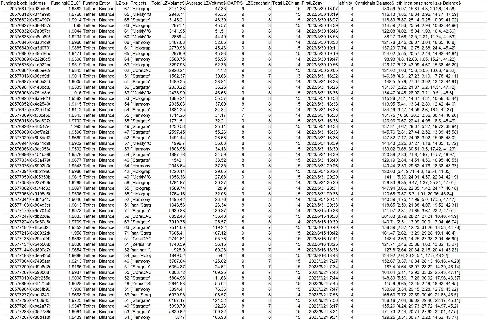
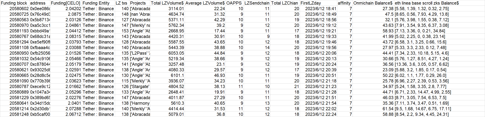
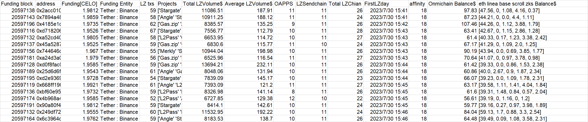
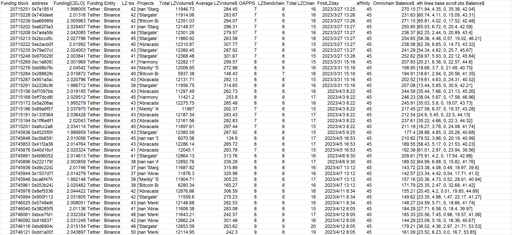
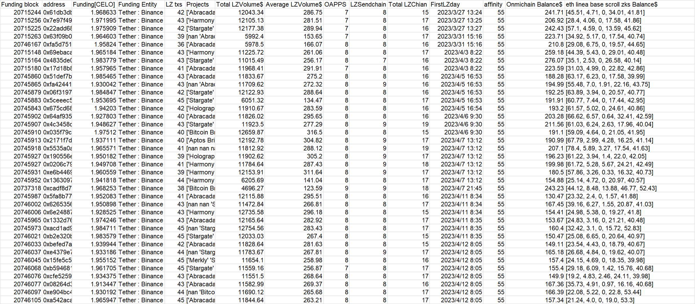
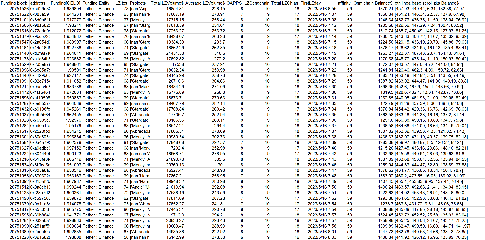
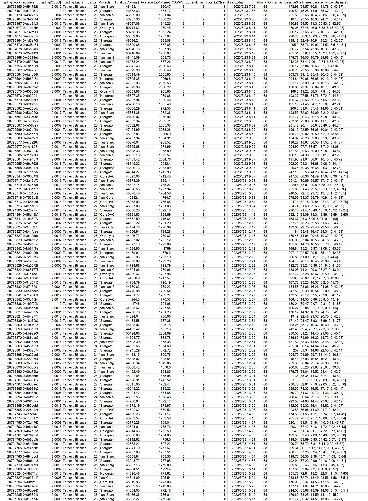

**batch2-1**
```
0xab9ff64e18a7c4ccffbdbb2bb002acb05b7cdd90
0x9d1d685c7adc61d2592d7e74bce66d3a9deb12a4
0x0dc32612a705bed3f1e63e89e1100a6af7a7042d
0xaead2879ef02496b7c4659d5d4c8a8618da200b3
0x98187c38fe1d37a9bd995f52c6d3dcdad0c017c9
0xf31451a88f2d567b83293818e646583eef3951d2
0xe552b362b2af6406356a5fcf8104ea81ad2d1c97
0xd27fc6f271427839cb842796cdcd8d6eb7a2a76c
0xb9fdc0b342366d1d43182f313fe2707613c0769f
0x3b956b531f78b027fb7cd304bdad8e803466be6a
0x145d06600e7832b94065b3742063b9701eb69260
0x6499cd9a4865411636f80a9d128bfd614f5cb4a0
0xb2e04d07d9aa9b227aae71e699a1eafb44a3dd81
0xf7b06aaa125c29cf46dfd868310214eded26411a
0x37a1c9b5737680328ba7a1fd9a235ea5610806de
0x3181bd455cb61ece0879852a0cfdc8abcda3e870
0xae4442c3decb6f52e9fd9edc9121a6d3be46542d
0xd3729e530234af5399ce4283a8faf352ad764b5a
0x1d1c853d05a0fda5524c86ff52343c8653e986c8
0xe06370c3dbda9679271202393d90d7a8c8888c4b
0x462b9d8b098b8562843ee1ff62c2e6cdfc5a9a5e
0x9786520b33d5916c2b91d3a45f191033b8b48220
0xd1a63e20708d6e853ab1777f7f7b321608f1a139
0x8e96bdd08209c0ef3c5af9692d29aa24a6878ac2
0x3007a2f57932580e79d5fbe603ac71b050d5676b
0xe3339f256e48efcad9fc07e6668cbc2c2127ca4e
0xd15328737391baf50d0dd5af4aa27d72ed2dbaa2
0x97a633fc08053c7540d09686a52b68ac69d8eda6
```

**Extra evidence**

In addition to accepting CELO in batches on the CELO chain on July 18th. **This batch of addresses also accepted approximately 1.55CORE form 
0xcFE2B(unknown CEX)** at around 2023-07-13T16:27:46. Same fund allocation for Omnichain wallets. 

**Data at a glance**


---

**batch2-2**
```
0xe50ed5fc280d3cf1718123b82418f49e493a01d0
0xf89cf7634e51334323c66154c791151b283f7e4f
0xde5d2b46240065cacbd67e955984e09756a5b495
0x9f525b3dd1710c1f2985595d68e62a35c8383ed5
0xbc7d62c30b136d10636f6f3f5826b22cfbc8e140
0xa929af76b2b66669a8e32d90c5433b1ab13c1a8b
0x8229da5106c74783f60d8389983c9d43b6385791
0x4078150660efe40041b73d2eaa20d8b8dcd0dc52
0x3cba8f2cf698eea8775f343d54f894f4e432026b
0x7ef10c9df31978f29821bd9787cec35a0586b1d1
0xbeb7e9d7445d2f6568294e0fbb0679b90f362542
0x4a5bf4a7bd7666d87e27e13568e29593e534a109
0xd63ccfc032ff1af19fbad0d4830da21d83d97d85
0xc85288dd1609cdf910182988cf64aabb1a2846c9
0x98305ebcbaa55310631ced99237aec44c9e616bb
0x2dfaf5d569efda1b8c3004fad9e2579c548f41f2
0x8421016e8f72b8704742badbae0cf812d4c60a4d
0x3ffe1ec4d019a893d881b146a5d4163f62904105
0xc4796bf4e9f278286bae7a3f531450cdf4ad28f0
0xcdcb6916e1402b93f555458844feb58f95a7af4a
0x4dc5d5e53d8e10d4204106d1519fdca47b512c06
0x63d4ef0addf25929bbaa0d753924b01cc7f549b4
0xdc1b5d6b5b050e7bf2484f45a516712135344a5a
0xfffbcc36c105a9a8814e53380a4db1882432e13e
0x5c673c9f89c1a896f19c277494f3691856f8ee2e
0x75b6cad0378af7e251de7198aa7a15065b54af0f
0xa50295b0be73806f9cb8140a70fa238499dd4eec
0x836798356e3f6e6d3d58dd2bb0b2adac4b558cc0
0x2757cf351d87f26fbe238161bb2f2a3935a2eaf2
0x45027b154f7548ec3fa5b400f713e8a95c84ef67
0x3b8aebdb587c81fa55947ad42fce8c11c2fe806f
0xd5cd27b1477656edba394199f1f9cf86f85787f9
0x8f2532b2873ce021b08b9d14b79e2f39dbb02b03
0xd5bade8220d2d3d0ead8e57d5d4bd658b3a37004
0x61648f756ecb1a63e6d3fcb748d0184f132015b7
0xa78cd3c29bb017aebd9ae87d112205103c5b4a1f
0x507e56957ea5bd1c0eca76182aaed2f533a18cff
0xf6803a841dd299143f6e99acba307f78b54a9b7b
0xe67f28fab0ce9e83c481b1169b40914f3534194e
0x918e4c1df523f9cc5ea52bbdfb0aa4a70442e413
0x9bfe986a5b4644ce785406a416a6ca999048d42b
0x5fd08729d5d7e93683d93adfa24ada2d3c901f7d

```

**Extra evidence**

In addition to accepting CELO in batches on the CELO chain on July 18th. **This batch of addresses also accepted exactly 0.001arbETH form 
OKX and then used testnet bridge** at around Feb-13-2024 11:27:45 AM +UTC. Same fund allocation for Omnichain wallets. 

**Data at a glance**


---

**batch2-3**
```
0x1bcbf2f443076346971c0fcdd03ac148a6689f7b
0xd582d3d861f3895bc6aafc3421771e699f170723
0x05f015c85fb4ff2cc7d85a2ccd9f7245b1643331
0xa6f2efbaa4f1843a5959be058649d57b78dd527f
0x02d381e585060399ca3269468c93068a94b36944
0x8d5b75cb8a7612eadd1c1d2cdf0d5c00486ee05c
0x58b3dbba622c02660862ebf9af785a474ff6cdf6
0xfae9a78bddc62ac526be05030f9ccf5ca5bbe124
0x9f7d21ca002906555e4e9b934db161ff19dd4dd5
0xcdb9ec6c1db0b66b23ccce9538974d32804ddccb
0xae23b6cc4ccee89f340f57de42b2ebeb8f367b07
0xd1278fd85988f67c910587a85c529c22b7a78a3e
0x8e7934e0b979cf40039c9ffd0cced194cf2bb311
0xe240bf10bd5791502cbf2008ca52cf5a96f41323
0x165821d910914cc266ef39da7bd74e9e3acd1ecd
0xbbbb8c00a3376e4793b6cebfaf785acb3757c240
0x25e308dfe27acd424f79bcac6ee87a7f32f8be5c
0xd6d6c4927768b5ed8f49ab9cb466589ce9ad128a
0x01d0091d1b0aec4a7bf24f83e8fa378ba599bb83

```

**Extra evidence**

In addition to accepting CELO in batches on the CELO chain on July 22th. **This batch of addresses also accepted approximately 1.55AVAX form 
Binance(genesis transaction)** at around 2023-07-13T16:27:46. Same fund allocation for Omnichain wallets. 

**Data at a glance**


---

**batch2-4**
```
0xc93c66c09efe0bfa216fe89df42552344e199862
0x466b3e70b7642a5a8a0c66bf0cf96c9f11bdc562
0xf96793f0caab56a60998836c5ddb16ed0aa0f38e
0x6c41cb09148c44edef237c7b3af3a8a36d1c8bb3
0x924e6b8374f9f5d4ff90ff441c13f08bb21b27fc
0x7f21988cbd339d62a69ca3162c973964886d98fd
0x52477f752d7d7f542cadf57dd72a7eae9e553db3
0x2718fa6e611a8a432e26fe270ff29f45fb0e5a6a
0xbafb348603bd3cc1f04825054ce37cabbd30974d
0x00ef7628c3be0f8dd5897dca0086004fc9907964
0x21c539d4c35b1d514d455d8f2f07cc4e5080308f
0x07d0631ea692d2f9df906e8cb52759a4a51d361b
0x48369d767a799461880449e8ad23cceb96e9e351
0x3cf417fa6debc362af314b35425eebe9b6ca9612
0xf7d52d0a27a7038bebb1f6c062135034197da853
0x346b4bbc012af5afa425fcde9a12007ba3729c90
0x3210a8bff2fa81216a92e3aad80a54d6711717fe
0xa97b3254f2bce342d7095a357c9f7af485dc9b1a
0xf93e750a87febcaa226b0879f597463b89f3ccd5
0x9661c97bcbfa63b4584b0a60c810e530e89364e2
0x6564cc168a0fc961f16e2c3d1bfa142c734dd024
0xecea961288a5488efc84c213a6c388bcbb9bd46a
0xb09f72cfac14c2bed151b4fd1a3e3b336dacb17d
0x5aefa314024c561ee1a71aec250945efa1b5d343
0x3b5ce1d8a0ffc010cb0d53488cd52f4e27777e89
0xb9b6499c2bcede1d751c64916526bc7e1015b229
0x0c0a012be99f9fb4bf02d2041c727e6381203e3e
0x259a134515ca7e0d357e3fcdd68e2b32a735e7dc
0xdced9bb13511f91e816d66b40006d8107ddb65f5
0xa55480af612e3192295f51e09e8f82d2e7a3c51d
0xf85da59ff89d4eb85e7c8195a027e362b9b88577
0x3245d82a1ffe4b8f3015161499cf4d4308032dc3
0x648b33d8bb1aa5f03029b3b15cd379696f1ae71e
0xe0482810a331c12d27120e002cf21b8f3ef26958

```

**Extra evidence**

In addition to accepting exactly 1.999CELO in batches on the CELO chain on July 19th. **This batch of addresses also accepted exactly 1.999CELO 
biance** at around Jun-04-2023 11:15:40 AM +UTC. Same fund allocation for Omnichain wallets. 

**Data at a glance**


---

**batch2-5**
```
0x3821516a913faf3b5ea62d646fa7826a20d48689
0x4fadecae3cde7d0ba38f8c4ce69b01f927f9ef31
0x36c5f128f47121e9b72a18d01ff868e1a27fd831
0xf3825707b596fd211a2b152a48f6ad7bc2af6f6c
0x42207baccf14911aaaeccb0d7d4d370f4ef62c23
0xe50ad5a0a44ad719583a5aa41145b143ab60de93
0x18a0b6c9d523b50815cbbf6a6f96cb388d479b52
0xa7d77b57c99d57fc6c60e76efe63144379dd3817
0x7b5cd497756f20e8a2b6ca5c1c797ed04c5827f1
0xe4a1fb36f7ace90fa5dc17beb939334b7ccf3cd3
0xcc2df34234bae3ec329cd1bc1e748e7a14f9b95d
0xbb9b3ee10cf39b1f0b33c3fe2ef2ab014a2bb3c1
0x252092e45a4aa145e61187464e270ee409b37d3b
0xedf59bf2556d67a6f99e26d71a3c0f4dcb58718d
0xccc8e507cfc6a6ddd723688c08d52a6d182ff656
0xa41304c0ea8bece61205dc5442e3d3d36cb1a4b2
0x4b9e7c9880fb298b6df47b09cc23b2c0e144c563
0xca9d92c7f877b516958ada4b1dc10e770d2ffb0c
0x611bbfb269e16ac8d2404ed553a652cf21155495
0xc59fdba78ead66d9415b99bc9192ad93e0e252b2
0x498f111eb8afae7b2669195571e4a4f5a9a0ec44
0x3a0b0c18e247ace41f15893c81a7690045fbfe11
0x7582b7f9d4760cd2cbe09bbab4ddb13658f8e43f
0x47841ca054f96f4482664d9e91595d1507dac8e0
0x09286973dcde73d51805af9ada7b05831b2495dd
0x57abbe6f79d0f6c148bddc7eea06ccb29203df5a
0xbde00543bcbaeb9f47c7a33809da4fd74daa1e22
0x63d77753a2e575ed2112932cfc1db962116cc7d4
0xcaf269923b99ec68226d35f44bd444c0ea32c26c
0x5f54737c55bafb3386e764895caa7dd0be5cec67
0x3b7fb59a6163353a4cca5567a1c80551a6ee847f
0x42e613214a1effea372d5fa605bdae239e66996b
0x9fffd4bf20924271c65d392e848ae8eeaf49e295
0xa1ca7093bbd06cf340ff7a2c13f315f4544c5da6
0x56671aaef76021179a85fcb5ad8ec3f1f9a547a1
0x1a39a2a3523ab0a31d7b9a643dfcfcac7afd047c

```

**Extra evidence**

In addition to accepting CELO in batches on the CELO chain on July 25th. **This batch of addresses also accepted exactly 79.9MATIC and 100arbUSDT form biance** at around Jun-09-2023 08:06:37 PM +UTC. Same fund allocation for Omnichain wallets. 

**Data at a glance**


---

**batch2-6**
```
0x17eb199699e2035db69a03dfdd0be96955effee2
0x54ea867bbe3cc895e6d2685a33b2fc470921d9d2
0x24d5ad3ac38f7d33613b2cabbebc0c5d38ff767d
0xf2e3d55e64e573b9da18f34e990b7ba0a59bb406
0x431d91e1891cb7e472cc6c15fc23857c124c113b
0x6e8397a20e56192972125d37a37b009c164f0610
0x666ef2e35678440266b7e528d88bac015dfb005d
0xd64cd5d3e8dfc15756d64e7a5bb2de1c4cf9fa18
0xd9d199a354c556e2d12192531d8e32da8cbb7047
0x0c9697e42705f5996e7159e4a4d5ef7e4043c6fd
0x8ca8c0b1eec1456755724337fd7d2725dcf29d0c
0xb25d2d852e2b4c073cc8be5dcb4fc605e64986c4
0xe275578d2da7887fb0ff4b31400220725a655f2c
0x4f0def0773aa0b39e096feb1f17e94002fcc1fa2
0x648c73be3655fb34d6486ef15ce20968f37b196d
0x53787877d6f23ae12cb865bf391a8e4cbdf13ea8
0x2d1b0445a852e3a851c7379f2e5549d38f58bc8d
0x0c1a3c409380197feb738bbada84fc9beeea937a
0x7ff803d3bb7cf1ac103d0704deb05434eb3cf920
0x3c9effe2cf5436649a069bfa1d416b7e289895ad
0xd8fad4adf3f00d003353cbe8d8022ccf221b8ca6
0x3d4ea6c55823d7da4b3303adc1d79938de1e013a
0x76ffba8493c0e7968a9f2e3eb52fb238ab48614f
0x7073d7e1bab1541f74697d43a6cef128a299725c
0xc689d597415a4adb1cc2191fd05fc62d158e7093
0x32654a14c8f078a2190690b82017ff6cfac129eb
0xbab9d069502bb57d4f8fe1baffada026cffe7d88
0xaf33e197f34802be593c78aa4ba4b96ae4bf67cd
0x809b7f58fb2d1b4410fca24a8c6974c93b1a1106
0x45b57529cbd490685781f112edf990291b6f2152
0x561a0683bf56235e851b60a123253f9609696edc
0x061f8e7f58f21690e9a4f46b1779a42552df10f8
0x6e7b8eb267beaca74e65a04b7e9ef165e85f1542
0x3d08a9bf3a421008387f6d9ce621dbc0c637bfa5
0x7d02a7796976ac27d407353198755fb54dc80685
0xd3033eec0da1eeea8d60dd4a1fd96808d6261aa3
0x66e9cee2531c87f18bc830eba47ca2c7a9f7b311
0xe2cb20c5b33856704e092a8a955b93e34f726a60
0xe68411757f9ecf99b7ee63e667bed7ad040a79f1
0xa9ff20faa4db3141f695a93215ab75ff1f26243f
0x6e97479ae11198c8d1b81be4cb242aa19e5be125

```

**Extra evidence**

In addition to accepting CELO in batches on the CELO chain on July 25th. **This batch of addresses also accepted approximately 1.55CORE form 
0xcFE2B(unknown CEX)** at around 2023-07-13T16:27:46. Same fund allocation for Omnichain wallets. 

**Data at a glance**


---

**batch2-7**
```
0xd3bd0616f2f71f494c616c6c911697d7b046492b
0x374e995f5357b5cdad07ac8537bd5e308aed50d9
0x524997d5fa95428c942cae816e11a2951b062397
0x366437cc0e56c77f16d8f862bcb62f7390c58b7e
0x7a087ce60358453b87446f57bc04b32a9aecc2e0
0xc6cb698614b6331d7b24f598646b13a05a5d6ffd
0x8a81d905e014e35589c6cbadd529e27ef68b1630
0xa3d070387b30382a2ed86e0a84627f9d1039308e
0x49a16aa4bf17da10deca481d826cdb6ece7ddcbf
0x222f6c55ce1e0b458a92dc935cceab4b66dc8eed
0x1d022ba0762d8b10783677e7f7d0c45aae142648
0x965ee2deec51b15f6f9a7217da1ff3f8c7a01199
0x36ed9d161cb4387a2620e458646ba72c048ea027
0x500c34be8de499b756146296d5cd7c6cd87de70b
0x1e8bd82b7f399e4ad576f4cb39003b093125be45
0x751a8a5b62a98f8945e637d319845378253ac9d0
0x6ab4d16c3a078b6aabdbdee16197e7afb9f779c9
0x4e2540662231f0bcca4f039c1babff6f4a1b4773
0x22011b33c028f59ba4663c488781472d4ca84e35
0xf38ce662f474ca0c1691e109f0ad3e62b6699dfa
0x6ca827ac778d9ca39ba610e027bbc651b89587f9
0x4ff517ed833fb38b1b5648d0960e247149fc0f96
0x3cf7a2f385e6ab282ad64badf2fd9f8e25d15e1c
0x8b8aaf246cbf9cc02afaa5a02f7858cbec95e959
0x9211d9b1ed3674353fe527be2019312bb1e923af
0x0ec35641cab5e0f69725687e019f4b77ec19d02a
0x151b89b8024528b20e8795dab025fed968e15f71
0x53a47963419bc23afb8d1b64d51e3c1feaa53b46
0x8992b0ea69d0e4fc5c8a736fb7ddf696c5b3f7e8
0xfbb19a02c9192f250d8bd95ca0f817e03aebd004
0xf05359b35fa789fe7d4b4c570748d1acef75c005
0x237429ed7bdc6d417506e7c57220dd65852abff9
0xf344c8314524d6adc69bf99a64d466eb8244ec03
0x9195e86ffa5191097297eac68042917a2fd6529e
0x3b1a41ad109eec7b7c842eb91ab380c2e42b5522
0x864c3ef1f4e42ce6f9a60500482a59509c9a86b6
0x9e701e2a56c534f7c3b576f54eae0813c72dae21
0xdb230ea606bcef961303165521d14b716301cc1b
0x6d60e8ca453a60f6526a03f63d029ea4eee6cab1
0xfffad323ef1f2100202cd889dd7b435717447054
0x20932dd8afc98f81508648f87f4cbc4ec4fea732
0x29caff473deb933b641e7f03f80f9ca44c29b7e9
0x54b5682e830e6511b088f193ee0343526591b045
0xd800c7eddee2a640f0c01a6e945069beeeff4e35
0x3ea42b80f17884560640c467706ee240ed786598
0x7495aef94b50ddbb96cc4a3759c7170bb8b92ad5
0xd9e8d2a8adea15677867c954bcf4dace8e7f3bdb
0xb9006875db254b06ec8c492afeed9798a6147ca2
0x2fe255adcade5ff65aa459da210fa80ac6fea373
0x4f172e9a12343d8289e6c7fec3536885bed7fd7d
0x0c5fb992b1015427f2464bf8da54ba53aff5ee47
0xaad2431ca203ce591978a4ff7282c29712ff481c
0x1669ff5e6c78ebdac92b84b957adeb5277fe2f27
0xbc2a779ba766a0e3f121617520a83172021f0802
0x352736de54045a5f2a935145f6882c05056b5375
0x88d4a8ff428cb31655abb54cdb8ec2d24e0d7588

```

**Extra evidence**

In addition to accepting CELO in batches on the CELO chain on July 28th. **This batch of addresses also accepted approximately 1.22CORE form 
0xcFE2B(unknown CEX) and then used zkBridge to mint NFT** at around 2023-07-28T12:24:32. Same fund allocation for Omnichain wallets. 

**Data at a glance**


---

**batch2-8**
```
0x0ee086d7a888cf70ce7206e2ba6a9e486f45e865
0x76c49d37c1730e2d60aad6b3071bc7f446f66e0a
0x5b8713476c98657e9fdc8416285f20f81ecd0344
0xa5c3cc16b8f3e147b63615bb753a749af99356c4
0xbbd49a10e1ac22e57a00104071f68ff7dc03e2fc
0x68dc31a79093a8a90955bff822f996addb9ca899
0xe5ef90fb621ee3a57d2a84dae429721d24bbcb1c
0xfbaaa4cc1d394353c5c15c40a395457f00e2e248
0xfb250561792df1c3df908b077697af4f426a61e5
0x54c91068e3ff251777c4a6d7fe04a07ba0c5944a
0xc8780441eb308b327e07d9c0f41aecd3d9cae784
0x93025d88c3a99c11cc28d249eb1b097e06356ca9
0x28d8c5e3802339cc3ba114e8f617cbd0bc59666d
0x770b39820585ff372704235e924b5bd912dd5b1c
0xece9c1275bb1eeccbd4c1328b4e24c262ff64fe5
0x1047a341aee866d792b6c14fc337b93a4e61167c
0x389bd6575d14816715800dbac8935fa536826c38
0x34d15dccfc67e0099d73471ea3e867e882477860
0x2d30db1d72cb969c08f233bc96d224ced0974f6c
0xb5caf0092c1f97a37feb69703f5cce02edf408da

```

**Extra evidence**

In addition to accepting CELO in batches on the CELO chain on July 29th. **This batch of addresses also accepted approximately 2.2CELO form 
binance(genesis transaction)** at around Jun-12-2023 06:18:01 AM +UTC. Same fund allocation for Omnichain wallets. 

**Data at a glance**


---

**batch2-9**
```
0x2acc010bafe24a10c40ddee05f1164e71012fdc9
0x7894a48a74c11335b89f904473ba861a16e5c557
0x4185e1d9801d2cb076f8f275b5626484de759b55
0xd71820694742331cc0371b9080cce54694958bba
0xa52cd408a5f63c5ff1e1b2306629a32b28f49d68
0x45a528759333163ac5c95958bc2d1ead2dcbf4e7
0x744646c89f8a4c7b6ce4baa767184891422d4003
0xa24d3a01cb62a908e481693f5350592f4af99266
0xd0f8fac021a7cbde3de4812129ed39232e8dd208
0x25d6d6fb086ebca04de9f9ababc530d5f1995419
0xd2e9369517a45a7f4e1b8af9df5eb52c645c9330
0x668ff19020b1ab8482f0d79504f7af19f6132ed6
0xbf60e95949cf36027e98831d428e00dbfda37c8b
0x4b968a406223f99b9e2405f1b021ff8a3fe4434d
0x90a80f4f0797ee1179e36322d8b1eae617059492
0x249df7278c542d7f415d2683d8c06dcd7da046e5
0x6c3964c3c3f441bd1095476e3b20a484382ab1fa

```

**Extra evidence**

In addition to accepting CELO in batches on the CELO chain on July 30th. **This batch of addresses also accepted approximately 0.175AVAX form 
OKX** at around Jul-29-2023 5:34:40 PM +UTC. Same fund allocation for Omnichain wallets. 

**Data at a glance**


---

**batch2-10**
```
0x7a19516a4181f1032cc200fb8afcb62b715f26e8
0x740deeb16bf357945aba7e539737c3ec6fd27f9d
0xa6698fd39971696168e4b00942159975d77cd59d
0xa62f3a341ce91d8af09bfbd2c3d64552deb44813
0x7a4a58df892ea2c4120226a566fff9c3a8877421
0x2bccdfcd5dd3acb0c95fc5ebb88d1ff68452479f
0xe2acb0fa9eb82892876149b62e236423147081db
0x79e07c04ae8566ee2e6ac445115b50e4c4c1cf1c
0x97002959dfb4f38e9bd2b85398b0f55eef3ae303
0xc1a60937a4986ecc3e98732c6b254b3800e564c9
0xb98b76dee4a77fc0e75e16e96a837c61552e2695
0x288628c99c9688b3851c2e39f4d94ff90122c1e1
0x951a5a72c0b4d80587536b543b93f977335ad8fa
0x2226c9ba25d86a84b9145e4d235118a8134983a2
0xf7097bb963ff862b9e5187229efdaf6163b4079a
0xff7dcd85cb8dbdd39eb45e8c35ed203dfe3eec7b
0x5a206aa5048f90c51b9bda0d11f3ce0258f30b69
0x89a9f5705adfdcfc121cb699634de928cd99cc72
0x133f36441968a5030f40d513764042b832a69250
0x1ff6e8f1cfecbcf15964c606017d565396aae65e
0xafcc2a8e3b2e20454d2b908866afb793ea061dc6
0x4525f0f4cc577353b1e0b8f904eb02e8fc084498
0xc0b6591639bc78ab845b23bd0fcf65bd6252a816
0x41f2a36665eec990b71c9f9584914e51c6e6180b
0x40d16cf81aa7374dd727b6f2450c11b000b571b6
0xfd96052f020a07506ebb0d40d3b233ba317f8c36
0x222179503b1b6a9ea66b201a6b34387c1e29f6c1
0xd9c22d257453ae09337e07b0ef8d9cca9ab289e3
0x1557d75e35aad6aa2a03371889126651b25690bd
0xca6f47f4cdabb07ef60732747e85b555d2e7f95b
0x053b2424c463b548d2af736d0039f1900dc42806
0x8ef55366df300effbb5b2c19e1bf6b46e6b4f6b2
0x900f1127fea1a3eef4cd43b29c3362781b5076c3
0x5749e90aa67814d362dd09d9a54e8bdf6cd4c0a8
0x38285f5bafedfc2a62797ac14b1a90c214327e7a
0xbce7fd1ef59867d995317dfde7745a1a09398f3d
0x9168371a3471d7a5d3aea6c6a9c26a5e79246a7f
0xbd6904d6b3abfe95538a5272ec55685fd6f73fdb
0xdd1a005a422951e59d699c14c50add41a1e25e57
0x61db3db21dc4b34ad7798824aa1998326881ce0c
0x7e97f49e47c1c02a793fc8b91fe5a21bb4daf9af
0x22add68d9ab849feff91b29f94fedc313dc0c445
0x63f09b06a5be643923764e537a70169d683e9138
0xfa5d7511d93231dcb422cad4cc42b1f95839f391
0x69ebaca5bf6dd26fc008cec458de50f271b7f313
0x4835de0775d100f9ff82a49292ebd1426a5b894c
0x17d18b8463d1f011e7ca35944785e863b222203b
0x51def7b66948b82744d5f3fa4e016e260d843237
0xfa42441e1792b94d21ba2dc40752b72737634294
0x06f3197f102efa1d7d0c7f2a7b7f52b3ee63489d
0x5ceeec5d44689f13d5f24e36f967af81535324c5
0x675cd6811edc0134a8c963aa086bc56042964862
0x64af9350ed7645bda6135c8be163cfca0d189345
0x4c3458d9bd5806d1016c078fb2a8e6ca23dcacc3
0x035f79c78ec9059db0253746a609a434fdd073d2
0x2171f7d06d31c70f7bf787024615cb2702b012b0
0x5535a0a02830ffcc7632a8a5e8efdda40cb71ced
0x190556eadc6894078c0a6a872ab7a802dd6f4c76
0x0206c79f10a15ff8eac6cc353e9163a1ff6b3a08
0xe6b4469fa7f42cc914b6f62e661fa5db516638de
0x13630973ad02238825361462aa6c8ab94c351eb9
0xcadf8d770eaf42c8f59fb82b3f69130779516783
0x5fa8b77c57fa4f0e1e690fef4b8fc24c5dfc65b5
0x62653566513979e2e8357df0cc34f0aad781c917
0x6e24887a0a650f2447e85cfc50e1dfb19cb408d2
0x1332d7626704aac40c65edac942e0816c59ab0c2
0xacd1ad9c9665741b35c367927befee383d9f1782
0xb2e320bc70f7aab3a0895fab0f2bf347eef33f8e
0xbefed7a79470214ead85b1945ec31a07d650fa18
0xe4379e7e8780175ed57184a7c94174bf2534115b
0x15fe5c59ddf872228e60c2d6cab7ca62d10c7a09
0xb59468188030c6890bef34da7cf2b865553e2f1d
0xcfe52592143be9ad690b1cc8933d950902121409
0x08264d36b7b836082c098a3a6681a8e09b0e6372
0xe904bc47d7b0871daa6dd2d6e996dd5f04f7838a
0xa542acaf28950d2910fefb1e0ef86dc3d17f1397


```

**Extra evidence**

In addition to accepting CELO in batches on the CELO chain on Aug 5th. **This batch of addresses also accepted approximately 0.55CORE form 
0xcFE2B(unknown CEX)** at around 2023-07-09T12:45:06. Same fund allocation for Omnichain wallets. 

**Data at a glance**



---

**batch2-11**
```
0x5d29e30a05ec386d801d3cc8b02f77e977403cc5
0x083a5940d631042db45eea3e34c5350c9c5291ee
0x8d0a61f94eb3ee8269aadc88f05989c4e48df323
0x98a582d26eb1dfd62ebac411f2fcc7b737035d99
0x72ede0c45da694cd94e5859a273935b8423a9e02
0x9bc52258084547a980655cd47e154d1756fa4878
0x2a054d369df3283f5012ede8899f7903e3c6aa73
0x14a16d64650fc53ccd312b010487624a83d0841f
0xd2f9a7f8debdc38a87c6ed0787c671a588fbbb7d
0xa1c84b5ab122bfae7e5f6810a3d64d8cc9151c62
0x2d3e679942cb1033afcddab91ff1753cb5992ded
0x6e85a7d5dfa3fe90fa345721f1ef4b2baf874d9c
0xc429b6c835a03dea8277cea56d19b7b5822b642f
0x02e715470b4c4f3547f6d07708724162d6192b97
0x0a5c4d6c837362cba10e65fbaf83e6f09aad0acc
0xf4a6464d66a9041652e8b3b96eeee7d89c904f13
0xaf195988ccf6e1cec9c621a50e949b0014af0d7b
0x5e853746c340988be866ded2b3b1dd43c96fa164
0xb9198fe9ea91771e15a21f98b1b672e8d876e745
0xafb5564734c62e74a3f906f9193e2af87e7468d7
0x76505c09f85a2a6158cdea53ae71b6d9b9411923
0xbd0b1fe46283ae85198a658b988531a2d930397d
0x2520fbd0b029d9b4a81af3cc50940ecc82ef93e8
0x30c503a4f7417503535d9157627c934f789a824a
0x0a4a795eb7954440fed609d88795fa67ef942621
0xa9adbe9a8ee4241c2b08e6210ecf48049a717ea4
0x804440f8860deac20799839da9e4012c4cc02c63
0x513fe8f46feec9fc74a1ae91071731e10d23583b
0x6fffce6a95a700e3bdda302e225e25a5f6a65d11
0x8d3a8a2a0b2b4a22e1352e054631aef7c5ca486a
0x570322a3cf7e97f2c1adf21c1a0ad73c9a093a79
0x615af2bbbcaef05e7fc84efdff18c117097b7a34
0x0a8cb1085e5936800ef93247d9747e707bb85dc4
0xf28a7d26d9047a9542e7f0586e1496213b50a724
0xc597500a395d8be5889bb7ae895acba3155daf95
0x0a11e8cef3a51f1c2ac1b597196f3929672ac270
0xa5fcf337f81518a1c47202a47881c0955d91026c
0x89b88409013daef930ea14ee84060ff5c5422255
0x032aba1027c46170aacf2a926c5ac1aae6d3d071
0x251aff5509513bb83aff34e7d8f82da6134721e0
0x2ceef0c80ad276148399e95610abb295f89f234a
0x89168286c8072878c42f7f79d626f0b5b61193ea
0xa6627497ee9df12648058ec8d3584ddbfdcea896
0xd6ed3d391cfaac022e54d9d5a840648bc38c964a
0x0638d22b1492f97f343a080efe388146e53f99c4
0xc1bca703bfb897d015c608c28f8fc5604ddb76c7
0x4cb0f3374723096f862178406cf0e96c461d3348
0x10239eab2504936cc9aa6793803532e3f3804dab
0x48a99c9441e4b7cc7966b3f7c84ddbf4ffa56f11
0x6d23dbe6fb133f55211964c5208208a0ea37c4f4
0xde0c750183481f949246a584be72cbe18bdaaab1
0xce19d42112653c543921a1121ad81476f9fe65df
0xb41d37d5d9c2bf66c16cf43ee3bb3b1b010c8cb8
0x602d146e3ace77ce95af6c84473f9eb881195255
0x8a9d9f8ccd967a1c1694d2594520dadc282a1dac
0x821d68176338c0bdb2e9541ed5063b958335be53
0xfc2b3d890f86cf431f7f8b1d03c3d03748dbe7f3
0x4831a62fd0d939a0ff828f503cafb4e310f67a35
0x61100479a3794c12db9d2e1d4043432e7a4eebe8
0xddf0d356e643d505fa5a60363ecbec92f4bcd828
0x3e4ea8e367bd1e5b7bbb3003f23d80380e6fa63c
0x419453642dfa1988defb9f10a07e80bacf595e21
0xb1aa2de81e7b6ff84563e02a2eeb86787b55e41c
0x79e45d0a4647b5197666d9ea573191f4c80b67da
0xc121b27ddaa0344ab8f681acbf0bd63c1cdc3cbb
0x9b322c3627eb2dc61b81676216d0ba0c4935006d
0x3c7b6bd4c2f51fda2d04c0399e30b86904fceda6
0x9e8d39c4b6df990f2447494092496e53bdc9092e
0xbf7d77855275a65081497d9c7e6a694e8ff8d955
0x561706a7a0ee224d1b81a49a35ef41e488e9391f

```

**Extra evidence**

In addition to accepting CELO in batches on the CELO chain on Aug 8th. **This batch of addresses also accepted approximately 10FTM, 3.5MATIC form 
binance** at around May-15-2023 07:42:07 PM +UTC. Same fund allocation for Omnichain wallets. 

**Data at a glance**



---

**batch2-12**
```
0x59476265a7e3773f219ea7da359b341f105a1fdd
0xd7c2519e0eef0dfc3809cefd3b2340d00d029197
0x4927d2ac4964f39d6e3d8289edca4ca3eac0214f
0x7fe0344fde93d27b31dab4ab97d943a032b90bec
0xacd8fb3b983c4fb6e0a56a811edd84a756b0144b
0x11d1cbaa9f4e095d2b428520ce4ce360c669961f
0x232fe119ee3e6e0027ad81b69923620063137842
0xe4de51dc48caf21009ee1ae211742ee06c48c9cb
0x1d3e706cd022d7a9db4619ca334c778cb8eea815
0xa3f5b64429579742eb5b152959037346fee76962
0x86b940c8c6dd6c9dc78d78d1d9b27528cf0fa2a2
0x35e4428b2458709e501827db64e185bda3a1e085
0xc3314ebc2e0b28a282f06573b73b25d91bec0d16
0x35208ae592ea2eecb1b6f67769a61d2c8df2e48a
0x18ed38b289d6feff412576ada186b9c338df0c14
0x394a3c352b547bda4a2b1e9ecc951021c4f23406
0xda4d6607687effa7c58838b3cb462210fe7f8e34
0x5b6f47efa314adb69c4434cd997e45736d3efbdb
0x076696d4702a5cef5ef75a428ea941f3377cb572
0xa62c3a18e1aa78dda645087d68ec7da99e282108
0x656b5db4b15b448a7ce6d5d789b4f2641d3e789f
0x6a320112ff2dcb74f77af5826cdab6d732047cf1
0x82017650a19adc268dca591459713f56ace6612c
0xf038fbb849181b0f1bf4121e625bccadfcb72396
0xee20bda927c710e483a923ad9fd728a01dcce8ed
0x53b200a7f152e1babd77c4434695a3a8ac290d54
0x333c095811b528416e644abba51a1ac0a24e648f
0xc5060c2690abfa76c0cf55ead9d135ff96f290df
0xfe56b9a83adfb807ef736ec4e87c6492e6430b7a
0x3a3bf1dd58e1ac01021b2fd1318ffde07fa3fa29
0x36a55769152ba23fcdea6a7d2ea23ae290137d6c
0xabaff7f1781cf315ee5db8491e7515df12da7dc4
0xecd928c0da7fc8cd2d007f3383c384ee68d2c05b
0xffd1627ebecd41d1599d879f37bac3fc5b1e6a45
0x487224372abd7616c576b88bd2dc34fe5d303340
0x31d7766eb77aaa9db7a61847d1468a9f1e1c71f7
0xa494b70074eaf5011c4f837216f43f0201db3240
0x6bc7526fbd4aca8e24a93a868b5c2d77ebee6ae7
0x89b242e7d83444ecd546802238ff14ae56d4c5d9
0x27eddaa38040e81484acbc7984eb1d5c23aa612c
0x360b49bc443e481661dfda83711e9968b7ae9231
0x2a49e72311feffb4fd1ddf70078d9ad2d7bd7fec
0x1525dae9ab8939caeee43398d12a81f7ada65e47
0x633eb513a972547149ce48642271c75be9adf835
0x17d15ca77d0ce89c63941d17535fd7035d975a27
0x7539d8562a709a69991f21592d12ace6060e9730
0xf429cddad6737ec58dc6313d03bb2c3154d64585
0x8cad0704899b543c61bf319ec20cf9897c770285
0x42577fc5eca3549191f9b92729911f3d548d80b5
0x96d48b75453358bde503c185e58346495eb60b43
0x1de62731929132584d285f612ec99c14ca6c9c5e
0x24e9c45aa10cb036a3d2ef0c2de3810c4fbb2944
0x3c6527c4c75a35f22a82db663add069452cd6ac0
0xb41fdee5def144589ff8f6d1882c820f961bc09a
0x8ca9deec50510849e8c1d364dd52b2c7e7d086c4
0xad45f6c112fe38806006cd9b47c3416d6a4d8f9f
0xf45286d9cfb974d181f0ecfd2f3d5e87054235a8
0xbb61f1e1451f7b03ad0625c0602eeb9237bbee97
0xee0496df598ccd8ff827b4776dc1af2507480912
0x2219594ee0e4513148b95bfdaae134964c2914d8
0xa1abfac650b9fac419f91f49643986851efd413d
0xda5872bd74612d6d072f601900731fc01cde0b54
0x0c31775da80f41ebb819fe23b1b78f80fcf86784
0x47c1ee693b69ea1f0b9136ee01e59ec8188f04fc
0x3c48b46c0df0ce0f6c0b4c232c1a6912b83cce05
0x91d871214035a49be132b48f6a07ada06e4898b7
0x87152911620b8b519d3077189e45ed493f59b254
0x5c4deca93129352ef580b4465bd60384ad4336dc
0x71a8416d7fee6ccfb83c61dc524bf7002ead0b2c
0x93c45b4f93b4a5419c9e82ecdbeda66ea8eba2d0
0x1b9f00b0d4fea2fc65707436feb16d1fa3637385
0x005ab46ac7786c0c57127f907c399f467ad0361b
0xaa23e740bb0e1d2a98c83d6150a15f93fd31881e
0xdb4a777f24d779af9e4a328e761758b5da44c76b
0x18a70a2d1f402f226adcc6c029b96d44d913ab88
0x19f0a9ef1d8c41b30190a2148326e26eae27196d
0xd36b32b16fe5525e24fcdf4a6ce0d09ba4f9336c
0xbb9a90851f0a620c6e4c1904f03942a48a140751
0x886acc7e8d90a3128bf311b95dc81c3cdbe24ffc
0xa01bb3d7f48a85ab2155b9ea20a1bce358b346ca
0x455152f136450f162f2e9edbca748778146fc619
0x4382b74883132a7c98ab8ca06c23201d71b04fdb
0xea20ce969fa1c9ab0a62f585198decc660a0d644
0x222070c53954ff15b66e637db7c268c3c6c28ef1
0x3b8588a05d93e78c3c760b3a1a7a29bb3499c188
0x5bd00cac6d3bf628b619bfa33ee8e1369dccf5cd
0x0ba79bdaf875c447779f10c3b13de1969feaea50
0x898cbb8e42a02580ac6cd90318f3c0d97d69d0a6
0xa68815af8fa81aca2b532ff09e921c374a97af7b
0xa9dcaede357b6b3c0d53be1bf804740817b876b8
0x8e983e289ca1a217a74b110e0a0bf473a0a17a7b
0xa9d6c91b3a3db34555c46e7797d0900de04ab608
0xdbfd13e238285a56dada4d07f9a07a1b7cfdfd6a
0x00f1b7ad9871c38d57ac35d629bc0f85062be2ec
0x393ccfd02407e8017e13ad5544caaa341f2d7cb2
0x228d42a9b62837d1d651823bee1b832283161833
0xccceb48ddfcfac9a57d2c1cb9f94a859f0f4c4d6
0x112b473b27f6a3b3ca473800adab676b18909b6a
0x72d4762d7effd04db607cafb03950d37e57c67ef
0xbde11a75b4452e5e252bd462ead5d716d8cfed77
0x4b7f87a0a344c68d7f60a74571735561c0109fbf
0x82f98cd8d67cba2208efcd0cd5d5e6e376073c29
0xdb8dc3e353a4372f17f4f21a274af43127791829
0xc519bac0585b08cf80d83d9601ae926bfdad265b
0x3c4d38801607fc0bef9a3b1f839f8232991fa85d
0xd4cfa0ad7d49bc3dbd0d0c6bd16b56cdb264e02f
0x691bbcfed8ed064a66ce1445635ecb577ea7822e
0xdfe64a3f2b6e194e765d5152e6f8840203500cd7
0xae94e5053520ae6057f74084d7d5cd2570637128
0x190d6f0dd199a7038ab404a3be73def90d166c2b
0xf8b7f1d7c9262edf1a0b90ef0c0fbd034c846bd7
0xe927e17db6413f27f7abc48178359131a5a2782a
0x40fdf535c918d5234684e0abdc6eeff353bb445d
0x6fe62681b3e16e2396ac68fdef2893c29739f6c0
0xd6dced04a617bacfb7a520f9b04b20b3585b6111
0x0958918a442360aaa3d9ffeafe04f3728989b445
0xa1155422908bfe5fd4d91a75119d7ab60a9be6ff

```

**Extra evidence**

In addition to accepting CELO in batches on the CELO chain on Aug 10th. **This batch of addresses also accepted exactly 0.0487opETH form 
binance** at around May-17-2023 03:56:30 PM +UTC. Same fund allocation for Omnichain wallets. 

**Data at a glance**


