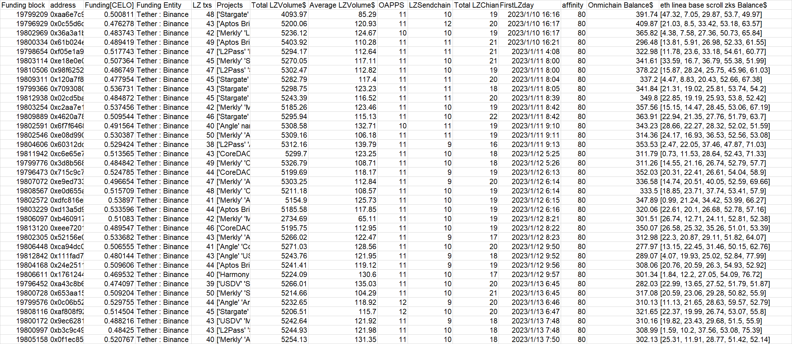

---
**batch3-1**
```
0x5c69352189fb0b9a9c6fe3672dd8d3b0eb2dd580
0xc08da47467ae95e7e6bf9a084e4b7db6b9e877e5
0x7681009dd08543eae7418e0d73afb45b86d5507b
0xff9a817067d4966a7273b293fa99d46545cf9ad0
0xd498735185b1b54c453c4d739bd6f9be0ba77f26
0x20565c97cd072bd082e72e540f1cc47d884e9485
0xb836e7c411a6e6b634344406cc1c4b09eada7f88
0xc384556b1110dbb2f77d8c51d64aaf9afc17d2b6
0xa35c66e83c47a2b4bd18c3bfa8ea4c6bd47eba0b
0xfc20c00de4f0e4dd3dcbb269b05707537f399905
0xdc4cc321ac28d7f39107dbf641eb395d2bda9be6
0xea06d0cddd0dfc36ba67bdf8674c5e77095ebe24
0x86d286148a6c3f84d5b62d82078a2ae76aefc724
0xf110e34d8de8322c0b7103339294fb46aa13e495
0x5cce099f029430164899770d9448660043b9ace8
0x94be1c9cf422b1acffb6c1678fa49636163638ee
0x4d0a6628333c3fa75fedd6d5552834b9a036cbc3
0x105fdb8ec6edf053f0afcd347d6031e2b2422790
0x8da50290f2007d6566edbf3ee7c6c523d067ae67
0x819dba321899e72976e945d2e7905dc9dd5116c6
0xfe37dec0ca3034f8eae27d90462c307dbf713f6b
0x8a86c542c3d1871642034d85a86c8b76ce808d33
0xb646c54cf8ec39b305e3e41e1cba404ae2411339
0x23d4b85e51ae02053f3b7cedfbbb12756dd58082
0x55d4f30d52e9539a9a822e797b7dc5e576acb2c9
0xb5153e5eec172a3c551428df440f288d0023f387
0x5a8213298cef609d0b9ff3469ef9c2242a5eef15
0xc22d131616c34d14eda1eef9d4702b082626d906
0xb8ab545d4d02c7fa8fadc67e66829327ffdeab2b
0x57c51b0cdefdd0678749074316203625bf579a37
0xe0eb7fde7b1b010f5dca0d555a83a2885e34aa4d
0xb7ff6535d069fc5ec2667fd83303e1d1a078ad58
0x8411e6a8c5d90c0f9dbf0daeaad7e4086ef5ba63
0x2fdaac3f63c966d499be39bdb904fd12fefe8b60
0x4c725589ce476e5ec1991ea7fa923ece1fb4c89c
0x1df3ba4a60eca95c404135808e53d055536c0062
0xd8aec71cc502435408cae75dc9fe499625d16129
0x5ed19e346b39b4f84e987eb21d1eff5c7a3b0fe8
0xdf5b8d9aa2d054365c2a85784220983f4d08a9a8
0x2ab48bf057c01cf35a0b5e14ccc651e3b085f13d
0xdba00bbacb5d0821b47a9c512a6f020b7f656bcb
0x182b8f31eee6458927846b3c1555f842a3412bd1
0xafb542438d9c7cceaae910478ae35ba61cb758e4
0xc9a5219add0b945eac14edb93f830dbb4f84a2de
0x08710394b0f9a4634dea6fdc319aa90e3a90cb4d
0x900c2e4630e28623e65d0467011573520fdacd6d
0x6e98ddec77c405dfdc0df78058f009688267b9df
0x98fc940f3662850fd5a79da766fea7509586e90c
0x8bbf382fa73fead46b28998910ef8e58d1c7aab6
0xa461c4d24729ff3cdc8f937eb42870ec4a254a39
0xa46768a2e79050d89f72861be478ddc0b9db4f7b
0x49d02c1da85601dc670bdbe534a84653af29d9d7
0x63ff8deab055e3bb312f054615f999a3d40dae17
0x61f5a57f05aaeb88f7887cdcd04a907a73885b6d
0x063ce9103cfbe8e3e083cb8610897331cf5d1105
0x130bb5cf8b335c1ad7a1e55ce2cf918189254907
0x9541d30438399c8d749da3cb9afda0cbabfe46f3
0xa076a5253fcf2671b036b2545a71c81f2edf5c39
0x63a69ab5c2502ca89bc7b01b940ac70640182648
0x7ada86d020bb79deb3cbeaf809ff823a4ca816a0
0x5be3ea2aadc2fa94c462005ab96ae783bac122a8
0xf483180d507465adbb1325408e96c888b6e05638
0x7db335909498f93b18341388603b2cdbe8b8ced7
0xcd97e39663493d3b642fbb474bbcac9286280a2f
0x4df57fbbc731568e149ea6fd7205cbe86e963a9a
0xe551883d134554e6e2e3e5e0ce7fe9b112013f11
0xfcd1ffa2b81b772429155a2ea4246cfc4ba76f62
0x80fd616a5dde63e7e852e708940a72a80c621e91
0x7f4206cdfda40e241f9dfe1fb6a1049ac0540a9f
0xfa567bed0cd073be17bdf20e4f0ad2514c07a933
0xa3a1204806e11f9fb58ed9d1250286949cc4ff2c
0x9001d9185cf250c6ea19f30619404afd226c021c
0x9515b41f555a2e02ed170616857fefe5804299bd
0x07d202c1052153715046a79a2f89c4ee685312b6
0xcadc90ca94303698867242f4a5a3ba17c4ca0376
0x1815ff0885bdccc0ff9784291046049d8ca38094
0xa0a9fe2ac4fc04cfff5bb74a6bf8fa80f328955a
0x50195ae29d780e8c8132af0295225da9cec0943b
0x2b0ee8b66f41bcf2dfbc10aacbcacd5cb0f9692d
0x9b0c426723f3b1dede69462b6bb2b601535e796c
0x52260c096e25ca9c2e2f16c3c42333091bcb48d8
0x6a23c56acdf42d387450e253e748e4a05a629b3e
0x7081fb3af7408f68524ef56590f05809b88b5df3
0x082e853de63f15f69ea0a4406eabac33af7f2ef9
0x009c498ff5ea9fef4629f275b99d43ce0d83a4b7
0x1e163ac58882af607c50ffc0a8d64c74f52c1b07
0x56a02aa1bd6e65a01d75c00ff3f1112453d2c525
0x6ef8492c58687f683f19663cc276ea92a5c84da5
0xa654717d5a4b938a9ca251674c5bbc31010bd80b
0xca95199b7685cb05e5edbf9fe4b632763d3ea6a3
0x64948a335c553ba058a492b602cc985ffc6d49da
0xa395046b56ea4633c6b0575cb93187e22cfab73e
0xaa29179278a077fe194436ba89550a0c9e6bf5c0
0x9c1f655701bb71aeab60f82b38c3ca9a6b69add2
0x6972995a4fcf3193c976e4db373c198f7bbae136
0x5c23a8a75a44d134f9557b44324609ad33a78e9d
0x96a825e00ba706e1fa1f22d82a804cc231943773
0xe75fa42dda2e0c0dff8e63edebd3a8ba2800cd54
0xbf2efc8a4b80d90f5d43955deb7ec1dd8052e376
0xdca12609d2dcee0d32ddd8bf6f4864281c672610
0xd3652b095d43830ef998f259632a46999e699ffb
0x258a754ffbc5768dca6fd4c8d10338d8e6c57462
0x800f4c501d32aad712bce5ade993163b95ffdc33
0x97e9b557132914cb736e8ee5caa5d1334a4693c9
0xc8a38595397496051a874ddc3f4d53780792369c
0xc0aaaaf60ee5b6f599b02c4fcdab1274c499508b
0x7b022c05fd5a279e1c2f72aafe917091d315f75f
0x7bdb1db1c949aa79a2208df45466c05937e010cc
0x981793df164674ad14c9a2b5d3bf9d3213595cd7
0xce9f03d30402c4ad44f54b00efe3b47469285c86
0x72170d242f387b2abdc23dfc96ac30eb7b4598a5
0xbf804e24ed2325eb7cd0bb61e1e90089b45423dd
0x335f0841e1a18c8f886d890723cc0b7133064a00
0xd9455c572a0522139e817c52a5676da79fd9657f
0x120c0b1e79d5fcd9d20bf9e4a4351d866f302788
0xa8a25542e251cd01b61a63498fd698a4ed5cfe3b
0x87c96045e61c191ae7a67efbfbd4ebb876e447b9
0x031579135e7bcd4ecab47ff8d7fe28174c04546e
0xd3fd575147ba56269e514d89acbc5fd0cbda4800
0xc0c09be6a1b806efab3fade636e6c3a8af2434ef
0xa580ef66ea37eed589f007f58211419aa37f1c52
0x2228286529151de655af9a25842c6b09733d59db
0x932e28365971a4a201cb1d536db53ef7da218f20
0xcc9449898437cf4dea477a5f48de680dcdf4d3f5
0xcd4e98a42aed813d9f8c3223e383f320490d6931
0xc8e5ca2821747eaca9001218abeab6c033d9b113
0x75eb2e295e53c7b371b03138fbad43191c3f5709
0x117fcd162054635953541a9aed1276e5a472018c
0x15551f74bcd5e7ab0cd4e80fe4fe82784d6e5933
0x883d81710fe8510a09e6114ec24726890e7ffd22
0x8e8f542c1bfe23c3611c806c7f1a3d47c070e5c5
0xe38147d1f52b56640797ace808bc0e1a9ef2d356
0x8a660be0eddeb5d1e2a8339543b6e37983503e0e
0x78c69ee8b0ed2fdfb54d393d2a5d16aebaff4eb0
0x7122b10bc5fe23bb4e2778f96f777cb1889a7dac
0x267e06393b6f81367646b542d71ae7b4193e1298
0x39ecfa63f43399fd34f1e68768cd8bd4ad24c118
0x519802f0a8b7cb9f4517f3739d2f85b16a7b2741
0x7c83830ce7361d798b3d2fb033bbc26eb9e27af4
0xa91e0049c6494a9669bccdabd8f3e30d0dc91341
0x4a47752f2ab903ff2b287ac0fcdf6bc82317e054
0x83ebfde5f401c32d756d609664314ed0cb1b798f
0xe1a8a1773abb887ddadb8c40f550be406b53377b
0x6f152c5a2991fe3a503d0ef061d7d6f2cfb009f2
0x8612b7d621d8838ed2108d130cdef12282d2662b
0x73cb63c16b5671cf6013be62c8dd58b6b9029118

```

**Extra evidence**

In addition to accepting CELO in batches on the CELO chain on June 11th. **This batch of addresses also accepted approximately 0.006arbETH(genesis transaction) sent by OKX** at around Apr-08-2023 09:19:04 PM +UTC. Same fund allocation for Omnichain wallets. Too many decimal places.

**Data at a glance**


---
**batch3-2**
```
0x5218f52d20d8b745e1a62468fc5996557f7ffdef
0x34ed1b514232fda6066317d1cdc9874255fbd08d
0xbe7c9f5aafe3d76c16480ab7a866b0565e067c00
0xe8337df52cf9dbbdd3fe8bb18e4def4a02f319c5
0xca861bcca24d7ae338e581e10011daf7c601ed60
0x4877a65a5de0b889fa823925248fae224bd22ca0
0xefe6c961f2eb29d6306d0472fdc240bc5a7facc9
0xcbebc520f4ba3dff825fd1f28a13702166f5ff32
0x8963b25937956be52ff66b43e3b76d49eec72de7
0x67cc86c03961066a2b67a07d61ad855512aa7b96
0x8bc6161cdca1c5f9610f14c7c7a06f12401c190c
0x1c6b43ac10b862bb2925d2920b0298f083c06002
0x8f71344bd1106ba26340ee115bbc6cb0fd9dd66c
0x4c09ae9507b36d1717a2f5b73f19d3c27bcd18ea
0xee0038c51c275f0b7d822ff555d2c32159131c42
0xbeaa86326c7d44f8e4fec90494c50747f9a042f7
0xa2b38364991245310dcd538d8cdd13e186794d84
0x6bd8ddb0ac9cd18410dd86bee89275b81441271d
0x0ad664b4557ca6b583a1f5a2b7a592168f4526e6
0x4b5807298b6edb19227c7d4b55b664bb51cd848f
0xe160204af5a2406abc5042f457bb2700cec2d427
0x1077d20b3c6e331bb6b52e1a1f3fa0104b5f265d
0x87b09fc63eb61337d8d4be9be3951e9343ee11af
0x595f01fcaf273591af8b3422fd3c4715c5651aa8
0x068522b10c646b40747c26ccc3153a77a34c0a62
0x7fa300c61badb3999d185ba14c25731db4736c65
0xa102683bab5fc391b887767bf1b987e4f14226c6
0x3480271ed93c4bbd2fce3af189f7985bfe406726
0x206bb239d3d26cc6b7eeee0aa6b814c43a217530
0xb5b8931b9bafd2316eb3cb6ef0907268328be1c7
0x5acf9d05b511bbc1c8ec699580a02d75729c3ab6
0x206a8392915768a3eac81c39c48f4266bc5ffee0
0xeb69ed4eaa7bd22aef21f328374c2341e5f9b1c3
0x2052f30ace49999b4c6a0cb91343fe37e9cca1d9
0x3eed077e3f154dad2ab08d18a0778f201c74de74
0xc9ee9109d2a105cdaf2dcb8abf7c6995334ba0f7
0x44fe8b6fa8434334af49e571ab67880d17ca0775
0x10fefd63bea932e99d51a17a4f1445eaea09798d
0x4b7677c14eb995e18f0828681fe4ab8eb34b7697
0x7df17e00a4b9b41d0b3688ee6913bc92fbba881a
0x7d665c231578acba5a66f75a343cec64582008ea
0xf3a990c9cb7eb8406da66c28d133728de1889b3e
0x967e052b1b22f275a08d39e2c5aa9dd093e40199
0xb15d7c6822a2ebbaee4128e684d52a494aac3745
0x18bcdfae65b0a25fdf15949ad8393a005064d6a6
0xfdd66f31ab8df84afebe910dff56eadb31e59606
0x643259cc3e0b140a52b8cdf54d99e38f678190c6
0xf142dfa6682625d79e9773f17270cbf3ffaaed19
0xcf1928c7853cf364cfb9e56a2ceb2eb0bcfc740b
0xde356414767ece07fe7934cfb1a146880f4417df
0x657b9a95322d47deb30fe8a577e28f4a0b20562e
0x7d871aeba160ef5da8b4a96c38d596fdec770b54
0x89ff5388f4a1915efddd1b1d3ca7862cbafd7ce7
0xc137cae1f61395d6d02a0a8ec9a051790a0af83a
0x390c1817bcf2705ea8763e998a1a8b6af95f758a
0x6776ae7609d8da349261bb38e5c3cb83bb57036d
0xbfea6bfc39bcf4f5f56e024cc6da49b1ff6de1db
0x6e9ea3b077e19868cbeb1181f08884067abeff2d
0x86cd494dfa40821ca5ae6848ee9ee780797b81f5
0x8e3f0eccd1948c051664f6c6cade77f41986af12
0xf76dd519eec956d1f9f939595450be86f95e6f97
0x01bc22b51ba5fcee64720bed7dc290d29e4bdc87
0xd4bd2d246935be503b3523a939b3fb416a025db0
0x52a6c9e801f811012196dead44a0094a63bab65a
0x7054cfd55c6d05d0b5034101854748ae1c972e8d
0x3e7c494183304bd95f26a4a12343d69a02c833b8
0xae9b961ca252f154af4e780da807bfe2799bd945
0x95b39ce6bb28de672380aa9904eaa6e5208a0f0e
0xeef5ee114ba9650cf958d32e13e4b20b658f71e2
0x2a7863388b23d4b92b27e0787e5d89b282964c2c
0xc8cb9a7fdd68fb19a7a86fc1a99a085f7e5a83ca
0x41c9c7e946106d13f16c61599430e9e1fe32f67f
0x8432ecaa100a9e2593943c4b2cc6e8622c63dc63
0x9b1db3128ef99194317fa3cdc9b1dc7fb84f4104
0xd9ac2debbca36c27b8ca881ced2a4b3cd83ee3ba
0x00b4a9c5052451659fecfc4a5516189d3574f6d3
0xe1546fd2452aba41ffc5e0605dcb0df3dcbde594
0x96911ef94e51bfb07ef86a2828a3f837dff70b87
0xa95b7a8eb0a6f089f686424b7ece1ff824f394c8
0x3709705ceb9cfd828356c3dcce1fbb77f171959a
0xae113111e75a0564bb5c17c3c787d2e5cbcc450e
0xa4422c7ca7d65b4e15655b1a4b7a1dbe80c11cc2
0x387a2d7c189aedd3f1d36361951f7ee261956f21
0x0da7e3fe6ea05a4a9c54fe1db36e5555e9490f9b

```

**Extra evidence**

In addition to accepting CELO in batches on the CELO chain on June 11th. **This batch of addresses also accepted approximately 0.75CORE(Corechain genesis transaction) sent by 0xcfe2b(unknown CEX)** at around 2023-07-03T13:10:34. Same fund allocation for Omnichain wallets. Too many decimal places.

**Data at a glance**


---
**batch3-3**
```
0x83f0716fbda64554d871fcd9215200714c6b8483
0x57e5ccc1d5f368262f4c804627f8bf48ff04c674
0x8ea8a7d42f437837eb129e821aebf52278e19501
0x8f795100e547f408ebf73b6923c2983d3071d60b
0x03dd4babe63a720d22b6d95760b548bad8108eb4
0xfcfbc10f033d553563ba987498757bc2365c3c3e
0x905eaebe81f4467a17995769872aac0a797c7630
0x41e074775505a57ddde2f6434037c16e3e12d1e7
0x9783ff76570f04aab560220b1bdd71292d505992
0x5459ed7892d2d997075ed40ed14c1628d9619bcd
0xf21aab648d00aec4785ce631c9394a80d0d07e3f
0x61718036d64776f108f2d0d2f16b9b4d31c6b5dc
0xf98b758e6f2a4ea8d050a9c056f7cbce4ba236b0
0xc27aafa0d9677edf61a19a2fb375a55d470c8bfc
0x694e71f21e15b6622d58fe39887d3f83da60242a
0xfbf1ad00ebb5b1cb6e9b6324280d0a581c18bafa
0x6eaeeaff802e838fafa3682cc3748125dea086a8
0x656a230317458ff80bd24ab02dae39351c67eaa3
0x0ba00b4bdc0741bc41512733c535c9db8f20050b
0xd731daa3f633066e59a3c682cecd537ca55cddb3
0x62ec1f916e512ddd1c19e8bd9e489882f45e64e7
0xbab56bd75d89feb25034221f928d9f402d861516
0x38962e01ed013411937b94305ec18b95b930eb38
0x4585bdd3f33693ae6ba43f8cf89583f8ebcaab05
0x42acaf98e45168011335677cc16cce3e4167e92b
0x17acb3152ce221082c70cfdceb9ac6e843b2172b
0xefee4564f775952fd0a538ca280115fd23adc544
0x25057570c68dff5e7e57ace6ea35063566d62d34
0x0e8545cb9430cda5a6ce3fffcf37a947dac2e63f
0x95d15246b270a0b75bf34d4063fe938dd970e0d7
0x5f5f3d40bcf8c9e41bd3fc26e8ead3348d36fdaf
0xe641f9c7c7c2dece0d1995dedd2f633d6fd3f249
0xc57f6e353e1172f2cab30eb200b9391c268dbff6
0x642d2e301441d66adcd94e7e097122182cc39c93
0x3c0566d76cce107627a7a5eed42de83a959dbc28
0x16979d559948653a49001695ef1206cd002e0766
0xe7b3cdd2e50f5344ff641e03b318296f26dab30b
0x86b0fec1828159faaea43ea19ef62f868d451f22
0x756b7ff925cd26b717f1087b6fd36a86bc3004f7
0x6a94eddc38d4eca43475e259e300f60b3917245b
0xe3292d40da136de124b37cc217b7268eefc4a7ca
0x94897b5c189cf64eb97ad90a72bf8a02ba2640ea
0xb0a668dfffd3a1d3177c1d1f98c30de0d2378937
0xbc7089d94b6450f40ede00c8270b68d27d2e2ec7
0xe4da64597ef1428d09813aecefd54b2da987d667
0x21d917302cb6acee1aa9d493aa46ecf22c4cecbf
0x95a0d955025f9fef0736ec640f47ef3bd28d8546
0xf483b6c2d3208fe732f2f35000e893a77fa0c8a4
0x75dfe696f2c53b6413f961bceef200eaf5f59224
0x5edd3437eb1974ec851641cfc08bfbd67b0a1be1
0x7f890227d61a57b30f23677be9e08a474c0e6acc
0xcede913fc28fd8b80ce98622b1a36c8a2b41d01a
0x899a22d60046be7543362e305b3d005270b4436c
0x497d52aea7b7180eb50928e6efcf0673e8e1bf25
0x6a4a587d952625af9ea6e03e11c5c8e312b86aa7
0x51946a1bbfb2e58ccdf03487deec91da5b68f307
0x89fb64ebec343b543d960b7ea18af156093e104f
0xa9c88211228c6053835230da5b41aea50645f649
0x03b58e150d7b946db83fe668b38a7d514bbe7714
0x7689f3d999a6b11c1f00286d9d19521564fc23c2
0xa82cb1a524bb6557cf43d80227359de62e684a68
0x22436cc92adb130debf26e917d4339d4cf3e0724
0x5a76497005ef4534b5224adcaafbfd7b2a709c51
0xf683daa6918779ea8917187fb54d8ca0729c60b0
0x80ae723b1890c568bf2894589f561767c66f0edf
0x42eeb557c50d2520a941369da9afed07521498b2
0xd811e724457539e3e9712792f8bbe92460aba894
0x57448e189298c5b64daa66c1ca69be436665df25
0xdb7534a6ae9d1b4edae2980d80a6b99c888f0bf1
0xea71ff73a3b059df212e240e50cef40e9eadb41a
0x24cd990515b961c046895efe787e59cb63500e1a
0x000e3763113320a016a13029708a75888992667c
0xc4f7d54000d4d98b5dfdedfd9e64691ec32f2831
0x634107069a47a1855975f21ceeec1e876a8adfa2
0x9f1d636c94834c683c2587ddd11d927c95737ac0
0x62d9db0d289faff7fcae6259a7ea9c3758c8d61b
0xd261a60734d51a79627e9a19c8eb756fb03a3374
0x1e261dca1e08966a362be920db0424ac3566d7b6
0x2a4c99fa6518e32974f8abf7966546c1d8fd7593
0x717511caf78a86817dc5312e460b3d09d5c04b51
0xf731abe09054a34608ea3e42dacbe14a3d88573e
0x823b44efc738ef180124c241c98ec4334544f62b
0x8c2a968d6571f1b67fb3dfed1e85e79c25136239
0x4caefdc4e2d5a630c852e719584d1ea9e190ad31
0x5eff8dedaa1c8d1840bf614536b71f0eceecc730
0x103bc8631439971ae5d51b289656b24514f3c0bb
0x986c15d0e3a4e8b6a09e4878e62534072a5084e7
0xb115df3f728f9f77ca6e940b16790b47a856b53d
0x1ba30edcd527ebb9c374241c2f6248b7d0852b48
0x42c49f6905c8e42f3d6e1ec7444e6e49f43f3b59
0x4a0316c9a70e84a173e28729e64f3d04c9979b4e
0x15705547e2ecd177ed823a649d0f6c90356726b8
0xa394b3f05bfd43952861df45bc3830ed67b17d8d
0xc9ce950c8e29f3984b7f6660b6c1da57398d873f
0x784163ec5535347644f49a9998018d9fbf8b5ce7
0x24be986cbe851ab4e732a3fcd6781f5e873f69a4
0x5f375cf47e5c09787867bd31a67240c95be4e66f
0xce7b6b0268d0c04a9f9179c48b73e107cc0fdfe3
0xd7838ffb3340bd77f916ad51069e396f36694dcd
0x7d498c7b96e2fbc8a84f1f8bf881e84f06f61e64
0x5b7e2f925b401a7d29d30665dcaa56b4d558ef89
0xedf22b5bc7a3b7f9dc435fd37b86f9e34e009210
0x1e871fdfa00c8264d2d617647d8bdadc9bd30f39
0xe6f4945625c5a2f503cc1087b6d67a89e8e85c6e
0x746b7ca776f368dd5fd7597667ac170b3c0b5b38
0x4fab64c703a6daead6526b8728a1532522655835
0xe22d13cb38323f12c03986763fb31598664d99df
0x8330b69bbf6ef6fc4a94e7e3feca020fea8058da
0x0de36c821a791ed739466d9a2989444c8c22fa4b
0xfe1056f6c143ab652172fe5c0109a61e56043815
0xa16c425c1951243fe06743e1d629dc78a3d1858e
0xcbc029ecda5e3d5cbebf258fdc1f2d01475b0a67
0xcf46338573cdad72bcf7737060ed5d106ff05a86
0x22bc8f197b086c36e74cd72fbf9d5c32a0543b47
0x8491d346ef36c452480c94c70d3c8971f5bd498b
0x04ec40256983878f53e69180d1208db9da3a93c1
0xe44b61cccc37ecaa782c0b1fd502807455e3720f
0xba1454a0b55166cf8d013f73889b6b4562267b8e
0xc23c7b505f630df33a09318299814bcbaa24c284
0xc1ce6e577bcda6c0c603cd620ba751beaa3b28dd
0xe117f1bef4495b5c04c54a0e22dc797496635f46
0xcc9330b538972a6c9936f662f1a5c54cfe57ce76
0x238dc45bdc953dfee328b0bee6f8fc5df04dd8fd
0xa7401be5f58ae35f03484a973a7ae28157659f83
0x5f46c06ede9308ba8540044b92039d8d6a2c2bb7
0x9e8265bf214a9b7605879b02e95a081c4d11da99
0xbd3657f9d6f27a0f99538107e039125fbd5bf666
0x6743c49b51138db5df7839b4c76fe4e99625f92e
0xfd07c2cfc55c392b4053b526fe81992ce7b5f796

```

**Extra evidence**

In addition to accepting CELO in batches on the CELO chain on June 11th. **This batch of addresses also accepted approximately 0.9CORE(Corechain genesis transaction) sent by 0xcfe2b(unknown CEX)** at around 2024-02-08T12:47:02. Same fund allocation for Omnichain wallets. Too many decimal places.

**Data at a glance**


---
**batch3-4**
```
0xc34a05b68b6ed9c99e121eec5f6bc53e12cb61b9
0xaf63e57974672650e1dbf44f96eb9a5f75c11f66
0x36221d533f42570793674cbeafb0f7d98324537c
0xde8e0132ce13a0666ae7d57bff1b219f1664eb29
0x5cbd3083bfd91c5aca32b780cd537ba52b4de85f
0x80da3677aea44e8c37fea03fab68efef20af6312
0x7c8e376dec53c60961fa35e93eb4019d3d92b817
0x450af03de5a3c03c2a1ee2084428710ec910d216
0xb35568d74fd4fb8a7192af52387cf7856f58720c
0x101b75fe6ec55c2905227083a8669223762c6a6c
0x5905fc178ec0ac546ade0c5b8b2d41522cdca5e8
0x45a7cd1145d6779f119f19696890cc7453095128
0x64c3ac2ccda0070211aa7fa8dde651589586cec6
0x49d57be1cac987f96f1949520ceac4f1ce67059d
0x0eb3053161fdab5422e5ef02d3bb77533076c0b4
0x4a1315a9656264724464326a870510cee2f81b1a
0xbe09173ba47dc495e2b9f39d756d112f09c4f261
0x48eb28c78a9eed6f3fc8f84ea5e45ef97e97fd04
0xd6cbd2b69ff6b1ff8e9eed39ee8a72c0dbca6064
0xb4de174887d90df3f0087cd029c25dc375e8bef9
0x55cf5576da9fba242864f690a9c18eb39b66f882
0xed542ef874f4e097e8c01626903aff4c1102afe9
0x6589201fe631f377e84954aad7e5a44caf43f9cb
0xcecdf5035cf7d36a2e505baac3d0e12d53ab4060
0xa8da1b90bdc56686c1abda15c1df6065d7e0dbdd
0x7dbadba92b6bc4b3c24d2df5f18911a1b4c524ae
0x013bc584a9c5da78062b9dcccca9934d8ca89faf
0x671afaee65771d6f05a66b90f70d36e5c5897498
0x6b02f7cab992e3176bc9e272f4cd32212fde4b3f
0xc7e39ffadc00f8838a7c85dd1aec87aae3ba43af
0xe60249c639ceb990c894cd68c9173c1c1b593d92
0xa66c110758aef2c526a3b2e8b4a1947f91928b9a
0x6499c955cd31781d7b8920b4f67a7b75f887e0ed
0xdc118592cc4d9b4d57d188bc91eecd5952ee585e
0x26bc34b9689fc440efc93f35533d6b828a2c7c1f
0x106fa62704d4b0db832797895046c7750f204827
0x1422d2c1c3a0dc2fe935925693fac01c719710f4
0x98271959d3aef954d7a08652ba699fc4cf873d9e
0x8e080fdd56916e6bdd0ad760da3dbc4bc7fd2ee5
0xa3b1defed76d2322860b073e4e664ed8b183df53
0xd24c2e76b301cccb17f8ff8dcfdc84d236ce3dc0

```

**Extra evidence**

In addition to accepting CELO in batches on the CELO chain on June 11th. **This batch of addresses also accepted approximately 1CELO sent by Binance** at around Jun-28-2023 03:27:44 PM +UTC. Same fund allocation for Omnichain wallets. Too many decimal places.

**Data at a glance**


---
**batch3-5**
```
0x6f18d16323a80ae63e6938792581c1f7e2fac46d
0x38a87e0f4e1495b4fbb1536a731186489cc79e5f
0xeb0a60548e64ce99fbff4c5f40ad2c57169e42e3
0xb50886e0ae67f447abe817f8d0d990ecb50df2df
0xf9c274b39765ab88152033c74b942bda79bbb568
0xd2d60815889733863cb84d060642af6384d7bf63
0x358b0160b6993d36b3f52fd5368ed54742bbd893
0xb21dafc4797e9eba217e18d47bf68f6a255f0105
0x3f4eef3272937ab842d62d0554728b5489588a73
0x568a41f3e37c462f15b9a854987f517ef55c9d41
0x0c540a6b3f4f3650917434f4d8a3c3d2cf333f77
0x9e9698ab04fe3bee8afb6a588359d73482034a62
0xdf62f6b266fe38f7b3905bafea5fcc5759a6756d
0x9d249cc8d22db70e8a23a41adf11e8a7c6452d5c
0x69f73f2ddf68dae30a2a8973c60a7f8013e35414
0xd8d7a7c57bf3e821303364b8acd17909b115a408
0xea408b9a001dc4dc2e611205e032c41744ca2cda
0xaa2e954d61e3e53640b110e054aa8565cc1d566a
0x7215504f9348967330e93f3ab03e97dc8f530f7c
0x2b7319cc8d2800c511fcfc3df5c4790a2304ceb7
0xf63eeea99eda993e6893f6a0ba424b627299cecb
0x12edb1abef0ea9f68941b6cc90c38331f4bcfdd4
0xe9793c97163aaf60da64d545b568b903d1bd33df
0x11b2868694d3ce05eba2befc995448b452e5611d
0xdd31effc140834061b9b99c58bfcae5fc4fca6e7
0x7750fbadeedc1b5ae48fa5f7b620ca4ef12b7a5d
0x8f91036db44ba38d67fd4a78cfb1bb444d11dc5a
0x1d6bc91f16ed9cbd046ff19bd620b455d637a88a
0x2323232abdb54b7bbe1cc34fbbe68a8007976d49
0x6c53176a470b1aa54ab385ee755a29b2842a3694
0x1ae731507432e2bea2e60949c0eb485abe607847
0xee13cd680e8e93c7730a86b509895bf8e2edb609
0x6d42e37d0544ff8bb72b39b00e534b062189b464
0xc0ca718298da20af20f8a08d3b35e81808da72e1
0x8b69fa26b555a386abcc91765f9ab92f9761c195
0x236b33cc3243061659da8bc4adfced343721bb2d
0x56a83ad1647c10010b15ccb111107e2942a16670
0xd004876f28449e8f484dad595a56eab08799a85c
0x00b66f8e6232d0e52b681937bf39ea8a71545b15
0x15ddf3f8aa9f44016bd2d57ca01a3f44a61c4279
0x81bf903a8152875d3c9c1bfdbf6f0ddc25ee7c34
0x1196a0f97e816e3e15eaa93a78523f22b4356469
0xb2d00ea096cb23edd1f8aeb9272b2aadfcf5406f
0xaf6b7fee63b1b67c5b60bd9c2c5a11e912c7fc72
0x9c842b1ce7aad6835404f031f780f8bafff8e0aa
0x9d936665784907d9fed9f8bbb050dd4c112d9d78
0x8baeb0c2bdf78fd1dcf2e2fa9a2e209198dcdf31
0xac9f6a040750b56e69d1a13feb71b396e0bdff4d
0xd233b0beb35e39833a0173c8bb3ce87fcc0db001
0xa3ef6bf716ec74bf82ea5c9c54efb9d7e5048575
0x2478b3bdb14feeeb7ba924e80c6d7da7f496f640
0x592cfeee616281a50a7834f795843134d760db65
0xc392c857c3cfe965634d167151e631ce9cb6c531
0xc8105f0511b5d4419b9469ea91d9b2d0d7c870d3
0xb12594aa937f0db354d797247ac8ec2ebba70e6f
0x50fbb42b07f5885a2625d025b57a941a40f0795e
0x24036e1b5f43a84d648eda2fbc0b4d9982b05cb0
0x8da0bac8efafc663ce4d772aaa8c84a5bdef36b8

```

**Extra evidence**

In addition to accepting CELO in batches on the CELO chain on June 11th. **This batch of addresses also accepted approximately 0.01arbETH sent by OKX** at around May-19-2023 08:19:35 AM +UTC. Same fund allocation for Omnichain wallets. Too many decimal places.

**Data at a glance**


---
**batch3-6**
```
0x7e0e5bcdda2f21d27df2651c3a15b9b74322ce89
0xd4843e610309216aea1c66f20beb734db881dc53
0xefeccd7b1f84bafc3c4ab8fd3e2608bc4ba8439b
0x9a43403cc904d83d36a9e296d44dbdb684ce20f3
0x0c903a52d50dadf8ce4e6a4634b1b5cfb28fed37
0xac14da75c152b2c2ba4ffd7f98d997a74b4f7734
0x413c6c1ca3b7223610a63bd2b135b4c3cdf43082
0xacb9bb500a812832f7f202caedb5ee2bbe501ee9
0x2080a078e106a3e3643e165cb5fbf00cf45ae1e3
0x1297822618a07ae69cc0a0b346859e177742ebac
0x46a87d75f870cd82473a11a07b0d3117bb098f39
0xc2cceb3ae320bf80cf4b54951515378530aff20c
0x78cd82f850fafc259e80d16a02fa5ea0033e2abe
0x880d8bb8ef3834f276289939dfdcb5bd8060c674
0xf6d1447d9188d49781643221427e72e9b7539249
0x924114667caabbafd7317546d68b536c5a4fba67
0x88eb510582786011305f75e32078ed5f2e86824d
0x3bacc624c1501c454abb6266a364bcf290343790
0x05fb20ba5937a443791f60d1570ed9a8d02db96b
0xcdc594beff7ec9b05e21e45167dd83f37c266105

```

**Extra evidence**

In addition to accepting CELO in batches on the CELO chain on June 11th. **This batch of addresses also accepted approximately 0.006arbETH(genesis transaction) sent by OKX** at around Apr-08-2023 09:19:04 PM +UTC. Same fund allocation for Omnichain wallets. Too many decimal places.

**Data at a glance**


---
**batch3-7**
```
0x82d4e66b691eb7e64bbc886ce79b414abcc965b5
0xe4d8b77fa4f319a2a4cee26b1b0d9e50ba292c3f
0x77c0a7807a8cad8019091a4027e0133acbfbb18e
0xf2c1cee052dfe548dd98ac67fd0670a5ba171159
0x726cc1792f3978e1fb4fa1696d04ebca55818f95
0xc07265c9e1c35b076d02d405fa843b8849a56af4
0xbcd965c753231732df0b3f254ee8d35f72b6bfe7
0x21b8d9e852e5362c5938cf1a34414abba60665f2
0xf90b362d89f1ef0691c43d29cb9b439da8d7feb5
0x8cdf5fd9718b41d53610ed7816f330efcb4d9e1b
0xfc7f2e366ab0c27b0f3a7e69186c8e23ccca707c
0x5d3f8793464c2ef8bcd340ef1ccfa6a93a3807b2
0x82f557a1761eebcef6cd654ded5bb48d73087afc
0x99d145dee62311c8894faefced6ce1ec7c626f50
0x415041ba6aee1338b2b486d882fc672634507d0d
0x906920941127d6fd9640ce4fae63cb19dfea2c7a
0x6317d23bfd6af28abd9509e3eaeb9454e86667d4
0xe592714c5f1dd2cc08b575784b702d0d5878f076
0x72bd897cb89bf846832be5a165221bdcda19a81e
0x1328797d43168d4cbbebe05704c729df2c6746c5
0x2bdfeb55c38429ece6dd3058969fe6075338b506
0x8ac34f1e2bc3a8d09b470d2bdd4b12797678ff01
0x2b36246adaf4a18debad82060b4a107c8a8b1cae
0xfcdb2f14f05d1adcfa1687784c3bedd05b3770cd
0xec13caa483a7fdd9f9765ee92520bf0a0d7109e3
0x668ad68102e889fe6e5e0c5c00c72f42ceadfe3b
0xee225f0b1ac121875e7455ee3b2442f780a75838
0xf27907739e4639b2f6d8a252fd40df40b4b0f2a4
0xd891f9e947688dd6fc9e4e4857d7bf1f70b993f4
0xfc4d925e8b920ae1c69ca13f222f42e3ddfd97cd
0x5d33a6e592835f9a4840466f62000aee34ae564e
0x857589fe4b51a66ad41227b2731fdd576be83f24
0xb51976bf19e0199682742bc4b0011f0b3ad8599b
0xee5125ebbc25bed3a465282524df3b0f1271106d
0xfd7fb7c705c73e13b40c25401f623b31610617b8
0x2ed9da23adf5df59191d104ca8a505999b529c25
0xe42632a9a35c2507786053dec3ba77273fe2e008
0x88db71b8487af6b5fcd728fcbb3ca831696151ca
0xb3515219ab44d84d296f1a873ba50f36147e96bd

```

**Extra evidence**

In addition to accepting CELO in batches on the CELO chain on June 16th. **This batch of addresses also accepted approximately 3.7CORE(Core chain genesis transaction) sent by 0xcFE2B8(unknownCEX) and then used core bridge to bridge USDT** at around 2023-05-17T14:07:15. Same fund allocation for Omnichain wallets. Too many decimal places.

**Data at a glance**


---
**batch3-8**
```
0x000220b6232c8c897ab79586012099a73245727a
0xbbba7c02bc1f9030d89a5ec878f859e2caf8fca3
0x4f6001073158055e7c479eae163fb7c0095031e7
0x776cea00764853f5acf9c893767fccc2f9f4a6b4
0x9965068f8c281e827773f7acb5012c7d168c442b
0x8b3633b8d344c57d2ed7673d047dcd18db32feca
0x31292e5c79f833f6c2e6d16cea79414568ce2485
0x1b64fe1dd470b5abd0db9c66f6f2045c73393472
0xb35242338ce3648e800c5437603d662c5bea08d9
0x568da5c54ebbd0d6b27b3e47ca537f22bd931bdf
0x96dd5970b2356144618d4c4c9a83eb1d37d8891c
0xbd73578bb5ea916faceb14789068e2ab049e1e90
0xb17b5fb15d552d2c866e988cb4a05293f089ddca
0xf2fe98ef946c1ca20de8db02d466f2abed86e5a2
0x2571f50570f25ea66a583245f6eceab6e7039cde
0xd6b844a1bb80f8ff15f517bce0c8d62a6de586d5
0xeaec588412e6954348775c128f49b645a00129c1
0xec1c77fee171ee36a2fd298c829839646050ffa8
0xfe885cc76ac495462827585daca56b3f3266b4c9
0x8e4dcd8f1bd6832cb30726f8d56092ffe957faab
0xff5cc0394b1abec466d2f1c7ee52445d01042ee4
0x125ffb7aad7bc677d4106466ec0b5171fbccc268
0xf640aa085818441c3b90581155b0de028010cc18
0xd8e65e8f8c37b30cac6325113a62aa4d5466626a
0x37a45d47df2bbc3b19ef6c417871f46235420d7b
0x2a655e71e8c46e70cb298f8a96b3698adc963fb0
0x62ff0217670399104dcda3054e0d11d21cc4a643
0xffc0b812d2d6a48b2817864a140c811a062b8b81
0xb657e9611642953998a3d09c96587241638610d4
0xf40e6fde62c0c1ab9d0138911c157043c2dab8d5
0x00881e72672b8d0d3a99827933816532209a29b7
0x46636e24406d8bc1a6621196e65b2cfe9e833f7a
0xcfd8d84939206e0090d5e199aa408887703eea67
0x602215e6bbfcfced650d2674f167029312a58577
0xe6eececdc7abd8380fe881a6a6cf05c2773dd562
0x03537d34c151bc5acb8d270b89afbca3e3bda12f
0x0e73422f478bfe07a16fb73b73e1f6ab1d0e1400
0xa25751359e7763d4732a459b75565a6cfac10de5
0x1932af497edca6723ee42db7f3a11fce454fd2cf
0x05fb1bc9ead304ee06b67870f9c407d7b41b1c52
0xeb8b2f119fb610c08a5df96bfdd3017e4364feb2
0xc51a511db702bf30d1faeead5aa6477e379a5a5c
0x58f736024a98970ef40e482e122b3f1e9ecb074c
0x3ba1f925f55dd090da75c960731f1ce63dbd857e
0x62161510e516fbc2bebea8f3e059fcf3fc9dcdb3
0xf9029f7842b079830e51b75a400377227e1edda7
0xa6d781646127c7327d26f216e2325d321d68c68a
0x02b43db8552c8925e31c23ca15ce28d4237b76f9
0xf473c93905c1809068bd0f57a9fac1a18d98c59e
0xc8d9955c88f7bce7bcc32c671056cdfa741e2dc4
0x86cc014862fb8b7925eccc14172bba7306dcd397
0x9f1557e5035230e4adf2a4f3040b530f80175dd0
0x24983b96435b7d502e48e34d5303d921e6757a3e
0xcdfe908c9f324c1fec38a6319a3ee73d1130d234
0xd337e9807f61e14232d58ce9349289139eb782ed
0xe16e975b06c2c0da554c4124e0273d2ffb2f436e
0xb78a96a8f6de93f76f607c4dce92912a8aa06140
0xdb2d9a31ccb4a30236bcc995b29e3973195468ab
0x18550aac3eaed1485abb8fe595826ddc7de13cc2
0x0d9a2602801e96ee54f024c080d522683aa78c0c
0x276869a7a8f31640f8d61dbe6ca315efa15d7ce8
0x9517d277d30371f885cf231565fa52f58a2ba6f3
0x1d72de44e225f11abddd2dc077905116e2331b04
0x8856162d494e12f9ea0ec0a33cebe57c8968c891
0xb62ad9cb31c14eed6a06e7bf3c60cb9b87c4cd24
0x622c1ee9e429bcae2850679d41539fcd89b122c5
0xd7a1efa310013dd7ed1a9659b566dbfafc0f95cd
0x36b6e08f422d3004c55be21591a369527194ce64
0x585cc2b4f8d4726f7fc2614e06b973ef8fddee4e
0x5fecdf30649dfac2299871fe5796739622dc9f0f
0x0890fe4f696fe6d3e7bd7ab31d321e652bb3801e
0xa9d656f3902da57335ea85cc9feea3734fea07d1
0x36239cbed88870be6a1e1243933b42ef534fb484
0x56b5bfe4ce42c81132773ee83187e4da142ed102
0x85254b49832a4379443724ee05aa822f922211e5
0x81b0ce647822d9956e2f43ca7bc86962f7e1b0b4
0x663ae943db142bf33b7bf4d3a10c3eb65518bf96
0x358a80378efac498d2e3db0e9cdc03cc349b6a7d
0xdc4c8840b0522a8c54bf25605cca300e4d5e31e8
0xc729341447c2369fce24eafcb7c1e50112c174b6
0xffb4b3a07a95178f8fd7aca5ae4c3e9e074c6056
0xc5e6bb794a2a60eaa5e88de85e70372514ad86d4
0xe22dfb59fe073dc6671b71c37c2a15d8336ae708
0x38c22fd7c6d8e403b7d020de342af47d296556f5
0x1d8459e6e24e750e045622bde3fc6f4bd3d1575c
0x804c8101801924bb9e124e48b68f9c70098b2c2e
0x88cc903ade27b1856befc8dc71d10575cea20f61
0x9fa8a5a3c8cb69cb5d09c3fe4a47062a7ea73322
0x255e9e8bfdfaaa0353dac6484a0977704cbf873e
0x86cb06add232c5d8f4a63566838d17b1e51bd086
0x685b5ec4f164a5fe16c0eeb1e22430e8d327cc0c
0x54174a8a61352e31cabe74e5045cbbd9521b4421
0x440cce3f354d5b39c0df566366272bb2d8cba082
0x974c22fb82334fa7e254c5867cfeca8c70522b92
0xb7b9086910f62d85948543ad06b979f11538ecbf
0xb0f4325fae8ff30be158e50b234ad994c07baec1
0xbfaac79f89c8fcaf4c453e8fddf90d9c14723016
0xb18f3d727411fad0de4d2a24b991576f3b63e183
0x77ccb1b638cce7875b0ffef983612369ec32d24b
0x84f540f9a261d9f31f983e067f9c1f7b79dfe248
0xdac909d95f821fb810c560cb729a0e747fb33f99
0x26ae7a7a5fa86025d134007f8db83f890183e03b
0xcb963761c2a2a7cb4f7d97812b538a4f0b51172e
0x11ad9a63d84c3134fcf8e1d38865ec39984cb6bc
0x0b0ef53289fed3bfd35152b8459087c1ae229454
0xe1ca7f19b502b43f200bd047f80b4dc163b4d701
0x8bbf6a4e007e997e8d10087793a7048b819952da
0x79dc4be91509297af697804698447b67d1794eba
0x09f6a99e3d97da08ad665fc99e60b72d837a3580
0xece569222dd244d021c885cef1c27e89bd6396df
0x9e11c692a246c0b741e038d28269eac629a78c90
0x6921f943815009dc3d30b903a8a68897c81bfa54
0x9327eaa73aaa3ce3ee7f7153d925c21d900a5a7d
0x2acc06f5bfec7b65d2c0e0094fa21180f807fa8a
0x74e267d37b35a3e2c1c21eebd0e8a1b693f5b121
0x2619d31b9dbfdf73133bec9369ca6a8e5cc0a09c
0x2764a0c7c6ef556f33d7cca0b8336acc7f946460
0x06a3d98fdb2409bf207aa315af97e1ef582fcebd
0x464bd095b8195413892880b37a848929b032b057
0xccb0a84b18534885985df90e12471c1f521c2122
0x74978724b829cc9d6ef6879b72f8d4fa828e941b
0x3ee258065c4d199974b4c172a03529811245a75a
0xae66974ba59a396ccd999df44ad7f5b0842b8eae
0x7e623786bb3081afde7e78c0cefe866197e769d4
0xf33e032a10134790ec508a9002c12b58685fcb32
0x8364215349f3d03c0032ca691295771d5dcff4b9
0xd8966ba964f5de6a2e3a199e670322f9cc5b1640
0xfc897d2c198edb08ec942fa814f342e62431e8ad
0xf110bb00130e90d39130dd8d12199f80b9188463
0xa60e31b6ff4cd84f9ef11dc118797dd99edcf192
0x230929d4c643ae838f934a50993f17188c2798bb
0x5be4ca28c1612be7886805dbe1cc6ce254ea332c
0x416814d24719b0b2994d8081de572e5e900656bb
0x779e130aba1c626388f30eb525cb9db210cb1830
0x3d15acfb4aff05e623a0aa1d59e3d690367fbb51
0xc1c41a0396eb0b14e23109787a88e67a90694d78
0xddb8049a0a76b1c195b3d263e19755bccc437a8a
0x98e039bc50a30daebfa3b30d4ef91a5e4aa836c2

```

**Extra evidence**

In addition to accepting CELO in batches on the CELO chain on June 16th. **This batch of addresses also accepted approximately 1.55CORE sent by 0xcFE2B8(unknown CEX) then bridge around 4500USDT** at around 2024-03-07T10:58:21. Same fund allocation for Omnichain wallets. Too many decimal places.

**Data at a glance**


---
**batch3-9**
```
0x2938c997dccbe25a11d137dd945132d1109cc555
0xb071909ac1ed46876a193d17da50e886f9064c44
0x09a94a4d6d10cffed5d02fe25c083d1478fcc089
0x54420481edc167e6e0c8c6a1f4ca091bc8f8e9e7
0x4037bde531d80416c0213f0f83343304b80651b9
0xf92df9aff6bbb3296b48044bec27aa7a6e332434
0x259e5545036db61d18e8bb0df3081776799d6ce1
0x7601812f8021e08bf147913683888c20a00a9198
0xda420a2485278b44bde134eb30a2ebb4b654279a
0xd6f0e9f0b7fb21737d0db47488e2cf81fc4ca095
0x1bba78d110b3d1ae951d5d7fe0bbd005e1e5b003
0x3fa84de659eaceae0d2d6c0b93dbf97b4c330d41
0x16b14e12b9a47c8c7152d0f4727328741e2ef034
0x2beefae2ba1a2e151094a6e6ba74c89ec1c4638d
0xa3f77fa90900197b721d2161668abf385a5542b9
0x3677432fdd28afe3c86ef6a77e94e8e935d55982
0x45f037b3be4da43c8823d748e7a9c3278bd8598f
0x2e2aec3f4e9615cd27b02521ac03d3151f6e5161
0xe4f57b794823fed5b768a1dfa831144149797863
0x8acfe3bd7311ac8a4effed53385535e0cb0e2cee
0x90f8c489c1989d824fb8ef6549cc14741f102d23
0x68c77008f167c48bee1f1c1ed5b4ea306570c111
0xea8a324964de9b16f28103fc7b53ecb37f7f4b1c
0xb92f34829768e271d7f786acc549f0891832e6af
0xc09e31cc1c88a8d465ab1142051b56263821a1b3
0x6e1b5125012b6df0b7a2a33782a7705ba58e148c
0xa3c671cb4fb12cd32f1f2589583409e854c2f38c
0xe7369b4f94165087df225ab284c30290a6cfd699
0x72d795eeea295aede647270d7c4a3841554c6527
0xdc86047995bdc1669cd1e2d4b31a9e540667ade6
0xd7742d3e991ff9e7a29a0b78a89fb2b342ef0529
0x708b4e11e72abb8061d5191094b0a579438ea044
0xeb02e96175cb09bd3ced4162c2988fd190c7f6eb
0x4241ea2f21af14c8318168068749a89b2823dc4b
0xfa3bce3becdae64e81b8b9873c99e3b120f44476
0xe8a8ef8b6fedebfff7754b176e35eb98664471e8
0x39c3483a9dfae93e4a40210073770ce70c81f9b8
0xca53d87ffa84028783b5e80de96a9c5cf22e49c6
0xde9c84ef52bd097237e66d01726f21a85aaf4aea
0x9b82900aa9e6c4af59829fb0d16cf451a48c38c1
0x20a1e5991d06ef343585e23bd2a8a5d2700898f5
0x3dbb1a39470be2a74df08706867bdfdf729e11ff
0x267cf8c34b9df12793b2e9227473050ee5b1794f
0x7fb76ff3d6d4f9236d0335c91ccbb6c7afd002f6
0xbb191f2f93ede3bf28b3c4ca72ab06c32d12fe99
0xb49b2eb3fd985dad361e74bf8dc1fd9bc47ec9fb
0x4d5cfbc61b1acb821d58484bcd3dbe389f15fa8f
0xcce6bcda6b74f84ed2e0fe4708cab91bbfe2a50f
0x8422c89852d46858b78849a0af2c2ae71a8e67bf
0xfa0a7e4e0b3583c210edc5698c730d33f0d28854
0xe138cfa45dcfaed5c2a55c0537170d1872ac29e1
0x73f08ad14f5f377b068aa8910c1f53005fbd549a
0xeddcd8e5a5a7aba3b8af0323f5966ff800ce37f5
0xef1d068a7c3dbdfce35d7e7af56b0ae3a7b324f8
0x1e5a81ca94525e6167dc85f4637cd9cc8e459351
0xbc3025a3222d360d2e6b2ce7eceb59397212431a
0xb5193bee0513c307239e9b80ab6c544a8b066a8b
0x2a8a513a363e5a808d151a0f0758db55fae532ec
0x029a18b032bb1c36af2e25ac3a60436509713708
0x135e9d91d954d108802ee69b63f30e9e233e5e2f
0x6063b555b35467bf83f3345f736d6b2b1bf0ff85
0xd777778440959289af5e7e013c3a381157ff009b
0xcc36ab3c8a1103a5e0ff53acdd73e1c7765cde1a
0x06c1ca4823617415f5dfde6233f3fcb69f4966e7
0x130abca179082811ed39c26561ac8031a8ba30af
0x7bae475e2d6e162371db7ffb564ba8b8ba826343
0x120f9ff1ac8f940ab565c662166cfe783e4940c8
0x64ac01a871c0ec9b1a22d6ecc084ec2284f27cbc
0x91531f4f285cfb91939bc34debd5f8c8dc8ea312
0xc3b29f91ec74be1c1cc2c03181b4c1407b94fdad
0x88ccc2b833ea79bce29a76328cf841baafb9706b
0x26c1a196328b497ccdd46b1882ddf03695e6cd61
0xa49964bfc4d663a293e36d361be4379758d6ab20
0x51eb2422b7cb50d3fc6ab21f520b5033db3c9a6e
0xd6909e38a138cff14f8af099ab63918f685cd1b5
0x7463b247f63344249df38c1110b94c3d164e34f2
0x9b5f4c763da610e80fe0ef27c97dfb76750e8a1f
0xf0713d385d0b12bb5a58a2d43644c31f5ce163a1
0x90816debdb15b0139ec0a67316255cc6dacfde45
0x0965dc643aff3ba32c400a8dc8bc53c3d5c34824
0x6730c95b0d2e44675117b78af0316f3daa5b2f72
0xdddd8f8f059aa9209ff06d9dc310f576c6b05ff2
0x8d4036e29d5edfada53e765723f24fd61d133a0e
0x44c7235be8ae85979fd73846389c1618bf35d6cd
0x06957f4d638ee1192c71b345488c1377cb2b6903
0xa4bca4bada7583dcdc8521f7f4546811ac60d644
0xcce972ae78a5ce4b4486f3907b7ad484c1a1a20b
0x89774053841ca62307ef400b03dfbb8e36243865
0x5edb250e0cfdf2440667d3fb391ee40c981e957a
0x69252527b63605f7e980a937018b4cb5418c314e
0xdcb5e086b6b4ff886861ed0f546c815525f489e5
0x2cdc056c8ca1d210bbb2fc3a5a8579c069e83050
0xdd229fe5a8134fe7903b5d3dbfa9e07dcb19600f
0xfb58a815d021d72efabc1261eba2d49eb69a809e
0x4a983bdd0ced2a573df25a0fe3ed80688ca6288a
0x5407538a12ba87e3a65de4a23bc50d2d84e3d8c8
0xb68cebfd93bcd7d8c9624d95aac1b09c9c555579
0x8986e3945a95e497ba9764a48d53b230357ade29
0xee4e064ebf60f417ef72ebe95d9afd8de16f1010
0x283070ccdf6950e60acca8af6c3fa805ba86de0c
0x1018a9349df126ad7ab51f294bc4ea10463b06c4
0x467fac357138b0ad8c934e7a9602d6d8c02d07ed
0xc26ef08b1c3cffbc3d6f6239ee5dcf2ac7600116
0x40be5b9692e9e8a74058524aeb1b5a373dd5b366
0x2170844b703a15a405a86dd54c4b66d826cad5c8
0x6f19ba1b5bb3aadad6c2201cd33ff7f7ba7986dc
0x99f065d170c3cc6f408dcd9aceafec833da3d585
0xb2ac72ac4952e8abfc8b321e516170ea23174e63
0x370d55a9d200be3d6551a5f542c881d0b1fad640
0x4079ada87609a34e3c2fcb208aaae90d88c84054
0xeac40864adf299aca03c0f7aafa26de83be6ba3d
0x52ec78cff659bc2c4b959f7b709769dbf38b0902
0xa10197765d655ca040b80136093fcd35a6661324
0x8c85237c8320ed3f5bd7737908a9e38fd56ecaba
0x97ad5353c2df123abfaa0614a00f07f874d39294

```

**Extra evidence**

In addition to accepting CELO in batches on the CELO chain on June 18th. These addresses have too similar genesis transactions: withdraw about 0.8ETH from OKX, then use Testnet Bridge, Apto Bridge, Stargate and WOO to transfer the funds to OKX. Too many decimal places.

**Data at a glance**


---
**batch3-10**
```
0x0df63564cc40b4c8ddafa93f91aefbfeeb3c5347
0x0ef63959a5230c4e384d2b640e2dd4e4829b5166
0x3ac1c5af01e7ab8982917302f5d972922f3e3c55
0xc58e241b4436bda71887f40b56bf6aaf271e306b
0x85f5666cc91c39a472e7b1bf6a7776fb7f710933
0x98b9dc351bda03982492ad50ba59b6682a92b7ce
0xc1964213c0d575c210acf23eb722e0559e84be54
0xa5c97317d7e4b2f2ac846f2ff88ade6c162add03
0xb5d11c831e22a2cb1b4e0d9cc77c4d8d43546a5c
0xa5dd19e33508409b98b0ec912e55b65290c2502c
0xe784326fd99b8f523edcb3f40a93efac7c636753
0x9ff17e388c1e4c886eee404dbd9898c2d26d4dc7
0x374de25510b1fe00ed5574a7b59e2b2eeb1c6605
0x9dfadcf01fc3d2ccddb8a78935ad48a8baaa274a
0x7700598ad52bc534fc51a425e2f63c1f2e2108b0
0x8586658895d1d412e17d26432bf8ca15769290f5
0x7996a1c50462c0d742862c41886883efd517421e
0x93556655e0ddaf7e2e1aff256ee839a55b3f9651
0x4bd7734bd017aa552525f008dc6f858325811d29
0x11e31f07317cf65c5209af30f6c37530e87fef18
0x164bc8f48721f00dc70a601d2599fe7e410e179a
0x327317680ac528eec4de4cce5c2c8877e15e8b04
0x68f0cee2e71e950f85501bb6f584f8a6da8765b6
0xe5f827f38a42dbf9011e6c791959eefe331af665
0x683ff45d48e09bf3ab1c19d4277d1cd8b5967370
0x47692c6eb4c931a90a977a8706ab3006f392056c
0x89a4e8b1b3a0e2be51bc29be1b51de23045987cc
0x08b55a39ca4fe78286729800f65ed5bb218da994
0x869f27fed0319a63eba7b9847f31a2c3f6ecb056
0x8433ce1e60c61b076ba422195042b8c6d82bdbda
0xd848be5ef9919632daee550feceb2e386cf580ff
0xc0968289240808bc40acd6393a9208b019727123
0xc68074762b0e6f1e3305e8b2f71f64c689e0a72c
0x2d7ba2ba46167984851c95fe8e22f98af2c29888
0x235c6571dc37c69006fdde212bb4195c4cf7e1fa
0x760b321f253690f07cc700b5a6b40e5d31f492d2
0x7029e6653cd2c01738ca0a5c57164c43320907d3
0x0011763259a4962bd0f3c481a1925202746e79ce
0x1d81063cb5b0c729de667d5add9c4443cb9cb587
0xa5e9a80ce569a69d984ab3c2cd3afcde57a52deb
0xce77c6e9e27faae8e5a411bed1345f4a76819c0a
0xfac892eb676868cabeb29617ced0639ae8d0a018
0x5bb1e62f4c174fa29d4e174b1f2ec65a71c88c91
0xcaa993f3ac6f1d387c41acbff23d90c11f5b38a2
0x1419da1c6f859c084e4dca20e573d63abad159dd
0x59a1b14866489361698c831acb1d5317c1ca1fd5
0x98324ac648915096cf2f4bbeb52c322cbe16d93e
0xbcae2dac8d4725e580ec7a1b25e46e6d90dac6d4

```

**Extra evidence**

In addition to accepting CELO in batches on the CELO chain on June 9th. **This batch of addresses also accepted approximately 0.04BNB sent by binance** at around Jun-10-2023 03:22:00 AM +UTC. Same fund allocation for Omnichain wallets. Too many decimal places.

**Data at a glance**


---
**batch3-11**
```
0xe6c6c5cf5ce9fa72b27d0a4b9026c3012d3d95fb
0xed1b3d009c21daa5435ef0d25dc9c5e20920dd3a
0x0a1cd26b8c1f39c305a6d160f68fc28c62d559f4
0x84ad379652e39298234381ea420243b7e2e35fcc
0x968052a87bb7b2064a51f32246169890a8c88952
0xa8493320352b2ecde31a9fbe392389340b26184e
0xba38505f0bb897798dce55c502ccf6b4e6e19a5e
0x4474d4733fdb24e3e804d2186c893800cd186fec
0x07dc7c89ccc803c0d47779e9489de432aa8ac8e9
0x58deb36ea121a66808df3a2db8410c4db849595c
0xf80b1911b2d6c7d2283b1c249d90495eb56e1bff
0x68dd62b39acb5d7b8dba0ea80f92edfe36d8cf9c
0x3074a0fec1b40df1d9ca0b84f231a7b1ebb7cddf
0x259c45a02264d203066889d4281f66f42695df18
0xaac02c51aa34e8ae9f9f2c238633dbfbd1e851be
0xf8441e01ae7bd78aadbb783976eca5ed14a2ea53
0x4fab4f8392ca95e0d57e58dee99a4709f1e6e23a
0x8a5a583ed367eda3b517c552ee28ce5d6f600f23
0x8937074d868a16fa020cbdf4cc08bab4c538d487
0xdbc1b1695ce8c3930c40945f48de3870129cfd97
0xb14c5ea5d253ab336755952bfd52bb03307d09cf
0x3c9f044d3e4b48bfb1b5c86918ce56cf57a4279a
0x110fae0fecd03b8e220fbc703897be1b5ae1c542
0xb195f1afd32117d480e5b5dd9e90c8afe76b971a
0x64a7f30ee51832b7c6feecc0673de630886460d0
0xb76f940a732715a87d00c4b8dee3f1f4f7d0e355
0x1e4404605f25af718bb87b0d48f2493b1a6b8768
0xbfc8fc2e70ec8751f42623dfcecc46472442c143
0x2beec4effd57381d40d3e465c7dd15228fa9402f
0x9cd600ed0a5757f0e1a5e0e4d40166d5493292ee
0xb8ccd178b932b63f07ba7c4b74a75efb49a31f9c
0xd6f4d1e38ff6ca003ae4d09d55a361101714fca2
0xd5c93f04fd56be5560d9da02b2f848a9f5d3b708
0x3c0624eef1d548f931a6404e98740908bc46d6c5
0x51c03666f3f900d452d13a8b1a4357f6052a004f
0xe988ad0fb693fbd3e5719ea963260897cd1c8555
0x7848532af40efddac7b1283f5f39f9e874fc97d2
0x9806dab44b8a2c79c2f42d909b320bcebab06b28
0x4ad9ed29e2225b3ef5291a32bcd48f903ed77fd3
0x9b783002ddcb4f3cbc31f1883ce7f51fc18ffb7a
0xa422fcae9032428ce11e2d1928b4d244703059d0
0xd23b65f67af73b04aa7e710221529f8f4daf9dc1
0xc14152cf12969fbd24ba1ef39003c5514be6df47
0x6937dffbb7a203bc8310c32dc11e1ff8790e6de3
0xa75a9af22a77d6d0f2f50449f16e1724548d79d7
0xb06671e3d156cdd2f22d75b77c9cfdf908abb987
0x26b20bd7ed68e025656b493acdde773cf0c2d7d7
0xcea5ca478b4d550d6ee1e375662b766c7e7d0dff
0x05d3e919ccd432ed7bfe4dea8ea8ee9eaa8543d4
0x4982b2e9c90e4976c89a3f676c04a2ac3653aa8f
0xe30d956bc4912f78a4848b986cf2ff06a47052d4
0x0baa381ddd8f99c5346e5193900f92f6995a8773
0xcfbb87b30e975a4136e052f500efb84f7eb757f5
0x21640c83700ba09c53860ffa8aebc2b83822f0b7
0x3395dfd17cda8aa7263bcca64a0f041e6570de25
0x53ff0ae845a5dffa567a0d7b3062f42502a010d4
0x7dfb6c3a9e4a13c2d509e9cdb2931dcb81e71e06
0xedd7387f4e57825b68f29d75239654188d30dcae
0xad26996c785e5d5ecc403c52c6e2c22a29d2679b
0x3d8440921c0398f875e42e84818df54f9e706591
0x1e0ef57b055eac1ba896535731da5dd1f99fdc7d
0x1a383bb0ca523c02605d5caa0a32ee6073a5fa0f
0xbf13408219a7d5ab559333fe2d321cdee6aab07f
0x9152167747a308edd814bb4c50600e9e5b637089
0x59dbd05df15a60e3f770f3a115d950eeeae096b8
0x1eaa943c3c0dfb186977f9f3794bc3358e3fd57f
0xd310b37c7036454556ad179ee65d1373787d4e80
0x7bacc2847bacee4a92bfcf64ab60d16bc5b7cfc5
0x08fc913fe3b6d8a6e34f09436bfbfd344a079e41
0x409e57f244bd275bc6e48a66a5be6339cf8657f8
0xcefa6d497324170c3673400f67b834e4ade91eb0
0x3536d1d231ad80f5e275c75b955037599edf70cb
0x7d1d62504f53bb9327c7961cda26bbffb0622b1f
0x3e80c88ee4e1ccf0a7459681e1681f477b47bed9
0x856b0a69c17cc198756ca2c106acef6d68061d6e
0x22c4413ebeda8dc5d6cb9f1b99a40af831ab229b
0x02f3bd745120600872b6215cf6cc04533b2b36e0
0xed85138976c2fc879b4885938013c94a46c5b111
0xd12662b427710b89a4cff1de06427d88ea2d354a
0x5b08baf49d925b31dad3385959e0c0e22c70f1e3

```

**Extra evidence**

In addition to accepting CELO in batches on the CELO chain on June 12th. **This batch of addresses also accepted approximately 1CELO sent by binance** at around Jun-14-2023 11:01:11 PM +UTC. Same fund allocation for Omnichain wallets. Too many decimal places.

**Data at a glance**


---
**batch3-12**
```
0xdde1c49aee1ba0fe8814b3a4ab2023088f52d4b7
0x7e9b1265833ec7e12e2bf8e61cbc4240a65b1c9c
0x08ac7ec3cc3626b2e38c23fe9c897923019cfe2e
0x9a2f93eeded32cc3673a4a50c04da52b57d2399c
0xfce3b68321e0df21ca3f143ac4ce9883444bfd8a
0x999eb6bd1f5e2c8b9c97deeb7c9e6283848e8249
0x1ce1aa3b60e1d6561d20190bc1304efc7bb78297
0x88899540cbdd61f661587da7e410b515c9ae1d88
0x5e300a38864e2728c340d6b1bfa56a0488a9591c
0x6fb4942b48259d6f27b8c7091faf11eb08484ca0
0xd9f39386b845f6a267f7cb92da3ffc1a8098e85f
0xffcca02aa73f66078b8fddcf3a6f969610a8b857
0x49309f387c0fcf28f01a3aa39b8847114e5d89aa
0x1ae99e86998ccf81e5117affe1e80a5248d0397c
0x5c954462ef59f383f8167171b392a7b430365ebe
0x3506a986b6b087f542a642b247c7f0b7b966bc7a
0x2344eda7b04b72f4ec6b88c8d60ccfe9407c8d84
0xe2721c657781cf7e4220b40ccebff3e4209deed0
0xd941b82f22f4064cf977f912d0d406755cdf6461
0x4987578f0fba82f055e8531ac29a4783b2e1e2e4

```

**Extra evidence**

In addition to accepting CELO in batches on the CELO chain on June 12th. **This batch of addresses also accepted approximately 0.0013arbETH sent by OKX then used testnet bridge** at around May-21-2023 10:40:06 AM +UTC. Same fund allocation for Omnichain wallets. Too many decimal places.

**Data at a glance**


---
**batch3-13**
```
0x64bf3726591e8f218168581f88b3830fa177b7cf
0x54f68582b4064f6f6d297f57e3a84e0bcd1aa415
0xcdafe27305edae1252b737fd3d2a0a90b33774ac
0x1b222f1f043be178b3e2190085acd34dbca80ef6
0xe30d646f3464afe429d5291e6f5af3b44a6e886e
0x13bda35930d5f01f8bf08ec685a597d89080e366
0x535164a75af04027b3c25a132d034205fdcd0430
0x550127f7dc5205867ab3c12cbee386dfd22fccc9
0x1478bd113ea485c4c34b03a850835877f50d0ad6
0xd76aa912bb24358c5cdda90928975ca0ac53ece1
0x61f83d21aa558353a6ef1e731ab6513305d043e1
0xbf81894baa93b325873c0dc14ff547f0156adaf0
0x4ab8ae4932a9c8476741d5b0d6a8eeb87e0c9be4
0xfd35d8a2d2a75c208086b5450a9ef5b80953d859
0x32316a9c5bd88f6639bad8152e4f94453ffc69ec
0x2fb1a8af4e6a0d66411b0f36e7910d2ae2c0f4e1
0x1058e6f9e1d0eaf34a9a927dc95745350ba6b46e
0xd5226578d8b9494a5415a41dc7faed151b16b040
0x83fd6d988bf8f543f50bb1b656586529bf84c0d3
0x77eb778b051a53921132a00be8452fb91d035345
0xa8665ed6796355eb9630710a1a5f85b466bc32a2
0xeda7004b7f13b11a7fbd179a169971196ed52719

```

**Extra evidence**

In addition to accepting CELO in batches on the CELO chain on June 16th. **This batch of addresses also accepted approximately 12FTM sent by binance then used stargate to bridge USDC** at around May-13-2023 05:38:11 PM +UTC. Same fund allocation for Omnichain wallets.

**Data at a glance**


---
**batch3-14**
```
0xeedc14dd1070a01643693a972e03f88d720eb34c
0x7cd54240690e788d320846d474fba9ae5870366b
0x0a8101745a083df53d388c7f0d59a324504dba55
0x43f0c001a74797aeeb45823540273246b2ace2e9
0x7098ff08b2eca0b308a5f9c57bf55882f8f4e7d3
0x441051e3679941a6fb36205ea0fff5033ee02fd4
0x365b30132512f84bf55d935b0470cfe43cab17d6
0x3b8514a37884e6c967c26fd0d075f275907697f8
0x3da0cd6df00594014bce77a9afce939edaee1d07
0xc048ab5744ecec53fc6a233187da0a478f7244e9
0xcaaeb789839ddd51860607838fecfc2a33b0903b
0xfb417b68aa04277b0ed83549667324d49cee5563
0x95598d91da912c191b7c0c250ffde7a3d6286ee9
0xaf9f7150cf19619c03c74f82562214b574f600a6
0x3a2424aceb5fee81925eeca0f9d9f074d3fbf1f3
0x76cba9daa2e0e060d49968be2d9fda0f4fe47996
0xd6f9a1ff97060d31ac3c165ba7fd8dee7515fa9b
0xe3749d7c6d028c423e5068bcb0b2020c1b4de752
0xf1f8dfcace7a5ca608f567d36e8c749c72a31ddc
0xdf659fbf6f57869e77607dfb273376d172bd884c

```

**Extra evidence**

In addition to accepting CELO in batches on the CELO chain on June 16th. **This batch of addresses also accepted exactly 1CORE sent by 0xcFE2B8(unknown CEX) and then used core bridge to bridge 1usdc** at around 2023-07-14T15:14:13. Same fund allocation for Omnichain wallets. Too many decimal places.

**Data at a glance**


---
**batch3-15**
```
0xf0a673526b4a90aa6f5a9e86b699afdce22eae6b
0x981445712065fc9f2666c7d6e0169fbb96bc0248
0x18c5b758e77dade27d062583a08879e99a403679
0x63d3d824248349e57feae45ae2be49c7ca822df4
0xb2bf743fe00126674c78aca934ae8b9f2426f4b9
0xd6998ec457ffbeef34f6c8dd48051adbd955bf8a
0x3fc41f4367e8fff5bc6217b5e4eed5361e4a3db2
0xca3eff70b83882c37a70a0f595db4fb8bb6d5987
0x99e989d0020621f1db145ea8badcb432433af04a
0x6768ce6f174598e0f039b1e7b5f09617dba37aa0
0xf52387400d4aa93eed86185dc2d2075e4910148d
0x549c264148824cd93098b1200a062ea5b59a960e
0xfb293f25a2ea84c7fcb8d138b164b175435f0b1d
0xadbb7979020753cc5c1c451b12c21ec9a9497898
0x8bf02868e2861cb6236ccb949457333ff07aac98
0xe5840c9a56ccb1788d7ac183121ee7e4fdc9441f
0xb5dcb06d5c72aeb2dc80aaf167b4717bf1aa2b0a
0x5350cfb62a36e9cf9d9b19889a528cb7cf390e62
0xfd1acfe275a5c0c7c292e5543398d8c1b996b615
0xcc0c642ec31c201d63a89d70be5c2566d08653d5
0xbbcf1b8b13407271d1b1b10139bb07fa0710b46b
0x180564196b017945c349cf9f8ea54f028b4375a3
0x2e4c30c314d1b58875bcf4b68964e94b1cd30016
0x3e5cfe94dfc7074c76f07fe6ede04f7b3f392888
0x43273094320aae326c2568a3127849b838cf0f90
0xd2e56ddf9a9977187ec4b4ad8c8f628fcf54ea5a
0x521e4415b6260fa881a178fab2865a5cad2bba93
0xfd1d5149821103abe22a069469d0d34459c66768
0x1357d7f2f0bf10d641ff94e2aba39d8eafccdab9
0x2105a2b5586b7767393eed4490f7e24648402926

```

**Extra evidence**

In addition to accepting CELO in batches on the CELO chain on June 15th. **This batch of addresses also accepted approximately 10FTM sent by binance(genesis transaction)** at around Apr-30-2023 10:15:58 AM +UTC. Same fund allocation for Omnichain wallets. Too many decimal places.

**Data at a glance**


---
**batch3-16**
```
0x2c0d472a8f8c5dd3bf03a04f04475dd2241c8f7b
0x3c4268effada36ba373f5d596617cfe447ba4471
0x3419021123df64b8a55bfb237e151de3e0b21c3e
0x2a424549e158a072aa1d3184ec98d82141a697f6
0xfa27870ef84ec1f9aa14f6d0dcc5d319999bd71a
0xa3bd8b16dbde821daacb7d718e524beccb798589
0x844b6c28a140b65ff50295592e0efeac0562f213
0x5b6bbd572db6f138789bbb2fdf583fefb3f21736
0x98a3b789b28b1172ae2a2b3a2b9111818867122d
0x26fc0f02fe47a4d547bdd875b969d04c4f72f25e
0xf3ddef597cc3fcb9a7c512a54bc34dbe736d2931
0x0fe78c4dfe219059f15e8f364ad2c996e7f399a8
0x2515853b732d5fbebe29e34884f82766fb759258
0x927b476e27527d6db5f1b445637d73e7c5c16273
0xfa998a9e29665798b8a8fdd9d421012f5f4fb838
0xe9af7cbe0c463b88eea4509cb32bcac4b21ba3e0
0xf39ca545bf1f2465fab96d48af263aac2ea1231c
0x3ee39a44f8762121374b68507139e0f008d79270
0x071b505f613797aff3c2ea5b722463e7b3aae66d
0xe92165ea68fffab371354f01b09f999f27e582f1
0xe9c3b1bcf5d311f3be72f95508763169b0854544
0x03c16dd35de2adb0eb280f3932728ffb534593ee
0xbcbb7d946e37b3742a76b00bb6d10d71be3db787
0xb6bd7a0583dfdfb8f42018b26f1b84cb71414266
0x1a233785805aa3b87775be3d915c84a91b99c232
0x000500568ed1364c824421eae656a85f2a6b61cf
0x7b92a94e41450eeefd4abbe9d2f4d5bf1e7eeb0f
0x0f7fe634b1473af5d6992c305d7e89d58e0a02d5
0x1625b95eb93ad49ac1af1d89ef6b5cdd3f1d32c3
0x671c4cbe4f8997d6f890b88802e8f58088c5c016
0xc2bcaff5633fd73ce5e5ab1fbaaa4d3beb7c67fe
0x19dc6e63d641be596a7c6a4f3c3938fc4b6fe14d
0x764df98ac4c2c8c69002acc80070d6453792e00e
0x9ff9fdec2f2cfc1ab2b9730f1ffecc40de82618a
0xaf1e468a4c26a0ea7ca276e9c33ab2ff72512a4f
0xd0e78ae8589583eaf9f6988e9e7f41cf181250ff
0xea0fcd3ff4240653186d23d388154b9b0ef86022
0xd82a8687632f4dc649d0563065b47e15c8c9e384
0x099d75b4b7e7dbcd87338e3b4b562c6083c8355c
0x2e3f6337764f648567b019cbab57fb839710b2f0
0x89c554e6899cf96079aa98da8a2415f5edf2322f
0x5c006cf0c8993e5937d7a1dc930db6ddacf512c1
0xd4bc8b9e03a0770fd24395575d0fca3c467d39aa

```

**Extra evidence**

In addition to accepting CELO in batches on the CELO chain on June 15th. **This batch of addresses also accepted approximately 0.005arbETH sent by okx** at around Apr-18-2023 05:20:13 AM +UTC. Same fund allocation for Omnichain wallets. Too many decimal places.

**Data at a glance**


---
**batch3-17**
```
0xb74320453933544354552d8b7ab69e95e41877a6
0x37cfb2d8aab5fa44a4ab0972229d1f5c34165d3a
0x059ae6d3436373d22197aec3db9dbb75995ca0b8
0x8647bbe933ab9a201b4dc683c6af370b67e0d724
0xd2cdb3aa0fa7d691e991f34e66d4db90539a8398
0x22ff5751004d8d966d69ceeb6c39b16a1d1e68e1
0xc24a9952f2998deb242c950f5ba799abc2bb7d5f
0x80389cf1e09afe0e10b9d5890f5a995556638938
0x7c5cb894de41f40612ba03934887404dbc1cdd8a
0x691ddaacb73967a829197978b96977f53aac9d00
0x77bbf720c290dc42d99cdc3147de3433ec11784a
0xfe605d675bdcb74c4c2671b730d860bac3a9a415
0x9dbf9c5caea3b458593567621081b93736e4cb62
0xd45f7257bd271b6b336229ca0699d203c92d0570
0x829a41e1b8eeb06a1a4ee196d1c28498d903c7d5
0xcf5933e9a81a55c8d03d71a0cd72461d497f2b38
0xc69e39f88cb362c0e1283558641d01ede89415c6
0x10aff419b3a0daf0c8edece8e6d92d76039a18ac
0x673994a5fc885dc4dec4adaa37da3e31d9f81fc9
0x46d39a1946523ec032567b9ebfcc4891a477cc1b
0x34fa78952c391783ed5df8343d73aea52b83af81
0xdb118971938928da2007c53015cc76c2102b2e25
0x79560ce40afafc4b98295f97d5ea3b6ea2de7012
0x5b317d53c24cf859c208f5441e244cd6b5403359
0xda55372459ba4853842494123d53935a2a623737
0xa1b246e185515c6c09a8b482ffbf1028450b15ba
0x946bd75f5411a17e01c01b29d3c26a70e87e5521
0xa7037aecd133fd3e49e5731094f2112eb24bbe99
0x6a424f7a79e559340c055c3e3667ad63da23e383
0x847193ff9b89e4937d86d833139d6f6c1017a33a
0xba0d7bfea1dc34abcca063210da605bb29be01a9
0xf0206dbdf71264a82dbce60cd48f3ac4709d508a
0x17a236b4980c5ff785919eab824b399eaefa4546
0x8168c63d199c64180432b843bdf6518210b7fd09

```

**Extra evidence**

In addition to accepting CELO in batches on the CELO chain on June 16th. **This batch of addresses also accepted approximately 0.17CELO sent by binance** at around Apr-02-2024 07:52:46 AM +UTC. Same fund allocation for Omnichain wallets. Too many decimal places.

**Data at a glance**


---
**batch3-18**
```
0x3053b275d67e289560ceca5ebf9a7684451fbc0c
0x43059764fd88ecbe4384c9bec2cf6e5715cc6b26
0x71efcb7253decde679c1642d99f1c6dc27a1f034
0xaa852b05d36ea1ce1cbac777d8f71bce2ad719bf
0x3543dbecae79f2cb22ad41c3f848993914cdd18e
0x29492d3579cf6bc9281db2b0ddb3f4787aaa318e
0xdb8727315e6518bb0b79cea3f30d2213315d69ad
0x70451f1f10230742d39c7e005f04e348778cb980
0xb73732dcf791769cfa3e45fc6fae367de46d554f
0x25de64f251317df05f39401feafda554adb197b6
0xe8945eed338e073a49031f05fb8021a740a88338
0x85da7c319d469eca084fe7391e108b718930a299
0xac53e511150d966e625e3153e64bd3f5286b79f1
0xb325406f65d37845ebbd1a01fa3ebe8469a2682a
0x1f0b1d387e59de4ed7dee35fc8c540a889158a01
0x4d16783e59bf18795c8917a6adb7da62e83ebdfe
0xa01e1db7890cbf4ddfe191dfb898c8a13ef31079
0x468344ee9a11edb83989a90b5ac665ada1da9eb6
0x28d71028c2d307314017a5d070bc60bbd6d48a4f
0xba289aae70d6a961aef7a9802c840e80e0256a1a
0xbb7470e60e02f4212edd37455b26267ad47d99c1
0xc4c149253229bff8bb95279de2173ff022334541
0x44ad30a1375b4ff323355cdf7a54441769957fdc
0xd926783043346397e15c333c1dfce3cac5fea7c5
0xca12726aff2c1277f80e5df85a1f96b968835c83
0x5efe0f912520fabdbe8801c53402209bc6b4b3e7
0xa1554f3ba5aa6a121f4d7d590f0a5ee5b2287729
0x65acae3844261b299998b9b340c15ebf325d9eb3
0xa7df20a5703789ceb816cbc7d2152cadc6bb0fd5
0x80791a7ce2d81dc194b958d3a32e49ad6f392717
0xd8191e86377f4f3a2528b9d99f47282756a076fc
0x1884c405fca81ab7a41e43516b385214835beda6
0x519d570653e6a2c6dd534cd52962807b8252e864
0x9061d9a52a71044702b31c47a9b7d228551d5aaa
0x9e7dd91a60c2d024a41a5eb007e7c575be170f12
0x948af1669b86e5c2e72c9f60ee36dea9e62dbda9
0x4d07db58a7a7a5c5b0011020c78a1083933fcea9
0x6c4d2ed3c28c668aed3d418d161648185294bef9
0x1364ef9a73f072bea31dc1f91e390c3a61e18c70
0xae76de52589ee9be2a48e50a1fcb81fedb588b65
0xf9a9ae59257126242b9cd414d4f92a91fe482fd8
0xe3d8ca72ea823f5785095f5bb221072cfa240e49
0x5b722cf8ed871cc7ca1663932360c195db022ecb
0xf21db0a9959e7bbbcad6d5664a9a8094fdc6efbb
0xa9a0e1800c6e33d96827bdb59a6ff8d2f88fa520
0xf031eb566ffdce5e37b962ac14f5a8a22341d565
0xc54aa2cbb130dca5204a40d8bdd166ba07813d10
0x79f79b369567b555919430ad200e36359a7de2cb
0xfff29e98f588cd7f82720b975428c0c30077b8fa
0x3b296b2413c30a8b7b5c013ae09804afeeaed6db
0xad4e1a9c2cc62bba64cd3c718018a29b39a658d9
0xf13bfb61d412f80347495c7500897e9a0bb8bf82
0x333903c6110e5cf859791c0787ce3ea2d981f1ca
0x6d955076f55f83bb666817ba9bc355496f380ab3
0xa2c1d50fe992a1f21fd849ab5198aa0a5d2d3d63
0xbcfa1fbc96b38caaf1a880289092b028f98abe19
0x12f5a9af629e554aedef71c53501964a5fd84d4d
0xaaa94859b76f0bafb22a66d9c53731301cc57220
0x81f04f9f34e220812097fcb9f77edfb7ae26d313
0x1afe970074344f8e9a056bc596fddba7d491600f

```

**Extra evidence**

In addition to accepting CELO in batches on the CELO chain on June 16th. **This batch of addresses also accepted approximately 0.5CORE sent by 0xcFE2B8(unknown CEX) then used zkbridge to bridge ONFT** at around 2023-07-05T01:39:36. Same fund allocation for Omnichain wallets. Too many decimal places.

**Data at a glance**


---
**batch3-19**
```
0xfcba927d463daeb00b7b14d4537940f6bfe4ba30
0xbc890948164c674d12938b6489c8bc714ebb197a
0xcdb7bc274c13eaee172df4b53cd9451f0a938836
0x3b8acde07fb4c23a1a04bf0f958d446da30546a3
0x89f4f03faf91994569aa93df9b6427c33a968aad
0xa4f8587c71ae9e4accc2d4a930049046322a22bc
0x41c1207e924330ba28a021247f396532b2c4ca3f
0x9b76f7848d525a5d2771d09ee09e67df6a2f2346
0xf9a9fbf8d3d2c5a8edc4a3aa57ce56ce4507b157
0xfe8a79944992a4c99e77bfc85ac4a990e7081a39
0x334bc565f41ff87684a15c7f8386ad0ddcc2cbfb
0x32c237fad074a94e091189fbec4fa6c3d099225b
0xe11796e97695c389ec7b9942f2a7f202abf7c6ea
0x3e19e5247e1242bbe5ac671eb0f28f895b139d70
0xa6f9868f6631edc7c436e2c90f410db2d827a79f
0xb6d3f7aa3153f9a22e41f973ac67e235a5406349
0xba12361c95aedb66c9af8ad99a97811f5463b3a6
0xfa32dbf93fcff65973e4d8f6bab9da201ed84f85
0x46bbe5bc68847c97c52c181ec79b640f4712e5aa
0x8f3f009e0b674aa483692d14eaf2570d2c565838
0xe559483aa885aedc4f8b2f1d7d6af3c4d8b211df
0x728ed2352880c35166686108046aa76a4e0eb8d1
0x158563245128499ecdab568088c782019e06a1a9
0x24eb557a705de9a8768a8deb1ae511eaf44c77e4
0xbf06de04895bd0aa15e2381706a6512d032fcc34
0x849065c9061302fb518067ec04ae052bb39cfd7e
0x567ef1546fdf5fbcf67d17808729f195b50e4ef9
0x1ad35232c404ff4049392176eba38a396103762c
0x8ba6ffec0c861377e71b7f3864faa21b85ad77f4
0x749b8be973e7949dd7e4d9ce53bb77e5d91c5e36
0xe5715be7ed98ec1a22db80f475a7f5cd848705dd
0x850ba9e5e2865464bb7311d3c5fa2384bc21818e
0xf0a46a5801ccf0065e084d2d1bfec430667f5d3f
0x08017f83485bf8fec4ef76b6db2942a658b12c1f
0xd6e0f0eedaec93f3045cb8893efb6e66532c2a8e
0x397ff312ce0bce1c7d5ba3961e399b2d6f197486
0x37457c6a1ea80c187ec07a50d77fb69ace942357
0x005faea52c0b44ea5aa045ae2a56dcd2df0875f7
0x145adcd4e29ad6bbaca7b7f5b708a098ee13df2d
0xb8116d49e433d920b889f9611335b1e693ddfc36
0xd881d368b76717b366c6933acc5fd994fcddfabe
0x00351ee695452ceabd3fab9f3e05cb3b30c1099f
0x9966d4a7d2576b80c99e85747fb6e6511e72bb16
0xa0c1eb16544f131e673ab9e3fda692351b608990
0x10d06910c8d905f931935390314f1d76d4771d95
0x8a02a1c9bbe919804a7546d9373d69db0e4d8606
0xb756688ef45d52f4c4c9887b3e8c07e804427112
0x655b0bdf9abd41ad725e09f994d23f0e539e53b3
0x677cc3e23da05ce108e5d0eaa9209d337bbf5e04
0x003b1dabd8bce4ffb1c2e38642bf90e5173ed2d0
0x399ab56e6f7e0ebbc225b9a2b6b7aa0ab35f753f
0x06fbc5117357102adae10bf116f03511b29088e3
0x69bcffd7ceb635041c5d711805cf29288a602267
0xf2fe443caa7ef67a56dd373f6d227f3f1fc2a6ca
0xc50aee973c10d5d890e4bd0f3f0c044cbbb8f3a3
0x85fb42ca362d912e0e3f8a3fab1b2c84b521547f
0x5f3287681f142d7cb2073a33ba00a3d48c468aef
0xba6044f2b5c586845e90f2df2fa28d524308e4cc
0x7736f3638f6e4eb9926c4b257064f9811790c01f
0xf10fb743f1c7adbdbab865f0a01f43e9d82f98ac
0x93ecd0594e08f4893cfa7f43fe31b5159b49f863
0xae274c6842de435767754ba859493fc58a5ee44c

```

**Extra evidence**

In addition to accepting CELO in batches on the CELO chain on June 14th. **This batch of addresses also accepted approximately 0.5AVAX sent by binance** at around Jun-3-2023 10:00:01 PM +UTC. Same fund allocation for Omnichain wallets. Too many decimal places.

**Data at a glance**


---
**batch3-20**
```
0xfe887067c9173faab6dd120be21afd5431fbe5d9
0x08d7968816a3bb697e19c7f46343a48106c5a9dc
0x4ca329489916eb659e898bcc8b3d15756812a395
0xed3b1ce5cefa29a5cb7da93173d50ecc9bec792f
0x5eb5457c5ab7ab64f80d6a1b25c392bea2e1d18b
0xed7f21b39c27042ed986add8c023b270b901c47f
0x9ae5f722b47949da8d72776970e55d369536cd5a
0x6a21da07a914542964e6e96206a7517d13a227b2
0x0e6a1e70bf7ef68a474e40dc75af8ed84f286df9
0x3b01cf1c66441810bf56dd32f2f4458bc065f7a0
0x6bf85e986c86fab13302512949885a0515a244ee
0x7a87953ee96dc64ddab7c231b28e7f844a4c4cf8
0xf1a50bc25742ff8737c605a5ed21643af1546e77
0x065603a7d9d9e2b3137562c99f18cec8dfec7ad5
0xeff5ed24af684cd044f5ce890db156796ec44cc3
0xf185e91640ddb67cab6d988903417818aa80b079
0x51f15441a9ebf76a24d34b967d94fd72bd588ff7
0x7618f0b234647f187fcb0385e15a6f5ce7c905a8
0x104302908679177bbb36a2d0bc6e01c9919f9185
0x49f27c4175674853a1189142bbc744d01fd3256c
0x3fbec52a05dcfbc25741f03cc55356a0163806e7
0x5a39d3a9e487041ef412467ec6558e3bcc548d49
0x4821d18be99114a38176fdb9d95b9a627406f2ea
0x14fd97dea6ba7b9b6e6e597f9b7293c7dc1ba1a7
0x0dbd724743883e5a13842cc029f9c99efbf99f0b
0xfc0f170c780f82e8ce4f7eb1bda5402b259eca0a
0x80ad7fdaf75867fbb875e2a2536f1c341d1fc50e
0x552ce74b5ac31f1a30a139b11be1ef25ce87c845
0x9d3eae704d770d8140369299aaa72e5cd7283249
0xae78da96c8e98fd1de269462c1dd373ff6a652f6

```

**Extra evidence**

In addition to accepting CELO in batches on the CELO chain on June 13th. **This batch of addresses also accepted approximately 3.9CORE sent by 0xcFE2B8(unknown CEX) then bridged USDT** at around 2023-05-25T20:45:10. Same fund allocation for Omnichain wallets. Too many decimal places.

**Data at a glance**


---
**batch3-21**
```
0xf55b61eee2a1d46dec1e15b81691238c02a7ae4f
0x7c9a046d37ccd70d3aa70c01dba11acfca9ecad4
0xcb3918b0293f29264a6f9d618f0d7ad768823ebe
0x4807cd838247677a779060702235d7d1fc65b092
0xd9ef32107f157eebcedad310e8f8c27bc7a4b217
0x1ad24141bbb5e310e48fd1359dc9bc4f2266d3c5
0x70fa138493fbaa6af7aabc6dd356e3e1fb84c39e
0xcc1507b171d83b6ddb1b3abf8019923145cc2939
0xd140021f61e615f9b7b15d2cbeac9e33752dbc67
0xb08c4f57c1051861b8f289b4dc3e9e6e9b76a649
0x42d591a42f702b40cb0fa9d1534b192b8fef490c
0xf68eb3aae1fae70f60655a3ae154114961b285a2
0x10e74f6529bdfbbe0a64fd658bf26158ddba56c2
0x350e8a996a2863fd167e445c1a85b6b05367437a
0xcfa16dfb5aad8cd9e161300e2908fbfd77e0686d
0xb0cb300441b0c37cd2b9165ab42d81aeabfa7295
0x636120d380e1bfd14236ff4d353d32ba2af3b5b4
0x7e0e60728da6483a05d4936a8118ee68141784a8
0x692190b8e39c4a0f2169b256fd973c641ca7f90e
0x50b533430531d760c03c439b2eda869d0875e046
0x5605e592b1e54d4d786ead0ce7e4fc61ac07175a
0xd283777679052d3b52263dd76599622681b18d95
0x484c1052f4352852f231ae9ebc6448ff9a5f48e5
0x7e68703fdb948d6a06394dd74022e57ab7d4b5d3
0x22221d51f61abee5e159cfef157650cab5de3870
0x2250b26b80c2ae4f18a750108fce93793ab9302b
0xe0b5c8e5ddd84626760ec725e1dbff198f32bdaa
0x2ef315bd59a0d0848109c3ad9ca49462e22c74fc
0x27937a34eca0a1d8e4c182baa6d312f21f22b74f
0x5865f29693ca8127a022c7b4d9cb1cc2a9c89f85
0xd05fb4f5b9698c0d71e675553bee2885bf52f6e4
0xb705ebae3462e67323a3b9e98f9c32df0f2d81fb
0x0f6bb3dca144dc6793ff1f9fb90765950f1475d5
0x5293f1c868598321669a37cdae6b36068071153a
0x51742f1eae7439a37b8a01214397f62d67171153
0xa3d3c8acf2a8fb6426bf5045cb58316f19858f8e
0xdd410edd3ca811e2cda65b4c8869247e2d9c175c
0x97ab82bd34f5a5546f0efe25c7260f3e598ccc76
0xbfeed3a293258b5fc8ec6b306e6980dcd76aed1f
0x7cbab863677d061c3e4a9589a5a6c4161b8ff9a4
0x095db94936fa8f0d26d07dedf88e07ae55d43da5
0x2e802ce840a1294ac065b8f1b9818463cf76fd70
0xcd7687b707562a8adac33c056ade0deecd49d3ac
0xbee22a8da4edda5301f58e1a6fdd04c3cbc6c2b9
0x3145e77e2d75592cfba11a1f0e7bdf7d8d56bef9
0x0ca9eb37961de8408ed75536593db17c25f603d3
0x785bffb9eb788583bfe1627d5fbbbc2bdb79a14b
0x426505253d8454226e2fca2ff17e0eba23e526a4
0xc947e5cb25fa64fceba80253b6dccd476ace5b8d
0x9c0657873b4b022bae8729faa6d63ea4165fb77a
0x9c53163a31646224d6569bbf3fcd9769c42ade1e
0xe69872ab730812acfca8f04b86818eacf6741564
0xc7f9d433027b3f8100179aae7517db13730fd198
0x7feb623fb9a470b0ee99fdd37e0e099d209ce7dd
0x2420fccfe81620cc090d8ed5c4870241cb3078d1
0x6c2e31ba5c828f61546d9ccc503bd080330ded26
0x642dbeb110da3b2c735843060cb41d6b9c3e5ad2
0x37360d10a87b322fda1c2a6ffe93c85dd92af227
0x90504f82264bcca45b396e15bbe9b903578b0681
0xdc370430c08ac3b0218a14708f1468d3ad63ebb3
0x61f0abec0f352e50c59ce65e4fb810d0367ad77d
0x5fb23d0bc6bb7ca3b9495f2a2dab3ff4313cbbbc
0xc326696833ba89d76e4c74f298fea5199c50cfd2
0x11ba3d9eef821b8febace3193382fa9d799ffd2d
0x98514fbacfa2095ea12ccacdd13d3b4386e0889f
0x07fc7a7adcb35539a8fc4b873d9fb9cd1f70c645
0x362b34555bd5baade2b9c74cd62448278daa649b
0x728f2d67caba403dcbb3ab098c1380e80971f9c4
0xbe0a5de77b0492e5a97220ffb8503e31ee6a0215
0xa9675415aac6ef60157d41ac3fba068e6b8a4b69
0xc9ffb968435dda584d51959f4ef76a92b1e26a58
0x57c8d0037d59dfda61efe631e18b86491b9f261e
0xc06368289c64ea55b62fc93d5af64b73e39322db
0x498675ebdb47922c7c48da9f85fd3b17823cdb0c
0x2b8be3bb1b82e1e0bdf60b5850f52713a3974b35
0xb4fddeb130011cd774df6c122d09637212598b27
0x1e5225e640241a6240f6a6da48f655a9c0968415
0x1c752a187e47af026cff360cc52e1ee7998365f6
0xb239cb05a4e6b81678ac0cae5d1f92bc6c89a099
0x22252f4a12b18bf6080876b4a7697b2428a1ab2d
0xf2c2d04c4e9fc3e4565cd8ad283f13997e087aab
0xaf91ba4be6ca8c0b91a0ca4840e4fd2ae2c70e3e
0xd9488e4e78c24f2faeca8c7d1c5fe747115df8ed
0x68689b6f6058cd58f96ee3b7fc9694af8c0bdfc8
0x39fa833097f9e2daa35e81f87fdcd4574a186672
0x9dd94fd2ec0a60fd6201d6cb3e041d847efd6e52
0xad3a1b7882115b18bc82408ebab85d5e5445ecd7
0x82f29f204ae03f26e52bb1a83520ecb5d6044f6d
0x8f91aecefbcd4726b97bc6c384baae8ec5c99f95
0xd5678febb56cd71d32ab003208444b0538145305
0x340a64fe381c64367cfa9950faae99debf01ca04
0xf2d9993c132c0bb62218d72cd080a7289f0d209c
0xa4145c1a9aa941a0ab152b6aee93b9c889835e2a
0xbb8b0c41b8e89bb17b93f6815d97ab181df022a0
0xfb31925315c7737f6de946ce4c05b5ecfacbf6c8
0x4600cfb7d66f57cffbea65cc63979abba7ce5eb7
0x487a3811f0c40c2cb422f6706f6568702f196853
0xf7f67a09149e24548c50357f929707c029d396c4
0x78ad9680d256c476e33c434efcf79a33b74d1004
0x495cb558952144887927796b80550b10efcefbe9
0x0da110e2af3f9ae23857eb623cfceb6dba15b30e
0xe9494878fd8d280ae2dd543b9494c892f829873b
0xa1501625c45c52327d29b0f491a0e81ab3344050
0x515bfb465dd3f90a0a39639ac21283b7c8c4d51e
0x2133d3401b334577c45c7a637725afe3b68d9142
0xe6d604f461ac410d1a2938403ec6cad82217c739
0x584b550c887a790591d411528c38fd9f48c21664
0x6bdb31175e80f49e258086555003000888aadfca
0xc9f82a7577c74275961075f70be5b5bf4745f2fd
0xebd581b6c8e77b662949694391adcd66a2368384
0x0979f8b97da829aa0a2fa083c0ee4fbdd92cbf31
0x79101305a06f6ba5002389bcf4f6e2184258c39d
0x1aa574928da219aea79a5829e29b738a6d7ae79d

```

**Extra evidence**

In addition to accepting CELO in batches on the CELO chain on June 14th. **This batch of addresses also accepted approximately 3.5MATIC sent by okx(genesis transaction)** at around May-10-2023 10:43:12 PM +UTC. Same fund allocation for Omnichain wallets. Too many decimal places.

**Data at a glance**


---
**batch3-22**
```
0xb7a49be23492cc560b2b0d2607112cfecd4fc6eb
0x5a285104005d6cb6a1d891bd185484c0fe095aae
0xeb1b9aa7961efb65c886e62b396f92cccf00a350
0xb3b6605707ece9b7d7ef5fe501f14733295e8045
0xfd52fdf8180bfccecb4abc200bcf0e4e685004d8
0xd530961a04023d8087af5f62fccd01c9c3382cbd
0x8ccd78a76159669f8a338b67839dc946f644be34
0xdac8e6e32d4b59bbc6246b53e55c5fdf8e3e1b96
0xb749d22107c6e72dbc8e15f852c84de39b4ba0c2
0x7ef03f91e8da36cd70b2957b17812fc03f8ae803
0x7ad16c5c86f4eb61d2b39016278ad10bc6c17a49
0x7d2b61b6bbe396db19e4e2d287e69d7864969f63
0xeb9d11895f6eae31d69a9e96747714a23301530e
0xba274a276522e8d599f5abf5ed7d596cdb2362ad
0x984abcc1d91e51982c78cad1343e2bc868ae3d98
0x94c8f0f1972b7ebfa8757389b0c12346621495bd
0x06f176776c9b1929a4aff7cffc73862d8df68bc1
0xdf26208abbbb6b085c6916f988cc514ff8ffa77a
0xda741c04cb031b1a5ec8be84ffc7def3a5f57aad
0x360b2aef1c4b285bcad7c8cc3c1bfaa4aac19547
0x470737d525dac7288a85b09ddd8e1a687a625406
0xea1675a88f78e71f702a859f14a571ed7fdbb625
0x2026c5249bdf3201449cea20c488c7e95363f634
0xac63fa5c135abc10dfe58246c40a577e5ee916fb
0xec79bca73154f4a0c171f499d267a212e27f1eb7
0xf857bbf0b0bc14448b97826c570f0a7363494623
0x93c9b06da17f989cf090c37f41004b0bab084831
0x58c4643e89f6a0deaa09330eb764507a49256a32
0xed543a6fe8f76973cfd22deee5c6a6943cc60504
0x2da3a2825d301fecdfacd99d5890dddd52ec1d28
0x29f38b164e77bc630206e948c600da1a04b37fe1
0x79c80145129683e035c40549058c5ada6cd8f933
0x4da64e9326a7fa5a00fe0ea6cc259ad4c79d7cd1
0xd4e1662e7ef4e6d381b15e22dd5249dac020d765
0x3f974683598e36b4d9c271195efc4755c2a37bdc
0xf278ff325a270ae64ed24e150f2f46fbc734dcab
0xedbc4efaaff70adb5946cd4bdd42c546eebed7fe
0x3d8d3d777eb8bc5fc13b163b530b015e1e0860cf
0xe0b5f308fe9fc3781a8d029a7c54fbff81b58b90
0x6b5ec5536ba7381c7b667c56bf4b34091c1bd4ad
0x79ff9245a8a1988db08c40549b52ac612bbff019
0x5e9818b2c67ebcba459feede88c31738d1029be2
0x6444b540dca2d357b7810f84198ff26904c42b66
0x2ce0ed9c4ce1f3c2c205db6330ff2ee5a5ea63a9
0x2121fac9338062df401c3886348bc44194ba4628
0x18aa89ce3155e32dc0169655a0e05c36ddeef596
0x1f1e72e58d032b8e9c3d596e95a8a5abd4ccb7b6
0xa70844e25cbbed54ce9d365497e4575bf4c3b71e
0xd903b9c22ccda654f15113f1b2c4def4c12da0b0
0xfce560da38d4ae7a70d6b53eb0a172406006b6ec
0xe611b25216fe19284342828f9ff749dc752517f6
0xa28f2eb1dc39626acb4e55f7e5a41d7c87a21ebb
0x7e7c7ed7c618af7ec35ecf4bed94b542e2231619
0xc668b2d406a7ed90d7f647fbd7a15c8e518c52b6
0x134d68e24299390e49b3427c3deaa1f4a9348bdd
0xbbd227d44b59bb11eebe8cb48e5950b082d57f0d
0xa5e20384fa45f5f1632fca39e80355d08feb92ce
0x373d398f2a050368abd9ce6a46db2aeb767a1c86
0x9d78c2f155136e80619b52b8ee92013a2fff7770
0xcbc45eaf6aa15c18eb476a44d405f894c6af50c2
0x7bd5795319e635ff8a2dc55319e42df56fe7f311
0x092b565424eccd8f21ee62c2333a3b95c9ba4826

```

**Extra evidence**

In addition to accepting CELO in batches on the CELO chain on June 13th. **This batch of addresses also accepted approximately 2MATIC sent by MEXC** at around May-27-2023 07:37:07 PM +UTC. Same fund allocation for Omnichain wallets. Too many decimal places.

**Data at a glance**


---
**batch3-23**
```
0x876177ea3ac3186ad31716472333b4034554a48f
0xfd4acd13ed22bb880a19fb0cbace6cfb82bbf469
0xb674abe97e022acbd47e6d807ba1e6f22e595890
0xc6e3be1e17231726c8e1b6da4ce14192c3d45b01
0x9902502f4dfa474e093df4526239d293b72578bb
0xd2af3f05e91c55d5de827d83addc305b87a2af9b
0xd8d2348f17dce782364ce7274619e5727185393d
0x6cbce38f7cea070f71ed238af65f93fa49fab32c
0x94b09e330a11949ca36cc38438c20f6cbab405cb
0xfe42a9b07275370b94842d1dfca2f8c366896ff4
0xdcf11025bdbb1efb027211759eef66d69adceb23
0xd0e35d919a41f790e57b3de232fa3f694f25db0d
0x08c381d4f6b47409a82cf50d57551b06a53e69b4
0xf4adc0db3275c6db5d089b1f2330be3fa0d947c8
0x1b6941d9fa15171a6ef12fbe32c9aa0168ee8020
0xf3171402140e5956c29e0bb47ae59edd718ea426
0xe80d533ced783c40df05a68b10f2530443c761bc
0xf4eb2414d90908cf2110f336a24f11a2bcf9f0f1
0x33091e938834afd99153a52db38b6e4985adceb8
0xc2ee9cbebe0f9ad68a66df1a7af654e8d0504e2a
0xbc2f4e3fa52277b118b6c984933fbfb39de39583
0x29f1c6353ccfc7197e409977ae3d463f0286cc8e
0xeb8ef38724b3edbaebdc7dc89b5acb8878169a0c
0xca1dda5ce643a4f00741e0d411006f318a12bbef
0xbaefc62d2226889ce430a028240e519169a1e9b3
0x30125d7bc54b82dc291d00c47dd94ca7e7c60b26
0xcfb2d1d74b4b82d4707ef31df92a22b56897ec0c
0xc324706e4cbd2cc8516e10633ced0e2eb61b0ca8
0x5730eafcc0b285f23e6f97a977c580079b10cb45
0xc92560fb3a189b54d64bb332682f3c743fe24a3f
0x976d61e85181a06561617e15aadc25d24f6f6d8b
0x88bc5b48a848399428dbeaf987796683b51c5cf9
0x0fd6fa8542f2ec220046c4600ad51c3a204f9473
0x64614469c8cdd6573fc875655b20584ee2669238
0x0b2a4e5918febb64df835f18fb394f2b80f26f28
0x6b69860bb52607035fddfa7b669d5af1913dd0ed
0xffd923a6fe5b8212e8d5568a642fb24c2fc29161
0x5f74842cc40056d8d57f1170e2bb76a7524bd0f6
0x6b00885079b29c885c57bf816681e51eb081ad98
0x9d25b20c992b7f4276c572bed87931ca0592f1a4
0x5eea41ef0ca74de8732349c59cbc505934d21d7a
0x484fa48b7fe56982c645ba41c69b01d39a6d3933
0x8fb2ff473db372131fb65aaaeb7cd5bca965401b
0x971bca44bbfe34ffb01de079a66cc21c4978177e
0x199ff32135c0eb7115343156074ef6c6bfc4062d
0x863c02cf846b5db54c305a47d2a7963b74eaa36f
0xec01f40d53f327d5baab2b74798412f29f7ac21a
0x3fd4e499f2e60d46cc1e2dbb5e569c7e76e778a4
0xb82bef5eaf1ef17626d25ad49ced2cea885d3df5
0x4d9cbbf3ec58d310f56c14ecdd1b01377fa0afad
0x0da0b89cc8a1b353154907dc1632caf66f05793d
0x711a9d0df17ad8006d76c40c1f22a0b3580e92aa
0x06878f0057db7994a9b231ff8223fd5115ec2b44
0x80055e31dda2b849336377d017ff3c687b02c5c8
0x98220a65d6d29deeaabf1d7f682ca0583d0e5e46
0x57de4b3f778216744686b08c1d2115c6e4be673c
0xa2e86796fdfd10efcaa5157a8168f9aa93e3645c
0xae905866b0fe89deeb4fc800fb5d75c387d48f6b
0xd3448ecbe622c108ffa468d935e6c52169276b44
0xc46dff9a394c7b70ad801bd33d7fde75d2a287b3
0x5ee41359e63aa52dc371113530a8fb3e10803d62
0x3754f198bf0edf91e7752201172a38d33d57ff7e
0xf3e0c366acd3014c30eaed534f037a4cc3b12a14
0x6cabb3206b47fafdd16fe28966714717e12b0b58
0x939eb4006d3ad31baa950f62325953cee6cb6813
0x362af51c78a5d384bd01abedee2cfacc8c6487c8
0x458c23eff11b49ee065a020fb53820275a2f65e2
0x2e22008eb337021333381a52723f1dc6b27ba1b1
0x73591dacebcac754da402bf8c7b35d6d9ed05578
0xf3b57462b1df6ed3d56c40c701ff31e96e845345

```

**Extra evidence**

In addition to accepting CELO in batches on the CELO chain on June 13th. These addresses have too similar genesis transactions: withdraw about 0.05arbETH from OKX, then use Testnet Bridge, Apto Bridge, Stargate and WOO. Too many decimal places.

**Data at a glance**


---
**batch3-24**
```
0xaa6e7c9d8b166baa336baa43f258ac1772e378b1
0x0c55d6cae2e9beb5ba6f0039bee8c5a2440837b2
0x36a3a1b4f94267c2cdb4072706e66955ce8d3c73
0x61b024ee5018ac84bc85a666d974eaae3e4c5090
0xf05e1a9042f0abe7ea9b8362f2f7e9a01c4cccf9
0xe18e0e0aa4ee08e72b5dbd1a31cc73c6ee0a03b5
0x98f6252c937dc7ff8f2e360d22301eb2a63dce96
0x120a7f8b803d07cefea0ee04c09d83d569e9e10b
0x709308062cf52a80ba96ef478f25909405d6db28
0x02cd5ba7e1cfa8b22b43b3fb0f282887ee1abc5b
0xc2aa7e139121380689a5238ea396dddcd4320359
0x4620a7859fb49a4ab91eed599b9cb1f164a2d1b6
0x6f7f646829f95cf18c415fdb549512d1ec149d89
0xe08d990731910be453370e3f6bd3b79544ef2d28
0x60312ddc2210c7417e6af2e3dba9f511dcb46cc8
0xc6e65e7c4fbdd17da45dca94babcace93184ee5e
0x3d8b568f28bb309167ce653fd26cd3f0c50afdad
0x715c9c7912469ffd0989d23d1a1591a67c5a6ef3
0xe9ed733faf1642f768937360c0024cfc5993657a
0xe0d655aad5742b50e6c301310fdb339d660c8ed7
0xdfc816e458dfa29c93173181bcc449374ea3b3b7
0xd13a5d9b27e24d28f08e56749da7f855ee6c271c
0xb46091700189f35df7511bff478fce669967655a
0xeee72015bec7e7ba247244b0a594c65817ad3e11
0x52156e0c4f2b0d8d87cc3f2ed13c125b82f744bf
0xca94dc0ecaa5519541d530c77a1b8a06cbce8f7a
0x111fad71debe56fd054934ae6270e71856e869c7
0x24e25113b98df780490f458e24a7f52f58caede8
0x17612447be556d6c5141c41e5d1a716f792ec6f9
0xa43c8b68891ec0deb850928270389d1981fa4931
0x653aa15dd8fe7a4eeeefa3650a0a6735d5d57b8a
0x0c06b5247ce15f1c6fa543d78ccf9eac8f41e770
0xaf808f92a61dc3f281a5188f392dfc531aa1f6b0
0x9ec62812508a9eb791aed58df01bd38a93551314
0xb3c9c49b06b549eb169a0c20bad26a91bea04d38
0x0f1ec85e525bb04bfbe94bbd33c16c14deca39b4

```

**Extra evidence**

In addition to accepting CELO in batches on the CELO chain on June 13th. **This batch of addresses also accepted approximately 3.9CORE sent by 0xcFE2B8(unknown CEX) then bridged USDT** at around 2023-05-25T20:45:10. Same fund allocation for Omnichain wallets. Too many decimal places.

**Data at a glance**


---
**batch3-25**
```
0xd8c991a8ee4a14c56b81415bdfcf4fa58cad4a84
0x4afa5e7b89db7d10855dd435c63324156ea25601
0x5a1e7b880b2e87bfb6c57c25c9bd23a0ad55d928
0xf8fd3c478f4b52de127410906960a4db81b0954a
0xa0035adebd2326a599070d9fe3f163efeaabdcfb
0x4dae5dae68afc569c818a0701d93004e3cf87e92
0xb8c8e834d6f0a12407009d893e82c860d52635a6
0xcce4f0b80cbe3f619b33d923ba8bc32065d0163c
0x5806a941d5ff0c7ced969ce3a4784bdc194fed8e
0x64ccfce9aca17117acc27299d77f84b307779da4
0xf420fc1706c0de0c2946a09d27b442fb0e71ca2d
0x206fa7cd8af003f1dbe037ebbfcc4dfbfb09b539
0xaf80d3ab084fdaed679e8907aff938b530129e81
0xb9f6fedebfe96c9f274bf97b873d087f6d1dabf9
0xc46d2d70796faa321694fd591e76d385d3658499
0x8c2d1c95589ec437c7732a5565612fefba0b1f00
0x26f221ded83d715785c21f66dd49593b6b0fcbb6
0xb08984d7e995f248c7a2bf2701bb8217c0072a0d
0xa1ba0a4671cd6a55c7ef875ce0eb9465e718a1e0
0xf1484682d68dc1d81ed5a95aaa28f349e509f069
0x75e10f75991d1a26e1b7658b7131afb2f4dcb8f3
0x7633776ecfa98a4d440357a9c4263332863e491e
0x4561f1a693a542a7395ae6870fc5e1fcba1939b1
0xe8a65f27ef62c0869a9a58cdd1f3970f4d7c43b9
0x4720080fcff8ff32a5d5a5a6c00ea8fe83aabc39
0x3ca090aaeaffa6955d6ba7c34243b3621e9352c2
0xbd8402453670b99c224651a044682db19f5a3e9b
0xb43b1a953a15acba999cfe5edaf2117599b9b32a
0x8241d351e70b5e936cf8185f2d612a77a6129701
0x6981a2a342ed86a77566247d289d7c5e6ff93283
0xdb57cc8622d8dfb678c94208fcb5d40438620613
0xdf63f97fb61154ea7334708ed622bd51007bc56e
0xf0efd08800e800c319e10d619313228019e02cf3
0xceb2013acc35fb7c3ff96f626bf086b74b7229fb
0xcdbcae70d90a31d0f3a573d0a97069c8e057b226
0xcd4a7433aba69f362dc5ed7987f570eb16e8178c
0xbbc65ac1213532fc1d0e497aa693a3c63aa2ca33
0x9939428040f2897a8ded45f75c5bf65646311ac1
0xcd0ebd0feb5ac3c3391940b90b505e2ec93686ed
0x681b96c99cbeb3d11ceeae633e86c0f811552ad6
0xcb71e76bb22e94488c230fee01c7001543c72648
0xa9d7dd3a90b0e7c1e99c6e70b9da1b9d3122621a
0xafaad0061cb8e65c30761d70e10e6bbdc7a567b5
0xb4f57d058cd31b10b57854e628f3705b856027c6
0xf5ad1b4c6227b45db79683e52f03d1cffffa2df1
0xdf51fe66a7131e090e9509641007f4459a333895
0xbdc343114569c46ec19bb40de2fd65590697f3d1
0x02cfe8adca29054670c7a3a458a08ffa4b909be1
0x6f9ee6ccd2899baa34acb81530f92404d250ab1b
0xf84584017da9683b04be2348c98babdec7e43159
0x9e81c1bc9fe61fc6299110dc57abb5e3447290b1

```

**Extra evidence**

In addition to accepting CELO in batches on the CELO chain on June 13th. **This batch of addresses also accepted approximately 0.001BNB sent by Bitget** at around May-31-2023 08:33:06 PM +UTC. Same fund allocation for Omnichain wallets.

**Data at a glance**


---
**batch3-26**
```
0x484c9c55ad24b9720eae4ed0e9cc79c7d56344ed
0x39d20c0186342ac087d3ee72091745936ad75d8c
0xf8bab96b434257e9eae225d5ed75657240e5edd1
0xea6e98c1db075432e0561d77b413ec09fbad98b4
0xed3dc03e181ba44e91e4301bddbc4de50b351b95
0xe34e563336a17936949d3e588eb80787dd8fbbd6
0xbe81d8f503708bfcc1a666d92e252131f7015ebb
0x92a552ef15d57bc11cf192820ab733aff4b34337
0xa73a0616d1268c77adb7ee7737a363f5ff16cb8a
0x232d0bf8e9492428203533fe1d3f5566e943f74e
0x05ccee8d41e30c8c4a258f68ad820c7772665552
0x8d8972feb9ff60ecde08b7f6d60ef553553fb500
0x0608f88e3cea765810e32cee72b7d0e84465a00c
0x4fc1349bd2d46eddfd1a72b661f501a6799d8fd8
0x41a077fe6a893a4979b2b4270970a59a5cd6f5d6
0x55824abe33a2aceb8a38295828399e8aab648dd1
0xcea91e43829a61da09555d2440e8a78c90e57308
0x34974218ed46b9d9f12ff60cf3fb71b50ef6ae85
0xb845d72c173d43386ca758fbc82dae391ad805ab
0x72196598932906b6750840885abe7dbf7b75e958
0x969ddf4fa29109aac6238e06248226baa64a1fdf
0x4a3cf84db99b25f629c37e7da9f270d20958a8f2
0x37c9a2f8352a5325a990f7b9778ee9837b3fbf6e
0x8bd3f1124a9a45979a267590d93c254f1a7288df
0x5ee83798cdd890634bd34538dc4979b0b463cd13
0xbc759b82203e0238a5e1933948f6120dd26c675a
0x1c8e1284bf56c51c9ee93e9f92876bb0e7c34f28
0x15313b6c9486e14bf53279d8c22daa208db1b5ef
0xef7d6885fbb22cc3b72783d70f64ab2a9885bdc4
0x26276a0b87b7deccf3774ec3c54168b95ea779b7
0x9a4977a9c61e6c5e57856293991670ba1da2bb51
0xb853eb87f2c32b185421b09ff9df563d74bf1c52
0xdb2b7b6cccb0ff6a634d69dd742345615624979d
0xe52222f1d575e646ca0c28738d4a4af9c44a22d7
0xd7fa88f456fe9d09af1b7562bab4aedb7797dd02
0x3c4a0a7367fd0957fa97fc239ebb7093001b02cc
0x18a3a8cb5ffd5ed41298c4cba5cf29d4a3b32c5d
0xc61b67c83859b19ac29e7bf3928488b4485ae89c
0x8e4e9d23504a919186f9ec05fe9be4bd16b28352
0x27fe8288b355c0646734f6ba888982a50b923ff1
0xdbf839b5e65cd744f25d81fa07b156fd81cac554
0x3d32d8c6ea87d23bfcbfcb923abc363c29f8dc6d
0xc147c209757520c0655cdd2cc6c9d24afb4106ad
0xb9d0c6ff2ab551e2d76ba551645128dad7429d19
0x5dab556ed8d30e0b277f6b2407b108428ec70882
0x7a518cfcabf7a230b79f96ba700728ef8bf22bc9
0x7950fd23d706db8e87492c574566a50e5f827a70
0xbf9ddd3545a72c486e4beb0d40b6fff63d443358
0xb45eea0c40471795b565dad56906a88e12355fbb
0xfd7437a23503b91a30b0585fe65dda58fd5752c2
0x2835d917e2c5b4ab805926766f15b11e20606cf9
0x75cb9f7afff72802d227cf736950c60be45b1342
0x17b887892d9d7ef54c00eac6ae4a9bc5a17090c4
0xda33c14555f90394fcd1208f890fe879306a36a5
0xbd6b07c901647b1fda1fabb9c442ed8776a7be3a
0x32d6b1cad3041b9e5a8458a1e288201f66645d54
0xc635d4e2e8256047392b18b083648e1d0c5623ac
0x60906e5ed4fb41de83514a1bf166a58a96a358a7
0xa216004567d727765e6214a096086bcb7d6e0941
0x894c9364e0d6b096fecb34b8cb9fc582ca2f6684
0x6c5b09e6b5af0c8b42fc9a3cf5fd99ed6b8b4fd2
0xc0a2e437f0a74254e6356eb263eddf207d8b0e9f
0xff9a8bcd6d8c3aa6e68f7b2609b3a261eafeaae7
0xea749b3aa8cbea4dfb6a4b40ebd6469d13cb4d72
0x93ccef4b692067966687cd01d96f1803fd9bb289
0x9da4c9d24174b4be9703d46dd578f569fd0fd637
0xdb53b18b6382845f7b9fc43ebe47304d74c1ecf6
0x2f5f4cf0cacf268aa772c583de3d2e2eba5fb6dc
0x93ca9301135816c1adee5b9f8d4bebf532f98965
0x421499ca82fbdad98751ceeadeee89c722474eaa
0x00f45cfcd05b92ddfc50d5df3242fc6abfbe77b1
0xa0adffc67080bdc77be6549f3af41dce5bf32f6f
0x443547778bcae4e6572adf81cee28e19939e87ef
0xd679a526764729af16d4d532b72a0b890a248667
0xb12bae499fce74f03a6492bc6f26da3d4cb97c6f
0xe7727a959442fee1b8ca502015e685237900d991

```

**Extra evidence**

In addition to accepting CELO in batches on the CELO chain on June 13th. **This batch of addresses also accepted approximately 20STG sent by binance and exactly 5MATIC sent bybit(genesis transaction)** at around Apr-28-2023 10:30:23 PM +UTC. Same fund allocation for Omnichain wallets.

**Data at a glance**


---
**batch3-27**
```
0xd78970b7c46c07e66e86cbaadf0cb2d55da30f2a
0x5f27d91522e15f4832692cf312e9546a8be95c50
0x5f3d53bd9a6794470a69f1380bab1bd896ebd8cf
0x6dd7abb247fe6c63a5bb9475a8cfb0611750d783
0xeaee613fe0f356620a8a9761ffa072a1acc6ff5e
0x74d364a694faff4d112cbe0f5c3c0613e47b4759
0xea9a2ea2a80968598bbb7352f43a5c9e0dbbbc84
0x22b612476772a317ef1567920b459f1e1b6bdd39
0xe4ad109706617a968e93c2fe879e3b0ef5e3a8b5
0x10a94ab9985c8c03cc48bc09ea2f558ebb892a58
0x27984b312cea3005a1f234e2a8ec88587608a8bb
0x9d3c359d68d78cf8a25232d885d13fca471d671b
0x57f370462fdfc1dac2b1f476bccd9ef7ca68ac31
0x2faa3f6c2e86b3af89d0b288737bfdf50dc33b28
0x8afaf80a6bc538534c55d14f1a461aa1969b7af4
0x7f7f24092a124364003e1b21789ebc9b26db874c
0xddd2e597dac9ba61a48b95261d8a4ca8a3fda1d5
0xde9c5484a8b704824ad98c309cf4794bebf2c9a1
0x1995b86f0208dff76e16070dad247f0c2c5d8214
0xd966f413d03ff981c170fd4eb641bb63fb52cb04
0xacc204e775f174d5a5e216e108fd240f167843ad
0x21ff0cdd92df7d2d76d8d0d8e79be3fb76c9821e
0x84fe08917ad0a7ea45f5db9cf697c390f769b4bc
0x63ff34bb32dfe994a31056ae9d6c50a564eadc82
0x4683c5e2da57ea8e3a5b504ed12e60b1ae1c3587
0xce3dcf77663d22f94d22b8c1428bcbd9a9c8c658
0xd89a603f5d59ed320edaf3f976fdb79d3b50f010
0xf2053c6cfd2908d93d49219a7c77c6ba2cf30ebb
0xfb1df999a63ee0c172929ac2e4c7008c2ca5d53b
0x4f21fb204e1d0530dd7659b6da0be6600a16c037
0x00f13b32f7ef0e96614c7e2e3d3c1b419ddc07e1
0x2a283e2c5f3b3d852c4193a7ab3572f13505ecd2
0xeec91877309f704bbc05b1ac7b9bd54838bacdcf
0x52c103c1f09d5460bada6c84d123bf5835e15c5f
0x1d81e2a78a4e1745226c34f9a55deacf6a763513
0x86494c0817ae4dbddc098af7c0ca38fc4069f2e0
0x7c49f8ba26dd1ec7de197a13aaf502d6b27bacd6
0x62955d7ca74722b96bb9ad65fd2f479f1b0587ef
0x32d3491a07dbc7b0b94dae85ea688cede4caf5dd
0x82a8e6a21dc48e65f96a67d9717f87a63acd0abb
0xd45ea13e8bf5d366bf0dbc1ba92e9b7a079942aa
0x5d538dc3ee9a43b24b8121f6de064971dee92f0c
0x1d80f8e357e1ba36a5480dc0b80e08f524128d2d
0xea8e51f7ce4c8ba291cc51fa8f2a439f3a54adde
0x9a99513d379b544c4a533e1693fadbab9cdd8b5c
0x30fa6955e6655e8d20362f36371a0fd49069be2f
0x45310e681cdb6fcc4f3e24820a6922a9dbb4acf1

```

**Extra evidence**

In addition to accepting CELO in batches on the CELO chain on June 14th. **This batch of addresses also accepted approximately 2.5MATIC sent by MEXC(genesis transaction)** at around May-21-2023 12:25:07 AM +UTC. Same fund allocation for Omnichain wallets. Too many decimal places.

**Data at a glance**


---
**batch3-20**
```

```

**Extra evidence**

In addition to accepting CELO in batches on the CELO chain on June 13th. **This batch of addresses also accepted approximately 3.9CORE sent by 0xcFE2B8(unknown CEX) then bridged USDT** at around 2023-05-25T20:45:10. Same fund allocation for Omnichain wallets. Too many decimal places.

**Data at a glance**


---
**batch3-20**
```

```

**Extra evidence**

In addition to accepting CELO in batches on the CELO chain on June 13th. **This batch of addresses also accepted approximately 3.9CORE sent by 0xcFE2B8(unknown CEX) then bridged USDT** at around 2023-05-25T20:45:10. Same fund allocation for Omnichain wallets. Too many decimal places.

**Data at a glance**

