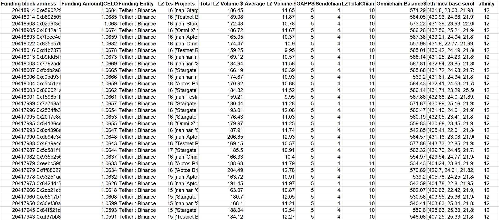

# Reported Addresses

You can get report address here [batches1](address.csv), [batches2](address.csv) and [batches3](address.csv) or the following.

```
0x0d4b771e25aa007366135e66e38ba02151d0257b
0x1b1c3c4fdd099b3b3ec3711f17853cd2b78a314b
0x76d9225882a48da436f007bae6c2c600fe54f5fa
0x8535d42816bf755a3632a892cde9d25edb07708d
0xd1b6651c93787336fd15d2f360132b4aa0db9843
0xe8dcac6d7fd437904de950da77f3b7a43181e6be
0xdd9659270ae18651df40759bd01418d8dbc7651f
0x05fbb041adaa161adffb6ca4877e9566750529db
0x114d943e3d194ec4ce319491bca03f7224c53688
0xf6f509e361a4d6c95fcb24f86590313c3bdc2c99
0x479fd085f0e2843c7d454475c9aa01789c9983c3
0xd1b0399f6ff18633b47f40fefcce8e75a37129a8
0x972dd2d54cff4b6807dd8049fbd11986fbde4a04
0xd186061212e62c38b30067672f2fe17a132d9fdf
0x3f54d7a37c66a87c69d431e14641e457b018a5a4
0xb043d1086016fba492221e7855ecd2dc674867a0
0xd33f1d8647d33e6ea9d3a56270d09900be31cbcf
0xb6896d1022f1930ed7731ca794ac1280159fa0f3
0xe701ed5c5250fadc6277ec9d74d077e7aa881ad2
0xad47aca887f3516da2c301aa59e698e4b8eaa6f2
0x83108a736de21c512c84b32d3fb53fb7591e5397
0x375201f5055cdadf2f402e72b93bb5288b5572c3
0x61e3f9a83335c4ccb7147af017d1e832b2a69949
0x39118201825ad53cd317c02fdb8eb5e47a6fd1a0
0xfb04636934e601b974556a4886820f3ef025d4a9
0x313b7102ba44070a8527cb5cce201d05646a4591
0x8fc6b64a4e4d32a94f2319d5adba1618904d1a76
0x84a214a473c6dc9b0855f2e06f0e2531f8a6b8a9
0x3b1a6a20e4ea8e9ef659add3c9c198b87db295a0
0x0718c22c0b7a0b397e8959ae3e90d06c1a767a14
0x972289357dcb3519c986aabfb7d55fabd4f480e6
0x942861e364bbc6d79149be238dd0137e4da35e46
0xcb675cee0e3a9fb0845df3bc28b6a499452d5aa4
0x565ef460392c10a9b84f6e76e7841bcc4e64ca1c
0x39b80b14e1ac6e0f3ec17d2a936303fa88f3ad71
0x8a53eb8988b91a2f3393aab6d7177da3f012b487
0x2ef83dac668096aa98c402c1e169f4be5c30795c
0xf6145f41e9c1952ce58f3d74d2c9f5f498c977c4
0x3b4355e6464e6d5c71199e0e1c444d7b2e06d3fa
0xd0ab92dbc84c087de8d3195f84eae314056ccbbf
0x6809911e06d8e35a10d881bf6ec83816fdb63171
0xd431aab595b519e58e562ed77cb3a53a26691b61
0x999d1753516e1a2e13b7d0a55546e37f4cd96c2e
0xf69cf72ecd1cd207a74d12785be3a4107cb4ad85
0x30e342adc3c35030938257fb626deb1cc1bbea8a
0x7342a171ff7fda51214ba93037c7440dafb33d40
0x6b3df9adc9de6bce991d97c42c2dc5f9859b03e1
0xe0f375ec1198960cbeb6d6ab2619601431d3cac0
0xab6cd0a52305075cfd5149998bf4e67dab2992c9
0xa8a906a65e6d8ddc8586d216979e731bfb2afcf3
0x1825999572d2b604c7db9b00e49d709bf4e3f3c6
0x63d0c5a8921d3dfe352419a08a4a8b4d09bf988e
0x9f75f62e4fc6a9d4c8a559c2eca3198921ef2732
0x0b708952ab6b6063ba04fe8e8f093b4688f95feb
0x5ca47014fa6e766750a436327557a4a569db0e5e
0x43351800cf61b8f4ad8daf4810a78e74ae9b0319
0x022b0013b55949ac0ab32f7aab9b0991ae6563b5
0x5c5e18fb9e3305d6ebd97de803d228889c845116
0x145767514b5d5c12db71e2396aa3b4b49ac3d54b
0x5ac8faa63f4fc4e12da8bb1a05063bef53daf7d3
0x18639185111512e11502fa3f671724ab655ca002
0xb76a4327ae51621e2557dda897e0867e2b7f2765
0x6906659542a94847d664d6607a8f09d6753c9ea3
0x15af5347910821284a1e67497e551adf5eb98e34
0xfbda0baa70c5bc307190d5b85c852d86e0721034
0x591a46517dc29db63724ddb60b789917d2acdfe0
0xb806c548f0ba53655eba741620eaae34f345eb2b
0xfd84703c0a824d61875f2c51f2f484f0cf371f11
0x6f457e50843b519906efe76985044ba1cc8e6dac
0x97f9bc071a7548ebbd487440112fc316b3f5539f
0x60309a209b2111953ce173e3843c3c407778965c
0x599fbf10b322e0d0bd554bf3e80bd635c406e183
0x55dc16763476dc2130b99f111feacffb8bd0a71e
0x1e1f107bccb6a2ed2df0b8dedfa7a45922537a6c
0xccaeb8e57ce791b0bd998a9c72f864d6b5db7081
0x1f9e61d43221cfb9452ddc4b3a02e55185a55722
0xa984e4b9ab4b6c1ce226b180e400393cac09e9f6
0x506a3c9ac9cb3ae8d18ecc0cf14c0eeb3a99182d
0x88dc2841eb568667cdf2ce5d67d2e51c54899ae7
0x1b4a3f769bd22c4e049bd789fbd94bb808691fa3
0x14f0bcb46a9c77b00625878e8072fcfd76017119
0x29369b77294065dfe4f64f8ac3d60dca015db35a
0x3f8e5cfc4fde1641b100661b64734eb67b983a2b
0x013cd8200b2c3fa57c9886775e9fbf8cab8ae10f
0x3f5adb121fcaad4e0a0fd9cc8b50d3b1a9b36b8c
0x8243605844c6b7ccc65684eeeba9caa6f27ed1a1
0x3180c9e8c223794001cbd038a598740964435c39
0xbc82798cf93be9780d1e2550f3d52641522de9ba
0xb49ca8fab17e3075a5c5c88c4224b528e6cfef27
0x46c4ee6748a339ea72572b43b07e83288ca9f09a
0x123c547ae261c73f5ec1fae959dc77ea35892f34
0xd4c30123f719bb981cf1af193557d79a1607b48c
0x69d9d6b21c454b4fa64db1476c3004be457c3465
0xa2325133db5112edbbc857f930acda9f2ebec070
0x4959002ebd9fb223775b4b62b8d8dea67404565c
0x64585308fa75344a0e4d7811249b8d99a782002e
0xc97aaec2ecd1d8524e8bfb20fe41558c7b40a483
0xbebc8ae061bdb9b6c8ba2ff2fdc66ecf6374a3a8
0x99dacf53e6dea0f41b0e2ff2b8b07317a3e41f48
0x30eb3bbf6b83b09e1abf926824c9b63714783763
0x76e6317d3a1f563719a7eed3ddf5deed8ed83ce4
0x745707a802e58a9173b86507182bc59c0addecb7
0x9205df9a6bc1bef8fdc1d3f0a00c740b1bc5a20d
0x50944bb71ea79906466d9e15f2dc916ca45034b0
0xd37e3da7ee45d31b140366b499e2b2287dcbc43c
0xeeac83c5295324622b38d5ced0b01f50634986e0
0xb227f4b6e3be67f1a729e22174348c747897f41b
0x8f97f70c1658621af2c6230a952c3ba2f1a19854
0x5df4235102ab4ef95ec1cb5814a2c0824ef96bb9
0xd981d66bf3392308c2f2ccccfa3c34db2531fcf8
0xc20e6997fd657052e64c939b7a17d18ca52b5255
0x3d4e319868211fe3509fe02fad3c5979d526d3c9
0xc499b6da5c9c1dac5659932d9bfaf43ccb2aa1ae
0x41b365e07b74d0557565e1b82ec1d7eac5dc3740
0xdd632bd1dbc772ce2918b460eac2b6afa6685247
0x0105e296594efb2e2372c8936a289516848e7273
0x223fce88410609875fb829b0c12545553d590d32
0xf3dbe8e9585e836f4cb5d9a9cd84bca11b9a3695
0xdc6c8de993dab5aa33dc8a104465fea1af50bd3b
0x3e3f2366ed8067325316bc5598ef143ae7db50a1
0x03d91bccf082b765c6a06b3f00eb5023f86296f4
0x4ad3f4b22cd1e986a6e143d70813c00277277092
0x34ee0ace0608cff7cb2fccf1eacd6b46a2c4be9f
0x6f516d4e008d5b14cdbbb0e9650af40a806720b3
0x4e8db6077dcdf580b15d47ed3310e16844463c58
0x347e5aed4d6ac8171d780f89589e2abf9795f55f
0xdd070e935ac2ec5bffa70440f4dea46547ca7fd1
0x9a46d1b5422f092a0d2f1413d31fdba5261e8dbf
0x518eda5bdded27fb0a6d679c43fcd65b4614dcef
0x48d583b6c56dceff09699294bd297271ae06fd76
0x921fd5101ebca5f76e9fd5fd02a9c3e11d87261a
0xf36ca6839c491e8c2c58167e6702629c00c118f0
0x0891a2e44bb71113610360bef7581d35156e9d88
0x8bed9326ab05e01c340ec6c76d1b3fcd50da4149
0x577718841d171c4378532c6c3f8f2a21c0bc9411
0xf5ec2c3c318ae0d8a345915c51f21a3b346d38ff
0x30927ba3363c5787944918d4eb36e613ef61583c
0x81da78cadd7425c79e1bd3aa4f72599fff57540c
0xedc5d571d8a7865ac6777e2eeb8bf3f40eef8c43
0x954281513d5cc06600833cbec449439b434060a6
0x73a33d81ec7875e6f4c2e8c6486f8c1bfc899016
0xb2951a2f6438970d3cddd7a6b66ca3f941af0864
0x1358c34899db0de499c2337d6be02ecf352c6865
0x59fd896344e893cdbdbfd33298d460c3b60b05f3
0x5763586ba213e7cfba7963b81106f22580bda277
0x8678d25f8aefa049e517f6ea40de12c252649c16
0x6ef9a51a3b08532ece476bcdf32c4ca1313e161f
0xd3d71f29013aab624aa51003d5b2bded55646f18
0x2d21dd782f0417dd4bfbf599e8742df344f10923
0xf166ea2ac8487b2a5955f33077b49886cc9d8601
0x035a483c412b52f819b4e6e243d94fb068d5be8d
0x8ce54e99e7646443470d66a398872ee1d5cbe5f8
0x37564f16453d5a8ea9f80414dc836c4b3c68bd14
0x096636119e6ad4dea7f6e0762f30b7f7a7c3f346
0x10e8508c9e80f273d4f1df6e499f1813e7922d0d
0x7860122ef6de1c8a8d6b4ed331d569d03531d3f6
0xb93ce9fef8904c559fe76eb1dc80b38f5d172b77
0x65762459cb26ce921edbf1854e8b5ca1403e39fe
0x5665f8faf15a95c24b4b7927d40f365dcc6b21e3
0x4fb2291f14edad64b15c2a35fad7be4fcc984d3c
0x6484f50928c97314a5caab5d28b39c4d6bdf7f9f
0x612a7e5acee95eb6f94f5b49928f19ddfc3ed338
0xcdb4c87a3bfe6762fb8f4720171d26316232fd3f
0x07915882406b55207f0a88107a4ff22da5e1841f
0x9728534c5632727b4ca039118c2d9462975cd0fa
0x371a83e406b6458d3b21615d980e91968fa6698d
0xcf877abfbfd9957434c0294a1dbd19bb7cac70ee
0xa2c616c809157606e82e882aa6dc4ac4bd7fe17b
0x7b2164a438044ce44ed3e61319041274e66e56e9
0xaabb4ee81cda4c51176a3f947081c48d85c0f529
0xbf99bf000dc869d2429f44abb71d2aef0e422427
0x3b2c8934c6035420d390462f76bab1b27e55a158
0x8c6d609ef63db022c2847587206c5b7e698869b4
0x72275ff0ddac2300b8d19fc80a59bd8bea5666a4
0xe862cb71ef64192d24a1467fd88a9864052574ec
0xfda1fb44c12ee343b92cbba014aec33ed58918f1
0x76518c00a1531b979dd373196c59048ba1ba9b77
0x8788690108605435cdd5304de2f4bedc0393b02c
0xb9d9593139f849fc9c528513b6ee010177728e93
0xe54163e19e4b1182f5389f740ffcca4bd7949cf7
0xe259696be2441d45789e5f8e4c0c2a0e10b06b7e
0x398a5cdd02e4cb43a16ad1c597d6f24b66073c3a
0xabfc0302c65ca5ebcf2b7fa8090b653170119674
0xc68f839630b615cec86c63fc08438f331ba4e8d4
0xe738d4ca44e66baaf48ef6c56598509aeb8250bf
0x30ba1a7918dfaf37b5024765ef9205f3374bf502
0xa85ab44dccb5ec2b2bdf19aae3da5df93c91daf8
0x7cac5e216677ef9af9bd285e3282cc527aaaa1d5
0x9e9df71c3366286784f22f99b56b6850149ada81
0x0c35f7d8a46c4953c65e3bd152d5f90de1f9c57a
0x2ee52280db5b364aecc9868c466cf49d85ebde10
0x3f61db40a3ac033f2414f9c66779483a3256094a
0x92b2c3deb1d84048403ee82a2094b51596677226
0xb235b74d045b67c24863f71be402bebd25b83e35
0x4ba2a67b32b436975d3f16ff2e7b0b707e3b8fa9
0x0de908c7cd36a9c19b9f3e42783f218a3b3afa41
0x96ac13e676c142967ae63a0d8d13d644b9fe3319
0x1e8f8d19d05af31c51378ebae3148fbb88192b94
0x79041f6ef1352d7df0e0e383823548f390d5ea26
0x8a7f2f65f22868e36655faaf155d6647734816fa
0x5f8a086a65573fd7cf9e319baa563cd0bc591877
0x008315d1347029ddc4c1f2c84b03c2f90338320a
0x3fb6990ad5bf9ee6e5c8527e17a4ae2129678079
0x6b1c39b9f71fb565523df73ed4a714d972b226bc
0x0a2fe4b8971febbb9e0e44bc0359a1f5b0846598
0xfeef60f7d8a99d97fd39a81492c59549f160aca7
0x6a5d2a6c133c0d9bd9684df9d89642a4a89cbdd1
0xe4506ec3544373c28d81fdcae0b838ef09eba707
0xca3c87f44ae551ace0d5d428740c588815f72775
0x851e306fe692af117443b62ca045dbfd93e8c548
0xa42962e4bf8c4d2a265b76b19e0661b8dc023907
0x81aeb4e7069f678bd8be5595a27c65358fc8b19c
0xc5ca815ab1965cd87d0540659787d57f3abec1fc
0xb05d7bc9d0b6250a9008f34d7f4b95e7b405cadd
0xc9836ffe3c63a0a4336bc57e097573799c8e007d
0x2c1f0572edef7c96020e0189caa4e5f39ce492b7
0x26142bfb761841a306557d1388325c3bba8401af
0xa01393a92a46dfec0f78557f4b86b0da0d902f22
0xea465c776cc3b8af9c594e428a6b77974075d450
0xb35a9e439f3321dc240febd54cd9df59d027c871
0x48d9139b88ca39829094fac84d1745281c38499d
0x93c40403dab658827f1ca510e9347098f35748e1
0x955c80b07d4839972f63a7168fe2370a8020857e
0x708e3053c0f4955409b2344470efbe10fcd3cd59
0xc5f58d34808e0fb77c9f95f1b62043422b68c68a
0x091657b5b70c3730675561521afcc3a1a58c4420
0x001503895362f5fc342f66a1a4f062445b053c12
0x2b1e6a4c73a363a748d7149a729bbf2950e0e061
0x88bc873ba35381512e3ce9e78c2d4d655e59b59e
0x57ff287ce30c187dda41b6a719bf3fbf48fa913c
0xbdb7a964fd0789fce651c697940418729128a645
0xdd16b3ad4f92c9e3a82caa3e4c69c38b86e35001
0xf86eeba960f2ef8addd36bf7fde2679c36a190c6
0x4bf33c3067396f00589625d024caea9b7b81e26a
0x69f831f022ca75ce9ecd034aa607bc7526787715
0x59840807f8cd58a5c394e237ca9e041893824afe
0x9ebe5ce7d235707737634c2346db1776fccfe23c
0xc6e00d2530795067a9e8549e89471f425c40d1ec
0x631dd31b07ccfed0f84df45ec999a714b6e27e7a
0x2bc2173418e234df79d07cb4130ac5c7ec7f36ef
0xf9583801d450ee5def1d34a5cf636a7826f65c88
0x421fa302627b7cce18a1d042633b528961a90196
0x415fd61f2760592821f91b2acf6501a6ab2300a3
0x67d2f7484335cf67b95873c56b326f169c916e54
0x47e023be066db2883ce2b8036dd05b8b01ee142f
0x875c39addc16fa47ea4c653ba8b68f2fcbc70f2e
0x2f37ae701d555554e99e7b3e27a746e31de4658b
0x1152d922dd8ab40cc9e48b5a92bd2f09e2602759
0xc6ccc6a6386eda3017ef09f9754169cfa29dafc5
0x689fd4af3ac3f0670c81d2f1f6dac0950e504809
0x09adeba09fc79c39525c284815f9b8c04ece353b
0x33d4aaa0816f4c74c3bfa268ef174d3bc4536fe2
0x1fdb45f90a18269589617b828bf4621f3d0ece64
0xb4a44168dbde9bfa3cd92fd999a691cc36da0ec8
0x8e5a6e3902de1af5d5702694daf915b7973460e1
0xecdc208cd63a7b41967de1f58b5f7a0fec4f3e9d
0x4a0801825e664812d9ee7b2bab503fb09eeb8068
0xd3d0f0b49c2de5ff93c5734cbf17bd86717c990a
0x5357aa020f91874a114025f5cb68e1b231ac6ea7
0xbebf59718210111e92b697e31d36598d0448418a
0xd8cc7136d5ef8dccf68d150d511535600512b5be
0x3c29d63d769ca246943e1a53bd5c2374c82e96e5
0x56b3acd8576be11b893dfd75f2d2187d574e4d1e
0x266ef094d4ce340172bb4d3ff3463e2dfa672dd1
0xfe6ba975fe4d69c1474fb53e0d8eeba47713a1f7
0x6b636cede252e3c1645394dcaa2baeae4aea1a2f
0x03f9bc8d295c8544805be4e91f5d075e9edcbc9c
0xa5b4a9f0cf871a8cec6be064a58e2165d186f1a8
0x7a4b76cddd86bbe9a19b8455eb57e600d8ac6b3c
0x06fab6fc2fd9bf6e1f7cda77c1992a1e73dcb3cb
0xc9fc18d386f0725c8b6577082835d1b8c882aac4
0x6bd259f77a30affc60d9ba8c877c6f650ad81397
0xd514e7869978e084b20b6027513fcb4d7f34e248
0x7265a9afc9c95f1de9bdfa0f7f962371168c7c54
0x6909e7ca4bd48f0026b98f458ad1c06e93d8c90a
0xef2552bf5f4e0a8727c7159625154237bd03c15e
0xc29fd8083293ec97ca4749a6d871395527d2d128
0x8995675e70ada3c6b0013dacd3482706646b16bd
0xf67e9f78d259fb3a093588a8907ca5121767702c
0xd6b8f81536a89873533f23262cf534d1a571b2e7
0x8b2e12c70dbdf223cbd05293dda8ce5eda76d510
0x0e44a7f80bfb483ed07dc8d8018570423adef11f
0xbdcf69c333327deb59c00b763b12a9e1cecece4a
0x78f2f2dd2beb9e3ba077ce0c8d11c347495d1c37
0xa1abb13dc816838554f3d9bdf9c1fe70fd25c7ec
0x77a5223ede461cbdd57f1519a4a2c770ded4dbf4
0x0cc4615dc0d5b21f76e300b904c5965663d45eb7
0x25c9e8ebd1dcd4b001331ed301c6672cdbd2d7b4
0xc9c351530c735fa4a450366ad54f948a9093bfed
0x93d1a137c8efc117a0d164f4838458329b0ab82a
0x616d97a17417c2e3ed6efc69ec39378d393e6299
0x11192e7740c7b34f02d36d12cc6fc1fbfb5ea7e0
0xd579e1943a9c1b295a7fa07e7c7e7247bff0e386
0x3bfadde4814d806daf0eca8bbd2e3218f1710485
0x00be763d4f384c70ddbe4cbe838a9db65ba31209
0xbada257069b0be059550c398a37b269ef7ff2ceb
0xeaa6df07afabd2e630cda9d62a54d753f00231ae
0xd88cc143f7e9dcaf51ce8ce0ce904aa0c16cb307
0x416987c7fc7ce150022b17271a74dfb534166f53
0xbbe98eaf0bc6ee9204e2f08e67f990521ee9c4e8
0x284b343f36f8dde98b6499e18e4b97a63b84f0cc
0x1cc981659a201fc451fa4c7e7f99ab4973c1d22b
0xa4d2d2abd6e09daa4fd01972a49a13e60a3bc497
0x725765d05080043d94f182be784d477c8ce7759f
0xb576d82970ce6d866925bf9e0ab47d7d5e20f81d
0x800b6815e28007ea25f493413705ce9c961b2fa9
0xd1b38958e5e1d976be9f7f51a37999e310e63f3b
0x6f1fd20c00fe108b76d76e88aeb715df6f96ae83
0x917279e2f3006e5bbbe084b0dce6f695e0465bf0
0x091c035a9877a6af8ca671caf53cf2d7548b1e71
0x3eee68956e1b412864bdff3fd3d4380e28c15980
0x7929413774bdbcf4cda9d7784572a6402550466d
0xaf7cfc5c35fa81ac7631f3b69257b61bf605d8fe
0xd84b604409a470a67d2eea3558c9fe8d2af471f8
0x3075d77b1874f6a6aff46141230293bc7016507b
0xcf1855787258dca39a7847d10e956af2f392405b
0x588c8eb01efa8f7abd3e3857b59c8ae6a3c55a90
0x579b311674cea4a6d0043d73bd1d2850d742f4f7
0xa914f96400e1c6f1c72124f2eba8c7403cbf5ebe
0xf727c0eaaa3590f6dcb8dd4e45fa7d3b52c0e180
0x11699f6419a976307bb5eea3edc3c7bda086ad2b
0x593217e48b1ab8ce0a6c0d1ef73734c12c538894
0xd8d931048f2473397ac71db1a5ace261bf74d1ff
0x248bae1de84c3ce432979dcd61b1ef5027635f8c
0x7f4c6e301ea9539023f555c0f1d53431376d76cb
0x286b3a3f70be409768a9f43e25050d5f27122d91
0xa3b7ce50fce7d3218ad5c55cbfb6c325b3836ecf
0x4094ae96bac212a1478194ea5762f5f5a73b5c17
0xcbc2eed0e7aeee8307388e8f671e40d0ca59376c
0x0558f1eb2c5f560066158d06cfa854909ab7a212
0x86789b8dbf54d661d3d5d15b3011a567bbcbd0ac
0x3e8d879493d853db2e2ebaa4441a55fdd4491a0e
0xe05a40cc4042ec7fa70b2d40a949daa981e48ff0
0x96bf7375dd1b89e8dc2e8bd7faaab0705edba1e1
0xebc7b554bd6f6474338028c0f38489997748849a
0x4eff8b7b7c9f97d7e0c9fae7425aae775674885d
0x64d5bdacbf7f4b17b6130daaf116f065e8cae046
0x27fe8c1be1b72d881a4dbfd92c09f3ffce1b30f0
0x1c49670945025c2c461925af8748f75391e7b7d9
0xa4472a508e62e1e35060a6fd22ce8289cb67dca5
0xaa87f72406204842e4f5004004d4963d2ce0a213
0xad0e4185cb01fe250eb94c80c0c8e5b0b8a82228
0xd555861d6bd3e34fa49963e996d813887544d809
0x8328077094431d7cc5ac7ab70c7ffd17624b8ffe
0x3e946bc63ac157f57f1e28ce9b2a7544593247c7
0x298b4c0f3049ad36b375783c37d4c9787dd0f9fc
0x0964d9c239be752d0929b765a2adf36c640de6c5
0xf56ffcdc3e467dbd38c46fcef56a4e4ce1cf7c80
0xb31460962cd2efa88a7800cf0c6ea8526b702c9c
0x2cfbf4a56dcb6bdfec2e2eda65747cabd3ffc57c
0xd04c700e849d268cf6f320987d29d24dc9fcb277
0x9d9c3f729a7df41c15beef72488314e686e51e81
0xb8875909d49a99e1adf6bbd7cb94456f7c0594be
0x86d7e31998ae94db95f84cd9af6674d027a24645
0x60e9ecfc28caae1d08f745c43e3ca438bbae60a5
0xdf0adbb7a2b665343df08d1cd73f1a1cf6e6050c
0xbb75ee8e46dd205b276537ab1fb2d787dfc719db
0x9e099e5a4ef7d5bbb21d6b046773497d8a48d859
0xd0c2a35be4345b134103d77892584dd91f77b9e5
0x575a4cd28facb5d1600b38edae59e8a983cc356d
0xffb476c168448a89d6d5f256febf84d8aeb93343
0xe590229007bed6da2ca522423dbccadfd6b6a900
0xb892505cbae25ba29ca67c5951640ee94dc16942
0x02a9f3c9a6df94c926a3395de2e5bbec630b4ebc
0x4842a174ac1e4e7a82fa9d78589061775c3a5384
0x7feee4eb3edf4f06ee04b1b99afbd16ca46e2cae
0x635eb76b8e1d4fd6c5b3a080a255c6b637a8c482
0xd1b7377eb9ead28d2101bafbc652b346509a25dd
0xb9fdd5fbef764fed57738fcbf49e57f4147404d1
0x7792add5bfa93b5ac15ce7d111de913fb33d8142
0xfbdb2a6b74e5a75ffd8d7524ebdbc3c80b7c3998
0xc0bd9314329d154cff5006b4ef1c73c60f248aba
0xc5c51ae15212c18e1ab171c518250d1e081311ce
0x866021a25888d6c223a5d00afff7ad40b966ecbd
0x1598bf1e4eb11116159fe126732319187193f5df
0x7a7d8a1b0138b01e2bd071342dfd04f00db7c828
0x2534fb37d852627b72c6b584014cd47c450e5324
0x2017c8d817aa66d7df9298c51dde2decbe0110b0
0x54136cea8190d9320bb001d5b90cbd0750823205
0x8c4396a4b4e3bf66502999437cea54301a29f364
0xdb94c341262445a38c526768ef8fd665a2eaf908
0x46a9e4c742345ef4d4100cacda0a3c0c2c708226
0x5c581f1864b6968ee8bfba6d384f01f4b84246e5
0x935b256d22a6a7d8d3f80e6092501d321fd2d7a0
0xeebc59f21f13758530d3ee5aae511193107f3237
0xfff88627d2751c95d79b5c629eeeac40e2f9a5dd
0x53251aae0afc8623473b9d35f23c29cf7312fb09
0x8424d17a32fa9e31b26a702720088ecd974776a5
0x2cb21cb66cbaee4baccf6a3edab500665c163be8
0xe8517b1dc0a16ec91e93ad1ab07efe74e7646ab1
0x30ef30ab5f04cd9d1d2c62d32630648247f7210b
0x64f521d0fbcd134c5152dab3b69407345e8bc7dd
0xaf37bb81244fa5b381e3177da8a0150b8901ec8c
0x004d6d601e3279f9926dce6abc5207b53437255e
0xe078bb1ceb1902d63fa7947543689b41f3547740
0xbe98f5a96413544cf2fe92565da6f3c14b66a395
0x932fe7a735aa7f90088afe5a1b44fbb80cb187f9
0x7d2454776ac68a4a899ef6c587faced8e661afd6
0xd8c4f8a490ba66c8eef903377ce87c02732278d0
0x1e505639a66d211d897fc04f0df497361c03277f
0xf916f0cb52437210f5401eb3040f4115f6ecf04c
0x3982b43a26a9b1645e4b1518b3199c5832ad1f9b
0x8747c8a4ac38125ed0708e54274fa4f8d23d15b1
0x758d4f3155d754f2467afc4337d5277fe4e12f3d
0xeead3c82dee4fa53b06f94a763c9d48fc91ca8ca
0x894dc916f7e093a697332e9f0a030731b0eb42f4
0x21dd5e7aade637ed3c3fa8b0ba39956536edc1f0
0x023a2cc816bc79290e7a77fdf182e228f362e0af
0xb447c908e308d9d3b1633f2f8bd3d46975a18634
0x12524aa079ea47ba508fa44779e6a424cb8e48f1
0xea0b1e35c274812dc1092eb77befa4cb33ba98dd
0x729044280d1967b42ef18bc6e1e40a905d1792c7
0x30f68160d9bde31056eeecf1cd659856f7c985bf
0x3107a5086ff2bf760fd994884a8933c60d8679d1
0x1ed70c523c10139a468c690cff9c9832d013a465
0xc3bad26faca4fd93bd811647be1b8354d463c36e
0xf6f168723bc7244caa7116d707ebc649ea8d3031
0xd2b8b778abb9e33314ab2b437e01ceff64d45509
0x84b539f4cee3f89abc1ac5c4c4e112e45183e53b
0x6d77bdecdb1a23fd68d575d835caaaec2f15109b
0xc32280e3e51964a1c04cd03edec792c9d22ee49f
0xb433cc7cfebcc274d5948a193a019bdcb290d0f2
0xadc17f529a3f85af6b614ca857a8ddbc675a1caf
0xba86a6c115e5625c194ee78e57e3a37d5e79eb6b
0x4e68ceee92b623e1898f6500d7e296fe7e0245cc
0x313d0b4e29796df88f3925a140824ace2fc28e6e
0xd2f646877a3163af919964fe568833e4613adbe5
0x3e8bd9c3a645443b6d1a769bd70d1dc2607a2110
0x4ca0de1bc3ba31b330bfe002196e0f47502ed803
0x4aac4b749f3cc2b3caf269d28ac95166f2f20b8a
0x1a37a8ef8d413b61c26918f2e0b754180c119726
0x0a5ce3cd74fa2208e37e1910087d260c6c0d119e
0x3ff7da68bc163959183a936fd67a45669e34060d
0xfdea4d1c9d5cf41570281fd92800936c6d305f9e
0x088f0b3aec6e1a1a40c9796937c4a5e3acc0c6f5
0xfa14248fc24a91190bb91043c917f14cb9e882dd
0xb8d61c97c155385a702a5fbf379c582d2c6af511
0x6487cccf30db44a3dcc257ccc76a30111820b95c
0x3ea397dd2393f9d22a8db2e13fc611fa1d4168fb
0xd56f08f5244d98f792c45521f977a82171a0c811
0x86651f8416ed446dfe9d151670f9883eb58946b0
0x9ae3106fa74f60947315901fe1d8ae96e134223a
0x1d4876ecdb45c6cce31109db5523b9ac2ac41cd6
0x368e72b495567d529fe99814e463785e90dd8d83
0x78c6e144c23366c6de07c7d1f4b4eda2d35e56c8
0x1aec7c07bce227abdbdf77a8b6b5f480441e7f8f
0xa0d2160c23f9a4de8ee0da06d95d6eba664ae82f
0x043dc24ce32b05f52055a4b34420b0eddebdf88e
0x135ac443bd55129be784c60c2afe4e410629d4fd
0x1776d96ed00b1f54bd090866bc1566a2be5b0c8b
0x919d523b7f702b4a9b34579818bc625f78667fc6
0x161678971d197cb5eda4e35e4ad43daa24878c34
0x0157a145a51857d68129621429d777ce9e19a486
0xed1d600d522f507cc23757a68a73240ae5a97168
0x77727021ae23a58a94e9878144179423d96d155d
0x9aaa87d2962858674b2118a9acbceb4d6553ef71
0xed3daa1c369ba9782ac5c307d7f5acdd13d9f269
0x469dbe0c7ee9da4f12f2f582f470ca95f8296a4e
0x54c851e716ddc881cf8e2526b9a87a726ef1fce1
0xf2e8d7fa05cedaae8dd6ac2cfeda42a51f503c0a
0x90c8457c271b558494ee2a152943c9ba4d7cd545
0x105f967940fe98f0622cef0cb734d165fa771d04
0x2d3ca732479a048eb07c66bd535633e18eb31101
0x84f0fe7ce9de06dcef54df9a6c12689051ad5a0d
0x1ccb4fa4eb872db31405d45e840fea193497c673
0x0a977c601b2c929edc823953475369849b6e0439
0x012cfc0da8760478df8440b7e307551b6d79190d
0x9f9698cffd6fc53126bebafe6c975ad85c9cd54f
0x576a201212b5ba8a01a3c725599be9d91029686f
0x7b8460a884c2d331e9fec60a5f92d8c2ecb12397
0x2bd4e174c1d4451a5d451822ac271331b6d93d17
0xef6b1d1432a8e53e9683c4c1f2d58cdd32c21460
0x6f29bad8ef92424805236f0983435d05cf2ef737
0x530d00ffa50aaa4494b3e24f64720b0a1e5b4457
0x8b5f6744f7529f4832469253bb00124bb215e529
0xb5fd5719db95bc7ff23b57705db271f86719d1dc
0x0abbe947c2f35c62f37958c0bcb041d0824d9116
0x8972a9928fd1e1da51a4bd78bf35693d213bf689
0xfe5c2420a06796cfde5379a4e9f9422e4246bc9d
0x30b3bc9b503a8bfcd9ecc71a9c4d6f1eb37956e4
0xe045993ef0c26f991a968e62f0f8f8656120262c
0x172210e226d5012228d5f3fbf72965e11967be93
0xf85e65090f585c5bc24169f80e4af49343ee3f48
0x949ff6da6c1e4b5384dffa9917861fc607287d3f
0xa42b58a3877389bbd94f6af8c40c6b1f5e9085e4
0x608afc8a195c0431fa3350125496e4da7adde84c
0x99acf00ed3007bd1b1a8a5db2a2faa913c238438
0x0453db57a617acf1041391578a75e69339852c80
0x630260b95786e179ee58248c86db5ed221e55fee
0x27710c7ef0fb7855386996f2d13e2e94f2f46ba5
0x2366150cf69ad54deee540df59436e500f5a9f21
0xc7edbb74a5aae79e3233f679bb02defb6af7847d
0xfb7148c64d8263268db543e39537dcff71a3f541
0xcbdd7d84ab792126783bce41e8878e1dc193404c
0x94751898ef0108a5390b27b4718e15f2c7f5e05c
0xd132d3e7c4d700cbbb012c168c21fdb07a0d1628
0x2c5a288da180056e280b7c1b02a6430906d74453
0x7b87e54e05a19f24df14e85fd511f2e179ee358e
0xeb805b3e591b3e7f65ca5cd31246b27e71934dbd
0x5d882571cee42415ad1ce27acbd911ff6e405e61
0x44bc80e44bdbd690f8013e8e65766eabcb507647
0x187fac13349dfe6eb0916c9f86e4d0ff4ea7860d
0xc9ad2321919278015fce25d528add80ac4aca140
0xd0464ee6d5d5abad693c9d87f9661446bf181fc6
0x2e3eb10e340dde876f59c8fee1440388abe17b99
0x3bc31c2ead351e89eb4e059ba0a0e0e0617b8170
0x79573db5966f0ea116a512ef90bb36f485c67e09
0x64da012c59025c7fa528c56872a871b192128c4c
0xbef9877fbce9983615be32501a819d120f8be60a
0xa6ef2ab51033d6967795b26378e19bc6ce4b7a72
0x1bbc8055722bccce512d94979800603b78114e31
0xbbe5829c98b8973bbfcdf94e0d633540fe7e420e
0x1005c416ee48574344389cf09f85a2732409729b
0x6e60bebe7f812572e6d8e1646d6c0b9965da04fd
0x3890ead4b35876ba85fafc1c448e9d31bcf56ad4
0xf064f3568bc56ef992f7fcecd3b070248058dc7d
0x4c74644c297c957512b1411bcc49000450a05a80
0x5b5af3f26cf38b00b0de3dacc91ad7eba4db3867
0x6b9f64d9e1797ff0ee0b378e166ffbb2d6191859
0x5d6b20d3325cf0b05134e67a4cdddc953b1c1005
0xef09c3c1d2c2ae0437b87dde0a79bc85eac63073
0xe1b01b2b0b4554fdcda35201e68f9d1e1f240946
0x2caeea9158de29ad696f1d44fc31df6cd6af169f
0x990df62d94e31834fabf035811a4fe1941e6fbf2
0xf54944a0d810e9783f5b7fc89016e756caaf1f2d
0xeb25092c0e1c392bda300699eb65952a2a4d2045
0xd2b6b79572637e8523e31da158232418547deca8
0x03b1a1632cbbe330ddee0fb8b734eebebe8f372d
0x3fcfbb85fb08f1cfa68645ae6f85253af3ac0ecd
0x5900107f94aee736d5ac9f58a50c8a1fbcade95b
0xa3d37a350d180a403fa05ba4a65bc08f7eb55724
0x4304d84d9bad4a6be366663db460aae7f59000d4
0x770aa6398a72add5dea06b1acd843a76bd75ebff
0x54b19d3ad6ab7b9334d8ca1e46f7fd8f77ddaf17
0xce4923711e10d3da15642aa7467e5597fa8c3be8
0x37c6c0ed3584f9a9058b55f05fc8eb01bc88e39d
0xc506e7827af94ea674135bf70b2323513e1cadf8
0x5416fb25f5d631726e457ca6e0318a969c142384
0x86878cf6368258a455adc85a2c097c4f07d89e7d
0x54e494bf375a6107f6c36fbc472344c4370adbb1
0x87577e4df3f29f0814a117e8e198982409846aeb
0xd75af8da2c30b0500d2041be60a1b3a4683947fe
0x90db1d20fed8189bdfbec4a061f3cb8f22de591c
0xc6d892611fecc7baeb49cc404f9561b6708a3d2e
0x935e04b1c082be94a79bd5c18688b25d21af91ed
0xf464e7e9fb7e4489f6b249d56c023a37a6400362
0xe2528efb7f2fd20b6cae72ff26515a8002762815
0x50f778ef1b65705010576b4303d7ddc394b13c86
0xa6a7227975cfd714901f30141d28bda2796294b4
0x6b122619096928f7ac67678824df5867a35adc03
0xba6796bef1b5423b032f6fab7762db643d2b4e72
0xa39a1c08d18f9f77c6b7711f8a974ba55b22b9c6
0x7d922e8c520d669c558079b7d35de2d17b96fb33
0x2c8f8b77c5fa745edeacd60349e1b5eeb34ca052
0x7bc069192c466e71a9f29ca3fa4b9e17e03fe9a8
0x14c7215363c03c7a58e7748c91a8d353cc3a9ce8
0x0c863f33358a1a15eba5645ea81a5dc672805a49
0xdad601b6d103e023d1c7a5c21b5717a6427bf921
0x0b2ae1edfa5e4d2a954aaa4677bc01c6a6e70247
0xeed0c4303fc7af34174222b81d4a4a8e1527aa03
0x7dc90944361eb05d2f96d304954f0a4af3aa67b0
0x687f9360f84b261b6e60078b90d15ddec8e64d53
0xd32ba7694b3711c9fab75565f8e07ee746ace5f4
0x066641982afea82ffe7c54e95b5db678078fed15
0x98798fc9d34af42a7e3848332413a1eca4a60a85
0x4e69d936a8a8de30dfe74f75b4a202ba077131ee
0x923260b5bdb154a3f02c9ecf9f0480e8c0a2432a
0x66436d3318bed7b94717a0e8c104902dadf9407a
0x5fe140f628746b162658d0461a6d2e06bd020708
0x9a1a24770a6c3c66badb7c6f17c3fe23a3bb7bd4
0x07a00564642097693a044c2a4bd2c75a2c31ce06
0xbb14a45091256c8ccfb13ed24696e61b462debaa
0xd998b2758ca5eb7f44f050f5542f380f4439d151
0x0b791a735d88ca3f4e1d244a56621cebcd7b3e3f
0xa8e1d4a50909a0855f2bba92f0317e1ecc844561
0x1f2e61c6b75ee5acfdbb65e5bd64bb19a92ddc4a
0x22c867696f693fef1182ba206d6b92286e198606
0x5be45f8d3abc07f6b37ea20cb2ac0f29b589f4ea
0x440f5f18527ad299ff08ff9df9c2c9231081e10b
0x23cab4671ab7758c471d358eb59b4e2c60ac9544
0x856e726836352eac5b7a1e2dabc4003fec1b015e
0x06f793eacc7425cfaf5064e0b4719970dadf8d47
0x935020119bcbfa516cdc1fc3b43e71b1cc1d28c6
0x127af80782825cc6390dc510c0ed94af7f1d8395
0x63f984695639978c5f7eb9bd829b8655c09203de
0x5a889599490da8e8b6c79b73aa88430906597113
0x6f33cb1ee05ffd7f628edca52ebee44454ed083a
0x8ba0d4f10591f89923ba2cbaebf054debc58b266
0x7d4e0dcc779282e4b3325187674bd277a905f901
0x9873c0f84cf83e72c692a2001240a72700082455
0x2809828d21184e384a5bc48180479b3754612c5b
0x0b36687859246444102df77f6a2375fa08ef815f
0x52fa12ccec426da155d7879028030a3d16a3b0a4
0x1364b38900e4f0ff5ba5381065ebd1ebb70b37b6
0xd9a0633678d5a8e713cc19e370293510c28c7f9d
0x8a1d87621be3b89e786eeef53796184c5648960d
0xdda5d0fcc16fdc138af3f6e91279a8116442c7d3
0xa097044dafcfc59bfc8445911bde806214756b4a
0x41c8b05929ae2521b925a6d03b401d0819dc4df4
0x7d31661390c5e95de50de7db835bef0455c4a32a
0x1cac8ac2ace1268db220560e13bac40fdc6f4bf8
0x45ba723398570d137acfa8c91b523b2303ebddeb
0xfd2385e61a0aecf96063bdf9d0beef7e39f677c5
0x46f93c8e2710138fd281a947ebccee0ec5c0885e
0x6c6c41b8255a252ab061f2e1c505f331a77f767b
0x4379a1a3b50be20c10fd04e95fc09ac2ded34587
0x223d462a8f915dfb60b98f07aab6329ae509f10d
0xc9c286e46da2414fe157e8c2b10c2f341eddef61
0xcad9ba33d7411c8c6866e3d3d6baccb2c7682729
0x6bc137a27793e59d184ca4cea3c043ddc43b8d79
0xbf232d79aade0c229a80e6817618ad6b6aec8ad0
0x03f6db2ef176e0e80d2f8046a5610a24ecd200a4
0x08998ba1716e5375988ec23726e7b1f0a9a33025
0x4414f6f69e759cc536a9c1f102a0cdcf8c4bc969
0x0c7a821ee4402f5927577a128e509ac2aff1c1ba
0x7a090eb41d553c5df7da5a1a0eb23bbaafa2ae6d
0x7ed06abac7a91646566ed5059c6bd9f1d0b2b54a
0x86acfd30d1c119a891140b6e1a26394126a5c33e
0x47a334b4ffbc6827d522a85ce78b5d2ebc2aefde
0xbf65b939b1904dadfef6c9b2267878209651cd1e
0x1a5982eb804cd010eebf9f0f79d29f0b89a6ddd5
0x3c602e9f54d50f3e902160f6f59310b21f1c6e82
0xe63dbcab4d8415c4d4039a06ed4b903d73e2fd21
0x5588594bebb59358e192df1b8e400ea07f98ded8
0x9a4a89bbe827e8f0e7f2af446a92030d0398f2f8
0x2de973c1deefa5eb3c916074a339b3458249a826
0x439fad1bb6a7bc3213a472d1255e093936a2bd4d
0xcba12b9219d1acef2bfb3fc2e32836e2e36639f2
0xb499029f595a82b42102b325cfab046216eb673e
0x487c2bc56df65f4ce6abd7bddb749835842271c2
0xa01775e5882f00ae4d9d8df5ba4f13222145c498
0xaf945d2c70df558b58c82e532f13cbb5a63f932e
0x342decd407f4a8ec44121abaf6c59a4103a4fce1
0x288343cce3c641f40a4345bf03035d156015ef13
0x72c568fd5bcfeb1567c719d13123e5f010ee72b6
0xb33e2bb00c6b2d15b2e8f04af976fc00b28cff51
0x4fa39d3624e03360ccf95f19317ee1e58a251606
0x60f8657ed39523e320b689f1912ac1a1c5a476af
0x0443c91906d28214f721ba405cb9fa4b56e61d6b
0xa83b0fdc1ce0a20355a4dd59abbefbaea90193a2
0x184e6aa3f5ceb613b6fab9b0e14c773ca69b6565
0x822383348e57d2174cf6a2ddc055df74b2fcc2a7
0x95d79184f54b86dc7bd3bbe8b3e1ae11baa1dc38
0x3b446bac8a936da3af19b6ae85d6497bb8e1b519
0x0159ddcb272711e03f5a1cf08308d666b748fe3c
0x50953e25421893d0ef661bc995c4f795f2fc9b38
0xb75a6b0abee1e8278a52cda9462683bdeb43047e
0x248833ec5e315cfdcebbb5fe5b09b2d9425f5469
0xd555f1414f6f58be257addc40971f04632022c4e
0xac661daab60edb0953ded3b40401383939d72888
0xa56329f610483b138d3212ecd3447efe56be9a9b
0x436db08487b9252187a41197a6616c06bb35456b
0x6b40c74713764b0e1e3de333375d10c037e2f52c
0x67e03617eb4c4acf754bc160d5279aa0c6bc53d4
0x745e791daa1e80a1dc4be22ad7eac9583e9d50eb

0x98db64955ed0ecb1c5848f2afec774048cdc9462
0xb462e7f9482dd5bef89a1aa3c888d97faa6863d6
0xbffe7bf8f6662ca45c26f9b827e8dfc0964644db
0xd60b3bece894d81cf7bcc33b5edccf0bd421ef68
0x220f7d73c2a072e07f3159c968532352c4ce5f40
0x8edf9b322138489ae8e0c3f345f61212dd98151d
0x380dfc9db228c9e90da5aff8ebfb8bbc76f19cda
0xe7e00d8ee127fab4f04d15e77c9571492efdb358
0xf57847d2abf8731bc86afd1505eb0024c2a11d8a
0xe27bb76f9910929cc2e2a8bb83d18c0133fc7e0f
0xb4d68841f33d7c3ae478cd1278c2af84afe0b50d
0xfabe1629bd3bec0c983f0c9bb2a6e42c7f789dc8
0xd065885fb69499830e0640bc4adabc6dae588d0e
0x5d2a120091395290abd1db3352f2551bcf3ac157
0xa24a3897f76f568a79e50728c51e0d7b0035e513
0xc1a7c295d7175706c1f6f60595d3ccfd885e4302
0xb1522e1d89c4563adae60eda4dc60960b1356251
0x6a553e8ae15eefddcac2ec26b9da37a29ff54b8e
0x70a41e119593c08c87e8c81be77852f24b57ad3c
0x90192c627e5398ee4758a9e45aab0aba8b546f80
0x6242520e2b13c9857c1cd2f6fa4a2aafd7737fc0
0x5cc340827b7e0d5b1699b9672c97eadfb17260fb
0x07e8c4e0a4e016e5790b5b6fa6d38be8cdd5bf35
0x4cfc80d1363aaf592ef97726eaa2dd5235096c79
0x6810e026d8bd9520587e18f9b1b434b7153e0bb5
0xd9ceba86015b84254be9abcc8a9d495c25c06885
0x1635e55d74e41aa2eede6ff7ac795e3ac97d9eab
0xec036b68f74d9c19abb2e611dd01593bf5f373b1
0x785959d5be84f8dfbcb687d5c07c987b15d5f541
0x1b50b0ec582205aa4f5f3ca3983a84c1432966bb
0xa455ec9da6eb6adff500b862859ab1c9e81b5333
0x72a43943b5584e8ddacfb234cb081e392c69d330
0x78c52baead0dd716e83a7c75ec54a1f6149d2fc2
0x41e16fa829a71fe81d12291e9b2e375970bd6856
0xc70c6c5bcaaed39ddced6dc90944c374e95070c3
0xb317b9bb548654590bb1767a007500201dcd43cf
0xe583e298c322dfb2fb16c03dc1d9b56e581c49b8
0xc470d3d20a3dc15c6fd8dee732c60f1f4ee6b252
0xfadc8e3685b77fe2d07fe090f6aa8399acc530d6
0xdb5041003689f41cbbe03245566a0054e06de2e1
0xbccd97d1673658f6f32006551227f990b27f3ab8
0x2b7f078865a6c38415e989ba80f2d1e86fb0bc40
0x712a817b944a6a2c3666fe4faa2fe70494be7a75
0x774ca829dd0d482c9900a75602c484482c7ce318
0xcbce864d46b37e68b9765bfd3011cf6b80d810a2
0xaac302b74685f2b9ab8b5f4031b6ac2ce5e003d3
0x09ce9a9ba3714e5d837056287ee1301cf6dda0cb
0x4bf87a2980ae3fbf779c04749058f41ce49e9b7b
0xbfa027d6d73a6734bf688016770b01db9063cb13
0x8e2c7ff7114053729c14f0a3a075a53c3e2102ef
0xd48984ebfcb2034bc3acafeb253a2cb6d2ea3790
0xffa50f41c3f26a300c8bf38829bbfa7fa280c194
0x2cb0bf78f1744163d73251648d97c21e25d0458e
0x0511151102cde1ca8eb15d2e20220a42e0f01bba
0x1e6f29bff433fb882826b23bf26068b3d7dbd348
0x74dc4b4e5068f10af1ee1d70d6d6a2038239c16c
0x1d4e3c253a683f3750cf37e5eda6b022b40f53f6
0x5f5be4bf3f5e012a21343ee91a04e3422bd7fe38
0xecd43d2367c855a032af399f0679d1686e0e617a
0x2f0c82f390fb2a35af1300e451044c45ec54ac72
0x92941a6181238bb59a898b48c198b972f6517752
0x2deb8602bee2df4958665ca355af84dd15c57465
0xb3c1fc9a66157417ee72801a11ea6b100ce6fd8e
0x7047978f2956ad8f0c0f6062868f729ddb0dafcd
0x2e4bf6f7ecc9d7fdcc0a7e14d1b4a2455e306195
0x1febe037f0444cf9f2da57c83952a3032efdad28
0xec97840948000ed394fecdd9c3dd72cff11f3eb0
0x7e5a82d40d5cdcd39db5911d9d30ac6a38814cfe
0x32ceb99437e11a72f9e0655552b346ec3e233f83
0xb2cfe19193749cfa6db9f0fe597c5017f4a408e9
0x9ee8f34b476ceeb48d5cea73c4cd31249e9299f9
0xd0ce4529ea6953713ab1d191a960ba146ba87d3f
0xd2a1b25881f956a62d28617790d99a5493f8984b
0x2ebee223910c2aa9d7b994718c748ba9609da97d
0x776b23b46b35c6485b7414684353bdbbee49d376
0xbfcb500ef3580b7416a1c99d3e63f2b87973a9c1
0xb9b88cbfcc022cace32363bf541d2d5b1d6b8694
0x8118b42c1e627e57d0b5ddbe36d95bb4631596ca
0x513a1033ca2eef6b461137acf1381548699e2748
0xa55f95076e0704cf7d6ff2867e11994e1d73e583
0xb509050b287e3f84209ec67adcbe4f05df538436
0x319ad7570e09822d4c48a7e5454032429a0386e8
0x72b0f72a061edd76e1bb428a2563158e7a2148bf
0xbbd99359d89ff5482d3c7e8100a276c2af697cef
0xc73ef240aff2d3adda143a6f247ac37d49d44262
0x4dc5d6f958f0d3c98cbe6aa96e7f9e2989a87824
0xcac67d3e94061e654151ac52a6440a4970968dec
0x7cc3825884f31204cdc631a55a5c3fd8750f912e
0x33c8fd5f91d27511caed8ad738260b829af3089b
0xe1c98405cbbe32ac624931cd240d934920b94e2c
0x751c144cce69d463caf6f2e56c0694d303c7a79a
0x3ba7b5b81547141587decd46ffe18eb846a71a21
0xb99a055ec71fa6b4286b6225de0ee7f9a4d59463
0x7592be9ae534a3327dda46b0af8a768d516997a6
0x7a196b4b15601a6f36982d7ac38e05784047b2a7
0x4be650abd9ba087ab6cd9c6c757d22c7dc710ced
0xecd6970d754a635b9f01cf2b7bcd5bfeb5b6c0a5
0x613e8fada9a314230f08aed198f1ed284422a5a3
0x4a8466f54fdc332c51407495abf308048c47a3b9
0xf35e68c1af35cd0ba1fa5edba98d7144a461721c
0x3d5979d07fb886105bb3706a6dba8b6b3a47c570
0x8d6fd07b93d85d81d1e5bdcfa82f904d691483a9
0xe89e4e01ca60f1e6b04b3f525b3fc00e5a38607b
0xabc7d066051162e542805da52e81bb4ee39b791b
0x800262c6ae74bf4963044c61312ca09bbbfa2eef
0xa4939fa0a20a3fbf3c7121c475ed3f75a92c288c
0x42eefd8a09890a7ff68c7c5ab550b7a48c211b42
0x9fa04bc174f7a3258a5420436761838e1df006b4
0xd0c002dcc8ee4b019a8b19648c106b0742ed89f1
0xd0dec5db38f1a7099e14a5f524e0c838cbaf8ac0
0xdb70730990b6e48166ddbea9e6c151309a845061
0x5613ace05c7c5e765627bdc765bb99fb7ffeb62c
0xf6a9d217363ff97adbb44c590bea68a6e28fc2e0
0x0bbebb509bbe6516fcf3eda16ecddc310d651dd3
0xd3d29fd0c783c8d4fc2daa1a1ff8e4d4c8bf7bd3
0xac32735ce5baad158783f0b92f7d412f60c34c26
0x99ecdf9cc05038ff64909e469c8ffa7773ff6df9
0xece84552528084408bb21f6e8b6ed44496b01e30
0x347fe360d51f73b34a3779d09d0182ada17a0741
0xbca128ab8690767410bc31ecbf5e8cd1096ccd97
0xf502222b9a6f812108200a9f3c67106c67d0f89d
0xc3841e3781b154e06256c519bd39036893cd8fd4
0x2726c6f8f2052e1f3f9350cfd452b61cdfed153f
0x33a266b664c709768922630bfa7e8eac0849d194
0x4752124754a204f0cce4ccb72cab4de50795c910
0xc92e773f149b3f80d9573d7f749f159e1f94c81b
0x015e1e065abdd0ebb0b4d761619c3d00efa083ed
0x6a6625e236fc24a579c3357086d422613ac6e3ca
0x789048f9fded4ce27bd8ddcb866c2bb1a3663876
0x6468f8afee25c7318d27e3ac05c58de5c0e0bf24
0x025fc7acbf271d622261e64ae43870d2985541dd
0x630d569be054686f07ffe2cd5812d452ffae5d2a
0xcf825f494397c42da26cd7ba9b8ddb73160bd0ce

0x950fe1324603a69cfb2505a28538c749b1d82ce8
0x81e6fc242649788ea031511e8ec9a16e4ee390bf
0xd73c32c47c1449b86399ee3089f5c8673fcd36e1
0xb4197bd937f9fbb2ddf6d9009e410da343c60797
0xc48078098914f160ec6c241b04dacae40f9c9208
0xf03795265f87697272f6eeaad2c190e4ee771868
0xb40427e39b71eccc77e79abbbb106fd168bf1a8d
0x56ea6939d64535b817fbd81f9f15e2f28ef41dee
0x2f851199e904f566f27542cafdd53cc4d4698f13
0x60845994cb8463373bdfda52ed05794a7689695c
0xd8c7a9dac66bd4c7bc00080f477f0c1e2d0dc5a8
0x1b0733cfc490e13af46b3886911148966de5f5d3
0xea5671f055536f70c20c294c9593d6f082e2d59d
0xdba0bbf3e7281fafbf40cc47b9309227cb33a350
0xe711a3f9c80f40168672d0973ee1cb1b91cb5586
0x12203d058bb31735fe7338c53490f06acd64f2e7
0x713954a162932c4f1fe04035085376498420b1a1
0x6ac85192137b699b39deefa4649a295369fe5e32
0x17bf9d7d961759bd500010fa676246c10df7d54f
0x53878fa03c8c0912b642b5f189bb0624b86c2f2c
0x263ba5ad0857edd5e128c62a45363be40eed8dc6
0x3c0bfe20e0bc40a58c7c5ea164d98cb23dcd971b
0x5b79f323870299c13363c146c53f78a7688dcea0
0xdb366f1d3d7156314e8f2db2feea1a6719b47602
0x8b0e731bab55af571ffebff1b9a53cdb3994d712
0x4f2827b5a4c90a7d64706ff02c84305a37c536b2
0xb6318584c6e1ed7c3ab408a155b2ce743758f794
0xcfebe9c5ce544e33a91d02fa9990f98255c36d85
0xd2ff137efa41f09cd9326c1ddd14eff9bf82377b
0x97dd5ee52e9e6aa25e078ceb7ef33638dae07c37
0x5589626c3a18cf1bc7d55d9d130b2df856a289d7
0x2615af95168188240998bcdabf9c52b87460ce3a
0xdef90f3fba93389e1559f49ba00efd6fc2034f2d
0x3bef22191caf886d72e5987af4cdb3765aec6b86
0xb0a0891cde83b705465d8207aa1dd97bb06b9f93
0xd6fce47adbbec4bf369e022b078704c0d3ed9ab2
0xd9b58f214794135b8f09681dd745f3f38b108ae8
0x7b73dc683203dec9d3a44b47b715dbe864769bee
0x49838f5b1c83684ee47a6ba0707aeb65fc66dcb8
0xfa8d98229e4467d3f177864fc207a1981b8804a6
0xb651c8c56ec87a1e21894cac72b5452f923d980d
0xc9917d493de363cb6eee3c1697aa7cffef4668bf
0xce656b7a5491021d4a8c884103740f36dfb09d08
0xabc3dabf27c73e64b99c80044877b75f88e401c5
0x9703e434fc549e3e8d2fb32668dce831c5f68905
0xf64596f0497182834151e3bbcb8ee7c0115c2667
0xb2ca1794e7bf10e824003cf7a9b531f9a85c9669
0x7bcc67da0a65e9f16c91278e84a1d035a517d29a
0xa45e3bd3a051d288bebe7d519d2184f2fa87978d
0x4b5454b4c377fbb4c4fc5aa3d120f0396e0a9048
0x8bb9357bcff76a992fa9bc6a264564ccaeefb1c3
0x1e4da3c89594cc8c600b93ffd8ef28ab3b55d7f5
0x76c38c97582b1f24f5a6431855fd55e3e13eff9e
0x6490f2e2217d9121410b1e4473556cbce97f784c
0x3814fd6eca32805000afc9966d9ef8a02cc2bb94
0x19132ab7c491254f0a765bfd3637b5e4dee27c4b
0xcb19420a57f9c5e23ed53871cb14a4cffbca579c
0x66590598a50e5550b29e8d9c8a0b17fc0a76c0d3
0x6445f3bce925e54b6eb0935bd8c2fa9b94350136
0xd011ba183fa4a5267cb41599e420f92458e1876f
0x07667c9de1dec030bcc0f112b2865c973ec3d68d
0x0faebaae69b91b6ce62e629aeac445b0bb59137f
0xe054850b453def12dced50350dd16bd1754255fc
0x600da8e5161b38504ffc08e53004aa2e3bbf251b
0x0f9e4979164abf48d8af841399a7a84c4000582b
0xcacfe6f4a581f5a43db5d89fcc3c3311e0ef3905
0x9b5e81847cea88b6037ea3d7caec62b22ff961fe
0xef1b65481959531f8204f406e15bd22c82203fc7
0x800e2b45606dc982ddd6b2febd3d8b6076b677bd
0xe5e0168263fb0e2ae8a6bdcd5f32b270bed9bed5
0x93860803278e43e45cfe3536505ab32e01ac6fab
0xd983ebfeb37c6f88ac3e788767024dd7ea6a5de1
0x144337c524ad3cfc6c045efe079739e1decd89bb
0xc1ed5f263acf9787adaedf6baa853a12d5139e0f
0xd0d019258f38936ff37a339cb22c83fb762a06b5
0x374498c0e72c9edf52c05f93eb703ce9927cdcac
0x2c1f75f434a045a2c44077a882e71d3027d7286d
0x1979269ea1c5af9ebdab6b203c66a5a5f6b8c47c
0x33c20651ffedfe89b5065af9cbd397ebe1cf5eb1
0x2f36ff4f302261dd0a4cbf06aa24882bcac77990
0x9e1dd5a09feba6726e83c81e04ec78dd09c834b3
0x4e454c52c7efdb5dce764ec1a180014bf3729f97
0x2186f7370d65939f5136979e797d2fba39ccb0ca
0xbf812e80b979c54e6ca9b0466b3f9b0d88525dc2
0x8a783e1fae8ab035070bd54e0653ce34be0a0961
0x53141f66af59d39094c1c081a926ac2ceab849e7
0xe7fe3a071979a82ae279137e2160adbc6053aea7
0xc8b9fb14eccca5d76db02e4fe8c2df1e4a3fdac7
0x96e543947153570b13584aca2b9e744eb1b04921
0xc61876faf9a4d483cc39a795798553d7214d5169
0x8c30d9d217eda136438cc98d4cb6ba9f202cf6d1
0x269d2bbee981f12f1f3e32f88b3a15e518d6bdcc
0x355f0ceb911a4e3050ca83b0ba83dcd58065a50e
0x69d88236f3e42da7328f06df163c8457c6b0e694
0x1f1d193a9f24e860c129144aede80b6fd9a9e942
0x0ef47fec5d39e7da404c911d8fd4c9fdc1e15625
0xc06eedb5cded425cb0140f500dc1210f3395eae4
0x87a12afe8374a0849a129e61dd455277021b08fb
0xaa0991e36fada6169f8a13b0051d9fb6a5cf65ce
0xe0ef58aad8f5e1f6d1326c35320ce30011764fbe
0xf64b74cb0ebca8cd1c8b41b42abdaf9f56090c38
0x6f738050b4b1b51b82e06aae9fd0338cba207e0a
0x5b4feb83fa0f5df2764df015c8038a72b5dd554e
0x656ecac6223f07bda162bb1c1e98b61a2149ef23
0xafcfd17a101bb5feba52ce8ea5ce9018ebe02661
0xf0ca8c530ebd9663c127f16dca977e55ef548afc
0x6a13b10292b4f9c39249bb24dc0dd29b5156c237
0x0fdf57032203fea993f8ef6e856aa17e959d809f
0xc91f6a5033a8225224a3432c69e2210ca52cb8a8
0x950d5eae7b7c1934069261c27de5002a81190824
0x3d8db08c5747981d2c7bbc61a612d1b75a384f47
0xbb2506db663003acf57efc87f4dbb855cd3818e9
0xbef0e7dd1c67794959e841cacd38bf5b1b17aa45
0x6418ff448ff3f53071b8d281c96d56f591bb5740
0x5a8c74b7e656b80665c453d26922e44d9aed7118
0x1815c2c5dc4e232598b83ba7db7dd27e15590f73
0xda09b4e690b5b0db3914667bdb7f99c8f75bf5ab
0xfe83c860048423ac20987df275579c1046237686
0x5796e00f06d938ac9b02784c0aa7e3c5c9076894
0xcb4479cadb16bde79ed2169af94b16c6826b5515
0xe55d5008cec8536ad14cc16df42e1f11337f2b6f
0x6cc09aacc2eedbbb08a776dc07892ec61f0881e4
0xb9dcf182cb6f63a593bce03e0e7da8b264908d4a
0xd3be01ba12aa696ef7bac59f5cb8caeffc19b92b
0x61b9c5653ac3ffdc04b7853dae4e5a34d1dae041
0xde9bd424f3ba8d270ffbee46236d8545669e9d1b
0x3abf5c4a472262d744358a72f6c24a68624825a8
0x5288da4d09336a639bbb35838600d34064d29c0d
0x380d03d79f5cda59dcdd28fc9fe5d76c8824a578
0xc107f45f5452a75439f2fdb9c16be5112dbf9a78
0xbc29802f37a957973db74085bba726e84ff7d371
0xd691b161ab5feff8074b11bdb2b5d90fdfcca0ec
0x216c8b40f88768cc31a779469d0e67087a3c7901
0x3feb341413cba7703aa86f67f699e65e9149463d
0x799185ae4a4af329eef84ce3b23e6d4bffd0b6cc
0xf5381532569ebd08608bb3dae8c8424e2514d33c
0xde92213f5edc250b2d87348cc88736e4ad3ff390
0x6e3c6905d05e1171c940325cd8138d90e92f1917
0xeca8986128a209fca524243ee64336b2595953a1
0xbe8d1cc7403b1cb34f4f775491eafa8b366ed358
0x9ca3d3eb9ec3795692eae61a768a64fa683e49c4
0x74fb382585ee5fb2bc1b1453b0a813425d58b255
0x1067039a456fd76b8f381d1507aadc7e28555c54
0xe96d548b41add07d6874a68ddd28dea288e16301
0xceb3dfcbe780f74665f963272f1c587c9f37919c
0x40f35ebff377f0bd80e97261710dc641e15335b7
0x3fa2aea4b003238d644301810f01a8e81690df65
0x045bcb5e811607cefa7e6ae6fca6cc469968eb09
0x7d281fd99d53b80fd7c5c355eb437aa284167f92
0x7d9bd2b3e80c3028b6e90e3464975830f48fb050
0x4c2d71382a82c62e539481e9b73a90a57b5f3dfe
0x09e65582b4b2d56c9c11dc8bc0bdad2ff8b88b4c
0xdc7cf0b6874a24e71f516a16ea9d225a4f7bc2b0
0xcb51201727af7823e7f6c3577db98e5696ab4d31
0x202ccf5c79d21d605a4edb99d302b1775322dc83
0x10b1e1448995cc8a979ebeb4c756bd8a52cfe6fc
0xa3c7df7a632064c7d6f313afcd629f4e276e4b9d
0x89d6dea0904fb6d5d5dd65a1347715e9c9d15e00
0xe8f41a963a4608eeb6a779fc639777e50a3e8e37
0x6ed0db49cc8e0b81af147ee491fafff0461b390f
0x828db96103ed0de91d686011cbae3c43985eed36
0x20b7438e712dfbb6b75ffb8a58e9b10e72c03920
0xdbee06a49d6493b1cf33bf3a645dc2e6a817fa17
0xb1cafc91ca76156ae6e8a02fa36ffecc779d3095
0x9d4852a11231f98f43b1a175c5ea0a3633d39746
0x0d4a95b6729eede737dec0d72560c5e07fe04a5f
0xe13dd6fe3bd8ed5c0ad33f8eb6b4e95bc75f7518
0x75017515cc151da9752f82f3caf9ae45c1fc1141
0xf7e816292cc7dda57d5071e0348ff064d211d790
0x9e5a3e7f6a32fc824da516da98777a12953c8587
0x280f0f5f483ed44b8a0b1ce5bc7e6b6771220716
0xb6d20e54b8d8e5e3e97154195f19958eaedd3d07
0xe1d315aceabee065f75e4218731a0bf02a6fd025
0xd9016697d0dd46ca058f9f1b8eebf0a11b67854b
0x61ac5c59c7242cd7432e4fb601e64c70f73058fb
0x6b44681e9d053ffacf30db8dd2e9b5756ada0aeb
0xee5787092966a2cd1dfa65d6c1dfc35ed046cdba
0xec422bf74bf82c3af0b9ff03cd6d9ca635e3b0b4
0x127a87275357f3bd7cb5db360f7a502ceb2018a5
0x42ed3fb69dc466079942507c129915d083887f25
0x2fe800b219054a352d13e642ee9770d4b9c1911c
0x19eefaa8bad2219b90feb50d6ff7c4a10513e0d5
0x46cb48f2ad6b6e0cfdcbdf3f66e6813cdcb0985f
0xae3aa05c9a9072cfc05c94c973a8a0e0874f06b6
0x6eaf472056f6af376451efb8d1e52f56f2bbed50
0x2d9d70bc69f60d9b3444cf801ccdcfb39b63399c
0xadefc4459977ee3de820952939fe55fa90f8133f
0xd7b345cce854c2d748ded07d73c9bf29552c4b25
0xe36b5ff50048f292f4581b94f19877cd1a503942
0x6e473da8454fe499a36e66d427047f3d459dca03
0x4f0f820fc8e7a350997720d4a1c63db634da9508
0x2d7728177a9d85eae2fd10e13134dcd3863341f9
0x86b852c03e76572e98038fa02180d9d528f38d8a
0xd34d41156c099b8c087bd51e99797953fe12b7ee
0xf67df7fea4af1c1b4ad4fccbd7cd26dc62111ba8
0x9a3318396b1363646fcec933ec1bfb7bbd364871
0x8b74876d1b991bfd7a86b218e08f88b13501a6b0
0x72d4a6d3e0f81e9557b6a6e760e323adb90cff01
0xcc9a14db689a23fafc5edc6e8c66af4e23f038ca
0x5dc0ae533557096b65d03b291e8dd658933ba1f4
0xfdde9890d70db46db3549694d9973ddbb43e249a
0x4603bf095a7a6440364a75c47f8359cabbe70df5
0x8f360b9311e4d090a76536cd271e97b1af85775f
0xe418484adcd853a3e1e249b4faa54668f4d6cfc7
0x7e6d3f13bfbc90b77bd185f3239e46a8efb9dbf0
0x4251c0011238b3741b91214a7e0cdd380526c8f4
0xa0442c23a3af746f5c73e061a7fe983805c68e86
0x0fd85fb49b67c845803c46a6e1dcc8a01a85adff
0x01e9dd724ff1eb381b9f672ef69a52ec5273d42b
0xbf08c9953c5a8f9087e1ce9e1a43fa7fd91d36b9
0x7db3f7e1c6e658cc2e59ba5f8e57f0c9d811c441
0x8a049b537b5ad8ab35f944b32234961da5ae69c5
0x989101a024ee012444bffaad0de564a6bc9aa4f3
0xaa12f9fc63726e2ee8ea4a9a3de43ec1e48fd200
0x955fdeb8f0ff10ae8bd2e27aa0db37c8039ab310
0x4f1cb77cb774d2b9f9b22ab4b20495c02f8988f4
0x63afa6de99ea9c9c0d2777547559c9be825ad629
0x33e6fc80f513be1eb0b10c050ca1b6538ba63d61
0xed61ebaa754f9059ff3fc8693a05b4893321f69f
0x101c2f753efb78cbc62c78eadcdef580cecb6ef3
0xfb143b8c9628212661279c7b4a4aede588b3da7e
0x5d7f71f0fc3f2c4ba2f71426ce08a2c61ee7dd90
0x9f1747f591cbfc5054f052853889f76faaf9f241
0xa8c88fcf00cf0948cf19b85036b5de9ca657e7d7
0x27e991910cbf57b67011de7ac69dd3fbd460fba8
0x36825ffd017b97a00d6d307d525da178b4e2a1e2
0xeaf309bde52229ff4ac1bf501d99e6d3a61e1fb0
0x78f6111f7ec48ccd23a91d16d44ed288253adc40
0x7338a84fa26fbaf78c74f7d964e12ab5171f79ec
0xeecd1f62ffc1964c2b0521c8c2b250581fcb57ea
0xfd5eaf57e8fa2cc10ebf382c6cfbe648d8b3f075
0xe864369caef16bda02a8bbca1c512acb0fa19636
0x364735ccb86cb390ce9316cf0186dd2cbfca7334
0x74c1626651c098ca8c514abcbe80d42fdb15d3e3
0xa20a190c3f25abf5bdff5db7ce5f71559a4dd855
0x3dba37da6f424d8eca4208c5426ab0f16ea5b350
0x5fb9e8a80f32a832c0265cbf5d03856034141380
0xda5f8a68f55475e787477a7f445db011089f2fc4
0xe3b84d1b1dedd39d7903602068ec8f1d58fb06de
0x737350b8c164729539f255dec631d29c773a9959
0xa211839acef02a7d00ede57a2170676c645e633c
0xe6fcbdf5e61fe7e25fd71bcec23d913f5121d179
0x7b1f537fcf1ff953b29423477b81f0893e937985
0x5fe2df623d5d940a7a9efaf41eab0b5c8d9152ae
0x2287d245461ca8b8b0f25e42b3c6f70ec241e0e1
0x4d47cfd4608cb88015438e504c791fc2186bae03
0xcd3611261561a31aa65011cbee14837012c95112
0xb23687c9b54891286af7f787c08332a343ffcbe4
0x9a637258d7cee005d6de5dea4fff347f8d1b761b
0x73240f2079be25a42ed998112371717bc794df89
0xa57587be841381e97c80e6ea504dfac06dd82f41
0x16757feb94e8fb5b93a282204b28aaf559daab51
0x362f4cffa9c166836fc7185d86e01cbcbca2ee5c
0x308fe619e7bf0af30cb48dc8015c75af6201bb51
0x5c00c9f8861ce33c0cb5bfcf4519cca3d0902230
0x5a67f77dd62ab086c9f7bad57b2e767d2b7faa7d
0xf2a82672a904cbd05fef15afc0d1051265d2af23
0x9ef3614c0360915242415b87b4f0ca1227566ad7
0xeb4fd99d2bd7037ed090541289aac7dfbb5f4bbd
0x1fc5bd7c25eddafe071a5c10f04771f73e87c018
0x70881872e24628b282d374900366e21f7edcbb49
0x22ab9c1e92ee7183d1812862c3d60f367524fc3a
0xbd9b7a40074110f99f337e1b34da32ed8b8cf0ce
0x2c215584f7c47c185fb2af6e5458b07cadf33c5f
0x5d985f158ed150be22523de3b0bedc3cfb0d609c
0x90594265442841465306b7b3ea17491fee2f2f28
0xa8247fd65fe8e6cda53e226547e30feca2247979
0x78f2f3f2a81c12d5f633d98b770bc4b4c8ae7e3b
0x01d7a97c6a5e43d16b24d9b064898235cfd489bf
0x7a123320c74aefe08293b22208a7dda2b5f71bdb
0x59cb43590c2dba25820ffb8fa9fb195363bfee08
0x7486c35e4d003cbf96850601db4e9b085df853b7

0x2ecb855d4ede2f8151ce2fb76aa50c06e6e1bd7e
0x9a631b3c9863cbb27669ec6f4649d3210a36ddc8
0x264693a285fefc4c79186e244a36877996092382
0x3d0a66330dc612ca85e85328eedde3fa06808906
0x7f3ed253dc2dee44b27bf70d140587e5c1286b43
0x907b8956afc92b164af892217c217e5b02be5a15
0xa6d78ac890b366ca05a2f52f72213c74cb1f2240
0xd58a8ba6fe515faf9401343d8294cd6669b77d95
0x02c4c8102e386a1d4f5716709cac4d3db7528a8c
0x7f7b2ebdf649f350d97a1973fef5a5b41a2c5ade
0xfc8aa0483e6acc096d48088ff58a7cfbbda085ff
0xf3eed3d02abcb6b898d5585275d6b4105280b36e
0x6a2cdac584076b32bbeb9547551ddfa475bc1f54
0x0588caff4d61ff7065d3d762725e1593106b39c1
0x1c9061841e76ebe2297082dc308426aaf2ae96cb
0x110cf017ae9fe8263593f54143a8b3bb7d0a477f
0xc8f2819219791d0f96365eb9e4b32be02f6741e1
0xfdd53930e51cc8334c2ce9b9357af11d30add850
0xb185262a9b4408ba9eab75200966bf8a39cd68e6
0xa357715a98ffbbaeb35e1287f2725c249e57c35f
0x3348d6dafd02238735d15e9df6968950af39241b
0xc6f13e4b052c08b42db057b9dae15f62e81fdfe3
0x3b07bd22838d33813e2dbecd7891a006b0a9bcf8
0x83d53d09e9b199b0293e6ea45e675dab648e66e3
0x4749de2797899e38516f610a7f96a55b8a9a08ed
0x6613dac8aaa6376430a39994847733a72bf98a8e
0x46790900c52df5177e0e0e6d45d603c5270505bc
0xd5101318cecc9b0e7c50145092068e4267ac09c3
0x236faa5f7eccf07e5847dae224ba27926cad5959
0xb73dd8cd606f8f4639542624786623f342be8e58
0x546ee98c8d0af6818383bdd123939a4386602a4a
0x8289080f7cd1a0d8b6a91cbb3005d795b781449d
0x10daf28783511107f85a4c19b2e8315ab08bc800
0x5168b265131ca67bd39361b84f4f01a7a829705f

0x41b76f83277377dc428d6639ae9df0156979b5a6
0xa6679cad44f39f90e68cc7c3b94eae48de448681
0xc7e1eb6a672c71896e973ed6ce07cbd5ec3eaec8
0xda30a4a7247586546e5e485d356dbc44c8e25eb1
0xdb2a013463fac31551d71e8f29c30fa6191fe2bb
0xba77ff26d1a5775cdacce419ae2f3c2301bcdcb7
0x46c0c20a4b8f9b3c3e51e3b5817433331f8e9387
0x572e54767d8217054dcc5df38e77b173574b6d1a
0x253b6dc7b8e700ee3b8f86728f65288398cffadf
0x5af87bc0cb285ed475ebad5d97a0c314ea018b06
0x0e2c2a925ccce759b9a0c3c9cde97e280a59f484
0xcbd19a61ce73b3febd882cb87acc3b91ef8de465
0xb31386a721e63bc0a0eaf3707cb2a91e129c6ea6
0x053176a521b3b9e7ac63e4f28b05644e23d9a01c
0x86374fd996a0901d11945c20e7e7d14e4498b41b
0xfff12b8df2b8d0e381da6233878b90eb383ca0b9
0xab8d8f1e44923faba4a1c46297270539cb4b84c1
0x4bf3b5353c4f2957ffe430d369e8ae251b97708a
0xbc4d43a3f14107b39fc3e8dffff2bf243c599598
0x8a1fa51f977e432157e0bb77688197fb09fca643
0xdd1a4cf4bcec57f39b395ce427780c02d38a3f01
0xfc57bfe99918a6d84f880fd037de5a4ac4163062
0xe350006e4e3ee585a5968e704db3f966baf43ae5
0x845b059da9ebcbeab9ec9b392f8ae3beca0d57cf
0x1dfab81857f3f0fdec7618b92677855e498c0a03
0xd9bee91452a7e55dbb127a9762b4b485e79879c0
0xbb2afbdae18443b100bbfdf412999a2592c92215
0x9313f09258f0af81bd08e76ad929e26fcadd526f
0x3f5c0a0dbba8bf5d37befbc751f59979033ad230
0xddb0591d9c92a1e5a36c36a8d2ade6ab9cfbee12
0x3d223749c9ebe46ab94b57bf0e131868fa364665
0x5d8584dcfe0c901602e83c9eafb3f4a58125aa3b
0x2b8b821de60d46d15d5fa12f60ec27ad4721754c
0x399184f2b5a9d9b08968395a88006c0a392d8d45
0x62292d719dffb10120551dd0040548c758cc627f
0x5dabb6797eb0aa6465f6f15455978350881aa050
0xeacbf826f807027779f7b2e159342596e98a65b1
0x53992486d30a67fd3c0e2fe6fef418a2c9a6a4ae
0xd21f98ffd534fe7729327f4ed595a14dfbf20a91
0xb25d959fd36804060daf11d0ab85a672073bcf7a
0x9faecd6b0781cea6cffe6d15bdf477b5e18c9115
0x32befee9c0eed6e7bf24b437188e313c21f3a0d8
0x17ed2379ff070dc0763477bf7983682b1947ee90
0x7507bb1a910bffbb54d61fda3dd33d134b3f6ef8
0xdd3dd5fe34316b68d46bee0b1e96a746b17f21b3
0xf7c535f74b220164eea13310feec4b0ae3c4dd99
0xdb59ae20d9e2d73cbcebf4e11248e57342b10b32
0x18a03eaba848a560a67ba83f3b4ed88d74a34935
0x1f59b26039dc7dc9732305c5c8d2b04925651c25
0xe2146f1ae73a7caaa1ae0ee3b2c47465ece82456
0x21ff74c0c185612d35076d527342b26096168d38
0x643f59cc5075cae3e280ad1948ad5f7369b3ed30
0xbcb8ef314a23ce7cddfcee9c359c138a624a9420
0x3a582d8986105a28bfa188ba7ef4487d9d16d99e
0x45992736dfe2098dcc67926dbc25f49442c8c6fb
0xb88439562d7e362148f50bf90d153dd0bdb7c844
0x48789cbde662863a29e90011727867bce5a8a4b4
0xaf8a76fd7b2b385be9f2cde9c40b4254d5e07c47
0x389aa6e34d9c7ecef5d0988d1d325c434f0eee96
0x592cefd6e173ea166159f8e19315475f3c401f68
0x1d57e0ead7a92aabe697070ae353c47eb91ccc11
0xd1ed7e7b7c4f2bda1e7081dfc74b3c67283f827d
0x25801824e94bd0836ca40498c166fb8bbfd93d90
0x99cdcd57412c188481b206e5edede6e789cdb1fa
0x0531b6bd0da83e667a714dc55abaf43aad35899a
0x2cdac16bc340136fe0071aef7f8fa3be15bb8d7e
0x7ff9ff30eaf98e43462484ed8a5d58825eed3409
0x8fca0afe10ad495a21b247716b3b77fbcf82b01e
0xf63705d2cd40f3063b2222f03fae2089a31fdd0c
0x7d0a22c864f0394c4e402a94227c4625f9d4cf83
0x2788c38a138a6e43119aa0eb8b785386aac19e52
0x04a3dd522160f73ba4c1e55db4372378f241132d
0x64f1f139dc19ea835d4652eaa7ff97ea3935419d
0x00d363725c06840b199107b6054e5e0b66ab0840
0x4350fb882550e2ee312f4185c6cd34a098854b04
0xbf4443dc1d2b0cd17c5aecef8d398a97cfb185fc
0xacad240e8922b26ab5c930bd8bd858f4ad2a8b10
0xd85422f12d7aa878387d8bebe663f21a39a818cc
0xeedb9466f7ddcea9889d891e08d4c466370b6b5b
0x7e05b5a0b7137077ef41d57f9dc715f597a8a478
0xea4a11ad8a37d5b882cc18ead4d4b43b97f444ec
0x240f4d12ac07112131e0438fe8d81d6a3c807be6
0x851f374a37a20f5dcf23bcdcef83310f2ed31953
0x119f0e100b281444321d644bfc815833344ff8b5
0x05edbc69f79ecc4d21b4904d4fdd76fae6e70959
0x4a234ff2c9a61e7c80c0bd42c1c5d4af955a71e1
0x1cda6b1b1556cf4aaf73ddd179dc6afb16092b01
0x97a75b9c4d4108a6acd396310981336eda04054e
0xefe23a0b2dc1a2365cde67001e29f4cde01f93f3
0xe9b23a3ae57b691a7c2dab3dacc199f6bacb4864
0xc97e211acb696fadc4c0f638918c46f99e93b6ea
0x1ed51e704ec140dd439102f2269430449f14f88f
0x7b8e5e431881023bff294e40d20228494c1ccf9b
0xef122e82cd60e7ade8ed7764899267a9f2ca49f3
0x91e98c053ff89911fda0c2a1ca29f09c131dea99
0x812fca2cfbfe3ed143447ccf091733228a0c0d74
0x7b4eca0eff8daff517736b3e5ec82c783533a00f
0x151517e58fe8b82f67956690a35c22ee681dc805
0xfd027740a47e5147ca17776e4f2f4e343acc320d
0x026f33fb321e8418ef57072194b17527db28fee7
0xbd64cb1e84bd966f98a1b5aa7abe3a8300a0269f
0x9f84443faeded02d55767b8cce0833beeca8bcac
0x2ba7fd8822e8b6ed1d2a22e53fac28bb42a1cc18
0xab3e035dcfbdbe6fb8718f0c2d4bf27916e81951
0x04be54dffddb9ea4f272275f92dc130ed5dc1f3c
0x1c07ecdd35f2d86835ed3eb2651b0b2e9bdb095b
0x1e32a17a570367d056ef7bfc6739dee8967443f0
0x12d06fb49702a63b771ccf4b0e824f0b0f365ad5
0x8d84a51449d8e7a817d481f2f30c224f10c3367b
0x67976c98172debd90f61681c0371ab05ab6d9d81
0x2e4d6b5c774380314c104a38ff758e2e7cb9bba9
0xb9c5dc426600c44416b13e5257529ec59617456a
0xb0a9484e73def47dd30528646d541e6162587d83
0x81b11cae15f0275e75de5c795d2e97f321040e75
0x784b4956fe8416d4e1ff1db5d4d2ff15c844ab1e
0x03dcff4dd3ea5c447993d9e45b822d680f821b8b
0xdaa68f0c0891e099775fb008cdf73d8fac3c2eea
0xb2b3031ab18273d21e85d7bed18ce3f3bddca0de
0xab5071236a9a462d433ef2f88feb3e9db67289f7
0x3ddc13ca0c69830de9f1dc444300f8b900b5d764
0x5b4445c0d869d7db80701a5150298b350ce612c7
0xdb72af0c10f4c494e46bdfe9571fbf02dafd5041
0x8f7253f95f49b97603f5df7e9f18f5423a15390b
0x9f3d8954a110678c0050de46733b5a6ce05f1721
0x5b73125e79690693ee644803f1065c35bb460a8a
0xf833a42fd8e461ca7c6e2453a3f551eb297e3851
0xd661868cb6a54de26eebaa387b5d1112b9a8cc50
0xf3d2d8a2785c1bd1165fab81cc7fa85c64985fc7
0x605d12c5e60421ab326fa5f2ed30b93cbad9c366
0x38f13a1ec4000b24b4ff23732ef1213a40a7c2a9
0xefb5269a4836f31bbbd893e8b1c0ec324776b4e2
0x94e1c531cae075d691592a6132e455dea289155a
0x16f70462400af185bf2887c723843fbdc712718b
0xdd9574efe8e518231d1031fb1c1be03fddf255a0
0x8fb4218aca31b137ffd6f209fa4e1683c6a89e75
0x3fca796da3d404a5203daa97f32cc515f469af1c
0xab1a125749af64d6cc5749b25faf74a0f932dc99
0x09561f43e69ded8c0801213903c7f0c1e8207e4c
0xa969e97e41070c288e1958d890cf2ab00b929a60
0x01d9011cc5c0740b7cc9c0acd2d171c3b8948fed
0x8ab74a71128c5143f2a8decb79b72c5f1db880b6
0xbf5e8e6b8bfbce658056cfde63395080c4c508dd
0x74f0cd355212ead14699ffc0b514ec69dcbe6a0f
0x4cd226ee891f7a6851e3469d61ad8a48225395dd
0xabc8d446115ce47d97efae71e37e8597dfb605c4
0x78549595699b3c0832084198c559dfd07f6a1a73
0xe20086d5eef22b48b91b478d2f710124f993f999
0x91464aabbd715c2914b59653aa2f773110674bc2
0x4bffa8f095d1a0edc4b26881d9e23e0ad19f5a52
0xd2340347b7b028048ba9bf57f5d25471adf938c9
0x33d5f6f04720bfd576c439b8d5a786da957da980
0xc8d73f07318e8ab7624688a8000c555eddcd6300
0xaea42c5389ccc83c735575228447756985e755a5
0x6976f5f69f8a1a07b7fb5f32f9377c238432791b
0x7fa6e0d053215e72f08d10eab6edcf216a190ba0
0x255e754fe191d22cdac99fa3889fba2767086b38
0xe0c2f0e6d92242e99a5510fb24a4005840629616
0x9f71f7da9d140fdc0c3ce4cdb2694c0d19c92b96
0x92fb656719df0eda5ee20ae5a66ee70c42aa626d
0x751f15ae3ccc8c76bd5e514bfce6edca3f8eafba
0x5ea2bc4d81f28ffee69de78e5ed4a7eb7e31071b
0x6007b28aed58803add0aa4a3a5f0be7375ece83e
0x4251aa5e774a69ed4d0e69baa2179d623a79f0d1
0xcb66c7ad333b28f3ab3b942d2b5a1ee1d9d07387
0xd86f3a4c6d701345a1fff03ac0f538c2a5f4449b
0x8fa97a1c33785e7202c1556de61311bf60fe74ef
0xc9363e86b5fa780f251954a8cc8f06e4d4b41108
0xe36ef7218e52f93665df0426c53ecf1289bbdb4c
0xc27c19451c8fb2756cd406e30a7602f3794ef4ff
0xdab7db53eb33bbcdd0064ebc4ede134550fc24f7
0xd3db2dc002a46cdd19f0e776ac921bcb6fc88d2f
0x0c13ceda088c1ad3e41ecaf24c7ebafc7d1053d0
0x1172bf9800d0c8cf44b218dad2e3c7dda550cac3
0x1c6d942ead48a802fb07c810a92b48b34281c45e
0xdf6c4f55b5dbfff1e00c63acadb4ad4151184e81
0x8fe0bee91fe2f18736cc995ff7146c26d61d8791
0x5f1f74ac254874549dadfe9913aacb8250b13e7a
0x58d31cdf5e4a9010f2f8542ebd29b09775418f5d
0x162c542bd150282285a08024351fde2d57f4a033
0x7e0d5f9b637e313f6c0252adf18f4ed8a80048df
0x492ae57a8f3b5d22d1ee5bfc55bbcc6b955f0678
0xe609f6ef92ffcefdf2222c4fc2fa63205e18ab64
0x118960022bcd43da325173c090cf000f87207afa
0xddd7ee8aa72dbcc41fed5282a626350bca402ac6
0xcef94fff1c697c0fa3b2ea9a2ea1ea9e9b722ee3
0xf8600b44415078838519441631391ba507a0e49f
0x0f685024c8878aeca9dca4a60064265ac5d6e8ec
0x43aa792b39342743d6ceb0bef7762a2208915762
0xaed2a180b905e42146181aebb87cae8cd761eaba
0xe4bb562bc5813e812f6778160d8d1987fbd806b4
0xdb61716aa10d567612734eaaa28db8d17c2f2d7f
0x1f0302e75c6984b03a1093bd4af32e3d215a884b
0xe527309d7fdcc7142f8df74b022fd1a2a3489c29
0x6b48a5c5a010fe12b8e5d970e71130916b918c1b
0x7058137902c250a60760109ccfa9382006c1becf

0x01f045f7789cb0be68d41965cdec65f55b1869c6
0x78aaf8dc1ff4021bd4f15b25b355f57022e7021a
0xdec703233d5b16a112d25ac6283073a012d52d2a
0x3b458ff88ac593ef95f104a849f3e7975c73a1e6
0xaf78a5b11039966f27fb1bd88a2e03851cab170b
0xab76c1f7ebba6a8afe97df3835007f249181c94a
0xf66d8d2b189c688ef0aff30334ea509cfda51263
0xdb9a121b5c9550e2b8355bf0220082db99358a3f
0xce7312b4da040a597e3cb625c297611cea40b65a
0xc349c27d6aa13901067dff40631b583a27591641
0xca781054c73d26ed735219bef0b4e3f572dba8a0
0xfcc8fcc2cf7200575236ed08e0ac4a37510482c7
0x459a51b697ea9318ce4b80d9cbb36a701560fbf5
0x04cb990fabc27b675ef56810f4881e012eac639c
0x3aee67bbcbd228e5c27b0aab66da2df9803722c8
0x0fdcd2d1798e5bdfd3e7acd5fef07f8a133e29a5
0x0a4ee476aee0d148a4763eba302ba3ceb7489282
0xa3122f9ccdbdc95fed8d2bd7153bbf2f806e2f5b

0x212e0e8d0e7b35d0fc58f4659305372d1cd90a80
0xce85630e9cdae24c93273e206547e2043e3e504e
0x86fb48dab460a9b0e8e2f8e839b085ddef96f3d6
0xd9abaaf68022ef3bc2a59f02b2e95648476a40d7
0x3a4beb811fb3ed743af0467b3428e9f39218fced
0xb20c2c411293ef251dc83cd57af07f15fbe907f0
0x9b29c76b9675b51b211766d24d38b125cdbf0646
0x28b90f44bd458d9ec0f8aae4e2ac4ef11caf2b66
0x1ee5297dc4a02bbdd01f609a720178962c5f4ed4
0x44eaad19d5ec888e45d0b6401ccdc70200426344
0x9f8781d4a5737ca743d2c44b0788fb8fe52b521e
0xdce5b467a6a403dca1e286acf56b7934291b0d44
0xc398dc6d6d60625628fcc30a82d0fc26ca0e97e6
0xbf5e4919ad82004f19d500b4633268abc4a4fe86
0x69ba4f294f30397708b96cf7542beb7a17485a30
0x17d32a0f72816925b873721a7f14f86f82fbafa8
0xfa0884619c94efdd62ccacc21db0b9edb482b2bf
0xfea2bf039f649d67a35270fdee2c64fbae59a43f
0x328ae40062815c5a3e5dc867e7be6ba73a790cb2
0xbe3c9d360762b9918f01fb7b7d62144525c2e1c9
0x59a97cc119016478dc561f4a5efd60c38a939c18
0xc24c34c04ea6f1fed9dd9d38db6480903da0f290
0xd4fcaec6a0d87da2cac44481f97db27f6b6dafd8
0x565c26f99fd024d2483a688ea4f8710854a052e0
0x4af6a9714cf706f396cbf4cfec9ce41a3cf11ff0
0xa4eaacb7e7fd9ad2a3fda94b1023cf7dfa6784b4
0x892fa76318a4b5e86a546a92c27537b775f192ca
0x25c829c8dc175af3e778b2c7c40b15499756d681
0x1ec0b05cdad98d9b03a5a097979877a392088faa
0x7fd062102c945b9f9f0b80898bd4cad347cf5cd1

0xb335416b151d57c450455591990b9cd71ae58e58
0x7d0f6f5544e80f86bfbc6904934588fe78416c78
0x37ef1eedefd1c3a92722936458e36fa047002565
0x14d1ad00566dd5f55d62006fd804700115129237
0x3e41adde338fe6848f5ad6ed25f677f9bb261eeb
0x8a5149ee5e5d2f9dc111a7a017c3a0728adc0aca
0x1af6dddbe19b48a1a96003092da0e350daedf1f5
0xecc048575b2a526ca0dc549520a125fa4703895d
0x4baa6b4704ed842c738bd97174f903001592c3e2
0xcd9e2882b99461aeea899ecac64bbecc05b206e5
0xe572ed05b67b25b175914cd76b91e40277313002
0x988af0bdf63c300f8e65c5f90d00659870edb95b
0x4df3a17015512416f96465f6c6c67d272a70e367
0x0485336b5bce98d1378f3ed9ce217fd4034eb407
0x62b072b37703822d7e68d8b9d676ca76a64e67de
0x92aada85a63c8a71f9276d340f7989c7c417b727
0x5020e7c73729dde7833e7a6453fd9dafbef6297e
0xb3be16d86320d690dcf96f63648e8062f8a367b1
0x5ae40eb12232f7ca704fc7a8bae4b0d9711d3254
0xce403c23b1b70a900505323d9840b27937deb5ce
0x2d7a7f8896509491edd9805753f6c0098e6d2037
0xea67905cdc7dd62ab57429ea20a353ac194e652e

0x447a37447b2cd33716e0fb73ab838a7a1a1fc983
0xd1fd85b39a64240a9762b105ab01843e6c3a999e
0x93fded09ce85e470490230312a85aaa4e019e669
0x4a1ac34b290f8d28d7741b6009bea5fe491940b1
0xb2e06e6a64ae6b68b2f6410b043f802b6f26da93
0x8151b5e846156edfe8888f95e6090aebca48b61f
0xdd103f8f1e0a3e79399c8c080620e1041cb1824f
0x69c9486705d00828b03460a498d6197c7a880605
0xae7345c59f86e87a3162e89566828a4f89997ff5
0x1df85df737a8d47fdfb0eb6cefa7f6a0df4de986
0xab02d817c5f0b6e0f8221411f57b2840da94f0e7
0x861d33eb92fb465561f87d1bd50e63da49e50b5d
0x2f44e1f5964837d918d794e66a2111eb779097da
0x67abceb1cdd37e1cf5440e0643c26fdd0bb2f96b
0xe47c81d574b3769188384e9048e81dd567cc6cbd
0x803be0167012e718a66900dec636ad4d995ba640
0x651b8d47e7555dc39a4c0c08143b7c4a136e1f6d
0xf188993fdf162c4d044f43566bb159121d9c74e1
0x563a4d4247f26f4584d0fba9c23381882e7fc19b

0x873b46934f61a52dad3523f6610f76af58c2f5bd
0x40295d4d1f2649bb3e1effb796da5b2dfee94866
0x868d8c0bc1edef2c6e041f3453f5cb1a5a8879f8
0xf7881f06f2489e3c204ce79c504c4da408db8b48
0x569f5d7e8101af42dee3b341fe6622feb6a593bb
0x7c196f8d0fe50c4541460fedded5de380a02aac8
0xe7139bd55b80903ca3d2792926887bff94cf7d03
0x1d5277b7a6f07599b39a6646c0b723d215b8c16c
0xa4b38932fcdf7cdcb5786efa78e2cedb8d0d4b59
0xc968f3e40d7100ce2113565039d9a2e29f1736bc
0xbe2e7996e30629c6cc38fbc9c41febcea8ac9d30
0xb5dcd63f4f6240dffdfd3372575443a3e2cb12ea
0xfc192c43a80759b630ad9165f6cc13b3c77e8f8c
0x59004645d1345a7f812707a9b722af41548eb59a
0xb5d3b230516b3ca44cc6d2e39cd5752d43283910
0xd6f225d26b699934d3cd9d0ef57b2e765449155b
0x31298d145d9a37685eca06fe5ebfe398ac482dfe
0x8b99648c7c1c472899b6715506b59ddc3a33f045
0x2c58a3f4bec6a14085d87d0ebb5a949941204c63
0xd3a279dee846dbaf1582a74033f552d6cd4e0424
0xe15949b4be9ec6521c11a58dc1d4bd19e5996c68
0x16f614476ca7320f339be07af42e5397bf9f2e10
0x2410488d6883c9d8f527c5b489b7efec6c3c90ad

0x6a5d43c5f155ce1cee7fd2a3b273a69236b7bf42
0xf4b548907282d924d45b1b4d66ebd80b1fcedda3
0x25dc64daffbf708e3f5b56e4b26dfdb4e95ee568
0xd5a39e5f84df18fa8b172a10691ef38285523232
0x53fdca63a1b84463616b7bca9f5f44249f36ed64
0x5a380d6a6a765664be09f6076c80ccc4e96b896b
0x45ef23643877dd680f5c382b6eaa37011fd022d1
0xb14d1a2276d1bd514bcc48115d02b80e416dadad
0xb9cee16a9f75073f357551ce4c8a4b7e3a8397de
0xfeb01575f213645840af8da86b95a1e20fbe2b41
0x55610e5f89a7bccea4593f81ed5c5083e336819f
0xc4adbfe9954634ca11ebb8ff9d35e6388824f18f
0x682cd50d7d39fcdc6ea1e50cd367a9fa56a41204
0x2b998304fce2a3a3e46f71d622b0059614bd4145
0xe9b5b9de002d488d08efe61c980052aee72bd6b0
0x9bec18e27df82d658329b33a137ac21c44fa3d9a
0x8ab7b7449045eed16d0f79abd4e07c7996747699
0xe69c58a4134d2ea0ef423ee2581ff8d1400f2824

0xc697ee0deafec576da96fa8c45a949e2900043a7
0x1be93b377fb7d9c8514896bb9f0794975edcf0cb
0xce515cf1c78308d2a3097896f38debf673e92720
0xbf4999ff1ace4ebb52b31b6f900a81cce694a9c4
0x8211c0b139ade72029a1919a8ac599a52777a49b
0x372538779301d5a294d7c395d2e54e365d5c5f90
0xf309dca276a77ebcdc88ba77cf765872dee8c531
0x527bf2b1c3fd7c72377d74d6c6620698740b6673
0xe786edb1f48fe8c5407bd96962341297865cc31c
0xd67006c9434286a39a9f304e5f74cf60540292e3
0x63e6a74068f50e6593e0aa9b6c5187e5aceb132f
0xbc715517714524fc37154bbc97c9caab823c9adb
0xfb4b53e8069c2478f284dc22158dae1fefca132e
0xe1ea3a28d403e40573451092a7ab6e62f5ee03cb
0x32e7f71a783266839388b73c1c8f210b6dfca5e8
0xa48d65e1a157dcfd20cbfa9a86080ac08023ac1d
0x5511b1761542970f04f35bce371ca058d24c563a
0x82a8ceb0ceb6a55aee46d546f55c80ffa60eb2be
0x7511cee70bc7ba9022cb432d5b565d51cb5723e7
0x78a1a771a1be1e5b98c073308ff3206df1201447

0xd1415e2c804fd30825c9bc2be7f6ca58a6b4d594
0x6debc7096da603195808d2dde8be008ddd9a3094
0x32f822d2bd9ae27d003eb75ec088a2d2886b63e1
0x2359895995ac989cbd4c760d532eb689f8b93fef
0x4073d55c47f38bd403e7e79fb6466b1a5157791f
0xa51561c8d96d49534b5bfd205689f148346cfb33
0x321b481af85b48d8f5cc1ab6ab05e6187e5b48a7
0x3d7fc756e079d1ca36e21026dce7405f8b2ae426
0x897a27a54138303d7e7147d7cea180c1148b1dad
0x83e75d0b03c9f61534f0aec7eafbac3f938e4271
0xc1e8d9db766ed7a54665f50396d2820e3db13b06
0xd64e2253928f3c3f122f2e069c1e5772c3e48e87
0xdd5c393e56b47619ee798d24d09630bef40da710
0xf6342784c251f3b59430a40b3e3a99d05537e066
0x40bebb4eeb6962a3377c47f63cd5d9e7d8d9777b
0x9c04efd24585ebc433c878c75c858e3b89988b0a
0x82dbd5357390ad8f6ed983350bb38c0234edcf97
0xa36508bef5864a398962c1d14a2e3eae55f94767
0x449018e573a52e6be7eee65c11c6ec698c33fedc
0xca971fb39304d953bc5add54e30c15a31bfc3118
0xabd5afd0cc68db7642d971051504235fc14f7a35
0x24756c6b2b1e3e8f24886900bb1f799bde04b11d
0x5fb60d028d2cf5444d992dc189710c73b9f9abc5
0xd63324ff07f5f810947be300e5828d8a2cc8e1e3
0x2dcdcd06b3feca20bbe1b3a86a157cbed5d60a72
0x123a81534193964e8365ef4dbee8b7ebee56f6e8
0xe26db7e98225ccfb7389d709ef3e92d2edf367fc
0x3611d0826c7e83ff8c2db0e063d1d046ef64c5bc
0xa675349806565eafb8a6e515611b4f1b9e3fa0be
0x5efa30337fb58200ae477f0296c508175c34d627
0x6aec3609212deddefb5f213fcb9b7b88e0fa7f8a
0x667666d725eeb6c666816c51c0b8f6f7b0259040
0xe559ebb493efd8299857f9a639c60138b563c48a
0x99032ccd3a8b6fff2b3654bd8bd52da611502b6a

0xeba600b813a4f92873e4cc8c578baee597ff7802
0x0a0bd16716c9dc681eb5953bd3ed3d2f42fc0db5
0xd0d4cd98ab2d9181f8a214ae4aa3f0b6cd98b12b
0xd62d827e9f824b2d951edebde0a4e2f6ea8c9bdd
0x6304f8ff5b77ac020f1b94c8a132ec655924f571
0x597ff3a7e560023857bd8d6e983979c876c4aa70
0xece6f8a1ac748d7cd5f0c5e4657a0efd42a86fbb
0xc8fbac0f6fdb3df50b9357456f74726b09c241f6
0xcdb5cc844f56cdef11ff30db79bdd06ea2bc6e84
0x4188d2acf19d5c3685b35986973ed02f600cfe34
0x0f6f57388755daff5fe1b99b05ad532e467dc9c9
0x43b60395ec98978b89ff8ca0c7b15d083ad35886
0xab8bafffca014a1f2b8fa4911d34807870c8773c
0x26ec0fd3a56c1994ce3999fce919235a883f947b
0xe6f7884e7f22c4d64340eae38aae3c81143e1231
0xcacea4f37b821493f431147b78108bc7b02fe6f6
0xde9e80429d2ebdddfea9b6b6ed265281f01a03c6
0x59121eee7b2209a8247e4c1b059acb6d98e59dd7
0x64cd1f0f72cbc9e9c7354d9ad7567fd1555c81e3

0x2d49ca4ea41ec8d89b5bf65eb111a236204ff73f
0x83d851ae1986acc28c9c11fd1ef85b6299dd8930
0x164ad4c2c5574f08f822db297819eb0ac31e25fc
0x9a0aa169ea993072021f9fc3948bb64d685e0980
0x2f6e88f8b7e6508cc4ef2427ec4a2ecf8d1383bf
0x5b1208012e8666547a4ba62e7b0216239c8ce782
0xbedb28bc2deac4db237a7692e07b1edee9943280
0x521c6464c8e12647b0e9d279bcb8fb2347ccf8d8
0x6e7a087f84fe43c0a0448d0822e560011040dde2
0x00555983eddadcf3daa2ec7de5eb1361693adef2
0x01d6a3728c26ea496d007b5929833dda075a1e53
0xe5192d5483161d0b4d15bc3cbb7fbeb8b0ef3758
0x577a7abc2c97413eb7aa131d2aa39ccb9e228962
0x7e2234d45306222bf416036f6444e0480f233a1f
0xd9f5fe9d546278c92ad4d28ac7fc97015aa7b4ee
0x04ff4af5d84214b78b30ad7b7352da158c70e67c
0xb00ebc4af0753110de703b415e39daec476ca62e
0xca00443773d82a733ce32bd78f9885a8585ba605
0xaf2f387838aa57a89e1ec1dfceaa519bd9e8beb2
0x617baa3bc6fc4612e882964eb023b744756fb03a

0x46f75fe226163bf10c03acb06e8f49a91b0daf8e
0x9a67dfa99eb228a629410e3dee0ac6711bdf3636
0xf2894ca051136cdb08088b1fb2776dc015f127db
0xf69ac70c4120b8eacf98dd573e47241ecb6a204c
0xdcb91d2b2cf63112f42fdc16ff0b5a3571cbbc64
0x5037203012488ed5f003c318f2f89a84fccad27d
0xc016c2af8e8af330e236b196ff96189fb416dfcd
0x0ab952fd559c76fd80437c1d31440970d9668343
0xfc283a2ec907b4f845c0c4239ed704d59c77ae48
0xde745c4a297b05be5b17d2da1bc9856352e32949
0xae9a5fd4c2a94f6c5f2115fae6fdf820b92b491f
0x7a33548e762be4df0997dc15fdd6581e3cb80250
0x0f13c7eed932826ea36f1da7522b3722511dda9b
0xff6c90ba6aed1dcd8ae7f1c6b417a4540d09d03c
0x8e7f97e65f0fd0e81d6865a7234cf55330ae1de1
0x94aab248fc706aa2c850293b8bfba561f68b6783
0x374959138c7205441af9f07865710d77894a5b53
0xe26d473e438b5ac84353b1ebb547b28623b6451e
0x9c60d68bf2cfa11c2b4ffef3602710647abc5462
0xf514a654afa8d6a7cff0455f809b509ce5ca2d19
0x6d94c82302dec531be5324bf8ca3877cf32409af
0x1be2d6da62a37173981266f7244824559fd88bc3
0x636eef6a29ff39bb7507ffa3b0d7d9a3a66d5e77

0xfcf15d5a4a6f841ac2c8296123c5356c7c8cc403
0x3338e6c02f6396cbe0e377aa29a4296d1fae82dc
0x7c1a4bf3962f8d4a8b7e210ea7e6a170ae84e959
0x86c030b841b17c82328b47e66342228b9b69ff40
0x4628d2e745e0dcebc3c91a8096da1da7af666ede
0x665e83d487cded75ae095a8e80849a104af6aa34
0x27810cb3c7783ecae6734b21aa5085d8e5479bfc
0x20e223b5e2d6698e7afe9e9e266604be731bbf86
0xa28528a41fda520c8dd2d14c0a40215db7146ac6
0x09981d6e670b7f27abd501e9a01459c9dc5b2b29
0xf0b1741ba64f937b290594994b07a305c8a373f7
0x789d3e6ebaad8706d16e040c14a47a874f624757
0x436c74d273ce9d755ef031c7218de6f7fd8b5470
0x9cc9798bf99d10de36d0a3ad717a8fd54b4aabbc
0x156dac36f8d3de4e4a92dc7b3e02c591113022cf
0x345815534c1873d1a4caa8c2d037f547183a4ed3
0xb1faa738676d1b71d9a5089ceff13b48cd63a5e4
0x6849986fbd0359a786439decb382b5ff72231c1f
0x38c4eca6f61307af251845eb53a2ff4457879571
0x267735c3a9d42a8ef0461ae39c00c613614a7180

0xeae804b04ebc38aa23bb1a0511aa5ee8e15a0bd0
0xf8b6bfb93d8c393e94c0f0ba6d61a08568d2c5a3
0x04a9a1efc81d4a636a2db5a00047d51251809691
0x3abded0f38498b20862b2c1245ef06c1cbe5baee
0x893c0b2c6cc6a535a034e3637f7db1945151e86c
0xdc4f49d965dc6dfaf548831bc6390d055f8b2143
0x0d5bc2c59f8d253ebddcd3d24e3fb3e5a66a5010
0x16104c2eba2c1163234ce22164b9022c9b3c6920
0x04a82312d4cdc301081fae0de4b7d69e285c4c17
0xbf86d6f0525a8d41c87b7e6318daf60dee2b9833
0xd10e5c71a0d274f377730eb9debdb0af0e1d89d3
0x35de58fea4598a4de6e098245247330031c2b98b
0x60c80f3a90b51292a9721a82caebd50fd71f4716
0x73a0144b85ea9b40943422febdb41ce98118034d
0xed66f2d14dcb312da49fd71ac175cb1363a65a90
0x1db5ee0835476f1f267253936e304bfbc79856e4
0xdecd8f2f2e4e19014066e06877e450d4e167e83f
0x91a38d3e50574e292b9d86cd60b657741f37298d
0x22102df9bf3260ba05f986b4ad4925ec3e2ad0dd
0xf18bf74debc96f55e2a8af94c576db4c16bdb666
0xd1df71bea38501ea2175b96d665a41c221a197e3
0xd4e904cecfe910d987a4a06333be78eeeb10fe33
0xf38ba7a9569d54709ae8533d11535e2042a7fe02
0x1f46a94a439481039385db30c8e3d4201f8177ca
0x284ad2efe2f9418f42c59821fdd237eb55563162
0x55518f071e67b4fc2a1a4af73535c6915449d7aa
0x043b901b2dae7c19c4579d2683910e616b08822e
0xc5a58957a4ceb3dbb4bec461346219d60a144bbb

0xcf9c9310ca6bd9d366dd8f6f8f340737f254f8bb
0xa2b3bebe745bb3b34ce193f63335759c0ff52c55
0x83462fab21f239f09a8f95b4f8dd8bc00c3be616
0x176b6cb241e46d5135398e2fe3bb310f664d1671
0x14a5f59a4074eb46d980f2d499307aeb48c3d660
0x3175652d029728ba8fea1d3f1431bd0246070322
0xaa4f6774e689a461220093487eebc5febf4ff434
0xd1944748f4bf3a2ed843e59979ffc638a0f83e09
0x804bc0981b1f6a01fe94b4bf5e0e33fd7a061b90
0xa460fe441305fb37fd2e1c057d75d0c91039313a
0x9932fcc2704653d29ce83e5d4f1762578d90d648
0xcbdd79530beeadb4e3ea1f9422fe8f1963cfd7b1
0x65ad4ed66d521573e4ba8a21745e767d04c12c90
0xccf98d78dc2b0a372a6b8779ab9212adf365e3e6
0xdbe50c2939dd88f8b9f16431c4ffa314bd0dcbb9
0xe44f6c49bc83a7458d5d6ec289f9b61b9b382a78
0x62d512962b681681a1ff1d101df9b5b08911c15a
0x18202d96f7bdb21a68e4b92809b92fdb9436887c
0x77721c180bd49465fe798389be8633e3d963f322
0x09a5c239625a1f7b588844bb8de9722361a5b919
0xa71d63be2be49da282e613dd0851b5c4be41bcff
0x26409bf5a4501a8ec6cdcb0cc758bc5d41368fb1
0x632790e40bd56e4de4bdff44db7fbe31fc3dde6b
0x15270a7a50bcef4e9ac0ce3bc3e71f326cbf319d
0x978cb1228253b7eb40528261c66f14e12b853ad2
0xa3f7cecc73ec055e13362d76404392e0b48ded16
0x933d5ca328079f1951b3a23935c768e06f1fcdfe
0xbc01dd0c2f358fc0d01ebeba7de1bcd49639169a
0x6b065d6469a6781184a229a1d8c8209269546c4a
0x4e2e0ad7a4afd7bb173f8609ceb14c545017cf53
0x4011813d055e40caa949f66c7e72394f2b70a5bf
0xee1e9a662459eafd5e84f146f8c7c7c623186d88
0x21d59afc5a2f0a7fd56fa4ca979504ef2da8edc0
0xb4ac7aed7c8968945a67de550ee1e51cc7532fc9

0x8b6b98e76ef78a620bd7d0289e633a4822ec9cfd
0xb447d810ba28d75404e39b8fcad668c2da718787
0xfad997341f9c4ab62295a5fbcede04d31bfc89c9
0x42020044edb6fb2ac2954edfc25823c2ac005ed6
0x0c7ceaa7fe6f7d1cef89ee0e925a113648397405
0x4afdb3913b17246d5706eda64d106e8aa38642ce
0x071da1af351abd47e463e7d65d3f826b7ca2136e
0x0ee62264c957214d92379a7ff91f74d71d58b908
0xc354355dcf66d98d3e354f58de0771c69c721a4c
0x7c1a74720cdacfb56d2daaa34dec8c5c626b50b8
0xa72c198aaa51ba946fdd2ca29f5f52f10313e601
0x8a07638077c088da3f10dc9d7d121f5444fd3993
0xfd4a6c8c2b05f7288436ebfc09291a002a7b8691
0x83b399bbafd19e7b7aee4da9c55323d5beab7104
0x516b293c23a0e677be61fa068aea0c32fd2f140e
0x6925b4ea3d559f1ecf7516742fde15bec7c246e5

0x831b2b643d57e2cd92640f0ef38c9340e3c0e508
0x37fdac0c32855c9d7ed1089a61e1b175b8aed033
0xb28d2683b12c7d86085b1c4817869f7a625e5784
0x5905015650cae971e03f43e1169922cd2f5321c6
0x12c75a5550e2224b03e47a6ce908ae8fea9d035f
0x8ceb93e822399587a1c8da1ed938ba7f62f41338
0xa23e549cb548816f7f24ad71c0fb378120cafe26
0xb9e766145cf22bb767f6cb7301d560dfc791567b
0xec874b869827166786e8fbe4c19d5f5d84a1970d
0x53b083f8d15359889bdde6b23937698dbae3d188
0x6faf5371ba02af226ed0e713b593a18d9690e92f
0x7cab8921d7d9b7b3d9a2fc85f7b6e746b70ae214
0x2d9765fda54bcbce38113b6518b3a1bc0e8124dd
0xa80df0bdba1dbe0a488215d5c213edc3fa2c7580
0xe8aac5f3223948c869a93165a4d31a3b0b65532b
0x09c0f0e3f341d49b121be2170d55f1d18b910496
0x2b49a3ec6fa5751f285cba4e462663d030d42117
0x1419ae872d64cc4d0ca0c06917b9042ad53e6ee2
0x9c0982017a6ea92ef3c576cc964b2fa848a1c4ef
0xb9efd7400a43211358e0dd389d3c6e4ea3d7a6bc
0x051ab85ac9dfb2fde174777e0ee9cdfb227d8fc6
0x2b19fadb183123be7944ffe755a8b2f581e7987f
0x3363f81b1bf0215bce19066ee67daa227ee649e4
0xa0875ec309c34fc76c7140649eb8a3469a580320
0x51c9f5f4b3929d2002f93337b773bdca42b6686e
0xa62c23c3c2c21a88cb0192b11a3d4241435ebc67
0xfe42f90fc5d74839645fc8d384773ce594e71e0b
0xdec0ab5e4bc973f71fc5dec63c2697521c4f1271
0xaf3d91030cfff8f79a31d6c482b7c7d684f1642d
0x11888bc0618712f9da20e5b3dbaae87d28660caf
0x02083166f70ec5e69f4cdb1a160a92ed93d13858
0x4a15e3dd29841669d61008ca3747279084a1165a
0x025164644287e72ebd89bf41cb7940245173d50c
0xdf6cc8dea25d5b7f33e96553878a56d7e115e03a
0xbe6089f7774a2eebc4ff3fd0c55db4bc683e0d4f
0x862c694041d8b4877009d8b9c1460a78ed6f7fa6
0x4b271964cfcfafe967faa024eff605a381eb2ab9
0xab58d16d2db4101d932915dac5686e31a74b3664
0x8e61f09ec103b42895bd7502aae05d4ee4162965
0xc82fe294808e2e1b092e1fb2c601a86ae2ab492a

0x7bc046c02126e7628dd5e4592d92f407ac683eef
0x76c62d7149200a2daa1bc3dc517624503ccfe096
0x8f2b31049f8e56d6847c360d5ee5f4cb0f6f4d4a
0x4463ccfebd8027c60d62fa2894668ca1f908b13e
0x2bccc7a57153a2f71290177a500ba3940726ea53
0x732dc0776e687bb9f3745be01e2246d04c487be7
0x0152a2fc94392e9351040c41e033382f2c967fd2
0xb7991942f4056c797d1cad1518ecccf3b27e23ce
0xe5ef3e47720c670cb67eb4b8e6f5b5a6216c588a
0x38a59fbf8654e05a0b74c9c23ded2f0675216524
0xb7df8d64fc1bd7f99bff11ef9e97776be3e8e0ef
0x031ee3791e9a7b3355e8cc2e1097bfc217640379
0xc15fde7dc00e5822e5607e94c9624ecbb93ec1c0
0x8f2dc36375aa19b7f5e4ce59e3a8df5bebe80e9b
0xce7233d1c0d9cb59f9f40e1c7f2d20e87fc68064
0x800649352856b4b0dbcdfc77e6b79d26d3e91e8e
0x19eb0b1e71d377145cc0996af797c9a88f3f97b3
0xc3149debc1805ff63dfbefcf35a9de0eab749cee

0xc8c46f47dd47bb635688fb27921d77146f7109a1
0xb4c35494cfe05cb7ed67f77830b2b26054232092
0xfc2cbdee2d5fa952deb7e0c0847a15c592e345d1
0x09aca6be598c961c8e2f1ed1512325771b27beb5
0xe7e13453edd2ca4cfe33c7eb886bb9bd2cad54c5
0x598cb47717b884d5d9e5fac3b213e01f60ee0a25
0xe0c4bcec4d9ffe7737b1a3003be87b82b034b947
0x5e62bc6a74a02547f713cfe1935bb7d7a05e427c
0xd00b9a54c172e995e8f3ee36b84a2f4f7ea660fd
0xdcf63e2c9c5d8e68801351fa2304c1ae966397a6
0xe683693fdb9d63deee6f3de8058c713220a3eea8
0x52f6985ce222e3bbebcce522a89cb9cfe9e8b992
0x1b700e723b97467a4c07a4c2d6ae3f36525d0ccf
0xc4ebcb1863c39dc3143368b24621548c0da5e080
0xa7ea41d499454463fa354e32ae382514bee79ff1
0xfaa48f2610223437bca47dbed49dd4705fd49620
0xc7c7b30ccc0359c3aa0153cab9958f53c739eaca
0xfc70a9c43e3f8030ed2521ac7ef7027fd0c50878
0xf91244598d4ac241a9d4cf9b31c55f77981f258c
0x14b8261fd4d0dc8299d9b8813f20989d07578ac3
0xf63b6572432f2a45984bb45a1450099f4a035afc
0x8987f3c116c3ffd9836a5c16c0bb1c2fd49841dc
0x1040df3fb0e2d65ab706b60f8bd52410175db32b
0x798bd059d0f5c2f10d014c9b61c14d1bd094b04d
0x90f265505eea48b7677fed1e49416a1ac486bd4d
0x4f73b755008b8552a12a2d8d191ab00394660d2a
0x2409db776f810184563ce744f32da937537e0012
0x8ff10422d98f5290615badfc232d5b778a6f7992
0x55e3fbfec83f51dc9df3af756c89dff1cef3b3f7
0x1b782508700653c018d14c66e8a9938b471634e5
0xc89da5092b49f90d4cafec35a532ab1b367bbc9e
0xa5a12ba5890f65908f58fd75cadb32668ba87d63
0xb8717335bc360678c2e1320315cd2445004aa64b
0x122f74a0e0e3d39b074d5834d8c71c2710391e46
0xff7efff9488ff91aac17615767990f7b21255a56
0xa1de742bb2140d9b239c66ce1b86a5eedd67fc25
0x9db4b9c17b7bfe50545cd5d100ca372787ff357e
0x1c1c2e357e8a1952507ebef0626f1dcf87f620b8
0x4b2b4abe77fb4726a87358f130dd5063b0618a1a
0x3894082e3c217dd52ac176d91b7b944c904961c9
0xe788e90af0cc62bd4c880ad27e48cf86f4f8e513
0x5367879602d549c163f2975f4aac1d96760b88eb
0x0e4a7e056a755870e3e29f9fccf91244de2c0d38
0x752cd171583e86c3a509387c3547f65c2ed4a5e2
0xa0efab8cfbd6a8a83a7626e3c5f7502de3dc6efd
0x8b338d7586a10189fa400cebae2b620218e89f46
0x6b7f8b95199109ffddaa048031367d77b7ca9721
0x44d9b3b25b420fda557cea31260890cefd1b12ac
0x3776b151b6f2a6dba641676bfeefecf908f69fd5
0x44626bc3f6274ab128a5055d0e2f4d3c58591041
0x2b71d533fbd4e17375126c24c9e9745c214997a9
0x851959975e668bbe352547afff4c42ea4e2caf80
0x29a8671d8d2350cce2bcd669642faf92042afbb8
0xdeef1c6e3cc14c4ec5095cae3d68b68b121121fc
0x3a105529c8e332e1db80c20781e104a2aa75b457
0xa0d6399ad9a559c493afd110b0e15029d5b8d445
0x883762126a8825989c9a34d53cff26e50eb2ec82
0x5b971ca95728073360c0cd5e1a2a8936bd856166
0x89784945610181a84c964f375396361321cc054a
0xa0516bed5dd07c11fc68cde04f136fc4f0fdce36
0x936d7a56f65a51dba5df1a1e555241f408705c57
0x1403b8616a7c479a467b45bf4cb2b39e3da92d93
0x6db7f21369834399cf2131a1d29042891635201e
0x42e3729d28cf016f7a5e1584048de70744c558b8
0x050575a909085886c4057e36dc535a0f44d82adb
0x74570f691eeb5147bff689f2633b4623f3111a46
0xc2e793bf527049f5f0cae878187aeb3651151905
0x620a08e254d8a4833e5e816c2652c5c84aab1f17
0x979379518dc174dd60bb65c1fb9154046218ae9c
0xd3b59a0968a048f4b69885d200e67628a3697ae7
0x40b213c1a1e16a156cb5092761379de95101812d
0x0ca9bb4ff1ccb3af675024d3b7aff0bc46bc47db
0x9a629a59f2f0b8e3beeec48d8de8f10f237138d8
0x465c927c9b3089ac485af90fd28744e9d1297671
0xc98e6c34ed55c73f603c0267079894d647bb2ec6
0xe577de3f84065c0bf11a8b887fd1245c29b67eee
0xb892c5619aadf31d82e98d6376f45122b4f3a845
0xe8e9fac24b340202bf858b6fdd248a939fb3fcd6
0x7ef679d7b7be61db7b1088919c0d3227de51ad34
0x6eff3824a97379720a62a9b512583314dd224d4a
0xb355ca3cad254836ebd2952146b3783cb14ec9bb
0x9f071550c644e4f1f0d1f2ea0e5fc963d9397cba
0xe5c58ccee1aaad2e9a527f07f8720bec976d283f
0xba7661a4ffa8405054591ba1c20a81f8f374c9de
0x7d7572fb461fb3e1bd32b4e45cc091a999a7afc4
0xfd11a214e58af7b84efa4022970a2e70779d891f
0xe3836e94a9ad34c47904f723d04aeb10402e0bd0
0x077465948779c19ff0ab3dcb09d2e8bdd6bb9c2a
0x785fcb919d1da074dc1962b2827248e12947ac94
0x291ba1b62cd71c411d5ec8cbe7484155bb4b3157
0xbe7cd4083ae87d1a905a8446b765e4d7cb7646df
0x2a9560c034751c624b17f49cc1b329e1e0e63932
0xea74cb83331a0212caaf604af0c6a036853f1c20
0x27e57ccea6dab900f6c141f914c2a5184560a838
0xcf54e6fd91a386b5004a58611d7ee84048e6b25a
0x07e231510bd0aec3efce501c8722ee3479afcad4
0xd8b7a91476496b82f1922b0224ce8da4ffc150f3
0x7cb78ec9c106dbbe3e736b3f5ae5da08e3b669a1
0x2dd19670e75f44a766b57dd4fecb9ad6d042d94d
0x137be52e4dd28893771ab87be8dee4d426fefdc8
0xf3ad592c522fca8ce551a0b495e7c2d58b5b8ace
0x8344a7d97878250c239cfcffe55ad76f6a4d8900
0xe6eed080f010d45ac287512bf70b715c31642d9b
0x19b5ffd1fa2c0f6be62ec24aa03bc5354d7e1e8a
0x48faee6feb7874aabf99c818f095ccdd773b6e0a
0x4061bf9e5f4403d183fe4aed6964507e15407ebe
0x3d267d6fdcc2278040ad873d46577971304922c2
0xf9363d1fc053f5f1f7383948aa96c9d48122f18e
0xd90543dcb45ee2b22f0e53d012546759a09a2a68
0x008281b3b5c1749b396abc7c194b2c7c009d3282
0xf63285707ce83327af1ea55c2ea912695be18a54
0x8a1c8e66fe09bb759374aa89c543468e620cfd79
0x3a24e8d77ff9c60f5a965f3790b88a2e05ef485d
0x274278427bd3c6bf4d02728f91f624f445a4cb3f
0x01ebeb22edd5adb8b30f0d5556661c510cf4ac5d
0x81ba6eecf9e0bae5740e63a670ecaec4e249b219
0x721f5ba3e7bbd357382e1cf97c44eda1fb0dd243
0xb6ed9dc1fb0be93078efe10facd9a6f5c2219297
0x11873af3047cdb7c750bc64ee2e86eef5c41a790
0xcaacb1f2e20a0e2aa7890ef5eb44688430370d95
0x8c844dc1ca691b1fc3c5d2722da90ec97703da7b
0x54975266e88bead429fc6cd8482e9c90a98fa273
0xd6989bc8d115a6af78e57aff90c70e1aadfd419f
0xdb3247604ca3b040396b8380c483ae9430161d2b
0x552d671f729c4aeac7871e6cbe4cc131979d48ca
0x9f5b533271d3c59ae9dab094048021ac4d38bd2d
0x6397bc30c732d984273a06fa08346a6a4c19d980
0x76e85da3e04fbbb674c4506b82d3c221d413c02e
0xd716cbef8c719c6a36a8ede103f79eeff7b045fb
0x93c02577012a4b7698773ab25fa82e638702b5ab
0xea7c8726974ed90f48e8135affe6d7f901e4acd9
0x95c285ccb1cb6864addc7177d9e90ca09b067375
0xd3caed4bda20486dd572680cd063be3964b587c4
0x1a895d4d5e1b1e0293cef6041cea0fa7b69c1faa
0xaf8366b30a9c656295b94adb6b2dfaf3b9a6a696
0x1ae53b25d594f47aa1b123fe30959752893ce913
0x13c2e3559f50b1ca3c529d1f496a97bf01383bf1
0x435dc6e12b4beabb8d0da72d150f36bbacc6de22
0xbb282b7b79655925497f1733cc624ceae5ee66a6
0x719cf02ef7e56156d88ed88bd0cea81a74ff1d35
0x789f79815ea5f838c9e7d755c818de4306687b0a
0x439c3c1ba4dd00b11e83c0c3a0753283679d6dde
0x148860f33517ddf32b74a1cfaec2ba632048ff13
0xe81676245f5e0ff2501da65ca49e7056dbfd227f
0x4bfbb567458ae811fcbd224cd408ee3766f3c787
0x640115c205961f79c5b88db2793e490019c76854
0x9cb3594618b103020fd6c4268fec44ca9f881a4d
0x9a17611d3bf1f7489b50498aabff26f452deabcb
0x01e5b0d2874c3d8df6bfa2a0d731c086be5a1256
0x6512b89f6e4ee3a82dc016c895cc850197b012a9
0x461cf50787442ae912de874f5f4075b4f62e3fc8
0x18dbae11561edb5ee4104a02b139ac3606a8f246
0x13528b453d1f106b2c93bcc509632ab79e3082d8
0x8dd95318d16b9ce3a7ed3c7648ff15cfc1064d63
0x55db9d242aed74eba656aa0d3e46268810b6bfd2
0xff815ff5b0fe6331a8bf75675c0a2ede5cdb14ac
0x98b9abc935565157548348b22d828f4ded49fded
0xddb39b2406168eed0a40d66677c53e10b7729291
0xbd845d068d11a68f0bcc24aa4a316d0ad25d92ec
0x78241937642982729705442da9b215eddc5fbd39
0xfa2fd395bc9ee56341e9d71817ef6fd90f751a55
0x2676dc5b47cca4d9a524b5e82de55478e4ccd784
0x3e072b5e08c64d81ce289a77ab580b044f3fc7fc
0xdb9f0ffc908652e76539de70cb99eab697e13b7b
0x830a19b5293bd29d580c3faa9a8b8232ce5e3b6f
0xcf25645d35ff6d3ef93c4ea22203f260465fb56f
0x5bb0da72025adad3a0a9094cbec32158c0ab7319
0xba2c4a8a1e029ffc773eecadc4ca2e96d705f60e
0x68e36a6d5c770241c85e2ee6e319263312ff3397
0xad9fdaa8e3e8646a10df599ffedc0ebb07a8c347
0x3d1e87d0b2a77e7155bd78b998f2b5490fe68422
0x9a2f4e1f5d3d665e609089d72bb5ab1c0ef22c89
0xbfc1e3a2a2185ae9f300ee9752ae5a7f6952caf4
0xc4a7caab17a68352a4b8cf74d26e284fbebf9bfb
0x108650849a5fc1c6c3fecfcafcd1b3e2c0073f3d
0x66696050cba2da8ba6a37523766cddb97c3ed298
0x2e5b71f2816bbeafd9fd6e7ad37ff0242df36376
0x082affee778cd5dd183d8108f4c2a4089560ba9f
0x2025a551cbdb1cbff289888545d1535e4f15a5cd
0xf548b1f4ac2f356765a9e5a3286f8759ea22da53
0xa6e64bc0b05a2a5af9639539d86638305312834c
0xd969c5345ddecb707a276eda76955d85fb1eec44
0xaae9a0310c7c2258e99d0c07c1750c3f79eb51a3
0x7fe95686072e701e9d608936375aefa6efe97af5
0x9dff58aed666716533228f159634f5651eecf9f2
0xce829f81f49c4bdd38569d8b6c8f89841ebcc66b
0x7bbefbb1f19a9cab20d4a91ee8b2914ce79ba161
0xd2f29cab6d1cc94f65e11720fe35c70706dee230
0xb6b150f8905c257b35664540b398f1b00daf4a4c
0x655a42786715b429c83d12933dfc3b8b66c444d6
0x814bfa1fa98fb5818bd68db52ae548118a115366
0x7009724e95af1a9b429955bcb393e1750c5223ac
0x24d8d6a902b46056061142da87f12c49635a4ee3
0x63fb791002d3399b98ca68483b9e17f4ef775be4
0x9e856eddf6872c96adbb031ad1bd2a4ede926cca
0x7788788261b8059a3b9c4eb00cf905173ec35e38
0x9af5b1a7cc1fcc1edbc05f51cbcdbe7c88b3feac
0xb247f07d439c272b49262e6735a2f9775bd4e250
0xc52463ea69072eb16b17e5e54dab537736744ee2
0x4f44ded3a0642e1afe399002ee19fa5901a5e6b5
0x1172b33d8435cf86044d90c91aaad66b7ac5a308
0x800d7d75b9e9e3b52a3faf3adfd99e0c38f62d91
0xdfa1314855f28bb2dc7c3c25c6c7545df4fb3381
0x11b000d6799cdaa63341faf30715a5d75a53a9d3
0xf5cde4dcf3a79074439584d9a82e58958d0451df
0x349f90b911a193853d91966bc36791d2a4528beb
0xc93f107f7e6cd1876efd92ad192e8900dcc5687b
0xcf116be1632bda169b6addea28feb9a5cc46ccaa
0xf485715da508a0c48b7165a27e1dd4b36e173373
0x888fede5ddb09fc47d275cd2d359e18f9608ea7d
0xb75a668f3ee1b5cf017586dbee9a928848b57d68
0x3d1c76710f90c1c75a3a0b0c323685b2054ee268
0x84aec1bb7abd4c0b53f6084e7fa95fbd0a66f172
0x6d181a1ef5100ce141e933b71e07c94a83a0ca10
0x4f9a1fe600a8fd95838b633dfd27c46f8c45db76
0x6bf34715c74cb98c9ab8987ad66e4edee72fcb1d
0xd7dbea250c4fe7cc9234f10248742208036a8ba2
0xdf47613c2e66da16ae04e5666255339b856234c2
0x9e8f06169494d577fd78f13d86bb6686ecce4fb2
0x6804389ff5349ffc4d1f8f6be1567c63e543f4a9
0x82655fc09d6e07b599b472bac5f5a513e837e09f
0xfa1acb2b8b1ecac14b235b7e803bd07f0cab9c5f
0x82434968ad338d0245c8b8255a46338039966251
0x10ee9890a80f2e4c9c365b91c00bc284aeab993b
0x7a796ebfc0da27f5f0f73362afe3c6faec27e4fe
0xb71be4ace54af0b4eb53cf7a3638e120e8e6864e
0x2e0968f2ad7bc0639eb3b1a8473119703deb9c4b
0x94448cd96bdb6b961ff54835b54b2bc4bfa9175d
0x206f2389f11ce3b4ae961d60c2c31db0a0c4f5d9
0x2f278cf25f7a4e468a030f2e7ec0aa5c6eb863e4
0x778cf135f67c6970bd2604586a7f043e636a08ec
0xadbe725d432460b0697c7a3394c53b3d8ec11317
0x04c30755680cf0fa2ac674a118b05bd4e0b65e92
0xa2e88f344b49f42e23564997217cc1bb4dbb69d3
0x10768f6a556bfba13f2ffbdaca19565b603f54e7
0x13c1913708ce09824add08c38170fac59b1a749c
0x4b68bd71f13d663a9e346e92554db743a2d2fb13
0x534b97b0cee559e736f307d744789762603bd1a1
0x42dfaa53913df746e33ab49f063815cde34bec21
0x9ee66b67d0d67455802a18c3b5bde927b559c27a
0x609515408a8d527635fa99b31a8890803f3089ad
0x65c57bbbac2980a484e11a4071d7febdb9c9130d
0x65dfb02b118a39078ba17e9ccf60d7d43a42ce39
0x3a383c0c4113465669220bdfddb21a314543b6c4
0x65d4add181995f07b8c1d054a5aa1414cd93d435
0x4922d9fe8cd51a510be432849be97fdd824f142a
0x6031fd308acc55d92c1a8c4a1be3f09d73dd0ac1
0x635d88de78fc461a914cf12d5fb77349ec161a96
0x00afb8256d95a149e9d2f2399bce416bd33bc0c7
0x58fb5305ea538a1d6da53efd84d7c4873a768a17
0x3690bc2a85dda7173f58c5270b007b66a447cf81
0xb6bbc06c63769208fd79d29bdd5398b76189c325
0x0d4239cb91254c0abc414e3b736f77f11b7ee36b
0x705887cd1db64769de7c101af160d2c7fd6fa4fe
0xa2c99a1bf5a93eec9889a55144b7d9b78e5051f0
0xfb0aa7d9d40cf02f2f0db036d43bdb9298d7b0c4
0x60175f00130f4676f4ecf978dafd093128c69e2e
0x13162546778894ecbf75837d0047ad71f998041a
0xce504da8536f4231a7a7e888dc72454e70d4b8ae
0xb73dd8cd606f8f4639542624786623f342be8e58
0x83d53d09e9b199b0293e6ea45e675dab648e66e3
0x3b07bd22838d33813e2dbecd7891a006b0a9bcf8
0xfdd53930e51cc8334c2ce9b9357af11d30add850
0x1c9061841e76ebe2297082dc308426aaf2ae96cb
0x0588caff4d61ff7065d3d762725e1593106b39c1
0xf3eed3d02abcb6b898d5585275d6b4105280b36e
0x7f7b2ebdf649f350d97a1973fef5a5b41a2c5ade
0xd58a8ba6fe515faf9401343d8294cd6669b77d95
0xa6d78ac890b366ca05a2f52f72213c74cb1f2240
0x3d0a66330dc612ca85e85328eedde3fa06808906
0x9a631b3c9863cbb27669ec6f4649d3210a36ddc8
0x5168b265131ca67bd39361b84f4f01a7a829705f
0x10daf28783511107f85a4c19b2e8315ab08bc800
0x546ee98c8d0af6818383bdd123939a4386602a4a
0x236faa5f7eccf07e5847dae224ba27926cad5959
0x46790900c52df5177e0e0e6d45d603c5270505bc
0x4749de2797899e38516f610a7f96a55b8a9a08ed
0x3348d6dafd02238735d15e9df6968950af39241b
0xc8f2819219791d0f96365eb9e4b32be02f6741e1
0x6a2cdac584076b32bbeb9547551ddfa475bc1f54
0xfc8aa0483e6acc096d48088ff58a7cfbbda085ff
0x26e137d502e0c0579d8196ddc66af4237403a669
0x02c4c8102e386a1d4f5716709cac4d3db7528a8c
0x907b8956afc92b164af892217c217e5b02be5a15
0x9c330967061a20adc6b73c698a71f7a4439fad1e
0xb5569cb4fe8439a435e8f002806fe0a24e624c8a
0x44de00a1223bc183517fd879e6154f12d5d8f8a8
0xfc45b931b6c8be906369777d0c59156ddbc8c9d4
0x1cc78c8c2ceeb880aa128eb5fa5f0ba467941b8e
0xe6118dfe47b0da97ba44608fa3298f75ff1d72f1
0xc841bd0bc2514d5e8c0850ee0f2cad8c854724fd
0xf9eda171535e35db846bb6c032416d489d1be88e
0x27cdf800eac9518521b083ed631e4a25e03c4f40
0xb0e97bb27cb5e4c532203cee1285605c4aba1187
0x6b693ebedf61eeb0d004da780829dee100496d0a
0xdcdab9c7974d5450f7f42248dd57463108fab0c9
0x7e92b2735a669d2d73d98eca1e297948a33186ff
0x5e2c48eb826fe83fc1f9d7b2e621fa84237746bb
0x8d03d33703506155147c18bd85d6202e7125e878
0x3ebb3e8f85c800fcdde9fd709ae0380b67649acc
0x21beff5bdf0b2f407fb811e0bce616ad2e486636
0xc3d0bacebe82e0060e69a8bc07ba480c120930f0
0x4e84a2837fbe4225a4d87e41e0a25d7ae201d473
0x12c87a2d581ba3d88fc349cba1e0f68fadc85c6e
0xee23b478e2f12a0e335dcbb360efbc1018975681
0x8ddf1b0031944621642e5240050ef24e50bc70a3
0x70a2f3bece604b0237b5eb1409dc6efccd1a8e19
0xffdfc75745ab8ab58cf92524de35e740523f74b7
0x9987d73d35c3bdb4b093313b2d21f7657a7ac5e8
0xd520c807999611639b245e013a0af545ee8af4dd
0xab1f70c3d4912e30889b9ae07752643f423a9afb
0x3e08590b9ec3116dc619aa8065e626a2c8f42ad8
0x120baa8db3499f6349455ac545c06f429492080a
0x31ab81d58dff3b4220c369661a2e160839985724
0xf5bfb7c2635ab055b4718001811dffa23fcd9e1c
0x9769c98af33f5bb3310ac2857b7abc1a2587187f
0x14fc08021c20fa122bc066379c44ce48b283c5fc
0x7ed5efb408bc45a874bea1d3b4f272795780ee27
0x54e73f22a6e54495cdc5913fe383f6833d6d28a3
0x0cdaa02282407421043568e4db53c18d67c5b5d6
0x23067853be0a88c7cb8fe5b5a43a9ac79131ac11
0x4d51e80f832d77377538ea3adddd15a06f4c6c7f
0x323ca0f077b04c22953ab30fa9b4cb3a0fd5a325
0xfe5edc5d3265f45b32984187406d5c857677852f
0xdaec2d6a5fc84e202bfc53622a884c7e296c27bc
0xb8892643d191ff45af3d489cdae6c01f8a6fed16
0xa6aa3e1e6ef66f5e8d2d48f910332ace96cbe8fd
0xe7dfcb94696dea2427b1655fe8535623c16f44c2
0xc93e11dc17e99d366c550139dec2fb5e16c603ba
0x2eb9611194b916ac0b9d382b63223a0c67a34724
0x425d491f112c3dca747010f6c7457ce3f0e2fa1c
0xdf9f7ec2179e37fb047e5eb047aa927469a0a7d4
0xc0ab590cbeda0b50ad0b09a32a09b759ecdae607
0x11bd799b9388ce621ad17f42df9491bbc530ed1a
0xbf5ba94e7777fbae3339738e7cc78eae80be76f1
0x2f7197e1bde530278694d10051b8b3cd7833e749
0xd7dfbbe12e9ff70ba05786015d57e231c208770f
0x4e1ecee88b1f37f25087ff2199aebf614f51ea65
0x30a3e53c30fd63c3b02505012991075246152841
0xb9b8961e4880ee525bb797b54da8e40f07e65b33
0x51ac46ab754e9ae88c7b2a6f11663fee11577492
0xb9c365470818b684e9cb00179ed0ceddb73ddbd4
0x3c849094df6de81507b65761046b4cc28a664d0a
0x6d01fbaf9ba0ad24157e157846743bb31df38369
0x7030846103bde6655ec074f46521b2f5f92014a3
0x4a1a47d8cf8fe351f278b214b121282c3afd0d5a
0x132a8c800652517c1b36270abadeff7e280d9c7e
0x125ca0964eea5eb9df9def115f4d1ce7e492171e
0xe3cd1aacbccbd4daa65c684bb29becb315d94602
0x861ee6ade91861fe42598378c8544d87ebe11415
0x69060474d827abc5f2d2450d7a2e6955a99068fa
0x2cd327b387c994377c1436ddda8efa6766990974
0xc298f999fa766c1f6ddd460e4167102334fc6d29
0x091b296d45354d7456367e441c2754140e2dbf5a
0x1adae1ae0cdce94d9b294666ecf7b971c1b47ee8
0xc95d35f7b8614aa579578af11d2c5be0eb51fd11
0x7e9972983a9ae1de8e44ec451d603d581e73919e
0x318ca1e8f0d8b259845e334ebcf82e780eaf8484
0x3463cf8538dcaa0510021ae364532c23eb3441a8
0x6f5981fcdec6026fba773398ad311fd2c9f44470
0xdf5c69fb17dc3bd005eebbd3f7e815974cd818e7
0x755fde088f3ff93f22b09f6f10440a2389409da0
0x5dc072f2829e4ae54075f49d8947003a13ab2ffd
0x88d4c4047db4f0c58b8ef73b90b581c50bef4814
0xccbf3921908c83c4c7725430795a7593a241b339
0x5b9ec16d1de8bf3b9c6f77a6b50f49dac7c992ea
```

# Description
The Affinity Propagation algorithm is used to filter suspicious data four times, strictly reducing false positive samples, and the filtered cluster address data is highly similar. To reduce the possibility of false positive samples, I also manually checked most addresses in submitted cluster. In order to be sufficiently convincing, evidence of the homogenization operation of each cluster address on the entire chain is also provided.

In the address screening, special attention is paid to the number of decimal places in Funding. Since the handling fee for withdrawing CELO from the Binance is 0.001, Funding transactions with more than 3 decimal places are suspicious.

# Detailed Methodology & Walkthrough
Affinity Propagation is a clustering algorithm that identifies exemplars by passing "responsibility" and "availability" messages between data points. It automatically determines the number of clusters based on a preference parameter and similarity matrix, without requiring the number of clusters to be specified beforehand. I have tried many cluster analysis methods and found this method to be the most useful and effective.

## Dataset


By monitoring the withdrawal operations from the Binance exchange on the CELO chain(shows above), I found that a large number of abnormal behaviors occurred on the chain from June 5th to June 16th and July 19th on 2023.(withdrawing ~1CELO from the exchange, and then conducting layerzero transactions). I set the Origin dataset Filter condition to this time period, the sender's tag is Tether-Binance, the transaction amount is 0.9-1.1CELO, and I got about 10,000 pieces of data.

Origin dataset Filter condition: 
- Celochain transaction sent by Tether:Binance(0xf64368...)
- The amount of CELO traded is 0.9-1.1
- Transaction time:
  - dataset1: on July-19-2023
  - dataset2: between June-3-2023 and June-9-2023
  - dataset3: between June-10-2023 and June-16-2023

Next, I used the transaction data provided by Layerzero to obtain the _'Number of LZ tx' 'Projects' 'Total LZ Volume $' 'Average LZ Volume $' 'Number of OAPPS' 'Number of Sendchian' 'Number of Chian'_ and **the _multichain wallet balance_ of each address were obtained through Debank**. dataset is [dataset1](dataset1.csv), [dataset2](dataset2.csv) and [dataset3](dataset3.csv).

Notethe multichain wallet balance$(from debank api) snapshot time: 
- dataset1: around May-23-2024 11:30PM UTC+8
- dataset2: around May-21-2024 11:30PM UTC+8
- dataset3: around May-20-2024 00:30PM UTC+8

## Data processing
In the data processing, I used the affinity propation algorithm four times to identify the data. After each identification, clusters with less than 20 samples were eliminated, and each identification and filtering process had different goals. After four times identify and filter, we have the final data, see [processed_data1](processed_data1.csv), [processed_data2](processed_data2.csv) and [processed_data3](processed_data3.csv). 

### Genesis Filter
This action is to Filter addresses that have been marked as witches.

### First filter(initial filter)
The set Affinity Propagation feature parameters are
```python
features = ['Number of LZ tx', 'Average LZ Volume $', 'Number of OAPPS', 'Number of Chian', 'Onmichain Balance$']
```
After obtaining the clustering results, if the number of a certain cluster is less than 20, the cluster will be deleted. This step resulted in the deletion of addresses that had not traded layerzero and real-person accounts that had no problems at all.

### Second filter
The set Affinity Propagation feature parameters are
```python
features = ['Number of LZ tx', 'Total LZ Volume $', 'Average LZ Volume $', 'Number of OAPPS', 'Number of Sendchian','Number of Chian', 'Onmichain Balance$']
```
This is the first comprehensive cluster analysis. After the analysis, clusters with less than 20 counts are again eliminated.

### Third filter
The set Affinity Propagation feature parameters are
```python
features = ['Number of Sendchian','Number of Chian', 'Onmichain Balance$']
```
This clustering analysis reduces the dimensionality of the input parameters, especially focusing on wallet balances. By eliminating clusters with less than 20 counts, this step will eliminate real users whose wallets have larger balances (even though they may not be trustworthy). ). The consideration for this step is that Witch accounts generally do not hold large balances.

### Fourth filter(final filter)
The set Affinity Propagation feature parameters are
```python
features = ['Funding block','Funding Amount[CELO]','Number of LZ tx','Total LZ Volume $','Average LZ Volume $','Number of OAPPS','Number of Sendchian','Number of Chian', 'Onmichain Balance$','Onmichain Balance$']
```
The input of the last clustering algorithm is all available parameters of the dataset, and it attempts to divide the dataset into as many clusters as possible. Similarly, clusters with less than 20 internal members will be deleted. This way we get the final output data.

### More ways to remove false positive samples
To provide further evidence, I will provide each cluster address with a large-scale homogenization operation different from  filter source in table (such as a large-scale homogenization withdrawal from the exchange again)
When verifying the evidence I provided, I used random sampling to verify, and paid special attention to the data at the edge of the cluster. Moreover, among the submitted clusters, I mannully excluded clusters whose features did not appear to be particularly obvious. The final cluster had almost no possibility of false positives.

---
## Sybil address batches and extra evidence

---
**batch1**
```
0x0d4b771e25aa007366135e66e38ba02151d0257b
0x1b1c3c4fdd099b3b3ec3711f17853cd2b78a314b
0x76d9225882a48da436f007bae6c2c600fe54f5fa
0x8535d42816bf755a3632a892cde9d25edb07708d
0xd1b6651c93787336fd15d2f360132b4aa0db9843
0xe8dcac6d7fd437904de950da77f3b7a43181e6be
0xdd9659270ae18651df40759bd01418d8dbc7651f
0x05fbb041adaa161adffb6ca4877e9566750529db
0x114d943e3d194ec4ce319491bca03f7224c53688
0xf6f509e361a4d6c95fcb24f86590313c3bdc2c99
0x479fd085f0e2843c7d454475c9aa01789c9983c3
0xd1b0399f6ff18633b47f40fefcce8e75a37129a8
0x972dd2d54cff4b6807dd8049fbd11986fbde4a04
0xd186061212e62c38b30067672f2fe17a132d9fdf
0x3f54d7a37c66a87c69d431e14641e457b018a5a4
0xb043d1086016fba492221e7855ecd2dc674867a0
0xd33f1d8647d33e6ea9d3a56270d09900be31cbcf
0xb6896d1022f1930ed7731ca794ac1280159fa0f3
0xe701ed5c5250fadc6277ec9d74d077e7aa881ad2
0xad47aca887f3516da2c301aa59e698e4b8eaa6f2
0x83108a736de21c512c84b32d3fb53fb7591e5397
0x375201f5055cdadf2f402e72b93bb5288b5572c3
0x61e3f9a83335c4ccb7147af017d1e832b2a69949
0x39118201825ad53cd317c02fdb8eb5e47a6fd1a0
0xfb04636934e601b974556a4886820f3ef025d4a9
0x313b7102ba44070a8527cb5cce201d05646a4591
0x8fc6b64a4e4d32a94f2319d5adba1618904d1a76
0x84a214a473c6dc9b0855f2e06f0e2531f8a6b8a9
0x3b1a6a20e4ea8e9ef659add3c9c198b87db295a0
0x0718c22c0b7a0b397e8959ae3e90d06c1a767a14
0x972289357dcb3519c986aabfb7d55fabd4f480e6
0x942861e364bbc6d79149be238dd0137e4da35e46
0xcb675cee0e3a9fb0845df3bc28b6a499452d5aa4
0x565ef460392c10a9b84f6e76e7841bcc4e64ca1c
0x39b80b14e1ac6e0f3ec17d2a936303fa88f3ad71
0x8a53eb8988b91a2f3393aab6d7177da3f012b487
0x2ef83dac668096aa98c402c1e169f4be5c30795c
0xf6145f41e9c1952ce58f3d74d2c9f5f498c977c4
0x3b4355e6464e6d5c71199e0e1c444d7b2e06d3fa
0xd0ab92dbc84c087de8d3195f84eae314056ccbbf
0x6809911e06d8e35a10d881bf6ec83816fdb63171
0xd431aab595b519e58e562ed77cb3a53a26691b61
0x999d1753516e1a2e13b7d0a55546e37f4cd96c2e

0x8ce54e99e7646443470d66a398872ee1d5cbe5f8
0x37564f16453d5a8ea9f80414dc836c4b3c68bd14
0x096636119e6ad4dea7f6e0762f30b7f7a7c3f346
0x10e8508c9e80f273d4f1df6e499f1813e7922d0d
0x7860122ef6de1c8a8d6b4ed331d569d03531d3f6
0xb93ce9fef8904c559fe76eb1dc80b38f5d172b77
0x65762459cb26ce921edbf1854e8b5ca1403e39fe
0x5665f8faf15a95c24b4b7927d40f365dcc6b21e3
0x4fb2291f14edad64b15c2a35fad7be4fcc984d3c
0x6484f50928c97314a5caab5d28b39c4d6bdf7f9f
0x612a7e5acee95eb6f94f5b49928f19ddfc3ed338
0xcdb4c87a3bfe6762fb8f4720171d26316232fd3f
0x07915882406b55207f0a88107a4ff22da5e1841f
0x9728534c5632727b4ca039118c2d9462975cd0fa
0x371a83e406b6458d3b21615d980e91968fa6698d
0xcf877abfbfd9957434c0294a1dbd19bb7cac70ee
0xa2c616c809157606e82e882aa6dc4ac4bd7fe17b
0x7b2164a438044ce44ed3e61319041274e66e56e9
0xaabb4ee81cda4c51176a3f947081c48d85c0f529
0xbf99bf000dc869d2429f44abb71d2aef0e422427
0x3b2c8934c6035420d390462f76bab1b27e55a158
0x8c6d609ef63db022c2847587206c5b7e698869b4
0x72275ff0ddac2300b8d19fc80a59bd8bea5666a4
0xe862cb71ef64192d24a1467fd88a9864052574ec
0xfda1fb44c12ee343b92cbba014aec33ed58918f1
0x76518c00a1531b979dd373196c59048ba1ba9b77
0x8788690108605435cdd5304de2f4bedc0393b02c
0xb9d9593139f849fc9c528513b6ee010177728e93
0xe54163e19e4b1182f5389f740ffcca4bd7949cf7
0xe259696be2441d45789e5f8e4c0c2a0e10b06b7e
0x398a5cdd02e4cb43a16ad1c597d6f24b66073c3a
0xabfc0302c65ca5ebcf2b7fa8090b653170119674
0xc68f839630b615cec86c63fc08438f331ba4e8d4
0xe738d4ca44e66baaf48ef6c56598509aeb8250bf
0x30ba1a7918dfaf37b5024765ef9205f3374bf502
0xa85ab44dccb5ec2b2bdf19aae3da5df93c91daf8
0x7cac5e216677ef9af9bd285e3282cc527aaaa1d5
0x9e9df71c3366286784f22f99b56b6850149ada81
0x0c35f7d8a46c4953c65e3bd152d5f90de1f9c57a
0x2ee52280db5b364aecc9868c466cf49d85ebde10
0x3f61db40a3ac033f2414f9c66779483a3256094a
0x92b2c3deb1d84048403ee82a2094b51596677226
0xb235b74d045b67c24863f71be402bebd25b83e35

```

**Extra evidence**

In addition to accepting CELO in batches on the CELO chain on June 19th. **This batch of addresses also accepted approximately 0.3AVAX(3$) sent by OKX** at around Sep-7-2023 8:00:11 PM +UTC. Same fund allocation for Omnichain wallets. 

**Data at a glance**


---
**batch1-2**
```
0xf69cf72ecd1cd207a74d12785be3a4107cb4ad85
0x30e342adc3c35030938257fb626deb1cc1bbea8a
0x7342a171ff7fda51214ba93037c7440dafb33d40
0x6b3df9adc9de6bce991d97c42c2dc5f9859b03e1
0xe0f375ec1198960cbeb6d6ab2619601431d3cac0
0xab6cd0a52305075cfd5149998bf4e67dab2992c9
0xa8a906a65e6d8ddc8586d216979e731bfb2afcf3
0x1825999572d2b604c7db9b00e49d709bf4e3f3c6
0x63d0c5a8921d3dfe352419a08a4a8b4d09bf988e
0x9f75f62e4fc6a9d4c8a559c2eca3198921ef2732
0x0b708952ab6b6063ba04fe8e8f093b4688f95feb
0x5ca47014fa6e766750a436327557a4a569db0e5e
0x43351800cf61b8f4ad8daf4810a78e74ae9b0319
0x022b0013b55949ac0ab32f7aab9b0991ae6563b5
0x5c5e18fb9e3305d6ebd97de803d228889c845116
0x145767514b5d5c12db71e2396aa3b4b49ac3d54b
0x5ac8faa63f4fc4e12da8bb1a05063bef53daf7d3
0x18639185111512e11502fa3f671724ab655ca002
0xb76a4327ae51621e2557dda897e0867e2b7f2765
0x6906659542a94847d664d6607a8f09d6753c9ea3
0x15af5347910821284a1e67497e551adf5eb98e34
0xfbda0baa70c5bc307190d5b85c852d86e0721034
0x591a46517dc29db63724ddb60b789917d2acdfe0
0xb806c548f0ba53655eba741620eaae34f345eb2b
0xfd84703c0a824d61875f2c51f2f484f0cf371f11
0x6f457e50843b519906efe76985044ba1cc8e6dac
0x97f9bc071a7548ebbd487440112fc316b3f5539f
0x60309a209b2111953ce173e3843c3c407778965c
0x599fbf10b322e0d0bd554bf3e80bd635c406e183
0x55dc16763476dc2130b99f111feacffb8bd0a71e
0x1e1f107bccb6a2ed2df0b8dedfa7a45922537a6c
0xccaeb8e57ce791b0bd998a9c72f864d6b5db7081
0x1f9e61d43221cfb9452ddc4b3a02e55185a55722
0xa984e4b9ab4b6c1ce226b180e400393cac09e9f6

0xa914f96400e1c6f1c72124f2eba8c7403cbf5ebe
0xf727c0eaaa3590f6dcb8dd4e45fa7d3b52c0e180
0x11699f6419a976307bb5eea3edc3c7bda086ad2b
0x593217e48b1ab8ce0a6c0d1ef73734c12c538894
0xd8d931048f2473397ac71db1a5ace261bf74d1ff
0x248bae1de84c3ce432979dcd61b1ef5027635f8c
0x7f4c6e301ea9539023f555c0f1d53431376d76cb
0x286b3a3f70be409768a9f43e25050d5f27122d91
0xa3b7ce50fce7d3218ad5c55cbfb6c325b3836ecf
0x4094ae96bac212a1478194ea5762f5f5a73b5c17
0xcbc2eed0e7aeee8307388e8f671e40d0ca59376c
0x0558f1eb2c5f560066158d06cfa854909ab7a212
0x86789b8dbf54d661d3d5d15b3011a567bbcbd0ac
0x3e8d879493d853db2e2ebaa4441a55fdd4491a0e
0xe05a40cc4042ec7fa70b2d40a949daa981e48ff0
0x96bf7375dd1b89e8dc2e8bd7faaab0705edba1e1
0xebc7b554bd6f6474338028c0f38489997748849a
0x4eff8b7b7c9f97d7e0c9fae7425aae775674885d
0x64d5bdacbf7f4b17b6130daaf116f065e8cae046
0x27fe8c1be1b72d881a4dbfd92c09f3ffce1b30f0
0x1c49670945025c2c461925af8748f75391e7b7d9
0xa4472a508e62e1e35060a6fd22ce8289cb67dca5
0xaa87f72406204842e4f5004004d4963d2ce0a213
0xad0e4185cb01fe250eb94c80c0c8e5b0b8a82228
0xd555861d6bd3e34fa49963e996d813887544d809
0x8328077094431d7cc5ac7ab70c7ffd17624b8ffe
0x3e946bc63ac157f57f1e28ce9b2a7544593247c7
0x298b4c0f3049ad36b375783c37d4c9787dd0f9fc
0x0964d9c239be752d0929b765a2adf36c640de6c5
0xf56ffcdc3e467dbd38c46fcef56a4e4ce1cf7c80
0xb31460962cd2efa88a7800cf0c6ea8526b702c9c
0x2cfbf4a56dcb6bdfec2e2eda65747cabd3ffc57c
0xd04c700e849d268cf6f320987d29d24dc9fcb277
0x9d9c3f729a7df41c15beef72488314e686e51e81
0xb8875909d49a99e1adf6bbd7cb94456f7c0594be
0x86d7e31998ae94db95f84cd9af6674d027a24645
0x60e9ecfc28caae1d08f745c43e3ca438bbae60a5
0xdf0adbb7a2b665343df08d1cd73f1a1cf6e6050c
0xbb75ee8e46dd205b276537ab1fb2d787dfc719db
0x9e099e5a4ef7d5bbb21d6b046773497d8a48d859
0xd0c2a35be4345b134103d77892584dd91f77b9e5
0x575a4cd28facb5d1600b38edae59e8a983cc356d
0xffb476c168448a89d6d5f256febf84d8aeb93343

```

**Extra evidence**

batch2 is liking batch1, just different with lz transaction number. In addition to accepting CELO in batches on the CELO chain on June 19th. **This batch of addresses also accepted approximately 0.3AVAX(3$) sent by OKX** at around Sep-7-2023 8:00:11 PM +UTC. Same fund allocation for Omnichain wallets. 

**Data at a glance**


---
**batch1-3**
```
0x506a3c9ac9cb3ae8d18ecc0cf14c0eeb3a99182d
0x88dc2841eb568667cdf2ce5d67d2e51c54899ae7
0x1b4a3f769bd22c4e049bd789fbd94bb808691fa3
0x14f0bcb46a9c77b00625878e8072fcfd76017119
0x29369b77294065dfe4f64f8ac3d60dca015db35a
0x3f8e5cfc4fde1641b100661b64734eb67b983a2b
0x013cd8200b2c3fa57c9886775e9fbf8cab8ae10f
0x3f5adb121fcaad4e0a0fd9cc8b50d3b1a9b36b8c
0x8243605844c6b7ccc65684eeeba9caa6f27ed1a1
0x3180c9e8c223794001cbd038a598740964435c39
0xbc82798cf93be9780d1e2550f3d52641522de9ba
0xb49ca8fab17e3075a5c5c88c4224b528e6cfef27
0x46c4ee6748a339ea72572b43b07e83288ca9f09a
0x123c547ae261c73f5ec1fae959dc77ea35892f34
0xd4c30123f719bb981cf1af193557d79a1607b48c
0x69d9d6b21c454b4fa64db1476c3004be457c3465
0xa2325133db5112edbbc857f930acda9f2ebec070
0x4959002ebd9fb223775b4b62b8d8dea67404565c
0x64585308fa75344a0e4d7811249b8d99a782002e
0xc97aaec2ecd1d8524e8bfb20fe41558c7b40a483
0xbebc8ae061bdb9b6c8ba2ff2fdc66ecf6374a3a8
0x99dacf53e6dea0f41b0e2ff2b8b07317a3e41f48
0x30eb3bbf6b83b09e1abf926824c9b63714783763
0x76e6317d3a1f563719a7eed3ddf5deed8ed83ce4
0x745707a802e58a9173b86507182bc59c0addecb7
0x9205df9a6bc1bef8fdc1d3f0a00c740b1bc5a20d
0x50944bb71ea79906466d9e15f2dc916ca45034b0
0xd37e3da7ee45d31b140366b499e2b2287dcbc43c
0xeeac83c5295324622b38d5ced0b01f50634986e0
0xb227f4b6e3be67f1a729e22174348c747897f41b
0x8f97f70c1658621af2c6230a952c3ba2f1a19854
0x5df4235102ab4ef95ec1cb5814a2c0824ef96bb9
0xd981d66bf3392308c2f2ccccfa3c34db2531fcf8
0xc20e6997fd657052e64c939b7a17d18ca52b5255
0x3d4e319868211fe3509fe02fad3c5979d526d3c9

```

**Extra evidence**

batch3 is liking batch1,2, just different with omnichain balance. In addition to accepting CELO in batches on the CELO chain on June 19th. **This batch of addresses also accepted approximately 0.3AVAX(3$) sent by OKX** at around Sep-7-2023 8:00:11 PM +UTC. Same fund allocation for Omnichain wallets. 

**Data at a glance**


---
**batch1-4**
```
0xc499b6da5c9c1dac5659932d9bfaf43ccb2aa1ae
0x41b365e07b74d0557565e1b82ec1d7eac5dc3740
0xdd632bd1dbc772ce2918b460eac2b6afa6685247
0x0105e296594efb2e2372c8936a289516848e7273
0x223fce88410609875fb829b0c12545553d590d32
0xf3dbe8e9585e836f4cb5d9a9cd84bca11b9a3695
0xdc6c8de993dab5aa33dc8a104465fea1af50bd3b
0x3e3f2366ed8067325316bc5598ef143ae7db50a1
0x03d91bccf082b765c6a06b3f00eb5023f86296f4
0x4ad3f4b22cd1e986a6e143d70813c00277277092
0x34ee0ace0608cff7cb2fccf1eacd6b46a2c4be9f
0x6f516d4e008d5b14cdbbb0e9650af40a806720b3
0x4e8db6077dcdf580b15d47ed3310e16844463c58
0x347e5aed4d6ac8171d780f89589e2abf9795f55f
0xdd070e935ac2ec5bffa70440f4dea46547ca7fd1
0x9a46d1b5422f092a0d2f1413d31fdba5261e8dbf
0x518eda5bdded27fb0a6d679c43fcd65b4614dcef
0x48d583b6c56dceff09699294bd297271ae06fd76
0x921fd5101ebca5f76e9fd5fd02a9c3e11d87261a
0xf36ca6839c491e8c2c58167e6702629c00c118f0
0x0891a2e44bb71113610360bef7581d35156e9d88
0x8bed9326ab05e01c340ec6c76d1b3fcd50da4149
0x577718841d171c4378532c6c3f8f2a21c0bc9411
0xf5ec2c3c318ae0d8a345915c51f21a3b346d38ff
0x30927ba3363c5787944918d4eb36e613ef61583c
0x81da78cadd7425c79e1bd3aa4f72599fff57540c
0xedc5d571d8a7865ac6777e2eeb8bf3f40eef8c43
0x954281513d5cc06600833cbec449439b434060a6
0x73a33d81ec7875e6f4c2e8c6486f8c1bfc899016
0xb2951a2f6438970d3cddd7a6b66ca3f941af0864
0x1358c34899db0de499c2337d6be02ecf352c6865
0x59fd896344e893cdbdbfd33298d460c3b60b05f3
0x5763586ba213e7cfba7963b81106f22580bda277
0x8678d25f8aefa049e517f6ea40de12c252649c16
0x6ef9a51a3b08532ece476bcdf32c4ca1313e161f
0xd3d71f29013aab624aa51003d5b2bded55646f18
0x2d21dd782f0417dd4bfbf599e8742df344f10923
0xf166ea2ac8487b2a5955f33077b49886cc9d8601
0x035a483c412b52f819b4e6e243d94fb068d5be8d

```

**Extra evidence**

batch4 is liking batch1,2,3, just different with omnichain balance. In addition to accepting CELO in batches on the CELO chain on June 19th. **This batch of addresses also accepted approximately 0.3AVAX(3$) sent by OKX** at around Sep-7-2023 8:00:11 PM +UTC. Same fund allocation for Omnichain wallets. 

**Data at a glance**


---
**batch1-5**
```
0x4ba2a67b32b436975d3f16ff2e7b0b707e3b8fa9
0x0de908c7cd36a9c19b9f3e42783f218a3b3afa41
0x96ac13e676c142967ae63a0d8d13d644b9fe3319
0x1e8f8d19d05af31c51378ebae3148fbb88192b94
0x79041f6ef1352d7df0e0e383823548f390d5ea26
0x8a7f2f65f22868e36655faaf155d6647734816fa
0x5f8a086a65573fd7cf9e319baa563cd0bc591877
0x008315d1347029ddc4c1f2c84b03c2f90338320a
0x3fb6990ad5bf9ee6e5c8527e17a4ae2129678079
0x6b1c39b9f71fb565523df73ed4a714d972b226bc
0x0a2fe4b8971febbb9e0e44bc0359a1f5b0846598
0xfeef60f7d8a99d97fd39a81492c59549f160aca7
0x6a5d2a6c133c0d9bd9684df9d89642a4a89cbdd1
0xe4506ec3544373c28d81fdcae0b838ef09eba707
0xca3c87f44ae551ace0d5d428740c588815f72775
0x851e306fe692af117443b62ca045dbfd93e8c548
0xa42962e4bf8c4d2a265b76b19e0661b8dc023907
0x81aeb4e7069f678bd8be5595a27c65358fc8b19c
0xc5ca815ab1965cd87d0540659787d57f3abec1fc
0xb05d7bc9d0b6250a9008f34d7f4b95e7b405cadd
0xc9836ffe3c63a0a4336bc57e097573799c8e007d
0x2c1f0572edef7c96020e0189caa4e5f39ce492b7
0x26142bfb761841a306557d1388325c3bba8401af
0xa01393a92a46dfec0f78557f4b86b0da0d902f22
0xea465c776cc3b8af9c594e428a6b77974075d450
0xb35a9e439f3321dc240febd54cd9df59d027c871
0x48d9139b88ca39829094fac84d1745281c38499d
0x93c40403dab658827f1ca510e9347098f35748e1
0x955c80b07d4839972f63a7168fe2370a8020857e
0x708e3053c0f4955409b2344470efbe10fcd3cd59
0xc5f58d34808e0fb77c9f95f1b62043422b68c68a
0x091657b5b70c3730675561521afcc3a1a58c4420
0x001503895362f5fc342f66a1a4f062445b053c12
0x2b1e6a4c73a363a748d7149a729bbf2950e0e061
0x88bc873ba35381512e3ce9e78c2d4d655e59b59e
0x57ff287ce30c187dda41b6a719bf3fbf48fa913c
0xbdb7a964fd0789fce651c697940418729128a645
0xdd16b3ad4f92c9e3a82caa3e4c69c38b86e35001
0xf86eeba960f2ef8addd36bf7fde2679c36a190c6
0x4bf33c3067396f00589625d024caea9b7b81e26a
0x69f831f022ca75ce9ecd034aa607bc7526787715
0x59840807f8cd58a5c394e237ca9e041893824afe
0x9ebe5ce7d235707737634c2346db1776fccfe23c
0xc6e00d2530795067a9e8549e89471f425c40d1ec
0x631dd31b07ccfed0f84df45ec999a714b6e27e7a
0x2bc2173418e234df79d07cb4130ac5c7ec7f36ef

0xef2552bf5f4e0a8727c7159625154237bd03c15e
0xc29fd8083293ec97ca4749a6d871395527d2d128
0x8995675e70ada3c6b0013dacd3482706646b16bd
0xf67e9f78d259fb3a093588a8907ca5121767702c
0xd6b8f81536a89873533f23262cf534d1a571b2e7
0x8b2e12c70dbdf223cbd05293dda8ce5eda76d510
0x0e44a7f80bfb483ed07dc8d8018570423adef11f
0xbdcf69c333327deb59c00b763b12a9e1cecece4a
0x78f2f2dd2beb9e3ba077ce0c8d11c347495d1c37
0xa1abb13dc816838554f3d9bdf9c1fe70fd25c7ec
0x77a5223ede461cbdd57f1519a4a2c770ded4dbf4
0x0cc4615dc0d5b21f76e300b904c5965663d45eb7
0x25c9e8ebd1dcd4b001331ed301c6672cdbd2d7b4
0xc9c351530c735fa4a450366ad54f948a9093bfed
0x93d1a137c8efc117a0d164f4838458329b0ab82a
0x616d97a17417c2e3ed6efc69ec39378d393e6299
0x11192e7740c7b34f02d36d12cc6fc1fbfb5ea7e0
0xd579e1943a9c1b295a7fa07e7c7e7247bff0e386
0x3bfadde4814d806daf0eca8bbd2e3218f1710485
0x00be763d4f384c70ddbe4cbe838a9db65ba31209
0xbada257069b0be059550c398a37b269ef7ff2ceb
0xeaa6df07afabd2e630cda9d62a54d753f00231ae
0xd88cc143f7e9dcaf51ce8ce0ce904aa0c16cb307
0x416987c7fc7ce150022b17271a74dfb534166f53
0xbbe98eaf0bc6ee9204e2f08e67f990521ee9c4e8
0x284b343f36f8dde98b6499e18e4b97a63b84f0cc
0x1cc981659a201fc451fa4c7e7f99ab4973c1d22b
0xa4d2d2abd6e09daa4fd01972a49a13e60a3bc497
0x725765d05080043d94f182be784d477c8ce7759f
0xb576d82970ce6d866925bf9e0ab47d7d5e20f81d
0x800b6815e28007ea25f493413705ce9c961b2fa9
0xd1b38958e5e1d976be9f7f51a37999e310e63f3b
0x6f1fd20c00fe108b76d76e88aeb715df6f96ae83
0x917279e2f3006e5bbbe084b0dce6f695e0465bf0
0x091c035a9877a6af8ca671caf53cf2d7548b1e71
0x3eee68956e1b412864bdff3fd3d4380e28c15980
0x7929413774bdbcf4cda9d7784572a6402550466d
0xaf7cfc5c35fa81ac7631f3b69257b61bf605d8fe
0xd84b604409a470a67d2eea3558c9fe8d2af471f8
0x3075d77b1874f6a6aff46141230293bc7016507b
0xcf1855787258dca39a7847d10e956af2f392405b
0x588c8eb01efa8f7abd3e3857b59c8ae6a3c55a90
0x579b311674cea4a6d0043d73bd1d2850d742f4f7

0xe590229007bed6da2ca522423dbccadfd6b6a900
0xb892505cbae25ba29ca67c5951640ee94dc16942
0x02a9f3c9a6df94c926a3395de2e5bbec630b4ebc
0x4842a174ac1e4e7a82fa9d78589061775c3a5384
0x7feee4eb3edf4f06ee04b1b99afbd16ca46e2cae
0x635eb76b8e1d4fd6c5b3a080a255c6b637a8c482
0xd1b7377eb9ead28d2101bafbc652b346509a25dd
0xb9fdd5fbef764fed57738fcbf49e57f4147404d1
0x7792add5bfa93b5ac15ce7d111de913fb33d8142
0xfbdb2a6b74e5a75ffd8d7524ebdbc3c80b7c3998
0xc0bd9314329d154cff5006b4ef1c73c60f248aba
0xc5c51ae15212c18e1ab171c518250d1e081311ce
0x866021a25888d6c223a5d00afff7ad40b966ecbd
0x1598bf1e4eb11116159fe126732319187193f5df
0x7a7d8a1b0138b01e2bd071342dfd04f00db7c828
0x2534fb37d852627b72c6b584014cd47c450e5324
0x2017c8d817aa66d7df9298c51dde2decbe0110b0
0x54136cea8190d9320bb001d5b90cbd0750823205
0x8c4396a4b4e3bf66502999437cea54301a29f364
0xdb94c341262445a38c526768ef8fd665a2eaf908
0x46a9e4c742345ef4d4100cacda0a3c0c2c708226
0x5c581f1864b6968ee8bfba6d384f01f4b84246e5
0x935b256d22a6a7d8d3f80e6092501d321fd2d7a0
0xeebc59f21f13758530d3ee5aae511193107f3237
0xfff88627d2751c95d79b5c629eeeac40e2f9a5dd
0x53251aae0afc8623473b9d35f23c29cf7312fb09
0x8424d17a32fa9e31b26a702720088ecd974776a5
0x2cb21cb66cbaee4baccf6a3edab500665c163be8
0xe8517b1dc0a16ec91e93ad1ab07efe74e7646ab1
0x30ef30ab5f04cd9d1d2c62d32630648247f7210b
0x64f521d0fbcd134c5152dab3b69407345e8bc7dd
0xaf37bb81244fa5b381e3177da8a0150b8901ec8c

```

**Extra evidence**

batch5 is liking batch1,2,3,4. just different with sendChain number. In addition to accepting CELO in batches on the CELO chain on June 19th. **This batch of addresses also accepted approximately 0.3AVAX(3$) sent by OKX** at around Sep-7-2023 8:00:11 PM +UTC. Same fund allocation for Omnichain wallets. 

**Data at a glance**




---
**batch1-6**
```
0xf9583801d450ee5def1d34a5cf636a7826f65c88
0x421fa302627b7cce18a1d042633b528961a90196
0x415fd61f2760592821f91b2acf6501a6ab2300a3
0x67d2f7484335cf67b95873c56b326f169c916e54
0x47e023be066db2883ce2b8036dd05b8b01ee142f
0x875c39addc16fa47ea4c653ba8b68f2fcbc70f2e
0x2f37ae701d555554e99e7b3e27a746e31de4658b
0x1152d922dd8ab40cc9e48b5a92bd2f09e2602759
0xc6ccc6a6386eda3017ef09f9754169cfa29dafc5
0x689fd4af3ac3f0670c81d2f1f6dac0950e504809
0x09adeba09fc79c39525c284815f9b8c04ece353b
0x33d4aaa0816f4c74c3bfa268ef174d3bc4536fe2
0x1fdb45f90a18269589617b828bf4621f3d0ece64
0xb4a44168dbde9bfa3cd92fd999a691cc36da0ec8
0x8e5a6e3902de1af5d5702694daf915b7973460e1
0xecdc208cd63a7b41967de1f58b5f7a0fec4f3e9d
0x4a0801825e664812d9ee7b2bab503fb09eeb8068
0xd3d0f0b49c2de5ff93c5734cbf17bd86717c990a
0x5357aa020f91874a114025f5cb68e1b231ac6ea7
0xbebf59718210111e92b697e31d36598d0448418a
0xd8cc7136d5ef8dccf68d150d511535600512b5be
0x3c29d63d769ca246943e1a53bd5c2374c82e96e5
0x56b3acd8576be11b893dfd75f2d2187d574e4d1e
0x266ef094d4ce340172bb4d3ff3463e2dfa672dd1
0xfe6ba975fe4d69c1474fb53e0d8eeba47713a1f7
0x6b636cede252e3c1645394dcaa2baeae4aea1a2f
0x03f9bc8d295c8544805be4e91f5d075e9edcbc9c
0xa5b4a9f0cf871a8cec6be064a58e2165d186f1a8
0x7a4b76cddd86bbe9a19b8455eb57e600d8ac6b3c
0x06fab6fc2fd9bf6e1f7cda77c1992a1e73dcb3cb
0xc9fc18d386f0725c8b6577082835d1b8c882aac4
0x6bd259f77a30affc60d9ba8c877c6f650ad81397
0xd514e7869978e084b20b6027513fcb4d7f34e248
0x7265a9afc9c95f1de9bdfa0f7f962371168c7c54
0x6909e7ca4bd48f0026b98f458ad1c06e93d8c90a

0x004d6d601e3279f9926dce6abc5207b53437255e
0xe078bb1ceb1902d63fa7947543689b41f3547740
0xbe98f5a96413544cf2fe92565da6f3c14b66a395
0x932fe7a735aa7f90088afe5a1b44fbb80cb187f9
0x7d2454776ac68a4a899ef6c587faced8e661afd6
0xd8c4f8a490ba66c8eef903377ce87c02732278d0
0x1e505639a66d211d897fc04f0df497361c03277f
0xf916f0cb52437210f5401eb3040f4115f6ecf04c
0x3982b43a26a9b1645e4b1518b3199c5832ad1f9b
0x8747c8a4ac38125ed0708e54274fa4f8d23d15b1
0x758d4f3155d754f2467afc4337d5277fe4e12f3d
0xeead3c82dee4fa53b06f94a763c9d48fc91ca8ca
0x894dc916f7e093a697332e9f0a030731b0eb42f4
0x21dd5e7aade637ed3c3fa8b0ba39956536edc1f0
0x023a2cc816bc79290e7a77fdf182e228f362e0af
0xb447c908e308d9d3b1633f2f8bd3d46975a18634
0x12524aa079ea47ba508fa44779e6a424cb8e48f1
0xea0b1e35c274812dc1092eb77befa4cb33ba98dd
0x729044280d1967b42ef18bc6e1e40a905d1792c7
0x30f68160d9bde31056eeecf1cd659856f7c985bf
0x3107a5086ff2bf760fd994884a8933c60d8679d1
0x1ed70c523c10139a468c690cff9c9832d013a465
0xc3bad26faca4fd93bd811647be1b8354d463c36e
0xf6f168723bc7244caa7116d707ebc649ea8d3031
0xd2b8b778abb9e33314ab2b437e01ceff64d45509
0x84b539f4cee3f89abc1ac5c4c4e112e45183e53b
0x6d77bdecdb1a23fd68d575d835caaaec2f15109b
0xc32280e3e51964a1c04cd03edec792c9d22ee49f
0xb433cc7cfebcc274d5948a193a019bdcb290d0f2
0xadc17f529a3f85af6b614ca857a8ddbc675a1caf
0xba86a6c115e5625c194ee78e57e3a37d5e79eb6b
0x4e68ceee92b623e1898f6500d7e296fe7e0245cc
0x313d0b4e29796df88f3925a140824ace2fc28e6e
0xd2f646877a3163af919964fe568833e4613adbe5
0x3e8bd9c3a645443b6d1a769bd70d1dc2607a2110
0x4ca0de1bc3ba31b330bfe002196e0f47502ed803
0x4aac4b749f3cc2b3caf269d28ac95166f2f20b8a
0x1a37a8ef8d413b61c26918f2e0b754180c119726
0x0a5ce3cd74fa2208e37e1910087d260c6c0d119e
0x3ff7da68bc163959183a936fd67a45669e34060d
0xfdea4d1c9d5cf41570281fd92800936c6d305f9e
0x088f0b3aec6e1a1a40c9796937c4a5e3acc0c6f5
0xfa14248fc24a91190bb91043c917f14cb9e882dd
0xb8d61c97c155385a702a5fbf379c582d2c6af511
0x6487cccf30db44a3dcc257ccc76a30111820b95c

```

**Extra evidence**

batch6 is liking batch1,2,3,4,5 just different with sendChain number. In addition to accepting CELO in batches on the CELO chain on June 19th. **This batch of addresses also accepted approximately 0.3AVAX(3$) sent by OKX** at around Sep-7-2023 8:00:11 PM +UTC. Same fund allocation for Omnichain wallets. 

**Data at a glance**


---
**batch1-7**
```
0x3ea397dd2393f9d22a8db2e13fc611fa1d4168fb
0xd56f08f5244d98f792c45521f977a82171a0c811
0x86651f8416ed446dfe9d151670f9883eb58946b0
0x9ae3106fa74f60947315901fe1d8ae96e134223a
0x1d4876ecdb45c6cce31109db5523b9ac2ac41cd6
0x368e72b495567d529fe99814e463785e90dd8d83
0x78c6e144c23366c6de07c7d1f4b4eda2d35e56c8
0x1aec7c07bce227abdbdf77a8b6b5f480441e7f8f
0xa0d2160c23f9a4de8ee0da06d95d6eba664ae82f
0x043dc24ce32b05f52055a4b34420b0eddebdf88e
0x135ac443bd55129be784c60c2afe4e410629d4fd
0x1776d96ed00b1f54bd090866bc1566a2be5b0c8b
0x919d523b7f702b4a9b34579818bc625f78667fc6
0x161678971d197cb5eda4e35e4ad43daa24878c34
0x0157a145a51857d68129621429d777ce9e19a486
0xed1d600d522f507cc23757a68a73240ae5a97168
0x77727021ae23a58a94e9878144179423d96d155d
0x9aaa87d2962858674b2118a9acbceb4d6553ef71
0xed3daa1c369ba9782ac5c307d7f5acdd13d9f269
0x469dbe0c7ee9da4f12f2f582f470ca95f8296a4e
0x54c851e716ddc881cf8e2526b9a87a726ef1fce1
0xf2e8d7fa05cedaae8dd6ac2cfeda42a51f503c0a
0x90c8457c271b558494ee2a152943c9ba4d7cd545
0x105f967940fe98f0622cef0cb734d165fa771d04
0x2d3ca732479a048eb07c66bd535633e18eb31101
0x84f0fe7ce9de06dcef54df9a6c12689051ad5a0d
0x1ccb4fa4eb872db31405d45e840fea193497c673
0x0a977c601b2c929edc823953475369849b6e0439
0x012cfc0da8760478df8440b7e307551b6d79190d
0x9f9698cffd6fc53126bebafe6c975ad85c9cd54f
0x576a201212b5ba8a01a3c725599be9d91029686f
0x7b8460a884c2d331e9fec60a5f92d8c2ecb12397
0x2bd4e174c1d4451a5d451822ac271331b6d93d17
0xef6b1d1432a8e53e9683c4c1f2d58cdd32c21460
0x6f29bad8ef92424805236f0983435d05cf2ef737
0x530d00ffa50aaa4494b3e24f64720b0a1e5b4457
0x8b5f6744f7529f4832469253bb00124bb215e529
0xb5fd5719db95bc7ff23b57705db271f86719d1dc
0x0abbe947c2f35c62f37958c0bcb041d0824d9116
0x8972a9928fd1e1da51a4bd78bf35693d213bf689
0xfe5c2420a06796cfde5379a4e9f9422e4246bc9d
0x30b3bc9b503a8bfcd9ecc71a9c4d6f1eb37956e4
0xe045993ef0c26f991a968e62f0f8f8656120262c
0x172210e226d5012228d5f3fbf72965e11967be93
0xf85e65090f585c5bc24169f80e4af49343ee3f48
0x949ff6da6c1e4b5384dffa9917861fc607287d3f
0xa42b58a3877389bbd94f6af8c40c6b1f5e9085e4
0x608afc8a195c0431fa3350125496e4da7adde84c
0x99acf00ed3007bd1b1a8a5db2a2faa913c238438
0x0453db57a617acf1041391578a75e69339852c80
0x630260b95786e179ee58248c86db5ed221e55fee
0x27710c7ef0fb7855386996f2d13e2e94f2f46ba5
0x2366150cf69ad54deee540df59436e500f5a9f21
0xc7edbb74a5aae79e3233f679bb02defb6af7847d
0xfb7148c64d8263268db543e39537dcff71a3f541
0xcbdd7d84ab792126783bce41e8878e1dc193404c
0x94751898ef0108a5390b27b4718e15f2c7f5e05c
0xd132d3e7c4d700cbbb012c168c21fdb07a0d1628
0x2c5a288da180056e280b7c1b02a6430906d74453
0x7b87e54e05a19f24df14e85fd511f2e179ee358e
0xeb805b3e591b3e7f65ca5cd31246b27e71934dbd
0x5d882571cee42415ad1ce27acbd911ff6e405e61
0x44bc80e44bdbd690f8013e8e65766eabcb507647
0x187fac13349dfe6eb0916c9f86e4d0ff4ea7860d
0xc9ad2321919278015fce25d528add80ac4aca140
0xd0464ee6d5d5abad693c9d87f9661446bf181fc6
0x2e3eb10e340dde876f59c8fee1440388abe17b99
0x3bc31c2ead351e89eb4e059ba0a0e0e0617b8170
0x79573db5966f0ea116a512ef90bb36f485c67e09
0x64da012c59025c7fa528c56872a871b192128c4c
0xbef9877fbce9983615be32501a819d120f8be60a
0xa6ef2ab51033d6967795b26378e19bc6ce4b7a72
0x1bbc8055722bccce512d94979800603b78114e31
0xbbe5829c98b8973bbfcdf94e0d633540fe7e420e
0x1005c416ee48574344389cf09f85a2732409729b
0x6e60bebe7f812572e6d8e1646d6c0b9965da04fd
0x3890ead4b35876ba85fafc1c448e9d31bcf56ad4
0xf064f3568bc56ef992f7fcecd3b070248058dc7d
0x4c74644c297c957512b1411bcc49000450a05a80
0x5b5af3f26cf38b00b0de3dacc91ad7eba4db3867
0x6b9f64d9e1797ff0ee0b378e166ffbb2d6191859
0x5d6b20d3325cf0b05134e67a4cdddc953b1c1005
0xef09c3c1d2c2ae0437b87dde0a79bc85eac63073
0xe1b01b2b0b4554fdcda35201e68f9d1e1f240946
0x2caeea9158de29ad696f1d44fc31df6cd6af169f
0x990df62d94e31834fabf035811a4fe1941e6fbf2
0xf54944a0d810e9783f5b7fc89016e756caaf1f2d
0xeb25092c0e1c392bda300699eb65952a2a4d2045
0xd2b6b79572637e8523e31da158232418547deca8

```

**Extra evidence**

batch7 is liking batch1,2,3,4,56. just different with sendChain number or OAPPS number. In addition to accepting CELO in batches on the CELO chain on June 19th. **This batch of addresses also accepted approximately 0.3AVAX(3$) sent by OKX** at around Sep-7-2023 8:00:11 PM +UTC. Same fund allocation for Omnichain wallets. 

**Data at a glance**


---
**batch8**
```
0x03b1a1632cbbe330ddee0fb8b734eebebe8f372d
0x3fcfbb85fb08f1cfa68645ae6f85253af3ac0ecd
0x5900107f94aee736d5ac9f58a50c8a1fbcade95b
0xa3d37a350d180a403fa05ba4a65bc08f7eb55724
0x4304d84d9bad4a6be366663db460aae7f59000d4
0x770aa6398a72add5dea06b1acd843a76bd75ebff
0x54b19d3ad6ab7b9334d8ca1e46f7fd8f77ddaf17
0xce4923711e10d3da15642aa7467e5597fa8c3be8
0x37c6c0ed3584f9a9058b55f05fc8eb01bc88e39d
0xc506e7827af94ea674135bf70b2323513e1cadf8
0x5416fb25f5d631726e457ca6e0318a969c142384
0x86878cf6368258a455adc85a2c097c4f07d89e7d
0x54e494bf375a6107f6c36fbc472344c4370adbb1
0x87577e4df3f29f0814a117e8e198982409846aeb
0xd75af8da2c30b0500d2041be60a1b3a4683947fe
0x90db1d20fed8189bdfbec4a061f3cb8f22de591c
0xc6d892611fecc7baeb49cc404f9561b6708a3d2e
0x935e04b1c082be94a79bd5c18688b25d21af91ed
0xf464e7e9fb7e4489f6b249d56c023a37a6400362
0xe2528efb7f2fd20b6cae72ff26515a8002762815
0x50f778ef1b65705010576b4303d7ddc394b13c86
0xa6a7227975cfd714901f30141d28bda2796294b4
0x6b122619096928f7ac67678824df5867a35adc03
0xba6796bef1b5423b032f6fab7762db643d2b4e72
0xa39a1c08d18f9f77c6b7711f8a974ba55b22b9c6
0x7d922e8c520d669c558079b7d35de2d17b96fb33
0x2c8f8b77c5fa745edeacd60349e1b5eeb34ca052
0x7bc069192c466e71a9f29ca3fa4b9e17e03fe9a8
0x14c7215363c03c7a58e7748c91a8d353cc3a9ce8
0x0c863f33358a1a15eba5645ea81a5dc672805a49
0xdad601b6d103e023d1c7a5c21b5717a6427bf921
0x0b2ae1edfa5e4d2a954aaa4677bc01c6a6e70247
0xeed0c4303fc7af34174222b81d4a4a8e1527aa03
0x7dc90944361eb05d2f96d304954f0a4af3aa67b0
0x687f9360f84b261b6e60078b90d15ddec8e64d53
0xd32ba7694b3711c9fab75565f8e07ee746ace5f4
0x066641982afea82ffe7c54e95b5db678078fed15
0x98798fc9d34af42a7e3848332413a1eca4a60a85
0x4e69d936a8a8de30dfe74f75b4a202ba077131ee
0x923260b5bdb154a3f02c9ecf9f0480e8c0a2432a
0x66436d3318bed7b94717a0e8c104902dadf9407a
0x5fe140f628746b162658d0461a6d2e06bd020708
0x9a1a24770a6c3c66badb7c6f17c3fe23a3bb7bd4
0x07a00564642097693a044c2a4bd2c75a2c31ce06
0xbb14a45091256c8ccfb13ed24696e61b462debaa
0xd998b2758ca5eb7f44f050f5542f380f4439d151
0x0b791a735d88ca3f4e1d244a56621cebcd7b3e3f

```

**Extra evidence**

batch8 is liking batch1,2,3,4,5,6,7. just different with sendChain number or OAPPS number. In addition to accepting CELO in batches on the CELO chain on June 19th. **This batch of addresses also accepted approximately 0.3AVAX(3$) sent by OKX** at around Sep-7-2023 8:00:11 PM +UTC. Same fund allocation for Omnichain wallets. 

**Data at a glance**


---
**batch1-9**
```
0xa8e1d4a50909a0855f2bba92f0317e1ecc844561
0x1f2e61c6b75ee5acfdbb65e5bd64bb19a92ddc4a
0x22c867696f693fef1182ba206d6b92286e198606
0x5be45f8d3abc07f6b37ea20cb2ac0f29b589f4ea
0x440f5f18527ad299ff08ff9df9c2c9231081e10b
0x23cab4671ab7758c471d358eb59b4e2c60ac9544
0x856e726836352eac5b7a1e2dabc4003fec1b015e
0x06f793eacc7425cfaf5064e0b4719970dadf8d47
0x935020119bcbfa516cdc1fc3b43e71b1cc1d28c6
0x127af80782825cc6390dc510c0ed94af7f1d8395
0x63f984695639978c5f7eb9bd829b8655c09203de
0x5a889599490da8e8b6c79b73aa88430906597113
0x6f33cb1ee05ffd7f628edca52ebee44454ed083a
0x8ba0d4f10591f89923ba2cbaebf054debc58b266
0x7d4e0dcc779282e4b3325187674bd277a905f901
0x9873c0f84cf83e72c692a2001240a72700082455
0x2809828d21184e384a5bc48180479b3754612c5b
0x0b36687859246444102df77f6a2375fa08ef815f
0x52fa12ccec426da155d7879028030a3d16a3b0a4
0x1364b38900e4f0ff5ba5381065ebd1ebb70b37b6
0xd9a0633678d5a8e713cc19e370293510c28c7f9d
0x8a1d87621be3b89e786eeef53796184c5648960d
0xdda5d0fcc16fdc138af3f6e91279a8116442c7d3
0xa097044dafcfc59bfc8445911bde806214756b4a
0x41c8b05929ae2521b925a6d03b401d0819dc4df4
0x7d31661390c5e95de50de7db835bef0455c4a32a
0x1cac8ac2ace1268db220560e13bac40fdc6f4bf8
0x45ba723398570d137acfa8c91b523b2303ebddeb
0xfd2385e61a0aecf96063bdf9d0beef7e39f677c5
0x46f93c8e2710138fd281a947ebccee0ec5c0885e
0x6c6c41b8255a252ab061f2e1c505f331a77f767b
0x4379a1a3b50be20c10fd04e95fc09ac2ded34587
0x223d462a8f915dfb60b98f07aab6329ae509f10d
0xc9c286e46da2414fe157e8c2b10c2f341eddef61
0xcad9ba33d7411c8c6866e3d3d6baccb2c7682729
0x6bc137a27793e59d184ca4cea3c043ddc43b8d79
0xbf232d79aade0c229a80e6817618ad6b6aec8ad0
0x03f6db2ef176e0e80d2f8046a5610a24ecd200a4
0x08998ba1716e5375988ec23726e7b1f0a9a33025
0x4414f6f69e759cc536a9c1f102a0cdcf8c4bc969
0x0c7a821ee4402f5927577a128e509ac2aff1c1ba
0x7a090eb41d553c5df7da5a1a0eb23bbaafa2ae6d
0x7ed06abac7a91646566ed5059c6bd9f1d0b2b54a
0x86acfd30d1c119a891140b6e1a26394126a5c33e
0x47a334b4ffbc6827d522a85ce78b5d2ebc2aefde
0xbf65b939b1904dadfef6c9b2267878209651cd1e
0x1a5982eb804cd010eebf9f0f79d29f0b89a6ddd5
0x3c602e9f54d50f3e902160f6f59310b21f1c6e82
0xe63dbcab4d8415c4d4039a06ed4b903d73e2fd21
0x5588594bebb59358e192df1b8e400ea07f98ded8
0x9a4a89bbe827e8f0e7f2af446a92030d0398f2f8
0x2de973c1deefa5eb3c916074a339b3458249a826
0x439fad1bb6a7bc3213a472d1255e093936a2bd4d
0xcba12b9219d1acef2bfb3fc2e32836e2e36639f2
0xb499029f595a82b42102b325cfab046216eb673e
0x487c2bc56df65f4ce6abd7bddb749835842271c2
0xa01775e5882f00ae4d9d8df5ba4f13222145c498
0xaf945d2c70df558b58c82e532f13cbb5a63f932e
0x342decd407f4a8ec44121abaf6c59a4103a4fce1
0x288343cce3c641f40a4345bf03035d156015ef13
0x72c568fd5bcfeb1567c719d13123e5f010ee72b6
0xb33e2bb00c6b2d15b2e8f04af976fc00b28cff51
0x4fa39d3624e03360ccf95f19317ee1e58a251606
0x60f8657ed39523e320b689f1912ac1a1c5a476af
0x0443c91906d28214f721ba405cb9fa4b56e61d6b
0xa83b0fdc1ce0a20355a4dd59abbefbaea90193a2
0x184e6aa3f5ceb613b6fab9b0e14c773ca69b6565
0x822383348e57d2174cf6a2ddc055df74b2fcc2a7
0x95d79184f54b86dc7bd3bbe8b3e1ae11baa1dc38
0x3b446bac8a936da3af19b6ae85d6497bb8e1b519
0x0159ddcb272711e03f5a1cf08308d666b748fe3c
0x50953e25421893d0ef661bc995c4f795f2fc9b38
0xb75a6b0abee1e8278a52cda9462683bdeb43047e
0x248833ec5e315cfdcebbb5fe5b09b2d9425f5469
0xd555f1414f6f58be257addc40971f04632022c4e
0xac661daab60edb0953ded3b40401383939d72888
0xa56329f610483b138d3212ecd3447efe56be9a9b
0x436db08487b9252187a41197a6616c06bb35456b
0x6b40c74713764b0e1e3de333375d10c037e2f52c
0x67e03617eb4c4acf754bc160d5279aa0c6bc53d4
0x745e791daa1e80a1dc4be22ad7eac9583e9d50eb

```

**Extra evidence**

In addition to accepting CELO in batches on the CELO chain on June 19th. **This batch of addresses also accepted exactly 9.9MATIC(10$) sent by CEX and then used zkbridge** at around May-29-2023 01:13:28 PM +UTC.

**Data at a glance**


---
**batch2-1**
```
0x98db64955ed0ecb1c5848f2afec774048cdc9462
0xb462e7f9482dd5bef89a1aa3c888d97faa6863d6
0xbffe7bf8f6662ca45c26f9b827e8dfc0964644db
0xd60b3bece894d81cf7bcc33b5edccf0bd421ef68
0x220f7d73c2a072e07f3159c968532352c4ce5f40
0x8edf9b322138489ae8e0c3f345f61212dd98151d
0x380dfc9db228c9e90da5aff8ebfb8bbc76f19cda
0xe7e00d8ee127fab4f04d15e77c9571492efdb358
0xf57847d2abf8731bc86afd1505eb0024c2a11d8a
0xe27bb76f9910929cc2e2a8bb83d18c0133fc7e0f
0xb4d68841f33d7c3ae478cd1278c2af84afe0b50d
0xfabe1629bd3bec0c983f0c9bb2a6e42c7f789dc8
0xd065885fb69499830e0640bc4adabc6dae588d0e
0x5d2a120091395290abd1db3352f2551bcf3ac157
0xa24a3897f76f568a79e50728c51e0d7b0035e513
0xc1a7c295d7175706c1f6f60595d3ccfd885e4302
0xb1522e1d89c4563adae60eda4dc60960b1356251
0x6a553e8ae15eefddcac2ec26b9da37a29ff54b8e
0x70a41e119593c08c87e8c81be77852f24b57ad3c
0x90192c627e5398ee4758a9e45aab0aba8b546f80
0x6242520e2b13c9857c1cd2f6fa4a2aafd7737fc0
0x5cc340827b7e0d5b1699b9672c97eadfb17260fb
0x07e8c4e0a4e016e5790b5b6fa6d38be8cdd5bf35
0x4cfc80d1363aaf592ef97726eaa2dd5235096c79
0x6810e026d8bd9520587e18f9b1b434b7153e0bb5
0xd9ceba86015b84254be9abcc8a9d495c25c06885
0x1635e55d74e41aa2eede6ff7ac795e3ac97d9eab
0xec036b68f74d9c19abb2e611dd01593bf5f373b1
0x785959d5be84f8dfbcb687d5c07c987b15d5f541
0x1b50b0ec582205aa4f5f3ca3983a84c1432966bb
0xa455ec9da6eb6adff500b862859ab1c9e81b5333
0x72a43943b5584e8ddacfb234cb081e392c69d330
0x78c52baead0dd716e83a7c75ec54a1f6149d2fc2
0x41e16fa829a71fe81d12291e9b2e375970bd6856
0xc70c6c5bcaaed39ddced6dc90944c374e95070c3
0xb317b9bb548654590bb1767a007500201dcd43cf
0xe583e298c322dfb2fb16c03dc1d9b56e581c49b8
0xc470d3d20a3dc15c6fd8dee732c60f1f4ee6b252
0xfadc8e3685b77fe2d07fe090f6aa8399acc530d6
0xdb5041003689f41cbbe03245566a0054e06de2e1
0xbccd97d1673658f6f32006551227f990b27f3ab8
0x2b7f078865a6c38415e989ba80f2d1e86fb0bc40
0x712a817b944a6a2c3666fe4faa2fe70494be7a75
0x774ca829dd0d482c9900a75602c484482c7ce318
0xcbce864d46b37e68b9765bfd3011cf6b80d810a2
0xaac302b74685f2b9ab8b5f4031b6ac2ce5e003d3
0x09ce9a9ba3714e5d837056287ee1301cf6dda0cb
0x4bf87a2980ae3fbf779c04749058f41ce49e9b7b
0xbfa027d6d73a6734bf688016770b01db9063cb13
0x8e2c7ff7114053729c14f0a3a075a53c3e2102ef
0xd48984ebfcb2034bc3acafeb253a2cb6d2ea3790
0xffa50f41c3f26a300c8bf38829bbfa7fa280c194
0x2cb0bf78f1744163d73251648d97c21e25d0458e
0x0511151102cde1ca8eb15d2e20220a42e0f01bba
0x1e6f29bff433fb882826b23bf26068b3d7dbd348
0x74dc4b4e5068f10af1ee1d70d6d6a2038239c16c
0x1d4e3c253a683f3750cf37e5eda6b022b40f53f6
0x5f5be4bf3f5e012a21343ee91a04e3422bd7fe38
0xecd43d2367c855a032af399f0679d1686e0e617a
0x2f0c82f390fb2a35af1300e451044c45ec54ac72
0x92941a6181238bb59a898b48c198b972f6517752
0x2deb8602bee2df4958665ca355af84dd15c57465
0xb3c1fc9a66157417ee72801a11ea6b100ce6fd8e
0x7047978f2956ad8f0c0f6062868f729ddb0dafcd
0x2e4bf6f7ecc9d7fdcc0a7e14d1b4a2455e306195
0x1febe037f0444cf9f2da57c83952a3032efdad28
0xec97840948000ed394fecdd9c3dd72cff11f3eb0
0x7e5a82d40d5cdcd39db5911d9d30ac6a38814cfe
0x32ceb99437e11a72f9e0655552b346ec3e233f83
0xb2cfe19193749cfa6db9f0fe597c5017f4a408e9
0x9ee8f34b476ceeb48d5cea73c4cd31249e9299f9
0xd0ce4529ea6953713ab1d191a960ba146ba87d3f
0xd2a1b25881f956a62d28617790d99a5493f8984b
0x2ebee223910c2aa9d7b994718c748ba9609da97d
0x776b23b46b35c6485b7414684353bdbbee49d376
0xbfcb500ef3580b7416a1c99d3e63f2b87973a9c1
0xb9b88cbfcc022cace32363bf541d2d5b1d6b8694
0x8118b42c1e627e57d0b5ddbe36d95bb4631596ca
0x513a1033ca2eef6b461137acf1381548699e2748
0xa55f95076e0704cf7d6ff2867e11994e1d73e583
0xb509050b287e3f84209ec67adcbe4f05df538436
0x319ad7570e09822d4c48a7e5454032429a0386e8
0x72b0f72a061edd76e1bb428a2563158e7a2148bf
0xbbd99359d89ff5482d3c7e8100a276c2af697cef
0xc73ef240aff2d3adda143a6f247ac37d49d44262
0x4dc5d6f958f0d3c98cbe6aa96e7f9e2989a87824
0xcac67d3e94061e654151ac52a6440a4970968dec
0x7cc3825884f31204cdc631a55a5c3fd8750f912e
0x33c8fd5f91d27511caed8ad738260b829af3089b
0xe1c98405cbbe32ac624931cd240d934920b94e2c
0x751c144cce69d463caf6f2e56c0694d303c7a79a
0x3ba7b5b81547141587decd46ffe18eb846a71a21
0xb99a055ec71fa6b4286b6225de0ee7f9a4d59463
0x7592be9ae534a3327dda46b0af8a768d516997a6
0x7a196b4b15601a6f36982d7ac38e05784047b2a7
0x4be650abd9ba087ab6cd9c6c757d22c7dc710ced
0xecd6970d754a635b9f01cf2b7bcd5bfeb5b6c0a5
0x613e8fada9a314230f08aed198f1ed284422a5a3
0x4a8466f54fdc332c51407495abf308048c47a3b9
0xf35e68c1af35cd0ba1fa5edba98d7144a461721c
0x3d5979d07fb886105bb3706a6dba8b6b3a47c570
0x8d6fd07b93d85d81d1e5bdcfa82f904d691483a9
0xe89e4e01ca60f1e6b04b3f525b3fc00e5a38607b
0xabc7d066051162e542805da52e81bb4ee39b791b
0x800262c6ae74bf4963044c61312ca09bbbfa2eef
0xa4939fa0a20a3fbf3c7121c475ed3f75a92c288c
0x42eefd8a09890a7ff68c7c5ab550b7a48c211b42
0x9fa04bc174f7a3258a5420436761838e1df006b4
0xd0c002dcc8ee4b019a8b19648c106b0742ed89f1
0xd0dec5db38f1a7099e14a5f524e0c838cbaf8ac0
0xdb70730990b6e48166ddbea9e6c151309a845061
0x5613ace05c7c5e765627bdc765bb99fb7ffeb62c
0xf6a9d217363ff97adbb44c590bea68a6e28fc2e0
0x0bbebb509bbe6516fcf3eda16ecddc310d651dd3
0xd3d29fd0c783c8d4fc2daa1a1ff8e4d4c8bf7bd3
0xac32735ce5baad158783f0b92f7d412f60c34c26
0x99ecdf9cc05038ff64909e469c8ffa7773ff6df9
0xece84552528084408bb21f6e8b6ed44496b01e30
0x347fe360d51f73b34a3779d09d0182ada17a0741
0xbca128ab8690767410bc31ecbf5e8cd1096ccd97
0xf502222b9a6f812108200a9f3c67106c67d0f89d
0xc3841e3781b154e06256c519bd39036893cd8fd4
0x2726c6f8f2052e1f3f9350cfd452b61cdfed153f
0x33a266b664c709768922630bfa7e8eac0849d194
0x4752124754a204f0cce4ccb72cab4de50795c910
0xc92e773f149b3f80d9573d7f749f159e1f94c81b
0x015e1e065abdd0ebb0b4d761619c3d00efa083ed
0x6a6625e236fc24a579c3357086d422613ac6e3ca
0x789048f9fded4ce27bd8ddcb866c2bb1a3663876
0x6468f8afee25c7318d27e3ac05c58de5c0e0bf24
0x025fc7acbf271d622261e64ae43870d2985541dd
0x630d569be054686f07ffe2cd5812d452ffae5d2a
0xcf825f494397c42da26cd7ba9b8ddb73160bd0ce


```

**Extra evidence**

In addition to accepting CELO in batches on the CELO chain on June 6th. **This batch of addresses also accepted approximately 1.02CORE(1$,CORECHAIN GAS) sent by 0xE07F73(UNKNOWN cex) and then used zkbridge at around 2023-07-06T11:48:06**.

**Data at a glance**


---
**batch2-2**
```
0x950fe1324603a69cfb2505a28538c749b1d82ce8
0x81e6fc242649788ea031511e8ec9a16e4ee390bf
0xd73c32c47c1449b86399ee3089f5c8673fcd36e1
0xb4197bd937f9fbb2ddf6d9009e410da343c60797
0xc48078098914f160ec6c241b04dacae40f9c9208
0xf03795265f87697272f6eeaad2c190e4ee771868
0xb40427e39b71eccc77e79abbbb106fd168bf1a8d
0x56ea6939d64535b817fbd81f9f15e2f28ef41dee
0x2f851199e904f566f27542cafdd53cc4d4698f13
0x60845994cb8463373bdfda52ed05794a7689695c
0xd8c7a9dac66bd4c7bc00080f477f0c1e2d0dc5a8
0x1b0733cfc490e13af46b3886911148966de5f5d3
0xea5671f055536f70c20c294c9593d6f082e2d59d
0xdba0bbf3e7281fafbf40cc47b9309227cb33a350
0xe711a3f9c80f40168672d0973ee1cb1b91cb5586
0x12203d058bb31735fe7338c53490f06acd64f2e7
0x713954a162932c4f1fe04035085376498420b1a1
0x6ac85192137b699b39deefa4649a295369fe5e32
0x17bf9d7d961759bd500010fa676246c10df7d54f
0x53878fa03c8c0912b642b5f189bb0624b86c2f2c
0x263ba5ad0857edd5e128c62a45363be40eed8dc6
0x3c0bfe20e0bc40a58c7c5ea164d98cb23dcd971b
0x5b79f323870299c13363c146c53f78a7688dcea0
0xdb366f1d3d7156314e8f2db2feea1a6719b47602
0x8b0e731bab55af571ffebff1b9a53cdb3994d712
0x4f2827b5a4c90a7d64706ff02c84305a37c536b2
0xb6318584c6e1ed7c3ab408a155b2ce743758f794
0xcfebe9c5ce544e33a91d02fa9990f98255c36d85
0xd2ff137efa41f09cd9326c1ddd14eff9bf82377b
0x97dd5ee52e9e6aa25e078ceb7ef33638dae07c37
0x5589626c3a18cf1bc7d55d9d130b2df856a289d7
0x2615af95168188240998bcdabf9c52b87460ce3a
0xdef90f3fba93389e1559f49ba00efd6fc2034f2d
0x3bef22191caf886d72e5987af4cdb3765aec6b86
0xb0a0891cde83b705465d8207aa1dd97bb06b9f93
0xd6fce47adbbec4bf369e022b078704c0d3ed9ab2
0xd9b58f214794135b8f09681dd745f3f38b108ae8
0x7b73dc683203dec9d3a44b47b715dbe864769bee
0x49838f5b1c83684ee47a6ba0707aeb65fc66dcb8
0xfa8d98229e4467d3f177864fc207a1981b8804a6
0xb651c8c56ec87a1e21894cac72b5452f923d980d
0xc9917d493de363cb6eee3c1697aa7cffef4668bf
0xce656b7a5491021d4a8c884103740f36dfb09d08
0xabc3dabf27c73e64b99c80044877b75f88e401c5
0x9703e434fc549e3e8d2fb32668dce831c5f68905
0xf64596f0497182834151e3bbcb8ee7c0115c2667
0xb2ca1794e7bf10e824003cf7a9b531f9a85c9669
0x7bcc67da0a65e9f16c91278e84a1d035a517d29a
0xa45e3bd3a051d288bebe7d519d2184f2fa87978d
0x4b5454b4c377fbb4c4fc5aa3d120f0396e0a9048
0x8bb9357bcff76a992fa9bc6a264564ccaeefb1c3
0x1e4da3c89594cc8c600b93ffd8ef28ab3b55d7f5
0x76c38c97582b1f24f5a6431855fd55e3e13eff9e
0x6490f2e2217d9121410b1e4473556cbce97f784c
0x3814fd6eca32805000afc9966d9ef8a02cc2bb94
0x19132ab7c491254f0a765bfd3637b5e4dee27c4b
0xcb19420a57f9c5e23ed53871cb14a4cffbca579c
0x66590598a50e5550b29e8d9c8a0b17fc0a76c0d3
0x6445f3bce925e54b6eb0935bd8c2fa9b94350136
0xd011ba183fa4a5267cb41599e420f92458e1876f
0x07667c9de1dec030bcc0f112b2865c973ec3d68d
0x0faebaae69b91b6ce62e629aeac445b0bb59137f
0xe054850b453def12dced50350dd16bd1754255fc
0x600da8e5161b38504ffc08e53004aa2e3bbf251b
0x0f9e4979164abf48d8af841399a7a84c4000582b
0xcacfe6f4a581f5a43db5d89fcc3c3311e0ef3905
0x9b5e81847cea88b6037ea3d7caec62b22ff961fe
0xef1b65481959531f8204f406e15bd22c82203fc7
0x800e2b45606dc982ddd6b2febd3d8b6076b677bd
0xe5e0168263fb0e2ae8a6bdcd5f32b270bed9bed5
0x93860803278e43e45cfe3536505ab32e01ac6fab
0xd983ebfeb37c6f88ac3e788767024dd7ea6a5de1
0x144337c524ad3cfc6c045efe079739e1decd89bb
0xc1ed5f263acf9787adaedf6baa853a12d5139e0f
0xd0d019258f38936ff37a339cb22c83fb762a06b5
0x374498c0e72c9edf52c05f93eb703ce9927cdcac
0x2c1f75f434a045a2c44077a882e71d3027d7286d
0x1979269ea1c5af9ebdab6b203c66a5a5f6b8c47c
0x33c20651ffedfe89b5065af9cbd397ebe1cf5eb1
0x2f36ff4f302261dd0a4cbf06aa24882bcac77990
0x9e1dd5a09feba6726e83c81e04ec78dd09c834b3
0x4e454c52c7efdb5dce764ec1a180014bf3729f97
0x2186f7370d65939f5136979e797d2fba39ccb0ca
0xbf812e80b979c54e6ca9b0466b3f9b0d88525dc2
0x8a783e1fae8ab035070bd54e0653ce34be0a0961
0x53141f66af59d39094c1c081a926ac2ceab849e7
0xe7fe3a071979a82ae279137e2160adbc6053aea7
0xc8b9fb14eccca5d76db02e4fe8c2df1e4a3fdac7
0x96e543947153570b13584aca2b9e744eb1b04921
0xc61876faf9a4d483cc39a795798553d7214d5169
0x8c30d9d217eda136438cc98d4cb6ba9f202cf6d1
0x269d2bbee981f12f1f3e32f88b3a15e518d6bdcc
0x355f0ceb911a4e3050ca83b0ba83dcd58065a50e
0x69d88236f3e42da7328f06df163c8457c6b0e694
0x1f1d193a9f24e860c129144aede80b6fd9a9e942
0x0ef47fec5d39e7da404c911d8fd4c9fdc1e15625
0xc06eedb5cded425cb0140f500dc1210f3395eae4
0x87a12afe8374a0849a129e61dd455277021b08fb
0xaa0991e36fada6169f8a13b0051d9fb6a5cf65ce
0xe0ef58aad8f5e1f6d1326c35320ce30011764fbe
0xf64b74cb0ebca8cd1c8b41b42abdaf9f56090c38
0x6f738050b4b1b51b82e06aae9fd0338cba207e0a
0x5b4feb83fa0f5df2764df015c8038a72b5dd554e
0x656ecac6223f07bda162bb1c1e98b61a2149ef23
0xafcfd17a101bb5feba52ce8ea5ce9018ebe02661
0xf0ca8c530ebd9663c127f16dca977e55ef548afc
0x6a13b10292b4f9c39249bb24dc0dd29b5156c237
0x0fdf57032203fea993f8ef6e856aa17e959d809f
0xc91f6a5033a8225224a3432c69e2210ca52cb8a8
0x950d5eae7b7c1934069261c27de5002a81190824
0x3d8db08c5747981d2c7bbc61a612d1b75a384f47
0xbb2506db663003acf57efc87f4dbb855cd3818e9
0xbef0e7dd1c67794959e841cacd38bf5b1b17aa45
0x6418ff448ff3f53071b8d281c96d56f591bb5740
0x5a8c74b7e656b80665c453d26922e44d9aed7118
0x1815c2c5dc4e232598b83ba7db7dd27e15590f73
0xda09b4e690b5b0db3914667bdb7f99c8f75bf5ab
0xfe83c860048423ac20987df275579c1046237686
0x5796e00f06d938ac9b02784c0aa7e3c5c9076894
0xcb4479cadb16bde79ed2169af94b16c6826b5515
0xe55d5008cec8536ad14cc16df42e1f11337f2b6f
0x6cc09aacc2eedbbb08a776dc07892ec61f0881e4
0xb9dcf182cb6f63a593bce03e0e7da8b264908d4a
0xd3be01ba12aa696ef7bac59f5cb8caeffc19b92b
0x61b9c5653ac3ffdc04b7853dae4e5a34d1dae041
0xde9bd424f3ba8d270ffbee46236d8545669e9d1b
0x3abf5c4a472262d744358a72f6c24a68624825a8
0x5288da4d09336a639bbb35838600d34064d29c0d
0x380d03d79f5cda59dcdd28fc9fe5d76c8824a578
0xc107f45f5452a75439f2fdb9c16be5112dbf9a78
0xbc29802f37a957973db74085bba726e84ff7d371
0xd691b161ab5feff8074b11bdb2b5d90fdfcca0ec
0x216c8b40f88768cc31a779469d0e67087a3c7901
0x3feb341413cba7703aa86f67f699e65e9149463d
0x799185ae4a4af329eef84ce3b23e6d4bffd0b6cc
0xf5381532569ebd08608bb3dae8c8424e2514d33c
0xde92213f5edc250b2d87348cc88736e4ad3ff390
0x6e3c6905d05e1171c940325cd8138d90e92f1917
0xeca8986128a209fca524243ee64336b2595953a1
0xbe8d1cc7403b1cb34f4f775491eafa8b366ed358
0x9ca3d3eb9ec3795692eae61a768a64fa683e49c4
0x74fb382585ee5fb2bc1b1453b0a813425d58b255
0x1067039a456fd76b8f381d1507aadc7e28555c54
0xe96d548b41add07d6874a68ddd28dea288e16301
0xceb3dfcbe780f74665f963272f1c587c9f37919c
0x40f35ebff377f0bd80e97261710dc641e15335b7
0x3fa2aea4b003238d644301810f01a8e81690df65
0x045bcb5e811607cefa7e6ae6fca6cc469968eb09
0x7d281fd99d53b80fd7c5c355eb437aa284167f92
0x7d9bd2b3e80c3028b6e90e3464975830f48fb050
0x4c2d71382a82c62e539481e9b73a90a57b5f3dfe
0x09e65582b4b2d56c9c11dc8bc0bdad2ff8b88b4c
0xdc7cf0b6874a24e71f516a16ea9d225a4f7bc2b0
0xcb51201727af7823e7f6c3577db98e5696ab4d31
0x202ccf5c79d21d605a4edb99d302b1775322dc83
0x10b1e1448995cc8a979ebeb4c756bd8a52cfe6fc
0xa3c7df7a632064c7d6f313afcd629f4e276e4b9d
0x89d6dea0904fb6d5d5dd65a1347715e9c9d15e00
0xe8f41a963a4608eeb6a779fc639777e50a3e8e37
0x6ed0db49cc8e0b81af147ee491fafff0461b390f
0x828db96103ed0de91d686011cbae3c43985eed36
0x20b7438e712dfbb6b75ffb8a58e9b10e72c03920
0xdbee06a49d6493b1cf33bf3a645dc2e6a817fa17
0xb1cafc91ca76156ae6e8a02fa36ffecc779d3095
0x9d4852a11231f98f43b1a175c5ea0a3633d39746
0x0d4a95b6729eede737dec0d72560c5e07fe04a5f
0xe13dd6fe3bd8ed5c0ad33f8eb6b4e95bc75f7518
0x75017515cc151da9752f82f3caf9ae45c1fc1141
0xf7e816292cc7dda57d5071e0348ff064d211d790
0x9e5a3e7f6a32fc824da516da98777a12953c8587
0x280f0f5f483ed44b8a0b1ce5bc7e6b6771220716
0xb6d20e54b8d8e5e3e97154195f19958eaedd3d07
0xe1d315aceabee065f75e4218731a0bf02a6fd025
0xd9016697d0dd46ca058f9f1b8eebf0a11b67854b
0x61ac5c59c7242cd7432e4fb601e64c70f73058fb
0x6b44681e9d053ffacf30db8dd2e9b5756ada0aeb
0xee5787092966a2cd1dfa65d6c1dfc35ed046cdba
0xec422bf74bf82c3af0b9ff03cd6d9ca635e3b0b4
0x127a87275357f3bd7cb5db360f7a502ceb2018a5
0x42ed3fb69dc466079942507c129915d083887f25
0x2fe800b219054a352d13e642ee9770d4b9c1911c
0x19eefaa8bad2219b90feb50d6ff7c4a10513e0d5
0x46cb48f2ad6b6e0cfdcbdf3f66e6813cdcb0985f
0xae3aa05c9a9072cfc05c94c973a8a0e0874f06b6
0x6eaf472056f6af376451efb8d1e52f56f2bbed50
0x2d9d70bc69f60d9b3444cf801ccdcfb39b63399c
0xadefc4459977ee3de820952939fe55fa90f8133f
0xd7b345cce854c2d748ded07d73c9bf29552c4b25
0xe36b5ff50048f292f4581b94f19877cd1a503942
0x6e473da8454fe499a36e66d427047f3d459dca03
0x4f0f820fc8e7a350997720d4a1c63db634da9508
0x2d7728177a9d85eae2fd10e13134dcd3863341f9
0x86b852c03e76572e98038fa02180d9d528f38d8a
0xd34d41156c099b8c087bd51e99797953fe12b7ee
0xf67df7fea4af1c1b4ad4fccbd7cd26dc62111ba8
0x9a3318396b1363646fcec933ec1bfb7bbd364871
0x8b74876d1b991bfd7a86b218e08f88b13501a6b0
0x72d4a6d3e0f81e9557b6a6e760e323adb90cff01
0xcc9a14db689a23fafc5edc6e8c66af4e23f038ca
0x5dc0ae533557096b65d03b291e8dd658933ba1f4
0xfdde9890d70db46db3549694d9973ddbb43e249a
0x4603bf095a7a6440364a75c47f8359cabbe70df5
0x8f360b9311e4d090a76536cd271e97b1af85775f
0xe418484adcd853a3e1e249b4faa54668f4d6cfc7
0x7e6d3f13bfbc90b77bd185f3239e46a8efb9dbf0
0x4251c0011238b3741b91214a7e0cdd380526c8f4
0xa0442c23a3af746f5c73e061a7fe983805c68e86
0x0fd85fb49b67c845803c46a6e1dcc8a01a85adff
0x01e9dd724ff1eb381b9f672ef69a52ec5273d42b
0xbf08c9953c5a8f9087e1ce9e1a43fa7fd91d36b9
0x7db3f7e1c6e658cc2e59ba5f8e57f0c9d811c441
0x8a049b537b5ad8ab35f944b32234961da5ae69c5
0x989101a024ee012444bffaad0de564a6bc9aa4f3
0xaa12f9fc63726e2ee8ea4a9a3de43ec1e48fd200
0x955fdeb8f0ff10ae8bd2e27aa0db37c8039ab310
0x4f1cb77cb774d2b9f9b22ab4b20495c02f8988f4
0x63afa6de99ea9c9c0d2777547559c9be825ad629
0x33e6fc80f513be1eb0b10c050ca1b6538ba63d61
0xed61ebaa754f9059ff3fc8693a05b4893321f69f
0x101c2f753efb78cbc62c78eadcdef580cecb6ef3
0xfb143b8c9628212661279c7b4a4aede588b3da7e
0x5d7f71f0fc3f2c4ba2f71426ce08a2c61ee7dd90
0x9f1747f591cbfc5054f052853889f76faaf9f241
0xa8c88fcf00cf0948cf19b85036b5de9ca657e7d7
0x27e991910cbf57b67011de7ac69dd3fbd460fba8
0x36825ffd017b97a00d6d307d525da178b4e2a1e2
0xeaf309bde52229ff4ac1bf501d99e6d3a61e1fb0
0x78f6111f7ec48ccd23a91d16d44ed288253adc40
0x7338a84fa26fbaf78c74f7d964e12ab5171f79ec
0xeecd1f62ffc1964c2b0521c8c2b250581fcb57ea
0xfd5eaf57e8fa2cc10ebf382c6cfbe648d8b3f075
0xe864369caef16bda02a8bbca1c512acb0fa19636
0x364735ccb86cb390ce9316cf0186dd2cbfca7334
0x74c1626651c098ca8c514abcbe80d42fdb15d3e3
0xa20a190c3f25abf5bdff5db7ce5f71559a4dd855
0x3dba37da6f424d8eca4208c5426ab0f16ea5b350
0x5fb9e8a80f32a832c0265cbf5d03856034141380
0xda5f8a68f55475e787477a7f445db011089f2fc4
0xe3b84d1b1dedd39d7903602068ec8f1d58fb06de
0x737350b8c164729539f255dec631d29c773a9959
0xa211839acef02a7d00ede57a2170676c645e633c
0xe6fcbdf5e61fe7e25fd71bcec23d913f5121d179
0x7b1f537fcf1ff953b29423477b81f0893e937985
0x5fe2df623d5d940a7a9efaf41eab0b5c8d9152ae
0x2287d245461ca8b8b0f25e42b3c6f70ec241e0e1
0x4d47cfd4608cb88015438e504c791fc2186bae03
0xcd3611261561a31aa65011cbee14837012c95112
0xb23687c9b54891286af7f787c08332a343ffcbe4
0x9a637258d7cee005d6de5dea4fff347f8d1b761b
0x73240f2079be25a42ed998112371717bc794df89
0xa57587be841381e97c80e6ea504dfac06dd82f41
0x16757feb94e8fb5b93a282204b28aaf559daab51
0x362f4cffa9c166836fc7185d86e01cbcbca2ee5c
0x308fe619e7bf0af30cb48dc8015c75af6201bb51
0x5c00c9f8861ce33c0cb5bfcf4519cca3d0902230
0x5a67f77dd62ab086c9f7bad57b2e767d2b7faa7d
0xf2a82672a904cbd05fef15afc0d1051265d2af23
0x9ef3614c0360915242415b87b4f0ca1227566ad7
0xeb4fd99d2bd7037ed090541289aac7dfbb5f4bbd
0x1fc5bd7c25eddafe071a5c10f04771f73e87c018
0x70881872e24628b282d374900366e21f7edcbb49
0x22ab9c1e92ee7183d1812862c3d60f367524fc3a
0xbd9b7a40074110f99f337e1b34da32ed8b8cf0ce
0x2c215584f7c47c185fb2af6e5458b07cadf33c5f
0x5d985f158ed150be22523de3b0bedc3cfb0d609c
0x90594265442841465306b7b3ea17491fee2f2f28
0xa8247fd65fe8e6cda53e226547e30feca2247979
0x78f2f3f2a81c12d5f633d98b770bc4b4c8ae7e3b
0x01d7a97c6a5e43d16b24d9b064898235cfd489bf
0x7a123320c74aefe08293b22208a7dda2b5f71bdb
0x59cb43590c2dba25820ffb8fa9fb195363bfee08
0x7486c35e4d003cbf96850601db4e9b085df853b7
```

**Extra evidence**

batch2 is liking batch1, different for different decimals. In addition to accepting CELO in batches on the CELO chain on June 6th. **This batch of addresses also accepted approximately 1.02CORE(1$,CORECHAIN GAS) sent by 0xE07F73(UNKNOWN cex) and then used zkbridge at around 2023-07-06T11:48:06**

**Data at a glance**


---

**batch2-3**
```
0x2ecb855d4ede2f8151ce2fb76aa50c06e6e1bd7e
0x9a631b3c9863cbb27669ec6f4649d3210a36ddc8
0x264693a285fefc4c79186e244a36877996092382
0x3d0a66330dc612ca85e85328eedde3fa06808906
0x7f3ed253dc2dee44b27bf70d140587e5c1286b43
0x907b8956afc92b164af892217c217e5b02be5a15
0xa6d78ac890b366ca05a2f52f72213c74cb1f2240
0xd58a8ba6fe515faf9401343d8294cd6669b77d95
0x02c4c8102e386a1d4f5716709cac4d3db7528a8c
0x7f7b2ebdf649f350d97a1973fef5a5b41a2c5ade
0xfc8aa0483e6acc096d48088ff58a7cfbbda085ff
0xf3eed3d02abcb6b898d5585275d6b4105280b36e
0x6a2cdac584076b32bbeb9547551ddfa475bc1f54
0x0588caff4d61ff7065d3d762725e1593106b39c1
0x1c9061841e76ebe2297082dc308426aaf2ae96cb
0x110cf017ae9fe8263593f54143a8b3bb7d0a477f
0xc8f2819219791d0f96365eb9e4b32be02f6741e1
0xfdd53930e51cc8334c2ce9b9357af11d30add850
0xb185262a9b4408ba9eab75200966bf8a39cd68e6
0xa357715a98ffbbaeb35e1287f2725c249e57c35f
0x3348d6dafd02238735d15e9df6968950af39241b
0xc6f13e4b052c08b42db057b9dae15f62e81fdfe3
0x3b07bd22838d33813e2dbecd7891a006b0a9bcf8
0x83d53d09e9b199b0293e6ea45e675dab648e66e3
0x4749de2797899e38516f610a7f96a55b8a9a08ed
0x6613dac8aaa6376430a39994847733a72bf98a8e
0x46790900c52df5177e0e0e6d45d603c5270505bc
0xd5101318cecc9b0e7c50145092068e4267ac09c3
0x236faa5f7eccf07e5847dae224ba27926cad5959
0xb73dd8cd606f8f4639542624786623f342be8e58
0x546ee98c8d0af6818383bdd123939a4386602a4a
0x8289080f7cd1a0d8b6a91cbb3005d795b781449d
0x10daf28783511107f85a4c19b2e8315ab08bc800
0x5168b265131ca67bd39361b84f4f01a7a829705f

```

**Extra evidence**

In addition to accepting CELO in batches on the CELO chain on June 5th. **This batch of addresses also accepted approximately 0.016BNB(5$) sent by binance on the BSC and then used stargate(just batch approve USDT) at around May-21-2023 08:26:47 AM +UTC**

**Data at a glance**


---
**batch2-4**
```
0x41b76f83277377dc428d6639ae9df0156979b5a6
0xa6679cad44f39f90e68cc7c3b94eae48de448681
0xc7e1eb6a672c71896e973ed6ce07cbd5ec3eaec8
0xda30a4a7247586546e5e485d356dbc44c8e25eb1
0xdb2a013463fac31551d71e8f29c30fa6191fe2bb
0xba77ff26d1a5775cdacce419ae2f3c2301bcdcb7
0x46c0c20a4b8f9b3c3e51e3b5817433331f8e9387
0x572e54767d8217054dcc5df38e77b173574b6d1a
0x253b6dc7b8e700ee3b8f86728f65288398cffadf
0x5af87bc0cb285ed475ebad5d97a0c314ea018b06
0x0e2c2a925ccce759b9a0c3c9cde97e280a59f484
0xcbd19a61ce73b3febd882cb87acc3b91ef8de465
0xb31386a721e63bc0a0eaf3707cb2a91e129c6ea6
0x053176a521b3b9e7ac63e4f28b05644e23d9a01c
0x86374fd996a0901d11945c20e7e7d14e4498b41b
0xfff12b8df2b8d0e381da6233878b90eb383ca0b9
0xab8d8f1e44923faba4a1c46297270539cb4b84c1
0x4bf3b5353c4f2957ffe430d369e8ae251b97708a
0xbc4d43a3f14107b39fc3e8dffff2bf243c599598
0x8a1fa51f977e432157e0bb77688197fb09fca643
0xdd1a4cf4bcec57f39b395ce427780c02d38a3f01
0xfc57bfe99918a6d84f880fd037de5a4ac4163062
0xe350006e4e3ee585a5968e704db3f966baf43ae5
0x845b059da9ebcbeab9ec9b392f8ae3beca0d57cf
0x1dfab81857f3f0fdec7618b92677855e498c0a03
0xd9bee91452a7e55dbb127a9762b4b485e79879c0
0xbb2afbdae18443b100bbfdf412999a2592c92215
0x9313f09258f0af81bd08e76ad929e26fcadd526f
0x3f5c0a0dbba8bf5d37befbc751f59979033ad230
0xddb0591d9c92a1e5a36c36a8d2ade6ab9cfbee12
0x3d223749c9ebe46ab94b57bf0e131868fa364665
0x5d8584dcfe0c901602e83c9eafb3f4a58125aa3b
0x2b8b821de60d46d15d5fa12f60ec27ad4721754c
0x399184f2b5a9d9b08968395a88006c0a392d8d45
0x62292d719dffb10120551dd0040548c758cc627f
0x5dabb6797eb0aa6465f6f15455978350881aa050
0xeacbf826f807027779f7b2e159342596e98a65b1
0x53992486d30a67fd3c0e2fe6fef418a2c9a6a4ae
0xd21f98ffd534fe7729327f4ed595a14dfbf20a91
0xb25d959fd36804060daf11d0ab85a672073bcf7a
0x9faecd6b0781cea6cffe6d15bdf477b5e18c9115
0x32befee9c0eed6e7bf24b437188e313c21f3a0d8
0x17ed2379ff070dc0763477bf7983682b1947ee90
0x7507bb1a910bffbb54d61fda3dd33d134b3f6ef8
0xdd3dd5fe34316b68d46bee0b1e96a746b17f21b3
0xf7c535f74b220164eea13310feec4b0ae3c4dd99
0xdb59ae20d9e2d73cbcebf4e11248e57342b10b32
0x18a03eaba848a560a67ba83f3b4ed88d74a34935
0x1f59b26039dc7dc9732305c5c8d2b04925651c25
0xe2146f1ae73a7caaa1ae0ee3b2c47465ece82456
0x21ff74c0c185612d35076d527342b26096168d38
0x643f59cc5075cae3e280ad1948ad5f7369b3ed30
0xbcb8ef314a23ce7cddfcee9c359c138a624a9420
0x3a582d8986105a28bfa188ba7ef4487d9d16d99e
0x45992736dfe2098dcc67926dbc25f49442c8c6fb
0xb88439562d7e362148f50bf90d153dd0bdb7c844
0x48789cbde662863a29e90011727867bce5a8a4b4
0xaf8a76fd7b2b385be9f2cde9c40b4254d5e07c47
0x389aa6e34d9c7ecef5d0988d1d325c434f0eee96
0x592cefd6e173ea166159f8e19315475f3c401f68
0x1d57e0ead7a92aabe697070ae353c47eb91ccc11
0xd1ed7e7b7c4f2bda1e7081dfc74b3c67283f827d
0x25801824e94bd0836ca40498c166fb8bbfd93d90
0x99cdcd57412c188481b206e5edede6e789cdb1fa
0x0531b6bd0da83e667a714dc55abaf43aad35899a
0x2cdac16bc340136fe0071aef7f8fa3be15bb8d7e
0x7ff9ff30eaf98e43462484ed8a5d58825eed3409
0x8fca0afe10ad495a21b247716b3b77fbcf82b01e
0xf63705d2cd40f3063b2222f03fae2089a31fdd0c
0x7d0a22c864f0394c4e402a94227c4625f9d4cf83
0x2788c38a138a6e43119aa0eb8b785386aac19e52
0x04a3dd522160f73ba4c1e55db4372378f241132d
0x64f1f139dc19ea835d4652eaa7ff97ea3935419d
0x00d363725c06840b199107b6054e5e0b66ab0840
0x4350fb882550e2ee312f4185c6cd34a098854b04
0xbf4443dc1d2b0cd17c5aecef8d398a97cfb185fc
0xacad240e8922b26ab5c930bd8bd858f4ad2a8b10
0xd85422f12d7aa878387d8bebe663f21a39a818cc
0xeedb9466f7ddcea9889d891e08d4c466370b6b5b
0x7e05b5a0b7137077ef41d57f9dc715f597a8a478
0xea4a11ad8a37d5b882cc18ead4d4b43b97f444ec
0x240f4d12ac07112131e0438fe8d81d6a3c807be6
0x851f374a37a20f5dcf23bcdcef83310f2ed31953
0x119f0e100b281444321d644bfc815833344ff8b5
0x05edbc69f79ecc4d21b4904d4fdd76fae6e70959
0x4a234ff2c9a61e7c80c0bd42c1c5d4af955a71e1
0x1cda6b1b1556cf4aaf73ddd179dc6afb16092b01
0x97a75b9c4d4108a6acd396310981336eda04054e
0xefe23a0b2dc1a2365cde67001e29f4cde01f93f3
0xe9b23a3ae57b691a7c2dab3dacc199f6bacb4864
0xc97e211acb696fadc4c0f638918c46f99e93b6ea
0x1ed51e704ec140dd439102f2269430449f14f88f
0x7b8e5e431881023bff294e40d20228494c1ccf9b
0xef122e82cd60e7ade8ed7764899267a9f2ca49f3
0x91e98c053ff89911fda0c2a1ca29f09c131dea99
0x812fca2cfbfe3ed143447ccf091733228a0c0d74
0x7b4eca0eff8daff517736b3e5ec82c783533a00f
0x151517e58fe8b82f67956690a35c22ee681dc805
0xfd027740a47e5147ca17776e4f2f4e343acc320d
0x026f33fb321e8418ef57072194b17527db28fee7
0xbd64cb1e84bd966f98a1b5aa7abe3a8300a0269f
0x9f84443faeded02d55767b8cce0833beeca8bcac
0x2ba7fd8822e8b6ed1d2a22e53fac28bb42a1cc18
0xab3e035dcfbdbe6fb8718f0c2d4bf27916e81951
0x04be54dffddb9ea4f272275f92dc130ed5dc1f3c
0x1c07ecdd35f2d86835ed3eb2651b0b2e9bdb095b
0x1e32a17a570367d056ef7bfc6739dee8967443f0
0x12d06fb49702a63b771ccf4b0e824f0b0f365ad5
0x8d84a51449d8e7a817d481f2f30c224f10c3367b
0x67976c98172debd90f61681c0371ab05ab6d9d81
0x2e4d6b5c774380314c104a38ff758e2e7cb9bba9
0xb9c5dc426600c44416b13e5257529ec59617456a
0xb0a9484e73def47dd30528646d541e6162587d83
0x81b11cae15f0275e75de5c795d2e97f321040e75
0x784b4956fe8416d4e1ff1db5d4d2ff15c844ab1e
0x03dcff4dd3ea5c447993d9e45b822d680f821b8b
0xdaa68f0c0891e099775fb008cdf73d8fac3c2eea
0xb2b3031ab18273d21e85d7bed18ce3f3bddca0de
0xab5071236a9a462d433ef2f88feb3e9db67289f7
0x3ddc13ca0c69830de9f1dc444300f8b900b5d764
0x5b4445c0d869d7db80701a5150298b350ce612c7
0xdb72af0c10f4c494e46bdfe9571fbf02dafd5041
0x8f7253f95f49b97603f5df7e9f18f5423a15390b
0x9f3d8954a110678c0050de46733b5a6ce05f1721
0x5b73125e79690693ee644803f1065c35bb460a8a
0xf833a42fd8e461ca7c6e2453a3f551eb297e3851
0xd661868cb6a54de26eebaa387b5d1112b9a8cc50
0xf3d2d8a2785c1bd1165fab81cc7fa85c64985fc7
0x605d12c5e60421ab326fa5f2ed30b93cbad9c366
0x38f13a1ec4000b24b4ff23732ef1213a40a7c2a9
0xefb5269a4836f31bbbd893e8b1c0ec324776b4e2
0x94e1c531cae075d691592a6132e455dea289155a
0x16f70462400af185bf2887c723843fbdc712718b
0xdd9574efe8e518231d1031fb1c1be03fddf255a0
0x8fb4218aca31b137ffd6f209fa4e1683c6a89e75
0x3fca796da3d404a5203daa97f32cc515f469af1c
0xab1a125749af64d6cc5749b25faf74a0f932dc99
0x09561f43e69ded8c0801213903c7f0c1e8207e4c
0xa969e97e41070c288e1958d890cf2ab00b929a60
0x01d9011cc5c0740b7cc9c0acd2d171c3b8948fed
0x8ab74a71128c5143f2a8decb79b72c5f1db880b6
0xbf5e8e6b8bfbce658056cfde63395080c4c508dd
0x74f0cd355212ead14699ffc0b514ec69dcbe6a0f
0x4cd226ee891f7a6851e3469d61ad8a48225395dd
0xabc8d446115ce47d97efae71e37e8597dfb605c4
0x78549595699b3c0832084198c559dfd07f6a1a73
0xe20086d5eef22b48b91b478d2f710124f993f999
0x91464aabbd715c2914b59653aa2f773110674bc2
0x4bffa8f095d1a0edc4b26881d9e23e0ad19f5a52
0xd2340347b7b028048ba9bf57f5d25471adf938c9
0x33d5f6f04720bfd576c439b8d5a786da957da980
0xc8d73f07318e8ab7624688a8000c555eddcd6300
0xaea42c5389ccc83c735575228447756985e755a5
0x6976f5f69f8a1a07b7fb5f32f9377c238432791b
0x7fa6e0d053215e72f08d10eab6edcf216a190ba0

0x255e754fe191d22cdac99fa3889fba2767086b38
0xe0c2f0e6d92242e99a5510fb24a4005840629616
0x9f71f7da9d140fdc0c3ce4cdb2694c0d19c92b96
0x92fb656719df0eda5ee20ae5a66ee70c42aa626d
0x751f15ae3ccc8c76bd5e514bfce6edca3f8eafba
0x5ea2bc4d81f28ffee69de78e5ed4a7eb7e31071b
0x6007b28aed58803add0aa4a3a5f0be7375ece83e
0x4251aa5e774a69ed4d0e69baa2179d623a79f0d1
0xcb66c7ad333b28f3ab3b942d2b5a1ee1d9d07387
0xd86f3a4c6d701345a1fff03ac0f538c2a5f4449b
0x8fa97a1c33785e7202c1556de61311bf60fe74ef
0xc9363e86b5fa780f251954a8cc8f06e4d4b41108
0xe36ef7218e52f93665df0426c53ecf1289bbdb4c
0xc27c19451c8fb2756cd406e30a7602f3794ef4ff
0xdab7db53eb33bbcdd0064ebc4ede134550fc24f7
0xd3db2dc002a46cdd19f0e776ac921bcb6fc88d2f
0x0c13ceda088c1ad3e41ecaf24c7ebafc7d1053d0
0x1172bf9800d0c8cf44b218dad2e3c7dda550cac3
0x1c6d942ead48a802fb07c810a92b48b34281c45e
0xdf6c4f55b5dbfff1e00c63acadb4ad4151184e81
0x8fe0bee91fe2f18736cc995ff7146c26d61d8791
0x5f1f74ac254874549dadfe9913aacb8250b13e7a
0x58d31cdf5e4a9010f2f8542ebd29b09775418f5d
0x162c542bd150282285a08024351fde2d57f4a033
0x7e0d5f9b637e313f6c0252adf18f4ed8a80048df
0x492ae57a8f3b5d22d1ee5bfc55bbcc6b955f0678
0xe609f6ef92ffcefdf2222c4fc2fa63205e18ab64
0x118960022bcd43da325173c090cf000f87207afa
0xddd7ee8aa72dbcc41fed5282a626350bca402ac6
0xcef94fff1c697c0fa3b2ea9a2ea1ea9e9b722ee3
0xf8600b44415078838519441631391ba507a0e49f
0x0f685024c8878aeca9dca4a60064265ac5d6e8ec
0x43aa792b39342743d6ceb0bef7762a2208915762
0xaed2a180b905e42146181aebb87cae8cd761eaba
0xe4bb562bc5813e812f6778160d8d1987fbd806b4
0xdb61716aa10d567612734eaaa28db8d17c2f2d7f
0x1f0302e75c6984b03a1093bd4af32e3d215a884b
0xe527309d7fdcc7142f8df74b022fd1a2a3489c29
0x6b48a5c5a010fe12b8e5d970e71130916b918c1b
0x7058137902c250a60760109ccfa9382006c1becf

0x01f045f7789cb0be68d41965cdec65f55b1869c6
0x78aaf8dc1ff4021bd4f15b25b355f57022e7021a
0xdec703233d5b16a112d25ac6283073a012d52d2a
0x3b458ff88ac593ef95f104a849f3e7975c73a1e6
0xaf78a5b11039966f27fb1bd88a2e03851cab170b
0xab76c1f7ebba6a8afe97df3835007f249181c94a
0xf66d8d2b189c688ef0aff30334ea509cfda51263
0xdb9a121b5c9550e2b8355bf0220082db99358a3f
0xce7312b4da040a597e3cb625c297611cea40b65a
0xc349c27d6aa13901067dff40631b583a27591641
0xca781054c73d26ed735219bef0b4e3f572dba8a0
0xfcc8fcc2cf7200575236ed08e0ac4a37510482c7
0x459a51b697ea9318ce4b80d9cbb36a701560fbf5
0x04cb990fabc27b675ef56810f4881e012eac639c
0x3aee67bbcbd228e5c27b0aab66da2df9803722c8
0x0fdcd2d1798e5bdfd3e7acd5fef07f8a133e29a5
0x0a4ee476aee0d148a4763eba302ba3ceb7489282
0xa3122f9ccdbdc95fed8d2bd7153bbf2f806e2f5b

```

**Extra evidence**

In addition to accepting CELO in batches on the CELO chain on June 5th. **This batch of addresses also accepted approximately 0.01BNB(3.5$) and 11USDT(genesis transaction) sent by binance on the BSC and then used harmony bridge(0.02$) at around May-24-2023 05:48:41 PM +UTC**

**Data at a glance**


---

**batch2-5**
```
0x212e0e8d0e7b35d0fc58f4659305372d1cd90a80
0xce85630e9cdae24c93273e206547e2043e3e504e
0x86fb48dab460a9b0e8e2f8e839b085ddef96f3d6
0xd9abaaf68022ef3bc2a59f02b2e95648476a40d7
0x3a4beb811fb3ed743af0467b3428e9f39218fced
0xb20c2c411293ef251dc83cd57af07f15fbe907f0
0x9b29c76b9675b51b211766d24d38b125cdbf0646
0x28b90f44bd458d9ec0f8aae4e2ac4ef11caf2b66
0x1ee5297dc4a02bbdd01f609a720178962c5f4ed4
0x44eaad19d5ec888e45d0b6401ccdc70200426344
0x9f8781d4a5737ca743d2c44b0788fb8fe52b521e
0xdce5b467a6a403dca1e286acf56b7934291b0d44
0xc398dc6d6d60625628fcc30a82d0fc26ca0e97e6
0xbf5e4919ad82004f19d500b4633268abc4a4fe86
0x69ba4f294f30397708b96cf7542beb7a17485a30
0x17d32a0f72816925b873721a7f14f86f82fbafa8
0xfa0884619c94efdd62ccacc21db0b9edb482b2bf
0xfea2bf039f649d67a35270fdee2c64fbae59a43f
0x328ae40062815c5a3e5dc867e7be6ba73a790cb2
0xbe3c9d360762b9918f01fb7b7d62144525c2e1c9
0x59a97cc119016478dc561f4a5efd60c38a939c18
0xc24c34c04ea6f1fed9dd9d38db6480903da0f290
0xd4fcaec6a0d87da2cac44481f97db27f6b6dafd8
0x565c26f99fd024d2483a688ea4f8710854a052e0
0x4af6a9714cf706f396cbf4cfec9ce41a3cf11ff0
0xa4eaacb7e7fd9ad2a3fda94b1023cf7dfa6784b4
0x892fa76318a4b5e86a546a92c27537b775f192ca
0x25c829c8dc175af3e778b2c7c40b15499756d681
0x1ec0b05cdad98d9b03a5a097979877a392088faa
0x7fd062102c945b9f9f0b80898bd4cad347cf5cd1

```

**Extra evidence**

In addition to accepting CELO in batches on the CELO chain on June 10th. **This batch of addresses also accepted approximately 1.48CORE(CORE chain gas) sent by 0xcfe2b(unknown CEX) and then use CORE bridge to bridge about 10000USDT** at around 2024-02-18T12:31:51

**Data at a glance**


---
**batch6**
```
0xb335416b151d57c450455591990b9cd71ae58e58
0x7d0f6f5544e80f86bfbc6904934588fe78416c78
0x37ef1eedefd1c3a92722936458e36fa047002565
0x14d1ad00566dd5f55d62006fd804700115129237
0x3e41adde338fe6848f5ad6ed25f677f9bb261eeb
0x8a5149ee5e5d2f9dc111a7a017c3a0728adc0aca
0x1af6dddbe19b48a1a96003092da0e350daedf1f5
0xecc048575b2a526ca0dc549520a125fa4703895d
0x4baa6b4704ed842c738bd97174f903001592c3e2
0xcd9e2882b99461aeea899ecac64bbecc05b206e5
0xe572ed05b67b25b175914cd76b91e40277313002
0x988af0bdf63c300f8e65c5f90d00659870edb95b
0x4df3a17015512416f96465f6c6c67d272a70e367
0x0485336b5bce98d1378f3ed9ce217fd4034eb407
0x62b072b37703822d7e68d8b9d676ca76a64e67de
0x92aada85a63c8a71f9276d340f7989c7c417b727
0x5020e7c73729dde7833e7a6453fd9dafbef6297e
0xb3be16d86320d690dcf96f63648e8062f8a367b1
0x5ae40eb12232f7ca704fc7a8bae4b0d9711d3254
0xce403c23b1b70a900505323d9840b27937deb5ce
0x2d7a7f8896509491edd9805753f6c0098e6d2037
0xea67905cdc7dd62ab57429ea20a353ac194e652e
```

**Extra evidence**

In addition to accepting CELO in batches on the CELO chain on June 9th. **This batch of addresses also accepted approximately 0.6CELO(0.6$) sent by Binance on the celochain at around Jun-02-2023 10:37:25 PM +UTC**

**Data at a glance**


---
**batch2-7**
```
0x447a37447b2cd33716e0fb73ab838a7a1a1fc983
0xd1fd85b39a64240a9762b105ab01843e6c3a999e
0x93fded09ce85e470490230312a85aaa4e019e669
0x4a1ac34b290f8d28d7741b6009bea5fe491940b1
0xb2e06e6a64ae6b68b2f6410b043f802b6f26da93
0x8151b5e846156edfe8888f95e6090aebca48b61f
0xdd103f8f1e0a3e79399c8c080620e1041cb1824f
0x69c9486705d00828b03460a498d6197c7a880605
0xae7345c59f86e87a3162e89566828a4f89997ff5
0x1df85df737a8d47fdfb0eb6cefa7f6a0df4de986
0xab02d817c5f0b6e0f8221411f57b2840da94f0e7
0x861d33eb92fb465561f87d1bd50e63da49e50b5d
0x2f44e1f5964837d918d794e66a2111eb779097da
0x67abceb1cdd37e1cf5440e0643c26fdd0bb2f96b
0xe47c81d574b3769188384e9048e81dd567cc6cbd
0x803be0167012e718a66900dec636ad4d995ba640
0x651b8d47e7555dc39a4c0c08143b7c4a136e1f6d
0xf188993fdf162c4d044f43566bb159121d9c74e1
0x563a4d4247f26f4584d0fba9c23381882e7fc19b
```

**Extra evidence**

In addition to accepting CELO in batches on the CELO chain on June 9th. **This batch of addresses also accepted approximately 25FTM(10$), 20MATIC(20$),0.058BNB(20$)(Genesis Transaction) sent by Binance** at around May-01-2023 08:42:29 AM +UTC

**Data at a glance**


---
**batch2-8**
```
0x873b46934f61a52dad3523f6610f76af58c2f5bd
0x40295d4d1f2649bb3e1effb796da5b2dfee94866
0x868d8c0bc1edef2c6e041f3453f5cb1a5a8879f8
0xf7881f06f2489e3c204ce79c504c4da408db8b48
0x569f5d7e8101af42dee3b341fe6622feb6a593bb
0x7c196f8d0fe50c4541460fedded5de380a02aac8
0xe7139bd55b80903ca3d2792926887bff94cf7d03
0x1d5277b7a6f07599b39a6646c0b723d215b8c16c
0xa4b38932fcdf7cdcb5786efa78e2cedb8d0d4b59
0xc968f3e40d7100ce2113565039d9a2e29f1736bc
0xbe2e7996e30629c6cc38fbc9c41febcea8ac9d30
0xb5dcd63f4f6240dffdfd3372575443a3e2cb12ea
0xfc192c43a80759b630ad9165f6cc13b3c77e8f8c
0x59004645d1345a7f812707a9b722af41548eb59a
0xb5d3b230516b3ca44cc6d2e39cd5752d43283910
0xd6f225d26b699934d3cd9d0ef57b2e765449155b
0x31298d145d9a37685eca06fe5ebfe398ac482dfe
0x8b99648c7c1c472899b6715506b59ddc3a33f045
0x2c58a3f4bec6a14085d87d0ebb5a949941204c63
0xd3a279dee846dbaf1582a74033f552d6cd4e0424
0xe15949b4be9ec6521c11a58dc1d4bd19e5996c68
0x16f614476ca7320f339be07af42e5397bf9f2e10
0x2410488d6883c9d8f527c5b489b7efec6c3c90ad

```

**Extra evidence**

In addition to accepting CELO in batches on the CELO chain on June 8th. **This batch of addresses also accepted exactly 0.01BNB(2$) sent by OKX at around Sep-10-2023 03:01:37 AM +UTC**

**Data at a glance**


---
**batch2-9**
```
0x6a5d43c5f155ce1cee7fd2a3b273a69236b7bf42
0xf4b548907282d924d45b1b4d66ebd80b1fcedda3
0x25dc64daffbf708e3f5b56e4b26dfdb4e95ee568
0xd5a39e5f84df18fa8b172a10691ef38285523232
0x53fdca63a1b84463616b7bca9f5f44249f36ed64
0x5a380d6a6a765664be09f6076c80ccc4e96b896b
0x45ef23643877dd680f5c382b6eaa37011fd022d1
0xb14d1a2276d1bd514bcc48115d02b80e416dadad
0xb9cee16a9f75073f357551ce4c8a4b7e3a8397de
0xfeb01575f213645840af8da86b95a1e20fbe2b41
0x55610e5f89a7bccea4593f81ed5c5083e336819f
0xc4adbfe9954634ca11ebb8ff9d35e6388824f18f
0x682cd50d7d39fcdc6ea1e50cd367a9fa56a41204
0x2b998304fce2a3a3e46f71d622b0059614bd4145
0xe9b5b9de002d488d08efe61c980052aee72bd6b0
0x9bec18e27df82d658329b33a137ac21c44fa3d9a
0x8ab7b7449045eed16d0f79abd4e07c7996747699
0xe69c58a4134d2ea0ef423ee2581ff8d1400f2824

```

**Extra evidence**

In addition to accepting CELO in batches on the CELO chain on June 7th. **This batch of addresses also accepted approximately 0.31AVAX(Genesis Transaction,4.7$) sent by OKX on the avalanche chain and then used 1inch to swap for btcb and bridged it** at around May-20-2023 7:12:44 PM +UTC

**Data at a glance**


---

**batch2-10**
```
0xc697ee0deafec576da96fa8c45a949e2900043a7
0x1be93b377fb7d9c8514896bb9f0794975edcf0cb
0xce515cf1c78308d2a3097896f38debf673e92720
0xbf4999ff1ace4ebb52b31b6f900a81cce694a9c4
0x8211c0b139ade72029a1919a8ac599a52777a49b
0x372538779301d5a294d7c395d2e54e365d5c5f90
0xf309dca276a77ebcdc88ba77cf765872dee8c531
0x527bf2b1c3fd7c72377d74d6c6620698740b6673
0xe786edb1f48fe8c5407bd96962341297865cc31c
0xd67006c9434286a39a9f304e5f74cf60540292e3
0x63e6a74068f50e6593e0aa9b6c5187e5aceb132f
0xbc715517714524fc37154bbc97c9caab823c9adb
0xfb4b53e8069c2478f284dc22158dae1fefca132e
0xe1ea3a28d403e40573451092a7ab6e62f5ee03cb
0x32e7f71a783266839388b73c1c8f210b6dfca5e8
0xa48d65e1a157dcfd20cbfa9a86080ac08023ac1d
0x5511b1761542970f04f35bce371ca058d24c563a
0x82a8ceb0ceb6a55aee46d546f55c80ffa60eb2be
0x7511cee70bc7ba9022cb432d5b565d51cb5723e7
0x78a1a771a1be1e5b98c073308ff3206df1201447

```

**Extra evidence**

In addition to accepting CELO in batches on the CELO chain on June 7th. **This batch of addresses also accepted approximately 0.62AVAX(9$) sent by OKX and then use socket to bridge gas(1.6$+0.16$) on the Avalanche chain** at around May-30-2023 1:43:05 PM +UTC
**Data at a glance**


---
**batch2-11**
```
0xd1415e2c804fd30825c9bc2be7f6ca58a6b4d594
0x6debc7096da603195808d2dde8be008ddd9a3094
0x32f822d2bd9ae27d003eb75ec088a2d2886b63e1
0x2359895995ac989cbd4c760d532eb689f8b93fef
0x4073d55c47f38bd403e7e79fb6466b1a5157791f
0xa51561c8d96d49534b5bfd205689f148346cfb33
0x321b481af85b48d8f5cc1ab6ab05e6187e5b48a7
0x3d7fc756e079d1ca36e21026dce7405f8b2ae426
0x897a27a54138303d7e7147d7cea180c1148b1dad
0x83e75d0b03c9f61534f0aec7eafbac3f938e4271
0xc1e8d9db766ed7a54665f50396d2820e3db13b06
0xd64e2253928f3c3f122f2e069c1e5772c3e48e87
0xdd5c393e56b47619ee798d24d09630bef40da710
0xf6342784c251f3b59430a40b3e3a99d05537e066
0x40bebb4eeb6962a3377c47f63cd5d9e7d8d9777b
0x9c04efd24585ebc433c878c75c858e3b89988b0a
0x82dbd5357390ad8f6ed983350bb38c0234edcf97
0xa36508bef5864a398962c1d14a2e3eae55f94767
0x449018e573a52e6be7eee65c11c6ec698c33fedc
0xca971fb39304d953bc5add54e30c15a31bfc3118
0xabd5afd0cc68db7642d971051504235fc14f7a35
0x24756c6b2b1e3e8f24886900bb1f799bde04b11d
0x5fb60d028d2cf5444d992dc189710c73b9f9abc5
0xd63324ff07f5f810947be300e5828d8a2cc8e1e3
0x2dcdcd06b3feca20bbe1b3a86a157cbed5d60a72
0x123a81534193964e8365ef4dbee8b7ebee56f6e8
0xe26db7e98225ccfb7389d709ef3e92d2edf367fc
0x3611d0826c7e83ff8c2db0e063d1d046ef64c5bc
0xa675349806565eafb8a6e515611b4f1b9e3fa0be
0x5efa30337fb58200ae477f0296c508175c34d627
0x6aec3609212deddefb5f213fcb9b7b88e0fa7f8a
0x667666d725eeb6c666816c51c0b8f6f7b0259040
0xe559ebb493efd8299857f9a639c60138b563c48a
0x99032ccd3a8b6fff2b3654bd8bd52da611502b6a

```

**Extra evidence**

In addition to accepting CELO in batches on the CELO chain on June 7th. **This batch of addresses also accepted approximately 0.23CELO(0.23$) sent by binance on the celochain** at around Jun-01-2023 08:05:45 PM +UTC

**Data at a glance**


---
**batch2-12**
```
0xeba600b813a4f92873e4cc8c578baee597ff7802
0x0a0bd16716c9dc681eb5953bd3ed3d2f42fc0db5
0xd0d4cd98ab2d9181f8a214ae4aa3f0b6cd98b12b
0xd62d827e9f824b2d951edebde0a4e2f6ea8c9bdd
0x6304f8ff5b77ac020f1b94c8a132ec655924f571
0x597ff3a7e560023857bd8d6e983979c876c4aa70
0xece6f8a1ac748d7cd5f0c5e4657a0efd42a86fbb
0xc8fbac0f6fdb3df50b9357456f74726b09c241f6
0xcdb5cc844f56cdef11ff30db79bdd06ea2bc6e84
0x4188d2acf19d5c3685b35986973ed02f600cfe34
0x0f6f57388755daff5fe1b99b05ad532e467dc9c9
0x43b60395ec98978b89ff8ca0c7b15d083ad35886
0xab8bafffca014a1f2b8fa4911d34807870c8773c
0x26ec0fd3a56c1994ce3999fce919235a883f947b
0xe6f7884e7f22c4d64340eae38aae3c81143e1231
0xcacea4f37b821493f431147b78108bc7b02fe6f6
0xde9e80429d2ebdddfea9b6b6ed265281f01a03c6
0x59121eee7b2209a8247e4c1b059acb6d98e59dd7
0x64cd1f0f72cbc9e9c7354d9ad7567fd1555c81e3

```

**Extra evidence**

In addition to accepting CELO in batches on the CELO chain on June 7th. **This batch of addresses also accepted exactly 0.005ETH sent by batchsender on the [arbitrum](https://arbiscan.io/tx/0x073291cdfa3be69640041772939e12204db7d63edce454b11caf87166cc3d7a6)** at Apr-20-2023 02:07:24 PM +UTC. I will submit remain address in the batch send in another report.

**Data at a glance**


---
**batch2-13**
```
0x2d49ca4ea41ec8d89b5bf65eb111a236204ff73f
0x83d851ae1986acc28c9c11fd1ef85b6299dd8930
0x164ad4c2c5574f08f822db297819eb0ac31e25fc
0x9a0aa169ea993072021f9fc3948bb64d685e0980
0x2f6e88f8b7e6508cc4ef2427ec4a2ecf8d1383bf
0x5b1208012e8666547a4ba62e7b0216239c8ce782
0xbedb28bc2deac4db237a7692e07b1edee9943280
0x521c6464c8e12647b0e9d279bcb8fb2347ccf8d8
0x6e7a087f84fe43c0a0448d0822e560011040dde2
0x00555983eddadcf3daa2ec7de5eb1361693adef2
0x01d6a3728c26ea496d007b5929833dda075a1e53
0xe5192d5483161d0b4d15bc3cbb7fbeb8b0ef3758
0x577a7abc2c97413eb7aa131d2aa39ccb9e228962
0x7e2234d45306222bf416036f6444e0480f233a1f
0xd9f5fe9d546278c92ad4d28ac7fc97015aa7b4ee
0x04ff4af5d84214b78b30ad7b7352da158c70e67c
0xb00ebc4af0753110de703b415e39daec476ca62e
0xca00443773d82a733ce32bd78f9885a8585ba605
0xaf2f387838aa57a89e1ec1dfceaa519bd9e8beb2
0x617baa3bc6fc4612e882964eb023b744756fb03a

```

**Extra evidence**

In addition to accepting CELO in batches on the CELO chain on June 7th. **This batch of addresses also accepted approximately 3MATIC(3$) sent by Bybit on the polygonchain and then used stargate(0.3$) at around May-15-2023 08:59:57 PM +UTC**

**Data at a glance**


---
**batch2-14**
```
0x46f75fe226163bf10c03acb06e8f49a91b0daf8e
0x9a67dfa99eb228a629410e3dee0ac6711bdf3636
0xf2894ca051136cdb08088b1fb2776dc015f127db
0xf69ac70c4120b8eacf98dd573e47241ecb6a204c
0xdcb91d2b2cf63112f42fdc16ff0b5a3571cbbc64
0x5037203012488ed5f003c318f2f89a84fccad27d
0xc016c2af8e8af330e236b196ff96189fb416dfcd
0x0ab952fd559c76fd80437c1d31440970d9668343
0xfc283a2ec907b4f845c0c4239ed704d59c77ae48
0xde745c4a297b05be5b17d2da1bc9856352e32949
0xae9a5fd4c2a94f6c5f2115fae6fdf820b92b491f
0x7a33548e762be4df0997dc15fdd6581e3cb80250
0x0f13c7eed932826ea36f1da7522b3722511dda9b
0xff6c90ba6aed1dcd8ae7f1c6b417a4540d09d03c
0x8e7f97e65f0fd0e81d6865a7234cf55330ae1de1
0x94aab248fc706aa2c850293b8bfba561f68b6783
0x374959138c7205441af9f07865710d77894a5b53
0xe26d473e438b5ac84353b1ebb547b28623b6451e
0x9c60d68bf2cfa11c2b4ffef3602710647abc5462
0xf514a654afa8d6a7cff0455f809b509ce5ca2d19
0x6d94c82302dec531be5324bf8ca3877cf32409af
0x1be2d6da62a37173981266f7244824559fd88bc3
0x636eef6a29ff39bb7507ffa3b0d7d9a3a66d5e77

```

**Extra evidence**

In addition to accepting CELO in batches on the CELO chain on June 7th. **This batch of addresses also accepted approximately 1AVAX(17$) sent by kucoin at around Apr-24-2023 8:14:44 PM +UTC**

**Data at a glance**


---
**batch2-15**
```
0x98db64955ed0ecb1c5848f2afec774048cdc9462
0xb462e7f9482dd5bef89a1aa3c888d97faa6863d6
0xbffe7bf8f6662ca45c26f9b827e8dfc0964644db
0xd60b3bece894d81cf7bcc33b5edccf0bd421ef68
0x220f7d73c2a072e07f3159c968532352c4ce5f40
0x8edf9b322138489ae8e0c3f345f61212dd98151d
0x380dfc9db228c9e90da5aff8ebfb8bbc76f19cda
0xe7e00d8ee127fab4f04d15e77c9571492efdb358
0xf57847d2abf8731bc86afd1505eb0024c2a11d8a
0xe27bb76f9910929cc2e2a8bb83d18c0133fc7e0f
0xb4d68841f33d7c3ae478cd1278c2af84afe0b50d
0xfabe1629bd3bec0c983f0c9bb2a6e42c7f789dc8
0xd065885fb69499830e0640bc4adabc6dae588d0e
0x5d2a120091395290abd1db3352f2551bcf3ac157
0xa24a3897f76f568a79e50728c51e0d7b0035e513
0xc1a7c295d7175706c1f6f60595d3ccfd885e4302
0xb1522e1d89c4563adae60eda4dc60960b1356251
0x6a553e8ae15eefddcac2ec26b9da37a29ff54b8e
0x70a41e119593c08c87e8c81be77852f24b57ad3c
0x90192c627e5398ee4758a9e45aab0aba8b546f80
0x6242520e2b13c9857c1cd2f6fa4a2aafd7737fc0
0x5cc340827b7e0d5b1699b9672c97eadfb17260fb
0x07e8c4e0a4e016e5790b5b6fa6d38be8cdd5bf35
0x4cfc80d1363aaf592ef97726eaa2dd5235096c79
0x6810e026d8bd9520587e18f9b1b434b7153e0bb5
0xd9ceba86015b84254be9abcc8a9d495c25c06885
0x1635e55d74e41aa2eede6ff7ac795e3ac97d9eab
0xec036b68f74d9c19abb2e611dd01593bf5f373b1
0x785959d5be84f8dfbcb687d5c07c987b15d5f541
0x1b50b0ec582205aa4f5f3ca3983a84c1432966bb
0xa455ec9da6eb6adff500b862859ab1c9e81b5333
0x72a43943b5584e8ddacfb234cb081e392c69d330
0x78c52baead0dd716e83a7c75ec54a1f6149d2fc2
0x41e16fa829a71fe81d12291e9b2e375970bd6856
0xc70c6c5bcaaed39ddced6dc90944c374e95070c3
0xb317b9bb548654590bb1767a007500201dcd43cf
0xe583e298c322dfb2fb16c03dc1d9b56e581c49b8
0xc470d3d20a3dc15c6fd8dee732c60f1f4ee6b252
0xfadc8e3685b77fe2d07fe090f6aa8399acc530d6
0xdb5041003689f41cbbe03245566a0054e06de2e1
0xbccd97d1673658f6f32006551227f990b27f3ab8
0x2b7f078865a6c38415e989ba80f2d1e86fb0bc40
0x712a817b944a6a2c3666fe4faa2fe70494be7a75
0x774ca829dd0d482c9900a75602c484482c7ce318

```

**Extra evidence**

In addition to accepting CELO in batches on the CELO chain on June 6th. **This batch of addresses also accepted approximately 1.02CORE(1$,CORECHAIN GAS) sent by 0xE07F73(UNKNOWN cex) and then used zkbridge at around 2023-07-06T11:48:06**

**Data at a glance**


---
**batch2-16**
```
0xfcf15d5a4a6f841ac2c8296123c5356c7c8cc403
0x3338e6c02f6396cbe0e377aa29a4296d1fae82dc
0x7c1a4bf3962f8d4a8b7e210ea7e6a170ae84e959
0x86c030b841b17c82328b47e66342228b9b69ff40
0x4628d2e745e0dcebc3c91a8096da1da7af666ede
0x665e83d487cded75ae095a8e80849a104af6aa34
0x27810cb3c7783ecae6734b21aa5085d8e5479bfc
0x20e223b5e2d6698e7afe9e9e266604be731bbf86
0xa28528a41fda520c8dd2d14c0a40215db7146ac6
0x09981d6e670b7f27abd501e9a01459c9dc5b2b29
0xf0b1741ba64f937b290594994b07a305c8a373f7
0x789d3e6ebaad8706d16e040c14a47a874f624757
0x436c74d273ce9d755ef031c7218de6f7fd8b5470
0x9cc9798bf99d10de36d0a3ad717a8fd54b4aabbc
0x156dac36f8d3de4e4a92dc7b3e02c591113022cf
0x345815534c1873d1a4caa8c2d037f547183a4ed3
0xb1faa738676d1b71d9a5089ceff13b48cd63a5e4
0x6849986fbd0359a786439decb382b5ff72231c1f
0x38c4eca6f61307af251845eb53a2ff4457879571
0x267735c3a9d42a8ef0461ae39c00c613614a7180

```

**Extra evidence**

In addition to accepting CELO in batches on the CELO chain on June 6th. **This batch of addresses also accepted exactly 0.005ETH sent by batchsender on the Ethereum, [example1](https://etherscan.io/tx/0x7572ef9f4d92fa0da047f639c2ee29427bb6ff05590844f1c4b539673d783141) and [example2](https://etherscan.io/tx/0x4f077a3f818ad23e5a6b164e5ece03e8355855af6a3fb84924dcd0a051bcc75d)** at Nov-05-2022 05:11:47 AM +UTC. I will submit remain address in the batch send in another report.

**Data at a glance**


---
**batch2-17**
```
0x831b2b643d57e2cd92640f0ef38c9340e3c0e508
0x37fdac0c32855c9d7ed1089a61e1b175b8aed033
0xb28d2683b12c7d86085b1c4817869f7a625e5784
0x5905015650cae971e03f43e1169922cd2f5321c6
0x12c75a5550e2224b03e47a6ce908ae8fea9d035f
0x8ceb93e822399587a1c8da1ed938ba7f62f41338
0xa23e549cb548816f7f24ad71c0fb378120cafe26
0xb9e766145cf22bb767f6cb7301d560dfc791567b
0xec874b869827166786e8fbe4c19d5f5d84a1970d
0x53b083f8d15359889bdde6b23937698dbae3d188
0x6faf5371ba02af226ed0e713b593a18d9690e92f
0x7cab8921d7d9b7b3d9a2fc85f7b6e746b70ae214
0x2d9765fda54bcbce38113b6518b3a1bc0e8124dd
0xa80df0bdba1dbe0a488215d5c213edc3fa2c7580
0xe8aac5f3223948c869a93165a4d31a3b0b65532b
0x09c0f0e3f341d49b121be2170d55f1d18b910496
0x2b49a3ec6fa5751f285cba4e462663d030d42117
0x1419ae872d64cc4d0ca0c06917b9042ad53e6ee2
0x9c0982017a6ea92ef3c576cc964b2fa848a1c4ef
0xb9efd7400a43211358e0dd389d3c6e4ea3d7a6bc
0x051ab85ac9dfb2fde174777e0ee9cdfb227d8fc6
0x2b19fadb183123be7944ffe755a8b2f581e7987f
0x3363f81b1bf0215bce19066ee67daa227ee649e4
0xa0875ec309c34fc76c7140649eb8a3469a580320
0x51c9f5f4b3929d2002f93337b773bdca42b6686e
0xa62c23c3c2c21a88cb0192b11a3d4241435ebc67
0xfe42f90fc5d74839645fc8d384773ce594e71e0b
0xdec0ab5e4bc973f71fc5dec63c2697521c4f1271
0xaf3d91030cfff8f79a31d6c482b7c7d684f1642d
0x11888bc0618712f9da20e5b3dbaae87d28660caf
0x02083166f70ec5e69f4cdb1a160a92ed93d13858
0x4a15e3dd29841669d61008ca3747279084a1165a
0x025164644287e72ebd89bf41cb7940245173d50c
0xdf6cc8dea25d5b7f33e96553878a56d7e115e03a
0xbe6089f7774a2eebc4ff3fd0c55db4bc683e0d4f
0x862c694041d8b4877009d8b9c1460a78ed6f7fa6
0x4b271964cfcfafe967faa024eff605a381eb2ab9
0xab58d16d2db4101d932915dac5686e31a74b3664
0x8e61f09ec103b42895bd7502aae05d4ee4162965
0xc82fe294808e2e1b092e1fb2c601a86ae2ab492a

```

**Extra evidence**

In addition to accepting CELO in batches on the CELO chain on June 6th. **This batch of addresses also accepted exactly 0.01ETH sent by OKX on the Ethereum, and then deposited ETH into starknet bridge** on around Jul-10-2023 02:17:59 PM +UTC

**Data at a glance**


---
**batch2-18**
```
0xcf9c9310ca6bd9d366dd8f6f8f340737f254f8bb
0xa2b3bebe745bb3b34ce193f63335759c0ff52c55
0x83462fab21f239f09a8f95b4f8dd8bc00c3be616
0x176b6cb241e46d5135398e2fe3bb310f664d1671
0x14a5f59a4074eb46d980f2d499307aeb48c3d660
0x3175652d029728ba8fea1d3f1431bd0246070322
0xaa4f6774e689a461220093487eebc5febf4ff434
0xd1944748f4bf3a2ed843e59979ffc638a0f83e09
0x804bc0981b1f6a01fe94b4bf5e0e33fd7a061b90
0xa460fe441305fb37fd2e1c057d75d0c91039313a
0x9932fcc2704653d29ce83e5d4f1762578d90d648
0xcbdd79530beeadb4e3ea1f9422fe8f1963cfd7b1
0x65ad4ed66d521573e4ba8a21745e767d04c12c90
0xccf98d78dc2b0a372a6b8779ab9212adf365e3e6
0xdbe50c2939dd88f8b9f16431c4ffa314bd0dcbb9
0xe44f6c49bc83a7458d5d6ec289f9b61b9b382a78
0x62d512962b681681a1ff1d101df9b5b08911c15a
0x18202d96f7bdb21a68e4b92809b92fdb9436887c
0x77721c180bd49465fe798389be8633e3d963f322
0x09a5c239625a1f7b588844bb8de9722361a5b919
0xa71d63be2be49da282e613dd0851b5c4be41bcff
0x26409bf5a4501a8ec6cdcb0cc758bc5d41368fb1
0x632790e40bd56e4de4bdff44db7fbe31fc3dde6b
0x15270a7a50bcef4e9ac0ce3bc3e71f326cbf319d
0x978cb1228253b7eb40528261c66f14e12b853ad2
0xa3f7cecc73ec055e13362d76404392e0b48ded16
0x933d5ca328079f1951b3a23935c768e06f1fcdfe
0xbc01dd0c2f358fc0d01ebeba7de1bcd49639169a
0x6b065d6469a6781184a229a1d8c8209269546c4a
0x4e2e0ad7a4afd7bb173f8609ceb14c545017cf53
0x4011813d055e40caa949f66c7e72394f2b70a5bf
0xee1e9a662459eafd5e84f146f8c7c7c623186d88
0x21d59afc5a2f0a7fd56fa4ca979504ef2da8edc0
0xb4ac7aed7c8968945a67de550ee1e51cc7532fc9

```

**Extra evidence**

In addition to accepting CELO in batches on the CELO chain on June 6th. **This batch of addresses also accepted approximately 0.1CELO(0.1$) sent by Binance at around Nov-05-2023 01:20:03 PM +UTC**

**Data at a glance**


---
**batch2-19**
```
0x8b6b98e76ef78a620bd7d0289e633a4822ec9cfd
0xb447d810ba28d75404e39b8fcad668c2da718787
0xfad997341f9c4ab62295a5fbcede04d31bfc89c9
0x42020044edb6fb2ac2954edfc25823c2ac005ed6
0x0c7ceaa7fe6f7d1cef89ee0e925a113648397405
0x4afdb3913b17246d5706eda64d106e8aa38642ce
0x071da1af351abd47e463e7d65d3f826b7ca2136e
0x0ee62264c957214d92379a7ff91f74d71d58b908
0xc354355dcf66d98d3e354f58de0771c69c721a4c
0x7c1a74720cdacfb56d2daaa34dec8c5c626b50b8
0xa72c198aaa51ba946fdd2ca29f5f52f10313e601
0x8a07638077c088da3f10dc9d7d121f5444fd3993
0xfd4a6c8c2b05f7288436ebfc09291a002a7b8691
0x83b399bbafd19e7b7aee4da9c55323d5beab7104
0x516b293c23a0e677be61fa068aea0c32fd2f140e
0x6925b4ea3d559f1ecf7516742fde15bec7c246e5

```

**Extra evidence**

In addition to accepting CELO in batches on the CELO chain on June 7th. **This batch of addresses also accepted approximately 0.32METIS(2.5$,METIS CHIAN GAS) sent by OKX on the METISCHIAN at around Jun-13-2023 5:38:36 AM +UTC**

**Data at a glance**


---
**batch2-20**
```
0x7bc046c02126e7628dd5e4592d92f407ac683eef
0x76c62d7149200a2daa1bc3dc517624503ccfe096
0x8f2b31049f8e56d6847c360d5ee5f4cb0f6f4d4a
0x4463ccfebd8027c60d62fa2894668ca1f908b13e
0x2bccc7a57153a2f71290177a500ba3940726ea53
0x732dc0776e687bb9f3745be01e2246d04c487be7
0x0152a2fc94392e9351040c41e033382f2c967fd2
0xb7991942f4056c797d1cad1518ecccf3b27e23ce
0xe5ef3e47720c670cb67eb4b8e6f5b5a6216c588a
0x38a59fbf8654e05a0b74c9c23ded2f0675216524
0xb7df8d64fc1bd7f99bff11ef9e97776be3e8e0ef
0x031ee3791e9a7b3355e8cc2e1097bfc217640379
0xc15fde7dc00e5822e5607e94c9624ecbb93ec1c0
0x8f2dc36375aa19b7f5e4ce59e3a8df5bebe80e9b
0xce7233d1c0d9cb59f9f40e1c7f2d20e87fc68064
0x800649352856b4b0dbcdfc77e6b79d26d3e91e8e
0x19eb0b1e71d377145cc0996af797c9a88f3f97b3
0xc3149debc1805ff63dfbefcf35a9de0eab749cee
```

**Extra evidence**

In addition to accepting CELO in batches on the CELO chain on June 6th. **This batch of addresses also accepted exactly 1ZATA sent by batchsender on the ZETAchian at around Feb 13 2024 14:44:05 PM (+08:00 UTC)**

**Data at a glance**


---
**batch2-21**
```
0xc8c46f47dd47bb635688fb27921d77146f7109a1
0xb4c35494cfe05cb7ed67f77830b2b26054232092
0xfc2cbdee2d5fa952deb7e0c0847a15c592e345d1
0x09aca6be598c961c8e2f1ed1512325771b27beb5
0xe7e13453edd2ca4cfe33c7eb886bb9bd2cad54c5
0x598cb47717b884d5d9e5fac3b213e01f60ee0a25
0xe0c4bcec4d9ffe7737b1a3003be87b82b034b947
0x5e62bc6a74a02547f713cfe1935bb7d7a05e427c
0xd00b9a54c172e995e8f3ee36b84a2f4f7ea660fd
0xdcf63e2c9c5d8e68801351fa2304c1ae966397a6
0xe683693fdb9d63deee6f3de8058c713220a3eea8
0x52f6985ce222e3bbebcce522a89cb9cfe9e8b992
0x1b700e723b97467a4c07a4c2d6ae3f36525d0ccf
0xc4ebcb1863c39dc3143368b24621548c0da5e080
0xa7ea41d499454463fa354e32ae382514bee79ff1
0xfaa48f2610223437bca47dbed49dd4705fd49620
0xc7c7b30ccc0359c3aa0153cab9958f53c739eaca
0xfc70a9c43e3f8030ed2521ac7ef7027fd0c50878
0xf91244598d4ac241a9d4cf9b31c55f77981f258c
0x14b8261fd4d0dc8299d9b8813f20989d07578ac3
0xf63b6572432f2a45984bb45a1450099f4a035afc
0x8987f3c116c3ffd9836a5c16c0bb1c2fd49841dc
0x1040df3fb0e2d65ab706b60f8bd52410175db32b
0x798bd059d0f5c2f10d014c9b61c14d1bd094b04d
0x90f265505eea48b7677fed1e49416a1ac486bd4d
0x4f73b755008b8552a12a2d8d191ab00394660d2a
0x2409db776f810184563ce744f32da937537e0012

```

**Extra evidence**

In addition to accepting CELO in batches on the CELO chain on June 6th. **This batch of addresses also accepted approximately 0.1ETH sent by OKX on the Ethereum(genesis transaction) at around Mar-24-2023 10:50:11 PM +UTC**

**Data at a glance**


---
**batch2-22**
```
0x8ff10422d98f5290615badfc232d5b778a6f7992
0x55e3fbfec83f51dc9df3af756c89dff1cef3b3f7
0x1b782508700653c018d14c66e8a9938b471634e5
0xc89da5092b49f90d4cafec35a532ab1b367bbc9e
0xa5a12ba5890f65908f58fd75cadb32668ba87d63
0xb8717335bc360678c2e1320315cd2445004aa64b
0x122f74a0e0e3d39b074d5834d8c71c2710391e46
0xff7efff9488ff91aac17615767990f7b21255a56
0xa1de742bb2140d9b239c66ce1b86a5eedd67fc25
0x9db4b9c17b7bfe50545cd5d100ca372787ff357e
0x1c1c2e357e8a1952507ebef0626f1dcf87f620b8
0x4b2b4abe77fb4726a87358f130dd5063b0618a1a
0x3894082e3c217dd52ac176d91b7b944c904961c9
0xe788e90af0cc62bd4c880ad27e48cf86f4f8e513
0x5367879602d549c163f2975f4aac1d96760b88eb
0x0e4a7e056a755870e3e29f9fccf91244de2c0d38
0x752cd171583e86c3a509387c3547f65c2ed4a5e2
0xa0efab8cfbd6a8a83a7626e3c5f7502de3dc6efd
0x8b338d7586a10189fa400cebae2b620218e89f46
0x6b7f8b95199109ffddaa048031367d77b7ca9721
0x44d9b3b25b420fda557cea31260890cefd1b12ac
0x3776b151b6f2a6dba641676bfeefecf908f69fd5
0x44626bc3f6274ab128a5055d0e2f4d3c58591041
0x2b71d533fbd4e17375126c24c9e9745c214997a9
0x851959975e668bbe352547afff4c42ea4e2caf80

```

**Extra evidence**

In addition to accepting CELO in batches on the CELO chain on June 6th. **This batch of addresses also accepted approximately 0.05arbETH sent by OKX on the Arbitrum(genesis transaction) at around Apr-28-2023 03:41:15 AM +UTC**

**Data at a glance**


---
**batch2-23**
```
0x29a8671d8d2350cce2bcd669642faf92042afbb8
0xdeef1c6e3cc14c4ec5095cae3d68b68b121121fc
0x3a105529c8e332e1db80c20781e104a2aa75b457
0xa0d6399ad9a559c493afd110b0e15029d5b8d445
0x883762126a8825989c9a34d53cff26e50eb2ec82
0x5b971ca95728073360c0cd5e1a2a8936bd856166
0x89784945610181a84c964f375396361321cc054a
0xa0516bed5dd07c11fc68cde04f136fc4f0fdce36
0x936d7a56f65a51dba5df1a1e555241f408705c57
0x1403b8616a7c479a467b45bf4cb2b39e3da92d93
0x6db7f21369834399cf2131a1d29042891635201e
0x42e3729d28cf016f7a5e1584048de70744c558b8
0x050575a909085886c4057e36dc535a0f44d82adb
0x74570f691eeb5147bff689f2633b4623f3111a46
0xc2e793bf527049f5f0cae878187aeb3651151905
0x620a08e254d8a4833e5e816c2652c5c84aab1f17
0x979379518dc174dd60bb65c1fb9154046218ae9c
0xd3b59a0968a048f4b69885d200e67628a3697ae7
0x40b213c1a1e16a156cb5092761379de95101812d
0x0ca9bb4ff1ccb3af675024d3b7aff0bc46bc47db
0x9a629a59f2f0b8e3beeec48d8de8f10f237138d8
0x465c927c9b3089ac485af90fd28744e9d1297671
0xc98e6c34ed55c73f603c0267079894d647bb2ec6
0xe577de3f84065c0bf11a8b887fd1245c29b67eee
0xb892c5619aadf31d82e98d6376f45122b4f3a845
0xe8e9fac24b340202bf858b6fdd248a939fb3fcd6
0x7ef679d7b7be61db7b1088919c0d3227de51ad34
0x6eff3824a97379720a62a9b512583314dd224d4a
0xb355ca3cad254836ebd2952146b3783cb14ec9bb
0x9f071550c644e4f1f0d1f2ea0e5fc963d9397cba
0xe5c58ccee1aaad2e9a527f07f8720bec976d283f
0xba7661a4ffa8405054591ba1c20a81f8f374c9de
0x7d7572fb461fb3e1bd32b4e45cc091a999a7afc4
0xfd11a214e58af7b84efa4022970a2e70779d891f
0xe3836e94a9ad34c47904f723d04aeb10402e0bd0
0x077465948779c19ff0ab3dcb09d2e8bdd6bb9c2a
0x785fcb919d1da074dc1962b2827248e12947ac94
0x291ba1b62cd71c411d5ec8cbe7484155bb4b3157
0xbe7cd4083ae87d1a905a8446b765e4d7cb7646df
0x2a9560c034751c624b17f49cc1b329e1e0e63932
0xea74cb83331a0212caaf604af0c6a036853f1c20
0x27e57ccea6dab900f6c141f914c2a5184560a838
0xcf54e6fd91a386b5004a58611d7ee84048e6b25a
0x07e231510bd0aec3efce501c8722ee3479afcad4
0xd8b7a91476496b82f1922b0224ce8da4ffc150f3
0x7cb78ec9c106dbbe3e736b3f5ae5da08e3b669a1
0x2dd19670e75f44a766b57dd4fecb9ad6d042d94d
0x137be52e4dd28893771ab87be8dee4d426fefdc8
0xf3ad592c522fca8ce551a0b495e7c2d58b5b8ace
0x8344a7d97878250c239cfcffe55ad76f6a4d8900
0xe6eed080f010d45ac287512bf70b715c31642d9b
0x19b5ffd1fa2c0f6be62ec24aa03bc5354d7e1e8a
0x48faee6feb7874aabf99c818f095ccdd773b6e0a
0x4061bf9e5f4403d183fe4aed6964507e15407ebe
0x3d267d6fdcc2278040ad873d46577971304922c2
0xf9363d1fc053f5f1f7383948aa96c9d48122f18e
0xd90543dcb45ee2b22f0e53d012546759a09a2a68
0x008281b3b5c1749b396abc7c194b2c7c009d3282

```

**Extra evidence**

In addition to accepting CELO in batches on the CELO chain on June 5th. **This batch of addresses also accepted exactly 0.3ETH sent by OKX on the Ethereum(genesis transaction) and then deposited into starknet at around Mar-25-2023 07:00:47 AM +UTC**

**Data at a glance**


---
**batch2-24**
```
0xf63285707ce83327af1ea55c2ea912695be18a54
0x8a1c8e66fe09bb759374aa89c543468e620cfd79
0x3a24e8d77ff9c60f5a965f3790b88a2e05ef485d
0x274278427bd3c6bf4d02728f91f624f445a4cb3f
0x01ebeb22edd5adb8b30f0d5556661c510cf4ac5d
0x81ba6eecf9e0bae5740e63a670ecaec4e249b219
0x721f5ba3e7bbd357382e1cf97c44eda1fb0dd243
0xb6ed9dc1fb0be93078efe10facd9a6f5c2219297
0x11873af3047cdb7c750bc64ee2e86eef5c41a790
0xcaacb1f2e20a0e2aa7890ef5eb44688430370d95
0x8c844dc1ca691b1fc3c5d2722da90ec97703da7b
0x54975266e88bead429fc6cd8482e9c90a98fa273
0xd6989bc8d115a6af78e57aff90c70e1aadfd419f
0xdb3247604ca3b040396b8380c483ae9430161d2b
0x552d671f729c4aeac7871e6cbe4cc131979d48ca
0x9f5b533271d3c59ae9dab094048021ac4d38bd2d

```

**Extra evidence**

In addition to accepting CELO in batches on the CELO chain on June 5th. **This batch of addresses also accepted exactly 0.542AVAX(8$,genesis transaction) sent by BInance on the avalanche at around May-23-2023 2:47:25 PM +UTC**

**Data at a glance**


---

**batch2-25**
```
0x6397bc30c732d984273a06fa08346a6a4c19d980
0x76e85da3e04fbbb674c4506b82d3c221d413c02e
0xd716cbef8c719c6a36a8ede103f79eeff7b045fb
0x93c02577012a4b7698773ab25fa82e638702b5ab
0xea7c8726974ed90f48e8135affe6d7f901e4acd9
0x95c285ccb1cb6864addc7177d9e90ca09b067375
0xd3caed4bda20486dd572680cd063be3964b587c4
0x1a895d4d5e1b1e0293cef6041cea0fa7b69c1faa
0xaf8366b30a9c656295b94adb6b2dfaf3b9a6a696
0x1ae53b25d594f47aa1b123fe30959752893ce913
0x13c2e3559f50b1ca3c529d1f496a97bf01383bf1
0x435dc6e12b4beabb8d0da72d150f36bbacc6de22
0xbb282b7b79655925497f1733cc624ceae5ee66a6
0x719cf02ef7e56156d88ed88bd0cea81a74ff1d35
0x789f79815ea5f838c9e7d755c818de4306687b0a
0x439c3c1ba4dd00b11e83c0c3a0753283679d6dde
0x148860f33517ddf32b74a1cfaec2ba632048ff13
0xe81676245f5e0ff2501da65ca49e7056dbfd227f
0x4bfbb567458ae811fcbd224cd408ee3766f3c787
0x640115c205961f79c5b88db2793e490019c76854
0x9cb3594618b103020fd6c4268fec44ca9f881a4d
0x9a17611d3bf1f7489b50498aabff26f452deabcb
0x01e5b0d2874c3d8df6bfa2a0d731c086be5a1256
0x6512b89f6e4ee3a82dc016c895cc850197b012a9
0x461cf50787442ae912de874f5f4075b4f62e3fc8
0x18dbae11561edb5ee4104a02b139ac3606a8f246

```

**Extra evidence**

In addition to accepting exactly 1CELO in batches on the CELO chain on June 5th. **This batch of addresses also accepted exactly 0.00595opETH sent by Binance on the optimism** at around Jun-04-2023 06:23:23 PM +UTC

**Data at a glance**


---
**batch2-26**
```
0x13528b453d1f106b2c93bcc509632ab79e3082d8
0x8dd95318d16b9ce3a7ed3c7648ff15cfc1064d63
0x55db9d242aed74eba656aa0d3e46268810b6bfd2
0xff815ff5b0fe6331a8bf75675c0a2ede5cdb14ac
0x98b9abc935565157548348b22d828f4ded49fded
0xddb39b2406168eed0a40d66677c53e10b7729291
0xbd845d068d11a68f0bcc24aa4a316d0ad25d92ec
0x78241937642982729705442da9b215eddc5fbd39
0xfa2fd395bc9ee56341e9d71817ef6fd90f751a55
0x2676dc5b47cca4d9a524b5e82de55478e4ccd784
0x3e072b5e08c64d81ce289a77ab580b044f3fc7fc
0xdb9f0ffc908652e76539de70cb99eab697e13b7b
0x830a19b5293bd29d580c3faa9a8b8232ce5e3b6f
0xcf25645d35ff6d3ef93c4ea22203f260465fb56f
0x5bb0da72025adad3a0a9094cbec32158c0ab7319
0xba2c4a8a1e029ffc773eecadc4ca2e96d705f60e
0x68e36a6d5c770241c85e2ee6e319263312ff3397
0xad9fdaa8e3e8646a10df599ffedc0ebb07a8c347
0x3d1e87d0b2a77e7155bd78b998f2b5490fe68422
0x9a2f4e1f5d3d665e609089d72bb5ab1c0ef22c89
0xbfc1e3a2a2185ae9f300ee9752ae5a7f6952caf4
0xc4a7caab17a68352a4b8cf74d26e284fbebf9bfb
0x108650849a5fc1c6c3fecfcafcd1b3e2c0073f3d
0x66696050cba2da8ba6a37523766cddb97c3ed298

```

**Extra evidence**

In addition to accepting CELO in batches on the CELO chain on June 4th. **This batch of addresses also accepted approximately 2CELO sent by Binance on the CELOchain, and then used zkbridge to mint NFT** at around Jul-19-2023 02:22:11 PM +UTC

**Data at a glance**


---
**batch2-27**
```
0x2e5b71f2816bbeafd9fd6e7ad37ff0242df36376
0x082affee778cd5dd183d8108f4c2a4089560ba9f
0x2025a551cbdb1cbff289888545d1535e4f15a5cd
0xf548b1f4ac2f356765a9e5a3286f8759ea22da53
0xa6e64bc0b05a2a5af9639539d86638305312834c
0xd969c5345ddecb707a276eda76955d85fb1eec44
0xaae9a0310c7c2258e99d0c07c1750c3f79eb51a3
0x7fe95686072e701e9d608936375aefa6efe97af5
0x9dff58aed666716533228f159634f5651eecf9f2
0xce829f81f49c4bdd38569d8b6c8f89841ebcc66b
0x7bbefbb1f19a9cab20d4a91ee8b2914ce79ba161
0xd2f29cab6d1cc94f65e11720fe35c70706dee230
0xb6b150f8905c257b35664540b398f1b00daf4a4c
0x655a42786715b429c83d12933dfc3b8b66c444d6
0x814bfa1fa98fb5818bd68db52ae548118a115366
0x7009724e95af1a9b429955bcb393e1750c5223ac
0x24d8d6a902b46056061142da87f12c49635a4ee3
0x63fb791002d3399b98ca68483b9e17f4ef775be4
0x9e856eddf6872c96adbb031ad1bd2a4ede926cca
0x7788788261b8059a3b9c4eb00cf905173ec35e38
0x9af5b1a7cc1fcc1edbc05f51cbcdbe7c88b3feac
0xb247f07d439c272b49262e6735a2f9775bd4e250
0xc52463ea69072eb16b17e5e54dab537736744ee2
0x4f44ded3a0642e1afe399002ee19fa5901a5e6b5
0x1172b33d8435cf86044d90c91aaad66b7ac5a308
0x800d7d75b9e9e3b52a3faf3adfd99e0c38f62d91
0xdfa1314855f28bb2dc7c3c25c6c7545df4fb3381
0x11b000d6799cdaa63341faf30715a5d75a53a9d3
0xf5cde4dcf3a79074439584d9a82e58958d0451df
0x349f90b911a193853d91966bc36791d2a4528beb
0xc93f107f7e6cd1876efd92ad192e8900dcc5687b
0xcf116be1632bda169b6addea28feb9a5cc46ccaa
0xf485715da508a0c48b7165a27e1dd4b36e173373
0x888fede5ddb09fc47d275cd2d359e18f9608ea7d
0xb75a668f3ee1b5cf017586dbee9a928848b57d68
0x3d1c76710f90c1c75a3a0b0c323685b2054ee268
0x84aec1bb7abd4c0b53f6084e7fa95fbd0a66f172
0x6d181a1ef5100ce141e933b71e07c94a83a0ca10
0x4f9a1fe600a8fd95838b633dfd27c46f8c45db76
0x6bf34715c74cb98c9ab8987ad66e4edee72fcb1d
0xd7dbea250c4fe7cc9234f10248742208036a8ba2
0xdf47613c2e66da16ae04e5666255339b856234c2
0x9e8f06169494d577fd78f13d86bb6686ecce4fb2
0x6804389ff5349ffc4d1f8f6be1567c63e543f4a9
0x82655fc09d6e07b599b472bac5f5a513e837e09f
0xfa1acb2b8b1ecac14b235b7e803bd07f0cab9c5f
0x82434968ad338d0245c8b8255a46338039966251
0x10ee9890a80f2e4c9c365b91c00bc284aeab993b
0x7a796ebfc0da27f5f0f73362afe3c6faec27e4fe
0xb71be4ace54af0b4eb53cf7a3638e120e8e6864e
0x2e0968f2ad7bc0639eb3b1a8473119703deb9c4b
```

**Extra evidence**

In addition to accepting CELO in batches on the CELO chain on June 4th. **This batch of addresses also accepted approximately 18MATIC(18$,genesis transaction) sent by unknownCEX at around May-20-2023 03:03:13 PM +UTC OR May-31-2023 03:13:12 PM +UTC**

**Data at a glance**


---
**batch2-28**
```
0x94448cd96bdb6b961ff54835b54b2bc4bfa9175d
0x206f2389f11ce3b4ae961d60c2c31db0a0c4f5d9
0x2f278cf25f7a4e468a030f2e7ec0aa5c6eb863e4
0x778cf135f67c6970bd2604586a7f043e636a08ec
0xadbe725d432460b0697c7a3394c53b3d8ec11317
0x04c30755680cf0fa2ac674a118b05bd4e0b65e92
0xa2e88f344b49f42e23564997217cc1bb4dbb69d3
0x10768f6a556bfba13f2ffbdaca19565b603f54e7
0x13c1913708ce09824add08c38170fac59b1a749c
0x4b68bd71f13d663a9e346e92554db743a2d2fb13
0x534b97b0cee559e736f307d744789762603bd1a1
0x42dfaa53913df746e33ab49f063815cde34bec21
0x9ee66b67d0d67455802a18c3b5bde927b559c27a
0x609515408a8d527635fa99b31a8890803f3089ad
0x65c57bbbac2980a484e11a4071d7febdb9c9130d
0x65dfb02b118a39078ba17e9ccf60d7d43a42ce39
0x3a383c0c4113465669220bdfddb21a314543b6c4
0x65d4add181995f07b8c1d054a5aa1414cd93d435
0x4922d9fe8cd51a510be432849be97fdd824f142a
0x6031fd308acc55d92c1a8c4a1be3f09d73dd0ac1
0x635d88de78fc461a914cf12d5fb77349ec161a96
0x00afb8256d95a149e9d2f2399bce416bd33bc0c7
0x58fb5305ea538a1d6da53efd84d7c4873a768a17
0x3690bc2a85dda7173f58c5270b007b66a447cf81
0xb6bbc06c63769208fd79d29bdd5398b76189c325
0x0d4239cb91254c0abc414e3b736f77f11b7ee36b
0x705887cd1db64769de7c101af160d2c7fd6fa4fe
0xa2c99a1bf5a93eec9889a55144b7d9b78e5051f0
0xfb0aa7d9d40cf02f2f0db036d43bdb9298d7b0c4
0x60175f00130f4676f4ecf978dafd093128c69e2e
0x13162546778894ecbf75837d0047ad71f998041a
0xce504da8536f4231a7a7e888dc72454e70d4b8ae

```

**Extra evidence**

In addition to accepting CELO in batches on the CELO chain on June 3th. **This batch of addresses also accepted approximately 0.138AVAX(2$) sent by OKX and then used socket to bridge gas(0.5$) at around Jun-3-2023 10:56:15 AM +UTC**

**Data at a glance**


---
**batch2-29**
```
0xb73dd8cd606f8f4639542624786623f342be8e58
0x83d53d09e9b199b0293e6ea45e675dab648e66e3
0x3b07bd22838d33813e2dbecd7891a006b0a9bcf8
0xfdd53930e51cc8334c2ce9b9357af11d30add850
0x1c9061841e76ebe2297082dc308426aaf2ae96cb
0x0588caff4d61ff7065d3d762725e1593106b39c1
0xf3eed3d02abcb6b898d5585275d6b4105280b36e
0x7f7b2ebdf649f350d97a1973fef5a5b41a2c5ade
0xd58a8ba6fe515faf9401343d8294cd6669b77d95
0xa6d78ac890b366ca05a2f52f72213c74cb1f2240
0x3d0a66330dc612ca85e85328eedde3fa06808906
0x9a631b3c9863cbb27669ec6f4649d3210a36ddc8
0x5168b265131ca67bd39361b84f4f01a7a829705f
0x10daf28783511107f85a4c19b2e8315ab08bc800
0x546ee98c8d0af6818383bdd123939a4386602a4a
0x236faa5f7eccf07e5847dae224ba27926cad5959
0x46790900c52df5177e0e0e6d45d603c5270505bc
0x4749de2797899e38516f610a7f96a55b8a9a08ed
0x3348d6dafd02238735d15e9df6968950af39241b
0xc8f2819219791d0f96365eb9e4b32be02f6741e1
0x6a2cdac584076b32bbeb9547551ddfa475bc1f54
0xfc8aa0483e6acc096d48088ff58a7cfbbda085ff
0x26e137d502e0c0579d8196ddc66af4237403a669
0x02c4c8102e386a1d4f5716709cac4d3db7528a8c
0x907b8956afc92b164af892217c217e5b02be5a15

```

**Extra evidence**

In addition to accepting CELO in batches on the CELO chain on June 3th. **This batch of addresses also accepted approximately 0.0047opETH sent by Binance on the optimism at around Jan-14-2023 11:46:54 AM +UTC**

**Data at a glance**


---
**batch2-30**
```
0x9c330967061a20adc6b73c698a71f7a4439fad1e
0xb5569cb4fe8439a435e8f002806fe0a24e624c8a
0x44de00a1223bc183517fd879e6154f12d5d8f8a8
0xfc45b931b6c8be906369777d0c59156ddbc8c9d4
0x1cc78c8c2ceeb880aa128eb5fa5f0ba467941b8e
0xe6118dfe47b0da97ba44608fa3298f75ff1d72f1
0xc841bd0bc2514d5e8c0850ee0f2cad8c854724fd
0xf9eda171535e35db846bb6c032416d489d1be88e
0x27cdf800eac9518521b083ed631e4a25e03c4f40
0xb0e97bb27cb5e4c532203cee1285605c4aba1187
0x6b693ebedf61eeb0d004da780829dee100496d0a
0xdcdab9c7974d5450f7f42248dd57463108fab0c9
0x7e92b2735a669d2d73d98eca1e297948a33186ff
0x5e2c48eb826fe83fc1f9d7b2e621fa84237746bb
0x8d03d33703506155147c18bd85d6202e7125e878
0x3ebb3e8f85c800fcdde9fd709ae0380b67649acc
0x21beff5bdf0b2f407fb811e0bce616ad2e486636
0xc3d0bacebe82e0060e69a8bc07ba480c120930f0
0x4e84a2837fbe4225a4d87e41e0a25d7ae201d473
0x12c87a2d581ba3d88fc349cba1e0f68fadc85c6e
0xee23b478e2f12a0e335dcbb360efbc1018975681
0x8ddf1b0031944621642e5240050ef24e50bc70a3
0x70a2f3bece604b0237b5eb1409dc6efccd1a8e19

```

**Extra evidence**

In addition to accepting CELO in batches on the CELO chain on June 9th. **This batch of addresses also accepted approximately 0.75CORE(1.1$,CORECHAIN GAS) sent by 0xE07F73(UNKNOWN cex) at around 2023-07-04T17:42:33**

**Data at a glance**


---
**batch2-31**
```
0xffdfc75745ab8ab58cf92524de35e740523f74b7
0x9987d73d35c3bdb4b093313b2d21f7657a7ac5e8
0xd520c807999611639b245e013a0af545ee8af4dd
0xab1f70c3d4912e30889b9ae07752643f423a9afb
0x3e08590b9ec3116dc619aa8065e626a2c8f42ad8
0x120baa8db3499f6349455ac545c06f429492080a
0x31ab81d58dff3b4220c369661a2e160839985724
0xf5bfb7c2635ab055b4718001811dffa23fcd9e1c
0x9769c98af33f5bb3310ac2857b7abc1a2587187f
0x14fc08021c20fa122bc066379c44ce48b283c5fc
0x7ed5efb408bc45a874bea1d3b4f272795780ee27
0x54e73f22a6e54495cdc5913fe383f6833d6d28a3
0x0cdaa02282407421043568e4db53c18d67c5b5d6
0x23067853be0a88c7cb8fe5b5a43a9ac79131ac11
0x4d51e80f832d77377538ea3adddd15a06f4c6c7f
0x323ca0f077b04c22953ab30fa9b4cb3a0fd5a325
0xfe5edc5d3265f45b32984187406d5c857677852f
0xdaec2d6a5fc84e202bfc53622a884c7e296c27bc
0xb8892643d191ff45af3d489cdae6c01f8a6fed16
0xa6aa3e1e6ef66f5e8d2d48f910332ace96cbe8fd
0xe7dfcb94696dea2427b1655fe8535623c16f44c2
0xc93e11dc17e99d366c550139dec2fb5e16c603ba
0x2eb9611194b916ac0b9d382b63223a0c67a34724
0x425d491f112c3dca747010f6c7457ce3f0e2fa1c
0xdf9f7ec2179e37fb047e5eb047aa927469a0a7d4
0xc0ab590cbeda0b50ad0b09a32a09b759ecdae607
0x11bd799b9388ce621ad17f42df9491bbc530ed1a
0xbf5ba94e7777fbae3339738e7cc78eae80be76f1
0x2f7197e1bde530278694d10051b8b3cd7833e749
0xd7dfbbe12e9ff70ba05786015d57e231c208770f
0x4e1ecee88b1f37f25087ff2199aebf614f51ea65
0x30a3e53c30fd63c3b02505012991075246152841
0xb9b8961e4880ee525bb797b54da8e40f07e65b33
0x51ac46ab754e9ae88c7b2a6f11663fee11577492
0xb9c365470818b684e9cb00179ed0ceddb73ddbd4
0x3c849094df6de81507b65761046b4cc28a664d0a
0x6d01fbaf9ba0ad24157e157846743bb31df38369
0x7030846103bde6655ec074f46521b2f5f92014a3
0x4a1a47d8cf8fe351f278b214b121282c3afd0d5a
0x132a8c800652517c1b36270abadeff7e280d9c7e
0x125ca0964eea5eb9df9def115f4d1ce7e492171e
0xe3cd1aacbccbd4daa65c684bb29becb315d94602
0x861ee6ade91861fe42598378c8544d87ebe11415
0x69060474d827abc5f2d2450d7a2e6955a99068fa
0x2cd327b387c994377c1436ddda8efa6766990974
0xc298f999fa766c1f6ddd460e4167102334fc6d29
0x091b296d45354d7456367e441c2754140e2dbf5a
0x1adae1ae0cdce94d9b294666ecf7b971c1b47ee8
0xc95d35f7b8614aa579578af11d2c5be0eb51fd11
0x7e9972983a9ae1de8e44ec451d603d581e73919e
0x318ca1e8f0d8b259845e334ebcf82e780eaf8484
0x3463cf8538dcaa0510021ae364532c23eb3441a8
0x6f5981fcdec6026fba773398ad311fd2c9f44470
0xdf5c69fb17dc3bd005eebbd3f7e815974cd818e7
0x755fde088f3ff93f22b09f6f10440a2389409da0
0x5dc072f2829e4ae54075f49d8947003a13ab2ffd
0x88d4c4047db4f0c58b8ef73b90b581c50bef4814
0xccbf3921908c83c4c7725430795a7593a241b339
0x5b9ec16d1de8bf3b9c6f77a6b50f49dac7c992ea

```

**Extra evidence**

In addition to accepting exactly 0.999CELO in batches on the CELO chain on June 8th. **This batch of addresses also accepted exactly 0.0122opETH  sent by binance at around Mar-30-2023 03:00:35 AM +UTC**

**Data at a glance**


# Reward Address (If Eligible)
0xfa8d0fc1c3fc17396ace8758079b42ec2dc7bd79

# Appendix
**Affinity propation code and filter**
```python

import numpy as np
import matplotlib.pyplot as plt
from sklearn.cluster import AffinityPropagation
from sklearn.metrics import pairwise_distances_argmin
import pandas as pd
from sklearn.preprocessing import StandardScaler

def affinity(features, df1):
    X = df1[features].values
    scaler = StandardScaler()
    X = scaler.fit_transform(X)

    af = AffinityPropagation(damping=0.8).fit(X)
    cluster_centers_indices = af.cluster_centers_indices_
    labels = af.labels_

    n_clusters_ = len(cluster_centers_indices)
    print(f"Estimated number of clusters: {n_clusters_}")

    df1['affinity'] = labels
    return df1

def filter(df2):
    affinity_counts = df2['affinity'].value_counts()
    valid_affinity_values = affinity_counts[affinity_counts >= 20].index
    filtered_df = df2[df2['affinity'].isin(valid_affinity_values)]
    return filtered_df

csv_file = 'dataset.csv'
output_file = 'final_aff_result.csv'
df = pd.read_csv(csv_file)
df = df.fillna(0)

features1 = ['Number of LZ tx', 'Average LZ Volume $', 'Number of OAPPS', 'Number of Chian', 'Onmichain Balance$']
df = affinity(features1, df)
df = filter(df)

features2 = ['Number of LZ tx', 'Total LZ Volume $', 'Average LZ Volume $', 'Number of OAPPS', 'Number of Sendchian','Number of Chian', 'Onmichain Balance$']
df = affinity(features2, df)
df = filter(df)

features3 = ['Number of Sendchian','Number of Chian', 'Onmichain Balance$']
df = affinity(features3, df)
df = filter(df)

features4 = ['Funding block','Funding Amount[CELO]','Number of LZ tx','Total LZ Volume $','Average LZ Volume $','Number of OAPPS','Number of Sendchian','Number of Chian', 'Onmichain Balance$','Onmichain Balance$']
df = affinity(features4, df)
df = filter(df)

df.to_csv('final_output',index=False)
```

**A schematic diagram of one result of affinity propagation algorithm**

The z-axis is the multichainwallet balance, and all axis data have been standardized.


**Dune SQL**
```SQL
SELECT
  date_trunc('day', block_time) AS time,
  COUNT(*) AS transaction_count,
  COUNT(DISTINCT "to") AS receiving_addresses
FROM celo.transactions
WHERE
  block_time BETWEEN TRY_CAST('2023-4-1 00:00:00.000 UTC' AS TIMESTAMP) AND TRY_CAST('2024-4-1 23:59:59.999 UTC' AS TIMESTAMP)
  AND "from" = FROM_HEX('f6436829Cf96EA0f8BC49d300c536FCC4f84C4ED')
  AND value BETWEEN TRY_CAST(0.9 * 1e18 AS DECIMAL(38, 0)) AND TRY_CAST(1.1 * 1e18 AS DECIMAL(38, 0))
GROUP BY 1
ORDER BY
  1 ASC
```


